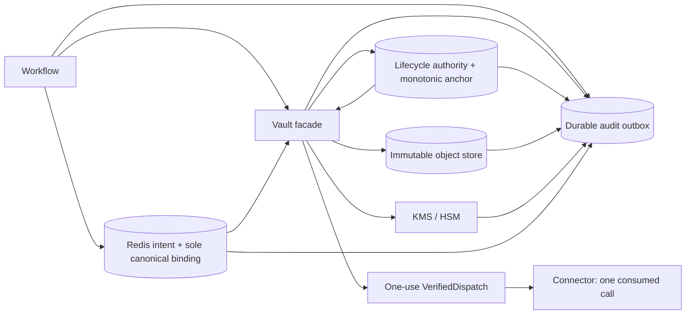

# Durable production request vault and KMS boundary

**Status:** seventh corrected provider-neutral design submitted for independent rereview; authoritative `docs/21` findings remain `PVK-RR5-01: BLOCKING` and `PVK-RR5-02: MAJOR`; no implementation or production authorization  
**Date:** 2026-08-02  
**Normative language:** MUST, MUST NOT, SHOULD, and MAY are requirements in the RFC 2119 sense.  
**Evidence boundary:** repository documents and delivered source only; no external system, provider account, credential, resource, SDK, production secret, production connector, or production dispatch was used.

## 1. Purpose and current baseline

This document freezes the provider-neutral security, encoding, consistency, lifecycle, failure, identity, audit, and evidence contracts for a future durable encrypted request-material boundary. It incorporates the review lineage in [`docs/16-production-vault-kms-design-review.md`](16-production-vault-kms-design-review.md), [`docs/17-production-vault-kms-design-rereview.md`](17-production-vault-kms-design-rereview.md), [`docs/18-production-vault-kms-design-rereview.md`](18-production-vault-kms-design-rereview.md), [`docs/19-production-vault-kms-design-rereview.md`](19-production-vault-kms-design-rereview.md), [`docs/20-production-vault-kms-design-rereview.md`](20-production-vault-kms-design-rereview.md), and the authoritative independent rereview of the sixth correction in [`docs/21-production-vault-kms-design-rereview.md`](21-production-vault-kms-design-rereview.md). `docs/21` issued `PVK-RR5-01` as `BLOCKING` and `PVK-RR5-02` as `MAJOR`, disposed `PVK-RR4-05` as `PARTIALLY RESOLVED` and `PVK-RR4-06` as `RESOLVED`, and classified the provider-neutral design `REQUIRES REVISION`, design completeness `NOT VERIFIED`, and bounded provider-neutral Stage 2 `NO-GO`. This seventh correction addresses only `PVK-RR5-01` and `PVK-RR5-02`: one authenticated target-class provider projection and complete trusted-time/signature/fact/aggregate fixture oracles. The corrections are self-authored submissions awaiting another independent read-only rereview; they do not alter or resolve the independent dispositions. This revision does not implement any interface, schema, codec, vault, KMS/HSM adapter, backend, provider integration, connector, deployment, activation path, or dispatch path.

The governing conclusion remains:

> Ambiguity, corruption, and contention are detectable; the system fails closed.

| Item | Current classification | Exact scope |
|---|---|---|
| Repository enforcement | **VERIFIED** | Delivered repository-defined Phase 2 mutation paths and test-only composition |
| P2-004 | **CLOSED within repository scope** | Exact immutable request binding and modeled repository transport boundary |
| P2-010 | **CLOSED within repository-defined Phase 2 mutation scope** | Typed safe-value reductions across reviewed repository paths |
| Existing tests | **Historical: 611 passed; not rerun in this correction** | Prior recorded suite result only; it confirms the delivered repository baseline, not this design |
| Provider-neutral design | **REQUIRES REVISION** | Exact independent `docs/21` disposition; this seventh correction is only a submitted response to `PVK-RR5-01` and `PVK-RR5-02` |
| Design completeness | **NOT VERIFIED** | Exact independent `docs/21` disposition; another independent read-only rereview is required |
| Agent Execution Protocol compatibility | **VERIFIED AT PROVIDER-NEUTRAL DESIGN LEVEL** | Exact `docs/21` gate; this is not implementation, provider, or production evidence |
| Durable production vault/KMS implemented | **NO** | Design only |
| Provider-specific durability verified | **NO** | No provider evidence |
| Production applicability | **NO-GO** | Production implementation, provider, operational, connector, and activation evidence are absent |
| First production connector | **NO-GO** | Prerequisite vault/KMS gates have not passed |
| Production non-idempotent dispatch | **NO-GO** | Must remain disabled |

Repository closure is not production closure. `TestOnlyInMemoryRequestVault` remains process-local, non-durable, and test-only. Passing existing tests does not resolve a design finding and does not prove provider durability, linearization, KMS behavior, IAM, audit delivery, retention, deletion, backup, availability, or regional behavior.

### 1.1 Evidence precedence and correction boundary

The final delivered-tree closure evidence in `docs/14` and the final `2026-07-31` implementation-report addendum governs the repository baseline. The earlier authoritative dispositions retained through `docs/19` are unchanged. The current authoritative rereview is `docs/21`: `PVK-RR5-01` is `BLOCKING`; `PVK-RR5-02` is `MAJOR`; `PVK-RR4-05` is `PARTIALLY RESOLVED`; and `PVK-RR4-06` is `RESOLVED`. Provider-neutral design is `REQUIRES REVISION`; design completeness is `NOT VERIFIED`; AEP compatibility is `VERIFIED AT PROVIDER-NEUTRAL DESIGN LEVEL`; bounded provider-neutral Stage 2 is `NO-GO`. `docs/21` preserved the four fifth-correction subjects exactly as follows: authenticated deletion timing policy `RESOLVED`; complete cryptographic retention semantics `PARTIALLY RESOLVED`; constructible deletion revalidation `RESOLVED`; offline provider-evidence reconstruction `PARTIALLY RESOLVED`. It also preserved `PVK-RR3-01: RESOLVED`, `PVK-RR3-02: RESOLVED`, `PVK-RR3-03: PARTIALLY RESOLVED`, `PVK-RR3-04: RESOLVED`, and `PVK-RR3-05: PARTIALLY RESOLVED`. This seventh self-authored correction does not promote any disposition. Every implementation and production gate remains `NO-GO` pending another independent read-only rereview.

The delivered `.git` directory is empty, so Git cannot establish historical additions, deletions, or test weakening. This revision therefore uses current-tree reads and pre/post content manifests. It does not fabricate Git history.

### 1.2 Corrected-design claim boundary

This revision may claim only that the earlier correction text remains and that explicit seventh-correction contracts responding to `PVK-RR5-01` and `PVK-RR5-02` are submitted in this document. `PVK-RR5-01` remains independently `BLOCKING` and `PVK-RR5-02` independently `MAJOR` until another independent rereviewer accepts or rejects these exact bytes. This revision does not self-certify adequacy and does not mark any contract implemented, tested, independently accepted, provider-supported, operationally configured, or production-ready. Provider facts named as dependencies remain open until a provider is selected in a later authorized stage.

## 2. Scope and exclusions

This design covers future provider-neutral contracts for:

- a versioned binary envelope that preserves the delivered 1 MiB request limit without claiming conformance of the whole envelope to the 1 MiB JSON-document limit;
- an explicit production request-binding schema distinct from the delivered test-only binding;
- exact AAD, KMS-context, digest, link, selector, lifecycle, audit, and identifier encodings;
- create-once storage, exact-version reads, authenticated lifecycle routing, KMS/HSM wrap and exact-version unwrap, rewrap, holds, deletion, tombstones, and audit acceptance;
- phase-specific certainty, retry, cancellation, acknowledgement, quarantine, and dispatch effects; and
- later contract, provider, operational, and independent-review evidence stages.

This stage expressly excludes:

- modifying source, tests, configuration, reports, `docs/16`, `docs/17`, `docs/18`, `docs/19`, `docs/20`, `docs/21`, or any other document;
- implementing Stage 2, a codec, schema object, interface, adapter, backend, probe, connector, provider client, deployment, or activation path;
- selecting or accessing a cloud, KMS, HSM, object store, Redis resource, audit service, account, credential, region, or external system;
- installing dependencies or creating production resources;
- treating design text, mocks, deterministic adapters, or emulators as provider evidence; and
- claiming exactly-once external effects, cross-system atomicity, universal non-disclosure, guaranteed deletion, guaranteed nonce uniqueness, or guaranteed memory erasure.

## 3. Existing repository invariants

A later implementation MUST preserve all of the following without compatibility shortcuts:

1. The complete canonical binding bytes recovered from Redis record/2 `canonical_request_binding_b64` under the exact `BASE64URL_UNPADDED/1` decoder remain the sole authoritative request-binding value. Creation, every bound intent mutation, and preflight compare all recovered bytes exactly; the encoding, length, digest, and projections are validation aids, never alternate authority.
2. The delivered `aep.canonical-json/1` request codec retains its 1,048,576-byte document cap, 128-level nesting cap, strict UTF-8/NFC, duplicate rejection, deterministic object ordering, no floats/NaN/infinity, interoperable integer range, and order-preserving arrays.
3. Raw Redis state is validated before lease, TTL, version, status, marker, ledger, binding-version, or other semantic interpretation.
4. Execution, intent, step, connector, operation/version, endpoint profile/version, credential binding/version, wire codec, locator/material identity, creation-key identity/version, and deadlines are immutable for an intent.
5. Exact material, safe descriptor, protected commitments, semantic fingerprint, binding digest, and exact canonical binding are reconstructed before dispatch authority.
6. Vault metadata is complete, canonical, and authenticated. Alteration is an integrity rejection, never a repair or adoption opportunity.
7. Endpoint-profile and deadline revalidation occurs immediately before provenance issuance.
8. A connector consumes one-use, process-local `VerifiedDispatch`; no raw alternate mutation path exists.
9. Envelope revisions are create-once and immutable. Read-then-write, overwrite, upsert, compare-and-adopt, plaintext fallback, and test-backend fallback are forbidden.
10. V1 precedes I1. Redis intent CAS is followed by same-connection `WAITAOF`; successful CAS alone is not I1.
11. I1 and the complete preflight P1 precede provider transport.
12. At most one application-level non-idempotent mutation attempt is permitted. Automatic mutation retry, redirect replay, and transparent failover are disabled.
13. Recovery is read-only with respect to the external provider and never issues or replays a mutation.
14. Missing, expired, unavailable, ambiguous, malformed, corrupt, mismatched, unauthorized, or unsupported state fails closed.
15. Privacy boundaries use typed bounded reductions, not post-hoc redaction of raw request/provider objects.
16. Production dispatch is disabled by default and remains structurally absent from Stage 2.

The production schema boundary is explicit. Delivered `aep.persisted-request-binding/1` remains valid only for the delivered test-only composition. A future production intent MUST be created as `aep.production-persisted-request-binding/2`; version 1 is never silently reinterpreted, rewritten, or upgraded.

## 4. Threat and trust-boundary model

### 4.1 Security-property vocabulary

| Property | Meaning in this design | Explicit non-claim |
|---|---|---|
| Confidentiality | Plaintext and plaintext DEKs cross only the bounded authorized vault operation scope. | Durability, availability, universal non-disclosure, or memory zeroization |
| Integrity | Frozen codecs, AEAD, hashes, signatures, exact versions, and equality checks detect bounded alterations before dispatch. | Honest behavior by a compromised authorized host/control plane |
| Authenticity | A pinned trust anchor or exact KMS context authenticates the named record/operation. | Provider durability or external execution |
| Durability | A later provider-specific accepted receipt covers a defined fault domain. | Confidentiality, regional survival, or connector effects |
| Availability | A dependency returns a valid result within the original absolute deadline. | Permission to bypass a failed check |
| Outcome certainty | The application can classify a named operation as definitely unchanged, committed, conflicting, or unknown. | Cross-system atomicity |
| External-effect ambiguity | A connector call may have reached a provider without a conclusive outcome. | Permission to replay; exactly-once effects |

### 4.2 Threats, assumptions, and authority separation

The design addresses locator/material substitution, envelope or key-slot swapping, lifecycle rollback/replay, alias drift, duplicate creation, acknowledgement loss, unsafe cancellation/retry, malformed encodings, cross-environment routing, premature deletion, and unsafe telemetry. It assumes reviewed cryptographic libraries, workload identity, the delivered Redis boundary within its documented limits, and later provider correctness only to the exact claims independently established for an exact environment.

The Redis binding, lifecycle authority, object store, KMS/HSM, and audit outbox are distinct authorities:

- Redis alone authorizes the exact request binding.
- The lifecycle authority selects one immutable envelope revision; it never defines request semantics.
- An object-store receipt may establish only an accepted create/read/version/checksum claim after the exact provider mapping is independently verified.
- A KMS/HSM receipt may establish only the exact-key/context operation and safe metadata after the exact provider mapping is independently verified.
- An independently verified audit-outbox receipt may provide the required durable evidence; it never substitutes for Redis, lifecycle, store, or KMS state.

AAD, envelope metadata, receipts, lifecycle records, and audit events may contain exact authenticated copies of binding fields or the binding digest. They MUST NOT become alternate request-binding authorities.

### 4.3 Component trust contracts

| Component | Positive authority | Forbidden authority/data | Failure behavior |
|---|---|---|---|
| Workflow | Builds exact request, binding, deadlines, and Redis intent under an approved profile. | Master keys, raw provider responses, storage/KMS administration, alternate binding authority. | Any dependency failure blocks transport. |
| Vault facade | Sole owner of binding/AAD/context/envelope codecs, authenticated material scope, dispatch-audit gate, and one-use issuance. | Provider mutation credentials, binding mutation after I1, raw SDK leakage, returned plaintext authority. | Returns frozen result/error types only; dispatch returns only `AuthorizeDispatchResult` containing one `VerifiedDispatch`. |
| Object-store adapter | Exact immutable create/read/status/delete and provider receipt reduction. | Plaintext, DEK, connector credentials, latest-version authority. | Unknown mutations require exact reconciliation. |
| Lifecycle authority | Signed genesis/control, monotonic anchor, selector/hold/deletion CAS. | Request plaintext, DEK, Redis binding creation, connector access. | Missing/rollback/conflict/unknown blocks routing. |
| KMS/HSM adapter | Exact immutable key resolution, wrap/unwrap/rewrap, safe metadata. | Request plaintext/ciphertext, aliases at read, alternate-key trial, master-key export. | No key/backend fallback. |
| Redis ledger | Sole exact canonical binding plus intent state and durability barrier. | Vault crypto artifacts or inferred binding repair. | Raw-state failure precedes semantic interpretation. |
| Connector | One consumed capability and one modeled mutation attempt. | Vault/KMS admin, unverified material, retry/replay. | Unknown transport remains ambiguous. |
| Audit outbox | Conditional append and exact acknowledgement reconciliation of typed events. | Raw request/crypto/provider objects or authority over primary state. | Unknown acknowledgement fails closed. |
| Operators/deployment | Reviewed configuration, holds, incident and key decisions under separated roles. | Routine plaintext access or unilateral destructive/decrypt authority. | Missing authorization keeps production disabled. |

## 5. Provider-neutral component architecture

### 5.1 Trust-boundary flow



### 5.2 Durable object set and authority

One `VaultLocator` names these distinct records:

- immutable binary envelope revisions encoded as `aep.production-vault-envelope-lf/1`;
- one immutable signed `aep.vault-lifecycle-genesis/1` record created after revision 1 is durably read back;
- immutable signed `aep.vault-active-selector/1` generation records plus one lifecycle-authority head whose generation begins at 1 and advances only by CAS;
- one non-decreasing `aep.vault-monotonic-anchor/1` head maintained by the lifecycle authority and bound to the selector hash;
- separate signed hold, deletion-decision, and tombstone records; and
- the exact signed active DeletionTimingPolicy/1 plus immutable configuration receipt for its environment/namespace; and
- exact primary-result manifests, provider evidence packages/receipts, complete retention facts/commitments, and audit receipts retained according to policy.

Selector absence never means revision 1. A dispatch reader requires the exact genesis, selector generation, selector signature, monotonic anchor, and selected envelope binding. Historical revisions may be inspected or recovered only through non-dispatching administrative flows; they never become automatically eligible because a selected revision is unavailable.

### 5.3 Required durable points

Define:

- **V1:** immutable revision 1 received an accepted durable-create receipt and exact readback for the same payload hash/version/checksum.
- **L1:** signed genesis, selector generation 1, and monotonic anchor generation 1 are durably acknowledged and mutually exact.
- **A1:** the required `vault.create.durable` event has an exact durable audit-outbox acknowledgement.
- **I1:** `ABOUT_TO_FIRE` with the exact authoritative production binding is CAS-written and acknowledged by same-connection `WAITAOF`.
- **P1:** one `authorize_dispatch` invocation completed raw-state validation, exact preflight/reload, authenticated lifecycle selection, immutable envelope/KMS/AEAD verification, full binding reconstruction, endpoint/deadline revalidation, received a direct `NEW` dispatch-audit acknowledgement, and delivered one-use provenance. Historical/reconciled audit evidence never creates P1.

The order is `V1 -> L1 -> A1 -> I1 -> P1 -> at most one connector mutation call`. V1 remains before I1. No point proves an external provider effect, and there is no cross-system transaction.

## 6. Interface contracts

### 6.1 Common frozen call, result, and error types

All methods accept the strict process-local, non-serializable `CallContext { operation_id: OperationId, deadline_monotonic_ns: MonoNs, cancellation: CancellationToken }`. `deadline_monotonic_ns` is sampled once in the calling process and never persisted or reset. `CancellationToken` is the strict process-local object `{ token_id: RandomId32, state: ACTIVE|CANCEL_REQUESTED }`: `RandomId32` is 32 CSPRNG bytes; `token_id` has no text, audit, log, metric, receipt, or persistence form; `state` changes atomically at most once from `ACTIVE` to `CANCEL_REQUESTED` and cannot be reset. The token conveys no provider cancellation guarantee. An adapter reports one `CancellationPhase`:

`BEFORE_VALIDATION`, `BEFORE_SUBMISSION`, `AFTER_SUBMISSION_OUTCOME_KNOWN`, `AFTER_SUBMISSION_OUTCOME_UNKNOWN`, `NOT_CANCELLED`.

Every success and failure includes the method enum, `OutcomeCertainty`, `RetryDirective`, `AcknowledgementState`, `DispatchEligibility`, cancellation phase, start/end monotonic times, and one `SafeOperationEvidence`. The frozen enums are:

- `OutcomeCertainty`: `DEFINITE_NO_CHANGE`, `DEFINITE_CONFLICT`, `COMMITTED`, `HISTORICAL_COMMITTED`, `UNKNOWN`, `NOT_APPLICABLE`.
- `RetryDirective`: `NEVER`, `RETRY_READ_SAME_TARGET_WITHIN_DEADLINE`, `RETRY_SAME_IDEMPOTENT_OPERATION_WITHIN_DEADLINE`, `RECOMPUTE_FRESH_EPHEMERAL_CRYPTO_BEFORE_PERSISTENCE`, `RECONCILE_EXACT_TARGET`, `REBASE_AUTHORIZED_CAS`, `OPERATOR_REQUIRED`.
- `AcknowledgementState`: `NONE`, `NEW`, `HISTORICAL`, `UNKNOWN`.
- `DispatchEligibility`: `INELIGIBLE`, `ELIGIBLE_ORIGINAL_WORKER_ONCE`, `EXPIRED`, `QUARANTINED`.
- `CancellationPhase`: the five values above.
- `DependencyFailure`: `INVALID_INPUT`, `UNSUPPORTED_VERSION`, `MALFORMED_ENCODING`, `SIZE_LIMIT`, `CONFIGURATION`, `PERMISSION`, `WRONG_SCOPE`, `NOT_FOUND`, `CONFLICT`, `PRECONDITION`, `TIMEOUT`, `CANCELLED`, `THROTTLED`, `UNAVAILABLE`, `UNEXPECTED_VERSION`, `CHECKSUM`, `AUTHENTICATION`, `INTEGRITY`, `ROLLBACK`, `REPLAY`, `ACKNOWLEDGEMENT_UNKNOWN`, `RETENTION`, `KEY_DISABLED`, `KEY_PENDING_DESTRUCTION`, `KEY_DESTROYED`, `AUDIT_REJECTED`, `DECISION_EXPIRED`, `TIMING_POLICY_EXPIRED`, `GRACE_NOT_REACHED`, `TRUSTED_TIME_STALE`, `AUTHORITY_CONTEXT_MISMATCH`, `SIGNED_DECISION_MISMATCH`, `INVALID_TIME_INTERVAL`, `ARITHMETIC_OVERFLOW`.
- `RetryEligibility`: `NO`, `SAFE_READ_ONLY`, `SAFE_IDEMPOTENT_SAME_BYTES`, `SAFE_FRESH_EPHEMERAL_BEFORE_PERSISTENCE`, `RECONCILIATION_ONLY`, `AUTHORIZED_REBASE_ONLY`.
- `QuarantineReason`: `NONE`, `MALFORMED_CANONICAL`, `ENVELOPE_INTEGRITY`, `AAD_MISMATCH`, `KMS_CONTEXT_MISMATCH`, `AEAD_FAILURE`, `BINDING_MISMATCH`, `GENESIS_MISSING`, `SELECTOR_MISSING`, `SELECTOR_AUTH_FAILURE`, `SELECTOR_ROLLBACK`, `SELECTOR_CONFLICT`, `RECEIPT_MISMATCH`, `CROSS_SCOPE_IDENTITY`.
- `RequestedDeletionClass`: `NO_PROVIDER_CALL`, `POLICY_DENIAL`, `DELETE_CIPHERTEXT_VERSION`. This enum is authorization input; it is never inferred from an achieved state.
- `DeletionClass`: `NONE`, `LOGICAL_DENIAL`, `CIPHERTEXT_VERSION_DELETED`, `WRAPPED_SLOT_INACCESSIBLE`, `KEY_RETIRED`, `CRYPTOGRAPHICALLY_INACCESSIBLE_CURRENT_PATHS`, `PROVIDER_BACKUP_RETENTION_PENDING`. This enum reports policy or achieved state and is not itself provider-call authority.
- `DurabilityClass`: `APPLICATION_CONTRACT_ONLY`, `PROVIDER_SINGLE_FAULT_DOMAIN`, `PROVIDER_MULTI_ZONE`, `PROVIDER_MULTI_REGION`, `UNKNOWN`. Only an independently accepted provider mapping may emit a `PROVIDER_*` value; contract backends emit only `APPLICATION_CONTRACT_ONLY`, and any unresolved receipt emits `UNKNOWN`.
- `DispatchEffect`: `NO_AUTHORITY`, `AUTHORITY_BLOCKED`, `AUTHORITY_ISSUED_ONCE`, `AUTHORITY_CONSUMED`, `AUTHORITY_LOST`, `NOT_APPLICABLE`.
- `AuditRequirement`: `GATING_DURABLE`, `MANDATORY_BEST_EFFORT`, `OMITTED_BY_DESIGN`. `GATING_DURABLE` requires a `NEW` or, outside dispatch issuance, exact `HISTORICAL` receipt before the next boundary. `MANDATORY_BEST_EFFORT` makes exactly one append call, never changes the already fail-closed primary result, and alerts on rejection/unknown. `OMITTED_BY_DESIGN` makes no audit call only for local pre-crypto validation, audit methods themselves, a crash before the audit boundary, an explicitly `RECOVERY_READ_ONLY` inspection, or an unauthenticated inventory candidate whose identity is deliberately insufficient to construct a safe authoritative event.
- `ReconciliationDirective`: `NONE`, `READ_OBJECT_STATUS_EXACT`, `READ_SELECTOR_AND_ANCHOR_EXACT`, `READ_CONTROL_RECORD_EXACT`, `READ_TOMBSTONE_EXACT`, `INSPECT_AUDIT_APPEND_EXACT`, `READ_REDIS_RAW_EXACT`, `OPERATOR_INVESTIGATION`.

`CallCountVector` is the strict object `{ O, K, L, R, W, A, C }`; every member is a JSON integer `0..2^32-1`, every member is required, and no other member is allowed. `O/K/L/R/W/A/C` have the meanings in Section 10. Counts are per named high-level invocation and never erase historical calls or acknowledgements.

`Method` is the closed set of exact method literals in the first column of the Sections 6.2-6.6 interface tables; adding, aliasing, or case-changing a method requires a new contract version. Every externally returned typed result, including a receipt and a failure, contains exactly one **top-level** strict `OperationResultMeta { meta_schema: "aep.operation-result-meta/1", method: Method, dependency_failure: DependencyFailure|null, reason_code: ReasonCode, outcome_certainty: OutcomeCertainty, retry_directive: RetryDirective, acknowledgement_state: AcknowledgementState, acknowledgement_uncertain: boolean, dispatch_eligibility: DispatchEligibility, dispatch_effect: DispatchEffect, cancellation_phase: CancellationPhase, quarantine_reason: QuarantineReason, reconciliation_directive: ReconciliationDirective, audit_requirement: AuditRequirement, call_counts: CallCountVector, started_monotonic_ns: MonoNs, ended_monotonic_ns: MonoNs, safe_evidence: SafeOperationEvidence }`. A nested durable receipt is preserved evidence from a separate earlier method result and retains its own historical top-level meta; it is not the enclosing method's meta and cannot widen the enclosing result. Success has `dependency_failure=null` and `reason_code=OK`; failure has one `DependencyFailure` and the unique Section 13.1 mapped `ReasonCode`. `acknowledgement_uncertain` is true exactly when acknowledgement state is `UNKNOWN`; `ended_monotonic_ns >= started_monotonic_ns`; every duplicated safe-evidence field is byte/value-equal. A success receipt may use `NEW` or `HISTORICAL`; an uncertain mutation uses only `UNKNOWN`; a definite rejection uses `NONE`. No receipt field may contradict its meta. Internal payload objects nested in the two process-local wrappers contain no `meta`, so each of those wrappers contains exactly one meta in total; the wrapper, not the capability/scope, is the method result.

`SignatureEvidence` is the protected strict object `{ signature_schema: "aep.signature-evidence/1", signed_record_schema: ASCII[1..64], verification_algorithm: "ED25519", verification_key_id: KeyId, verification_public_key_digest: Digest32, signed_record_hash: Digest32, verification_status: "VERIFIED", verified_at_ms: EpochMs }`, at most 1,024 canonical bytes. It is constructed only after local verification with the pinned key. A failed verification returns no `SignatureEvidence`.

`verified_at_ms` is an explicit field, never a default. General evidence remains schema-valid when it uses another exact `EpochMs` satisfying the applicable observation/order rule, but its canonical `SignatureEvidence` bytes and hash are different. Every named Section 14.5 golden fixture instead freezes the literal equality `verified_at_ms=observed_at_ms`; a different schema-valid verification time is a different fixture and cannot satisfy the named golden hash or commitment.

`RecoveryOperationIdentity` is the protected strict object `{ identity_schema: "aep.production-recovery-operation-identity/1", environment_id: EnvironmentId, execution_id: CanonicalUuid4, intent_id: CanonicalUuid4, step_id: SafePersistedId, attempt: U64, connector_identity: RegistryId, connector_operation: RegistryId, operation_version: RegistryId, request_binding_digest: Digest32, endpoint_profile_id: RegistryId, endpoint_profile_version: RegistryId, credential_binding_id: RegistryId, credential_binding_version: RegistryId, wire_codec_version: RegistryId }`. `ProductionRecoveryResolutionAuthorization` is `{ authorization_schema: "aep.production-recovery-resolution-authorization/1", operation_identity_hash: Digest32, expected_permanent_progress_hash: Digest32, expected_observation_count: integer 1..60, authorized_observation_ordinal: integer 2..61, issued_at_ms: EpochMs, expires_at_ms: EpochMs, approver_ids: array[2] of distinct ApproverId sorted by bytes, exact_signed_authorization_bytes: bytes[1..8_192], authorization_hash: Digest32, signature_evidence: SignatureEvidence }`. The exact signed record contains all fields through `approver_ids`; its Ed25519 input is `LF32("AEP-PRODUCTION-RECOVERY-RESOLUTION-AUTHORIZATION-SIGNATURE-V1", canonical_unsigned_bytes)`. `authorized_observation_ordinal=expected_observation_count+1`, expiry is later than issue, and identity/prior-progress hashes equal the persisted terminal state. `ProductionRecoveryReadInput` is the strict object `{ input_schema: "aep.production-recovery-read-input/1", operation_identity: RecoveryOperationIdentity, recovery_capability: POSITIVE_ONLY_READBACK|AUTHORITATIVE_READBACK, observation_ordinal: integer 1..61, operator_resolution: boolean, operator_authorization: ProductionRecoveryResolutionAuthorization|null, call_context: CallContext }`. Automatic input requires `operator_resolution=false` and null authorization. Operator input requires true, `AUTHORITATIVE_READBACK`, and a valid unexpired two-approver signed authorization bound to the exact permanent progress/count/next ordinal.

`ProductionRecoveryReadResult` is the one named result `{ result_schema: "aep.production-recovery-read-result/1", operation_identity: RecoveryOperationIdentity, observation_ordinal: integer 1..61, outcome: APPLIED|NOT_APPLIED|CONFLICT|UNKNOWN, evidence_authority: POSITIVE_ONLY|AUTHORITATIVE, provider_read_receipt_reference_digest: Digest32|null, external_reference_evidence: ProductionExternalReferenceEvidence|null, recovery_readback_call_count: 1, meta: OperationResultMeta }`. Invocation of `read_production_outcome_exact` always performs exactly one read-only provider-status call, so its result's `recovery_readback_call_count` is the JSON integer `1`; there is no invoked-method result with another value. Authenticated `APPLIED|NOT_APPLIED` is success with `dependency_failure=null`, `reason_code=OK`, `outcome_certainty=COMMITTED`, `acknowledgement_state=NEW`, `retry_directive=NEVER`, and an exact-operation receipt reference. `CONFLICT` is `CONFLICT/CONFLICT`, `DEFINITE_CONFLICT/NONE/NEVER`, while its protected exact-operation evidence is retained. `UNKNOWN` is `ACKNOWLEDGEMENT_UNKNOWN/ACKNOWLEDGEMENT_UNKNOWN`, `UNKNOWN/UNKNOWN/NEVER`, with null receipt/evidence. `APPLIED` also requires matching external-reference evidence; `NOT_APPLIED` requires it null and is terminal-success evidence only when `evidence_authority=AUTHORITATIVE`. All results are `OMITTED_BY_DESIGN`, `AUTHORITY_BLOCKED/INELIGIBLE`, and cannot be retried automatically. `operator_resolution=true` is valid only for the authenticated operator input above and an enclosing persisted status of `PERMANENTLY_AMBIGUOUS`. `NO_READBACK` never invokes this method, emits no `ProductionRecoveryReadResult`, makes zero readback calls, and constructs only the local `NO_READBACK` recovery observation authorized below. The method has no provider mutation operation, credential, request payload, redirect, failover, or capability result.

`ProviderIdentity` is the immutable protected object `{ identity_schema: "aep.provider-identity/1", environment_id: EnvironmentId, provider_id: RegistryId, account_id: AccountId, region_id: RegionId, adapter_id: AdapterId }`. Every provider fact, result, receipt, reference, target, package, deletion authority, and retained projection compares all five identity fields exactly; an adapter identity never substitutes for provider/account/region/environment identity. `ProviderRetentionTarget` is superseded by the strict object `{ target_schema: "aep.provider-retention-target/2", lifecycle_target: LifecycleTarget, envelope_target: ExactEnvelopeTarget, envelope_hash: Digest32, provider_version_token: ProviderVersionToken, provider_checksum: Digest32, provider_identity: ProviderIdentity, material_identity_hash: Digest32 }`. The material-identity hash covers every preceding target field in that order. Version 1 is not accepted at a retention/deletion boundary. `retention_generation` is `1..2^53-1` and names one epoch for exactly that target and provider identity. A lock or backup token is opaque `ProviderVersionToken` scoped to the exact target, identity, and generation; successor state requires a strictly greater generation and never silently replaces the expected tuple.

`RetentionFactState` is exactly `ACTIVE|INACTIVE|UNKNOWN`; `RetentionFactClassification` is exactly `ACTIVE_EXACT|RELEASED_EXACT|PENDING|CONFLICT|UNKNOWN|DELETION_REQUESTED_UNKNOWN|DELETION_REQUESTED_ACKNOWLEDGED|DELETION_ACHIEVED_EXACT|TOMBSTONED_EXACT`; `BackupCondition` is exactly `NOT_APPLICABLE|PENDING|RELEASED|PURGED|UNKNOWN`; `RetentionSource` remains exactly `LEGAL_HOLD|PROVIDER_RETENTION_LOCK|BACKUP_PENDING|LIFECYCLE_HOLD|HOLD_RELEASE|MINIMUM_RETENTION_DEADLINE|DELETION_REQUESTED|DELETION_ACHIEVED`; and `RetentionEvidenceClass` remains exactly `SIGNED_HOLD|SIGNED_RELEASE|PROVIDER_RETENTION_RECEIPT|PROVIDER_BACKUP_RECEIPT|SIGNED_LIFECYCLE_CONTROL|PROVIDER_DELETE_RECEIPT|SIGNED_TOMBSTONE`.

`RetentionFact/3` is superseded and MUST NOT be accepted. `RetentionFact` is now the protected strict canonical package `{ fact_schema: "aep.retention-fact/4", target: LifecycleTarget, source: RetentionSource, evidence_class: RetentionEvidenceClass, fact_id: LifecycleDecisionId|OperationId|TombstoneId, immutable_evidence_target: LifecycleTarget|ProviderRetentionTarget/2|ExactEnvelopeTarget, execution_id: CanonicalUuid4|null, intent_id: CanonicalUuid4|null, request_binding_digest: Digest32|null, envelope_hash: Digest32|null, material_identity_hash: Digest32|null, provider_identity: ProviderIdentity|null, provider_version_token: ProviderVersionToken|null, provider_checksum: Digest32|null, state: RetentionFactState, classification: RetentionFactClassification, retention_generation: U64|null, provider_lock_token: ProviderVersionToken|null, provider_backup_token: ProviderVersionToken|null, effective_from_ms: EpochMs, effective_not_after_ms: EpochMs|null, release_time_ms: EpochMs|null, release_link_identity: Digest32|null, deletion_authority_context_hash: Digest32|null, deletion_decision_id: LifecycleDecisionId|null, deletion_decision_hash: Digest32|null, control_record_hash: Digest32|null, control_idempotency_key: ControlIdempotencyKey|null, requested_deletion_class: RequestedDeletionClass|null, achieved_deletion_class: DeletionClass|null, backup_condition: BackupCondition, observed_at_ms: EpochMs, trusted_time_evidence: TrustedTimeEvidence, trusted_time_evidence_hash: Digest32, exact_raw_evidence_encoding: "BASE64URL_UNPADDED/1", exact_raw_evidence_b64: string[2..21_846], raw_evidence_hash: Digest32, provider_evidence_package: ProviderRetentionEvidencePackage/1|null, provider_evidence_package_hash: Digest32|null, primary_result_hash: Digest32|null, receipt_class: ReceiptClass|null, receipt_reference_digest: Digest32|null, signature_evidence: SignatureEvidence, signature_evidence_hash: Digest32, timing_policy_id: RegistryId|null, timing_policy_version: U64|null, timing_policy_digest: Digest32|null, required_observation_interval_ms: U64|null, retention_fact_commitment_hash: Digest32 }`. Every nullable scalar is present as JSON null. The exact raw bytes decode to `1..16_384` bytes, strict-round-trip through the table-selected schema, and hash independently from the semantic commitment. For provider facts these raw bytes are exactly the signed durable receipt-evidence/3 bytes; the separate package hash binds the retained primary manifest and trusted-time chain. The trusted-time center equals `observed_at_ms`, its maximum error is within the authenticated deletion timing policy when the policy fields are non-null, and its hash is recomputed. No field that can affect classification or deletion eligibility exists outside this object or the exact evidence packages it embeds.

The only non-provider raw schemas accepted by fact/4 are the three complete V2 signed envelopes below and canonical signed `aep.vault-tombstone/2`. The former partial definition is superseded and is not an alternative accepted form. All objects use strict `aep.canonical-json/1`; the member lists below are complete and their displayed declaration order is exact, while canonical serialization orders the same complete member set lexicographically as Section 7.1 requires. Every listed member is required. A nullable member is encoded as JSON `null`; omission, an implicit default, or an extra member is malformed. Each unsigned record is `1..8_192` canonical bytes. Each signed envelope is `1..16_384` canonical bytes; its `exact_unsigned_record_b64` is exactly `2..10_923` canonical unpadded base64url characters decoding to the named unsigned bytes. `U64` is `1..2^53-1`, every time is `EpochMs`, every digest/signature/ID uses Section 7.1, and no numeric string or float is accepted.

`RetentionHoldEvidenceUnsigned/2` is exactly `{ authority_id: IssuerId; backup_condition: NOT_APPLICABLE; control_generation: U64; effective_from_ms: EpochMs; effective_not_after_ms: EpochMs|null; environment_id: EnvironmentId; envelope_hash: Digest32; evidence_class: SIGNED_HOLD; execution_id: CanonicalUuid4; hold_id: LifecycleDecisionId; intent_id: CanonicalUuid4; material_identity_hash: Digest32; observed_at_ms: EpochMs; release_link_identity: null; release_time_ms: null; request_binding_digest: Digest32; required_observation_interval_ms: U64|null; retention_classification: ACTIVE_EXACT; retention_source: LEGAL_HOLD|LIFECYCLE_HOLD; retention_state: ACTIVE; target: LifecycleTarget; timing_policy_digest: Digest32|null; timing_policy_id: RegistryId|null; timing_policy_version: U64|null; trusted_time_evidence_hash: Digest32; unsigned_schema: "aep.retention-hold-evidence-unsigned/2"; verification_key_id: KeyId }`. Its exact signed envelope `SignedRetentionHoldEvidence/2` is `{ canonical_encoding: "aep.canonical-json/1"; exact_unsigned_record_b64: string[2..10_923]; signature: Signature64; signature_algorithm: "ED25519"; signed_evidence_schema: "aep.signed-retention-hold-evidence/2"; unsigned_record_hash: Digest32; unsigned_record_schema: "aep.retention-hold-evidence-unsigned/2"; verification_key_id: KeyId }`. The policy ID/version/digest/interval are all null exactly for an indefinite `LEGAL_HOLD` (`effective_not_after_ms=null`) and are all non-null otherwise. A non-null deadline is strictly greater than `effective_from_ms`; `observed_at_ms>=effective_from_ms`; `target.environment_id=environment_id`; and release/deletion/provider/receipt/package fields are prohibited because they are not envelope or unsigned-record members.

`HoldReleaseEvidenceUnsigned/2` is exactly `{ authority_id: IssuerId; backup_condition: NOT_APPLICABLE; control_generation: U64; effective_from_ms: EpochMs; effective_not_after_ms: null; environment_id: EnvironmentId; envelope_hash: Digest32; evidence_class: SIGNED_RELEASE; execution_id: CanonicalUuid4; intent_id: CanonicalUuid4; material_identity_hash: Digest32; observed_at_ms: EpochMs; release_id: LifecycleDecisionId; release_link_identity: Digest32; release_time_ms: EpochMs; released_control_generation: U64; released_fact_commitment_hash: Digest32; released_fact_id: LifecycleDecisionId; released_hold_source: LEGAL_HOLD|LIFECYCLE_HOLD; request_binding_digest: Digest32; required_observation_interval_ms: U64; retention_classification: RELEASED_EXACT; retention_source: HOLD_RELEASE; retention_state: INACTIVE; target: LifecycleTarget; timing_policy_digest: Digest32; timing_policy_id: RegistryId; timing_policy_version: U64; trusted_time_evidence_hash: Digest32; unsigned_schema: "aep.hold-release-evidence-unsigned/2"; verification_key_id: KeyId }`. Its exact signed envelope `SignedHoldReleaseEvidence/2` is `{ canonical_encoding: "aep.canonical-json/1"; exact_unsigned_record_b64: string[2..10_923]; signature: Signature64; signature_algorithm: "ED25519"; signed_evidence_schema: "aep.signed-hold-release-evidence/2"; unsigned_record_hash: Digest32; unsigned_record_schema: "aep.hold-release-evidence-unsigned/2"; verification_key_id: KeyId }`. Exactly `effective_from_ms=release_time_ms`, `effective_not_after_ms=null`, `release_link_identity=released_fact_commitment_hash`, `control_generation=released_control_generation+1` under checked arithmetic, and `observed_at_ms>=release_time_ms`. The released fact must be the already verified same-target/environment/execution/intent/binding/material/envelope hold with the named ID/source/generation/commitment; an unknown or absent fact cannot be released. Provider, deletion, backup-token, primary-result, receipt, and package members are prohibited.

`LifecycleRetentionControlUnsigned/2` is exactly `{ authority_id: IssuerId; backup_condition: NOT_APPLICABLE; control_generation: U64; control_id: LifecycleDecisionId; control_kind: MINIMUM_RETENTION_DEADLINE; effective_from_ms: EpochMs; effective_not_after_ms: EpochMs; environment_id: EnvironmentId; envelope_hash: Digest32; evidence_class: SIGNED_LIFECYCLE_CONTROL; execution_id: CanonicalUuid4; intent_id: CanonicalUuid4; material_identity_hash: Digest32; observed_at_ms: EpochMs; release_link_identity: null; release_time_ms: null; request_binding_digest: Digest32; required_observation_interval_ms: U64; retention_classification: ACTIVE_EXACT; retention_source: MINIMUM_RETENTION_DEADLINE; retention_state: ACTIVE; target: LifecycleTarget; timing_policy_digest: Digest32; timing_policy_id: RegistryId; timing_policy_version: U64; trusted_time_evidence_hash: Digest32; unsigned_schema: "aep.lifecycle-retention-control-unsigned/2"; verification_key_id: KeyId }`. Its exact signed envelope `SignedLifecycleRetentionControl/2` is `{ canonical_encoding: "aep.canonical-json/1"; exact_unsigned_record_b64: string[2..10_923]; signature: Signature64; signature_algorithm: "ED25519"; signed_evidence_schema: "aep.signed-lifecycle-retention-control/2"; unsigned_record_hash: Digest32; unsigned_record_schema: "aep.lifecycle-retention-control-unsigned/2"; verification_key_id: KeyId }`. Exactly `effective_not_after_ms>effective_from_ms`, `observed_at_ms>=effective_from_ms`, and both release members are explicit null. Hold/release identities, provider/deletion fields, tokens, primary-result, receipt, and package members are prohibited.

For the three envelopes, `unsigned_record_hash` is respectively `SHA-256(LF32("AEP-RETENTION-HOLD-EVIDENCE-UNSIGNED-HASH-V2", exact_unsigned_bytes))`, `SHA-256(LF32("AEP-HOLD-RELEASE-EVIDENCE-UNSIGNED-HASH-V2", exact_unsigned_bytes))`, or `SHA-256(LF32("AEP-LIFECYCLE-RETENTION-CONTROL-UNSIGNED-HASH-V2", exact_unsigned_bytes))`. The Ed25519 input is respectively `LF32("AEP-SIGNED-RETENTION-HOLD-EVIDENCE-SIGNATURE-V2", exact_unsigned_bytes)`, `LF32("AEP-SIGNED-HOLD-RELEASE-EVIDENCE-SIGNATURE-V2", exact_unsigned_bytes)`, or `LF32("AEP-SIGNED-LIFECYCLE-RETENTION-CONTROL-SIGNATURE-V2", exact_unsigned_bytes)`. `SignatureEvidence.signed_record_schema` equals the exact signed-envelope schema, `signed_record_hash` equals the recomputed unsigned-record hash, its algorithm/key/public-key digest/status are exact, and general evidence requires `verified_at_ms>=observed_at_ms`. Named golden fixtures additionally require the literal fixture value `verified_at_ms=observed_at_ms`. Raw-evidence hashes remain the three exact V2 domains in Section 7.3 over the complete signed-envelope bytes, not the unsigned bytes.

Verification order is fixed: (1) strict-decode and canonical-round-trip the signed envelope; (2) reject every unknown/missing field, bad bound, bad enum, bad/implicit null, encoding literal mismatch, or older/other schema; (3) decode and canonical-round-trip the named unsigned record and compare the envelope schema/key projections; (4) recompute and constant-time compare the unsigned-record hash; (5) resolve only the immutable environment-pinned authority/key and verify the Ed25519 signature before constructing `SignatureEvidence`; (6) authenticate the separately carried `TrustedTimeEvidence`, recompute its hash, require its center equal `observed_at_ms`, and enforce active-policy error/age bounds; (7) require exact authority, environment, namespace, target, execution, intent, request-binding, material, envelope, policy, generation, identity, and time equalities; (8) enforce the schema-specific null/prohibited/link rules; and only then (9) project the complete fact and compute its commitment. Unsupported versions map `UNSUPPORTED_VERSION/UNSUPPORTED_VERSION`; malformed/unknown/omitted/default/noncanonical/null violations map `MALFORMED_ENCODING/MALFORMED_ENCODING`; cross-environment/target/execution/intent/binding/material/envelope maps `WRONG_SCOPE/WRONG_SCOPE`; wrong authority/key/signature maps `AUTHENTICATION/AUTHENTICATION_FAILURE`; hash or signed-projection mismatch maps `INTEGRITY/INTEGRITY_FAILURE`; stale time maps `TRUSTED_TIME_STALE/TRUSTED_TIME_STALE`; lower/reused generation maps `REPLAY/REPLAY_DETECTED`; and incompatible same-generation bytes map `CONFLICT/CONFLICT`. Every failure occurs before retention aggregation and deletion authorization.

The normalization notation below is normative, total, and uses the exact RetentionFact/4 field order. `u` is the verified unsigned non-provider record, `e` its exact signed-envelope bytes, `T` its verified trusted-time object, and `S` the just-constructed signature evidence. `B64u(e)` is the unique canonical encoding; `TH=hash(T)`, `SH=hash(S)`, and `RH` is the row-selected recomputed raw hash. Each constructor explicitly assigns every fact field; `commit(all prior assignments)` means canonicalize the complete fact-commitment/4 manifest and compute the Section 7.3 V4 hash.

- `H(u,e,T,S)` for either allowed signed hold is exactly `{ fact_schema="aep.retention-fact/4"; target=u.target; source=u.retention_source; evidence_class=SIGNED_HOLD; fact_id=u.hold_id; immutable_evidence_target=u.target; execution_id=u.execution_id; intent_id=u.intent_id; request_binding_digest=u.request_binding_digest; envelope_hash=u.envelope_hash; material_identity_hash=u.material_identity_hash; provider_identity=null; provider_version_token=null; provider_checksum=null; state=ACTIVE; classification=ACTIVE_EXACT; retention_generation=u.control_generation; provider_lock_token=null; provider_backup_token=null; effective_from_ms=u.effective_from_ms; effective_not_after_ms=u.effective_not_after_ms; release_time_ms=null; release_link_identity=null; deletion_authority_context_hash=null; deletion_decision_id=null; deletion_decision_hash=null; control_record_hash=null; control_idempotency_key=null; requested_deletion_class=null; achieved_deletion_class=null; backup_condition=NOT_APPLICABLE; observed_at_ms=u.observed_at_ms; trusted_time_evidence=T; trusted_time_evidence_hash=TH; exact_raw_evidence_encoding="BASE64URL_UNPADDED/1"; exact_raw_evidence_b64=B64u(e); raw_evidence_hash=RH; provider_evidence_package=null; provider_evidence_package_hash=null; primary_result_hash=null; receipt_class=null; receipt_reference_digest=null; signature_evidence=S; signature_evidence_hash=SH; timing_policy_id=u.timing_policy_id; timing_policy_version=u.timing_policy_version; timing_policy_digest=u.timing_policy_digest; required_observation_interval_ms=u.required_observation_interval_ms; retention_fact_commitment_hash=commit(all prior assignments) }`.
- `R(u,e,T,S)` for the signed release is exactly `{ fact_schema="aep.retention-fact/4"; target=u.target; source=HOLD_RELEASE; evidence_class=SIGNED_RELEASE; fact_id=u.release_id; immutable_evidence_target=u.target; execution_id=u.execution_id; intent_id=u.intent_id; request_binding_digest=u.request_binding_digest; envelope_hash=u.envelope_hash; material_identity_hash=u.material_identity_hash; provider_identity=null; provider_version_token=null; provider_checksum=null; state=INACTIVE; classification=RELEASED_EXACT; retention_generation=u.control_generation; provider_lock_token=null; provider_backup_token=null; effective_from_ms=u.effective_from_ms; effective_not_after_ms=null; release_time_ms=u.release_time_ms; release_link_identity=u.release_link_identity; deletion_authority_context_hash=null; deletion_decision_id=null; deletion_decision_hash=null; control_record_hash=null; control_idempotency_key=null; requested_deletion_class=null; achieved_deletion_class=null; backup_condition=NOT_APPLICABLE; observed_at_ms=u.observed_at_ms; trusted_time_evidence=T; trusted_time_evidence_hash=TH; exact_raw_evidence_encoding="BASE64URL_UNPADDED/1"; exact_raw_evidence_b64=B64u(e); raw_evidence_hash=RH; provider_evidence_package=null; provider_evidence_package_hash=null; primary_result_hash=null; receipt_class=null; receipt_reference_digest=null; signature_evidence=S; signature_evidence_hash=SH; timing_policy_id=u.timing_policy_id; timing_policy_version=u.timing_policy_version; timing_policy_digest=u.timing_policy_digest; required_observation_interval_ms=u.required_observation_interval_ms; retention_fact_commitment_hash=commit(all prior assignments) }`.
- `C(u,e,T,S)` for the signed lifecycle control is exactly `{ fact_schema="aep.retention-fact/4"; target=u.target; source=MINIMUM_RETENTION_DEADLINE; evidence_class=SIGNED_LIFECYCLE_CONTROL; fact_id=u.control_id; immutable_evidence_target=u.target; execution_id=u.execution_id; intent_id=u.intent_id; request_binding_digest=u.request_binding_digest; envelope_hash=u.envelope_hash; material_identity_hash=u.material_identity_hash; provider_identity=null; provider_version_token=null; provider_checksum=null; state=ACTIVE; classification=ACTIVE_EXACT; retention_generation=u.control_generation; provider_lock_token=null; provider_backup_token=null; effective_from_ms=u.effective_from_ms; effective_not_after_ms=u.effective_not_after_ms; release_time_ms=null; release_link_identity=null; deletion_authority_context_hash=null; deletion_decision_id=null; deletion_decision_hash=null; control_record_hash=null; control_idempotency_key=null; requested_deletion_class=null; achieved_deletion_class=null; backup_condition=NOT_APPLICABLE; observed_at_ms=u.observed_at_ms; trusted_time_evidence=T; trusted_time_evidence_hash=TH; exact_raw_evidence_encoding="BASE64URL_UNPADDED/1"; exact_raw_evidence_b64=B64u(e); raw_evidence_hash=RH; provider_evidence_package=null; provider_evidence_package_hash=null; primary_result_hash=null; receipt_class=null; receipt_reference_digest=null; signature_evidence=S; signature_evidence_hash=SH; timing_policy_id=u.timing_policy_id; timing_policy_version=u.timing_policy_version; timing_policy_digest=u.timing_policy_digest; required_observation_interval_ms=u.required_observation_interval_ms; retention_fact_commitment_hash=commit(all prior assignments) }`.

For provider evidence, `p` is the fully reconstructed package, `m` its verified manifest/3, `r` its verified signed receipt/3, `q` the verified canonical retention-receipt-reference/1 constructed from `m` and `r`, `T=p.trusted_observation_time`, and `S=p.signature_evidence`. Before constructor entry, `providerTargetProjection(p,m,r,q)` strict-decodes `p.exact_receipt_target` and returns exactly one authenticated tuple `Q={ exact_target, lifecycle_target, envelope_hash, material_identity_hash }` under these closed rules:

- If the exact target is `ProviderRetentionTarget/2`, `Q.exact_target` is that target, `Q.lifecycle_target=target.lifecycle_target`, `Q.envelope_hash=target.envelope_hash`, and `Q.material_identity_hash=target.material_identity_hash`. The target's complete canonical bytes must equal `m.exact_target_bytes`, `r.exact_target_bytes`, and `q.exact_target_bytes`; its nested lifecycle/envelope targets, envelope hash, provider version/checksum, provider identity, and environment must be exact. The manifest, receipt, and reference material-identity members are each required non-null and byte-equal to the target value. No exact-envelope-only alternate material projection exists or may be populated.
- If the exact target is `ExactEnvelopeTarget`, `Q.exact_target` is that target, `Q.lifecycle_target` is obtained only by removing its required `envelope_revision`, and both `Q.envelope_hash` and `Q.material_identity_hash` are explicit null. The target's complete canonical bytes must equal all three exact-target projections; target environment/namespace/locator/material/version/revision, provider version/checksum, package/manifest/receipt/reference provider identity, and the authorized target are equality-checked through those existing fields. Manifest, receipt, and reference `material_identity_hash` are each required explicit null. A non-null material hash or fact envelope hash on this path rejects before construction.

An unsupported target schema/version is exactly `UNSUPPORTED_VERSION/UNSUPPORTED_VERSION`; a missing target member, invalid null, invalid encoding, noncanonical target, or duplicate/unknown member is exactly `MALFORMED_ENCODING/MALFORMED_ENCODING`; a same-scope target/manifest/receipt/reference/package mismatch is exactly `INTEGRITY/INTEGRITY_FAILURE`; and any cross-environment or cross-provider/account/region/adapter target is exactly `WRONG_SCOPE/WRONG_SCOPE`. Each failure produces no `Q`, no fact, and no aggregate insertion. Implementations cannot choose among target, manifest, reference, an invented package property, or a provider/configuration/database lookup.

Only after `Q` and every equality above verify, the complete provider constructor `P(source,state,classification,backup,releaseTime,releaseLink,p,m,r,q,Q)` is exactly `{ fact_schema="aep.retention-fact/4"; target=Q.lifecycle_target; source=source; evidence_class=(PROVIDER_RETENTION_RECEIPT if r.receipt_class=PROVIDER_RETENTION, PROVIDER_BACKUP_RECEIPT if PROVIDER_BACKUP, otherwise PROVIDER_DELETE_RECEIPT); fact_id=p.trusted_observation_time.sample_id; immutable_evidence_target=Q.exact_target; execution_id=null; intent_id=null; request_binding_digest=null; envelope_hash=Q.envelope_hash; material_identity_hash=Q.material_identity_hash; provider_identity=p.provider_identity; provider_version_token=r.provider_version_token; provider_checksum=r.provider_checksum; state=state; classification=classification; retention_generation=r.retention_generation; provider_lock_token=r.provider_lock_token; provider_backup_token=r.provider_backup_token; effective_from_ms=r.effective_from_ms; effective_not_after_ms=r.effective_not_after_ms; release_time_ms=releaseTime; release_link_identity=releaseLink; deletion_authority_context_hash=r.deletion_authority_context_hash; deletion_decision_id=null; deletion_decision_hash=null; control_record_hash=r.control_record_hash; control_idempotency_key=r.control_idempotency_key; requested_deletion_class=r.requested_deletion_class; achieved_deletion_class=r.achieved_deletion_class; backup_condition=backup; observed_at_ms=r.observed_at_ms; trusted_time_evidence=T; trusted_time_evidence_hash=p.trusted_time_evidence_hash; exact_raw_evidence_encoding="BASE64URL_UNPADDED/1"; exact_raw_evidence_b64=p.exact_durable_receipt_evidence_b64; raw_evidence_hash=p.raw_evidence_hash; provider_evidence_package=p; provider_evidence_package_hash=p.provider_evidence_package_hash; primary_result_hash=p.primary_result_hash; receipt_class=r.receipt_class; receipt_reference_digest=p.receipt_reference_digest; signature_evidence=S; signature_evidence_hash=p.signature_evidence_hash; timing_policy_id=p.timing_policy_id; timing_policy_version=p.timing_policy_version; timing_policy_digest=p.timing_policy_digest; required_observation_interval_ms=p.required_observation_interval_ms; retention_fact_commitment_hash=commit(all prior assignments) }`. Every one of the 49 fact fields has exactly one assignment. `Q` is a deterministic authenticated projection, not auxiliary evidence; all projection/equality checks finish before commitment calculation. No unauthenticated or provider-returned auxiliary value influences the tuple.

The following table is the exhaustive dispatch from raw classification to that complete constructor or one exact rejection. `ack` is receipt/3 `acknowledgement_time_ms`; `ref` is the recomputed receipt-reference digest. Provider `PURGED` remains only the bounded provider-reported classification authenticated by the later selected-provider mapping; it is not physical-erasure, future-irrecoverability, or universal backup truth.

| Source + evidence class + raw classification | Sole normalized result or exact rejection |
|---|---|
| `LEGAL_HOLD\|LIFECYCLE_HOLD + SIGNED_HOLD + ACTIVE_EXACT` | `H(u,e,T,S)`; any other raw hold state/classification is `MALFORMED_ENCODING/MALFORMED_ENCODING`. |
| `HOLD_RELEASE + SIGNED_RELEASE + RELEASED_EXACT` | `R(u,e,T,S)`; absent/conflicting released fact is `CONFLICT/CONFLICT`, lower/reused generation is `REPLAY/REPLAY_DETECTED`. |
| `MINIMUM_RETENTION_DEADLINE + SIGNED_LIFECYCLE_CONTROL + ACTIVE_EXACT` | `C(u,e,T,S)`; any other raw control kind/state/classification is malformed. |
| `PROVIDER_RETENTION_LOCK + PROVIDER_RETENTION_RECEIPT + ACTIVE_EXACT/ACTIVE` | ProviderRetentionTarget projection, then `P(PROVIDER_RETENTION_LOCK,ACTIVE,ACTIVE_EXACT,NOT_APPLICABLE,null,null,p,m,r,q,Q)`. |
| same + `RELEASED_EXACT/RELEASED` | ProviderRetentionTarget projection, then `P(PROVIDER_RETENTION_LOCK,INACTIVE,RELEASED_EXACT,NOT_APPLICABLE,ack,ref,p,m,r,q,Q)`; `ack` is required. |
| same + `PENDING/PENDING` | ProviderRetentionTarget projection, then `P(PROVIDER_RETENTION_LOCK,ACTIVE,PENDING,NOT_APPLICABLE,null,null,p,m,r,q,Q)`. |
| same + result `CONFLICT` or `UNKNOWN` | Exact rejection before fact construction: `CONFLICT/CONFLICT` or `ACKNOWLEDGEMENT_UNKNOWN/ACKNOWLEDGEMENT_UNKNOWN`; the schema-required package is null and aggregate result is `certainty=UNKNOWN`, `indefinite=true`, deletion ineligible. |
| `BACKUP_PENDING + PROVIDER_BACKUP_RECEIPT + BACKUP_PENDING_EXACT/PENDING` | ProviderRetentionTarget projection, then `P(BACKUP_PENDING,ACTIVE,PENDING,PENDING,null,null,p,m,r,q,Q)`. |
| same + `PENDING/TRANSITION_PENDING` | ProviderRetentionTarget projection, then `P(BACKUP_PENDING,ACTIVE,PENDING,PENDING,null,null,p,m,r,q,Q)`. |
| same + `BACKUP_RELEASED_EXACT/RELEASED` | ProviderRetentionTarget projection, then `P(BACKUP_PENDING,INACTIVE,RELEASED_EXACT,RELEASED,ack,ref,p,m,r,q,Q)`; it is not purge. |
| same + `BACKUP_PURGED_EXACT/PURGED` | The sole tuple is the ProviderRetentionTarget projection followed by `P(BACKUP_PENDING,INACTIVE,RELEASED_EXACT,PURGED,ack,ref,p,m,r,q,Q)`; `ack` and the exact selected provider mapping are required. No implementation may choose active, unknown, invalid, or another state/classification/backup condition for these valid bytes. |
| same + result `CONFLICT` or `UNKNOWN` | Exact rejection as above; no fact, aggregate unknown/indefinite, deletion ineligible. |
| `DELETION_REQUESTED + PROVIDER_DELETE_RECEIPT + UNKNOWN/UNKNOWN`, achieved class null | ExactEnvelopeTarget projection, then `P(DELETION_REQUESTED,UNKNOWN,DELETION_REQUESTED_UNKNOWN,UNKNOWN,null,null,p,m,r,q,Q)`; `effective_not_after_ms`, acknowledgement time, provider request/delete token, achieved class, fact material identity, and fact envelope hash are explicit null. It fences another delete and proves no deletion, purge, release, erasure, or irrecoverability. |
| same + `COMMITTED\|HISTORICAL_COMMITTED / NEW\|HISTORICAL`, achieved `PROVIDER_BACKUP_RETENTION_PENDING` | ExactEnvelopeTarget projection, then `P(DELETION_REQUESTED,ACTIVE,DELETION_REQUESTED_ACKNOWLEDGED,PENDING,null,null,p,m,r,q,Q)`; acknowledgement time is non-null but release, fact material-identity, and fact envelope-hash fields remain explicit null because no release/purge occurred. |
| `DELETION_ACHIEVED + PROVIDER_DELETE_RECEIPT + COMMITTED\|HISTORICAL_COMMITTED / NEW\|HISTORICAL`, achieved `CIPHERTEXT_VERSION_DELETED` | ExactEnvelopeTarget projection, then `P(DELETION_ACHIEVED,ACTIVE,DELETION_ACHIEVED_EXACT,NOT_APPLICABLE,null,null,p,m,r,q,Q)`; fact material identity and fact envelope hash are explicit null and another delete is fenced. |
| any other `OBJECT_DELETE` outcome/class combination | `MALFORMED_ENCODING/MALFORMED_ENCODING`; conflicting valid signed bytes are `CONFLICT/CONFLICT`; no fact or deletion authority. |

For a verified signed tombstone `t`, let `T` be its separately carried verified trusted-time object whose recomputed hash equals `t.trusted_time_evidence_hash` and center equals `t.created_at_ms`; let `S` be its signature evidence. `achieved(t)` is the greatest `DeletionClass` in `achieved_targets` under the declaration order in Section 6.1; this is a deterministic summary, not a stronger claim. `backup(t)=PENDING` exactly when `unresolved_backup_class=PROVIDER_BACKUP_RETENTION_PENDING` or any achieved target has `PROVIDER_BACKUP_RETENTION_PENDING`, otherwise `NOT_APPLICABLE`. `refs(t)=SHA-256(LF32("AEP-TOMBSTONE-ACHIEVED-RECEIPT-SET-DIGEST-V1", each achieved_targets.receipt_reference_digest raw in the signed order))`. Its sole complete projection `TS(t,T,S)` is `{ fact_schema="aep.retention-fact/4"; target=t.target; source=DELETION_ACHIEVED; evidence_class=SIGNED_TOMBSTONE; fact_id=t.tombstone_id; immutable_evidence_target=t.target; execution_id=t.authority_context.execution_id; intent_id=t.authority_context.intent_id; request_binding_digest=t.authority_context.request_binding_digest; envelope_hash=null; material_identity_hash=null; provider_identity=null; provider_version_token=null; provider_checksum=null; state=ACTIVE; classification=TOMBSTONED_EXACT; retention_generation=t.terminal_selector_generation; provider_lock_token=null; provider_backup_token=null; effective_from_ms=t.created_at_ms; effective_not_after_ms=t.retention_not_after_ms; release_time_ms=null; release_link_identity=null; deletion_authority_context_hash=t.authority_context_hash; deletion_decision_id=t.deletion_decision_id; deletion_decision_hash=t.deletion_decision_hash; control_record_hash=null; control_idempotency_key=null; requested_deletion_class=null; achieved_deletion_class=achieved(t); backup_condition=backup(t); observed_at_ms=t.created_at_ms; trusted_time_evidence=T; trusted_time_evidence_hash=t.trusted_time_evidence_hash; exact_raw_evidence_encoding="BASE64URL_UNPADDED/1"; exact_raw_evidence_b64=B64u(exact canonical signed Tombstone/2 bytes); raw_evidence_hash=tombstone_hash; provider_evidence_package=null; provider_evidence_package_hash=null; primary_result_hash=null; receipt_class=LIFECYCLE_TOMBSTONE; receipt_reference_digest=refs(t); signature_evidence=S; signature_evidence_hash=hash(S); timing_policy_id=t.timing_policy_id; timing_policy_version=t.timing_policy_version; timing_policy_digest=t.timing_policy_digest; required_observation_interval_ms=t.required_observation_interval_ms; retention_fact_commitment_hash=commit(all prior assignments) }`. `tombstone_hash` is recomputed only with `AEP-TOMBSTONE-HASH-V2`; there is no retention-tombstone raw domain.

Malformed or unknown classifications, wrong method/class/null shape, duplicate fact ID or commitment, conflicting bytes for one generation, incompatible provider tokens, cross-target/environment/provider identity, stale time, unknown package, or a source/evidence pair not enumerated above produces no RetentionFact/4. Duplicate evidence is never deduplicated; conflicting generations/tokens never receive precedence. Aggregation returns `certainty=UNKNOWN`, `indefinite=true`, clears current token/generation projections, and deletion remains ineligible. Thus every syntactically allowed source/evidence/classification combination has exactly one complete tuple or one exact rejection.

The `retention_fact_commitment_hash` is over the strict manifest whose first schema member is `commitment_schema="aep.retention-fact-commitment/4"`, followed by every fact/4 member from `target` through `required_observation_interval_ms` in canonical JSON order, including `exact_raw_evidence_encoding`, every explicit null, and every evidence hash. It excludes only `fact_schema`, `exact_raw_evidence_b64`, `provider_evidence_package`, `signature_evidence`, `trusted_time_evidence`, and the commitment hash itself. No other member is excluded. The excluded bytes are not semantic authority: their independently recomputed hashes and every projection derived from them are included. Altering a state, classification, effective time, release link, deletion class, backup condition, policy field, identity, generation, token, or any other projection while leaving raw evidence unchanged therefore changes the commitment or fails projection equality. This exact field set is the one used by the Section 14.5 golden commitments.

`RetentionState/3` is superseded. `RetentionState` is the protected strict aggregate `{ retention_schema: "aep.retention-state/4", target: LifecycleTarget, execution_id: CanonicalUuid4, intent_id: CanonicalUuid4, request_binding_digest: Digest32, timing_policy_id: RegistryId, timing_policy_version: U64, timing_policy_digest: Digest32, required_observation_interval_ms: U64, facts: array[1..32] of RetentionFact/4, ordered_fact_commitment_hashes: array[1..32] of Digest32, retention_aggregate_evidence_hash: Digest32, effective_earliest_deletion_ms: EpochMs|null, indefinite: boolean, current_provider_lock_token: ProviderVersionToken|null, current_provider_backup_token: ProviderVersionToken|null, current_retention_generation: U64|null, deletion_call_state: NONE|REQUESTED_UNKNOWN|REQUESTED_ACKNOWLEDGED|ACHIEVED, maximum_fact_observed_at_ms: EpochMs, certainty: OutcomeCertainty }`, at most 970,000 canonical bytes. More than 32 concurrent facts or any otherwise valid aggregate above that byte cap is a conservative `SIZE_LIMIT` denial; facts are never dropped or truncated to fit.

Aggregation is deterministic and conservative:

1. The input array must already be in ascending `(RetentionSource enum ordinal, RetentionEvidenceClass enum ordinal, fact_id ASCII bytes, retention_fact_commitment_hash raw bytes)` order. The source ordinal is the exact declaration order above. Sorting a malformed input, accepting a duplicate commitment/fact ID, or deduplicating is forbidden. `ordered_fact_commitment_hashes` must be exactly the corresponding hash sequence.
2. Authenticate and reconstruct every fact through the exhaustive table before interpreting any semantic field. Missing policy-required facts, altered projections, malformed/unauthenticated packages, unknown schema/class, stale evidence older than policy maximum age, cross-environment/target/identity/generation, token mismatch, contradictory active/inactive facts, different bytes for one generation, or an unverified release makes `certainty=UNKNOWN`, `indefinite=true`, clears current token/generation projections, and denies deletion.
3. There is no source precedence. Every concurrent authority remains effective. A release deactivates only its exact prior fact commitment; a provider release deactivates only the exact target/identity/generation/token; a newer hold or generation is independent. Conflict or unknown retains.
4. The effective earliest deletion time is the checked maximum of the immutable binding retention time and every authenticated active finite `effective_not_after_ms`. A release cannot shorten an independent deadline. Backup release does not mean purge unless `PURGED` is independently authenticated.
5. Deletion-requested unknown/acknowledged and achieved/tombstoned facts forbid another provider delete. Backup pending is never achieved. Retention release or deletion denial/achievement never restores dispatch eligibility.
6. The aggregate hash is recomputed from the exact aggregate/4 manifest containing target, execution, intent, binding, the policy tuple/interval, the ordered complete fact commitments, and every derived RetentionState/4 projection (`effective_earliest_deletion_ms`, `indefinite`, current lock/backup tokens, current generation, deletion-call state, maximum fact observation time, and certainty). It excludes only the embedded fact objects and its self-hash. Any order change, duplicate, omission, semantic or derived-state alteration, policy mismatch, or unknown fact denies before deletion authority.

The manifest named by rule 6 is the complete strict canonical object `{ aggregate_schema: "aep.retention-aggregate/4", target: LifecycleTarget, execution_id: CanonicalUuid4, intent_id: CanonicalUuid4, request_binding_digest: Digest32, timing_policy_id: RegistryId, timing_policy_version: U64, timing_policy_digest: Digest32, required_observation_interval_ms: U64, ordered_fact_commitment_hashes: array[1..32] of Digest32, effective_earliest_deletion_ms: EpochMs|null, indefinite: boolean, current_provider_lock_token: ProviderVersionToken|null, current_provider_backup_token: ProviderVersionToken|null, current_retention_generation: U64|null, deletion_call_state: NONE|REQUESTED_UNKNOWN|REQUESTED_ACKNOWLEDGED|ACHIEVED, maximum_fact_observed_at_ms: EpochMs, certainty: OutcomeCertainty }`. Every member is required, every nullable member is explicit, and no member is inferred from an unstated profile, provider, database, clock, or target lookup. The `facts` array length is the fact count and must equal the commitment-list length. The V4 domain hashes the exact canonical bytes of this complete manifest; full RetentionState/4 canonical bytes then contain the verified ordered facts, this exact commitment list/hash, and the same derived projections.

`ProviderDeleteToken` is opaque raw `bytes[1..512]`, with canonical control-record form equal to canonical unpadded base64url `2..683` characters. It is never a safe identifier, log value, event value, or metric label. An adapter that returns an empty or oversized token rejects its response as malformed.

`SafeOperationEvidence` is the strict object `{ evidence_schema: "aep.safe-operation-evidence/1", method: Method, safe_operation_pseudonym: SafeOperationPseudonym, audit_correlation_id: AuditCorrelationId, dependency_failure: DependencyFailure|null, reason_code: ReasonCode, outcome_certainty: OutcomeCertainty, retry_directive: RetryDirective, acknowledgement_state: AcknowledgementState, acknowledgement_uncertain: boolean, cancellation_phase: CancellationPhase, quarantine_reason: QuarantineReason, dispatch_eligibility: DispatchEligibility, dispatch_effect: DispatchEffect, call_counts: CallCountVector, duration_bucket: DurationBucket, acknowledged_at_ms: EpochMs|null, provider_request_pseudonym: ProviderRequestPseudonym|null, receipt_reference_pseudonyms: array[0..16] of distinct ReceiptReferencePseudonym sorted by bytes }`. Maximum serialized size is 2,048 canonical JSON bytes. The failure/reason pair must equal the enclosing `OperationResultMeta` and the total Section 13.1 mapping. Every result/receipt obtained by the invocation that has a receipt reference contributes its pseudonym; absence is allowed only for a result class that has no receipt reference. It contains no raw provider token, object hash, KMS context, exception text, payload, issuer/approver identifier, or unbounded value.

Every type has a constant safe representation containing only its schema/type name and the preceding enums. Raw SDK objects, exception text, credentials, and unvalidated/unbounded provider values never cross the adapter boundary. Envelope bytes, `ProviderVersionToken`, `Digest32`, wrapped-DEK bytes, and canonical context bytes may cross only in the exact protected typed fields named by these contracts; none of their contents appears in `repr`/`str`, logs, metrics, or safe failures. Plaintext key material crosses only the dedicated non-serializable vault scope type.

Cancellation before submission is `DEFINITE_NO_CHANGE/NONE`. Cancellation after a read submission is a read failure. Cancellation after a write-like submission is `UNKNOWN/UNKNOWN` unless the adapter has a reviewed provider proof of rejection or commit; it never authorizes another write before reconciliation.

Stable classification mapping is operation-specific but closed:

| Observed class | Read-like operation | Write-like operation | Quarantine/dispatch |
|---|---|---|---|
| `INVALID_INPUT`, `UNSUPPORTED_VERSION`, `MALFORMED_ENCODING`, `SIZE_LIMIT`, `CONFIGURATION` before submission | `DEFINITE_NO_CHANGE/NEVER` | `DEFINITE_NO_CHANGE/NEVER` | Malformed persisted evidence quarantines; caller input alone does not; ineligible |
| `PERMISSION`, `WRONG_SCOPE` | `DEFINITE_NO_CHANGE/OPERATOR_REQUIRED` | `DEFINITE_NO_CHANGE/OPERATOR_REQUIRED` unless provider says submission occurred, then `UNKNOWN` | Cross-scope identity quarantines; ineligible |
| `NOT_FOUND` | Same-target read retry only when classified transient; otherwise definite exact absence only with provider proof | Never treated as permission to recreate/delete | Missing selected state is ineligible; missing after prior evidence may quarantine |
| `CONFLICT`, `PRECONDITION` | Exact read/rebase view only | `DEFINITE_CONFLICT`; material create is never rebased, lifecycle CAS only via authorized rebase | Different immutable material/selector hash quarantines; ineligible |
| `TIMEOUT`, `CANCELLED`, `UNAVAILABLE`, `THROTTLED` | Same-target bounded retry within original deadline | `UNKNOWN/RECONCILE_EXACT_TARGET` after possible submission; otherwise definite no change | Availability alone does not quarantine; ineligible while unresolved |
| `UNEXPECTED_VERSION`, `CHECKSUM`, `AUTHENTICATION`, `INTEGRITY`, `ROLLBACK`, `REPLAY` | `NOT_APPLICABLE/NEVER` after evidence capture | No repeat write | Named quarantine reason; ineligible |
| `KEY_DISABLED`, `KEY_PENDING_DESTRUCTION`, `KEY_DESTROYED` | Exact persisted key only; operator required | No alternate key; new write fails | Operational incident; ineligible; quarantine only for substitution/malformed evidence |
| `RETENTION`, `AUDIT_REJECTED`, `ACKNOWLEDGEMENT_UNKNOWN` | Exact inspection/reconciliation only | No destructive or security-boundary completion | Conservative retain/hold; ineligible |
| Decision expiry, timing-policy expiry, grace not reached, stale trusted time, authority-context mismatch, signed-decision mismatch, invalid interval, or arithmetic overflow | No retry of the same destructive authority; a fresh full evaluation/authorization is required where policy permits | Reject before destructive submission; never repair, clamp, substitute an endpoint, or adopt caller time | No authorized-delete audit or provider call; ineligible |

### 6.2 Object-store contracts

`ExactEnvelopeTarget` is the immutable strict object `{ target_schema: "aep.exact-envelope-target/1", environment_id: EnvironmentId, namespace_id: NamespaceId, vault_locator: VaultLocator, material_id: MaterialId, material_object_version: 1, request_material_version: 1, envelope_revision: U64 }`. `ImmutableObjectReceipt` is the protected strict object `{ receipt_schema: "aep.immutable-object-receipt/1", target: ExactEnvelopeTarget, provider_version_token: ProviderVersionToken, provider_checksum: Digest32, envelope_hash: Digest32, durability_class: DurabilityClass, acknowledgement_time_ms: EpochMs, adapter_identity: AdapterId, provider_receipt_digest: Digest32, receipt_reference_digest: Digest32, meta: OperationResultMeta }`. The two digests use Section 7.3; only their Section 7.1 pseudonyms may enter telemetry.

The remaining object-store result names are strict schemas rather than aliases or SDK placeholders:

- `EnvelopeCreateReceipt` is `{ receipt_schema: "aep.envelope-create-receipt/1", target: ExactEnvelopeTarget, creation_operation_id: CreationOperationId, retention_policy_id: RegistryId, condition: ABSENT, immutable_receipt: ImmutableObjectReceipt, meta: OperationResultMeta }`; `meta.outcome_certainty=COMMITTED`, `meta.acknowledgement_state=NEW`, and `meta.dispatch_effect=NO_AUTHORITY`. A rejected, conflicting, or unknown create returns a typed failure and no success receipt.
- `ExactEnvelopeRead` is `{ result_schema: "aep.exact-envelope-read/1", target: ExactEnvelopeTarget, envelope_bytes: bytes[73..1_118_276], immutable_receipt: ImmutableObjectReceipt, read_at_ms: EpochMs, meta: OperationResultMeta }`; the receipt target/version/checksum/hash must equal the requested tuple and recomputed envelope hash.
- `ExactObjectStatus` is `{ result_schema: "aep.exact-object-status/1", target: ExactEnvelopeTarget, operation_reference: CreationOperationId|OperationId, expected_envelope_hash: Digest32, state: ABSENT_AUTHORITATIVE|PRESENT_EXACT|PRESENT_DIFFERENT|TOMBSTONED|UNKNOWN, immutable_receipt: ImmutableObjectReceipt|null, observed_at_ms: EpochMs, meta: OperationResultMeta }`. The receipt is required only for either `PRESENT_*` state. `ABSENT_AUTHORITATIVE` requires separately accepted provider proof; absence without that proof is `UNKNOWN`. No status authorizes a write or dispatch.
- `ExactObjectReceiptView/1` is superseded by `{ result_schema: "aep.exact-object-receipt-view/2", target: ExactEnvelopeTarget, immutable_receipt: ImmutableObjectReceipt, retention_state: RetentionState/4, observed_at_ms: EpochMs, meta: OperationResultMeta }`.
- `ExactTombstoneRead` is `{ result_schema: "aep.exact-tombstone-read/1", target: ExactEnvelopeTarget, tombstone_id: TombstoneId, exact_tombstone_bytes: bytes[1..16_384]|null, tombstone_hash: Digest32|null, signature_evidence: SignatureEvidence|null, provider_receipt_digest: Digest32|null, receipt_reference_digest: Digest32|null, observed_at_ms: EpochMs, state: PRESENT_EXACT|ABSENT_AUTHORITATIVE|CONFLICT|UNKNOWN, meta: OperationResultMeta }`. All five evidence fields are present together only for `PRESENT_EXACT`; a conflict has preserved protected evidence but exposes none through this success shape. Missing or unknown never proves deletion.
- `ProviderRetentionEvidencePackage` is the retained protected strict object `{ package_schema: "aep.provider-retention-evidence-package/1", provider_identity: ProviderIdentity, timing_policy_id: RegistryId, timing_policy_version: U64, timing_policy_digest: Digest32, required_observation_interval_ms: U64, primary_result_schema: "aep.primary-result-manifest/3", primary_result_encoding: "BASE64URL_UNPADDED/1", exact_primary_result_manifest_b64: string[2..10_923] decoding to bytes[1..8_192], primary_result_hash: Digest32, receipt_schema: "aep.provider-receipt-evidence/3", receipt_encoding: "BASE64URL_UNPADDED/1", exact_durable_receipt_evidence_b64: string[2..21_846] decoding to bytes[1..16_384], provider_receipt_digest: Digest32, receipt_class: PROVIDER_RETENTION|PROVIDER_BACKUP|OBJECT_DELETE, exact_receipt_target: ProviderRetentionTarget/2|ExactEnvelopeTarget, retention_generation: U64|null, provider_lock_token: ProviderVersionToken|null, provider_backup_token: ProviderVersionToken|null, provider_acknowledgement: NEW|HISTORICAL|UNKNOWN, outcome_certainty: OutcomeCertainty, effective_from_ms: EpochMs, effective_not_after_ms: EpochMs|null, observed_at_ms: EpochMs, trusted_observation_time: TrustedTimeEvidence, trusted_time_evidence_hash: Digest32, signature_evidence: SignatureEvidence, signature_evidence_hash: Digest32, receipt_reference_digest: Digest32, raw_evidence_hash: Digest32, provider_evidence_package_hash: Digest32 }`, at most 65,536 canonical bytes. Every nullable field is present. The policy tuple is copied from one verified policy and must match the fact/aggregate/authority context. The primary manifest and durable receipt are exact canonical bytes, not a naked claimed hash. Receipt/3 is a signed provider-evidence attestation under the pinned provider-evidence verification key from immutable environment configuration; provider-native signature chains may be preserved inside its bounded `provider_authentication_chain_hash`, but never replace this provider-neutral signature. The trusted-time center equals both `observed_at_ms` projections and is authenticated before the package is retained.
- `ProviderRetentionInspectionInput` is superseded by `{ input_schema: "aep.provider-retention-inspection-input/2", target: ProviderRetentionTarget/2, expected_retention_generation: U64, expected_provider_lock_token: ProviderVersionToken, timing_policy_id: RegistryId, timing_policy_version: U64, timing_policy_digest: Digest32, call_context: CallContext }`. `ProviderRetentionStatus` is superseded by `{ result_schema: "aep.provider-retention-status/2", input_target: ProviderRetentionTarget/2, retention_generation: U64, provider_lock_token: ProviderVersionToken, classification: ACTIVE_EXACT|RELEASED_EXACT|PENDING|CONFLICT|UNKNOWN, effective_from_ms: EpochMs, effective_not_after_ms: EpochMs|null, observed_at_ms: EpochMs, evidence_package: ProviderRetentionEvidencePackage/1|null, meta: OperationResultMeta }`.
- `ProviderBackupInspectionInput` is superseded by `{ input_schema: "aep.provider-backup-inspection-input/2", target: ProviderRetentionTarget/2, expected_retention_generation: U64, expected_provider_backup_token: ProviderVersionToken, timing_policy_id: RegistryId, timing_policy_version: U64, timing_policy_digest: Digest32, call_context: CallContext }`. `ProviderBackupStatus` is superseded by `{ result_schema: "aep.provider-backup-status/2", input_target: ProviderRetentionTarget/2, retention_generation: U64, provider_backup_token: ProviderVersionToken, classification: BACKUP_PENDING_EXACT|BACKUP_RELEASED_EXACT|BACKUP_PURGED_EXACT|PENDING|CONFLICT|UNKNOWN, effective_from_ms: EpochMs, effective_not_after_ms: EpochMs|null, observed_at_ms: EpochMs, evidence_package: ProviderRetentionEvidencePackage/1|null, meta: OperationResultMeta }`.

For either provider inspection, an exact or pending success requires one complete evidence package, `meta.outcome_certainty=HISTORICAL_COMMITTED`, `meta.acknowledgement_state=NEW`, and exact policy/target/material/provider-identity/generation/token/status/time equality. Conflict is `CONFLICT/CONFLICT`, `DEFINITE_CONFLICT/NONE`, with a null package; unknown is `ACKNOWLEDGEMENT_UNKNOWN/ACKNOWLEDGEMENT_UNKNOWN`, `UNKNOWN/UNKNOWN`, with a null package. Missing, stale, malformed, unauthenticated, cross-environment/account/adapter/target/material/generation, token-mismatched, or policy-mismatched evidence is a typed failure. The methods remain structurally read-only: they contain no create, extend, shorten, release, delete, purge, copy, or mutation input/result.

The offline verification algorithm for every retained provider package is exact and ordered:

1. Strictly decode and canonical-round-trip the exact target; the raw primary-result bytes (the decoded bytes retained in `exact_primary_result_manifest_b64` before interpretation); parsed primary-result-manifest/3; exact signed receipt-evidence/3; constructed retention-receipt-reference/1; and package/1. The target is decoded from `package.exact_receipt_target` and independently from every `exact_target_bytes` projection.
2. Reject every unknown, missing, duplicate, noncanonical, unsupported, out-of-bound, invalid-enum, invalid-encoding, invalid-null, implicit-default, or class-inapplicable member before semantic projection. No older target, manifest, receipt, reference, package, time-hash, or signature form is accepted.
3. Recompute and constant-time compare the primary-result hash, provider receipt digest, provider raw-evidence hash, trusted-time signed-record hash, trusted-time receipt-reference digest, complete trusted-time V2 evidence hash, complete provider `SignatureEvidence` hash, retention receipt-reference digest, and evidence-package hash from the exact authenticated bytes and frozen LF32 domains.
4. Verify the provider/native authentication chain reduction, immutable environment/account/adapter provider-evidence authority/key, provider Ed25519 signature, complete provider `SignatureEvidence`, trusted-time Ed25519 chain, complete nested trusted-time `SignatureEvidence`, and both pinned public-key digests. Failure constructs neither signature evidence nor a fact.
5. Determine exactly one target class: strict `ProviderRetentionTarget/2` or strict `ExactEnvelopeTarget`. Any other class/version is the exact unsupported rejection defined above.
6. Apply `providerTargetProjection(p,m,r,q)` for that class, deriving the material/envelope projection only from the authenticated target and requiring the class-specific non-null or explicit-null shape.
7. Require exact target/manifest/receipt/reference/package equality for complete target bytes, lifecycle/environment/provider identity, material projection, envelope projection, policy, generation/tokens, checksum, class/method/status/deletion fields, outcome/acknowledgement, effective/observation times, trusted-time hash, receipt digest, and primary-result hash.
8. Construct all 49 RetentionFact/4 fields exactly once through `P(...,p,m,r,q,Q)`; no caller, auxiliary provider response, package extension, or lookup supplies a field.
9. Construct the complete fact-commitment/4 manifest and recompute `retention_fact_commitment_hash` only after all prior hashes, signatures, projections, nulls, and equalities pass.
10. Insert the fact and its commitment into the already ordered aggregate only after steps 1-9 pass. Any failure inserts nothing; duplicates and reordering reject rather than normalize.

These ten steps are entirely offline and provider-neutral. They make no provider, database, lifecycle, time-service, configuration, Redis, audit, mutation, or deletion call; immutable pinned verifier inputs are explicit inputs, not lookups.
- `DeletionTarget` is the immutable strict object `{ target_schema: "aep.deletion-target/2", target: ExactEnvelopeTarget, envelope_hash: Digest32, provider_version_token: ProviderVersionToken, provider_checksum: Digest32, provider_identity: ProviderIdentity, requested_deletion_class: RequestedDeletionClass }`; older, unversioned, partial, latest-version, or alias-based targets are not accepted. `EnvelopeDeleteAuthorization/1` is superseded. Version 2 is `{ authority_schema: "aep.envelope-delete-authorization/2", deletion_target: DeletionTarget/2, deletion_authority_context: DeletionAuthorityContext/1, deletion_authority_context_hash: Digest32, adapter_authority_expiry_ms: EpochMs, exact_signed_timing_policy_bytes: bytes[1..8_192], timing_policy_signature_evidence: SignatureEvidence, exact_signed_deletion_decision_bytes: bytes[1..16_384], deletion_decision_hash: Digest32, deletion_decision_id: LifecycleDecisionId, deletion_signature_evidence: SignatureEvidence, deletion_idempotency_key: ControlIdempotencyKey, exact_source_inspection_evidence_bytes: bytes[1..1_048_576], source_inspection_evidence_hash: Digest32, source_inspection_signature_evidence: SignatureEvidence, source_inspection_signature_evidence_hash: Digest32, trusted_now: TrustedTimeEvidence, trusted_now_hash: Digest32, exact_revalidation_evidence_bytes: bytes[1..16_384], revalidation_evidence_hash: Digest32, exact_pre_delete_audit_event_bytes: bytes[1..8_192], pre_delete_audit_event_hash: Digest32, pre_delete_audit_receipt: AuditAppendReceipt/2, authorized_audit_receipt_reference_digest: Digest32 }`. The adapter reauthenticates policy, context, the exact signed source inspection, authenticated trusted time, revalidation manifest, signed decision, target membership, decision/idempotency tuple, the exact `vault.delete.authorized` event/receipt, retention aggregate hash, observation aggregate hash, lifecycle/control versions, decision/expiry times, and grace. The adapter expiry equals the signed-decision, context, authorized-input, inspection, revalidation-input, and revalidation-result expiries. It computes the fresh carried interval locally and requires `trusted_now.upper_ms<adapter_authority_expiry_ms`; equality or overlap rejects before any provider/object call. The inspection/time hashes must equal revalidation/2; the event/hash/receipt/reference must be exact and `NEW`; and every context field must be byte/value-equal across all records. No hidden time-service call, database lookup, provider time, caller time, lower-endpoint/center alternative, or fallback is permitted. A hash without its canonical bytes and required signature/receipt evidence, an older authority/target version, or a caller assertion is never authority.

| Exact method and typed input | Typed result | Certainty, retry, cancellation, audit, and dispatch effect |
|---|---|---|
| `create_envelope_if_absent(target, envelope_bytes[73..1_118_276], envelope_hash, creation_operation_id, retention_policy_id: RegistryId, CallContext)` | `EnvelopeCreateReceipt` | Exactly one conditional create. Conflict is `DEFINITE_CONFLICT/NEVER`. Lost/after-submit cancellation is `UNKNOWN/RECONCILE_EXACT_TARGET`. Requires later create audit; result alone is ineligible. |
| `read_envelope_exact(target, expected_provider_version_token, expected_provider_checksum, expected_envelope_hash, CallContext)` | `ExactEnvelopeRead` | One exact immutable-version read; no latest/redirect. Read retry may target only the same tuple within deadline. Any different version/checksum/hash is integrity quarantine. |
| `read_object_status_exact(target, creation_or_deletion_operation_id, expected_envelope_hash, CallContext)` | `ExactObjectStatus` | Read-only reconciliation. `ABSENT_AUTHORITATIVE` is accepted only with provider-stage proof for the exact target. `PRESENT_DIFFERENT` quarantines; `UNKNOWN` remains ineligible. |
| `read_object_receipt_exact(target, expected_provider_version_token, CallContext)` | `ExactObjectReceiptView` | Safe protected metadata only; not authenticated request metadata. Same-target read retry only. |
| `inspect_provider_retention_exact(ProviderRetentionInspectionInput/2)` | `ProviderRetentionStatus/2` | Exactly one read-only inspection of the named provider identity/target/generation/lock token/policy tuple. It cannot create, extend, shorten, release, or replace a lock. Active/pending retains; only offline-verified `RELEASED_EXACT` is inactive. |
| `inspect_provider_backup_retention_exact(ProviderBackupInspectionInput/2)` | `ProviderBackupStatus/2` | Exactly one read-only inspection of the named provider identity/target/generation/backup token/policy tuple. It cannot create, copy, release, purge, or change backup retention. Pending retains; `BACKUP_RELEASED_EXACT` is inactive but not purge, and only `BACKUP_PURGED_EXACT` proves the provider mapping's bounded purge classification. |
| `request_envelope_delete_exact(EnvelopeDeleteAuthorization/2, CallContext)` | `EnvelopeDeleteReceipt { receipt_schema="aep.envelope-delete-receipt/2", target: ExactEnvelopeTarget, deletion_authority_context_hash: Digest32, retention_aggregate_evidence_hash: Digest32, observation_aggregate_hash: Digest32, timing_policy_id: RegistryId, timing_policy_version: U64, timing_policy_digest: Digest32, required_observation_interval_ms: U64, grace_not_before_ms: EpochMs, eligibility_expires_at_ms: EpochMs, deletion_authority_validated_at_ms: EpochMs, deletion_authority_trusted_time_hash: Digest32, deletion_decision_id: LifecycleDecisionId, deletion_decision_hash: Digest32, deletion_idempotency_key: ControlIdempotencyKey, requested_deletion_class: RequestedDeletionClass, achieved_deletion_class: DeletionClass, authorized_audit_receipt_reference_digest: Digest32, provider_delete_token: ProviderDeleteToken\|null, acknowledgement_time_ms: EpochMs\|null, provider_receipt_digest: Digest32, deletion_receipt_digest: Digest32, receipt_reference_digest: Digest32, provider_evidence_package: ProviderRetentionEvidencePackage/1, meta: OperationResultMeta }` | Callable only for `DELETE_CIPHERTEXT_VERSION` after all authority/policy/context/expiry equalities and the strict upper-endpoint check. `deletion_authority_validated_at_ms=trusted_now.unix_time_ms` and the time hash is exact. It makes at most one exact conditional delete. Both no-call classes and every achieved-only class reject before provider submission. A known or unknown result must echo the complete authority context; the provider evidence package is retained for independent reconstruction. Unknown remains unreplayed and is never an achieved deletion class. |
| `read_tombstone_exact(target, tombstone_id, CallContext)` | `ExactTombstoneRead { tombstone_record, provider_receipt }` | Read-only exact record. Missing or mismatched tombstone never upgrades an unknown delete to success. |

Both provider-retention inspection methods are structurally read-only and carry no retention mutation or purge authority. Provider `durability_class`, signature/receipt-chain mapping, version/checksum semantics, authoritative absence, conditional-create linearization, and delete/retention/backup behavior remain provider-specific dependencies. Until independently accepted, a syntactically valid package proves only application-contract reconstruction, not provider retention, backup, purge, or deletion truth.

### 6.3 Lifecycle-authority contracts

The lifecycle authority uses a pinned Ed25519 verification key from immutable reviewed configuration; its private signing key is unavailable to store readers. It maintains a non-decreasing per-material anchor separate from the object-store envelope namespace. A provider may host both only after independent evidence proves the required isolation, monotonic CAS, and rollback behavior.

`LifecycleTarget` is the immutable strict object `{ target_schema: "aep.lifecycle-target/1", environment_id: EnvironmentId, namespace_id: NamespaceId, vault_locator: VaultLocator, material_id: MaterialId, material_object_version: 1, request_material_version: 1 }`. It is present in every lifecycle read, CAS, decision, status, and receipt. Genesis hash is separate authenticated evidence, not part of the target, so genesis construction is non-circular. No decision ID, generation, hash, or provider token is a global target.

`SelectedEnvelopeIdentity` is `{ target: ExactEnvelopeTarget, envelope_hash: Digest32, provider_version_token: ProviderVersionToken, provider_checksum: Digest32, predecessor_revision: U64|null, predecessor_link: Digest32|null }`, with both predecessor fields null exactly for revision 1. `AuthenticatedLifecycleView/1` is superseded. Version 2 is the protected strict object `{ view_schema: "aep.authenticated-lifecycle-view/2", target: LifecycleTarget, genesis_hash: Digest32, genesis_signature_evidence: SignatureEvidence, selector_generation: U64, selector_hash: Digest32, selector_signature_evidence: SignatureEvidence, anchor_generation: U64, anchor_hash: Digest32, anchor_version_token: ProviderVersionToken, anchor_signature_evidence: SignatureEvidence, selected_envelope: SelectedEnvelopeIdentity, control_generation: U64, control_version_token: ProviderVersionToken, retention_state: RetentionState/4, active_hold_hashes: array[0..16] of distinct Digest32 sorted by raw bytes, active_hold_signature_evidence: array[0..16] of SignatureEvidence in matching order, latest_hold_release_hash: Digest32|null, hold_release_signature_evidence: SignatureEvidence|null, deletion_decision_hash: Digest32|null, deletion_signature_evidence: SignatureEvidence|null, tombstone_hash: Digest32|null, tombstone_signature_evidence: SignatureEvidence|null, observed_at_ms: EpochMs, view_hash: Digest32, meta: OperationResultMeta }`, at most 1,048,576 canonical bytes. Hash/evidence pairs are both null or both present. It is returned only after all component schemas, signatures, hashes, fact commitments, aggregate hashes, policy equalities, links, and target identities verify.

The lifecycle read/CAS names used below are also complete strict schemas:

- `AuthenticatedGenesisView` is `{ view_schema: "aep.authenticated-genesis-view/1", target: LifecycleTarget, exact_genesis_bytes: bytes[1..8_192], genesis_hash: Digest32, signature_evidence: SignatureEvidence, control_version_token: ProviderVersionToken, provider_receipt_digest: Digest32, receipt_reference_digest: Digest32, observed_at_ms: EpochMs, meta: OperationResultMeta }`. It exists only after schema/hash/signature/target verification.
- `SelectorRead` is the protected raw-read result `{ result_schema: "aep.selector-read/1", target: LifecycleTarget, requested_generation: U64|null, returned_generation: U64, exact_selector_bytes: bytes[1..8_192], control_version_token: ProviderVersionToken, provider_receipt_digest: Digest32, receipt_reference_digest: Digest32, observed_at_ms: EpochMs, meta: OperationResultMeta }`. `requested_generation=null` denotes the current head read. Its bytes and returned generation are routing evidence only after local schema, signature, hash, target, and anchor verification; the result itself carries no dispatch authority.
- `AnchorRead` is `{ result_schema: "aep.anchor-read/1", target: LifecycleTarget, exact_anchor_bytes: bytes[1..8_192], generation: U64, selector_hash: Digest32, anchor_hash: Digest32, predecessor_anchor_hash: Digest32|null, anchor_version_token: ProviderVersionToken, signature_evidence: SignatureEvidence, provider_receipt_digest: Digest32, receipt_reference_digest: Digest32, observed_at_ms: EpochMs, meta: OperationResultMeta }`. Null predecessor is legal exactly at generation 1.
- `SelectorCasReceipt` is `{ receipt_schema: "aep.selector-cas-receipt/1", target: LifecycleTarget, decision_id: LifecycleDecisionId, idempotency_key: ControlIdempotencyKey, authorized_audit_receipt_reference_digest: Digest32, old_generation: U64, new_generation: U64, selector_hash: Digest32, anchor_hash: Digest32, previous_anchor_version_token: ProviderVersionToken, new_anchor_version_token: ProviderVersionToken, acknowledgement_time_ms: EpochMs, durability_class: DurabilityClass, provider_receipt_digest: Digest32, receipt_reference_digest: Digest32, meta: OperationResultMeta }`. It is a success shape only: `new_generation=old_generation+1`, and its target/hashes/tokens/audit receipt-reference digest must equal the proposal. Unknown/conflict returns a typed failure, not this receipt.

`SelectorInspectionInput` is `{ input_schema: "aep.selector-inspection-input/1", target: LifecycleTarget, decision_id: LifecycleDecisionId, expected_generation: U64, expected_selector_hash: Digest32, expected_anchor_hash: Digest32, expected_anchor_version_token: ProviderVersionToken, proposed_generation: U64=expected_generation+1, proposed_selector_hash: Digest32, proposed_anchor_hash: Digest32 }`. `SelectorCasStatus` is `{ status_schema: "aep.selector-cas-status/1", input: SelectorInspectionInput, state: COMMITTED_EXACT|NOT_COMMITTED_EXACT|CONFLICT|UNKNOWN, observed_generation: U64|null, observed_selector_hash: Digest32|null, observed_anchor_hash: Digest32|null, observed_anchor_version_token: ProviderVersionToken|null, reconciliation_evidence_hash: Digest32|null, signature_evidence: SignatureEvidence|null, meta: OperationResultMeta }`. The evidence hash/signature are both present for the three definite states and both null for `UNKNOWN`. `COMMITTED_EXACT` requires every observed proposed field; `NOT_COMMITTED_EXACT` requires every exact expected old field plus authoritative absence of the proposal; partial/mixed evidence is `CONFLICT` or `UNKNOWN`.

`ControlMutationKind` is exactly `HOLD_APPLY|HOLD_RELEASE|DELETION_DECISION|TOMBSTONE`. `ControlMutationInspectionInput` is `{ input_schema: "aep.control-mutation-inspection-input/1", target: LifecycleTarget, mutation_kind: ControlMutationKind, decision_or_tombstone_id: LifecycleDecisionId|TombstoneId, idempotency_key: ControlIdempotencyKey, expected_control_version_token: ProviderVersionToken, proposed_record_hash: Digest32 }`. `ControlMutationStatus` is the one exact result `{ status_schema: "aep.control-mutation-status/1", input: ControlMutationInspectionInput, state: COMMITTED_EXACT|NOT_COMMITTED_EXACT|CONFLICT|UNKNOWN, observed_control_version_token: ProviderVersionToken|null, observed_record_hash: Digest32|null, reconciliation_evidence_hash: Digest32|null, signature_evidence: SignatureEvidence|null, meta: OperationResultMeta }`. The three definite states require complete signed evidence for the same target/kind/ID/key/token/hash; `COMMITTED_EXACT` requires the proposed record and a changed exact control token, `NOT_COMMITTED_EXACT` requires the expected token and authoritative absence of that proposal, and mixed/different evidence is `CONFLICT`. `UNKNOWN` has all observed/evidence fields null. No hidden selector, anchor, or control read is exposed as another Method/result.

The signed evidence just named is exactly `aep.control-mutation-reconciliation/1` with unsigned fields `{ reconciliation_schema, target, mutation_kind, decision_or_tombstone_id, idempotency_key, expected_control_version_token, proposed_record_hash, state, observed_control_version_token, observed_record_hash, observed_at_ms, issuer_id, verification_key_id }` plus sole `signature`; its signature label is `AEP-CONTROL-MUTATION-RECONCILIATION-SIGNATURE-V1` and its Section 7.3 hash covers the complete signed bytes. Null observed fields are legal only for `UNKNOWN`, for which no signed record/result hash is returned.

`DeletionControlRevalidationInput/1` and `DeletionControlRevalidation/1` are superseded. The current lifecycle/control read is now the one named method `inspect_current_deletion_control_exact`. Its caller input is `{ input_schema: "aep.current-deletion-control-inspection-input/1", target: LifecycleTarget, execution_id: CanonicalUuid4, intent_id: CanonicalUuid4, request_binding_digest: Digest32, deletion_authority_context_hash: Digest32, committed_deletion_decision_id: LifecycleDecisionId, committed_deletion_decision_hash: Digest32, committed_decision_control_generation: U64, committed_decision_control_version_token: ProviderVersionToken, evaluated_control_generation: U64, evaluated_control_version_token: ProviderVersionToken, authorized_retention_aggregate_evidence_hash: Digest32, authorized_observation_aggregate_hash: Digest32, timing_policy_id: RegistryId, timing_policy_version: U64, timing_policy_digest: Digest32, required_observation_interval_ms: U64, grace_not_before_ms: EpochMs, eligibility_expires_at_ms: EpochMs, call_context: CallContext }`. The facade copies every value from authenticated `AuthorizedDeletionInput/3` and `DeletionDecisionReceipt/2`; no caller field or lookup fills a gap.

`CurrentDeletionControlInspection` is the one protected result `{ result_schema: "aep.current-deletion-control-inspection/1", input_target: LifecycleTarget, execution_id: CanonicalUuid4, intent_id: CanonicalUuid4, request_binding_digest: Digest32, deletion_authority_context_hash: Digest32|null, observed_control_generation: U64|null, observed_control_version_token: ProviderVersionToken|null, selector_generation: U64|null, selector_hash: Digest32|null, anchor_hash: Digest32|null, lifecycle_view_hash: Digest32|null, current_retention_state: RetentionState/4|null, retention_aggregate_evidence_hash: Digest32|null, maximum_hold_control_generation: U64|null, current_provider_retention_generation: U64|null, current_provider_backup_generation: U64|null, backup_condition: BackupCondition|null, current_deletion_decision_id: LifecycleDecisionId|null, current_deletion_decision_hash: Digest32|null, deletion_call_state: NONE|REQUESTED_UNKNOWN|REQUESTED_ACKNOWLEDGED|ACHIEVED|null, lifecycle_mutation_sequence: U64|null, timing_policy_id: RegistryId|null, timing_policy_version: U64|null, timing_policy_digest: Digest32|null, required_observation_interval_ms: U64|null, grace_not_before_ms: EpochMs|null, eligibility_expires_at_ms: EpochMs|null, state: CURRENT_EXACT|STALE|CONFLICT|UNKNOWN, exact_inspection_evidence_bytes: bytes[1..1_048_576]|null, inspection_evidence_hash: Digest32|null, signature_evidence: SignatureEvidence|null, observed_at_ms: EpochMs, meta: OperationResultMeta }`. `CURRENT_EXACT`, `STALE`, and `CONFLICT` require complete signed evidence; `UNKNOWN` requires every optional projection/evidence field null. In every definite state, `lifecycle_mutation_sequence` equals `observed_control_generation`; the decision receipt's previous/new generations define the authenticated evaluation/committed baselines, so no separate lookup exists. A successful read has exactly one top-level meta with `method=inspect_current_deletion_control_exact`, `L1` and all other call counters zero, `acknowledgement_state=NEW`, `outcome_certainty=HISTORICAL_COMMITTED`, `dispatch_effect=AUTHORITY_BLOCKED`, and `audit_requirement=OMITTED_BY_DESIGN` because the validated result is committed by the immediately following pre-delete audit. Read failure retains `L1`, maps through Section 13.1, performs no audit/provider delete, and cannot be retried outside the original deadline except as the same exact read.

Its signed evidence is `aep.current-deletion-control-inspection-evidence/1`, containing exactly every result projection from `input_target` through `eligibility_expires_at_ms`, followed by `state`, `observed_at_ms`, issuer ID, and verification-key ID, then the sole Ed25519 signature. It excludes only the evidence bytes/hash, `SignatureEvidence`, and `meta`; it is `1..1_048_576` bytes. The signature input is `LF32("AEP-CURRENT-DELETION-CONTROL-INSPECTION-SIGNATURE-V1", canonical_unsigned_bytes)` and the hash is `AEP-CURRENT-DELETION-CONTROL-INSPECTION-EVIDENCE-HASH-V1` over the exact signed bytes. The lifecycle authority constructs it from one atomic read-only control snapshot. It has no mutation, deletion, retention-release, backup-purge, or policy-evaluation authority.

After that single result and one fresh `TrustedTimeEvidence` are available, the facade constructs `{ input_schema: "aep.deletion-control-revalidation-input/2", authorized_deletion: AuthorizedDeletionInput/3, eligibility_expires_at_ms: EpochMs, immutable_target: LifecycleTarget, current_control_inspection: CurrentDeletionControlInspection/1, trusted_now: TrustedTimeEvidence }`. These are the only five construction sources, and the expiry is copied from the authenticated authorization rather than caller-selected. The strict local method `revalidate_deletion_control_exact(DeletionControlRevalidationInput/2)` returns `{ result_schema: "aep.deletion-control-revalidation/2", deletion_authority_context: DeletionAuthorityContext/1, deletion_authority_context_hash: Digest32, eligibility_expires_at_ms: EpochMs, exact_source_inspection_evidence_bytes: bytes[1..1_048_576]|null, source_inspection_evidence_hash: Digest32|null, source_inspection_signature_evidence: SignatureEvidence|null, source_inspection_signature_evidence_hash: Digest32|null, trusted_now: TrustedTimeEvidence, trusted_now_hash: Digest32, state: VALID_EXACT|STALE|CONFLICT|UNKNOWN, exact_revalidation_evidence_bytes: bytes[1..16_384], revalidation_evidence_hash: Digest32, observed_at_ms: EpochMs, meta: OperationResultMeta }`. The four source-inspection evidence fields are all present and recomputed for `VALID_EXACT`, `STALE`, or `CONFLICT`, and all null when the source inspection is `UNKNOWN`; only `VALID_EXACT` can enter EnvelopeDeleteAuthorization/2. `observed_at_ms=trusted_now.unix_time_ms`. The compact canonical revalidation manifest contains exactly its schema, authority context/hash, expiry, source-inspection evidence hash/null, source-signature-evidence hash/null, trusted-now hash, state, and observed time; it excludes only the separately carried exact source-inspection bytes, `SignatureEvidence`, trusted-time object, evidence bytes/hash, and `meta`, whose hashes or explicit nulls are included. It is hashed with `AEP-DELETION-CONTROL-REVALIDATION-EVIDENCE-HASH-V2` and embeds no caller-supplied semantic projection. This local method performs no dependency call: its own meta has an all-zero call vector, acknowledgement `NONE`, audit `OMITTED_BY_DESIGN`, and no authority beyond its returned exact evidence. The enclosing deletion-facade vector counts the one inspection as `L1`.

`VALID_EXACT` requires byte-identical target, execution, intent, binding, timing-policy ID/version/digest, required interval, derived grace, decision class/time/expiry, observation aggregate, retention aggregate, evaluated selector/hash/anchor and control generation/version, signed decision ID/hash, and authority-context bytes/hash through eligibility/decision/authorization/inspection/revalidation. In particular, signed-decision `expires_at_ms`, authority-context expiry, eligibility-decision expiry, authorized-input expiry, inspection expiry, revalidation-input expiry, and revalidation-result expiry are exact. It also requires the decision receipt's previous generation/token to equal the evaluated generation/token, its new generation to be checked `previous+1`, and its non-null new token/generation to equal authorization; the inspection's observed control generation and lifecycle mutation sequence to equal the committed decision generation; its current decision to be exactly the committed decision; its current control token to equal the decision receipt's new token; no greater hold generation; no newer or different retention/backup generation or condition; current aggregate hash to equal the authorized aggregate; deletion call state `NONE`; policy safely active at the fresh `trusted_now` with permitted time error; `trusted_now.lower_ms>=grace_not_before_ms`; and, independently, `trusted_now.upper_ms<eligibility_expires_at_ms`. Equality or any interval overlap is expired even when the lower endpoint or center remains before expiry. The current `lifecycle_view_hash` is signed corroborating evidence, not a substitute for those explicit projections and not compared to the pre-decision evaluation-view hash; the selector/anchor/control/decision/retention comparisons prove the only permitted intervening mutation was the named decision CAS. A decision-expiry failure is `STALE` with `DECISION_EXPIRED/DECISION_EXPIRED`; policy expiry is `TIMING_POLICY_EXPIRED/TIMING_POLICY_EXPIRED`; grace failure is `GRACE_NOT_REACHED/GRACE_NOT_REACHED`; stale/reused time is `TRUSTED_TIME_STALE/TRUSTED_TIME_STALE`; context-expiry or other authority-context disagreement is `AUTHORITY_CONTEXT_MISMATCH/AUTHORITY_CONTEXT_MISMATCH`; signed decision/context disagreement is `SIGNED_DECISION_MISMATCH/SIGNED_DECISION_MISMATCH`. A newer hold/generation/backup/lifecycle mutation or already incompatible deletion state is `PRECONDITION/PRECONDITION_FAILED` unless active retention requires `RETENTION/RETENTION_ACTIVE`. Cross-environment is `WRONG_SCOPE/WRONG_SCOPE`; malformed is `MALFORMED_ENCODING/MALFORMED_ENCODING`; unauthenticated is `AUTHENTICATION/AUTHENTICATION_FAILURE`; altered authenticated bytes/hash are `INTEGRITY/INTEGRITY_FAILURE`; replay is `REPLAY/REPLAY_DETECTED`; invalid interval/overflow use their dedicated mappings; conflict and unknown use their total mappings. Every non-valid result stops before pre-delete audit and provider deletion.

The following receipt schemas are complete. Every named hash is constructed by Section 7.3, every receipt contains `meta`, and its constant-safe representation is only `meta.safe_evidence`:

- `AggregateLifecycleReceipts` is `{ receipt_schema: "aep.aggregate-lifecycle-receipts/1", target: LifecycleTarget, genesis_hash: Digest32, selector_hash: Digest32, anchor_hash: Digest32, selector_generation: 1, anchor_generation: 1, control_version_token: ProviderVersionToken, durability_class: DurabilityClass, acknowledgement_time_ms: EpochMs, provider_receipt_digest: Digest32, receipt_reference_digest: Digest32, meta: OperationResultMeta }`. It acknowledges atomic exact creation of all three heads, not provider behavior beyond its accepted durability class.
- `HoldApplyReceipt` is `{ receipt_schema: "aep.hold-apply-receipt/1", target: LifecycleTarget, hold_id: LifecycleDecisionId, hold_hash: Digest32, decision_id: LifecycleDecisionId, idempotency_key: ControlIdempotencyKey, authorized_audit_receipt_reference_digest: Digest32, previous_control_version_token: ProviderVersionToken, new_control_version_token: ProviderVersionToken|null, acknowledgement_time_ms: EpochMs|null, durability_class: DurabilityClass, provider_receipt_digest: Digest32, receipt_reference_digest: Digest32, meta: OperationResultMeta }`.
- `HoldReleaseReceipt` is `{ receipt_schema: "aep.hold-release-receipt/1", target: LifecycleTarget, release_id: LifecycleDecisionId, released_hold_hash: Digest32, hold_release_hash: Digest32, decision_id: LifecycleDecisionId, idempotency_key: ControlIdempotencyKey, authorized_audit_receipt_reference_digest: Digest32, previous_control_version_token: ProviderVersionToken, new_control_version_token: ProviderVersionToken|null, acknowledgement_time_ms: EpochMs|null, durability_class: DurabilityClass, provider_receipt_digest: Digest32, receipt_reference_digest: Digest32, meta: OperationResultMeta }`. A committed release acknowledges only that exact hold hash and never changes an immutable dispatch deadline.
- `DeletionDecisionReceipt/1` is superseded by `{ receipt_schema: "aep.deletion-decision-receipt/2", target: LifecycleTarget, deletion_authority_context: DeletionAuthorityContext/1, deletion_authority_context_hash: Digest32, deletion_decision_id: LifecycleDecisionId, deletion_decision_hash: Digest32, retention_aggregate_evidence_hash: Digest32, observation_aggregate_hash: Digest32, timing_policy_id: RegistryId, timing_policy_version: U64, timing_policy_digest: Digest32, required_observation_interval_ms: U64, grace_not_before_ms: EpochMs, eligibility_expires_at_ms: EpochMs, decision_verification_trusted_now: TrustedTimeEvidence, decision_verification_trusted_now_hash: Digest32, idempotency_key: ControlIdempotencyKey, authorized_audit_receipt_reference_digest: Digest32, previous_control_generation: U64, previous_control_version_token: ProviderVersionToken, new_control_generation: U64|null, new_control_version_token: ProviderVersionToken|null, acknowledgement_time_ms: EpochMs|null, durability_class: DurabilityClass, provider_receipt_digest: Digest32, receipt_reference_digest: Digest32, meta: OperationResultMeta }`. It acknowledges one frozen decision/context and must echo every authority value. The decision-commit boundary obtains and authenticates the named fresh sample, requires its upper endpoint strictly below the one exact signed/context expiry, and commits its hash. A committed/historical exact decision requires both new fields non-null, `previous_control_generation=authority_context.evaluated_control_generation`, the previous token exact, and `new_control_generation=previous+1`; unknown requires both new fields null and cannot enter deletion authorization. It is not deletion evidence.
- `TombstoneReceipt/1` is superseded by `{ receipt_schema: "aep.tombstone-receipt/2", target: LifecycleTarget, deletion_authority_context_hash: Digest32, retention_aggregate_evidence_hash: Digest32, observation_aggregate_hash: Digest32, timing_policy_id: RegistryId, timing_policy_version: U64, timing_policy_digest: Digest32, required_observation_interval_ms: U64, grace_not_before_ms: EpochMs, eligibility_expires_at_ms: EpochMs, deletion_authority_validated_at_ms: EpochMs, deletion_authority_trusted_time_hash: Digest32, tombstone_id: TombstoneId, tombstone_hash: Digest32, tombstone_receipt_digest: Digest32, idempotency_key: ControlIdempotencyKey, previous_control_version_token: ProviderVersionToken, new_control_version_token: ProviderVersionToken|null, acknowledgement_time_ms: EpochMs|null, durability_class: DurabilityClass, provider_receipt_digest: Digest32, receipt_reference_digest: Digest32, meta: OperationResultMeta }`. It acknowledges exact tombstone/2 append only, requires every policy/context/expiry/fresh-time projection exact, and cannot upgrade an unknown per-target deletion.

| Exact method and typed input | Typed result | Certainty, retry, acknowledgement, reconciliation, and dispatch effect |
|---|---|---|
| `create_genesis_and_selector_once(target, genesis, selector_generation_1, anchor_generation_1, expected_envelope_receipt, idempotency_key, CallContext)` | `AggregateLifecycleReceipts` | Atomic lifecycle-authority create-if-absent for the exact target's genesis, selector head, anchor generation 1, and control token. Same key/same bytes may reconcile; different bytes conflict and quarantine. Required for L1; dispatch effect `NO_AUTHORITY`. |
| `read_genesis_control_exact(target, CallContext)` | `AuthenticatedGenesisView` | Exact target only. Missing after any V1/creation evidence is `NOT_FOUND`, not first creation and not revision 1. Same-target read retry only; dispatch blocked. |
| `read_active_selector_exact(target, CallContext)` | `SelectorRead` with `requested_generation=null` | Reads the immutable generation named by the exact target's current head. Bytes are untrusted until local signature and anchor verification. Missing blocks dispatch. |
| `read_selector_generation_exact(target, generation, expected_selector_hash, CallContext)` | `SelectorRead` | Historical exact-generation read for audit/recovery only. It cannot route dispatch unless the separately authenticated current head/anchor names the same generation/hash. |
| `read_monotonic_anchor_exact(target, CallContext)` | `AnchorRead` | Reads the exact target's current anchor head; it must equal the authenticated selector generation/hash and predecessor chain. Lower/replayed/conflicting evidence quarantines; unavailability is `UNKNOWN`. |
| `compare_and_advance_selector(target, expected_generation, expected_selector_hash, expected_anchor_hash, expected_anchor_version_token, proposed_selector, proposed_anchor, decision_id, idempotency_key, authorized_audit_receipt_reference_digest, CallContext)` | `SelectorCasReceipt` | Audit receipt-reference digest must bind the same target/proposed hashes. One CAS atomically appends the immutable proposed selector and anchor and advances the head by exactly one. Unknown outcome uses `SelectorInspectionInput`; no blind second CAS. Exact proposal may be historical commit outside dispatch issuance; exact old head permits only a newly authorized rebase; higher/different head conflicts. |
| `inspect_selector_cas_exact(SelectorInspectionInput, CallContext)` | `SelectorCasStatus` | One read-only exact-target inspection call returning one top-level result/meta. Selector and anchor evidence are internal to that result, never two hidden Method results. Only `COMMITTED_EXACT` establishes a historical lifecycle acknowledgement; it never issues dispatch authority. |
| `apply_retention_hold_exact(target, expected_control_version_token, hold_record, decision_id, idempotency_key, authorized_audit_receipt_reference_digest, CallContext)` | `HoldApplyReceipt` | Requires a `vault.hold.apply.authorized` durable audit receipt bound to the same target/hold hash before one CAS. Unknown blocks deletion; hold never enables dispatch. Reconcile the same target/key only. |
| `release_retention_hold_exact(target, expected_control_version_token, release_record, decision_id, idempotency_key, authorized_audit_receipt_reference_digest, CallContext)` | `HoldReleaseReceipt` | Requires a `vault.hold.release.authorized` durable audit receipt bound to the same target/release hash before one CAS. Unknown keeps the exact hold effective. Release never restores expired dispatch. |
| `inspect_control_mutation_exact(ControlMutationInspectionInput, CallContext)` | `ControlMutationStatus` | One read-only reconciliation call for a lost hold-apply, hold-release, deletion-decision, or tombstone CAS. It returns one top-level meta/result and never repeats or authorizes the mutation. |
| `inspect_current_deletion_control_exact(CurrentDeletionControlInspectionInput/1)` | `CurrentDeletionControlInspection/1` | One atomic read-only current-control snapshot immediately before local revalidation. It returns one top-level meta/result and makes exactly `L1`; `CURRENT_EXACT` is necessary but not sufficient for deletion. No hidden lookup or mutation exists. |
| `commit_deletion_decision_exact(target, evaluated_control_version_token, deletion_decision/2, decision_verification_trusted_now, idempotency_key, authorized_audit_receipt_reference_digest, CallContext)` | `DeletionDecisionReceipt/2` | The event/3 receipt binds the same complete authority context, expiry, decision hash, and fresh-time hash. Before CAS, the sample is authenticated and its upper endpoint must be strictly before expiry. One CAS freezes exact context/targets/classes and returns the post-decision control token; unknown requires exact control inspection and never deletes bytes. |
| `write_tombstone_once(target, expected_control_version_token, tombstone/2, deletion_receipts/2, idempotency_key, CallContext)` | `TombstoneReceipt/2` | One conditional append for the exact authority context and reconstructable receipt references. Unknown remains unknown; exact duplicate may be historical; no unresolved target may be encoded as achieved. |

### 6.4 Vault-facade contracts

The facade is the only owner of plaintext reconstruction and dispatch provenance. Its types are complete:

- `ProductionBindingInput` contains the exact Section 7.2 binding fields except `request_binding_digest`; its `request_fingerprint` is already the delivered lowercase-hex representation. It is validated against the exact request, profile, and Section 7.2 production intent-record slot.
- `CreateMaterialInput` is `{ input_schema: "aep.create-material-input/1", exact_request_bytes: bytes[1..1_048_576], production_binding_input: ProductionBindingInput, new_write_key_ref: ConfiguredKeyRef, call_context: CallContext }`.
- `ExpectedMaterialRead` is `{ input_schema: "aep.expected-material-read/1", locator_hint: VaultLocator, material_id_hint: MaterialId, production_intent_key: ASCII[1..256], execution_id: CanonicalUuid4, intent_id: CanonicalUuid4, expected_material_object_version: 1, expected_request_material_version: 1, expected_environment_id: EnvironmentId, expected_namespace_id: NamespaceId, purpose: AUTHENTICATED_METADATA|LIFECYCLE_INSPECTION|RECOVERY_READ_ONLY, call_context: CallContext }`. Hints route only the exact lifecycle target lookup. This type cannot request dispatch and cannot issue provenance. The called method rejects every purpose not assigned to it below before dependencies.
- `DispatchAuthorizationInput` is the strict process-local object `{ input_schema: "aep.dispatch-authorization-input/1", locator_hint: VaultLocator, material_id_hint: MaterialId, production_intent_key: ASCII[1..256], execution_id: CanonicalUuid4, intent_id: CanonicalUuid4, expected_material_object_version: 1, expected_request_material_version: 1, expected_environment_id: EnvironmentId, expected_namespace_id: NamespaceId, call_context: CallContext }`. It has no `purpose` or caller audit-receipt field. The production intent key must contain record/2 inside state/2 in `ABOUT_TO_FIRE`; the full canonical binding bytes are decoded from raw-validated Redis state at Section 7.8 step 12.
- `AuthenticatedMaterialScope` is the internal, non-returnable, non-serializable, non-copyable scope `{ scope_schema: "aep.authenticated-material-scope/1", exact_request_bytes: bytes[1..1_048_576], canonical_production_binding: CanonicalBytes[1..1_048_576], request_binding_digest: Digest32, authenticated_metadata: AuthenticatedMetadataView, selected_envelope: SelectedEnvelopeIdentity, receipt_reference_digests: array[1..16] of distinct Digest32 in dependency order, state: ACTIVE|DESTROYED }`. It begins active, changes at most once to destroyed on facade exit, and has no safe representation beyond schema/state. No public facade method returns it.
- `AuthenticatedMetadataView` is `{ view_schema: "aep.authenticated-metadata-view/1", lifecycle_target: LifecycleTarget, execution_id: CanonicalUuid4, intent_id: CanonicalUuid4, correlation_id: CanonicalUuid4, step_id: SafePersistedId, request_fingerprint: LegacyHexDigest32, request_binding_digest: Digest32, selected_envelope: SelectedEnvelopeIdentity, creation_key_identity: KeyId, creation_key_version: KeyVersionId, wrapping_key_identity: KeyId, wrapping_key_version: KeyVersionId, created_at_ms: EpochMs, dispatch_material_not_after_ms: EpochMs, retention_not_after_ms: EpochMs, durability_class: DurabilityClass, signature_evidence: array[3] of SignatureEvidence, meta: OperationResultMeta }`. It exposes no plaintext, ciphertext, wrapped key, context bytes, provider token, raw hash, or dispatch authority.
- `VerifiedDispatch` is the strict delivered one-use, process-local capability shape extended only by exact production evidence: `{ authority_schema: "aep.verified-dispatch/2", one_use_capability_id: process-local RandomId32, execution_id: CanonicalUuid4, intent_id: CanonicalUuid4, correlation_id: CanonicalUuid4, step_id: SafePersistedId, exact_request_scope: non-serializable bytes[1..1_048_576], canonical_production_binding: CanonicalBytes[1..1_048_576], request_binding_digest: Digest32, endpoint_profile_id: RegistryId, endpoint_profile_version: RegistryId, credential_binding_id: RegistryId, credential_binding_version: RegistryId, wire_codec_version: RegistryId, dispatch_audit_event_hash: Digest32, dispatch_audit_receipt_reference_digest: Digest32, capability_deadline_monotonic_ns: MonoNs, state: ISSUED|CONSUMED|EXPIRED|DESTROYED }`. It begins `ISSUED`; exactly one connector consume atomically changes it to `CONSUMED` before the connector call; deadline expiry changes it to `EXPIRED`; facade/process cleanup changes an unconsumed non-expired value to `DESTROYED`; no state returns to `ISSUED`. Only the connector's consume method accepts it. Copy, serialization, persistence, logging, recovery construction, and second consume fail before a connector call.
- `AuthorizeDispatchResult` is the non-serializable, non-copyable process-local wrapper `{ result_schema: "aep.authorize-dispatch-result/1", meta: OperationResultMeta, verified_dispatch: VerifiedDispatch }`. It contains exactly one `meta` and exactly one capability. `VerifiedDispatch` contains no `meta`; metadata cannot change its exact request scope, deadline, one-use state, connector consumer, or audit binding. The wrapper has no persistence/wire form, its safe representation is `meta.safe_evidence` only, and extracting metadata never extracts or clones the capability.
- `RewrapPlan` is `{ plan_schema: "aep.rewrap-plan/1", target: LifecycleTarget, expected_generation: U64, expected_selector_hash: Digest32, expected_anchor_hash: Digest32, expected_anchor_version_token: ProviderVersionToken, source_target: ExactEnvelopeTarget, source_envelope_hash: Digest32, source_key_target: ExactKeyTarget, target_key_ref: ConfiguredKeyRef, lifecycle_decision_id: LifecycleDecisionId, idempotency_key: ControlIdempotencyKey, call_context: CallContext }`.
- `TrustedTimeEvidence` is the protected strict object `{ time_schema: "aep.trusted-time-evidence/1", source_id: RegistryId, sample_id: OperationId, unix_time_ms: EpochMs, maximum_error_ms: U64, exact_signed_time_bytes: bytes[1..4_096], signed_time_hash: Digest32, signature_evidence: SignatureEvidence, receipt_reference_digest: Digest32 }`. Its `exact_signed_time_bytes` are also the exact trusted-time receipt bytes and are the complete strict canonical `aep.signed-trusted-time-sample/1` record. That signed record is exactly the canonical union of unsigned fields `{ environment_id: EnvironmentId; maximum_error_ms: U64; sample_id: OperationId; source_id: RegistryId; time_schema: "aep.trusted-time-sample/1"; unix_time_ms: EpochMs; verification_key_id: KeyId }` and `signature: Signature64`; there are no other members. Its Ed25519 input is `LF32("AEP-TRUSTED-TIME-SAMPLE-SIGNATURE-V1", canonical_unsigned_bytes)` under the immutable environment/source key. `signed_time_hash=SHA-256(LF32("AEP-TRUSTED-TIME-SIGNED-RECORD-HASH-V1", exact_signed_time_bytes))`. The strict canonical receipt-reference manifest is exactly `{ reference_schema: "aep.trusted-time-receipt-reference/1", environment_id: EnvironmentId, source_id: RegistryId, sample_id: OperationId, unix_time_ms: EpochMs, maximum_error_ms: U64, signed_time_hash: Digest32, verification_key_id: KeyId, verification_public_key_digest: Digest32 }`; its digest is `SHA-256(LF32("AEP-TRUSTED-TIME-RECEIPT-REFERENCE-DIGEST-V1", canonical_reference_bytes))`. After the signature is verified, the nested `SignatureEvidence` has `signed_record_schema="aep.signed-trusted-time-sample/1"`, the pinned key/public-key digest, `signed_record_hash=signed_time_hash`, and one explicit `verified_at_ms`. The separately carried `trusted_time_evidence_hash` is `SHA-256(LF32("AEP-TRUSTED-TIME-EVIDENCE-HASH-V2", canonical_TrustedTimeEvidence_bytes))`; V1's signed-bytes-only hash is superseded at every current retention/deletion boundary and is not accepted there.

  Trusted-time verification order is exact: (1) strict-decode and canonical-round-trip the wrapper, exact signed record, unsigned projection, and receipt-reference manifest; (2) reject unknown, missing, duplicate, noncanonical, invalid-bound, invalid-enum, invalid-null, or alternate-version members; (3) recompute the canonical unsigned bytes, signed-record hash, verification public-key digest, receipt-reference bytes/digest, and require all wrapper/reference projections exact; (4) resolve only the immutable environment/source authority and key, verify Ed25519 over the exact signature domain and unsigned bytes, and only then construct the complete `SignatureEvidence`; (5) require its schema/domain/key/public digest/record hash/status and explicit verification time exact, hash its complete canonical bytes, and reject a failed or incomplete record; (6) recompute the V2 hash over the complete wrapper, including the nested signature evidence and receipt-reference digest; (7) derive the checked closed interval and apply environment, source, sample, center, error, freshness, policy, and observation equality. No time service, provider, database, lifecycle, configuration, or wall-clock lookup occurs during offline reconstruction; the pinned authority/key mapping is immutable verifier input. Its conservative closed interval is `lower_ms=unix_time_ms-maximum_error_ms`, `upper_ms=unix_time_ms+maximum_error_ms`; unsigned subtraction/addition is checked, and underflow, a sum above the `EpochMs` maximum, `lower_ms>unix_time_ms`, or `unix_time_ms>upper_ms` is `INVALID_TIME_INTERVAL/INVALID_TIME_INTERVAL` rather than clamped or wrapped. Arithmetic overflow is `ARITHMETIC_OVERFLOW/ARITHMETIC_OVERFLOW`. Local caller, process wall-clock, provider, database, or unsigned time is never trusted evidence. A sample is fresh for a boundary only when its sample ID is new for that high-level invocation, the signed time request was made after that boundary's immutable inputs were assembled and before its absolute monotonic deadline, and its error/policy/age rules pass; reuse of an earlier evaluation/decision sample at immediate facade revalidation is `TRUSTED_TIME_STALE/TRUSTED_TIME_STALE`.
- `DeletionTimingPolicy/1` is the sole deletion timing authority. Its unsigned strict canonical JSON is `{ policy_schema: "aep.deletion-timing-policy/1", policy_id: RegistryId, policy_version: U64, environment_id: EnvironmentId, namespace_id: NamespaceId, configuration_generation: U64, predecessor_policy_digest: Digest32|null, required_observation_interval_ms: U64, deletion_grace_duration_ms: U64, grace_derivation_rule: "MAX_AUTHENTICATED_LIFECYCLE_AND_SECOND_ACK_UPPER_PLUS_DURATION_V1", trusted_time_maximum_error_ms: U64, maximum_observation_age_ms: U64, activated_at_ms: EpochMs, expires_at_ms: EpochMs|null, configuration_authority_id: IssuerId, verification_key_id: KeyId }`; the signed record adds only `signature: Signature64`. Signature input is `LF32("AEP-DELETION-TIMING-POLICY-SIGNATURE-V1", canonical_unsigned_bytes)`. The canonical policy digest is `SHA-256(LF32("AEP-DELETION-TIMING-POLICY-DIGEST-V1", exact_signed_policy_bytes))`.
- `DeletionTimingPolicyEvidence` is `{ evidence_schema: "aep.deletion-timing-policy-evidence/1", exact_signed_policy_bytes: bytes[1..8_192], policy_id: RegistryId, policy_version: U64, policy_digest: Digest32, configuration_generation: U64, predecessor_policy_digest: Digest32|null, immutable_configuration_receipt_digest: Digest32, signature_evidence: SignatureEvidence }`. The immutable startup configuration contains one signed active-policy mapping `{ environment_id, namespace_id, configuration_generation, policy_id, policy_version, policy_digest, predecessor_policy_digest: Digest32|null, configuration_authority_id, verification_key_id, immutable_configuration_receipt_digest }`; this mapping is the only approved authority and is not caller-populated. Verification strict-parses/round-trips the exact signed bytes, recomputes signature/digest, compares every projection including the predecessor digest to that mapping, requires predecessor null exactly for version 1 and non-null thereafter, and rejects a reused version with different bytes/digest or a lower generation/version than the active mapping. No predecessor lookup is required at an evaluation or revalidation boundary.

The frozen bounds are: observation interval `1..604_800_000`; grace duration `1..31_536_000_000`; trusted-time maximum error `0..300_000`; maximum observation age `1..2_678_400_000`; interval not greater than maximum age; activation less than expiration when expiration is non-null; every value within `EpochMs` after checked addition. The policy is safely active only when every observation, audit-acknowledgement, decision-time, and immediate-revalidation trusted interval has `lower_ms >= activated_at_ms` and, when expiration exists, `upper_ms < expires_at_ms`. Every such sample must also have `maximum_error_ms <= trusted_time_maximum_error_ms`. Failure mapping is exact: missing/unknown policy version is `UNSUPPORTED_VERSION/UNSUPPORTED_VERSION`; malformed fields, bounds, canonical bytes, arithmetic, or a caller-added interval/grace is `MALFORMED_ENCODING/MALFORMED_ENCODING`; absent approved mapping is `CONFIGURATION/CONFIGURATION_ERROR`; bad signature/receipt authentication is `AUTHENTICATION/AUTHENTICATION_FAILURE`; wrong environment/namespace/configuration authority is `WRONG_SCOPE/WRONG_SCOPE`; digest/projection/interval/grace mismatch after valid parsing is `INTEGRITY/INTEGRITY_FAILURE`; lower/reused generation/version or predecessor mismatch is `REPLAY/REPLAY_DETECTED`; and not-yet-active/expired/stale policy or excessive observation age is `PRECONDITION/PRECONDITION_FAILED`. Every case denies before deletion authority. Callers cannot select, weaken, or override interval, grace, error, age, activation, expiration, or derivation values.
- `ReferenceObservationCommitment/1` is superseded by `{ commitment_schema: "aep.reference-observation-commitment/2", observation_operation_id: OperationId, target: LifecycleTarget, observation_ordinal: 1|2, execution_id: CanonicalUuid4, intent_id: CanonicalUuid4, request_binding_digest: Digest32, production_state_version: U64, raw_redis_reference_evidence_hash: Digest32, lifecycle_view_hash: Digest32, retention_aggregate_evidence_hash: Digest32, reference_state: TERMINAL_NONDISPATCHING_EXACT|ABSENT_AUTHORITATIVE|BLOCKING_REFERENCE_EXACT|CONFLICT|UNKNOWN, timing_policy_id: RegistryId, timing_policy_version: U64, timing_policy_digest: Digest32, required_observation_interval_ms: U64, trusted_observation_time_hash: Digest32, observed_at_ms: EpochMs }`, at most 8,192 bytes. `observed_at_ms` equals the authenticated time center; the policy tuple is copied from one verified policy evidence object, never separately supplied.
- `ReferenceObservationEvidence/2` is superseded by `{ evidence_schema: "aep.reference-observation-evidence/3", timing_policy_evidence: DeletionTimingPolicyEvidence/1, exact_commitment_bytes: bytes[1..8_192], observation_commitment_hash: Digest32, production_redis_key: ASCII[1..256], exact_raw_redis_state_bytes: bytes[1..429_640_187], raw_redis_reference_evidence_hash: Digest32, lifecycle_view: AuthenticatedLifecycleView, lifecycle_view_hash: Digest32, trusted_observation_time: TrustedTimeEvidence, exact_audit_event_bytes: bytes[1..8_192], audit_event_hash: Digest32, durable_audit_receipt: AuditAppendReceipt/2, audit_receipt_reference_digest: Digest32, exact_final_observation_bytes: bytes[1..8_192], final_observation_hash: Digest32 }`. Construction remains acyclic: raw Redis and lifecycle reads; verified policy; signed observation time; commitment/2; audit-event/3 carrying the commitment/time/policy tuple; durable receipt/2 and signed acknowledgement time; final observation/3. No field points to a later hash.
- `DeletionEvaluationInput/3` is superseded by `{ input_schema: "aep.deletion-evaluation-input/4", target: LifecycleTarget, expected_execution_id: CanonicalUuid4, expected_intent_id: CanonicalUuid4, expected_request_binding_digest: Digest32, lifecycle_view: AuthenticatedLifecycleView, evaluated_control_generation: U64, evaluated_control_version_token: ProviderVersionToken, first_observation: ReferenceObservationEvidence/3, second_observation: ReferenceObservationEvidence/3, observation_aggregate_hash: Digest32, timing_policy_evidence: DeletionTimingPolicyEvidence/1, trusted_now: TrustedTimeEvidence, evaluation_id: LifecycleDecisionId, call_context: CallContext }`. It has no caller-populated interval or grace field. `evaluate_deletion` verifies the policy and derives them locally, makes no lifecycle eligibility call, and makes only its one eligibility audit append after safe evidence is constructible.

The evaluation order is exact: strict-parse all schemas and reject every superseded deletion/retention/provider version; authenticate the active timing policy against immutable configuration; authenticate both observation times, both receipt acknowledgement times, and `trusted_now`; enforce policy error/activation/expiration/age limits; recompute raw Redis hashes and raw-validate each complete state before semantics; authenticate/recompute lifecycle views and RetentionState/4; reconstruct every provider package/fact commitment/retention aggregate offline; recompute commitments/2; verify each audit-event/3 commitment/time/policy tuple and event hash; verify each receipt key/hash/sequence/acknowledgement time/reference; recompute final observations/3 and the observation aggregate; then constant-time compare every repeated identity, policy, time, and digest. Ordinals are exactly 1 then 2; all operation/time/event/key/receipt identities are pairwise distinct; the second outbox sequence is greater.

For each observation, reads finish before the signed observation-time request, and the durable append finishes before the signed acknowledgement-time request. The second observation cannot begin before the first final bytes return. Require `ack_lower_i >= observation_upper_i`, `second_observation_lower >= first_acknowledgement_upper + policy.required_observation_interval_ms`, and `trusted_now.lower_ms >= second_acknowledgement_upper`, all with checked arithmetic. Observation age is valid only when `trusted_now.upper_ms <= first_observation.lower_ms + policy.maximum_observation_age_ms`. Caller-chosen interval values do not exist; any repeated interval not exactly equal to policy is malformed.

Only two exact terminal commitments reach retention/grace evaluation. Define `lifecycle_grace_anchor_ms` as the checked numeric maximum of: the immutable binding `retention_not_after_ms` recovered identically from both raw states; every non-null authenticated fact/4 `effective_not_after_ms`; and the second durable audit acknowledgement `upper_ms`. These are the authenticated lifecycle/retention and observation times; no local or caller time contributes. Define exactly `grace_not_before_ms = lifecycle_grace_anchor_ms + policy.deletion_grace_duration_ms` with checked addition. Define `observation_expiry_ms = first_observation.trusted_observation_time.lower_ms + policy.maximum_observation_age_ms` with checked addition, then `eligibility_expires_at_ms = min(observation_expiry_ms, policy.expires_at_ms)` when policy expiration is non-null and otherwise `observation_expiry_ms`. Eligibility requires both `trusted_now.lower_ms >= grace_not_before_ms` and `trusted_now.upper_ms < eligibility_expires_at_ms`; no caller or signer chooses the expiry. The derived anchor/grace/expiry and policy tuple are then immutable authority fields. Missing, altered, overflowed, stale, replayed, unauthenticated, unknown, cross-target/generation/identity, or hash-inconsistent evidence returns ineligible.

The same conservative decision-expiry rule is mandatory at every destructive-authority boundary, not only initial eligibility. The signed decision `expires_at_ms`, authority-context `eligibility_expires_at_ms`, eligibility-decision expiry, AuthorizedDeletionInput/3 expiry, decision-receipt expiry, current-inspection expiry, revalidation-input expiry, revalidation-result expiry, EnvelopeDeleteAuthorization/2 adapter expiry, pre-delete audit expiry, provider-delete receipt/result expiry, and tombstone expiry are exactly equal. Each boundary authenticates the fresh sample named by its schema, derives its interval with checked arithmetic, and requires `trusted_now.upper_ms < authority_context.eligibility_expires_at_ms`. Equality is expired. Any overlap in which the upper endpoint reaches or exceeds expiry denies authority even if the lower endpoint or center is earlier, grace is satisfied, and all hashes/signatures otherwise match. Lower-endpoint, center-time, wall-clock, provider-time, database-time, initial-evaluation-time fallback, and caller-time alternatives are prohibited. The separate grace predicate remains `trusted_now.lower_ms >= grace_not_before_ms`; both predicates must pass.

Boundary placement is exact. Initial evaluation verifies the predicate before returning `eligible=true`. Signed-decision verification obtains a distinct fresh sample before the decision CAS and records it in receipt/2. Authorized-input verification authenticates its distinct `authorization_trusted_now`. Immediate facade revalidation obtains another distinct sample after the one `L1` inspection and before the pre-delete audit. That same exact fresh sample/hash/expiry is committed by local revalidation, the authorized audit, and EnvelopeDeleteAuthorization/2; the isolated adapter reauthenticates it locally without another dependency call. The exact provider-delete authority check occurs before provider submission. Results and Tombstone/2 may assert authority-valid-at-dispatch only by copying that exact adapter-verified center/hash/expiry; they do not re-evaluate against later provider or wall time. Missing, malformed, stale, unauthenticated, mismatched, overflowed, or reordered time evidence fails closed.

The following numeric vectors are normative for initial evaluation, `PVK-WFL-015b`, and `PVK-WFL-015c`. Unless overridden, `grace_not_before_ms=900`, every expiry projection is `1000`, the policy is active through `2000`, maximum error permits the shown sample, all identities/signatures/hashes/control state pass, and the requested class is one `DELETE_CIPHERTEXT_VERSION` target. `F` is the facade vector and `D` the isolated adapter vector. A rejected facade case after inspection is exactly `O0/K0/L1/R0/W0/A0/C0`; a pre-inspection schema/equality rejection is all zero. Every rejected adapter case is exactly `O0/K0/L0/R0/W0/A0/C0`. “No authorized audit” means neither a `vault.delete.authorized` event nor a result/tombstone claiming successful authorized mutation is emitted.

| Vector | Exact fresh time / expiry input | Exact outcome and reason | Audit behavior | Facade counters | Adapter counters |
|---|---|---|---|---|---|
| E1 | center `950`, error `40`, interval `[910,990]`, expiry `1000` | Potentially valid; both grace and expiry predicates pass; `OK` if every other check passes | Facade may append authorized/result audits; adapter emits none itself | valid delete `O1/K0/L1/R0/W0/A2/C0` | valid delete `O1/K0/L0/R0/W0/A0/C0` |
| E2 | center `960`, error `40`, interval `[920,1000]`, expiry `1000` | `STALE`; `DECISION_EXPIRED/DECISION_EXPIRED` because upper equals expiry | No authorized audit, provider result, or tombstone | `O0/K0/L1/R0/W0/A0/C0` | all zero |
| E3 | center `1000`, error `50`, interval `[950,1050]`, expiry `1000` | `STALE`; `DECISION_EXPIRED/DECISION_EXPIRED` because `lower<expiry<upper` | Same rejection behavior | `O0/K0/L1/R0/W0/A0/C0` | all zero |
| E4 | center `990`, error `20`, interval `[970,1010]`, expiry `1000` | `STALE`; `DECISION_EXPIRED/DECISION_EXPIRED` although center is before expiry | Same rejection behavior | `O0/K0/L1/R0/W0/A0/C0` | all zero |
| E5 | center `1020`, error `20`, interval `[1000,1040]`, expiry `1000` | `STALE`; `DECISION_EXPIRED/DECISION_EXPIRED` because lower equals expiry | Same rejection behavior | `O0/K0/L1/R0/W0/A0/C0` | all zero |
| E6 | center `1030`, error `20`, interval `[1010,1050]`, expiry `1000` | `STALE`; `DECISION_EXPIRED/DECISION_EXPIRED`; entire interval is after expiry | Same rejection behavior | `O0/K0/L1/R0/W0/A0/C0` | all zero |
| E7 | center `1000`, error `50`, interval `[950,1050]`, grace `900`, expiry `1000` | `STALE`; `DECISION_EXPIRED/DECISION_EXPIRED`; satisfied grace does not override overlap | Same rejection behavior | `O0/K0/L1/R0/W0/A0/C0` | all zero |
| E8 | center `870`, error `20`, interval `[850,890]`, grace `900`, expiry `1000` | `STALE`; `GRACE_NOT_REACHED/GRACE_NOT_REACHED`; expiry remains future | Same rejection behavior | `O0/K0/L1/R0/W0/A0/C0` | all zero |
| E9 | interval `[910,990]`; signed-decision expiry `1000`, authority-context expiry `1001` | `SIGNED_DECISION_MISMATCH/SIGNED_DECISION_MISMATCH` before current inspection or adapter call | No audit/result/tombstone | all zero | all zero |
| E10 | interval `[910,990]`; signed/context expiry `1000`, authorized-input expiry or adapter expiry `999` | Facade: `AUTHORITY_CONTEXT_MISMATCH/AUTHORITY_CONTEXT_MISMATCH`; adapter: same, before provider call | No audit/result/tombstone | all zero | all zero |
| E11 | expiry `1000`; either fresh sample absent or earlier evaluation sample ID reused | Absent: `MALFORMED_ENCODING/MALFORMED_ENCODING`; reused/stale: `TRUSTED_TIME_STALE/TRUSTED_TIME_STALE` | No authorized audit/result/tombstone | absent before inspection all zero; stale after inspection `O0/K0/L1/R0/W0/A0/C0` | all zero |
| E12 | expiry `1000`; overflow sample `unix_time_ms=8_640_000_000_000_000,error=1`, or injected derived ordering `[1001,999]` | Overflow: `ARITHMETIC_OVERFLOW/ARITHMETIC_OVERFLOW`; invalid ordering: `INVALID_TIME_INTERVAL/INVALID_TIME_INTERVAL` | No audit/result/tombstone | `O0/K0/L1/R0/W0/A0/C0` when detected after inspection | all zero |

At initial evaluation, E1 may return an eligible decision with `A1`; E2-E8 return an ineligible eligibility event with `A1` when a safe authenticated failure event is constructible; E11 missing and E12 malformed/overflow cases reject before audit with all-zero calls. E9-E10 apply only once the corresponding signed/authorized records exist. Timing-policy expiration uses `TIMING_POLICY_EXPIRED/TIMING_POLICY_EXPIRED` and is never reported as decision expiry; a valid interval whose sample is older than policy freshness limits uses `TRUSTED_TIME_STALE/TRUSTED_TIME_STALE`.
- `DeletionAuthorityContext` is the strict canonical object `{ context_schema: "aep.deletion-authority-context/1", target: LifecycleTarget, execution_id: CanonicalUuid4, intent_id: CanonicalUuid4, request_binding_digest: Digest32, evaluation_id: LifecycleDecisionId, selector_generation: U64, selector_hash: Digest32, anchor_hash: Digest32, lifecycle_view_hash: Digest32, evaluated_control_generation: U64, evaluated_control_version_token: ProviderVersionToken, retention_aggregate_evidence_hash: Digest32, observation_aggregate_hash: Digest32, timing_policy_id: RegistryId, timing_policy_version: U64, timing_policy_digest: Digest32, required_observation_interval_ms: U64, lifecycle_grace_anchor_ms: EpochMs, grace_not_before_ms: EpochMs, decision_time_ms: EpochMs, decision_class: ELIGIBLE|INELIGIBLE, eligibility_expires_at_ms: EpochMs }`, at most 16,384 bytes. Its hash is `AEP-DELETION-AUTHORITY-CONTEXT-HASH-V1` over the complete canonical bytes.
- `DeletionEligibilityDecision/2` is superseded by `{ decision_schema: "aep.deletion-eligibility-decision/3", authority_context: DeletionAuthorityContext/1, authority_context_hash: Digest32, trusted_now: TrustedTimeEvidence, trusted_now_hash: Digest32, eligibility_expires_at_ms: EpochMs, eligible: boolean, reason_code: ReasonCode, decision_hash: Digest32, meta: OperationResultMeta }`. `decision_time_ms=trusted_now.unix_time_ms`; all three expiry projections are equal; `decision_class=ELIGIBLE` iff `eligible=true`, reason `OK`, outcome committed, policy/grace valid, `trusted_now.lower_ms>=grace_not_before_ms`, and `trusted_now.upper_ms<eligibility_expires_at_ms`. Unknown is ineligible/unknown. The decision hash is over every field except itself and meta.
- `AuthorizedDeletionInput/2` is superseded by `{ input_schema: "aep.authorized-deletion-input/3", target: LifecycleTarget, authority_context: DeletionAuthorityContext/1, authority_context_hash: Digest32, eligibility_expires_at_ms: EpochMs, timing_policy_evidence: DeletionTimingPolicyEvidence/1, fresh_eligibility: DeletionEligibilityDecision/3, authorization_trusted_now: TrustedTimeEvidence, authorization_trusted_now_hash: Digest32, exact_signed_deletion_decision_bytes: bytes[1..16_384], deletion_decision_hash: Digest32, deletion_signature_evidence: SignatureEvidence, deletion_decision_receipt: DeletionDecisionReceipt/2, exact_targets: array[1..64] of DeletionTarget/2 sorted by target.envelope_revision, committed_decision_control_generation: U64, committed_decision_control_version_token: ProviderVersionToken, deletion_operation_id: OperationId, call_context: CallContext }`. Every context byte and every listed policy/identity/hash/version/time/class value is unchanged from eligibility through the signed decision and authorization. The authorized-input expiry, signed decision `expires_at_ms`, authority-context expiry, eligibility-decision expiry, and receipt expiry are exactly equal. `authorization_trusted_now` is a fresh authenticated sample distinct from eligibility and decision-commit samples; its recomputed upper endpoint must be strictly below that expiry. The receipt previous generation/token equals the evaluated generation/token, its checked successor generation/new token equals the two committed authorization fields, and every target occurs once in the signed decision.

The deletion facade accepts no lookup key or claimed aggregate in place of these bytes. It constructs `CurrentDeletionControlInspectionInput/1` solely from authorization/receipt, makes exactly one current read-only inspection, obtains one fresh trusted time, constructs local revalidation input/2 from only the four named sources, and requires `VALID_EXACT`. Only then does it construct audit-event/3 with the complete context/policy/retention/observation/grace projections and obtain the pre-delete receipt internally. For a delete target it constructs EnvelopeDeleteAuthorization/2; no-call classes never invoke the object adapter. Missing retention aggregate in authorization, any equality mismatch, expired policy/decision, newer hold/generation/backup/lifecycle/control/decision state, incompatible deletion state, or non-valid revalidation stops before the audit and every provider delete.
- `PerTargetDeletionResult/1` and `MaterialDeletionReceipt/1` are superseded. `PerTargetDeletionResult/2` is `{ result_schema: "aep.per-target-deletion-result/2", deletion_target: DeletionTarget/2, deletion_authority_context_hash: Digest32, retention_aggregate_evidence_hash: Digest32, observation_aggregate_hash: Digest32, timing_policy_id: RegistryId, timing_policy_version: U64, timing_policy_digest: Digest32, required_observation_interval_ms: U64, grace_not_before_ms: EpochMs, eligibility_expires_at_ms: EpochMs, deletion_authority_validated_at_ms: EpochMs, deletion_authority_trusted_time_hash: Digest32, provider_call_made: boolean, envelope_delete_receipt: EnvelopeDeleteReceipt/2|null, policy_deletion_class: DeletionClass }`. The no-call and provider-call combinations remain exhaustive, every repeated authority value is exact, and a provider-call result copies the adapter-verified time/expiry projections. `MaterialDeletionReceipt/2` is `{ receipt_schema: "aep.material-deletion-receipt/2", target: LifecycleTarget, authority_context: DeletionAuthorityContext/1, authority_context_hash: Digest32, eligibility_expires_at_ms: EpochMs, deletion_authority_validated_at_ms: EpochMs, deletion_authority_trusted_time_hash: Digest32, deletion_decision_hash: Digest32, per_target_results: array[1..64] of PerTargetDeletionResult/2 sorted by deletion_target.target.envelope_revision, unresolved_targets: array[0..64] of ExactEnvelopeTarget, tombstone_receipt: TombstoneReceipt/2|null, aggregate_receipt_digest: Digest32, result_audit_receipt_reference_digest: Digest32|null, meta: OperationResultMeta }`. The result audit event/3 repeats the context hash, retention/observation hashes, policy ID/version/digest, required interval, grace, expiry, and validated fresh-time hash. Unknown components remain unresolved, prohibit a terminal tombstone, and are never replaced by a fabricated provider fact or receipt.
- `PreparedMaterialReceipt` is `{ receipt_schema: "aep.prepared-material-receipt/1", target: LifecycleTarget, canonical_production_binding: CanonicalBytes[1..1_048_576], request_binding_digest: Digest32, immutable_object_receipt: ImmutableObjectReceipt, lifecycle_receipts: AggregateLifecycleReceipts, create_audit_receipt: AuditAppendReceipt, aggregate_receipt_digest: Digest32, meta: OperationResultMeta }`. Success means V1/L1/A1 only and always has `dispatch_effect=NO_AUTHORITY`.
- `RewrapCandidateReceipt` is `{ receipt_schema: "aep.rewrap-candidate-receipt/1", target: LifecycleTarget, source_target: ExactEnvelopeTarget, candidate_target: ExactEnvelopeTarget, source_envelope_hash: Digest32, candidate_envelope_hash: Digest32, candidate_immutable_receipt: ImmutableObjectReceipt, verified_material_checksum: Digest32, candidate_audit_receipt: AuditAppendReceipt, aggregate_receipt_digest: Digest32, meta: OperationResultMeta }`. It acknowledges an immutable verified candidate, never selection.
- `RewrapSelectionReceipt` is `{ receipt_schema: "aep.rewrap-selection-receipt/1", target: LifecycleTarget, candidate_aggregate_receipt_digest: Digest32, selector_cas_receipt: SelectorCasReceipt, selector_result_audit_receipt: AuditAppendReceipt, aggregate_receipt_digest: Digest32, meta: OperationResultMeta }`. Success acknowledges exact selector/anchor advancement and still has `dispatch_effect=NO_AUTHORITY`.

| Exact method | Typed result | Contract |
|---|---|---|
| `prepare_create_material(CreateMaterialInput)` | `PreparedMaterialReceipt { exact canonical production binding, V1 receipt, L1 receipt, A1 receipt, dispatch=INELIGIBLE }` | Executes Section 8.1. It never returns plaintext. |
| `authorize_dispatch(DispatchAuthorizationInput)` | `AuthorizeDispatchResult` | Executes every Section 7.8 dispatch step in one facade invocation, obtains a **new** exact `dispatch.eligible` acknowledgement, then issues and returns exactly one wrapper containing exactly one one-use capability. It never returns `AuthenticatedMaterialScope`; no other issuer method exists. |
| `read_authenticated_metadata(ExpectedMaterialRead)` | `AuthenticatedMetadataView` | Accepts only `purpose=AUTHENTICATED_METADATA`; executes selector, envelope, KMS, AEAD, binding authentication and its gating read audit; it may discard plaintext immediately. Raw headers are not authenticated metadata. |
| `prepare_rewrap_candidate(RewrapPlan)` | `RewrapCandidateReceipt { candidate immutable receipt, verified material hash equality, audit receipt }` | Creates but does not select one immutable candidate. It cannot issue provenance. |
| `select_rewrap_candidate(RewrapPlan, RewrapCandidateReceipt)` | `RewrapSelectionReceipt { selector CAS, anchor, audit receipt }` | Advances selector only after exact candidate verification and durable audit acknowledgement. |
| `inspect_material_lifecycle(ExpectedMaterialRead)` | `AuthenticatedLifecycleView` | Accepts only `LIFECYCLE_INSPECTION` or `RECOVERY_READ_ONLY`. The former obtains the required lifecycle-read audit; the latter uses `OMITTED_BY_DESIGN`, performs exact reads only, cannot change acknowledgement/classification, and cannot feed deletion, CAS, provenance, or connector authority. |
| `read_production_outcome_exact(ProductionRecoveryReadInput)` | `ProductionRecoveryReadResult` | One exact read-only status call for the immutable production operation identity; result counter is exactly one. It cannot accept `NO_READBACK`, issue provenance, or invoke/repeat/authorize a provider mutation. |
| `evaluate_deletion(DeletionEvaluationInput/4)` | `DeletionEligibilityDecision/3` | Local policy/evidence verification and deterministic grace evaluation, plus one eligibility audit append. It makes no lifecycle call and returns no delete capability/plaintext. |
| `revalidate_deletion_control_exact(DeletionControlRevalidationInput/2)` | `DeletionControlRevalidation/2` | Pure local verification over authorization, immutable target, one named current-control inspection, and trusted time. Its own call vector is all zero and it performs no audit/provider call. |
| `delete_material_exact(AuthorizedDeletionInput/3)` | `MaterialDeletionReceipt/2` | Makes exactly one current-control inspection (`L1`), performs local revalidation, obtains pre-delete audit internally only after `VALID_EXACT`, applies requested-class object-call rules, and obtains result audit. No unstated lookup exists. |

The dispatch authority rule is absolute. `dispatch.eligible` uses one deterministic idempotency key bound to `(environment_id, execution_id, intent_id, request_binding_digest, prepared_state_version)` and the exact event hash. Only `append_audit_once` returning `acknowledgement=NEW` directly to the current `authorize_dispatch` invocation may authorize issuance. `HISTORICAL`, `UNKNOWN`, an inspection result, or a receipt supplied by a caller cannot mint or replace provenance. A crash after audit acceptance but before capability delivery consumes the audit slot and may sacrifice availability: restart/recovery may inspect it read-only but cannot issue. A crash after delivery loses that one process-local authority; it also cannot be recreated. Repeated facade invocation uses the same key, therefore returns historical or conflict and cannot create a second authority. This rule is the sole audit-to-provenance boundary.

### 6.5 KMS/HSM contracts

`ConfiguredKeyRef` is a `RegistryId` usable only for new-write configuration. `ExactKeyTarget` is the strict object `{ target_schema: "aep.exact-key-target/1", kms_backend_id: KmsBackendId, key_identity: KeyId, immutable_key_version: KeyVersionId, wrap_algorithm: AEP_PROVIDER_NATIVE_DEK_WRAP_V1 }`. `KmsContextInput` is the strict object `{ input_schema: "aep.kms-context-input/1", canonical_context_bytes: bytes[1..4_096], canonical_context_hash: Digest32, mapping_version: RegistryId }`; the adapter recomputes the hash and MUST prove its deterministic provider mapping version at startup. `RewrapDekInput` is the strict object `{ input_schema: "aep.rewrap-dek-input/1", source_wrapped_dek: bytes[1..16_384], source_key_target: ExactKeyTarget, source_context: KmsContextInput, destination_key_target: ExactKeyTarget, destination_context: KmsContextInput, lifecycle_decision_id: LifecycleDecisionId }`.

The KMS result names are complete strict protected types:

- `ResolvedKey` is `{ result_schema: "aep.resolved-key/1", configured_key_ref: ConfiguredKeyRef, exact_target: ExactKeyTarget, lifecycle_state: ENABLED, mapping_version: RegistryId, provider_receipt_digest: Digest32, receipt_reference_digest: Digest32, resolved_at_ms: EpochMs, meta: OperationResultMeta }`. Only an exact enabled immutable version is a success; every other state is a typed failure.
- `WrappedDek` is `{ result_schema: "aep.wrapped-dek/1", wrapped_dek: bytes[1..16_384], exact_target: ExactKeyTarget, context_hash: Digest32, provider_receipt_digest: Digest32, receipt_reference_digest: Digest32, meta: OperationResultMeta }`.
- `PlaintextDekScope` is the internal, non-returnable, non-serializable, non-copyable process-local object `{ scope_schema: "aep.plaintext-dek-scope/1", plaintext_dek: bytes[32], exact_target: ExactKeyTarget, context_hash: Digest32, provider_receipt_digest: Digest32, receipt_reference_digest: Digest32, state: ACTIVE|DESTROYED }`. It begins `ACTIVE`, changes at most once to `DESTROYED` on scope exit, and can be consumed only by the enclosing AEAD operation. Best-effort buffer clearing makes no guaranteed-erasure claim. No safe representation contains any field except schema and state.
- `UnwrapDekResult` is the non-serializable, non-copyable process-local wrapper `{ result_schema: "aep.unwrap-dek-result/1", meta: OperationResultMeta, plaintext_dek_scope: PlaintextDekScope }`. It contains exactly one `meta` and one scope; `PlaintextDekScope` contains no `meta`. The wrapper cannot serialize, persist, log, or expose its scope through safe evidence. Metadata cannot extend scope lifetime, change target/context, copy key bytes, create `VerifiedDispatch`, or act as dispatch authority. Plaintext material remains consumable only by the enclosing facade AEAD operation and never crosses independently to a connector.
- `SafeKeyMetadata` is `{ result_schema: "aep.safe-key-metadata/1", exact_target: ExactKeyTarget, lifecycle_state: ENABLED|DISABLED|PENDING_DESTRUCTION|DESTROYED|UNKNOWN, allowed_algorithm: AEP_PROVIDER_NATIVE_DEK_WRAP_V1|null, created_at_ms: EpochMs|null, disabled_at_ms: EpochMs|null, destroy_not_before_ms: EpochMs|null, observed_at_ms: EpochMs, provider_receipt_digest: Digest32, receipt_reference_digest: Digest32, meta: OperationResultMeta }`. Unknown provider fields remain null; no raw provider response appears.
- `RewrappedDek` is `{ result_schema: "aep.rewrapped-dek/1", wrapped_dek: bytes[1..16_384], source_key_target: ExactKeyTarget, destination_key_target: ExactKeyTarget, source_context_hash: Digest32, destination_context_hash: Digest32, lifecycle_decision_id: LifecycleDecisionId, provider_receipt_digest: Digest32, receipt_reference_digest: Digest32, meta: OperationResultMeta }`.

| Exact method and typed input | Typed result | Exact behavior |
|---|---|---|
| `resolve_new_write_key(ConfiguredKeyRef, required_algorithm=AEP_PROVIDER_NATIVE_DEK_WRAP_V1, CallContext)` | `ResolvedKey` | Startup/new write only. Alias/reference resolution ends here; persisted reads never resolve aliases. |
| `wrap_dek_exact(plaintext_dek[32], ExactKeyTarget, KmsContextInput, CallContext)` | `WrappedDek` | One 32-byte DEK. After-submit lost result is discarded; a new wrap may occur only before any store submission and under the original deadline. |
| `unwrap_dek_exact(wrapped_dek[1..16_384], ExactKeyTarget, KmsContextInput, CallContext)` | `UnwrapDekResult` | Same exact backend/key/version/algorithm/context only. Bounded same-read retry may occur; no alternate key/default/plaintext fallback. The enclosing facade consumes the nested scope and retains only the wrapper metadata/receipt reference after scope destruction. |
| `read_key_metadata_exact(ExactKeyTarget, CallContext)` | `SafeKeyMetadata` | No key material/raw provider response. Read-only retry same target. |
| `rewrap_dek_exact(RewrapDekInput, CallContext)` | `RewrappedDek` | Provider-native transform is preferred. An exposed-DEK path is a separate operational review and never decrypts request ciphertext. Lost result is discarded before candidate create. |

The provider-neutral wrap enum `AEP_PROVIDER_NATIVE_DEK_WRAP_V1` means: exactly a 256-bit DEK; integrity-protected or authenticated provider-native wrapping; exact immutable key version; exact binding to the Section 7.5 context mapping; failure on any context/key/version change; wrapped output 1..16,384 bytes. The concrete provider algorithm and context mapping are provider-stage dependencies, not choices left to Stage 2 code.

### 6.6 Audit-outbox contract

`aep.audit-event/3` is strict canonical JSON, at most 8,192 bytes, with the exact event fields in Section 13. Version 2 is superseded at every current deletion/retention boundary. An `AuditIdempotencyKey` is `aik_` followed by the 43-character base64url encoding of:

`SHA-256(LF32("AEP-AUDIT-IDEMPOTENCY-V1", environment_id, operation_id, event_type, U64BE(boundary_ordinal)))`.

All string parts are exact validated UTF-8 bytes and the digest is canonical unpadded base64url. `boundary_ordinal` is fixed by the enclosing method contract before its first dependency call and is `1..2^53-1`. For `dispatch.eligible` only, the key is instead `aik_ || B64u(SHA-256(LF32("AEP-DISPATCH-AUTHORITY-AUDIT-IDEMPOTENCY-V1", environment_id UTF-8, canonical execution UUID ASCII, canonical intent UUID ASCII, request_binding_digest raw 32 bytes, U64BE(prepared_state_version))))`; callers cannot supply or vary it.

`AuditAppendReceipt` is the protected strict object `{ receipt_schema: "aep.audit-append-receipt/2", key: AuditIdempotencyKey, event_hash: Digest32, outbox_sequence: U64, outbox_version_token: ProviderVersionToken, durability_class: DurabilityClass, acknowledgement_time_ms: EpochMs, acknowledgement_time_hash: Digest32, acknowledgement_time_evidence: TrustedTimeEvidence, acknowledgement: NEW|HISTORICAL, receipt_reference_digest: Digest32, meta: OperationResultMeta }`. The signed acknowledgement-time sample is requested only after the exact event is durably accepted/read as accepted; its center equals `acknowledgement_time_ms`, its signed-time hash equals `acknowledgement_time_hash`, and both fields are covered by the receipt-reference digest. `NEW` means this invocation obtained the first exact conditional-append acknowledgement. `HISTORICAL` means the same key/hash was already accepted; it is sufficient for non-dispatch idempotent completion but never for provenance issuance. `AuditAppendStatus` is the strict object `{ status_schema: "aep.audit-append-status/2", key: AuditIdempotencyKey, expected_event_hash: Digest32, state: ACCEPTED_EXACT|ABSENT_AUTHORITATIVE|CONFLICT|UNKNOWN, receipt: AuditAppendReceipt/2|null, inspected_at_ms: EpochMs, meta: OperationResultMeta }`; only `ACCEPTED_EXACT` has a receipt, and any receipt returned by inspection has `acknowledgement=HISTORICAL`. Each top-level method result has one meta; the nested receipt on an inspection is retained evidence from the separately completed append and retains only that historical receipt's already frozen meta.

| Exact method | Typed result | Exact semantics |
|---|---|---|
| `append_audit_once(event_bytes[1..8_192], idempotency_key, event_hash, CallContext)` | `AuditAppendReceipt` | Recompute and compare the Section 7.3 event/3 hash before one atomic conditional append. Same key/same hash returns historical acknowledgement; same key/different hash is conflict/quarantine. Only a direct `NEW` dispatch receipt in the current invocation may issue provenance. |
| `inspect_audit_append_exact(idempotency_key, event_hash, CallContext)` | `AuditAppendStatus { ACCEPTED_EXACT\|ABSENT_AUTHORITATIVE\|CONFLICT\|UNKNOWN, receipt? }` | Read-only lost-ack reconciliation. `ABSENT_AUTHORITATIVE` is usable only with later provider evidence; retry uses identical key/bytes within deadline. |
| `read_audit_receipt_exact(idempotency_key, outbox_sequence, CallContext)` | `AuditAppendReceipt` | Exact receipt read; no latest inference. |

Required operation evidence and dispatch effects are frozen below. “Durable before completion” means the named event is appended with an exact receipt before the enclosing facade method reports success. Audit methods do not recursively audit themselves; their own receipt/status is the required evidence, avoiding an audit-of-audit cycle.

| Operation(s) | Required exact event/evidence | Dispatch effect |
|---|---|---|
| `create_envelope_if_absent`, `read_envelope_exact` during creation | `vault.object.create.result` folded into durably accepted `vault.create.durable` with operation ID and immutable receipt pseudonym | Still ineligible; create completion also requires L1/A1 |
| `read_envelope_exact`, `read_object_receipt_exact` for authenticated read/rewrap/delete | Standalone metadata read uses `vault.read.authenticated`; rewrap folds exact read receipts into `vault.rewrap.candidate.durable`; deletion folds them into `vault.delete.authorized/result`. No separate append is required inside those aggregate boundaries. | No direct eligibility; failure/unknown is ineligible |
| `read_object_status_exact`, `read_tombstone_exact` | `vault.reconciliation.read` evidence; durable before its result changes an acknowledgement or lifecycle classification | Never directly eligible |
| `request_envelope_delete_exact` | `vault.delete.authorized` durable before submission and `vault.delete.result` durable or exact-unknown after submission | Always ineligible; unknown retains state |
| `create_genesis_and_selector_once` | `vault.lifecycle.genesis.result`, represented by A1's exact create event before I1 | Ineligible until A1/I1/P1 |
| lifecycle/anchor reads, including `read_selector_generation_exact` | `vault.lifecycle.read.result`; dispatch-path reads are durable as part of `dispatch.eligible`; administrative inspection obtains its own event; `RECOVERY_READ_ONLY` inspection is the exact non-mutating exception and cannot change acknowledgement/classification | Failure/unknown ineligible; historical/recovery read never directly eligible |
| `compare_and_advance_selector` | `vault.selector.advance.authorized` durable before CAS, binding proposed selector hash; `vault.selector.advance.result` after/reconciled | Does not itself issue dispatch; unresolved result ineligible |
| `apply_retention_hold_exact`, `release_retention_hold_exact` | corresponding `.authorized` event durable before CAS and `.result` after/reconciled | Hold never increases eligibility; unknown release keeps hold |
| `evaluate_deletion`, `commit_deletion_decision_exact`, `write_tombstone_once` | `vault.deletion.eligibility`, `.authorized`, and `.tombstone.result` event/3 respectively; each carries the exact authority-context/retention/observation/policy/interval/grace/expiry and boundary-time hash tuple and is durable before the next destructive boundary | Always ineligible |
| `resolve_new_write_key`, `wrap_dek_exact` | `vault.kms.resolve.result` and `vault.kms.wrap.result`, folded into the create event before A1 | Ineligible |
| `unwrap_dek_exact`, `read_key_metadata_exact` | Their exact receipt references are folded into the one enclosing `vault.read.authenticated`, `dispatch.eligible`, or `vault.rewrap.candidate.durable` event; no extra append is required | Failure/unknown ineligible |
| `rewrap_dek_exact` and rewrap facade methods | Source/candidate read, unwrap, rewrap, create, and verify receipts are folded into one `vault.rewrap.candidate.durable`; selection then uses `vault.selector.advance.authorized` and `.result` | Candidate never eligible by existence; selector must be exact |
| `prepare_create_material` | `vault.create.durable` | Success remains ineligible pending I1/P1 |
| `authorize_dispatch` / `read_authenticated_metadata` | Dispatch folds all read/KMS receipt references into its single `dispatch.eligible` event. Metadata read uses one `vault.read.authenticated` event. | Metadata read never yields authority. `authorize_dispatch` yields it only from the single newly returned dispatch acknowledgement in that invocation. |
| production intent CAS / same-connection `WAITAOF` | `intent.persistence.result` is mandatory best-effort for a non-crash rejected/unknown durability result; it never supplies I1 | No dispatch authority; I1 exists only from the authoritative Redis/WAITAOF rule |
| connector capability consumption / transport result | `transport.result` is mandatory best-effort after a connector submission, including an unknown provider outcome | Capability remains consumed; audit success or failure never permits replay |
| lifecycle/deletion facade methods | Exact lifecycle events above plus aggregate result | Never creates connector authority |
| reference observation | `vault.reference.observation`; event/3 contains the complete commitment/time/policy tuple, then receipt/2 durably acknowledges that exact event before final observation/3 exists | Evidence only; never creates deletion or dispatch authority by itself |

Durable acknowledgement means the event is conditionally present and survives the later independently accepted outbox fault domain. Downstream sink delivery is separately observable and retryable; it does not rewrite the primary event. An unknown audit acknowledgement is neither confirmed absence nor confirmed acceptance. It blocks A1/create-workflow completion, selector activation, hold/release completion, deletion completion, and dispatch eligibility until exact reconciliation; it does not erase a separately established V1 object receipt. Dispatch is stricter: reconciliation may establish historical audit acceptance but can never authorize issuance. Retention must be at least the maximum material/tombstone/incident retention period set by operational policy.

Production activation is not an interface in this stage. Stage 2 MUST contain no activation parser, method, port, capability, or dispatch-enabling result.

## 7. Envelope and authenticated-metadata schema

### 7.1 Primitive encodings, safe identifiers, and comparison rules

All schema names, field names, enum values, and safe identifiers are ASCII and therefore already NFC. Canonical JSON documents use the delivered `aep.canonical-json/1` rules, but each schema below has its own smaller byte cap. Object member order is the delivered canonical lexicographic order; arrays preserve order. A parser rejects invalid UTF-8, non-NFC strings, floats, integers outside `[-(2^53-1), 2^53-1]`, duplicates, missing fields, unknown fields, invalid enums, noncanonical member order/escaping/number spelling, depth over 128, trailing bytes, and a decode/re-encode byte mismatch.

Primitive types:

| Type | Exact bytes/range | Exposure and comparison |
|---|---|---|
| `U32` / `U64` | Binary: unsigned big-endian 4/8 bytes. JSON: base-10 integer, no leading zero; `U64` schema values are limited to `1..2^53-1`. | Authenticated when in a signed/AEAD record; ordinary equality. |
| `EpochMs` | JSON integer `0..8_640_000_000_000_000`, milliseconds since Unix epoch UTC; no string, timezone, or fractional value. | Safe only in typed evidence; ordinary equality. |
| `MonoNs` | Process-local unsigned integer `0..2^63-1`; never serialized. | Safe process control; ordinary comparison. |
| `RandomId32` | Exactly 32 CSPRNG bytes with no persisted textual form unless a named safe-ID construction explicitly encodes them. | Process-local authority/control identity; constant-time equality; never log, event, metric, or caller input. |
| `RegistryId` | ASCII `[A-Za-z0-9][A-Za-z0-9._:/-]{0,127}`, exactly 1..128 bytes; no normalization or case folding. | Immutable reviewed registry alias with no caller/business-derived value; exact case-sensitive equality; never a metric label. |
| `Digest32` | Exactly 32 bytes; JSON form is exactly 43 unpadded RFC 4648 base64url characters. Decoder rejects `=`, whitespace, `+`, `/`, alternate alphabets, wrong length, and any re-encoding difference. | Protected operational metadata; constant-time equality required. |
| `LegacyHexDigest32` | Exactly 64 lowercase ASCII hexadecimal characters encoding 32 bytes; uppercase, prefixes, and other lengths are rejected. Used by delivered commitments/fingerprints and the production binding fields that must equal delivered outer values. | Protected operational metadata; decode then constant-time equality. |
| `Signature64` | Exactly 64 bytes; JSON is exactly 86 canonical unpadded base64url characters. | Protected evidence; verified by Ed25519, not string comparison. |
| `ProviderVersionToken` | Opaque 1..512 raw bytes; JSON/control form is canonical unpadded base64url of 2..683 characters. No Unicode normalization of raw bytes. | Confidential operational metadata; exact byte equality, never logs/metrics. |
| `CanonicalBytes` | Exact bounded bytes from the named codec. | Protected; length then constant-time byte equality when used as authenticated AAD/context. |

`LF32(parts...) = concat(U32BE(len(part)) || part)` and rejects any part longer than `2^32-1`. Checked arithmetic is performed in unsigned 64-bit space before allocation. Every hash/HMAC input below uses LF32; no delimiter concatenation is allowed.

Identifier profiles are frozen as follows. A random suffix is the canonical unpadded base64url encoding of 32 CSPRNG bytes (exactly 43 characters). Registry IDs are randomly assigned opaque aliases in immutable reviewed configuration; they are not raw provider/user names.

| Identifier | Exact syntax and maximum UTF-8 bytes | Provenance/business meaning/pseudonymization | Cardinality and metric use |
|---|---|---|---|
| `VaultLocator` | `vault_` + random suffix; 49 bytes | Workflow CSPRNG; no business meaning | One per material; never metric label |
| `MaterialId` | `mat_` + random suffix; 47 bytes | Workflow CSPRNG; no business meaning | One; never metric label |
| `OperationId` | `op_` + random suffix; 46 bytes | Calling boundary CSPRNG; no business meaning | One per operation; never metric label |
| `CanonicalUuid4` | Exactly 36 lowercase ASCII characters `8-4-4-4-12`; hexadecimal only; zero-based byte offset 14 is `4`; offset 19 is one of `8,9,a,b`; parser round-trips through RFC 4122 UUIDv4 to the identical string | Preserved delivered execution/intent/correlation representation; CSPRNG UUIDv4 for new intent/correlation IDs | Never metric label |
| `ExecutionId`, `IntentId`, `CorrelationId` | `CanonicalUuid4` | Execution ID is supplied by the delivered validated state; new intent/correlation IDs are UUIDv4 CSPRNG values | One each; never metric label |
| `SafePersistedId` / `StepId` | ASCII `[A-Za-z0-9][A-Za-z0-9._:/-]{0,127}`, 1..128 bytes; no normalization or case folding | Exact delivered safe persisted-ID syntax; production `StepId` is an immutable randomly assigned workflow-registry alias with no business meaning or secret, while delivered test-v1 values remain unchanged | One step ID; never metric label |
| `AuditCorrelationId` | `aud_` + random suffix; 47 bytes | Audit boundary CSPRNG | One; never metric label |
| `LifecycleDecisionId` | `lcd_` + random suffix; 47 bytes | Authorization system CSPRNG | One per decision; never metric label |
| `TombstoneId` | `tmb_` + random suffix; 47 bytes | Deletion workflow CSPRNG | One; never metric label |
| `GenesisId`, `AuditEventId` | `gen_`/`evt_` + random suffix; 47 bytes | Lifecycle/audit boundary CSPRNG | One per record/event; never metric label |
| `CreationOperationId` | `crt_` + random suffix; 47 bytes | Vault writer CSPRNG | One; never metric label |
| `KeyId`, `KeyVersionId` | `kid_`/`kver_` + random suffix; 47/48 bytes | Immutable registry aliases mapped to raw provider identifiers inside adapter config; no business meaning | One creation and one wrapper pair; typed audit allowed, never metric label |
| `KmsBackendId`, `AdapterId` | `kms_`/`adp_` + random suffix; 47/47 bytes | Build/config registry aliases | At most one of each per operation; only low-cardinality adapter class, not ID, may be a metric label |
| `NamespaceId`, `AccountId`, `RegionId` | `ns_`/`acct_`/`reg_` + random suffix; 46/48/47 bytes | Registry aliases; raw account/namespace/region strings remain adapter configuration | One each; never metric labels |
| `IssuerId`, `ApproverId`, `ServiceIdentityId` | `iss_`/`apr_`/`svc_` + random suffix; 47 bytes | Identity-registry aliases, not names/emails; events use only the pseudonyms below | One issuer; exactly two distinct approvers for destructive decisions; never metric labels |
| `ApprovalId`, `TicketId` | `apv_`/`tkt_` + 43-character canonical base64url HMAC suffix; 47 bytes | Exact constructions below; raw external value stays in authorization system | At most one each per decision; never metric labels |
| `ProviderRequestPseudonym`, `ProviderVersionPseudonym`, `ProviderReceiptPseudonym` | `prq_`/`pvt_`/`prc_` + first 22 canonical base64url HMAC characters; 26 bytes | Evidence correlation only, never authority; raw provider values remain protected adapter inputs | Optional one each; never metric labels |
| `LocatorAuditPseudonym`, `ReceiptReferencePseudonym`, `SafeOperationPseudonym` | `loc_`/`rrf_`/`sop_` + first 22 canonical base64url HMAC characters; 26 bytes | Exact constructions below; receipt input is a protected digest, not provider text | Bounded by event schema; never metric labels |
| `IssuerPseudonym`, `ApproverPseudonym` | `isp_`/`arp_` + first 22 canonical base64url HMAC characters; 26 bytes | Derived only from registry aliases, never raw person identifiers | One issuer and at most two approvers per authorized event; never metric labels |
| `ControlIdempotencyKey` | `cik_` + 43-character base64url `Digest32` derived by the named LF32 domain for the exact operation/decision/target | Lifecycle workflow; no business meaning | One per control write; never metric label |

Pseudonym inputs and outputs are frozen. `TextExternalId` is a Unicode string that must already be NFC, contains no code point U+0000..U+001F or U+007F..U+009F, and is `1..512` UTF-8 bytes. Its first and last code points also cannot be any of U+0020, U+00A0, U+1680, U+2000..U+200A, U+2028, U+2029, U+202F, U+205F, or U+3000. It is not trimmed, case-folded, decoded from another representation, or otherwise normalized. A raw provider request ID and provider version token are opaque `bytes[1..512]` and receive no normalization. A registry alias or safe ID is its already validated ASCII bytes. A digest input is its raw 32 bytes. Invalid required input rejects the authoritative operation with `INVALID_INPUT`; invalid optional telemetry input is omitted and records reason `UNSAFE_OPTIONAL_VALUE_OMITTED`. Absence is permitted only for a schema-optional value and produces no empty-input pseudonym.

Let `PSEUDONYM(key, label, parts...) = HMAC-SHA-256(key, LF32(label ASCII, environment_id UTF-8, pseudonym_key_identity UTF-8, pseudonym_key_version UTF-8, parts...))`. The output is canonical unpadded base64url: full 43 characters where specified, otherwise the first 22 characters of the full 43-character encoding (exactly the first 132 digest bits; this is not the base64url encoding of a separately truncated byte string). Exact constructions are:

| Output | Label and exact trailing LF32 parts | Input bound/normalization | Encoding |
|---|---|---|---|
| `ApprovalId` | `AEP-APPROVAL-ID-PSEUDONYM-V1`, external approval UTF-8 | `TextExternalId` | `apv_` + full 43 |
| `TicketId` | `AEP-TICKET-ID-PSEUDONYM-V1`, external ticket UTF-8 | `TextExternalId` | `tkt_` + full 43 |
| `ProviderRequestPseudonym` | `AEP-PROVIDER-REQUEST-PSEUDONYM-V1`, adapter ID ASCII, raw request-ID bytes | raw `bytes[1..512]` | `prq_` + first 22 |
| `ProviderVersionPseudonym` | `AEP-PROVIDER-VERSION-PSEUDONYM-V1`, adapter ID ASCII, raw version-token bytes | raw `bytes[1..512]` | `pvt_` + first 22 |
| `ProviderReceiptPseudonym` | `AEP-PROVIDER-RECEIPT-PSEUDONYM-V1`, receipt-class enum ASCII, provider receipt digest raw bytes | `Digest32` | `prc_` + first 22 |
| `LocatorAuditPseudonym` | `AEP-LOCATOR-AUDIT-PSEUDONYM-V1`, exact `VaultLocator` ASCII | exactly 49 bytes | `loc_` + first 22 |
| `ReceiptReferencePseudonym` | `AEP-RECEIPT-REFERENCE-PSEUDONYM-V1`, receipt-class enum ASCII, receipt-reference digest raw bytes | enum plus `Digest32` | `rrf_` + first 22 |
| `SafeOperationPseudonym` | `AEP-SAFE-OPERATION-PSEUDONYM-V1`, method enum ASCII, `OperationId` ASCII | validated 46-byte operation ID | `sop_` + first 22 |
| `IssuerPseudonym` | `AEP-ISSUER-PSEUDONYM-V1`, `IssuerId` ASCII | validated 47-byte registry alias | `isp_` + first 22 |
| `ApproverPseudonym` | `AEP-APPROVER-PSEUDONYM-V1`, `ApproverId` ASCII | validated 47-byte registry alias | `arp_` + first 22 |

`AuditCorrelationId` has no input or normalization: the audit boundary generates exactly 32 CSPRNG bytes and encodes `aud_ || B64u(random)` (47 ASCII bytes). It is rejected if caller supplied. The environment-scoped pseudonymization key is at least 32 CSPRNG bytes and has immutable `KeyId`/`KeyVersionId` configuration. It is accessible only to the typed evidence boundary, distinct from encryption/commitment/signing keys, rotated for new pseudonyms without rewriting retained events, and every old version remains available through maximum audit/incident retention. Missing, disabled, destroyed, cross-environment, or ambiguous key identity rejects required audit evidence; it never falls back.

A control key is `cik_ || B64u(SHA-256(LF32("AEP-CONTROL-IDEMPOTENCY-V1", operation enum ASCII, decision ID ASCII, exact `LifecycleTarget` canonical bytes, expected control/version token raw bytes)))`. If the operation is selector advancement, the last part is instead `U64BE(expected_generation) || expected_selector_hash raw || expected_anchor_hash raw || expected_anchor_version_token raw`, carried as four separate LF32 parts. No raw provider/user identifier is accepted as a safe identifier merely because it matches an alphabet.

Connector, operation, profile, credential, codec, environment, retention-class, and schema IDs use registry-assigned ASCII `[A-Za-z0-9][A-Za-z0-9._:/-]{0,127}`, 1..128 UTF-8 bytes, no whitespace, and no caller-provided or business-derived value. Their individual field names below distinguish their meaning. Maximum collections are: safe descriptor public fields 256, mutation options 256, protected commitments 256, approvers 2, receipt references 16, deletion targets 64, and audit evidence references 8. Unknown or syntactically/semantically unsafe values are omitted from non-authoritative telemetry; if required for authority, the operation fails `INVALID_INPUT`. Syntactic safety is never treated as semantic non-sensitivity.

### 7.2 Authoritative production persisted request binding

The production schema is exactly `aep.production-persisted-request-binding/2`. It is a strict canonical JSON object encoded by `aep.canonical-json/1`, at most 1,048,576 bytes and depth at most 128. Redis record/2 stores the exact bytes only through the versioned `canonical_request_binding_b64` encoding; the exactly decoded bytes are the sole authority.

| Required field | Primitive, exact value/encoding, maximum | Exposure; comparison |
|---|---|---|
| `binding_schema_version` | ASCII literal `aep.production-persisted-request-binding/2` | Safe literal; exact |
| `environment_id` | registry ID, 1..128 bytes | Typed-safe; exact |
| `execution_id` | `CanonicalUuid4` | Exact delivered outer representation; exact |
| `step_id` | `SafePersistedId`, 1..128 ASCII bytes | Exact delivered outer profile; exact and case-sensitive |
| `intent_id` | `CanonicalUuid4` | Exact delivered outer representation; exact |
| `correlation_id` | `CanonicalUuid4` | Exact delivered outer representation; exact |
| `connector_identity` | registry ID, 1..128 bytes | Typed-safe; exact |
| `connector_operation` | registry ID, 1..128 bytes | Typed-safe; exact |
| `operation_version` | registry ID, 1..128 bytes | Safe literal/registry value; exact |
| `descriptor_version` | literal `aep.safe-request/1` | Safe literal; exact |
| `canonicalization_version` | literal `aep.canonical-json/1` | Safe literal; exact |
| `request_envelope_schema` | literal `aep.mutation-request/1` | Safe literal; exact |
| `endpoint_profile_id` | registry ID, 1..128 bytes | Typed-safe; exact |
| `endpoint_profile_version` | registry ID, 1..128 bytes | Safe version; exact |
| `credential_binding_id` | registry ID, 1..128 bytes | Protected safe ID; exact |
| `credential_binding_version` | registry ID, 1..128 bytes | Protected safe version; exact |
| `wire_codec_version` | registry ID, 1..128 bytes | Safe version; exact |
| `request_material_ref` | exact `VaultLocator` | Protected safe ID; exact |
| `material_id` | exact `MaterialId` | Protected safe ID; exact |
| `request_material_version` | JSON integer exactly `1` | Authenticated; exact |
| `material_object_version` | JSON integer exactly `1` | Authenticated; exact |
| `vault_envelope_codec` | literal `aep.production-vault-envelope-lf/1` | Safe literal; exact |
| `vault_envelope_metadata_schema` | literal `aep.production-vault-envelope-metadata/1` | Safe literal; exact |
| `vault_creation_operation_id` | `CreationOperationId` | Protected safe ID; exact |
| `vault_namespace_id` | `NamespaceId` | Protected safe ID; exact |
| `kms_backend_identity_at_creation` | `KmsBackendId` | Protected safe ID; exact |
| `creation_key_identity` | `KeyId` | Protected safe ID; exact |
| `creation_key_version` | `KeyVersionId` | Protected safe ID; exact |
| `wrap_algorithm_at_creation` | literal `AEP_PROVIDER_NATIVE_DEK_WRAP_V1` | Authenticated enum; exact |
| `commitment_algorithm` | literal `HMAC-SHA-256` | Authenticated enum; the exact LF32/domain construction below is versioned by the binding schema |
| `commitment_key_ref` | registry ID, 1..128 bytes | Protected safe ID; exact |
| `commitment_key_identity` | `KeyId` | Protected safe ID; exact |
| `commitment_key_version` | `KeyVersionId` | Protected safe ID; exact |
| `request_fingerprint` | `LegacyHexDigest32` | Exact delivered outer representation; decode then constant-time |
| `request_binding_digest` | `Digest32` | Protected digest; constant-time |
| `created_at_ms` | `EpochMs` | Typed-safe; exact/range |
| `intent_creation_not_after_ms` | `EpochMs` | Typed-safe; exact/range |
| `dispatch_material_not_after_ms` | `EpochMs` | Typed-safe; exact/range |
| `retention_not_after_ms` | `EpochMs` | Typed-safe; exact/range |
| `safe_descriptor` | exact delivered `aep.safe-request/1` object; whole binding cap applies | Authenticated typed-safe object; exact canonical bytes |

`safe_descriptor` retains the delivered exact field set: descriptor/request-envelope/canonicalization/fingerprint-domain literals; connector/operation/profile/credential/codec IDs; `redactor_version=aep.redactor/1`; `dynamic_transport_policy=authentication-profile-only/1`; redacted target; ordered unique `public_fields`, `mutation_options`, and `protected_commitments`. Each public/option entry is exactly `{ name: safe field name, canonical_value: canonical JSON encoded as a JSON string }`. Each field name matches `[a-z][a-z0-9_]{0,63}` and is at most 64 bytes. Redacted target is 1..128 bytes under the delivered safe-target alphabet. Each canonical safe value is at most 8,192 Unicode scalars and 32,768 UTF-8 bytes and strict-round-trips. Each commitment is exactly `{ field_name, classification, algorithm=HMAC-SHA-256, key_id=commitment_key_ref, commitment=LegacyHexDigest32 }`, where `classification` is one of `SENSITIVE_SEMANTIC`, `SECRET_AUTH`, `TOKEN`, `COOKIE`, `PAYMENT`, or `PERSONAL_INFORMATION`. Lists are sorted by `field_name`, contain no duplicates, and observe the Section 7.1 cardinalities.

Construction is authoritative and non-circular:

1. Build the exact safe descriptor and its canonical bytes.
2. Compute `request_fingerprint = SHA-256(canonical_safe_descriptor_bytes)` and encode it as exactly 64 lowercase hexadecimal characters (`LegacyHexDigest32`). This preserves both the delivered fingerprint construction and delivered outer encoding; domain separation is carried by the descriptor's required `fingerprint_domain=AEP_REQUEST_FINGERPRINT_V1` field inside those canonical bytes, and the input is one self-delimiting canonical document rather than a concatenation.
3. Build the binding manifest containing every field above except `request_binding_digest`.
4. Compute `request_binding_digest = SHA-256(LF32("AEP-PRODUCTION-BINDING-DIGEST-V2", canonical_manifest_bytes))`.
5. Insert the digest, canonicalize the full object, and require size/depth bounds.

Protected commitments are `HMAC-SHA-256(commitment_key, LF32("AEP_SENSITIVE_FIELD_V1", descriptor_version, canonical_operation_context, field_name, canonical_protected_value))`, encoded as `LegacyHexDigest32`; `canonical_operation_context` contains exactly connector operation, connector identity, operation version, endpoint profile ID, and endpoint profile version under `aep.canonical-json/1`. This preserves the delivered label, framing, encoding, and context. The key reference/identity/version in the binding MUST identify the historical immutable key used by every descriptor commitment.

Parser/validator behavior is fail-closed: strict parse; exact field set; primitive/enum/bounds validation; descriptor cross-field validation; exact deadline order `created_at <= intent_creation_not_after < dispatch_material_not_after <= retention_not_after`; digest reconstruction; canonical round trip; then exact byte/string equality. Digest/hash comparisons use constant-time functions.

The size-safe outer production record is exactly `aep.production-intent-record/2`. Production record/1 is superseded before implementation and is never accepted as record/2; delivered `IntentRecord` and delivered binding/1 remain unchanged. Record/2 preserves every shared delivered representation, is strict `aep.canonical-json/1`, has depth at most 128, and stores the authoritative binding with the explicit encoding `BASE64URL_UNPADDED/1`, not as an escaped JSON string. Its strict fields and maximum canonical JSON value lengths (including quotes for strings) are:

| Field(s) | Exact type/value | Maximum encoded value bytes | Required equality or purpose |
|---|---|---:|---|
| `intent_record_schema_version` | literal `aep.production-intent-record/2` | 32 | Production record parser selection |
| `execution_id`, `intent_id`, `correlation_id` | `CanonicalUuid4` | 38 each | Equal same-named binding values |
| `step_id` | `SafePersistedId` | 130 | Equal binding `step_id` |
| `attempt` | integer `1..2^53-1` | 16 | Exact same-step attempt rule below |
| `connector`, `target` | registry/safe target ASCII `1..128` | 130 each | Equal binding operation and descriptor target |
| `request_fingerprint` | `LegacyHexDigest32` | 66 | Equal complete lowercase binding fingerprint |
| `binding_schema_version` | literal `aep.production-persisted-request-binding/2` | 44 | Equal decoded inner literal |
| `canonical_request_binding_encoding` | literal `BASE64URL_UNPADDED/1` | 22 | Versioned decode rule; no alternative encoding |
| `canonical_request_binding_b64` | canonical unpadded base64url of exact binding bytes | 1,398,104 including quotes | Sole authoritative binding after decoding |
| `request_binding_length` | integer `1..1_048_576` | 7 | Must equal decoded length |
| `request_binding_digest` | `Digest32` | 45 | Equal decoded binding field and recomputation |
| `dispatch_audit_operation_id` | `OperationId` | 48 | Immutable stable dispatch audit slot |
| `status` | `IntentStatus` | 23 | Exact status rules below |
| `prepared_at_ms`, `reconcile_after_ms` | `EpochMs` | 16 each | `reconcile_after_ms >= prepared_at_ms` |
| `client_timeout_ms` | integer `1..86_400_000` | 8 | Immutable connector timeout |
| `settlement_lag_ms` | integer `0..604_800_000` | 9 | Immutable ambiguity settlement lag |
| `recovery_capability` | `NO_READBACK\|POSITIVE_ONLY_READBACK\|AUTHORITATIVE_READBACK` | 24 | Immutable profile-derived recovery authority |
| `recovery_max_observations` | integer `1..60` | 2 | Immutable ceiling leaving transition capacity for creation, claim/result, and later authoritative resolution |
| `recovery_max_duration_ms` | integer `1..604_800_000` | 9 | Immutable duration ceiling from `reconcile_after_ms` |
| `recovery_initial_backoff_ms` | integer `1..86_400_000` | 8 | Deterministic schedule input |
| `recovery_max_backoff_ms` | integer `1..604_800_000` | 9 | At least initial backoff |
| `prepared_state_version` | integer `1..2^53-1` | 16 | Equal state version created by the CAS |
| `recovery_progress` | `aep.production-recovery-progress/2` | 16,384 | Complete version-related recovery state |
| `transitions` | array `1..64` of records each at most 4,096 bytes | 262,209 | `2 + 64*4,096 + 63`; append-only |

For inner length `n`, unpadded base64url length is `B64uLen(n)=4*floor(n/3)+(0 if n mod 3=0, 2 if n mod 3=1, 3 if n mod 3=2)`. Thus the unchanged maximum `n=1,048,576` expands to exactly `1,398,102` ASCII bytes and needs no JSON escaping; quotes make the table value `1,398,104`. The 28 top-level member names, colons, braces, and 27 commas total exactly 620 bytes; all table value maxima total 1,677,621 bytes. Therefore the exact record/2 cap is **1,678,241 UTF-8 bytes**. A parser rejects before allocation if encoded length exceeds 1,398,102, contains padding/whitespace/`+`/`/`, has a noncanonical tail, or if the outer record exceeds 1,678,241. It decodes once into a buffer of exactly `request_binding_length`, rejects length outside `1..1,048,576`, strict-parses/re-encodes binding/2, recomputes its digest, and requires decoded bytes, recomputed bytes, and the host-supplied authoritative binding bytes to be length-equal and constant-time byte-equal. There is no truncation, smaller inner cap, partial comparison, or alternate decoder. Every valid maximum-size binding therefore fits with 280,139 bytes reserved for the other maximum fields.

`IntentStatus` is exactly `ABOUT_TO_FIRE|FIRED_CONFIRMED|FAILED_CONFIRMED|FIRED_UNCONFIRMED|PERMANENTLY_AMBIGUOUS`. `aep.production-intent-transition/1` is the strict object `{ transition_schema: "aep.production-intent-transition/1", old_state: NONE|IntentStatus, new_state: IntentStatus, redis_time_ms: EpochMs, actor: SafePersistedId, reason_code: ReasonCode, evidence_hash: Digest32 }`, at most 4,096 bytes. Its exhaustive legal edges are the delivered edges: `NONE->ABOUT_TO_FIRE`; `ABOUT_TO_FIRE->{FIRED_CONFIRMED,FAILED_CONFIRMED,FIRED_UNCONFIRMED}`; `FIRED_UNCONFIRMED->{FIRED_UNCONFIRMED,FIRED_CONFIRMED,FAILED_CONFIRMED,PERMANENTLY_AMBIGUOUS}`; and `PERMANENTLY_AMBIGUOUS->{FIRED_CONFIRMED,FAILED_CONFIRMED}`. No edge leaves `FIRED_CONFIRMED` or `FAILED_CONFIRMED`, and no other self-transition exists.

Production recovery uses complete bounded records rather than importing delivered optional fields. `aep.production-recovery-observation/2` is the strict object `{ observation_schema: "aep.production-recovery-observation/2", execution_id: CanonicalUuid4, intent_id: CanonicalUuid4, step_id: SafePersistedId, attempt: U64, prepared_state_version: U64, observation_ordinal: integer 1..61, readback_capability: NO_READBACK|POSITIVE_ONLY_READBACK|AUTHORITATIVE_READBACK, readback_method: read_production_outcome_exact|null, readback_result_hash: Digest32|null, recovery_readback_call_count: 0|1, operator_resolution: boolean, operator_authorization_hash: Digest32|null, outcome: APPLIED|NOT_APPLIED|CONFLICT|UNKNOWN|NO_READBACK, observed_at_ms: EpochMs, provider_read_receipt_reference_digest: Digest32|null, external_reference_evidence: ProductionExternalReferenceEvidence|null }`, at most 4,096 bytes. `NO_READBACK` requires null method/result/authorization/receipt/evidence, call count `0`, `operator_resolution=false`, and outcome `NO_READBACK`. An automatic real read requires null authorization; an operator observation requires `operator_resolution=true` and the exact current `ProductionRecoveryResolutionAuthorization.authorization_hash`. Every real-read outcome requires method `read_production_outcome_exact`, the hash of one exact `ProductionRecoveryReadResult`, call count `1`, and field-for-field identity/ordinal/outcome/receipt/evidence equality with that result. `ProductionExternalReferenceEvidence` is `{ evidence_schema: "aep.production-external-reference-evidence/1", reference_class: PROVIDER_PROTECTED_REFERENCE, provider_reference_digest: Digest32, provider_read_receipt_reference_digest: Digest32, observed_at_ms: EpochMs }`; it carries no raw provider reference and is non-null only when the selected profile permits such evidence and the read receipt authenticates it. `aep.production-terminal-ambiguity-evidence/1` is `{ ambiguity_schema: "aep.production-terminal-ambiguity-evidence/1", reason: NO_READBACK|CONFLICTING_EVIDENCE|NONAUTHORITATIVE_NEGATIVE|OBSERVATION_LIMIT|DURATION_LIMIT|UNCLASSIFIED_EVIDENCE, final_observation_hash: Digest32, observation_count: integer 1..60, classified_at_ms: EpochMs }`, at most 4,096 bytes.

`aep.production-recovery-progress/2` is the strict object `{ recovery_schema: "aep.production-recovery-progress/2", execution_id: CanonicalUuid4, intent_id: CanonicalUuid4, step_id: SafePersistedId, attempt: U64, prepared_state_version: U64, persisted_state_version: U64, observation_count: integer 0..61, first_observed_at_ms: EpochMs|null, latest_observation: ProductionRecoveryObservation/2|null, latest_observation_hash: Digest32|null, next_check_not_before_ms: EpochMs|null, reconciliation_state: NOT_STARTED|SCHEDULED|OBSERVED_APPLIED|OBSERVED_NOT_APPLIED|TERMINAL_AMBIGUOUS, external_reference_evidence: ProductionExternalReferenceEvidence|null, terminal_ambiguity_evidence: ProductionTerminalAmbiguityEvidence|null, previous_progress_hash: Digest32|null }`, at most 16,384 bytes. Identity fields and `prepared_state_version` equal the immutable record. At creation, count is zero, all observation/evidence/hash fields are null, state is `NOT_STARTED`, `next_check_not_before_ms=reconcile_after_ms`, `persisted_state_version=prepared_state_version`, and previous hash is null.

One universal progress rule applies to every persisted recovery observation, automatic or operator-triggered: `new_observation_count = previous_observation_count + 1` using checked arithmetic, and `latest_observation.observation_ordinal = new_observation_count`. The candidate progress `persisted_state_version` equals the candidate top-level state version; that state version is exactly the previous top-level version plus one. `previous_progress_hash` equals the Section 7.3 hash of the complete immediately prior progress bytes. The CAS appends exactly one legal transition whose evidence carries the same observation hash/version/status, preserves all immutable and prior ledger/transition bytes, and then requires same-connection `WAITAOF`. CAS rejection changes nothing; CAS success without an acknowledged barrier is not durable classification and permits only exact Redis reconciliation, never a repeated observation CAS. No count, ordinal, version, progress hash, or transition may be skipped, rewritten, reused, decremented, or backfilled.

Automatic observations are allowed only while the previous count is below immutable `recovery_max_observations`, which is `1..60`; their new count is therefore at most that configured maximum. A stale `ABOUT_TO_FIRE` at or after `reconcile_after_ms` is first lease-claimed by one `ABOUT_TO_FIRE->FIRED_UNCONFIRMED` CAS: count remains zero, latest observation stays null, state becomes `SCHEDULED`, `previous_progress_hash` hashes the initial progress, the top-level/progress version increments once, one transition is appended, and `WAITAOF` is required. This claim performs no readback or provider mutation. Each later automatic attempt either makes exactly one `read_production_outcome_exact` call or, for `NO_READBACK`, makes none; it then persists exactly one observation through one later CAS/barrier.

For an automatic observation at new count `k`: authenticated `APPLIED` yields `FIRED_CONFIRMED/OBSERVED_APPLIED`; authenticated authoritative `NOT_APPLIED` yields `FAILED_CONFIRMED/OBSERVED_NOT_APPLIED`; positive-only `NOT_APPLIED`, `CONFLICT`, `NO_READBACK`, or unclassified evidence yields `PERMANENTLY_AMBIGUOUS/TERMINAL_AMBIGUOUS` immediately at that same count `k`; `UNKNOWN` yields the legal `FIRED_UNCONFIRMED` self-transition unless `k=recovery_max_observations` or the checked duration boundary is reached, in which case it yields permanent ambiguity at `k`. A nonterminal `UNKNOWN` sets `next_check_not_before_ms = observed_at_ms + min(recovery_initial_backoff_ms * 2^(k-1), recovery_max_backoff_ms)` with checked saturating `U64` arithmetic and no jitter. Permanent ambiguity has null next-check time and a new terminal-evidence record whose `observation_count=k` and final hash equal the persisted observation. Thus early permanent ambiguity freezes the exact status/progress/version/transition at its natural sequential count; reaching the configured limit does the same at that limit.

Automatic recovery stops at `PERMANENTLY_AMBIGUOUS`. At most once, and only from that exact persisted status, an authenticated operator may request one `ProductionRecoveryReadInput` with `operator_resolution=true`, the same immutable operation identity, `AUTHORITATIVE_READBACK`, and expected ordinal `k+1`. Only a newly returned authenticated authoritative `APPLIED` or `NOT_APPLIED` result is admissible. Its observation uses count/ordinal `k+1`, preserves the prior terminal-ambiguity evidence byte-for-byte, sets latest observation/hash/evidence to the new result, changes reconciliation state to `OBSERVED_APPLIED` or `OBSERVED_NOT_APPLIED`, keeps next-check null, increments state/progress version exactly once, appends exactly one legal permanent-to-confirmed/failed transition, and requires the same CAS then same-connection `WAITAOF`. Any other result changes no state. The status precondition plus terminal confirmed/failed state makes a second operator resolution impossible. Count `61` is possible only when `k=60`; it is neither mandatory nor a sentinel or jump target. This read-only resolution never issues, repeats, or authorizes a provider mutation.

The 64-entry transition cap remains sufficient: one creation transition, at most one pre-observation transition (stale recovery claim or immediate ambiguous connector result), at most 60 automatic observation transitions, and at most one later operator-resolution transition total `1+1+60+1=63`. Early permanent ambiguity uses fewer; no legal path can combine two pre-observation transitions or exceed 63.

The raw Redis production state is exactly `aep.production-intent-state/2`, stored only at `aep:production:state:{execution_id}` and fenced only by `aep:production:lock:{execution_id}`. Its strict fields are `{ state_schema_version: "aep.production-intent-state/2", execution_id: CanonicalUuid4, state_version: integer 1..2^53-1, execution_status: IDLE|PROCESSING|WAITING|COMPLETED|FAILED|PAUSED, phase2_managed_marker: "AEP_PRODUCTION_INTENT_LEDGER_V2", intent_ledger: object[0..256] keyed by CanonicalUuid4 with record/2 values }`. A 256-entry ledger of maximum records is exactly at most `2 + 256*(39 + 1,678,241) + 255 = 429,639,937` bytes (`39` is quoted UUID key plus colon). The five other maximum values and all six top-level names/delimiters add exactly 250 bytes, so the exact raw-state cap is **429,640,187 bytes**. Host parsers and every production Lua script enforce the record, ledger, and state caps before semantic use. The larger cap preserves the 256-record domain and guarantees that a maximum binding can be added even after 255 maximum records; actual Redis capacity/performance remains a provider/deployment gate.

`aep.production-lease/1`, stored at the lock key with a Redis TTL, is the strict object `{ lease_schema: "aep.production-lease/1", execution_id: CanonicalUuid4, lease_id: OperationId, owner_id: SafePersistedId, lease_epoch: U64, acquired_redis_time_ms: EpochMs, expires_redis_time_ms: EpochMs, lease_policy_digest: Digest32 }`, at most 1,024 bytes. A lease is valid only when the full raw lock record parses canonically, execution/key suffix, lease ID, owner, epoch, and policy digest equal the CAS inputs, Redis `TIME` is before `expires_redis_time_ms`, Redis `PTTL` is positive and no greater than the signed expiry delta plus one millisecond, and `PTTL` is at least the operation coverage below. Creation and transition require `redis_script_timeout_ms + waitaof_timeout_ms + lease_safety_margin_ms`; dispatch preflight requires `dispatch_preflight_budget_ms + client_timeout_ms + settlement_lag_ms + lease_safety_margin_ms`. All terms are positive immutable reviewed configuration, checked for overflow, and the required coverage must fit before the immutable material/call deadline. Missing, expired, foreign, stale-epoch, malformed, mismatched, or insufficient-coverage lease is `PRECONDITION`, performs no state mutation, and yields no dispatch authority.

Production state retention intentionally strengthens delivered minimum-TTL coverage: every production state key must be persistent (`PTTL=-1`) before and after every CAS or preflight while any record exists. Missing state (`PTTL=-2`) or any finite TTL is insufficient and returns `PRECONDITION` before mutation/authority. Stage 2 defines no production-state expiry, deletion, or garbage collector. A later separately reviewed retention operation may archive/delete only after every record is authenticated terminal, no permanent ambiguity exists, and all material/audit retention gates pass. Thus elapsed TTL can never erase an unresolved or permanently ambiguous intent.

The execution-wide and same-step creation fence is exhaustive:

| Existing status | Blocks preparation anywhere in the execution | Permits later attempt for the same step | Exact rule |
|---|---|---|---|
| `ABOUT_TO_FIRE` | Yes | No | Unresolved prepared authority; recovery only |
| `FIRED_UNCONFIRMED` | Yes | No | External outcome unresolved; recovery reads only |
| `PERMANENTLY_AMBIGUOUS` | Yes | No | Terminal for automatic recovery; fence persists until authoritative read-only resolution changes status |
| `FIRED_CONFIRMED` | No for another step | No, permanently | Confirmed success is never repeated |
| `FAILED_CONFIRMED` | No for another step | Yes | Sole predecessor permitting the next same-step attempt |

Preparation is legal only when `execution_status=PROCESSING`; `IDLE`, `WAITING`, `COMPLETED`, `FAILED`, and `PAUSED` all reject. For the requested step, Lua scans the complete ledger, computes `max_attempt` (zero when absent), selects the unique record with that attempt, and requires no predecessor or latest status `FAILED_CONFIRMED`. Candidate `attempt` is exactly `max_attempt+1`; overflow rejects. `(step_id,attempt)` and intent ID are globally unique. Every pre-existing ledger key/value byte sequence is preserved exactly and the candidate adds exactly one new entry; no deletion, reorder after canonicalization, replacement, status rewrite, transition rewrite, or binding rewrite is permitted. This intentionally preserves the delivered creation fence and strengthens its retention with persistent state. Delivered version-1 keys, models, scripts, fields, transitions, TTL rules, and tests are byte-for-byte unchanged.

The creation CAS input is exactly: state key; lock key; expected complete current raw state bytes and SHA-256; expected state version/status/marker; lease record identity and required coverage; exact record/2 candidate bytes; decoded canonical binding bytes, length, and digest; exact transition-evidence bytes/hash; and exact complete candidate state bytes. Preconditions, in order, are: an existing state key (`PTTL` is not `-2`); raw stored and candidate size/UTF-8/JSON/canonical validation; exact state/record/binding version family; state persistent; lease valid; stored bytes/hash/version/status/marker equal inputs; execution status `PROCESSING`; complete current ledger invariant scan; global fence scan; same-step predecessor/max-attempt scan; outer/decoded-inner/projection equality; candidate initial progress/transition/time/version validity; exact preservation plus one entry; and candidate `state_version=expected+1=record.prepared_state_version`. Success performs exactly one `SET ... KEEPTTL XX`, returns `ProductionCasResult { result_schema="aep.production-cas-result/1", outcome=CREATED, prior_state_version, new_state_version, intent_id, state_hash, redis_time_ms, state_pttl=-1, lease_pttl_after_ms }`, and the caller must obtain same-connection `WAITAOF` before I1. An absent state is `PRECONDITION` and is never initialized by mutation-preparation Lua; production execution-state initialization is an upstream AEP boundary outside this vault/KMS Stage 2 contract. CAS success without the barrier is not I1.

A later transition CAS takes the same state/lock/lease/current-state inputs plus exact intent ID, expected complete old record bytes/hash, requested old/new status, exact observation/progress inputs when applicable, exact appended transition/evidence, and complete candidate record/state bytes. It repeats raw-first/version/TTL/lease checks; requires `candidate.state_version=expected+1`; preserves every non-target ledger entry byte-for-byte; preserves every target immutable field including encoded binding and recovery policy; appends exactly one legal transition; and changes only status and the exact recovery-progress fields allowed by the transition. An immediate connector-result transition with no recovery observation is legal only while `execution_status=PROCESSING`. A `RECOVERY_READ_ONLY` claim/observation or later authoritative resolution is legal under any of the six well-formed execution statuses because it can only reduce ambiguity and cannot authorize mutation; it still requires the exact lease, bytes, old status, evidence, and version. Success returns the same result schema with `outcome=TRANSITIONED`; `WAITAOF` is required before the new status/progress is durable. No CAS response, status read, or recovery observation authorizes a provider mutation.

Dispatch preflight is an atomic read-only production Lua operation. It takes exact state/lock keys, expected raw-state hash/version, intent ID, complete record bytes/hash, decoded binding bytes/length/digest, lease identity/coverage, endpoint/profile/credential/codec versions, and monotonic/Redis deadline projections. It repeats raw-first/cap/version/TTL/lease and complete-ledger validation; requires `execution_status=PROCESSING`, target record latest for its step, `status=ABOUT_TO_FIRE`, `state_version=prepared_state_version`, exactly the single initial transition, initial recovery progress, Redis time strictly before `reconcile_after_ms`, no other global blocker, exact outer/inner projections, constant-time decoded binding equality, and exact immutable endpoint/profile/deadline equality. It returns only `PREFLIGHT_OK` plus state/version/hash/lease-time projections; it never writes, mints a capability, or weakens the later facade validations.

All production Lua/host outcomes are exact and non-mutating on rejection:

| Case | `DependencyFailure` / `ReasonCode` | Result |
|---|---|---|
| Unknown/absent/mixed state, record, binding, lease, transition, or recovery schema version | `UNSUPPORTED_VERSION / UNSUPPORTED_VERSION` | No CAS, barrier, provenance, or connector call |
| Invalid UTF-8/JSON/canonical form, duplicate/unknown/missing field, escaped-equivalent name, invalid enum/ID/integer/depth/base64, or illegal transition shape | `MALFORMED_ENCODING / MALFORMED_ENCODING` | Preserve raw evidence; no semantic mutation |
| Any record/state/binding/transition/recovery/candidate cap or decoded-length excess | `SIZE_LIMIT / SIZE_LIMIT` | Reject before allocation/mutation |
| Expected state version/hash/raw bytes, lease epoch/owner, old status/record, or prepared version is stale | `PRECONDITION / PRECONDITION_FAILED` | No adoption/rebase; caller rereads exact state |
| Existing intent ID or `(step,attempt)`, different immutable bytes, mixed old/new ledger, non-preserved history, or competing candidate | `CONFLICT / CONFLICT` | No mutation; quarantine if persisted evidence conflicts |
| Execution status illegal, global ambiguity fence active, same-step predecessor ineligible, attempt not `max+1`, finite state TTL, insufficient lease coverage, deadline reached, or preflight status not exact | `PRECONDITION / PRECONDITION_FAILED` | Fail closed; no mutation/authority |
| Binding decode/digest/projection mismatch, altered immutable field, recovery hash/version mismatch, or record/state hash mismatch after valid parsing | `INTEGRITY / INTEGRITY_FAILURE` | Quarantine exact evidence; no repair/fallback |
| Redis timeout/unavailability before definite CAS | `UNAVAILABLE / UNAVAILABLE` or `TIMEOUT / TIMEOUT` | If submission may have occurred, acknowledgement is unknown and only exact raw read/durability reconciliation follows; never a blind CAS/provider retry |

The key prefix selects the parser/script family before untrusted version interpretation. Existing `aep:state:*` uses delivered parser/Lua and binding/1 unchanged. Production `aep:production:state:*` uses only state/2, record/2, binding/2, transition/1, recovery observation/progress/2, terminal ambiguity/1, and production scripts. A production record under a delivered key, delivered record under a production key, record/1/state/1 at the production v2 boundary, v1 inside record/2, or v2 inside delivered state is rejected. There is no automatic migration, dual-read, upgrade, downgrade, copy, reinterpretation, fallback, or risk-acceptance bypass. Any migration requires a new reviewed non-dispatching operation, immutable source retention, explicit authorization, and independent rereview.

### 7.3 Cryptographic algorithms, hashes, and construction order

- Request AEAD is exactly AES-256-GCM as specified by NIST SP 800-38D: 32-byte CSPRNG DEK, 12-byte CSPRNG nonce generated once for that DEK/encryption, 16-byte tag, no truncated tag, and ciphertext length exactly plaintext length. Tests may prove the generation path and absence of reuse in generated cases; no universal uniqueness claim is made.

For this section, an ASCII literal is encoded as its exact ASCII bytes; an identifier is its already validated exact UTF-8/ASCII bytes; an integer is `U64BE` unless the row says `U32BE`; a digest is its raw 32 decoded bytes; a signature is its raw 64 bytes; and `canonical_*_bytes` is the exact strict canonical JSON or LF/1 byte sequence of the named schema within its stated bound. Null never becomes an empty part: a construction either omits a predecessor part exactly where stated or hashes canonical record bytes containing JSON `null`. Every tuple below is passed to `LF32` in the displayed order, including the label as part 1, and then to SHA-256. Output is 32 raw bytes and is serialized only as canonical 43-character unpadded base64url `Digest32`, except the delivered fingerprint/commitment encodings expressly named elsewhere.

| Value / schema | Exact domain label and LF32 parts after the label, in order | Included and excluded bytes; bound |
|---|---|---|
| material checksum | `AEP-MATERIAL-CHECKSUM-V1`; `AES-256-GCM`, nonce, ciphertext, tag | Includes exact 12-byte nonce, `1..1_048_576` ciphertext, 16-byte tag; excludes AAD/wrapped key |
| canonical AAD hash | `AEP-AAD-HASH-V2`; canonical AAD bytes | Entire `aep.vault-aad/2`, `1..32_768`; nothing excluded |
| canonical KMS-context hash | `AEP-KMS-CONTEXT-HASH-V1`; canonical context bytes | Entire context/1, `1..4_096`; nothing excluded |
| wrapped-DEK hash | `AEP-WRAPPED-DEK-HASH-V1`; wrapped DEK bytes | Raw `1..16_384`; provider metadata excluded |
| verification public-key digest | `AEP-VERIFICATION-PUBLIC-KEY-DIGEST-V1`; Ed25519 public-key bytes | Exactly 32 raw public-key bytes from pinned immutable configuration; key ID and signatures excluded |
| envelope hash | `AEP-ENVELOPE-HASH-LF1`; exact persisted LF/1 bytes | Entire `73..1_118_276` byte envelope; provider receipt excluded |
| predecessor link | `AEP-PREDECESSOR-LINK-V1`; vault locator; material ID; `U64BE(previous_revision)`; previous envelope hash raw | Previous revision `1..2^53-1`; never includes current envelope bytes. Revision 1 stores null and performs no predecessor-link hash |
| genesis hash | `AEP-LIFECYCLE-GENESIS-HASH-V1`; canonical signed genesis bytes | Entire genesis/1 including signature, `1..8_192`; no receipt/meta outside record |
| selector hash | `AEP-SELECTOR-HASH-V1`; canonical signed selector bytes | Entire selector/1 including signature, `1..8_192` |
| monotonic-anchor hash | `AEP-MONOTONIC-ANCHOR-HASH-V1`; canonical signed anchor bytes | Entire anchor/1 including `predecessor_anchor_hash` and signature, `1..8_192`; excludes provider CAS receipt |
| retention-hold hash | `AEP-RETENTION-HOLD-HASH-V1`; canonical signed hold bytes | Entire hold/1 including signature, `1..8_192` |
| hold-release hash/linkage | `AEP-HOLD-RELEASE-HASH-V1`; canonical signed release bytes | Entire release/1 including exact `released_hold_hash`, optional `predecessor_hold_release_hash`, and signature, `1..8_192`; the linkage value is the released hold's hash, never its decision ID |
| deletion-decision hash | `AEP-DELETION-DECISION-HASH-V2`; canonical signed decision bytes | Entire deletion-decision/2 including authority context, ordered exact targets, and signature, `1..16_384`; version 1 is rejected |
| tombstone hash | `AEP-TOMBSTONE-HASH-V2`; canonical signed tombstone bytes | Entire tombstone/2 including authority context, policy/retention/grace/expiry, dispatch-time and created-time evidence hashes, ordered achieved receipt digests, and signature, `1..16_384`; version 1 is rejected and this value is also the sole signed-tombstone retention raw hash |
| selector-CAS lifecycle reconciliation evidence hash | `AEP-LIFECYCLE-RECONCILIATION-EVIDENCE-HASH-V1`; canonical signed reconciliation bytes | Entire `aep.vault-selector-reconciliation/1` including signature, `1..8_192`; excludes provider read receipts outside the signed record |
| control-mutation reconciliation evidence hash | `AEP-CONTROL-MUTATION-RECONCILIATION-EVIDENCE-HASH-V1`; canonical signed reconciliation bytes | Entire `aep.control-mutation-reconciliation/1` including target/kind/ID/key/tokens/hash/state/signature, `1..8_192` |
| current deletion-control inspection evidence hash | `AEP-CURRENT-DELETION-CONTROL-INSPECTION-EVIDENCE-HASH-V1`; canonical signed inspection bytes | Entire inspection-evidence/1 including identities, current control/lifecycle/retention/backup/decision state, full policy tuple/interval/grace, observed time, and signature, `1..1_048_576` |
| deletion-control revalidation evidence hash | `AEP-DELETION-CONTROL-REVALIDATION-EVIDENCE-HASH-V2`; canonical local revalidation bytes | Entire compact revalidation/2 manifest including authority context/hash, source-inspection and source-signature-evidence hashes, trusted-time hash, state, and observed time; exact source/time bytes are carried and verified separately; excludes `meta`; `1..16_384` |
| audit-event hash | `AEP-AUDIT-EVENT-HASH-V3`; canonical unsigned audit-event bytes | Exact audit-event/3 excluding only `event_hash`, `1..8_192`; observation and deletion events contain their required policy/aggregate/context/grace fields |
| authenticated lifecycle-view hash | `AEP-AUTHENTICATED-LIFECYCLE-VIEW-HASH-V2`; canonical view manifest bytes | Exact lifecycle-view/2 fields through `observed_at_ms`, including control generation and complete RetentionState/4; excludes `view_hash` and `meta`, at most 1,048,576 canonical bytes |
| deletion timing-policy digest | `AEP-DELETION-TIMING-POLICY-DIGEST-V1`; exact signed policy bytes | Entire signed deletion-timing-policy/1 including signature, `1..8_192`; signature input uses its distinct signature domain |
| signature-evidence hash | `AEP-SIGNATURE-EVIDENCE-HASH-V1`; canonical SignatureEvidence bytes | Entire signature-evidence/1 with no excluded field, at most 1,024 bytes |
| retention raw-evidence hash | exactly one of the three row-selected V2 signed-evidence raw domains, `AEP-RETENTION-PROVIDER-RAW-EVIDENCE-HASH-V1`, or the already recomputed tombstone hash | Non-provider V2 hashes cover the complete signed envelope; provider facts hash exact signed receipt-evidence/3 bytes; `SIGNED_TOMBSTONE` alone requires `raw_evidence_hash=tombstone_hash` under `AEP-TOMBSTONE-HASH-V2`. No other tombstone-retention raw domain exists. |
| provider retention-evidence package hash | `AEP-PROVIDER-RETENTION-EVIDENCE-PACKAGE-HASH-V1`; exact primary bytes; exact receipt bytes; exact signed-time bytes; signature-evidence hash; raw-evidence hash; receipt-reference digest | Binds every retained reconstruction component without overloading the raw-evidence hash; excludes only the package self-hash |
| retention fact-commitment hash | `AEP-RETENTION-FACT-COMMITMENT-HASH-V4`; canonical fact-commitment/4 manifest bytes | Includes every semantic fact field and explicit null plus raw/result/receipt/time/signature/policy hashes; excludes only exact evidence/package objects and self-hash |
| retention aggregate-evidence hash | `AEP-RETENTION-AGGREGATE-EVIDENCE-HASH-V4`; canonical retention-aggregate/4 manifest | Includes target, execution, intent, binding digest, policy ID/version/digest/required interval, every ordered fact-commitment hash, effective earliest deletion, indefinite flag, current lock/backup tokens, current generation, deletion-call state, maximum fact observation time, and certainty; excludes only embedded fact objects and self-hash; permits no duplicate, omission, reorder, or uncommitted projection |
| trusted-time signed-record hash | `AEP-TRUSTED-TIME-SIGNED-RECORD-HASH-V1`; exact signed-time bytes | Entire canonical signed-trusted-time-sample/1 including its Ed25519 signature; this is `TrustedTimeEvidence.signed_time_hash`, not the wrapper hash |
| trusted-time receipt-reference digest | `AEP-TRUSTED-TIME-RECEIPT-REFERENCE-DIGEST-V1`; canonical trusted-time-receipt-reference/1 bytes | Includes environment/source/sample/center/error, signed-time hash, pinned key ID, and public-key digest; no provider or hidden receipt lookup |
| trusted-time evidence hash | `AEP-TRUSTED-TIME-EVIDENCE-HASH-V2`; canonical TrustedTimeEvidence/1 bytes | Includes exact signed receipt bytes/hash, complete nested `SignatureEvidence` with explicit `verified_at_ms`, and exact receipt-reference digest; V1's signed-bytes-only hash is superseded at current retention/deletion boundaries |
| provider-retention material-identity hash | `AEP-PROVIDER-RETENTION-MATERIAL-IDENTITY-HASH-V2`; canonical lifecycle target; envelope target; envelope hash; provider version token; checksum; ProviderIdentity | Includes every immutable ProviderRetentionTarget/2 field preceding the hash; excludes generation, lock/backup token, receipt, and status |
| signed retention-hold raw-evidence hash | `AEP-SIGNED-RETENTION-HOLD-RAW-EVIDENCE-HASH-V2`; exact complete signed hold envelope/2 bytes | Includes exact unsigned-record bytes/hash/schema, canonical-encoding/key/algorithm projections, and signature; `1..16_384` |
| signed hold-release raw-evidence hash | `AEP-SIGNED-HOLD-RELEASE-RAW-EVIDENCE-HASH-V2`; exact complete signed release envelope/2 bytes | Includes exact unsigned-record bytes/hash/schema, canonical-encoding/key/algorithm projections, and signature; `1..16_384` |
| signed lifecycle-retention-control raw-evidence hash | `AEP-SIGNED-LIFECYCLE-RETENTION-CONTROL-RAW-EVIDENCE-HASH-V2`; exact complete signed control envelope/2 bytes | Includes exact unsigned-record bytes/hash/schema, canonical-encoding/key/algorithm projections, and signature; `1..16_384` |
| retention-hold unsigned-record hash | `AEP-RETENTION-HOLD-EVIDENCE-UNSIGNED-HASH-V2`; exact canonical hold unsigned/2 bytes | Complete unsigned record named by the signed envelope; `1..8_192` |
| hold-release unsigned-record hash | `AEP-HOLD-RELEASE-EVIDENCE-UNSIGNED-HASH-V2`; exact canonical release unsigned/2 bytes | Complete unsigned record named by the signed envelope; `1..8_192` |
| lifecycle-retention-control unsigned-record hash | `AEP-LIFECYCLE-RETENTION-CONTROL-UNSIGNED-HASH-V2`; exact canonical control unsigned/2 bytes | Complete unsigned record named by the signed envelope; `1..8_192` |
| tombstone achieved-receipt-set digest | `AEP-TOMBSTONE-ACHIEVED-RECEIPT-SET-DIGEST-V1`; ordered achieved-target receipt-reference digests raw | Exactly the signed Tombstone/2 target order; no sort, omission, duplicate, or provider lookup |
| deletion authority-context hash | `AEP-DELETION-AUTHORITY-CONTEXT-HASH-V1`; canonical context bytes | Entire authority-context/1 including identity, lifecycle/control version, retention/observation aggregates, policy, interval, derived anchor/grace, decision time/class/expiry; excludes nothing |
| deletion-evaluation decision hash | `AEP-DELETION-EVALUATION-DECISION-HASH-V3`; canonical decision manifest bytes | Exact eligibility-decision/3 fields except `decision_hash` and `meta`, at most 16,384 bytes |
| provider receipt digest (general) | `AEP-PROVIDER-RECEIPT-DIGEST-V2`; canonical provider-receipt evidence/2 bytes | Retained only for non-retention receipt classes; receipt-evidence/2 is forbidden inside RetentionFact/4 |
| provider retention/delete receipt digest | `AEP-PROVIDER-RECEIPT-DIGEST-V3`; exact signed provider-receipt evidence/3 bytes | Includes provider/account/environment identity, policy ID/version/digest/interval, target, generation/tokens, status/outcome/acknowledgement, both effective times, trusted-time hash, authority context when delete, provider-chain hash, and signature; at most 16,384 bytes |
| receipt-reference digest (general) | `AEP-RECEIPT-REFERENCE-DIGEST-V2`; receipt class; target; provider receipt digest; primary result hash | Retained for non-retention classes only |
| retention receipt-reference digest | `AEP-RETENTION-RECEIPT-REFERENCE-DIGEST-V1`; canonical retention-receipt-reference/1 bytes | Includes exact class/target/provider identity/policy tuple/interval/material/version/checksum/generation/tokens, retention/backup/deletion status and authority fields, outcome/acknowledgement, effective/observed/trusted-time fields, provider receipt digest, recomputed primary-result hash, and all explicit nulls |
| deletion receipt digest | `AEP-DELETION-RECEIPT-DIGEST-V2`; canonical delete-receipt/2 manifest bytes | Includes authority-context, retention/observation/policy/interval/grace/expiry, adapter-validated center/time hash, and exact deletion tuple; excludes provider evidence package bytes, provider/deletion/reference digests, and meta |
| per-target deletion-result hash | `AEP-PER-TARGET-DELETION-RESULT-HASH-V2`; canonical per-target result/2 manifest bytes | Includes authority-context hash, retention/observation aggregates, policy ID/version/digest/required interval/grace/expiry, validated center/time hash, and deletion result; nested provider receipt contributes deletion-receipt digest; explicit null for no-call |
| tombstone receipt digest | `AEP-TOMBSTONE-RECEIPT-DIGEST-V2`; canonical tombstone-receipt/2 manifest bytes | Includes authority-context, retention/policy/grace/expiry, validated center/time hash, and exact tombstone receipt fields; excludes provider/tombstone/reference digests and meta |
| audit receipt-reference digest | `AEP-AUDIT-RECEIPT-REFERENCE-DIGEST-V2`; canonical audit-receipt manifest bytes | Manifest exactly `{ receipt_schema, key, event_hash, outbox_sequence, outbox_version_token, durability_class, acknowledgement_time_ms, acknowledgement_time_hash, acknowledgement }`; excludes nested signed-time bytes, `receipt_reference_digest`, and `meta`; evaluator separately authenticates the matching signed time evidence; at most 8,192 bytes |
| aggregate receipt digest | `AEP-AGGREGATE-RECEIPT-DIGEST-V1`; aggregate schema literal; canonical lifecycle target bytes; ordered component digests raw | `1..64` exact component digests in the schema-specific order below; excludes aggregate digest, audit pseudonyms, and meta; at most 8,192 framed input bytes |
| primary result hash (general) | `AEP-PRIMARY-RESULT-HASH-V2`; canonical primary-result manifest/2 bytes | Retained for non-retention classes only; no manifest/2 is accepted inside RetentionFact/4 |
| provider retention/delete primary-result hash | `AEP-PRIMARY-RESULT-HASH-V3`; exact primary-result manifest/3 bytes | Entire manifest/3, `1..8_192`; includes provider identity, policy tuple/interval, target, generation/tokens, status/outcome, both effective times, observed/trusted-time hash, authority context for delete, and every explicit null |
| raw Redis reference-evidence hash | `AEP-RAW-REDIS-REFERENCE-EVIDENCE-HASH-V1`; exact production Redis key ASCII; exact raw state bytes | Key is `aep:production:state:{CanonicalUuid4}`; raw bytes are `1..429_640_187`; includes malformed bytes without semantic parsing so evidence can be preserved; no normalized/parsed substitute |
| reference-observation commitment hash | `AEP-REFERENCE-OBSERVATION-COMMITMENT-HASH-V2`; canonical commitment/2 bytes | Includes retention aggregate and policy ID/version/digest/interval; excludes no field and is computed before audit-event/3 |
| final reference-observation hash | `AEP-REFERENCE-OBSERVATION-HASH-V3`; canonical final observation/3 bytes | Includes commitment/event/receipt/acknowledgement-time and policy/retention fields; no self-hash |
| observation aggregate hash | `AEP-OBSERVATION-AGGREGATE-HASH-V3`; canonical target; execution; intent; binding; policy ID/version/digest; required interval; first final hash; second final hash; trusted-now hash | Exact ordered observations only; interval is policy-derived, and no caller interval, unknown observation, or raw-evidence-only aggregate is accepted |
| production intent-transition evidence hash | `AEP-PRODUCTION-INTENT-TRANSITION-EVIDENCE-HASH-V1`; canonical transition-evidence bytes | Entire `aep.production-intent-transition-evidence/1`, `1..8_192`; excludes no field and is computed before the transition record that carries it |
| production recovery-operation identity hash | `AEP-PRODUCTION-RECOVERY-OPERATION-IDENTITY-HASH-V1`; canonical operation-identity bytes | Entire `aep.production-recovery-operation-identity/1`; excludes call context, authorization, provider receipt, and mutable recovery progress |
| production recovery-resolution authorization hash | `AEP-PRODUCTION-RECOVERY-RESOLUTION-AUTHORIZATION-HASH-V1`; exact signed authorization bytes | Entire signed `aep.production-recovery-resolution-authorization/1`, `1..8_192`; binds operation identity, permanent-progress hash, prior count, next ordinal, expiry, and two approvers |
| production recovery-read-result hash | `AEP-PRODUCTION-RECOVERY-READ-RESULT-HASH-V1`; canonical result manifest bytes | Exact `ProductionRecoveryReadResult` fields excluding `meta`; includes identity, ordinal, outcome, evidence authority, receipt/evidence, and exact readback count `1` |
| production recovery-observation hash | `AEP-PRODUCTION-RECOVERY-OBSERVATION-HASH-V2`; canonical recovery-observation bytes | Entire `aep.production-recovery-observation/2`, `1..4_096`; excludes no field |
| production recovery-progress hash | `AEP-PRODUCTION-RECOVERY-PROGRESS-HASH-V2`; canonical recovery-progress bytes | Entire prior `aep.production-recovery-progress/2`, `1..16_384`; used as the next version's `previous_progress_hash`; excludes no field |
| production terminal-ambiguity hash | `AEP-PRODUCTION-TERMINAL-AMBIGUITY-HASH-V1`; canonical terminal-ambiguity bytes | Entire `aep.production-terminal-ambiguity-evidence/1`, `1..4_096`; the resulting digest is the transition evidence input and does not authorize mutation |

`SIGNED_TOMBSTONE` verification is ordered and admits no alternative: (1) decode the exact canonical signed `Tombstone/2` bytes; (2) reject every unknown, missing, duplicate, noncanonical, invalid-null, invalid-bound, or superseded field before semantics; (3) recompute `tombstone_hash=SHA-256(LF32("AEP-TOMBSTONE-HASH-V2", exact canonical signed Tombstone/2 bytes))`; (4) verify the pinned lifecycle signature and complete signed tombstone evidence, including its exact trusted-time hash and every target/context/policy/receipt projection, then construct `SignatureEvidence` with signed-record schema `aep.vault-tombstone/2` and `signed_record_hash=tombstone_hash`; (5) set and constant-time compare the sole permitted `raw_evidence_hash=tombstone_hash`; (6) project every field through the complete `TS(t,T,S)` constructor in Section 6.1; (7) recompute `retention_fact_commitment_hash`; and (8) place that commitment at its exact ordered position in retention-aggregate/4. An altered supplied raw hash is `INTEGRITY/INTEGRITY_FAILURE` at step 5, produces no fact, yields an unknown/indefinite aggregate, and makes zero provider mutation/delete calls.

`ReceiptClass` is the closed enum `OBJECT_CREATE|OBJECT_READ|OBJECT_STATUS|OBJECT_DELETE|PROVIDER_RETENTION|PROVIDER_BACKUP|KMS_RESOLVE|KMS_WRAP|KMS_UNWRAP|KMS_METADATA|KMS_REWRAP|LIFECYCLE_CREATE|LIFECYCLE_READ|LIFECYCLE_CAS|LIFECYCLE_TOMBSTONE|AUDIT_APPEND|AUDIT_READ`. Provider-receipt-evidence/2, primary-result-manifest/2, and receipt-reference/2 remain accepted only for the non-retention classes. RetentionFact/4 rejects those versions for `OBJECT_DELETE`, `PROVIDER_RETENTION`, and `PROVIDER_BACKUP`.

For those three retention-relevant classes, `aep.provider-receipt-evidence/3` is the exact signed canonical record. Its unsigned fields are `{ receipt_schema: "aep.provider-receipt-evidence/3"; receipt_class: OBJECT_DELETE|PROVIDER_RETENTION|PROVIDER_BACKUP; provider_identity: ProviderIdentity; timing_policy_id: RegistryId; timing_policy_version: U64; timing_policy_digest: Digest32; required_observation_interval_ms: U64; method: Method; exact_target_bytes: canonical base64url of bytes[1..2_048]; material_identity_hash: Digest32|null; retention_generation: U64|null; provider_version_token: ProviderVersionToken|null; provider_checksum: Digest32|null; provider_lock_token: ProviderVersionToken|null; provider_backup_token: ProviderVersionToken|null; provider_retention_state: ACTIVE|RELEASED|PENDING|null; provider_backup_state: PENDING|RELEASED|PURGED|TRANSITION_PENDING|null; deletion_authority_context_hash: Digest32|null; control_record_hash: Digest32|null; control_idempotency_key: ControlIdempotencyKey|null; requested_deletion_class: RequestedDeletionClass|null; achieved_deletion_class: DeletionClass|null; provider_request_id: canonical base64url of raw bytes[1..512] or null; provider_delete_token: ProviderDeleteToken|null; outcome_certainty: OutcomeCertainty; acknowledgement_state: AcknowledgementState; durability_class: DurabilityClass; effective_from_ms: EpochMs; effective_not_after_ms: EpochMs|null; acknowledgement_time_ms: EpochMs|null; observed_at_ms: EpochMs; trusted_time_evidence_hash: Digest32; provider_authentication_chain_hash: Digest32; verification_key_id: KeyId }`; the signed record adds only `signature: Signature64`. Every nullable field is present. Signature input is `LF32("AEP-PROVIDER-RECEIPT-EVIDENCE-SIGNATURE-V3", canonical_unsigned_bytes)` under the pinned environment/account/adapter provider-evidence key. After verification, `SignatureEvidence.signed_record_schema="aep.provider-receipt-evidence/3"` and `signed_record_hash` equals the recomputed `AEP-PROVIDER-RECEIPT-DIGEST-V3` over the complete signed bytes, exactly as used by Section 14.5.

`PROVIDER_RETENTION` requires method `inspect_provider_retention_exact`, its exact v2 provider-retention target, material identity, generation, version/checksum, lock token, retention state, effective times, identity and policy-matching trusted time; backup/delete fields are null. Status/2 `ACTIVE_EXACT|RELEASED_EXACT|PENDING` requires receipt state `ACTIVE|RELEASED|PENDING` respectively. `PROVIDER_BACKUP` requires method `inspect_provider_backup_retention_exact`, the same exact target/material/generation/version/checksum with backup token/state/effective times; lock/delete fields are null. Status/2 `BACKUP_PENDING_EXACT|BACKUP_RELEASED_EXACT|BACKUP_PURGED_EXACT|PENDING` requires receipt state `PENDING|RELEASED|PURGED|TRANSITION_PENDING` respectively; no other pairing is valid. `OBJECT_DELETE` requires method `request_envelope_delete_exact`, ExactEnvelopeTarget, non-null exact provider version/checksum, deletion authority context, control hash/key and requested class; retention generation/tokens/states are null. The unknown deletion-requested outcome is exactly `outcome_certainty=UNKNOWN`, `acknowledgement_state=UNKNOWN`, `achieved_deletion_class=null`, `provider_request_id=null`, `provider_delete_token=null`, `acknowledgement_time_ms=null`, `effective_not_after_ms=null`, and durability unknown. The acknowledged deletion-requested outcome is exactly `COMMITTED|HISTORICAL_COMMITTED`, `NEW|HISTORICAL`, achieved `PROVIDER_BACKUP_RETENTION_PENDING`, and a non-null acknowledgement time. The achieved outcome is exactly `COMMITTED|HISTORICAL_COMMITTED`, `NEW|HISTORICAL`, achieved `CIPHERTEXT_VERSION_DELETED`, and a non-null acknowledgement time. Known acknowledgement otherwise has non-null acknowledgement time and definite/historical outcome. The trusted observation time always exists and authenticates `observed_at_ms`, including unknown outcomes. Class/method/field/null, identity, target, generation, token, status, time, context, outcome, achieved class, or policy mismatch is malformed.

`aep.primary-result-manifest/3` has exactly `{ manifest_schema: "aep.primary-result-manifest/3"; receipt_class: OBJECT_DELETE|PROVIDER_RETENTION|PROVIDER_BACKUP; provider_identity: ProviderIdentity; timing_policy_id: RegistryId; timing_policy_version: U64; timing_policy_digest: Digest32; required_observation_interval_ms: U64; method: Method; exact_target_bytes: canonical base64url of bytes[1..2_048]; material_identity_hash: Digest32|null; retention_generation: U64|null; provider_version_token: ProviderVersionToken|null; provider_checksum: Digest32|null; provider_lock_token: ProviderVersionToken|null; provider_backup_token: ProviderVersionToken|null; provider_retention_state: ACTIVE|RELEASED|PENDING|null; provider_backup_state: PENDING|RELEASED|PURGED|TRANSITION_PENDING|null; deletion_authority_context_hash: Digest32|null; control_record_hash: Digest32|null; control_idempotency_key: ControlIdempotencyKey|null; requested_deletion_class: RequestedDeletionClass|null; achieved_deletion_class: DeletionClass|null; outcome_certainty: OutcomeCertainty; acknowledgement_state: AcknowledgementState; effective_from_ms: EpochMs; effective_not_after_ms: EpochMs|null; observed_at_ms: EpochMs; trusted_time_evidence_hash: Digest32 }`. Every nullable field is present. Its class-specific required/null projections exactly match receipt-evidence/3 and the typed primary method result. This complete manifest is retained as bytes in the package; a claimed primary-result hash without those bytes is malformed.

`aep.retention-receipt-reference/1` has exactly `{ reference_schema: "aep.retention-receipt-reference/1"; receipt_class: OBJECT_DELETE|PROVIDER_RETENTION|PROVIDER_BACKUP; exact_target_bytes: canonical base64url of bytes[1..2_048]; provider_identity: ProviderIdentity; timing_policy_id: RegistryId; timing_policy_version: U64; timing_policy_digest: Digest32; required_observation_interval_ms: U64; material_identity_hash: Digest32|null; retention_generation: U64|null; provider_version_token: ProviderVersionToken|null; provider_checksum: Digest32|null; provider_lock_token: ProviderVersionToken|null; provider_backup_token: ProviderVersionToken|null; provider_retention_state: ACTIVE|RELEASED|PENDING|null; provider_backup_state: PENDING|RELEASED|PURGED|TRANSITION_PENDING|null; deletion_authority_context_hash: Digest32|null; control_record_hash: Digest32|null; control_idempotency_key: ControlIdempotencyKey|null; requested_deletion_class: RequestedDeletionClass|null; achieved_deletion_class: DeletionClass|null; outcome_certainty: OutcomeCertainty; acknowledgement_state: AcknowledgementState; effective_from_ms: EpochMs; effective_not_after_ms: EpochMs|null; observed_at_ms: EpochMs; trusted_time_evidence_hash: Digest32; provider_receipt_digest: Digest32; primary_result_hash: Digest32 }`. Every nullable field is present. The evaluator constructs these canonical bytes only after recomputing the exact manifest/receipt hashes and comparing every projection. Pseudonyms never substitute for this digest.

Aggregate component order is exact: `PreparedMaterialReceipt` uses immutable-object receipt-reference digest, aggregate-lifecycle receipt-reference digest, then create-audit receipt-reference digest; `RewrapCandidateReceipt` uses candidate immutable-object receipt-reference digest then candidate-audit receipt-reference digest; `RewrapSelectionReceipt` uses candidate aggregate-receipt digest, selector-CAS receipt-reference digest, then selector-result audit receipt-reference digest; `MaterialDeletionReceipt/2` uses its authority-context hash, every ordered per-target deletion-result/2 hash, tombstone-receipt/2 digest when non-null, and result-audit receipt-reference digest when non-null. No omission, duplicate, alternate order, or fabricated digest is permitted.

`aep.reference-observation/2` is superseded. Version 3 is `{ observation_schema: "aep.reference-observation/3", observation_operation_id: OperationId, observation_ordinal: 1|2, target: LifecycleTarget, execution_id: CanonicalUuid4, intent_id: CanonicalUuid4, request_binding_digest: Digest32, production_state_version: U64, reference_state: TERMINAL_NONDISPATCHING_EXACT|ABSENT_AUTHORITATIVE|BLOCKING_REFERENCE_EXACT|CONFLICT|UNKNOWN, retention_aggregate_evidence_hash: Digest32, timing_policy_id: RegistryId, timing_policy_version: U64, timing_policy_digest: Digest32, required_observation_interval_ms: U64, observation_commitment_hash: Digest32, audit_event_hash: Digest32, audit_receipt_reference_digest: Digest32, audit_acknowledgement_time_hash: Digest32, audit_acknowledgement_time_ms: EpochMs }`. Every repeated identity/classification/policy/retention field equals commitment/2 and audit-event/3. Receipt time/hash equals its authenticated receipt/2 time evidence. It contains no self-hash and exists only after durable receipt acceptance.

`TERMINAL_NONDISPATCHING_EXACT` in commitment/2 requires raw-valid state/2, exact decoded binding/target, a status of `FIRED_CONFIRMED` or `FAILED_CONFIRMED`, no execution-wide blocking record, elapsed immutable dispatch deadline, exact RetentionState/4 reconstruction, and active policy equality. `ABSENT_AUTHORITATIVE` still requires separately accepted Redis evidence; all nonterminal/absent/conflict/unknown classes are diagnostic and deny deletion.

Deletion eligibility accepts only two complete ReferenceObservationEvidence/3 bundles with exact commitment/2 and final observation/3 records in `TERMINAL_NONDISPATCHING_EXACT`. Raw state, lifecycle-view/2, provider package, fact commitment, retention aggregate, audit-event/3, receipt/2, final-observation/3, policy, and observation-aggregate hashes are independently recomputed. The Section 6.4 policy/interval/age/grace/equality/order rules are mandatory. Missing canonical bytes, a naked primary-result hash, altered semantic projection, reordered fact commitment, stale/replayed/cross-scope evidence, or any unknown/conflict returns ineligible before deletion authority. No digest substitutes for its exact reconstructable evidence package.

`aep.production-intent-transition-evidence/1` is the protected strict object `{ evidence_schema: "aep.production-intent-transition-evidence/1", execution_id: CanonicalUuid4, intent_id: CanonicalUuid4, old_state: NONE|IntentStatus, new_state: IntentStatus, production_state_version_before: U64, production_state_version_after: U64, request_binding_digest: Digest32, source_operation_id: OperationId, evidence_source: NORMAL_RESULT|RECOVERY_READ_ONLY, reason_code: ReasonCode, audit_receipt_reference_digest: Digest32|null, recovery_observation_hash: Digest32|null, observed_at_ms: EpochMs }`. The after-version is exactly before+1; states/reason equal the transition carrying `evidence_hash`. `NORMAL_RESULT` requires an exact prior audit receipt and null recovery hash. `RECOVERY_READ_ONLY` requires null audit receipt and the exact current recovery-observation hash (or null only for the stale claim before its first observation); it cannot be consumed by any authorization event. The object is complete before the transition/state CAS and has no dependency on later Redis acknowledgement.

For generation 1, `predecessor_generation`, `predecessor_selector_hash`, and `predecessor_anchor_hash` are JSON null. For generation `g>1`, `predecessor_anchor_hash` is exactly the raw-decoded monotonic-anchor hash of generation `g-1`; it is never a provider version token or selector hash. A hold release's `released_hold_hash` is exactly the raw-decoded retention-hold hash of the hold being released. A deletion decision includes no deletion receipt and therefore cannot depend on a later tombstone. A tombstone includes deletion receipt digests, and its lifecycle receipt is computed only after the tombstone hash; no edge points backward from a prerequisite to a later result.

All hash comparisons use constant-time byte comparison after public type/length validation. Provider token, schema literal, enum, integer, and safe-ID comparisons are exact ordinary equality. Padding, alternate alphabets, noncanonical re-encodings, hex substitution for `Digest32`, ambiguous concatenation, negative integers, and overflow are rejected. AEAD tag, HMAC, and Ed25519 verification use reviewed constant-time library operations.

### 7.4 Material AAD schema

`aep.vault-aad/2` is strict canonical JSON, at most 32,768 bytes, with exactly these fields:

| Field | Exact type/value | Exposure/comparison |
|---|---|---|
| `aad_schema` | literal `aep.vault-aad/2` | Safe literal; exact |
| `binding_schema_version` | version-2 literal | Safe literal; exact |
| `environment_id`, `execution_id`, `step_id`, `intent_id`, `correlation_id` | exact binding IDs | Authenticated safe; exact |
| `vault_locator`, `material_id`, `vault_namespace_id` | exact binding IDs | Protected operational; exact |
| `material_object_version`, `request_material_version` | integer `1` | Authenticated; exact |
| `vault_envelope_codec`, `vault_envelope_metadata_schema`, `request_envelope_schema` | exact binding literals | Authenticated; exact |
| `descriptor_version`, `canonicalization_version` | exact binding literals | Authenticated; exact |
| `material_length` | integer `1..1_048_576` | Authenticated; exact/range |
| `data_aead_algorithm` | literal `AES-256-GCM` | Authenticated enum; exact |
| `kms_backend_identity_at_creation`, `creation_key_identity`, `creation_key_version`, `wrap_algorithm_at_creation` | exact binding values | Protected operational; exact |
| `connector_identity`, `connector_operation`, `operation_version` | exact binding values | Authenticated safe; exact |
| `endpoint_profile_id`, `endpoint_profile_version` | exact binding values | Authenticated safe; exact |
| `credential_binding_id`, `credential_binding_version`, `wire_codec_version` | exact binding values | Protected safe; exact |
| `commitment_algorithm`, `commitment_key_ref`, `commitment_key_identity`, `commitment_key_version` | exact binding values | Protected operational; exact |
| `request_fingerprint` | `LegacyHexDigest32` | Protected; decode then constant-time |
| `request_binding_digest` | `Digest32` | Protected; constant-time |
| `created_at_ms`, `intent_creation_not_after_ms`, `dispatch_material_not_after_ms`, `retention_not_after_ms` | exact binding `EpochMs` | Authenticated safe; exact/range |

AAD contains no active wrapper revision or current wrapper key, so it is byte-identical across rewraps. It authenticates creation-key identity/version and the digest of the sole Redis-authoritative binding, not a second binding authority.

### 7.5 KMS context and provider mapping

`aep.vault-kms-context/1` is strict canonical JSON, at most 4,096 bytes, with exactly:

| Field | Exact type/value | Exposure/comparison |
|---|---|---|
| `kms_context_schema` | literal `aep.vault-kms-context/1` | Safe literal; exact |
| `canonical_aad_hash` | `Digest32` | Protected; constant-time |
| `vault_locator`, `material_id` | exact IDs | Protected operational; exact |
| `material_object_version` | integer `1` | Authenticated; exact |
| `envelope_codec` | LF/1 literal | Authenticated; exact |
| `envelope_revision` | `U64`, `1..2^53-1` | Authenticated; exact |
| `predecessor_revision` | `null` for 1, otherwise prior `U64` | Authenticated; exact |
| `predecessor_link` | `null` for 1, otherwise `Digest32` | Protected; constant-time |
| `kms_backend_id`, `wrapping_key_identity`, `wrapping_key_version` | exact safe IDs | Protected operational; exact |
| `wrap_algorithm` | exact provider-neutral wrap enum | Authenticated enum; exact |

The adapter mapping input is exactly `(context_bytes, context_hash, mapping_version)`. A concrete provider mapping MUST deterministically bind all bytes, reject extra/default/missing context fields, and later prove that any byte change makes unwrap fail. If a provider context limit cannot represent this contract, that provider mapping is incompatible; Stage 2 cannot hash or omit fields differently on its own.

### 7.6 Binary envelope codec

The only production envelope codec in this design is `aep.production-vault-envelope-lf/1`. It is not a JSON document and is not subject to, or claimed to conform to, the 1,048,576-byte `aep.canonical-json/1` whole-document cap. It contains bounded canonical JSON subdocuments and raw cryptographic fields.

Exact 40-byte header, in order:

```text
offset  size  value
0       8     ASCII "AEPVLF1" followed by one NUL byte
8       2     frame version U16BE = 1
10      2     flags U16BE = 0
12      4     metadata_len U32BE
16      4     aad_len U32BE
20      4     kms_context_len U32BE
24      4     nonce_len U32BE
28      4     ciphertext_len U32BE
32      4     tag_len U32BE
36      4     wrapped_dek_len U32BE
```

The body is the exact concatenation `metadata || canonical_aad || canonical_kms_context || nonce || ciphertext || tag || wrapped_dek`, with no padding, alignment, trailing bytes, optional segment, field tag, or alternate order.

| Segment | Minimum | Maximum | Exact rule |
|---|---:|---:|---|
| metadata | 1 | 16,384 | strict `aep.production-vault-envelope-metadata/1` canonical JSON |
| canonical AAD | 1 | 32,768 | exact Section 7.4 canonical bytes |
| canonical KMS context | 1 | 4,096 | exact Section 7.5 canonical bytes |
| nonce | 12 | 12 | raw AES-GCM nonce |
| ciphertext | 1 | 1,048,576 | raw bytes; length equals `material_length` |
| tag | 16 | 16 | raw AES-GCM tag |
| wrapped DEK | 1 | 16,384 | raw provider wrap output |

The maximum persisted object is exactly `40 + 16,384 + 32,768 + 4,096 + 12 + 1,048,576 + 16 + 16,384 = 1,118,276` bytes. The plaintext and ciphertext maxima remain exactly 1,048,576 bytes; the existing request limit is not weakened or reduced.

The metadata object has exactly these fields:

| Field | Exact type/value | Exposure/comparison |
|---|---|---|
| `metadata_schema` | literal `aep.production-vault-envelope-metadata/1` | Safe literal; exact |
| `envelope_codec` | LF/1 literal | Safe literal; exact |
| `envelope_revision` | `U64` | Authenticated by AAD/context/link; exact |
| `predecessor_revision` | `null` or exact prior `U64` | Authenticated; exact |
| `predecessor_link` | `null` or `Digest32` | Protected; constant-time |
| `vault_locator`, `material_id`, `vault_namespace_id` | exact IDs | Protected operational; exact |
| `material_object_version`, `request_material_version` | integer `1` | Authenticated; exact |
| `data_aead_algorithm` | `AES-256-GCM` | Authenticated enum; exact |
| `material_length`, `ciphertext_length` | equal integers `1..1_048_576` | Authenticated; exact |
| `material_checksum` | `Digest32` | Protected; constant-time |
| `aad_length`, `kms_context_length`, `wrapped_dek_length` | exact segment lengths within caps | Authenticated; exact |
| `canonical_aad_hash`, `canonical_kms_context_hash`, `wrapped_dek_hash` | `Digest32` | Protected; constant-time |
| `wrap_algorithm` | exact wrap enum | Authenticated; exact |
| `kms_backend_id`, `wrapping_key_identity`, `wrapping_key_version` | exact safe IDs | Protected operational; exact |
| `created_at_ms`, `intent_creation_not_after_ms`, `dispatch_material_not_after_ms`, `retention_not_after_ms` | exact AAD `EpochMs` | Authenticated; exact/range |

Metadata is called authenticated only after the already authenticated selector binds the exact envelope hash, the full envelope hash matches, every metadata value cross-matches AAD or KMS context, KMS unwrap succeeds under that exact context, and AEAD authentication succeeds. The store checksum and material checksum are transfer/integrity diagnostics and are not substitutes for AEAD or selector authentication.

Decoder order is fixed: read only 40 bytes; validate magic/version/flags; parse lengths as unsigned; validate each individual bound and fixed nonce/tag lengths; compute the total using checked unsigned 64-bit additions; reject a sum above 1,118,276, above the provider-declared content length, or unequal to exact stream length; only then allocate bounded segment buffers. A short segment, extra byte, integer wrap, overlap, duplicate concept, or unknown flag is `MALFORMED_ENCODING` before KMS or large allocation. Fixed framing makes outer duplicate/missing/unknown fields impossible; metadata/AAD/context parsers reject them explicitly.

There is no production JSON-envelope fallback and no auto-detection beyond the exact magic/version. Unsupported versions fail closed. A future codec requires a new magic/version, independent review, explicit non-dispatching migration, immutable source retention, and an exact binding version that names it. Rewrap stays within LF/1 and changes only the fields listed in Section 8.5.

### 7.7 Lifecycle genesis, selector, anchor, and tombstone schemas

Each record is strict canonical JSON within its stated bound. The verification-key ID is inside the unsigned object; `signature` is excluded from that object and then appended as the sole additional field, except the three complete V2 evidence envelopes whose exact unsigned bytes and signature are carried by the separately frozen envelope shapes in Section 6.1. Signature input is `LF32(domain label ASCII, canonical_unsigned_bytes)` using Ed25519 RFC 8032. Existing genesis, selector, anchor, selector/control reconciliation, lifecycle hold, and lifecycle release retain their V1 labels. Current labels are: current deletion-control inspection `AEP-CURRENT-DELETION-CONTROL-INSPECTION-SIGNATURE-V1`; deletion timing policy `AEP-DELETION-TIMING-POLICY-SIGNATURE-V1`; trusted-time sample `AEP-TRUSTED-TIME-SAMPLE-SIGNATURE-V1`; signed retention-hold evidence `AEP-SIGNED-RETENTION-HOLD-EVIDENCE-SIGNATURE-V2`; signed hold-release evidence `AEP-SIGNED-HOLD-RELEASE-EVIDENCE-SIGNATURE-V2`; signed lifecycle-retention control `AEP-SIGNED-LIFECYCLE-RETENTION-CONTROL-SIGNATURE-V2`; provider receipt evidence `AEP-PROVIDER-RECEIPT-EVIDENCE-SIGNATURE-V3`; deletion decision `AEP-DELETION-DECISION-SIGNATURE-V2`; and tombstone `AEP-TOMBSTONE-SIGNATURE-V2`. The verification-key identity and public-key digest are pinned in immutable environment configuration; no record field may select an alternate trust anchor.

The lifecycle field dictionary is exact; each record below may use only its stated subset:

| Field family | Primitive and exact bound | Confidentiality/authentication/exposure; comparison |
|---|---|---|
| schema, authentication algorithm | named ASCII literal, at most 64 bytes; algorithm exactly `ED25519` | Public-safe literal, included in signature; exact |
| environment/namespace/locator/material IDs | corresponding Section 7.1 type | Protected safe metadata, included in signature; exact |
| material/request version | JSON integer exactly `1` | Included in signature; exact |
| genesis/event/operation/decision/tombstone/control-idempotency IDs | corresponding Section 7.1 type | Protected safe metadata, included in signature; exact |
| generation, selected/predecessor revision, predecessor generation, boundary ordinal | JSON `U64`; `null` only where expressly stated | Included in signature; exact/range |
| envelope, selector, predecessor, genesis, public-key, receipt, and tombstone hashes | `Digest32` | Protected operational metadata, included in signature; constant-time |
| provider version/anchor/delete token | `ProviderVersionToken` | Confidential operational metadata, included in signature; exact bytes, never telemetry |
| provider checksum | `Digest32` | Protected operational metadata, included in signature; constant-time |
| verification-key/key/issuer/approver IDs | corresponding Section 7.1 registry ID | Protected safe metadata, included in signature; exact |
| created/issued/updated/acknowledged/expiry/retention time | `EpochMs` | Typed-safe, included in signature; exact/range |
| quarantine state | exact `NONE\|QUARANTINED` | Typed-safe, included in signature; exact |
| deletion class/reason/status | named closed enum in Sections 6.1 and 6.3 | Typed-safe, included in signature; exact |
| signature | `Signature64` and exact verification-key ID | Protected authentication evidence; Ed25519 verification required |

`aep.vault-lifecycle-genesis/1` has the unsigned strict object `{ genesis_schema: "aep.vault-lifecycle-genesis/1"; target: LifecycleTarget; genesis_id: GenesisId; creation_operation_id: CreationOperationId; envelope_revision: 1; envelope_hash: Digest32; provider_version_token: ProviderVersionToken; provider_checksum: Digest32; selector_authentication_algorithm: ED25519; selector_verification_key_id: KeyId; selector_verification_public_key_digest: Digest32; issuer_id: IssuerId; created_at_ms: EpochMs; issued_at_ms: EpochMs; idempotency_key: ControlIdempotencyKey; verification_key_id: KeyId }`. The signed record adds only `signature: Signature64`. `issued_at_ms>=created_at_ms`; it is immutable and create-once.

`aep.vault-active-selector/1` has the unsigned strict object `{ selector_schema: "aep.vault-active-selector/1"; target: LifecycleTarget; generation: U64; selected_envelope_revision: U64; selected_envelope_hash: Digest32; selected_provider_version_token: ProviderVersionToken; selected_provider_checksum: Digest32; selected_envelope_predecessor_revision: U64|null; selected_envelope_predecessor_link: Digest32|null; predecessor_generation: U64|null; predecessor_selector_hash: Digest32|null; lifecycle_decision_id: LifecycleDecisionId; operation_id: OperationId; issuer_id: IssuerId; genesis_hash: Digest32; created_at_ms: EpochMs; updated_at_ms: EpochMs; quarantine_state: NONE|QUARANTINED; verification_key_id: KeyId }`. The signed record adds only `signature: Signature64`. `updated_at_ms>=created_at_ms`. Both selected predecessor fields are null exactly for envelope revision 1. Otherwise they exactly equal the selected envelope metadata and KMS-context `predecessor_revision` and **derived `predecessor_link`**. Generation 1 has null predecessor generation/hash; generation `g>1` has predecessor generation `g-1` and the exact prior selector hash. The selector never stores the previous envelope hash. The previous envelope hash is only an input to the Section 7.3 predecessor-link construction; a previous envelope hash and a predecessor link are never interchangeable.

`aep.vault-monotonic-anchor/1` has the unsigned strict object `{ anchor_schema: "aep.vault-monotonic-anchor/1"; target: LifecycleTarget; generation: U64; selector_hash: Digest32; predecessor_generation: U64|null; predecessor_anchor_hash: Digest32|null; genesis_hash: Digest32; lifecycle_decision_id: LifecycleDecisionId; operation_id: OperationId; issuer_id: IssuerId; issued_at_ms: EpochMs; verification_key_id: KeyId }`. The signed record adds only `signature: Signature64`. Generation 1 has null predecessor generation/hash; generation `g>1` has `g-1` and the exact prior anchor hash. A provider `anchor_version_token` is deliberately outside the signed record and appears in the CAS receipt/read; therefore the record/hash can be constructed before submission without a receipt cycle. The lifecycle authority rejects decrement, generation reuse with a different hash, a skipped generation, or either predecessor mismatch.

`aep.vault-selector-reconciliation/1` is the exact evidence returned after a lost CAS acknowledgement. Its unsigned strict fields are `{ reconciliation_schema: "aep.vault-selector-reconciliation/1"; target: LifecycleTarget; decision_id: LifecycleDecisionId; expected_generation: U64; expected_selector_hash: Digest32; expected_anchor_hash: Digest32; expected_anchor_version_token: ProviderVersionToken; proposed_generation: U64; proposed_selector_hash: Digest32; proposed_anchor_hash: Digest32; observed_selector_generation: U64|null; observed_selector_hash: Digest32|null; observed_anchor_generation: U64|null; observed_anchor_hash: Digest32|null; observed_anchor_version_token: ProviderVersionToken|null; selector_read_acknowledgement_time_ms: EpochMs|null; anchor_read_acknowledgement_time_ms: EpochMs|null; status: COMMITTED_EXACT|NOT_COMMITTED_EXACT|CONFLICT|UNKNOWN; issuer_id: IssuerId; verification_key_id: KeyId; observed_at_ms: EpochMs }`. The two observed value/time groups are all present for a definite status and all null for `UNKNOWN`; partial evidence is invalid. `proposed_generation=expected_generation+1`. The signed record adds only `signature: Signature64`. It is at most 8,192 bytes, its Section 7.3 hash is returned in `SelectorCasStatus`, and it never authorizes another target or proposal.

The hold and deletion records are separately frozen:

- `aep.vault-retention-hold/1` has unsigned strict fields `{ hold_schema: "aep.vault-retention-hold/1"; target: LifecycleTarget; hold_id: LifecycleDecisionId; selector_generation: U64; selector_hash: Digest32; expected_control_version_token: ProviderVersionToken; decision_id: LifecycleDecisionId; operation_id: OperationId; idempotency_key: ControlIdempotencyKey; approver_ids: array[2] of distinct ApproverId sorted by bytes; approval_id: ApprovalId; ticket_id: TicketId|null; reason_code: ReasonCode; issuer_id: IssuerId; created_at_ms: EpochMs; hold_not_after_ms: EpochMs|null; retention_not_after_ms: EpochMs; verification_key_id: KeyId }`. Null `hold_not_after_ms` means indefinite legal hold; otherwise it is greater than `created_at_ms`; `retention_not_after_ms>=created_at_ms`. The signed record adds only `signature: Signature64`.
- `aep.vault-hold-release/1` has unsigned strict fields `{ release_schema: "aep.vault-hold-release/1"; target: LifecycleTarget; release_id: LifecycleDecisionId; released_hold_hash: Digest32; predecessor_hold_release_hash: Digest32|null; selector_generation: U64; selector_hash: Digest32; expected_control_version_token: ProviderVersionToken; decision_id: LifecycleDecisionId; operation_id: OperationId; idempotency_key: ControlIdempotencyKey; approver_ids: array[2] of distinct ApproverId sorted by bytes; approval_id: ApprovalId; ticket_id: TicketId|null; reason_code: ReasonCode; issuer_id: IssuerId; created_at_ms: EpochMs; verification_key_id: KeyId }`. `released_hold_hash` must name an active exact hold for the same target. The predecessor release hash is null for the first release and otherwise chains the latest signed release. The signed record adds only `signature: Signature64`.
- `aep.vault-deletion-decision/1` is superseded. Version 2 has unsigned strict fields `{ deletion_schema: "aep.vault-deletion-decision/2"; target: LifecycleTarget; deletion_decision_id: LifecycleDecisionId; authority_context: DeletionAuthorityContext/1; authority_context_hash: Digest32; eligibility_decision_hash: Digest32; targets: array[1..64] of DeletionTarget/2 sorted strictly by target.envelope_revision; operation_id: OperationId; idempotency_key: ControlIdempotencyKey; approver_ids: array[2] of distinct ApproverId sorted by bytes; approval_id: ApprovalId; ticket_id: TicketId; reason_code: OK; issuer_id: IssuerId; issued_at_ms: EpochMs; expires_at_ms: EpochMs; verification_key_id: KeyId }`. The context must be `ELIGIBLE`; its decision time equals `issued_at_ms`; its eligibility expiry equals `expires_at_ms`; and its evaluated control token is the CAS expected token. The exact eligibility-decision/3 bytes/hash/context and policy evidence must have verified before signing. Verification for decision CAS authenticates the fresh sample carried in DeletionDecisionReceipt/2 and requires its upper endpoint strictly below both equal expiry fields; equality/overlap is `DECISION_EXPIRED`, while an expiry disagreement is `SIGNED_DECISION_MISMATCH`. Every DeletionTarget/2 is byte-unique and exact; only `DELETE_CIPHERTEXT_VERSION` authorizes the adapter, while the two no-call classes retain their exact facade meanings. The signed record adds only `signature` and is at most 16,384 bytes.
- `aep.vault-tombstone/1` is superseded. Version 2 has unsigned strict fields `{ tombstone_schema: "aep.vault-tombstone/2"; tombstone_id: TombstoneId; target: LifecycleTarget; authority_context: DeletionAuthorityContext/1; authority_context_hash: Digest32; retention_aggregate_evidence_hash: Digest32; observation_aggregate_hash: Digest32; timing_policy_id: RegistryId; timing_policy_version: U64; timing_policy_digest: Digest32; required_observation_interval_ms: U64; grace_not_before_ms: EpochMs; eligibility_expires_at_ms: EpochMs; deletion_authority_validated_at_ms: EpochMs; deletion_authority_trusted_time_hash: Digest32; trusted_time_evidence_hash: Digest32; terminal_selector_generation: U64; terminal_selector_hash: Digest32; deletion_decision_id: LifecycleDecisionId; deletion_decision_hash: Digest32; achieved_targets: array[1..64] of { target: ExactEnvelopeTarget, achieved_deletion_class: DeletionClass, deletion_receipt_digest: Digest32, receipt_reference_digest: Digest32 } sorted strictly by envelope_revision; unresolved_backup_class: NONE|PROVIDER_BACKUP_RETENTION_PENDING; issuer_id: IssuerId; created_at_ms: EpochMs; retention_not_after_ms: EpochMs; predecessor_tombstone_hash: Digest32|null; verification_key_id: KeyId }`. Every repeated context/policy/aggregate/grace/expiry field is exact; `deletion_authority_validated_at_ms` and its hash equal the adapter-verified dispatch sample carried by every achieved receipt; `trusted_time_evidence_hash` authenticates `created_at_ms` for later RetentionFact/4 normalization; achieved receipt references are reconstructable from retained provider packages. The signed record adds only `signature` and is at most 16,384 bytes. Unknown/unresolved targets cannot appear as achieved, and no tombstone proves physical erasure or backup purge.

Genesis and missing-state semantics are distinct:

- Before any store/lifecycle submission, only the creating process holding a newly generated locator may call the state `UNSUBMITTED_NEW`.
- Once any envelope submission, receipt, preparation journal, lifecycle submission, or audit event exists, absent genesis is `GENESIS_MISSING_AFTER_CREATION_EVIDENCE` and dispatch is ineligible.
- A dispatch/read caller never treats absence as first creation or revision 1.
- Missing selector after genesis is `SELECTOR_MISSING`; lower generation is `SELECTOR_ROLLBACK`; valid signature with anchor mismatch is `SELECTOR_CONFLICT`; unreadable state is `UNKNOWN`.
- Every one of these outcomes yields zero connector calls and no automatic prior-revision selection.

Lost selector-CAS acknowledgement reconciliation accepts only: exact proposed generation/hash in selector and anchor (`HISTORICAL_COMMITTED`); exact old generation/hash in both with authoritative not-committed status (`DEFINITE_NO_CHANGE`, allowing an authorized rebase); or `UNKNOWN/CONFLICT`. A higher generation, mixed old/new records, or different hash is conflict and quarantine. The lifecycle authority retains immutable selector-generation records through the maximum envelope/tombstone/incident retention period. Their exact envelope receipt fields make historical envelope revisions exact-read recoverable under a non-dispatch purpose. A previously selected envelope can become dispatchable again only through a new authorized selector generation followed by the full current `authorize_dispatch` path and a direct `NEW` dispatch audit; neither the historical selector nor its audit evidence issues authority.

### 7.8 Non-circular construction and exact validation/routing order

Construction order:

1. Validate/canonicalize the exact request under the delivered 1 MiB/depth limits.
2. Build the delivered descriptor and historical commitments; compute the delivered SHA-256 fingerprint and preserve its exact 64-character lowercase-hex outer encoding in binding/2.
3. Allocate `execution_id`, `intent_id`, and `correlation_id` as exact `CanonicalUuid4`; accept the registry-issued `step_id` only under its Section 7.1 delivered alphabet; allocate every remaining locator/material/operation identifier under its named Section 7.1 profile; and freeze the exact profile versions and ordered deadlines.
4. Resolve the configured new-write key once to exact backend/key/version.
5. Build the v2 binding manifest, digest, and complete canonical binding in memory.
6. Build immutable AAD from binding facts; compute its hash.
7. Build revision-1 KMS context with null predecessor; compute its hash.
8. Generate/wrap one DEK, generate one nonce, and AEAD-encrypt exact material with exact AAD.
9. Compute material/wrapped-key hashes and canonical metadata.
10. Frame LF/1 and compute its envelope hash; no field depends on that same envelope hash.
11. Conditionally create/read back revision 1 and obtain V1.
12. Build/sign genesis and compute genesis hash; build/sign selector generation 1 bound to genesis and revision-1 receipt and compute selector hash; build/sign anchor generation 1 bound to that selector hash with null predecessor and compute anchor hash; atomically create those already complete bytes and obtain L1. No lifecycle hash depends on its later provider receipt/version token.
13. Append/reconcile the exact create audit and obtain A1.
14. Only then create `aep.production-intent-record/2` inside state/2 with the exact encoded/recoverable binding and obtain I1 through the production creation Lua CAS plus same-connection `WAITAOF`.

For rewrap, the exact acyclic order is: authenticate genesis/selector/current anchor; exact-read and hash the selected source envelope; unwrap its DEK under the exact source target/context; compute `predecessor_link` from the source revision and source envelope hash; build the next context and rewrap the same DEK; build metadata using the already known link and copy the immutable AAD/nonce/ciphertext/tag; frame and hash the candidate; conditionally create and exact-read the candidate; unwrap the candidate DEK and AEAD-authenticate/decrypt it; verify exact plaintext/material checksum/AAD/binding equality; obtain the candidate-durable audit acknowledgement; build/sign/hash the proposed selector with `selected_envelope_predecessor_link` exactly equal to the candidate link; build/sign/hash the proposed anchor with the current anchor hash as predecessor; obtain the selector-advance authorization audit; then CAS both records and append the result audit. The source envelope hash is an input to the link but is never stored in the selector predecessor-link field. No request-binding, AAD, envelope, selector, anchor, audit, or receipt hash depends on a value created later in this order.

Every dispatch read executes exactly this order:

1. Bounded locator and lookup-hint validation.
2. Exact genesis/control-record retrieval, strict schema/hash reconstruction, and pinned-key signature verification.
3. Selector strict structure/hash validation and exact genesis-hash linkage.
4. Selector pinned-key signature authentication followed by exact monotonic-anchor schema/signature/hash/predecessor verification.
5. Exact selected envelope identity, provider version, checksum, and hash determination.
6. Exact immutable envelope read.
7. Envelope frame, metadata, size, receipt, checksum, hash, and predecessor validation against the selector's exact selected-envelope fields; selector `selected_envelope_predecessor_link`, metadata `predecessor_link`, and context `predecessor_link` are byte-equal, and no previous-envelope hash is accepted in their place.
8. Canonical AAD and KMS-context schema/hash/cross-field validation.
9. Exact persisted KMS backend/key/version unwrap; no alias or alternate trial.
10. AES-GCM authentication and decryption with exact nonce/tag/AAD.
11. Descriptor, commitment, fingerprint, binding-digest, and canonical-binding reconstruction.
12. Raw Redis state validation followed by exact authoritative binding verification and preflight.
13. Exact endpoint-profile, credential/codec context, trusted time, and deadline revalidation.
14. Call `append_audit_once` for the deterministic dispatch authority slot. Only a directly returned `NEW` exact durable acknowledgement in this same facade invocation is accepted; then and only then issue one `VerifiedDispatch` inside one `AuthorizeDispatchResult`. Historical/inspected/unknown acknowledgement returns no authority.

All 14 steps occur inside `authorize_dispatch`; there is no returned plaintext/material object and no separate provenance issuer call. No untrusted selector value routes an envelope read. Unauthenticated orphan/header metadata is only a bounded `CANDIDATE` hint and never authorizes Redis-key derivation or `BOUND`, `CONFLICT`, `INTEGRITY_FAILURE`, deletion eligibility, or dispatch. Before independent authentication, classification remains `CANDIDATE` or `UNKNOWN`. Every rejected, historical-audit, or unknown case yields zero connector mutation calls.

## 8. Write, read, dispatch, rotation, rewrap, retention, and deletion flows

### 8.1 Initial write and intent creation

The writer follows Section 7.8 construction, rejects oversize before KMS/store allocation, conditionally creates revision 1, obtains V1, atomically creates signed genesis/selector/anchor generation 1 for L1, and obtains A1. Only then may a lease-holding workflow invoke the exact record/2/state/2 creation CAS: the state must be persistent and `PROCESSING`; every old ledger byte must be preserved; the execution-wide ambiguity scan must be clear; the latest same-step predecessor must be absent or `FAILED_CONFIRMED`; and `attempt=max_attempt+1`, candidate state version, `prepared_state_version`, initial transition, and initial recovery progress must all agree. Same-connection `WAITAOF` is then required for I1. A conflict is never adopted. Insufficient lease coverage or any finite state TTL rejects without mutation. An unknown store, lifecycle, audit, Redis CAS, or durability acknowledgement is reconciled by the exact target/key/hash and remains ineligible while unknown.

A process crash after V1 but before L1 leaves an envelope candidate with no routing authority. A crash after L1 but before A1 leaves authenticated lifecycle state but no completed create boundary. A crash after A1 but before I1 leaves a retained orphan candidate. None permits a connector call.

### 8.2 Exact read

The metadata reader starts with a bounded non-authoritative locator/material lookup hint from the scheduled workflow handle, retrieves genesis/control, validates and authenticates selector+anchor, then reads only the selected immutable revision and follows dispatch steps 1-13 through exact binding/profile/deadline validation. It then appends one `vault.read.authenticated` event and returns only `AuthenticatedMetadataView`; it does not execute dispatch step 14, create P1, or return plaintext/provenance. The hint cannot classify the request or binding; authentication is established only when the reconstructed binding exactly equals raw-validated Redis state at step 12. Missing/corrupt/rolled-back/unknown selector state never selects revision 1. Exact historical reads require an explicit non-dispatch purpose and decision; they do not change selector state.

### 8.3 Dispatch

Dispatch requires V1, L1, A1, I1 and one `authorize_dispatch` invocation that performs the fresh raw-state/exact-binding preflight, complete authenticated read, endpoint/deadline revalidation, directly obtains a **new** durable `dispatch.eligible` acknowledgement, and returns one consumed process-local capability. A historical or inspected audit acknowledgement never issues a replacement. The connector receives one exact request/profile/credential context and may submit at most one mutation; automatic retry, redirect replay, and failover are each disabled. Any pre-transport failure makes zero connector calls. A transport outcome of `UNKNOWN` is not replayed by the original worker or recovery.

### 8.4 New-write rotation

Rotation changes only the immutable key version resolved for future revision-1 writes after provider/operational approval. Existing bindings retain creation-key identity/version; existing selected revisions retain their exact persisted wrapper key/version. Reads never follow an alias or current-primary pointer.

### 8.5 Crash-safe rewrap

Rewrap may change only fields that exist in the frozen schemas: envelope metadata `envelope_revision`, `predecessor_revision`, `predecessor_link`, `wrapped_dek_length`, `wrapped_dek_hash`, `kms_backend_id`, `wrapping_key_identity`, `wrapping_key_version`, and `canonical_kms_context_hash`; KMS-context `envelope_revision`, `predecessor_revision`, `predecessor_link`, `kms_backend_id`, `wrapping_key_identity`, and `wrapping_key_version`; LF/1 wrapped-DEK and context segments; derived envelope hash; immutable object receipt fields; selector `generation`, selected-envelope identity/receipt/predecessor-link fields, predecessor generation/selector hash, decision/operation/issuer IDs, and `updated_at_ms`; anchor generation/selector/predecessor/decision/operation/issuer/issued-at fields; and the named rewrap/selector audit receipts. `updated_at_ms` exists only in the selector schema. It MUST NOT change request plaintext, material length, nonce, ciphertext, authentication tag, material AAD bytes/hash, material checksum, material identity, creation key identity/version, semantic fingerprint, request-binding digest, deadlines, `created_at_ms`, or the authoritative Redis binding.

The worker authenticates current lifecycle state, exact-reads the selected envelope, computes the link, rewraps under the exact target version, creates one immutable candidate, exact-reads and fully verifies unchanged material without issuing provenance, obtains the candidate audit acknowledgement, then CAS-advances selector+anchor. Old revisions remain historical evidence under retention. Crash/unknown CAS follows Section 7.7 reconciliation; no automatic fallback or blind second CAS.

### 8.6 Algorithm or schema migration

Changing request serialization, canonicalization, binding schema, material AAD, AEAD, nonce/tag size, envelope codec, or KMS-context semantics is not rewrap. It requires a new reviewed version, a non-dispatching migration identity, fresh DEK/nonce where material encryption changes, exact plaintext equivalence proof, immutable source retention until a separately acknowledged commit, explicit Redis-binding compatibility, provider evidence, and independent review. No in-place or silent upgrade/downgrade exists.

### 8.7 Expiry, holds, and deletion

Dispatch ends at the immutable dispatch deadline using conservative skew. Holds extend retention and never restore eligibility. Deletion first authenticates one active DeletionTimingPolicy/1 from immutable configuration; callers supply neither interval nor grace. It then builds both ReferenceObservationEvidence/3 bundles in exact raw/lifecycle/policy/time -> commitment/2 -> event/3 -> durable receipt/2 -> final-observation/3 order, reconstructs every ProviderRetentionEvidencePackage/1 offline, verifies every complete V2 non-provider envelope or Tombstone/2 through its sole hash path, commits every normalized RetentionFact/4 semantic field, and derives grace once by the Section 6.4 rule. Eligibility/3, signed deletion-decision/2, authorization/3, the one current-control inspection, local revalidation/2, pre-delete audit, EnvelopeDeleteAuthorization/2, result audit, receipts, and tombstone/2 carry the same authority context and enforce exact policy/interval/grace/expiry/retention/observation equality. Every destructive boundary requires fresh authenticated time, `lower_ms>=grace_not_before_ms`, and independently `upper_ms<eligibility_expires_at_ms`; equality/overlap is expired.

The facade constructs current inspection input only from authenticated authorization/decision-receipt values, makes one read-only lifecycle/control call, and builds revalidation input only from that result, the immutable target, authorization, its copied expiry, and a newly obtained trusted-time sample. A `VALID_EXACT` result transfers the exact signed inspection bytes/hash/signature evidence, expiry, and exact authenticated trusted-now bytes/hash into EnvelopeDeleteAuthorization/2; after the facade's new pre-delete append, the same authority also carries the exact event bytes/hash and receipt. The adapter reauthenticates the carried sample and strict upper-endpoint predicate without a hidden call. No database lookup or caller reconstruction exists. A missing/expired/cross-environment/replayed/weaker policy, altered grace/expiry, changed semantic fact/effective time/release link/deletion class, missing primary-result bytes, receipt-reference mismatch, fact-order change, missing/mismatched retention aggregate, newer hold/generation/backup/lifecycle/decision state, incompatible prior deletion, stale time, equality, or interval overlap denies before provider deletion. Provider inspection remains read-only and cannot create, extend, release, delete, or purge retention/backup state. Only a signed exact `DELETE_CIPHERTEXT_VERSION` target may make one provider call; physical erasure and backup purge remain provider-specific non-claims.

## 9. Lifecycle state machine

| State/transition | Authoritative precondition and acknowledgement | Retry/recovery | Dispatch eligibility |
|---|---|---|---|
| `UNSUBMITTED_NEW -> MATERIAL_ACCEPTED` | New exact Section 7.1 identifiers (including `CanonicalUuid4` execution/intent/correlation IDs and the validated delivered-profile step ID); bounded request/profile; no call submitted | Pure local validation | Ineligible |
| `MATERIAL_ACCEPTED -> ENCRYPTION_PREPARED` | Binding/AAD/context/crypto prepared in protected scope | Discardable; rebuild uses fresh DEK/nonce | Ineligible |
| `ENCRYPTION_PREPARED -> OBJECT_SUBMITTED` | One conditional create submitted | Unknown is reconciled, never blindly retried | Ineligible |
| `OBJECT_SUBMITTED -> V1` | Exact accepted durable receipt and readback | Exact reads/status only | Ineligible |
| `V1 -> L1` | Signed genesis, selector 1, anchor 1 exact and durably acknowledged | Exact idempotency reconciliation | Ineligible |
| `L1 -> A1` | Create audit accepted exact | Unknown audit ack blocks | Ineligible |
| `A1 -> I1` | Exact binding CAS plus same-connection `WAITAOF` | Failed/unknown Redis durability keeps no I1 | Ineligible |
| `I1 -> P1` | One `authorize_dispatch` invocation completes all 14 steps, receives a direct `NEW` dispatch-audit acknowledgement, and delivers one capability | Before audit submission, the same invocation may repeat safe exact reads within the original deadline. After audit submission, historical/unknown acceptance consumes or blocks the slot; neither restart nor recovery can issue | Eligible once only |
| `P1 -> TRANSPORT_ATTEMPTED` | Connector consumes capability and makes one call | No automatic retry; unknown remains ambiguous | Capability consumed |
| retained -> `EXPIRED` | Trusted time reaches immutable cutoff | Monotonic; cannot reverse | Expired |
| retained -> `HOLD_ACTIVE` / release | Signed exact-generation CAS and audit | Unknown means hold remains effective | Never increases |
| expired/orphan-terminal -> `DELETION_ELIGIBLE` | Exact authenticated policy/observations/fact commitments/retention aggregate, deterministically derived grace/expiry, lower-bound grace and strict upper-bound expiry, no hold, signed decision/2 | One current-control inspection plus local exact revalidation; equality/overlap or any mismatch denies before audit/provider | Ineligible |
| eligible -> exact `DeletionClass` states | Per-version delete/inaccessibility receipts plus tombstone and audit | Unknown component remains unknown/retained | Ineligible |
| any -> `QUARANTINED` | Auth/integrity/rollback/conflict reason | Original evidence immutable; read-only investigation | Quarantined |
| retained -> `OPERATIONALLY_UNRECOVERABLE` | Independently approved evidence, not one timeout | Preserve binding/tombstone/evidence | Ineligible |

Genesis missing, selector missing, selector rollback, selector/anchor conflict, and unknown selector read are distinct terminal observations, not lifecycle defaults. No transition automatically selects an older revision.

The production intent sub-state is separately exact. `ABOUT_TO_FIRE`, `FIRED_UNCONFIRMED`, and `PERMANENTLY_AMBIGUOUS` each fence every new mutation preparation in the execution. `FIRED_CONFIRMED` and `FAILED_CONFIRMED` do not globally fence a different step, but only the latter permits `attempt=max_attempt+1` for the same step. Recovery may persist only the Section 7.2 claim/observation/status CAS records under a valid lease and CAS-followed-by-same-connection-`WAITAOF`; it never creates P1, calls a connector mutation, or issues/repeats/authorizes an object, KMS, lifecycle, audit, or external-provider mutation. Every persisted observation advances count and ordinal by exactly one. Permanent ambiguity at automatic count `k` is terminal for automatic polling and remains a creation fence; at most one later authenticated authoritative read-only `APPLIED`/`NOT_APPLIED` result may resolve it at `k+1`. Count 61 occurs only after count 60 and has no sentinel meaning.

## 10. Crash and partial-failure matrix

The recalculated matrix contains **65 distinct failure rows**. Counters are calls made by the named high-level invocation after its exact precondition: `O` object-store, `K` KMS/HSM, `L` lifecycle/control/anchor, `R` Redis CAS, `W` same-connection Redis `WAITAOF`, `A` audit append/inspect, and `C` connector mutation. `Nkr>=1` is fixed before a test. The separately closed recovery method is never a connector mutation: its one real provider-status call is recorded by `ProductionRecoveryReadResult.recovery_readback_call_count=1`, while `NO_READBACK` has no result and count zero. Historical durable points are always `V1/L1/A1/I1/P1`; `1` means retained historical evidence and `0` means absent. In every `new` list, `component.method=NEW|HISTORICAL|NONE|UNKNOWN` names the acknowledgement state of every object, KMS, lifecycle, Redis, audit, and connector result/receipt obtained by the invocation; a pure local revalidation has acknowledgement `NONE` and does not increment `L`. `Redis.raw=NEW` is listed even though a read-only Redis load is not an `R` CAS count. A missing listed result is not implied. `uncertainty` names every `UNKNOWN` result. Each error is the exhaustive Section 13.1 pair. Every result cell retains certainty, retry/reconciliation, quarantine, audit mode, dispatch effect, and exact final operator action. `MANDATORY_BEST_EFFORT` makes exactly one append without changing the primary result. Every recovery/reconciliation action is read-only with respect to provider/application mutation. Every pre-provider rejection explicitly has `O0` for deletion and `C0`; no recovery action replays a mutation.

### 10.1 Pre-V1

For F03-F07, exact new-write key resolution and local binding/AAD/context construction are completed historical preconditions outside the reset counters; the counted `K1` is the single wrap submission. F01a/F01b/F02a/F02a2 occur before that precondition. This placement is fixed so a future test does not choose whether key resolution is counted.

| ID / precondition and injected failure | Exact counters; historical; new ack | Result, retry/reconciliation, quarantine, dispatch, operator action |
|---|---|---|
| F01a / local LF/1 segment validation; one declared segment exceeds its exact per-segment cap | `O0 K0 L0 R0 W0 A0 C0`; history `V1=0/L1=0/A1=0/I1=0/P1=0`; new none; uncertainty none | `SIZE_LIMIT/SIZE_LIMIT`, `DEFINITE_NO_CHANGE`, `NEVER`; audit `OMITTED_BY_DESIGN`; reconciliation none; quarantine `NONE`; `NO_AUTHORITY/INELIGIBLE`; operator corrects the named segment. |
| F01b / local LF/1 total validation; every segment is within cap but checked total exceeds 1,118,276 | `O0 K0 L0 R0 W0 A0 C0`; history `0/0/0/0/0`; new none; uncertainty none | `SIZE_LIMIT/SIZE_LIMIT`, `DEFINITE_NO_CHANGE`, `NEVER`; audit `OMITTED_BY_DESIGN`; reconciliation none; quarantine `NONE`; `NO_AUTHORITY/INELIGIBLE`; operator corrects total input. |
| F02a / local production state/binding parser before crypto; caller supplies an unsupported version literal | `O0 K0 L0 R0 W0 A0 C0`; history `0/0/0/0/0`; new none; uncertainty none | `UNSUPPORTED_VERSION/UNSUPPORTED_VERSION`, `DEFINITE_NO_CHANGE`, `NEVER`; audit `OMITTED_BY_DESIGN`; no migration/downgrade; quarantine `NONE`; `NO_AUTHORITY/INELIGIBLE`; operator corrects caller/build. |
| F02a2 / local production binding parser before crypto; caller supplies malformed canonical bytes | `O0 K0 L0 R0 W0 A0 C0`; history `0/0/0/0/0`; new none; uncertainty none | `MALFORMED_ENCODING/MALFORMED_ENCODING`, `DEFINITE_NO_CHANGE`, `NEVER`; audit `OMITTED_BY_DESIGN`; no semantic interpretation; quarantine `NONE`; `NO_AUTHORITY/INELIGIBLE`; operator corrects caller/build. |
| F03 / create preparation; exact KMS wrap is definitely denied | `O0 K1 L0 R0 W0 A1 C0`; history `0/0/0/0/0`; new `K.wrap=NONE, A.kms-failure=NEW`; uncertainty none | `PERMISSION/PERMISSION_DENIED`, `DEFINITE_NO_CHANGE`, `NEVER`; audit `MANDATORY_BEST_EFFORT`; no fallback; quarantine `NONE`; `NO_AUTHORITY/INELIGIBLE`; IAM review. |
| F04 / create preparation; KMS wrap response is lost after submission | `O0 K1 L0 R0 W0 A1 C0`; history `0/0/0/0/0`; new `K.wrap=UNKNOWN, A.kms-failure=NEW`; uncertainty `K.wrap` | `ACKNOWLEDGEMENT_UNKNOWN/ACKNOWLEDGEMENT_UNKNOWN`, vault `DEFINITE_NO_CHANGE`, `RECOMPUTE_FRESH_EPHEMERAL_CRYPTO_BEFORE_PERSISTENCE`; audit `MANDATORY_BEST_EFFORT`; discard output; fresh crypto only before store/deadline; quarantine `NONE`; `NO_AUTHORITY/INELIGIBLE`; operator none. |
| F05a / conditional object create; provider proves rejection with no state change | `O1 K1 L0 R0 W0 A1 C0`; history `0/0/0/0/0`; new `K.wrap=NEW, O.create=NONE, A.create-result=NEW`; uncertainty none | `PRECONDITION/PRECONDITION_FAILED`, `DEFINITE_NO_CHANGE`, `NEVER`; audit `MANDATORY_BEST_EFFORT`; no adoption; quarantine `NONE`; `NO_AUTHORITY/INELIGIBLE`; configuration/input review. |
| F05b / conditional object create; exact target contains different bytes/hash | `O1 K1 L0 R0 W0 A1 C0`; history `0/0/0/0/0`; new `K.wrap=NEW, O.create=NONE(conflict evidence), A.create-result=NEW`; uncertainty none | `CONFLICT/CONFLICT`, `DEFINITE_CONFLICT`, `NEVER`; audit `MANDATORY_BEST_EFFORT`; evidence-only exact-target inspection; quarantine `RECEIPT_MISMATCH`; `AUTHORITY_BLOCKED/QUARANTINED`; security investigation. |
| F06 / conditional create response lost; one exact status read is unknown | `O2(create+status) K1 L0 R0 W0 A1 C0`; history `0/0/0/0/0`; new `K.wrap=NEW, O.create=UNKNOWN, O.status=UNKNOWN, A.create-result=NEW`; uncertainty `O.create,O.status` | `ACKNOWLEDGEMENT_UNKNOWN/ACKNOWLEDGEMENT_UNKNOWN`, `UNKNOWN`, `RECONCILE_EXACT_TARGET`; audit `MANDATORY_BEST_EFFORT`; later exact reads only; no second create; quarantine `NONE`; `AUTHORITY_BLOCKED/INELIGIBLE`; alert after budget. |
| F07 / process crashes immediately after object-create submission | `O1 K1 L0 R0 W0 A0 C0`; history `0/0/0/0/0`; new `K.wrap=NEW, O.create=UNKNOWN`; uncertainty `O.create` | `ACKNOWLEDGEMENT_UNKNOWN/ACKNOWLEDGEMENT_UNKNOWN`, `UNKNOWN`, `RECONCILE_EXACT_TARGET`; audit `OMITTED_BY_DESIGN`; restart exact-status/read only, never create replay; quarantine `NONE`; `AUTHORITY_LOST/INELIGIBLE`; operator after budget. |

### 10.2 V1 achieved but before I1

| ID / precondition and injected failure | Exact counters; historical; new ack | Result, retry/reconciliation, quarantine, dispatch, operator action |
|---|---|---|
| F08 / V1 exists; crash before lifecycle submission | `O0 K0 L0 R0 W0 A0 C0`; history `1/0/0/0/0`; new none; uncertainty none | `CANCELLED/CANCELLED`, `DEFINITE_NO_CHANGE`, `RETRY_SAME_IDEMPOTENT_OPERATION_WITHIN_DEADLINE`; audit `OMITTED_BY_DESIGN`; later normal exact lifecycle submission allowed, recovery reads only; quarantine `NONE`; `NO_AUTHORITY/INELIGIBLE`; none until grace budget. |
| F09 / lifecycle atomic create response lost; three exact component reads remain unknown | `O0 K0 L4(create+genesis+selector+anchor) R0 W0 A1 C0`; history `1/0/0/0/0`; new `L.create=UNKNOWN, L.genesis=UNKNOWN, L.selector=UNKNOWN, L.anchor=UNKNOWN, A.lifecycle-failure=NEW`; uncertainty all four `L` results | `ACKNOWLEDGEMENT_UNKNOWN/ACKNOWLEDGEMENT_UNKNOWN`, `UNKNOWN`, `RECONCILE_EXACT_TARGET`; audit `MANDATORY_BEST_EFFORT`; later exact reads only; no revision fallback; quarantine `NONE`; `AUTHORITY_BLOCKED/INELIGIBLE`; lifecycle operator. |
| F10 / crash after L1 before create-audit submission | `O0 K0 L0 R0 W0 A0 C0`; history `1/1/0/0/0`; new none; uncertainty none | `CANCELLED/CANCELLED`, `DEFINITE_NO_CHANGE`, `RETRY_SAME_IDEMPOTENT_OPERATION_WITHIN_DEADLINE`; audit `OMITTED_BY_DESIGN`; later normal identical audit append allowed; recovery reads only; quarantine `NONE`; `NO_AUTHORITY/INELIGIBLE`; none. |
| F11 / create-audit append response lost; exact inspection unknown | `O0 K0 L0 R0 W0 A2(append+inspect) C0`; history `1/1/0/0/0`; new `A.create-append=UNKNOWN, A.create-inspect=UNKNOWN`; uncertainty both audit results | `ACKNOWLEDGEMENT_UNKNOWN/ACKNOWLEDGEMENT_UNKNOWN`, `UNKNOWN`, `RECONCILE_EXACT_TARGET`; audit `GATING_DURABLE`; exact key/hash inspection only; no I1; quarantine `NONE`; `AUTHORITY_BLOCKED/INELIGIBLE`; audit alert. |
| F12a / create-audit append receives definite availability rejection before acceptance | `O0 K0 L0 R0 W0 A1 C0`; history `1/1/0/0/0`; new `A.create-append=NONE`; uncertainty none | `UNAVAILABLE/UNAVAILABLE`, `DEFINITE_NO_CHANGE`, `RETRY_SAME_IDEMPOTENT_OPERATION_WITHIN_DEADLINE`; audit `GATING_DURABLE`; identical key/bytes only; quarantine `NONE`; `AUTHORITY_BLOCKED/INELIGIBLE`; audit operator. |
| F12b / create-audit append finds same key with different hash | `O0 K0 L0 R0 W0 A1 C0`; history `1/1/0/0/0`; new `A.create-append=NONE(conflict evidence)`; uncertainty none | `CONFLICT/CONFLICT`, `DEFINITE_CONFLICT`, `NEVER`; audit `GATING_DURABLE`; exact audit inspection only; quarantine `RECEIPT_MISMATCH`; `AUTHORITY_BLOCKED/QUARANTINED`; security/audit investigation. |
| F13 / crash after A1 before production Redis CAS | `O0 K0 L0 R0 W0 A0 C0`; history `1/1/1/0/0`; new none; uncertainty none | `CANCELLED/CANCELLED`, `DEFINITE_NO_CHANGE`, `RETRY_SAME_IDEMPOTENT_OPERATION_WITHIN_DEADLINE`; audit `OMITTED_BY_DESIGN`; later normal exact CAS only if fence/deadline/lease still pass; recovery reads only; quarantine `NONE`; `NO_AUTHORITY/INELIGIBLE`; none. |
| F14a / production Redis CAS commits; crash before `WAITAOF` | `O0 K0 L0 R1 W0 A0 C0`; history `1/1/1/0/0`; new `R.intent-cas=NEW`; uncertainty Redis durability | `ACKNOWLEDGEMENT_UNKNOWN/ACKNOWLEDGEMENT_UNKNOWN`, `UNKNOWN`, `RECONCILE_EXACT_TARGET`; audit `OMITTED_BY_DESIGN`; raw Redis/durability inspection only; I1 absent; quarantine `NONE`; `AUTHORITY_BLOCKED/INELIGIBLE`; Redis operator. |
| F14b / production Redis CAS commits and `WAITAOF` response is lost | `O0 K0 L0 R1 W1 A1 C0`; history `1/1/1/0/0`; new `R.intent-cas=NEW, W.intent-durability=UNKNOWN, A.persistence-result=NEW`; uncertainty `W.intent-durability` | `ACKNOWLEDGEMENT_UNKNOWN/ACKNOWLEDGEMENT_UNKNOWN`, `UNKNOWN`, `RECONCILE_EXACT_TARGET`; audit `MANDATORY_BEST_EFFORT`; raw Redis/durability evidence only; quarantine `NONE`; `AUTHORITY_BLOCKED/INELIGIBLE`; Redis alert. |

### 10.3 I1 achieved but before provenance/transport

| ID / precondition and injected failure | Exact counters; historical; new ack | Result, retry/reconciliation, quarantine, dispatch, operator action |
|---|---|---|
| F02b / dispatch step 7 frame-version phase; persisted LF/1 magic is valid but version unsupported | `O1 K0 L3 R0 W0 A1 C0`; history `1/1/1/1/0`; new `L.genesis=NEW, L.selector=NEW, L.anchor=NEW, O.envelope-read=NEW, A.integrity-failure=NEW`; uncertainty none | `UNSUPPORTED_VERSION/UNSUPPORTED_VERSION`, `NOT_APPLICABLE`, `NEVER`; audit `MANDATORY_BEST_EFFORT`; preserve evidence only; quarantine `ENVELOPE_INTEGRITY`; `AUTHORITY_BLOCKED/QUARANTINED`; security/storage investigation. |
| F15a / dispatch step 2 genesis-read phase; genesis absent after V1/L1 evidence | `O0 K0 L1 R0 W0 A1 C0`; history `1/1/1/1/0`; new `L.genesis=NONE, A.lifecycle-failure=NEW`; uncertainty none | `NOT_FOUND/NOT_FOUND`, `DEFINITE_NO_CHANGE`, `OPERATOR_REQUIRED`; audit `MANDATORY_BEST_EFFORT`; no fallback; quarantine `GENESIS_MISSING`; `AUTHORITY_BLOCKED/QUARANTINED`; lifecycle incident. |
| F15b / dispatch step 3 selector-read phase; genesis verifies and selector is absent | `O0 K0 L2 R0 W0 A1 C0`; history `1/1/1/1/0`; new `L.genesis=NEW, L.selector=NONE, A.lifecycle-failure=NEW`; uncertainty none | `NOT_FOUND/NOT_FOUND`, `DEFINITE_NO_CHANGE`, `OPERATOR_REQUIRED`; audit `MANDATORY_BEST_EFFORT`; exact lifecycle reads only; quarantine `SELECTOR_MISSING`; `AUTHORITY_BLOCKED/QUARANTINED`; lifecycle incident. |
| F16a / dispatch step 4 anchor-validation phase; selector generation is lower than authenticated anchor | `O0 K0 L3 R0 W0 A1 C0`; history `1/1/1/1/0`; new `L.genesis=NEW, L.selector=NEW, L.anchor=NEW, A.integrity-failure=NEW`; uncertainty none | `ROLLBACK/SELECTOR_ROLLBACK`, `NOT_APPLICABLE`, `NEVER`; audit `MANDATORY_BEST_EFFORT`; evidence-only investigation; quarantine `SELECTOR_ROLLBACK`; `AUTHORITY_BLOCKED/QUARANTINED`; security incident. |
| F16b / dispatch step 4 anchor-validation phase; valid selector signature conflicts with exact anchor hash | `O0 K0 L3 R0 W0 A1 C0`; history `1/1/1/1/0`; new `L.genesis=NEW, L.selector=NEW, L.anchor=NEW, A.integrity-failure=NEW`; uncertainty none | `INTEGRITY/INTEGRITY_FAILURE`, `NOT_APPLICABLE`, `NEVER`; audit `MANDATORY_BEST_EFFORT`; evidence-only investigation; quarantine `SELECTOR_CONFLICT`; `AUTHORITY_BLOCKED/QUARANTINED`; security incident. |
| F17a / dispatch step 6 object-read phase; exact selected object is authoritatively absent | `O1 K0 L3 R0 W0 A1 C0`; history `1/1/1/1/0`; new `L.genesis=NEW, L.selector=NEW, L.anchor=NEW, O.envelope-read=NONE, A.object-failure=NEW`; uncertainty none | `NOT_FOUND/NOT_FOUND`, `DEFINITE_NO_CHANGE`, `OPERATOR_REQUIRED`; audit `MANDATORY_BEST_EFFORT`; exact target/receipt reads only; quarantine `NONE`; `AUTHORITY_BLOCKED/INELIGIBLE`; storage incident. |
| F17b-V / dispatch step 6 receipt-version phase; returned provider version token differs | `O1 K0 L3 R0 W0 A1 C0`; history `1/1/1/1/0`; new `L.genesis=NEW, L.selector=NEW, L.anchor=NEW, O.envelope-read=NEW(mismatch), A.integrity-failure=NEW`; uncertainty none | `UNEXPECTED_VERSION/UNEXPECTED_VERSION`, `NOT_APPLICABLE`, `NEVER`; audit `MANDATORY_BEST_EFFORT`; exact evidence only; quarantine `RECEIPT_MISMATCH`; `AUTHORITY_BLOCKED/QUARANTINED`; storage/security incident. |
| F17b-C / dispatch step 6 receipt-checksum phase; returned provider checksum differs | `O1 K0 L3 R0 W0 A1 C0`; history `1/1/1/1/0`; new `L.genesis=NEW, L.selector=NEW, L.anchor=NEW, O.envelope-read=NEW(mismatch), A.integrity-failure=NEW`; uncertainty none | `CHECKSUM/CHECKSUM_MISMATCH`, `NOT_APPLICABLE`, `NEVER`; audit `MANDATORY_BEST_EFFORT`; exact evidence only; quarantine `RECEIPT_MISMATCH`; `AUTHORITY_BLOCKED/QUARANTINED`; storage/security incident. |
| F17b-H / dispatch step 6 envelope-hash phase; recomputed envelope hash differs | `O1 K0 L3 R0 W0 A1 C0`; history `1/1/1/1/0`; new `L.genesis=NEW, L.selector=NEW, L.anchor=NEW, O.envelope-read=NEW(mismatch), A.integrity-failure=NEW`; uncertainty none | `INTEGRITY/INTEGRITY_FAILURE`, `NOT_APPLICABLE`, `NEVER`; audit `MANDATORY_BEST_EFFORT`; exact evidence only; quarantine `ENVELOPE_INTEGRITY`; `AUTHORITY_BLOCKED/QUARANTINED`; storage/security incident. |
| F18-S / dispatch step 7 LF/1 syntax phase; the persisted 40-byte frame header contains exactly one invalid magic byte | `O1 K0 L3 R0 W0 A1 C0`; history `1/1/1/1/0`; new `L.genesis=NEW, L.selector=NEW, L.anchor=NEW, O.envelope-read=NEW, A.integrity-failure=NEW`; uncertainty none | `MALFORMED_ENCODING/MALFORMED_ENCODING`, `NOT_APPLICABLE`, `NEVER`; audit `MANDATORY_BEST_EFFORT`; no KMS; quarantine `ENVELOPE_INTEGRITY`; `AUTHORITY_BLOCKED/QUARANTINED`; security/storage investigation. |
| F18-BS / dispatch step 7 LF/1 segment-bounds phase; exactly one declared segment exceeds its cap | `O1 K0 L3 R0 W0 A1 C0`; history `1/1/1/1/0`; new `L.genesis=NEW, L.selector=NEW, L.anchor=NEW, O.envelope-read=NEW, A.integrity-failure=NEW`; uncertainty none | `SIZE_LIMIT/SIZE_LIMIT`, `NOT_APPLICABLE`, `NEVER`; audit `MANDATORY_BEST_EFFORT`; no KMS/allocation; quarantine `ENVELOPE_INTEGRITY`; `AUTHORITY_BLOCKED/QUARANTINED`; security/storage investigation. |
| F18-BT / dispatch step 7 LF/1 checked-total phase; every declared segment is within cap but the computed total exceeds 1,118,276 | `O1 K0 L3 R0 W0 A1 C0`; history `1/1/1/1/0`; new `L.genesis=NEW, L.selector=NEW, L.anchor=NEW, O.envelope-read=NEW, A.integrity-failure=NEW`; uncertainty none | `SIZE_LIMIT/SIZE_LIMIT`, `NOT_APPLICABLE`, `NEVER`; audit `MANDATORY_BEST_EFFORT`; no KMS/allocation; quarantine `ENVELOPE_INTEGRITY`; `AUTHORITY_BLOCKED/QUARANTINED`; security/storage investigation. |
| F18-A / dispatch step 8 canonical-AAD-hash phase; recomputed AAD hash differs | `O1 K0 L3 R0 W0 A1 C0`; history `1/1/1/1/0`; new `L.genesis=NEW, L.selector=NEW, L.anchor=NEW, O.envelope-read=NEW, A.integrity-failure=NEW`; uncertainty none | `INTEGRITY/INTEGRITY_FAILURE`, `NOT_APPLICABLE`, `NEVER`; audit `MANDATORY_BEST_EFFORT`; no KMS; quarantine `AAD_MISMATCH`; `AUTHORITY_BLOCKED/QUARANTINED`; security investigation. |
| F18-K / dispatch step 8 KMS-context-hash phase; recomputed context hash differs | `O1 K0 L3 R0 W0 A1 C0`; history `1/1/1/1/0`; new `L.genesis=NEW, L.selector=NEW, L.anchor=NEW, O.envelope-read=NEW, A.integrity-failure=NEW`; uncertainty none | `INTEGRITY/INTEGRITY_FAILURE`, `NOT_APPLICABLE`, `NEVER`; audit `MANDATORY_BEST_EFFORT`; no KMS; quarantine `KMS_CONTEXT_MISMATCH`; `AUTHORITY_BLOCKED/QUARANTINED`; security investigation. |
| F18-X / dispatch step 8 AAD/context cross-field phase; context `predecessor_link` differs from metadata with valid syntax and independently recomputed hashes | `O1 K0 L3 R0 W0 A1 C0`; history `1/1/1/1/0`; new `L.genesis=NEW, L.selector=NEW, L.anchor=NEW, O.envelope-read=NEW, A.integrity-failure=NEW`; uncertainty none | `INTEGRITY/INTEGRITY_FAILURE`, `NOT_APPLICABLE`, `NEVER`; audit `MANDATORY_BEST_EFFORT`; no KMS; quarantine `ENVELOPE_INTEGRITY`; `AUTHORITY_BLOCKED/QUARANTINED`; security investigation. |
| F19 / dispatch step 9 unwrap phase; exact KMS unwrap remains unavailable after `Nkr` same-target attempts | `O1 K=Nkr L3 R0 W0 A1 C0`; history `1/1/1/1/0`; new `L.genesis=NEW, L.selector=NEW, L.anchor=NEW, O.envelope-read=NEW, K.unwrap[1..Nkr]=NONE, A.kms-failure=NEW`; uncertainty none | `UNAVAILABLE/UNAVAILABLE`, `DEFINITE_NO_CHANGE`, `OPERATOR_REQUIRED`; audit `MANDATORY_BEST_EFFORT`; no alternate key; exact metadata read only; quarantine `NONE`; `AUTHORITY_BLOCKED/INELIGIBLE`; KMS alert. |
| F20a / dispatch step 9 unwrap phase; exact persisted key version is disabled | `O1 K1 L3 R0 W0 A1 C0`; history `1/1/1/1/0`; new `L.genesis=NEW, L.selector=NEW, L.anchor=NEW, O.envelope-read=NEW, K.unwrap=NONE, A.kms-failure=NEW`; uncertainty none | `KEY_DISABLED/KEY_DISABLED`, `DEFINITE_NO_CHANGE`, `OPERATOR_REQUIRED`; audit `MANDATORY_BEST_EFFORT`; no alternate key; quarantine `NONE`; `AUTHORITY_BLOCKED/INELIGIBLE`; key incident. |
| F20b / dispatch step 9 unwrap phase; KMS reports exact-context authentication mismatch | `O1 K1 L3 R0 W0 A1 C0`; history `1/1/1/1/0`; new `L.genesis=NEW, L.selector=NEW, L.anchor=NEW, O.envelope-read=NEW, K.unwrap=NONE, A.integrity-failure=NEW`; uncertainty none | `AUTHENTICATION/AUTHENTICATION_FAILURE`, `NOT_APPLICABLE`, `NEVER`; audit `MANDATORY_BEST_EFFORT`; no alternate trial; quarantine `KMS_CONTEXT_MISMATCH`; `AUTHORITY_BLOCKED/QUARANTINED`; security incident. |
| F21 / dispatch step 11 binding-reconstruction phase; reconstructed full binding differs after successful AEAD | `O1 K1 L3 R0 W0 A1 C0`; history `1/1/1/1/0`; new `L.genesis=NEW, L.selector=NEW, L.anchor=NEW, O.envelope-read=NEW, K.unwrap=NEW, A.integrity-failure=NEW`; uncertainty none | `INTEGRITY/INTEGRITY_FAILURE` with policy classification `BINDING_MISMATCH`, `NOT_APPLICABLE`, `NEVER`; audit `MANDATORY_BEST_EFFORT`; never repair Redis; quarantine `BINDING_MISMATCH`; `AUTHORITY_BLOCKED/QUARANTINED`; security incident. |
| F22a-M / dispatch step 12 raw-structure phase; production Redis JSON contains exactly one duplicate top-level member | `O1 K1 L3 R0 W0 A1 C0`; history `1/1/1/1/0`; new `L.genesis=NEW, L.selector=NEW, L.anchor=NEW, O.envelope-read=NEW, K.unwrap=NEW, Redis.raw=NEW, A.integrity-failure=NEW`; uncertainty none | `MALFORMED_ENCODING/MALFORMED_ENCODING`, `NOT_APPLICABLE`, `NEVER`; audit `MANDATORY_BEST_EFFORT`; raw evidence only; quarantine `MALFORMED_CANONICAL`; `AUTHORITY_BLOCKED/QUARANTINED`; Redis/security incident. |
| F22a-U / dispatch step 12 version-gate phase; canonical raw structure contains exactly one unknown `state_schema_version` literal | `O1 K1 L3 R0 W0 A1 C0`; history `1/1/1/1/0`; new `L.genesis=NEW, L.selector=NEW, L.anchor=NEW, O.envelope-read=NEW, K.unwrap=NEW, Redis.raw=NEW, A.integrity-failure=NEW`; uncertainty none | `UNSUPPORTED_VERSION/UNSUPPORTED_VERSION`, `NOT_APPLICABLE`, `NEVER`; audit `MANDATORY_BEST_EFFORT`; no semantic interpretation/migration; quarantine `MALFORMED_CANONICAL`; `AUTHORITY_BLOCKED/QUARANTINED`; Redis/security incident. |
| F22b / dispatch step 12 binding-equality phase; decoded authoritative binding differs by one byte | `O1 K1 L3 R0 W0 A1 C0`; history `1/1/1/1/0`; new `L.genesis=NEW, L.selector=NEW, L.anchor=NEW, O.envelope-read=NEW, K.unwrap=NEW, Redis.raw=NEW, A.integrity-failure=NEW`; uncertainty none | `INTEGRITY/INTEGRITY_FAILURE` with policy classification `BINDING_MISMATCH`, `NOT_APPLICABLE`, `NEVER`; audit `MANDATORY_BEST_EFFORT`; no repair; quarantine `BINDING_MISMATCH`; `AUTHORITY_BLOCKED/QUARANTINED`; security incident. |
| F22c / dispatch step 13 deadline phase; immutable dispatch deadline elapsed | `O1 K1 L3 R0 W0 A1 C0`; history `1/1/1/1/0`; new `L.genesis=NEW, L.selector=NEW, L.anchor=NEW, O.envelope-read=NEW, K.unwrap=NEW, Redis.raw=NEW, A.expiry=NEW`; uncertainty none | `PRECONDITION/PRECONDITION_FAILED` with policy classification `DEADLINE_EXPIRED`, `DEFINITE_NO_CHANGE`, `NEVER`; audit `MANDATORY_BEST_EFFORT`; no reconciliation; quarantine `NONE`; `AUTHORITY_BLOCKED/EXPIRED`; normal expiry handling. |
| F22d / dispatch step 13 endpoint-profile phase; exact profile version is retired | `O1 K1 L3 R0 W0 A1 C0`; history `1/1/1/1/0`; new `L.genesis=NEW, L.selector=NEW, L.anchor=NEW, O.envelope-read=NEW, K.unwrap=NEW, Redis.raw=NEW, A.policy=NEW`; uncertainty none | `PRECONDITION/PRECONDITION_FAILED` with policy classification `PROFILE_RETIRED`, `DEFINITE_NO_CHANGE`, `NEVER`; audit `MANDATORY_BEST_EFFORT`; exact config read only, no substitution; quarantine `NONE`; `AUTHORITY_BLOCKED/INELIGIBLE`; profile review. |
| F23 / dispatch step 14 audit-gate phase; append response lost and exact inspection unknown | `O1 K1 L3 R0 W0 A2(append+inspect) C0`; history `1/1/1/1/0`; new `L.genesis=NEW, L.selector=NEW, L.anchor=NEW, O.envelope-read=NEW, K.unwrap=NEW, Redis.raw=NEW, A.dispatch-append=UNKNOWN, A.dispatch-inspect=UNKNOWN`; uncertainty both audit results; P1 absent | `ACKNOWLEDGEMENT_UNKNOWN/ACKNOWLEDGEMENT_UNKNOWN`, `UNKNOWN`, `NEVER`; audit `GATING_DURABLE`; later read-only audit inspection can never authorize; quarantine `NONE`; `AUTHORITY_BLOCKED/INELIGIBLE`; audit incident. |

### 10.4 After provenance but before transport

| ID / precondition and injected failure | Exact counters; historical; new ack | Result, retry/reconciliation, quarantine, dispatch, operator action |
|---|---|---|
| F24a / dispatch step 14; current invocation receives `NEW` dispatch audit then crashes before `AuthorizeDispatchResult` delivery | `O1 K1 L3 R0 W0 A1 C0`; history `1/1/1/1/0`; new `L.genesis=NEW, L.selector=NEW, L.anchor=NEW, O.envelope-read=NEW, K.unwrap=NEW, Redis.raw=NEW, A.dispatch-append=NEW`; uncertainty none; P1 absent | `CANCELLED/CANCELLED`, connector `DEFINITE_NO_CHANGE`, `NEVER`; audit `GATING_DURABLE` met and non-reissuable; historical audit cannot mint; recovery only inspects; quarantine `NONE`; `AUTHORITY_LOST/INELIGIBLE`; repeated-crash policy. |
| F24b / current invocation delivers `AuthorizeDispatchResult` and P1 then crashes before connector entry | `O1 K1 L3 R0 W0 A1 C0`; history `1/1/1/1/0`; new `L.genesis=NEW, L.selector=NEW, L.anchor=NEW, O.envelope-read=NEW, K.unwrap=NEW, Redis.raw=NEW, A.dispatch-append=NEW, P1=NEW(process-local)`; uncertainty none | `CANCELLED/CANCELLED`, connector `DEFINITE_NO_CHANGE`, `NEVER`; audit `GATING_DURABLE` met; capability lost and not recreated; recovery read-only; quarantine `NONE`; `AUTHORITY_LOST/INELIGIBLE`; repeated-crash policy. |

### 10.5 Transport attempted with provider outcome unknown

| ID / precondition and injected failure | Exact counters; historical; new ack | Result, retry/reconciliation, quarantine, dispatch, operator action |
|---|---|---|
| F25 / connector consumes historical P1 and submits once; provider outcome is unknown | `O0 K0 L0 R0 W0 A1 C1`; history `1/1/1/1/1`; new `C.transport=UNKNOWN, A.transport-result=NEW`; uncertainty `C.transport` | `ACKNOWLEDGEMENT_UNKNOWN/ACKNOWLEDGEMENT_UNKNOWN` with policy classification `TRANSPORT_OUTCOME_UNKNOWN`, `UNKNOWN`, `NEVER`; audit `MANDATORY_BEST_EFFORT`; no replay/failover/recovery mutation; any later status query is only `read_production_outcome_exact` and any persisted observation uses natural prior-count +1/CAS/`WAITAOF`; quarantine `NONE`; `AUTHORITY_CONSUMED/INELIGIBLE`; `PRESERVE_AND_ESCALATE_AMBIGUOUS_INTENT`. |

### 10.6 Lifecycle, rewrap, retention, and deletion

| ID / precondition and injected failure | Exact counters; historical; new ack | Result, retry/reconciliation, quarantine, dispatch, operator action |
|---|---|---|
| F26 / rewrap candidate-verification phase; crash before selector authorization/CAS | `O3(source read+candidate create+candidate read) K3(source unwrap+rewrap+candidate unwrap) L3(genesis+selector+anchor) R0 W0 A1 C0`; history `1/1/1/1/0`; new `L.genesis=NEW, L.selector=NEW, L.anchor=NEW, O.source-read=NEW, K.source-unwrap=NEW, K.rewrap=NEW, O.candidate-create=NEW, O.candidate-read=NEW, K.candidate-unwrap=NEW, A.candidate-durable=NEW`; uncertainty none | `CANCELLED/CANCELLED`, selector `DEFINITE_NO_CHANGE`, `REBASE_AUTHORIZED_CAS`; audit `GATING_DURABLE`; candidate unselected; recovery exact-reads only; later CAS requires new authorization; quarantine `NONE`; `NO_AUTHORITY/INELIGIBLE`; operator none. |
| F27 / selector-CAS phase; authorization audit new, CAS response lost, one typed selector-CAS inspection unknown, then result/failure audit accepted | `O0 K0 L2(CAS+inspect) R0 W0 A2 C0`; history `1/1/1/1/0`; new `A.selector-authorized=NEW, L.selector-cas=UNKNOWN, L.selector-inspection=UNKNOWN, A.selector-result=NEW`; uncertainty both `L` results | `ACKNOWLEDGEMENT_UNKNOWN/ACKNOWLEDGEMENT_UNKNOWN`, `UNKNOWN`, `RECONCILE_EXACT_TARGET`; audits `GATING_DURABLE` authorization and `MANDATORY_BEST_EFFORT` result; exactly one `inspect_selector_cas_exact` call returns one `SelectorCasStatus`; no hidden selector/anchor Method result and no second CAS; quarantine `NONE`; `AUTHORITY_BLOCKED/INELIGIBLE`; lifecycle operator. |
| F28a / hold-apply CAS phase; authorization audit new, CAS response lost, one typed control-mutation inspection unknown, then hold-result audit accepted | `O0 K0 L2(CAS+inspect) R0 W0 A2 C0`; history `1/1/1/1/0`; new `A.hold-authorized=NEW, L.hold-cas=UNKNOWN, L.control-mutation-inspection=UNKNOWN, A.hold-result=NEW`; uncertainty both `L` results | `ACKNOWLEDGEMENT_UNKNOWN/ACKNOWLEDGEMENT_UNKNOWN`, `UNKNOWN`, `RECONCILE_EXACT_TARGET`; audits `GATING_DURABLE` then `MANDATORY_BEST_EFFORT`; exactly one `inspect_control_mutation_exact` result, proposed hold active conservatively, no second CAS; quarantine `NONE`; `NO_AUTHORITY/INELIGIBLE`; lifecycle operator. |
| F28b / hold-release CAS phase; authorization audit new, CAS response lost, one typed control-mutation inspection unknown, then release-result audit accepted | `O0 K0 L2(CAS+inspect) R0 W0 A2 C0`; history `1/1/1/1/0`; new `A.release-authorized=NEW, L.release-cas=UNKNOWN, L.control-mutation-inspection=UNKNOWN, A.release-result=NEW`; uncertainty both `L` results | `ACKNOWLEDGEMENT_UNKNOWN/ACKNOWLEDGEMENT_UNKNOWN`, `UNKNOWN`, `RECONCILE_EXACT_TARGET`; audits `GATING_DURABLE` then `MANDATORY_BEST_EFFORT`; exactly one `inspect_control_mutation_exact` result, named hold stays active, no second CAS; quarantine `NONE`; `NO_AUTHORITY/INELIGIBLE`; lifecycle operator. |
| F29a / local deletion-evaluation policy phase; input/4 contains the exact RH1 49-field active fact, complete `TT-H`/nested SignatureEvidence, and its independently recomputed commitment | `O0 K0 L0 R0 W0 A1 C0`; history `1/1/1/1/0` plus policy, both observation/3 bundles, complete fact commitments/aggregate, and lifecycle/control evidence; new `A.eligibility=NEW`; uncertainty none | Strict decode and all trusted-time/signature/commitment checks precede the single ordered insertion. `RETENTION/RETENTION_ACTIVE`, `DEFINITE_NO_CHANGE`, `OPERATOR_REQUIRED`; local evaluation makes no lifecycle/provider call, obtains one eligibility event/3 acknowledgement, and returns no authority; `NO_AUTHORITY/INELIGIBLE`; resolve named authority. |
| F29b / local deletion-evaluation evidence phase; input/4 contains an authenticated lifecycle-view/2 result whose outcome is unknown after every complete V2 trusted-time/signature wrapper and fact commitment verifies | `O0 K0 L0 R0 W0 A1 C0`; history `1/1/1/1/0` plus policy and both complete observation/audit bundles; new `A.eligibility-failure=NEW`; uncertainty `supplied.lifecycle-view` only | `ACKNOWLEDGEMENT_UNKNOWN/ACKNOWLEDGEMENT_UNKNOWN`, `UNKNOWN`, `RECONCILE_EXACT_TARGET`; no invalid fact is inserted or reordered, no lifecycle/provider call occurs, one mandatory-best-effort failure event/3 is obtained; `AUTHORITY_BLOCKED/INELIGIBLE`; recollect exact evidence. |
| F29c / local deletion-evaluation schema phase; otherwise complete input/4 contains an extra caller-selected weaker `required_observation_interval_ms` field | `O0 K0 L0 R0 W0 A0 C0`; history `1/1/1/1/0` plus retained policy/evidence; new none; uncertainty none | `MALFORMED_ENCODING/MALFORMED_ENCODING`, `DEFINITE_NO_CHANGE`, `NEVER`; strict input rejects before trusted-time/fact aggregation, policy evaluation, audit, lifecycle, or provider calls; no fact insertion; audit `OMITTED_BY_DESIGN`; `NO_AUTHORITY/INELIGIBLE`; correct caller/build. |
| F30a / exact-delete facade revalidation phase; current inspection proves a newer hold and a retention aggregate binding different from authorization | `O0 K0 L1 R0 W0 A0 C0`; history `1/1/1/1/0` plus authorization/decision receipt; new `L.current-deletion-control-inspection=NEW`; uncertainty none | `RETENTION/RETENTION_ACTIVE`, `DEFINITE_NO_CHANGE`, `OPERATOR_REQUIRED`; exact aggregate/ordered-fact comparison fails, local revalidation is `STALE`, no invalid fact or aggregate is substituted, and execution stops before pre-delete audit/provider; exact zero delete calls; `NO_AUTHORITY/INELIGIBLE`; resolve newer hold. |
| F30b / exact-delete facade expiry phase; current inspection is exact and one complete authenticated trusted-time wrapper has `lower_ms=970`, `center_ms=990`, `upper_ms=1010`, literal `verified_at_ms=990`, while every authenticated expiry projection is `1000` and grace is satisfied | `O0 K0 L1 R0 W0 A0 C0`; history `1/1/1/1/0` plus exact authorization/decision receipt and complete trusted-time/SignatureEvidence bytes; new `L.current-deletion-control-inspection=NEW`; uncertainty none | `DECISION_EXPIRED/DECISION_EXPIRED`, `DEFINITE_NO_CHANGE`, `NEVER`; local revalidation is `STALE`; upper-endpoint overlap fails even though center/lower precede expiry; no authorized pre-delete audit, provider/object call, result audit, tombstone, fact insertion, or aggregate change; exact `O0/L1/A0/C0`; `NO_AUTHORITY/INELIGIBLE`; obtain a newly authorized decision. |
| F30 / exact-delete facade provider phase; current inspection, complete trusted-time wrapper, ordered aggregate, and local revalidation are valid; pre-delete audit is new; one exact `ExactEnvelopeTarget` delete reply is lost; exact status/tombstone reads are unknown; result audit is accepted | `O3(delete+status+tombstone) K0 L1 R0 W0 A2 C0`; history `1/1/1/1/0` plus exact policy/context/decision/authorization; new `L.current-deletion-control-inspection=NEW, A.pre-delete=NEW, O.delete=UNKNOWN, O.status=UNKNOWN, O.tombstone-read=UNKNOWN, A.delete-result=NEW`; uncertainty all three `O` results | Before dispatch the offline package path enforces explicit-null material projections and exact envelope/provider equality. `ACKNOWLEDGEMENT_UNKNOWN/ACKNOWLEDGEMENT_UNKNOWN`, `UNKNOWN`, `RECONCILE_EXACT_TARGET`; pre-delete event/3 precedes the sole delete; no second delete or invalid aggregate insertion; result event/3 preserves context/policy/retention; `NO_AUTHORITY/INELIGIBLE`; deletion alert. |
| F31 / orphan-inventory candidate-read phase; one bounded unauthenticated listing/header candidate is returned | `O1 K0 L0 R0 W0 A0 C0`; history `0/0/0/0/0`; new `O.inventory-candidate=NEW`; uncertainty none | `INVALID_INPUT/INVALID_INPUT` classification `CANDIDATE`, `NOT_APPLICABLE`, `RETRY_READ_SAME_TARGET_WITHIN_DEADLINE`; audit `OMITTED_BY_DESIGN`; no authoritative inference; quarantine `NONE`; `NO_AUTHORITY/INELIGIBLE`; retain pending authentication. |
| F32a-S / selector-CAS submission crash | `O0 K0 L1 R0 W0 A1 C0`; history `1/1/1/1/0`; new `A.selector-authorized=NEW, L.selector-cas=UNKNOWN`; uncertainty `L.selector-cas` | `ACKNOWLEDGEMENT_UNKNOWN/ACKNOWLEDGEMENT_UNKNOWN`, `UNKNOWN`, `RECONCILE_EXACT_TARGET`; audit `GATING_DURABLE`; selector/anchor inspection only; no second CAS; quarantine `NONE`; `AUTHORITY_BLOCKED/INELIGIBLE`; operator. |
| F32a-H / hold-apply CAS submission crash | `O0 K0 L1 R0 W0 A1 C0`; history `1/1/1/1/0`; new `A.hold-authorized=NEW, L.hold-cas=UNKNOWN`; uncertainty `L.hold-cas` | `ACKNOWLEDGEMENT_UNKNOWN/ACKNOWLEDGEMENT_UNKNOWN`, `UNKNOWN`, `RECONCILE_EXACT_TARGET`; audit `GATING_DURABLE`; control inspection only; proposed hold active; quarantine `NONE`; `NO_AUTHORITY/INELIGIBLE`; operator. |
| F32a-R / hold-release CAS submission crash | `O0 K0 L1 R0 W0 A1 C0`; history `1/1/1/1/0`; new `A.release-authorized=NEW, L.release-cas=UNKNOWN`; uncertainty `L.release-cas` | `ACKNOWLEDGEMENT_UNKNOWN/ACKNOWLEDGEMENT_UNKNOWN`, `UNKNOWN`, `RECONCILE_EXACT_TARGET`; audit `GATING_DURABLE`; control inspection only; hold remains active; quarantine `NONE`; `NO_AUTHORITY/INELIGIBLE`; operator. |
| F32a-D / deletion-decision CAS submission crash | `O0 K0 L1 R0 W0 A1 C0`; history `1/1/1/1/0`; new `A.deletion-authorized=NEW, L.decision-cas=UNKNOWN`; uncertainty `L.decision-cas` | `ACKNOWLEDGEMENT_UNKNOWN/ACKNOWLEDGEMENT_UNKNOWN`, `UNKNOWN`, `RECONCILE_EXACT_TARGET`; audit `GATING_DURABLE`; decision/control inspection only; no delete; quarantine `NONE`; `NO_AUTHORITY/INELIGIBLE`; operator. |
| F32b / exact-envelope delete submission crash after complete package/target/time/aggregate verification | `O1 K0 L0 R0 W0 A1 C0`; history `1/1/1/1/0`; new `A.pre-delete=NEW, O.delete=UNKNOWN`; uncertainty `O.delete` | Exact-envelope material projections were explicit null and exact target equality passed before the one call. `ACKNOWLEDGEMENT_UNKNOWN/ACKNOWLEDGEMENT_UNKNOWN`, `UNKNOWN`, `RECONCILE_EXACT_TARGET`; pre-delete audit `GATING_DURABLE`, result audit `OMITTED_BY_DESIGN` due crash; status/tombstone reads only; no repeat, fact insertion, or reorder; quarantine `NONE`; `NO_AUTHORITY/INELIGIBLE`; deletion operator. |
| F32c / tombstone-CAS submission crash; exact delete receipts, complete TS trusted-time/signature evidence, ordered aggregate, and pre-delete audit retained | `O0 K0 L1 R0 W0 A0 C0`; history `1/1/1/1/0` plus delete receipts/pre-delete audit retained; new `L.tombstone-cas=UNKNOWN`; uncertainty `L.tombstone-cas` | `ACKNOWLEDGEMENT_UNKNOWN/ACKNOWLEDGEMENT_UNKNOWN`, `UNKNOWN`, `RECONCILE_EXACT_TARGET`; tombstone-result audit `OMITTED_BY_DESIGN`; exact tombstone read only; no altered fact or aggregate is inserted; quarantine `NONE`; `NO_AUTHORITY/INELIGIBLE`; lifecycle operator. |
| F32d / selector-result audit submission crash after exact historical selector-CAS receipt | `O0 K0 L0 R0 W0 A1 C0`; history `1/1/1/1/0` plus selector-CAS receipt retained; new `A.selector-result=UNKNOWN`; uncertainty `A.selector-result` | `ACKNOWLEDGEMENT_UNKNOWN/ACKNOWLEDGEMENT_UNKNOWN`, `UNKNOWN`, `RECONCILE_EXACT_TARGET`; submitted audit `MANDATORY_BEST_EFFORT`, recursive audit `OMITTED_BY_DESIGN`; exact audit inspection only; selection receipt incomplete; quarantine `NONE`; `AUTHORITY_BLOCKED/INELIGIBLE`; audit operator. |

## 11. Key lifecycle and authorization model

### 11.1 Key identity, rotation, rewrap, and retirement

Key aliases exist only in signed deployment configuration for new-write resolution. Every envelope persists registry aliases for exact backend/key/version; adapters map them to immutable provider references and reject missing/different mappings. Historical commitment-key and wrapper-key versions remain available for every unexpired/held binding. Rewrap never changes creation-key identity/version or commitments. Retirement/destruction requires authoritative retained-reference inventory, rollback-window completion, provider backup analysis, dual approval, and independent provider evidence.

### 11.2 Backup and disaster recovery

Backups may contain binary envelopes, wrapped keys, lifecycle records, provider tokens, audit receipts, and tombstones, all treated as protected operational data. Restore first targets an isolated non-dispatch namespace. Exact versions, hashes, signatures, anchor generations, holds, retention, and Redis binding relationships must reconcile before any normal read. Cross-region active/active and split-brain dispatch remain prohibited. `RPO_*`/`RTO_*` values are operational parameters, not design claims.

### 11.3 Meanings of deletion

`RequestedDeletionClass` is authority and `DeletionClass` is outcome. `NO_PROVIDER_CALL` maps to `NONE` without an adapter call; `POLICY_DENIAL` maps to `LOGICAL_DENIAL` without an adapter call; `DELETE_CIPHERTEXT_VERSION` alone authorizes one exact object delete and may achieve only `CIPHERTEXT_VERSION_DELETED` or the conservatively incomplete `PROVIDER_BACKUP_RETENTION_PENDING`. Wrapped-slot inaccessibility, key retirement, and current-path cryptographic inaccessibility require their own independently authenticated lifecycle/KMS evidence and are never inferred from an object delete. A tombstone lists achieved classes per target. No result says simply `deleted`, and no application receipt proves physical erasure, backup purge, future irrecoverability, or master-key destruction.

### 11.4 Least-privilege identities

| Identity | Required positive methods | Explicitly forbidden |
|---|---|---|
| Vault writer | resolve/wrap, exact conditional create/readback, genesis create, create-audit append | unwrap after scope, list/latest, overwrite, selector advance, delete, connector credentials, key admin |
| Vault reader/dispatcher | exact lifecycle reads, exact envelope read, exact unwrap, audit append, provenance path | create/update/delete/list, alias resolve, rewrap, key admin, recovery mutation |
| Rewrap worker | exact reads, KMS rewrap, candidate create/verify, selector CAS, audit | connector mutation/credentials, Redis binding mutation, request alteration, deletion |
| Retention/deletion worker | authenticated lifecycle/reference reads, hold/deletion CAS, exact delete, tombstone, audit | KMS unwrap/plaintext, connector, binding/intent mutation, key admin |
| Lifecycle issuer | sign exact lifecycle decisions and advance monotonic anchor | vault plaintext, Redis binding, connector, object deletion |
| Deployment/configuration | validate immutable build/config/registry mappings | request material, object/KMS data operations, activation capability in Stage 2 |
| Audit writer/reader | conditional append or separate typed read | vault/KMS/Redis/provider mutation, raw protected values |
| Emergency operator | disable/fence, request hold/rollback/key action under dual control | routine decrypt, unilateral delete/key destruction, connector mutation |

Production/test trust domains, identities, accounts, namespaces, keys, audit sinks, and artifacts are separate. Provider IAM denial remains a later provider evidence requirement; interface/source role restrictions alone do not prove it.

## 12. Configuration and startup gates

### 12.1 Mandatory validation

Immutable reviewed configuration must bind environment and registry aliases; adapter build; exact provider/account/namespace/region/adapter identity; exact envelope/binding/AAD/context versions; AEAD/wrap mapping; pinned Ed25519 lifecycle, provider-evidence, deletion-timing-policy, and trusted-time verification keys/digests; the one active DeletionTimingPolicy/1 ID/version/digest/configuration generation/receipt; new-write exact key version; object/audit durability classes; lifecycle anchor; retention/deadline/retry/circuit values; Redis raw-state/CAS/`WAITAOF`; endpoint/profile/credential/codec versions; and structural production/test separation. Interval, grace duration, maximum trusted-time error, maximum observation age, activation, expiration, and grace derivation come only from that signed policy. Missing, implicit, dynamic-imported, caller-overridden, alias-at-read, replayed, lower-generation, cross-scope, unsupported, expired, unauthenticated, or contradictory configuration fails startup.

### 12.2 Structural exclusion and no activation surface

The future production artifact/factory must exclude the in-memory vault, fake barrier, mock connector, emulator, plaintext backend, dynamic backend import, and fallback. During Stage 2, the production composition hardcodes `dispatch=DISABLED`, exports no connector mutation port, and defines no activation record schema, parser, API, capability, feature flag, or result that can make dispatch eligible. A complete activation authorization schema requires a separate design and independent review; this document does not invent one.

### 12.3 Separate readiness decisions

| Decision | Establishes | Does not establish |
|---|---|---|
| Corrected design rereview | Whether this document is sufficiently frozen | Implementation or provider behavior |
| Provider-neutral implementation/contract tests | Application behavior against reviewed interfaces | Provider durability, IAM, KMS, audit, retention, deletion |
| Provider-specific gate | Exact-environment semantics | Connector correctness or activation |
| Operational gate | IAM/lifecycle/audit/backup/incident readiness | Exactly-once effects |
| Connector gate | Exact transport composition | General production readiness |
| Future activation review | A separately designed bounded authorization | Elimination of ambiguity |

## 13. Safe telemetry and audit evidence

### 13.1 Exact event schema and safe payload

The event enums are closed:

- `EventType`: `vault.object.create.result`, `vault.create.durable`, `vault.object.read.result`, `vault.reconciliation.read`, `vault.reference.observation`, `vault.delete.authorized`, `vault.delete.result`, `vault.lifecycle.genesis.result`, `vault.lifecycle.read.result`, `vault.selector.advance.authorized`, `vault.selector.advance.result`, `vault.hold.apply.authorized`, `vault.hold.apply.result`, `vault.hold.release.authorized`, `vault.hold.release.result`, `vault.deletion.eligibility`, `vault.deletion.authorized`, `vault.deletion.tombstone.result`, `vault.kms.resolve.result`, `vault.kms.wrap.result`, `vault.kms.unwrap.result`, `vault.kms.metadata.result`, `vault.kms.rewrap.result`, `vault.rewrap.candidate.durable`, `vault.read.authenticated`, `vault.integrity.failure`, `vault.quarantine.result`, `vault.configuration.result`, `intent.persistence.result`, `dispatch.eligible`, `transport.result`.
- `OperationClass`: `CREATE`, `AUTHENTICATED_READ`, `DISPATCH_GATE`, `INTENT_PERSISTENCE`, `OBJECT_RECONCILIATION`, `LIFECYCLE_READ`, `LIFECYCLE_MUTATION`, `KMS_RESOLVE`, `KMS_WRAP`, `KMS_UNWRAP`, `KMS_REWRAP`, `RETENTION_HOLD`, `RETENTION_RELEASE`, `DELETION_EVALUATION`, `DELETION_MUTATION`, `TOMBSTONE`, `CONFIGURATION`, `RECOVERY_READ_ONLY`, `INTEGRITY`, `TRANSPORT`.
- `ReasonCode`: `OK`, `INVALID_INPUT`, `UNSUPPORTED_VERSION`, `MALFORMED_ENCODING`, `SIZE_LIMIT`, `CONFIGURATION_ERROR`, `PERMISSION_DENIED`, `WRONG_SCOPE`, `NOT_FOUND`, `CONFLICT`, `PRECONDITION_FAILED`, `TIMEOUT`, `CANCELLED`, `THROTTLED`, `UNAVAILABLE`, `UNEXPECTED_VERSION`, `CHECKSUM_MISMATCH`, `AUTHENTICATION_FAILURE`, `INTEGRITY_FAILURE`, `REPLAY_DETECTED`, `BINDING_MISMATCH`, `GENESIS_MISSING`, `SELECTOR_MISSING`, `SELECTOR_ROLLBACK`, `SELECTOR_CONFLICT`, `KEY_DISABLED`, `KEY_PENDING_DESTRUCTION`, `KEY_DESTROYED`, `RETENTION_ACTIVE`, `HOLD_ACTIVE`, `DELETION_INELIGIBLE`, `ACKNOWLEDGEMENT_UNKNOWN`, `AUDIT_REJECTED`, `DECISION_EXPIRED`, `TIMING_POLICY_EXPIRED`, `GRACE_NOT_REACHED`, `TRUSTED_TIME_STALE`, `AUTHORITY_CONTEXT_MISMATCH`, `SIGNED_DECISION_MISMATCH`, `INVALID_TIME_INTERVAL`, `ARITHMETIC_OVERFLOW`, `DEADLINE_EXPIRED`, `PROFILE_RETIRED`, `TRANSPORT_OUTCOME_UNKNOWN`, `UNSAFE_OPTIONAL_VALUE_OMITTED`.
- `DurationBucket`: `LT_1_MS` for `[0,1_000_000)` ns; `MS_1_TO_9` for `[1_000_000,10_000_000)`; `MS_10_TO_99` for `[10_000_000,100_000_000)`; `MS_100_TO_999` for `[100_000_000,1_000_000_000)`; `S_1_TO_9` for `[1_000_000_000,10_000_000_000)`; `S_10_TO_59` for `[10_000_000_000,60_000_000_000)`; `GE_60_S` for `>=60_000_000_000`; and `UNKNOWN` only when no trusted monotonic interval exists. A negative duration rejects the event.

`aep.audit-event/2` is superseded. `aep.audit-event/3` is a strict canonical JSON object with exactly: `event_schema="aep.audit-event/3"`; `event_hash: Digest32`; `event_id: AuditEventId`; `event_type: EventType`; `environment_id: EnvironmentId`; `issuer_pseudonym: IssuerPseudonym`; `approver_pseudonyms: array[0..2] of distinct ApproverPseudonym sorted by bytes`; `safe_operation_pseudonym: SafeOperationPseudonym`; `audit_correlation_id: AuditCorrelationId`; `operation_class: OperationClass`; `outcome_certainty: OutcomeCertainty`; `retry_directive: RetryDirective`; `acknowledgement_state: AcknowledgementState`; `acknowledgement_uncertain: boolean`; `durability_class: DurabilityClass`; `dispatch_eligibility: DispatchEligibility`; `dispatch_effect: DispatchEffect`; `reason_code: ReasonCode`; `call_counts: CallCountVector`; `duration_bucket: DurationBucket`; `observed_at_ms: EpochMs`; `locator_pseudonym: LocatorAuditPseudonym|null`; `provider_request_pseudonym: ProviderRequestPseudonym|null`; `provider_version_pseudonym: ProviderVersionPseudonym|null`; `material_object_version: 1|null`; `envelope_revision: U64|null`; `lifecycle_generation: U64|null`; `approval_id: ApprovalId|null`; `ticket_id: TicketId|null`; `observation_commitment_hash: Digest32|null`; `trusted_observation_time_hash: Digest32|null`; `deletion_authority_context_hash: Digest32|null`; `retention_aggregate_evidence_hash: Digest32|null`; `observation_aggregate_hash: Digest32|null`; `timing_policy_id: RegistryId|null`; `timing_policy_version: U64|null`; `timing_policy_digest: Digest32|null`; `required_observation_interval_ms: U64|null`; `grace_not_before_ms: EpochMs|null`; `eligibility_expires_at_ms: EpochMs|null`; `destructive_authority_time_hash: Digest32|null`; and `receipt_references: array[0..16] of distinct ReceiptReferencePseudonym sorted by bytes`. Null is explicit and fields are never omitted.

Exactly `vault.reference.observation` requires the commitment/time hashes, retention aggregate, policy ID/version/digest, and policy interval; it requires authority-context, observation-aggregate, grace, expiry, and destructive-authority-time fields null because they do not yet exist. Each of `vault.deletion.eligibility`, `vault.deletion.authorized`, `vault.delete.authorized`, `vault.delete.result`, and `vault.deletion.tombstone.result` requires the complete authority-context/retention/observation/policy/interval/grace/expiry tuple copied byte/value-exact from DeletionAuthorityContext/1 and requires both observation-event-only hashes null. Eligibility uses its evaluation trusted-time hash; decision authorization uses its decision-verification time hash; `vault.delete.authorized`, delete result, and tombstone result use the exact facade/adapter dispatch-time hash. A `vault.delete.authorized` event can be constructed only after the fresh upper-endpoint predicate passes; expired/overlapping facade requests emit no authorized-delete audit. Every other event requires all current deletion authority fields and both observation hashes null. `acknowledgement_uncertain` is true exactly for acknowledgement `UNKNOWN`. The unsigned form excludes only `event_hash`; Section 7.3 computes the V3 hash, then final canonical bytes must be `1..8_192`. The 16-reference bound is unchanged.

The mapping used by every failure result meta, matrix row, audit-event hash, acceptance oracle, and operator record is total and admits no operation-specific alternative:

| `DependencyFailure` | Exactly one `ReasonCode` |
|---|---|
| `INVALID_INPUT` | `INVALID_INPUT` |
| `UNSUPPORTED_VERSION` | `UNSUPPORTED_VERSION` |
| `MALFORMED_ENCODING` | `MALFORMED_ENCODING` |
| `SIZE_LIMIT` | `SIZE_LIMIT` |
| `CONFIGURATION` | `CONFIGURATION_ERROR` |
| `PERMISSION` | `PERMISSION_DENIED` |
| `WRONG_SCOPE` | `WRONG_SCOPE` |
| `NOT_FOUND` | `NOT_FOUND` |
| `CONFLICT` | `CONFLICT` |
| `PRECONDITION` | `PRECONDITION_FAILED` |
| `TIMEOUT` | `TIMEOUT` |
| `CANCELLED` | `CANCELLED` |
| `THROTTLED` | `THROTTLED` |
| `UNAVAILABLE` | `UNAVAILABLE` |
| `UNEXPECTED_VERSION` | `UNEXPECTED_VERSION` |
| `CHECKSUM` | `CHECKSUM_MISMATCH` |
| `AUTHENTICATION` | `AUTHENTICATION_FAILURE` |
| `INTEGRITY` | `INTEGRITY_FAILURE` |
| `ROLLBACK` | `SELECTOR_ROLLBACK` |
| `REPLAY` | `REPLAY_DETECTED` |
| `ACKNOWLEDGEMENT_UNKNOWN` | `ACKNOWLEDGEMENT_UNKNOWN` |
| `RETENTION` | `RETENTION_ACTIVE` |
| `KEY_DISABLED` | `KEY_DISABLED` |
| `KEY_PENDING_DESTRUCTION` | `KEY_PENDING_DESTRUCTION` |
| `KEY_DESTROYED` | `KEY_DESTROYED` |
| `AUDIT_REJECTED` | `AUDIT_REJECTED` |
| `DECISION_EXPIRED` | `DECISION_EXPIRED` |
| `TIMING_POLICY_EXPIRED` | `TIMING_POLICY_EXPIRED` |
| `GRACE_NOT_REACHED` | `GRACE_NOT_REACHED` |
| `TRUSTED_TIME_STALE` | `TRUSTED_TIME_STALE` |
| `AUTHORITY_CONTEXT_MISMATCH` | `AUTHORITY_CONTEXT_MISMATCH` |
| `SIGNED_DECISION_MISMATCH` | `SIGNED_DECISION_MISMATCH` |
| `INVALID_TIME_INTERVAL` | `INVALID_TIME_INTERVAL` |
| `ARITHMETIC_OVERFLOW` | `ARITHMETIC_OVERFLOW` |

`BINDING_MISMATCH`, `GENESIS_MISSING`, `SELECTOR_MISSING`, `SELECTOR_CONFLICT`, `HOLD_ACTIVE`, `DELETION_INELIGIBLE`, `DEADLINE_EXPIRED`, `PROFILE_RETIRED`, and `TRANSPORT_OUTCOME_UNKNOWN` are permitted only as more-specific successful policy/classification reason codes where the matrix explicitly names the underlying mapped `DependencyFailure`; they never replace the total mapping in failure metadata. In particular, authorization denial is `PERMISSION/PERMISSION_DENIED`, wrong authorization scope is `WRONG_SCOPE/WRONG_SCOPE`, malformed/unsupported/conflict/integrity/timeout/unavailable/unknown cases use their unique rows above, and an implementation cannot choose another reason for audit bytes.

Missing, duplicate, unknown, arbitrary string/map/exception, invalid enum combination, unsafe pseudonym, or oversize payload rejects required audit evidence. An event's `call_counts` records calls completed before its own append and therefore never counts that append; the enclosing facade result adds the audit call. `dispatch.eligible` additionally requires `outcome=COMMITTED`, `acknowledgement_state=NONE`, `acknowledgement_uncertain=false`, `durability_class=UNKNOWN`, `dispatch_eligibility=ELIGIBLE_ORIGINAL_WORKER_ONCE`, `dispatch_effect=NO_AUTHORITY`, reason `OK`, pre-append counts `O1/K1/L3/R0/W0/A0/C0`, and zero approvers. The direct `AuditAppendReceipt`, not a self-prediction inside the event, supplies `NEW` and durability; only then may the facade return a capability. The outbox recomputes the event hash before append.

No audit/log/trace/metric/alert/generic dump receives request plaintext, ciphertext, nonce, tag, wrapped/plaintext key, canonical AAD/context bytes, artifact hash, raw provider token/request/response, credential, exception object/text, raw Redis state, canonical binding, request object, dispatch capability, or trace locals. These are bounded interface/source/schema prohibitions, not a universal non-disclosure claim.

### 13.2 Required events, acknowledgements, and metrics

Create completion, authenticated-read success, KMS success folded into a security boundary, selector advance, rewrap candidate/selection, hold/release authorization, deletion authorization/result, tombstone, configuration readiness, and dispatch eligibility use `GATING_DURABLE` exactly as Section 6.6 states. A gating event has one append; a lost response may add one exact inspection, but no primary mutation is retried by recovery.

Unsupported or malformed persisted evidence, every non-crash store/KMS/lifecycle/Redis durability failure after dependency submission, receipt mismatch, missing/rollback/conflicting lifecycle evidence, AEAD/binding failure, expiry/profile rejection, quarantine, and post-submission transport result use `MANDATORY_BEST_EFFORT`: exactly one append after the primary result is fixed in F03-F06, F09, F14b, F02b, F15a/b, F16a/b, F17a/F17b-V/C/H, F18-S/BS/BT/A/K/X, F19, F20a/b, F21, F22a-M/U, F22b/c/d, F25, and F29b. F27 and F28a/b each additionally make exactly one result/failure append after their prior gating authorization, so their totals are `A2`. Audit rejection/unknown raises an alert but cannot make rejected material eligible, alter outcome/quarantine, or permit replay. Local pre-crypto/schema validation (F01a/F01b/F02a/F02a2/F29c), crashes before their next audit boundary (F07/F08/F10/F13/F14a/F26 and the expressly named result-audit omissions in F32b/c), explicit `RECOVERY_READ_ONLY` inspection, unauthenticated inventory candidates (F31), a non-valid current deletion-control inspection/local revalidation before the audit boundary (F30a/F30b), and audit-method failures themselves use `OMITTED_BY_DESIGN`; audit methods never recursively audit themselves. F24a and F24b are not omitted: each already received the direct `NEW` dispatch acknowledgement and remains exactly `GATING_DURABLE`, even though the process then crashed and authority cannot be reissued.

Downstream delivery lag/failure is observable and independently retried; unknown outbox acknowledgement fails closed. Metrics use only fixed low-cardinality enums (`EventType` is too detailed and is reduced to `OperationClass`), counts, duration buckets, durability class, acknowledgement state, dispatch effect, and circuit state. None of the identifiers/pseudonyms in Section 7.1, provider values, tokens, hashes, or material values is a metric label.

Provider-native logs are complementary evidence and remain provider-stage dependencies. They do not replace application outbox acceptance or primary-state receipts.

## 14. Orphan reconciliation and recovery

### 14.1 Candidate versus authenticated classification

Inventory, listing, object headers, and unauthenticated metadata yield only a bounded `CANDIDATE` hint. The reconciler validates syntax/size but MUST NOT derive a Redis key, report `BOUND`, `CONFLICT`, or `INTEGRITY_FAILURE`, mark deletion eligibility, or dispatch from it. Authoritative classification requires either the full Section 7.8 authentication path or an independently authenticated creation receipt/index that binds locator, material ID, execution/intent IDs, binding digest, envelope hash, and lifecycle genesis.

After authentication, the reconciler reads exact Redis keys through state/2 raw validation, base64url-decodes and compares the sole canonical binding bytes, checks persistent state TTL, lease/deadline/preparation/recovery evidence and lifecycle state, and may classify `BOUND`, `ORPHAN_PENDING`, `CONFLICT`, `INTEGRITY_FAILURE`, or `UNKNOWN`. Listing never proves existence or absence.

### 14.2 Grace, holds, and deletion eligibility

The former caller/config scalar `ORPHAN_GRACE` is not deletion authority. The only interval and grace values come from authenticated DeletionTimingPolicy/1, whose approved grace duration must exceed the maximum preparation, trusted-time error, store/KMS/lifecycle/audit reconciliation, lease, and restart-detection windows. Deletion requires two complete ReferenceObservationEvidence/3 bundles in DeletionEvaluationInput/4, offline-reconstructable provider packages, complete RetentionFact/4 commitments and RetentionState/4 aggregate, checked signed intervals/age, deterministic grace derivation, signed decision/2, fresh eligibility/3, one current-control inspection, local revalidation/2, and durable event/3 acceptance. At initial evaluation, facade revalidation, and isolated adapter verification, the grace lower-bound predicate and decision-expiry upper-bound predicate both pass; equality/overlap denies. Any missing bytes/hash/context, stale/replayed/overlapping/cross-scope policy or evidence, semantic/ordering alteration, newer control condition, or unknown state retains the object and makes zero provider deletion calls.

### 14.3 Read-only recovery and degraded behavior

Recovery may exact-read provider application status only through `read_production_outcome_exact(ProductionRecoveryReadInput)` and may exact-read receipts, lifecycle, KMS metadata, Redis state, and audit status through their named read-only methods. Under the exact Section 7.2 lease/version rules it may CAS only a recovery claim or one sequentially appended observation/progress/status record, followed by same-connection `WAITAOF`; these Redis evidence writes carry no application/provider mutation authority. An accepted audit found by recovery is historical evidence only. Recovery may not obtain connector mutation credentials, call `authorize_dispatch`, create `AuthorizeDispatchResult` or `VerifiedDispatch`, use a historical audit receipt to mint provenance, call a connector mutation, append an audit event, repeat an object/KMS/lifecycle/audit/external-provider mutation, adopt a conflict, select an older revision, prepare another mutation, or treat unknown as absence/success. `NO_READBACK` makes zero readback calls and becomes terminal ambiguity; every real application-status query returns exactly one `ProductionRecoveryReadResult` with `recovery_readback_call_count=1`. Store/KMS/Redis/lifecycle/audit/clock outages become `UNKNOWN`, schedule the deterministic bounded next check or terminal classification, and block the dependent boundary. There is no plaintext, alternate-key, alternate-region, Redis, or test-backend fallback.

### 14.4 Availability objectives and timeout relationships

Every call has one positive absolute deadline and configured retry cap. Safe read retries target the same exact identity and consume the original budget. Write-like unknowns reconcile before another write. Recovery observations use the immutable count/duration and deterministic backoff formula; terminal ambiguity has no next check and continues to fence creation. Preparation budgets must fit strictly before intent creation; lease coverage must satisfy the Section 7.2 formula; dispatch validation/audit must fit before both immutable material expiry and capability deadline. `SLO_*`, `RPO_*`, and `RTO_*` values require exact-environment measurement and operational acceptance.

### 14.5 Canonical seventh-correction retention fixtures

These fixtures are normative inputs to `PVK-WFL-015a`. They use no provider, database, lifecycle, clock, configuration, or target lookup. Canonical JSON is exact UTF-8, lexicographically sorted, compact, and strict-round-tripped under Section 7.1; every base64url string below is canonical and unpadded. Ed25519 signatures are deterministic over the named LF32 domain. The three seeds are public test-vector seeds only and are prohibited in implementations, configuration, providers, and production. A decoded canonical-byte block is authoritative; the readable projections are an index, never permission to choose an omitted/default value.

| Fixture symbol | Exact field-by-field value |
|---|---|
| `T0` | `LifecycleTarget { target_schema="aep.lifecycle-target/1", environment_id="env_fixture", namespace_id="ns_AAAAAAAAAAAAAAAAAAAAAAAAAAAAAAAAAAAAAAAAAAA", vault_locator="vault_BBBBBBBBBBBBBBBBBBBBBBBBBBBBBBBBBBBBBBBBBBB", material_id="mat_CCCCCCCCCCCCCCCCCCCCCCCCCCCCCCCCCCCCCCCCCCC", material_object_version=1, request_material_version=1 }`. |
| Common identity/digests | `execution_id="00000000-0000-4000-8000-000000000001"`; `intent_id="00000000-0000-4000-8000-000000000002"`; request binding `ExMTExMTExMTExMTExMTExMTExMTExMTExMTExMTExM`; envelope `ERERERERERERERERERERERERERERERERERERERERERE`; non-provider material identity `EhISEhISEhISEhISEhISEhISEhISEhISEhISEhISEhI`; policy ID/version/digest/interval `policy_fixture/1/FBQUFBQUFBQUFBQUFBQUFBQUFBQUFBQUFBQUFBQUFBQ/100`. |
| Fixture signing authorities | Lifecycle seed `000102030405060708090a0b0c0d0e0f101112131415161718191a1b1c1d1e1f`, public key `A6EHv_POEL4dcN0Y50vAmWfk1jCbpQ1fHdyGZBJVMbg`, public-key digest `GpHxWs50JpQkegbZCEM3YAbxuAR-JS37yDYH6UwrqvQ`, key ID `kid_DDDDDDDDDDDDDDDDDDDDDDDDDDDDDDDDDDDDDDDDDDD`, issuer `iss_EEEEEEEEEEEEEEEEEEEEEEEEEEEEEEEEEEEEEEEEEEE`; time seed `202122232425262728292a2b2c2d2e2f303132333435363738393a3b3c3d3e3f`, public key `Kay64UG8yvCyLhqU000LxzYeUm0L_hLIl5S8kyKWbdc`, public-key digest `6X1BfiOuCorOB9We9CZm4VTIjXO5GUyI9_PDhUB56WY`, key ID `kid_TTTTTTTTTTTTTTTTTTTTTTTTTTTTTTTTTTTTTTTTTTT`; provider seed `404142434445464748494a4b4c4d4e4f505152535455565758595a5b5c5d5e5f`, public key `JUO5L_EJVRFHatyDadtt3JM2ZaEZeN2hQE7hBmypVZ0`, public-key digest `BOSMtmW-v15GeWeSWynjwynI8w976KccBFiegyiDeVM`, key ID `kid_PPPPPPPPPPPPPPPPPPPPPPPPPPPPPPPPPPPPPPPPPPP`. |
| `P0/PT0/ET0` | Provider identity and targets are the strict Section 6.1 records. `PT0.material_identity_hash=xhTJtejwyIa-8U87MtmhHN939Co6Pw_XHtrjFKgGjOA`; exact canonical `PT0` and `ET0` bytes are published below. |
| `CTX0` | Complete authority-context/1 with `target=T0`, common execution/intent/binding, evaluation ID `lcd_VVVVVVVVVVVVVVVVVVVVVVVVVVVVVVVVVVVVVVVVVVV`, selector generation `4`, selector/anchor/view hashes byte values `0x40/0x41/0x42` repeated 32, evaluated control generation/token `3/Y3RsMw`, retention/observation hashes byte values `0x43/0x44` repeated 32, common policy tuple, lifecycle anchor/grace/decision/expiry `800/900/920/1000`, and `decision_class=ELIGIBLE`. |

```text
PT0_canonical_b64=eyJlbnZlbG9wZV9oYXNoIjoiRVJFUkVSRVJFUkVSRVJFUkVSRVJFUkVSRVJFUkVSRVJFUkVSRVJFUkVSRSIsImVudmVsb3BlX3RhcmdldCI6eyJlbnZlbG9wZV9yZXZpc2lvbiI6MSwiZW52aXJvbm1lbnRfaWQiOiJlbnZfZml4dHVyZSIsIm1hdGVyaWFsX2lkIjoibWF0X0NDQ0NDQ0NDQ0NDQ0NDQ0NDQ0NDQ0NDQ0NDQ0NDQ0NDQ0NDQ0NDQ0NDQ0MiLCJtYXRlcmlhbF9vYmplY3RfdmVyc2lvbiI6MSwibmFtZXNwYWNlX2lkIjoibnNfQUFBQUFBQUFBQUFBQUFBQUFBQUFBQUFBQUFBQUFBQUFBQUFBQUFBQUFBQSIsInJlcXVlc3RfbWF0ZXJpYWxfdmVyc2lvbiI6MSwidGFyZ2V0X3NjaGVtYSI6ImFlcC5leGFjdC1lbnZlbG9wZS10YXJnZXQvMSIsInZhdWx0X2xvY2F0b3IiOiJ2YXVsdF9CQkJCQkJCQkJCQkJCQkJCQkJCQkJCQkJCQkJCQkJCQkJCQkJCQkJCQkJCIn0sImxpZmVjeWNsZV90YXJnZXQiOnsiZW52aXJvbm1lbnRfaWQiOiJlbnZfZml4dHVyZSIsIm1hdGVyaWFsX2lkIjoibWF0X0NDQ0NDQ0NDQ0NDQ0NDQ0NDQ0NDQ0NDQ0NDQ0NDQ0NDQ0NDQ0NDQ0NDQ0MiLCJtYXRlcmlhbF9vYmplY3RfdmVyc2lvbiI6MSwibmFtZXNwYWNlX2lkIjoibnNfQUFBQUFBQUFBQUFBQUFBQUFBQUFBQUFBQUFBQUFBQUFBQUFBQUFBQUFBQSIsInJlcXVlc3RfbWF0ZXJpYWxfdmVyc2lvbiI6MSwidGFyZ2V0X3NjaGVtYSI6ImFlcC5saWZlY3ljbGUtdGFyZ2V0LzEiLCJ2YXVsdF9sb2NhdG9yIjoidmF1bHRfQkJCQkJCQkJCQkJCQkJCQkJCQkJCQkJCQkJCQkJCQkJCQkJCQkJCQkJCQiJ9LCJtYXRlcmlhbF9pZGVudGl0eV9oYXNoIjoieGhUSnRland5SWEtOFU4N010bWhITjkzOUNvNlB3X1hIdHJqRktnR2pPQSIsInByb3ZpZGVyX2NoZWNrc3VtIjoiSVNFaElTRWhJU0VoSVNFaElTRWhJU0VoSVNFaElTRWhJU0VoSVNFaElTRSIsInByb3ZpZGVyX2lkZW50aXR5Ijp7ImFjY291bnRfaWQiOiJhY2N0X1FRUVFRUVFRUVFRUVFRUVFRUVFRUVFRUVFRUVFRUVFRUVFRUVFRUVFRUVEiLCJhZGFwdGVyX2lkIjoiYWRwX1NTU1NTU1NTU1NTU1NTU1NTU1NTU1NTU1NTU1NTU1NTU1NTU1NTU1NTU1MiLCJlbnZpcm9ubWVudF9pZCI6ImVudl9maXh0dXJlIiwiaWRlbnRpdHlfc2NoZW1hIjoiYWVwLnByb3ZpZGVyLWlkZW50aXR5LzEiLCJwcm92aWRlcl9pZCI6InByb3ZpZGVyX2ZpeHR1cmUiLCJyZWdpb25faWQiOiJyZWdfUlJSUlJSUlJSUlJSUlJSUlJSUlJSUlJSUlJSUlJSUlJSUlJSUlJSUlJSUiJ9LCJwcm92aWRlcl92ZXJzaW9uX3Rva2VuIjoiZGpFIiwidGFyZ2V0X3NjaGVtYSI6ImFlcC5wcm92aWRlci1yZXRlbnRpb24tdGFyZ2V0LzIifQ
ET0_canonical_b64=eyJlbnZlbG9wZV9yZXZpc2lvbiI6MSwiZW52aXJvbm1lbnRfaWQiOiJlbnZfZml4dHVyZSIsIm1hdGVyaWFsX2lkIjoibWF0X0NDQ0NDQ0NDQ0NDQ0NDQ0NDQ0NDQ0NDQ0NDQ0NDQ0NDQ0NDQ0NDQ0NDQ0MiLCJtYXRlcmlhbF9vYmplY3RfdmVyc2lvbiI6MSwibmFtZXNwYWNlX2lkIjoibnNfQUFBQUFBQUFBQUFBQUFBQUFBQUFBQUFBQUFBQUFBQUFBQUFBQUFBQUFBQSIsInJlcXVlc3RfbWF0ZXJpYWxfdmVyc2lvbiI6MSwidGFyZ2V0X3NjaGVtYSI6ImFlcC5leGFjdC1lbnZlbG9wZS10YXJnZXQvMSIsInZhdWx0X2xvY2F0b3IiOiJ2YXVsdF9CQkJCQkJCQkJCQkJCQkJCQkJCQkJCQkJCQkJCQkJCQkJCQkJCQkJCQkJCIn0
CTX0_hash=fGILlQr833M7viSmXqAj6nLYSxcHGtXUNfsu_ftb9Ts
```

#### Complete named trusted-time fixtures

Every positive fixture explicitly references exactly one wrapper: `RH1->TT-H`, `RR1->TT-R`, `RC1->TT-C`, `PB1->TT-B`, `PD1->TT-A`, `PD2->TT-U`, and `TS1->TT-Z`. Each wrapper decodes as the complete strict `aep.trusted-time-evidence/1` record and includes the exact source/authority, sample, center/error/endpoints, observed time, exact signed receipt bytes and hash, exact strict receipt-reference record/digest, pinned signer/key/public-key digest, Ed25519 algorithm/signature, complete nested `aep.signature-evidence/1`, canonical encoding, and literal `verified_at_ms=observed_at_ms`. Its unsigned sample and signed envelope are separately published. The signing domain is `AEP-TRUSTED-TIME-SAMPLE-SIGNATURE-V1`; signed-record, reference, SignatureEvidence, and wrapper hashes use their Section 7.3 domains. Verification uses the exact seven-step offline order in Section 6.4.

| Name | Fixture | Sample / center / error / interval / observed / verified | Trusted-time evidence hash |
|---|---|---|---|
| `TT-H` | `RH1` | `op_HHHHHHHHHHHHHHHHHHHHHHHHHHHHHHHHHHHHHHHHHHH / 800 / 10 / [790,810] / 800 / 800` | `Ok_O15T_gDv_itXSo177arUTm3-jeJSDztMO4BkQA3o` |
| `TT-R` | `RR1` | `op_RRRRRRRRRRRRRRRRRRRRRRRRRRRRRRRRRRRRRRRRRRR / 860 / 10 / [850,870] / 860 / 860` | `ds3ZAFrwerDCOvBRwdt3Vx1Srhd2EbXY_gY8YLlNK5I` |
| `TT-C` | `RC1` | `op_CCCCCCCCCCCCCCCCCCCCCCCCCCCCCCCCCCCCCCCCCCC / 800 / 10 / [790,810] / 800 / 800` | `cYzh47sLAWRcIOhJuWgF4wbUmPG4k-AeZyjt-6K__YE` |
| `TT-B` | `PB1` | `op_BBBBBBBBBBBBBBBBBBBBBBBBBBBBBBBBBBBBBBBBBBB / 950 / 10 / [940,960] / 950 / 950` | `97vmRJDMHznYzcOW0fsuJhSaZ0zJUvgDEk8zDG8TxR4` |
| `TT-A` | `PD1` | `op_AAAAAAAAAAAAAAAAAAAAAAAAAAAAAAAAAAAAAAAAAAA / 950 / 10 / [940,960] / 950 / 950` | `5UmgT7CH4RPjGxliEpG3FPvKjAAK12ZzUYs9HzvpHC4` |
| `TT-U` | `PD2` | `op_UUUUUUUUUUUUUUUUUUUUUUUUUUUUUUUUUUUUUUUUUUU / 950 / 10 / [940,960] / 950 / 950` | `_ysA1lwJijhx3QlcoJ393M6GQIMD6HU9GF8boQokJD4` |
| `TT-Z` | `TS1` | `op_ZZZZZZZZZZZZZZZZZZZZZZZZZZZZZZZZZZZZZZZZZZZ / 970 / 10 / [960,980] / 970 / 970` | `DKxvoKMikF9QfMIPlL2kdATOAVNJu28Hop8c9NpnSpY` |

`TT-H` complete canonical oracle for `RH1`:

```text
unsigned_sample_canonical_b64=eyJlbnZpcm9ubWVudF9pZCI6ImVudl9maXh0dXJlIiwibWF4aW11bV9lcnJvcl9tcyI6MTAsInNhbXBsZV9pZCI6Im9wX0hISEhISEhISEhISEhISEhISEhISEhISEhISEhISEhISEhISEhISEhISEgiLCJzb3VyY2VfaWQiOiJ0aW1lX2ZpeHR1cmUiLCJ0aW1lX3NjaGVtYSI6ImFlcC50cnVzdGVkLXRpbWUtc2FtcGxlLzEiLCJ1bml4X3RpbWVfbXMiOjgwMCwidmVyaWZpY2F0aW9uX2tleV9pZCI6ImtpZF9UVFRUVFRUVFRUVFRUVFRUVFRUVFRUVFRUVFRUVFRUVFRUVFRUVFRUVFRUIn0
signature_b64=qvFyL7OI5tJ3JdHFTEXvVt5_WHeUG5SYQ_vB_OPnolt7bc_LtP6Sps93icSDG8r2yw5Qn53NBZQ8yYFQ4Om0DA
signed_envelope_canonical_b64=eyJlbnZpcm9ubWVudF9pZCI6ImVudl9maXh0dXJlIiwibWF4aW11bV9lcnJvcl9tcyI6MTAsInNhbXBsZV9pZCI6Im9wX0hISEhISEhISEhISEhISEhISEhISEhISEhISEhISEhISEhISEhISEhISEgiLCJzaWduYXR1cmUiOiJxdkZ5TDdPSTV0SjNKZEhGVEVYdlZ0NV9XSGVVRzVTWVFfdkJfT1Bub2x0N2JjX0x0UDZTcHM5M2ljU0RHOHIyeXc1UW41M05CWlE4eVlGUTRPbTBEQSIsInNvdXJjZV9pZCI6InRpbWVfZml4dHVyZSIsInRpbWVfc2NoZW1hIjoiYWVwLnRydXN0ZWQtdGltZS1zYW1wbGUvMSIsInVuaXhfdGltZV9tcyI6ODAwLCJ2ZXJpZmljYXRpb25fa2V5X2lkIjoia2lkX1RUVFRUVFRUVFRUVFRUVFRUVFRUVFRUVFRUVFRUVFRUVFRUVFRUVFRUVFQifQ
signed_envelope_plain_sha256=0796dd526d6d7b6700982c2d349e87582a5c8f30c6a19b494265f92c5dae3703
signed_time_hash=ACsBOMZO31yzv2xT_k2VfMxd1D6ZaexFdyt5DfV8--w
receipt_reference_manifest_canonical_b64=eyJlbnZpcm9ubWVudF9pZCI6ImVudl9maXh0dXJlIiwibWF4aW11bV9lcnJvcl9tcyI6MTAsInJlZmVyZW5jZV9zY2hlbWEiOiJhZXAudHJ1c3RlZC10aW1lLXJlY2VpcHQtcmVmZXJlbmNlLzEiLCJzYW1wbGVfaWQiOiJvcF9ISEhISEhISEhISEhISEhISEhISEhISEhISEhISEhISEhISEhISEhISEhIIiwic2lnbmVkX3RpbWVfaGFzaCI6IkFDc0JPTVpPMzF5enYyeFRfazJWZk14ZDFENlphZXhGZHl0NURmVjgtLXciLCJzb3VyY2VfaWQiOiJ0aW1lX2ZpeHR1cmUiLCJ1bml4X3RpbWVfbXMiOjgwMCwidmVyaWZpY2F0aW9uX2tleV9pZCI6ImtpZF9UVFRUVFRUVFRUVFRUVFRUVFRUVFRUVFRUVFRUVFRUVFRUVFRUVFRUVFRUIiwidmVyaWZpY2F0aW9uX3B1YmxpY19rZXlfZGlnZXN0IjoiNlgxQmZpT3VDb3JPQjlXZTlDWm00VlRJalhPNUdVeUk5X1BEaFVCNTZXWSJ9
receipt_reference_digest=wgC2HU5ODWAb46cgICD24vQUPGRB5pD5un2fbTCfFd8
signature_evidence_canonical_b64=eyJzaWduYXR1cmVfc2NoZW1hIjoiYWVwLnNpZ25hdHVyZS1ldmlkZW5jZS8xIiwic2lnbmVkX3JlY29yZF9oYXNoIjoiQUNzQk9NWk8zMXl6djJ4VF9rMlZmTXhkMUQ2WmFleEZkeXQ1RGZWOC0tdyIsInNpZ25lZF9yZWNvcmRfc2NoZW1hIjoiYWVwLnNpZ25lZC10cnVzdGVkLXRpbWUtc2FtcGxlLzEiLCJ2ZXJpZmljYXRpb25fYWxnb3JpdGhtIjoiRUQyNTUxOSIsInZlcmlmaWNhdGlvbl9rZXlfaWQiOiJraWRfVFRUVFRUVFRUVFRUVFRUVFRUVFRUVFRUVFRUVFRUVFRUVFRUVFRUVFRUVCIsInZlcmlmaWNhdGlvbl9wdWJsaWNfa2V5X2RpZ2VzdCI6IjZYMUJmaU91Q29yT0I5V2U5Q1ptNFZUSWpYTzVHVXlJOV9QRGhVQjU2V1kiLCJ2ZXJpZmljYXRpb25fc3RhdHVzIjoiVkVSSUZJRUQiLCJ2ZXJpZmllZF9hdF9tcyI6ODAwfQ
signature_evidence_hash=VdRjUXrcixhT-x0bIbUQSz-DTGijUm28EFADRK1xFqE
trusted_time_wrapper_canonical_b64=eyJleGFjdF9zaWduZWRfdGltZV9ieXRlcyI6ImV5SmxiblpwY205dWJXVnVkRjlwWkNJNkltVnVkbDltYVhoMGRYSmxJaXdpYldGNGFXMTFiVjlsY25KdmNsOXRjeUk2TVRBc0luTmhiWEJzWlY5cFpDSTZJbTl3WDBoSVNFaElTRWhJU0VoSVNFaElTRWhJU0VoSVNFaElTRWhJU0VoSVNFaElTRWhJU0VoSVNFaElTRWdpTENKemFXZHVZWFIxY21VaU9pSnhka1o1VERkUFNUVjBTak5LWkVoR1ZFVllkbFowTlY5WFNHVlZSelZUV1ZGZmRrSmZUMUJ1YjJ4ME4ySmpYMHgwVURaVGNITTVNMmxqVTBSSE9ISXllWGMxVVc0MU0wNUNXbEU0ZVZsR1VUUlBiVEJFUVNJc0luTnZkWEpqWlY5cFpDSTZJblJwYldWZlptbDRkSFZ5WlNJc0luUnBiV1ZmYzJOb1pXMWhJam9pWVdWd0xuUnlkWE4wWldRdGRHbHRaUzF6WVcxd2JHVXZNU0lzSW5WdWFYaGZkR2x0WlY5dGN5STZPREF3TENKMlpYSnBabWxqWVhScGIyNWZhMlY1WDJsa0lqb2lhMmxrWDFSVVZGUlVWRlJVVkZSVVZGUlVWRlJVVkZSVVZGUlVWRlJVVkZSVVZGUlVWRlJVVkZSVVZGUlVWRlFpZlEiLCJtYXhpbXVtX2Vycm9yX21zIjoxMCwicmVjZWlwdF9yZWZlcmVuY2VfZGlnZXN0Ijoid2dDMkhVNU9EV0FiNDZjZ0lDRDI0dlFVUEdSQjVwRDV1bjJmYlRDZkZkOCIsInNhbXBsZV9pZCI6Im9wX0hISEhISEhISEhISEhISEhISEhISEhISEhISEhISEhISEhISEhISEhISEgiLCJzaWduYXR1cmVfZXZpZGVuY2UiOnsic2lnbmF0dXJlX3NjaGVtYSI6ImFlcC5zaWduYXR1cmUtZXZpZGVuY2UvMSIsInNpZ25lZF9yZWNvcmRfaGFzaCI6IkFDc0JPTVpPMzF5enYyeFRfazJWZk14ZDFENlphZXhGZHl0NURmVjgtLXciLCJzaWduZWRfcmVjb3JkX3NjaGVtYSI6ImFlcC5zaWduZWQtdHJ1c3RlZC10aW1lLXNhbXBsZS8xIiwidmVyaWZpY2F0aW9uX2FsZ29yaXRobSI6IkVEMjU1MTkiLCJ2ZXJpZmljYXRpb25fa2V5X2lkIjoia2lkX1RUVFRUVFRUVFRUVFRUVFRUVFRUVFRUVFRUVFRUVFRUVFRUVFRUVFRUVFQiLCJ2ZXJpZmljYXRpb25fcHVibGljX2tleV9kaWdlc3QiOiI2WDFCZmlPdUNvck9COVdlOUNabTRWVElqWE81R1V5STlfUERoVUI1NldZIiwidmVyaWZpY2F0aW9uX3N0YXR1cyI6IlZFUklGSUVEIiwidmVyaWZpZWRfYXRfbXMiOjgwMH0sInNpZ25lZF90aW1lX2hhc2giOiJBQ3NCT01aTzMxeXp2MnhUX2syVmZNeGQxRDZaYWV4RmR5dDVEZlY4LS13Iiwic291cmNlX2lkIjoidGltZV9maXh0dXJlIiwidGltZV9zY2hlbWEiOiJhZXAudHJ1c3RlZC10aW1lLWV2aWRlbmNlLzEiLCJ1bml4X3RpbWVfbXMiOjgwMH0
trusted_time_evidence_hash=Ok_O15T_gDv_itXSo177arUTm3-jeJSDztMO4BkQA3o
```

`TT-R` complete canonical oracle for `RR1`:

```text
unsigned_sample_canonical_b64=eyJlbnZpcm9ubWVudF9pZCI6ImVudl9maXh0dXJlIiwibWF4aW11bV9lcnJvcl9tcyI6MTAsInNhbXBsZV9pZCI6Im9wX1JSUlJSUlJSUlJSUlJSUlJSUlJSUlJSUlJSUlJSUlJSUlJSUlJSUlJSUlIiLCJzb3VyY2VfaWQiOiJ0aW1lX2ZpeHR1cmUiLCJ0aW1lX3NjaGVtYSI6ImFlcC50cnVzdGVkLXRpbWUtc2FtcGxlLzEiLCJ1bml4X3RpbWVfbXMiOjg2MCwidmVyaWZpY2F0aW9uX2tleV9pZCI6ImtpZF9UVFRUVFRUVFRUVFRUVFRUVFRUVFRUVFRUVFRUVFRUVFRUVFRUVFRUVFRUIn0
signature_b64=qTc_mItK3GwiQvZhgAKtr5fNE5M644dkLuy7aFFoBM-bIZXsEynF1-O8U7XPzPobNWpvaRkU0IUUBZXtTE3aAQ
signed_envelope_canonical_b64=eyJlbnZpcm9ubWVudF9pZCI6ImVudl9maXh0dXJlIiwibWF4aW11bV9lcnJvcl9tcyI6MTAsInNhbXBsZV9pZCI6Im9wX1JSUlJSUlJSUlJSUlJSUlJSUlJSUlJSUlJSUlJSUlJSUlJSUlJSUlJSUlIiLCJzaWduYXR1cmUiOiJxVGNfbUl0SzNHd2lRdlpoZ0FLdHI1Zk5FNU02NDRka0x1eTdhRkZvQk0tYklaWHNFeW5GMS1POFU3WFB6UG9iTldwdmFSa1UwSVVVQlpYdFRFM2FBUSIsInNvdXJjZV9pZCI6InRpbWVfZml4dHVyZSIsInRpbWVfc2NoZW1hIjoiYWVwLnRydXN0ZWQtdGltZS1zYW1wbGUvMSIsInVuaXhfdGltZV9tcyI6ODYwLCJ2ZXJpZmljYXRpb25fa2V5X2lkIjoia2lkX1RUVFRUVFRUVFRUVFRUVFRUVFRUVFRUVFRUVFRUVFRUVFRUVFRUVFRUVFQifQ
signed_envelope_plain_sha256=698119c6871f15637efda3e56279ae10e8782e74472d911a60de3ccbcda846fc
signed_time_hash=_xWzy_vAJ3y_-oBKSMgxUv4w96QWWv2Y2q0rwTrMncc
receipt_reference_manifest_canonical_b64=eyJlbnZpcm9ubWVudF9pZCI6ImVudl9maXh0dXJlIiwibWF4aW11bV9lcnJvcl9tcyI6MTAsInJlZmVyZW5jZV9zY2hlbWEiOiJhZXAudHJ1c3RlZC10aW1lLXJlY2VpcHQtcmVmZXJlbmNlLzEiLCJzYW1wbGVfaWQiOiJvcF9SUlJSUlJSUlJSUlJSUlJSUlJSUlJSUlJSUlJSUlJSUlJSUlJSUlJSUlJSIiwic2lnbmVkX3RpbWVfaGFzaCI6Il94V3p5X3ZBSjN5Xy1vQktTTWd4VXY0dzk2UVdXdjJZMnEwcndUck1uY2MiLCJzb3VyY2VfaWQiOiJ0aW1lX2ZpeHR1cmUiLCJ1bml4X3RpbWVfbXMiOjg2MCwidmVyaWZpY2F0aW9uX2tleV9pZCI6ImtpZF9UVFRUVFRUVFRUVFRUVFRUVFRUVFRUVFRUVFRUVFRUVFRUVFRUVFRUVFRUIiwidmVyaWZpY2F0aW9uX3B1YmxpY19rZXlfZGlnZXN0IjoiNlgxQmZpT3VDb3JPQjlXZTlDWm00VlRJalhPNUdVeUk5X1BEaFVCNTZXWSJ9
receipt_reference_digest=RgCaei5kJt0fg4XwKXYhleVviw-JbuLNZ_Ww5kMkMIA
signature_evidence_canonical_b64=eyJzaWduYXR1cmVfc2NoZW1hIjoiYWVwLnNpZ25hdHVyZS1ldmlkZW5jZS8xIiwic2lnbmVkX3JlY29yZF9oYXNoIjoiX3hXenlfdkFKM3lfLW9CS1NNZ3hVdjR3OTZRV1d2MlkycTByd1RyTW5jYyIsInNpZ25lZF9yZWNvcmRfc2NoZW1hIjoiYWVwLnNpZ25lZC10cnVzdGVkLXRpbWUtc2FtcGxlLzEiLCJ2ZXJpZmljYXRpb25fYWxnb3JpdGhtIjoiRUQyNTUxOSIsInZlcmlmaWNhdGlvbl9rZXlfaWQiOiJraWRfVFRUVFRUVFRUVFRUVFRUVFRUVFRUVFRUVFRUVFRUVFRUVFRUVFRUVFRUVCIsInZlcmlmaWNhdGlvbl9wdWJsaWNfa2V5X2RpZ2VzdCI6IjZYMUJmaU91Q29yT0I5V2U5Q1ptNFZUSWpYTzVHVXlJOV9QRGhVQjU2V1kiLCJ2ZXJpZmljYXRpb25fc3RhdHVzIjoiVkVSSUZJRUQiLCJ2ZXJpZmllZF9hdF9tcyI6ODYwfQ
signature_evidence_hash=3Ayk-Q1ODA6n7Mya0HRtW00Qq0Sy8MpAd1CdjuSbdoI
trusted_time_wrapper_canonical_b64=eyJleGFjdF9zaWduZWRfdGltZV9ieXRlcyI6ImV5SmxiblpwY205dWJXVnVkRjlwWkNJNkltVnVkbDltYVhoMGRYSmxJaXdpYldGNGFXMTFiVjlsY25KdmNsOXRjeUk2TVRBc0luTmhiWEJzWlY5cFpDSTZJbTl3WDFKU1VsSlNVbEpTVWxKU1VsSlNVbEpTVWxKU1VsSlNVbEpTVWxKU1VsSlNVbEpTVWxKU1VsSlNVbElpTENKemFXZHVZWFIxY21VaU9pSnhWR05mYlVsMFN6TkhkMmxSZGxwb1owRkxkSEkxWms1Rk5VMDJORFJrYTB4MWVUZGhSa1p2UWswdFlrbGFXSE5GZVc1R01TMVBPRlUzV0ZCNlVHOWlUbGR3ZG1GU2ExVXdTVlZWUWxwWWRGUkZNMkZCVVNJc0luTnZkWEpqWlY5cFpDSTZJblJwYldWZlptbDRkSFZ5WlNJc0luUnBiV1ZmYzJOb1pXMWhJam9pWVdWd0xuUnlkWE4wWldRdGRHbHRaUzF6WVcxd2JHVXZNU0lzSW5WdWFYaGZkR2x0WlY5dGN5STZPRFl3TENKMlpYSnBabWxqWVhScGIyNWZhMlY1WDJsa0lqb2lhMmxrWDFSVVZGUlVWRlJVVkZSVVZGUlVWRlJVVkZSVVZGUlVWRlJVVkZSVVZGUlVWRlJVVkZSVVZGUlVWRlFpZlEiLCJtYXhpbXVtX2Vycm9yX21zIjoxMCwicmVjZWlwdF9yZWZlcmVuY2VfZGlnZXN0IjoiUmdDYWVpNWtKdDBmZzRYd0tYWWhsZVZ2aXctSmJ1TE5aX1d3NWtNa01JQSIsInNhbXBsZV9pZCI6Im9wX1JSUlJSUlJSUlJSUlJSUlJSUlJSUlJSUlJSUlJSUlJSUlJSUlJSUlJSUlIiLCJzaWduYXR1cmVfZXZpZGVuY2UiOnsic2lnbmF0dXJlX3NjaGVtYSI6ImFlcC5zaWduYXR1cmUtZXZpZGVuY2UvMSIsInNpZ25lZF9yZWNvcmRfaGFzaCI6Il94V3p5X3ZBSjN5Xy1vQktTTWd4VXY0dzk2UVdXdjJZMnEwcndUck1uY2MiLCJzaWduZWRfcmVjb3JkX3NjaGVtYSI6ImFlcC5zaWduZWQtdHJ1c3RlZC10aW1lLXNhbXBsZS8xIiwidmVyaWZpY2F0aW9uX2FsZ29yaXRobSI6IkVEMjU1MTkiLCJ2ZXJpZmljYXRpb25fa2V5X2lkIjoia2lkX1RUVFRUVFRUVFRUVFRUVFRUVFRUVFRUVFRUVFRUVFRUVFRUVFRUVFRUVFQiLCJ2ZXJpZmljYXRpb25fcHVibGljX2tleV9kaWdlc3QiOiI2WDFCZmlPdUNvck9COVdlOUNabTRWVElqWE81R1V5STlfUERoVUI1NldZIiwidmVyaWZpY2F0aW9uX3N0YXR1cyI6IlZFUklGSUVEIiwidmVyaWZpZWRfYXRfbXMiOjg2MH0sInNpZ25lZF90aW1lX2hhc2giOiJfeFd6eV92QUozeV8tb0JLU01neFV2NHc5NlFXV3YyWTJxMHJ3VHJNbmNjIiwic291cmNlX2lkIjoidGltZV9maXh0dXJlIiwidGltZV9zY2hlbWEiOiJhZXAudHJ1c3RlZC10aW1lLWV2aWRlbmNlLzEiLCJ1bml4X3RpbWVfbXMiOjg2MH0
trusted_time_evidence_hash=ds3ZAFrwerDCOvBRwdt3Vx1Srhd2EbXY_gY8YLlNK5I
```

`TT-C` complete canonical oracle for `RC1`:

```text
unsigned_sample_canonical_b64=eyJlbnZpcm9ubWVudF9pZCI6ImVudl9maXh0dXJlIiwibWF4aW11bV9lcnJvcl9tcyI6MTAsInNhbXBsZV9pZCI6Im9wX0NDQ0NDQ0NDQ0NDQ0NDQ0NDQ0NDQ0NDQ0NDQ0NDQ0NDQ0NDQ0NDQ0NDQ0MiLCJzb3VyY2VfaWQiOiJ0aW1lX2ZpeHR1cmUiLCJ0aW1lX3NjaGVtYSI6ImFlcC50cnVzdGVkLXRpbWUtc2FtcGxlLzEiLCJ1bml4X3RpbWVfbXMiOjgwMCwidmVyaWZpY2F0aW9uX2tleV9pZCI6ImtpZF9UVFRUVFRUVFRUVFRUVFRUVFRUVFRUVFRUVFRUVFRUVFRUVFRUVFRUVFRUIn0
signature_b64=pV0oknFMUGYND5EG919vWFw3xC1qDIipPFgfgNQgG5xs6SEVq9DGm5n93vgPCEWuKVPff6gM9AEFpbjYjr6fBQ
signed_envelope_canonical_b64=eyJlbnZpcm9ubWVudF9pZCI6ImVudl9maXh0dXJlIiwibWF4aW11bV9lcnJvcl9tcyI6MTAsInNhbXBsZV9pZCI6Im9wX0NDQ0NDQ0NDQ0NDQ0NDQ0NDQ0NDQ0NDQ0NDQ0NDQ0NDQ0NDQ0NDQ0NDQ0MiLCJzaWduYXR1cmUiOiJwVjBva25GTVVHWU5ENUVHOTE5dldGdzN4QzFxRElpcFBGZ2ZnTlFnRzV4czZTRVZxOURHbTVuOTN2Z1BDRVd1S1ZQZmY2Z005QUVGcGJqWWpyNmZCUSIsInNvdXJjZV9pZCI6InRpbWVfZml4dHVyZSIsInRpbWVfc2NoZW1hIjoiYWVwLnRydXN0ZWQtdGltZS1zYW1wbGUvMSIsInVuaXhfdGltZV9tcyI6ODAwLCJ2ZXJpZmljYXRpb25fa2V5X2lkIjoia2lkX1RUVFRUVFRUVFRUVFRUVFRUVFRUVFRUVFRUVFRUVFRUVFRUVFRUVFRUVFQifQ
signed_envelope_plain_sha256=c2f7f67393f9e7c793f48b2e9c85cf2846758f3447164ed33b55443484b7256e
signed_time_hash=7RVyQox8-KfcCklc6f87SGr-5hBzWRlM5DucG9GzpPM
receipt_reference_manifest_canonical_b64=eyJlbnZpcm9ubWVudF9pZCI6ImVudl9maXh0dXJlIiwibWF4aW11bV9lcnJvcl9tcyI6MTAsInJlZmVyZW5jZV9zY2hlbWEiOiJhZXAudHJ1c3RlZC10aW1lLXJlY2VpcHQtcmVmZXJlbmNlLzEiLCJzYW1wbGVfaWQiOiJvcF9DQ0NDQ0NDQ0NDQ0NDQ0NDQ0NDQ0NDQ0NDQ0NDQ0NDQ0NDQ0NDQ0NDQ0NDIiwic2lnbmVkX3RpbWVfaGFzaCI6IjdSVnlRb3g4LUtmY0NrbGM2Zjg3U0dyLTVoQnpXUmxNNUR1Y0c5R3pwUE0iLCJzb3VyY2VfaWQiOiJ0aW1lX2ZpeHR1cmUiLCJ1bml4X3RpbWVfbXMiOjgwMCwidmVyaWZpY2F0aW9uX2tleV9pZCI6ImtpZF9UVFRUVFRUVFRUVFRUVFRUVFRUVFRUVFRUVFRUVFRUVFRUVFRUVFRUVFRUIiwidmVyaWZpY2F0aW9uX3B1YmxpY19rZXlfZGlnZXN0IjoiNlgxQmZpT3VDb3JPQjlXZTlDWm00VlRJalhPNUdVeUk5X1BEaFVCNTZXWSJ9
receipt_reference_digest=-mpkBCmAQfrkSgfhEOd5A7pPbbof8JvQJQ_Y-wnE-yw
signature_evidence_canonical_b64=eyJzaWduYXR1cmVfc2NoZW1hIjoiYWVwLnNpZ25hdHVyZS1ldmlkZW5jZS8xIiwic2lnbmVkX3JlY29yZF9oYXNoIjoiN1JWeVFveDgtS2ZjQ2tsYzZmODdTR3ItNWhCeldSbE01RHVjRzlHenBQTSIsInNpZ25lZF9yZWNvcmRfc2NoZW1hIjoiYWVwLnNpZ25lZC10cnVzdGVkLXRpbWUtc2FtcGxlLzEiLCJ2ZXJpZmljYXRpb25fYWxnb3JpdGhtIjoiRUQyNTUxOSIsInZlcmlmaWNhdGlvbl9rZXlfaWQiOiJraWRfVFRUVFRUVFRUVFRUVFRUVFRUVFRUVFRUVFRUVFRUVFRUVFRUVFRUVFRUVCIsInZlcmlmaWNhdGlvbl9wdWJsaWNfa2V5X2RpZ2VzdCI6IjZYMUJmaU91Q29yT0I5V2U5Q1ptNFZUSWpYTzVHVXlJOV9QRGhVQjU2V1kiLCJ2ZXJpZmljYXRpb25fc3RhdHVzIjoiVkVSSUZJRUQiLCJ2ZXJpZmllZF9hdF9tcyI6ODAwfQ
signature_evidence_hash=7FadpIAByfzW_kwq9M1pB6k6oSbt9OYAxwuRIMHH8GM
trusted_time_wrapper_canonical_b64=eyJleGFjdF9zaWduZWRfdGltZV9ieXRlcyI6ImV5SmxiblpwY205dWJXVnVkRjlwWkNJNkltVnVkbDltYVhoMGRYSmxJaXdpYldGNGFXMTFiVjlsY25KdmNsOXRjeUk2TVRBc0luTmhiWEJzWlY5cFpDSTZJbTl3WDBORFEwTkRRME5EUTBORFEwTkRRME5EUTBORFEwTkRRME5EUTBORFEwTkRRME5EUTBORFEwTkRRME1pTENKemFXZHVZWFIxY21VaU9pSndWakJ2YTI1R1RWVkhXVTVFTlVWSE9URTVkbGRHZHpONFF6RnhSRWxwY0ZCR1oyWm5UbEZuUnpWNGN6WlRSVlp4T1VSSGJUVnVPVE4yWjFCRFJWZDFTMVpRWm1ZMlowMDVRVVZHY0dKcVdXcHlObVpDVVNJc0luTnZkWEpqWlY5cFpDSTZJblJwYldWZlptbDRkSFZ5WlNJc0luUnBiV1ZmYzJOb1pXMWhJam9pWVdWd0xuUnlkWE4wWldRdGRHbHRaUzF6WVcxd2JHVXZNU0lzSW5WdWFYaGZkR2x0WlY5dGN5STZPREF3TENKMlpYSnBabWxqWVhScGIyNWZhMlY1WDJsa0lqb2lhMmxrWDFSVVZGUlVWRlJVVkZSVVZGUlVWRlJVVkZSVVZGUlVWRlJVVkZSVVZGUlVWRlJVVkZSVVZGUlVWRlFpZlEiLCJtYXhpbXVtX2Vycm9yX21zIjoxMCwicmVjZWlwdF9yZWZlcmVuY2VfZGlnZXN0IjoiLW1wa0JDbUFRZnJrU2dmaEVPZDVBN3BQYmJvZjhKdlFKUV9ZLXduRS15dyIsInNhbXBsZV9pZCI6Im9wX0NDQ0NDQ0NDQ0NDQ0NDQ0NDQ0NDQ0NDQ0NDQ0NDQ0NDQ0NDQ0NDQ0NDQ0MiLCJzaWduYXR1cmVfZXZpZGVuY2UiOnsic2lnbmF0dXJlX3NjaGVtYSI6ImFlcC5zaWduYXR1cmUtZXZpZGVuY2UvMSIsInNpZ25lZF9yZWNvcmRfaGFzaCI6IjdSVnlRb3g4LUtmY0NrbGM2Zjg3U0dyLTVoQnpXUmxNNUR1Y0c5R3pwUE0iLCJzaWduZWRfcmVjb3JkX3NjaGVtYSI6ImFlcC5zaWduZWQtdHJ1c3RlZC10aW1lLXNhbXBsZS8xIiwidmVyaWZpY2F0aW9uX2FsZ29yaXRobSI6IkVEMjU1MTkiLCJ2ZXJpZmljYXRpb25fa2V5X2lkIjoia2lkX1RUVFRUVFRUVFRUVFRUVFRUVFRUVFRUVFRUVFRUVFRUVFRUVFRUVFRUVFQiLCJ2ZXJpZmljYXRpb25fcHVibGljX2tleV9kaWdlc3QiOiI2WDFCZmlPdUNvck9COVdlOUNabTRWVElqWE81R1V5STlfUERoVUI1NldZIiwidmVyaWZpY2F0aW9uX3N0YXR1cyI6IlZFUklGSUVEIiwidmVyaWZpZWRfYXRfbXMiOjgwMH0sInNpZ25lZF90aW1lX2hhc2giOiI3UlZ5UW94OC1LZmNDa2xjNmY4N1NHci01aEJ6V1JsTTVEdWNHOUd6cFBNIiwic291cmNlX2lkIjoidGltZV9maXh0dXJlIiwidGltZV9zY2hlbWEiOiJhZXAudHJ1c3RlZC10aW1lLWV2aWRlbmNlLzEiLCJ1bml4X3RpbWVfbXMiOjgwMH0
trusted_time_evidence_hash=cYzh47sLAWRcIOhJuWgF4wbUmPG4k-AeZyjt-6K__YE
```

`TT-B` complete canonical oracle for `PB1`:

```text
unsigned_sample_canonical_b64=eyJlbnZpcm9ubWVudF9pZCI6ImVudl9maXh0dXJlIiwibWF4aW11bV9lcnJvcl9tcyI6MTAsInNhbXBsZV9pZCI6Im9wX0JCQkJCQkJCQkJCQkJCQkJCQkJCQkJCQkJCQkJCQkJCQkJCQkJCQkJCQkIiLCJzb3VyY2VfaWQiOiJ0aW1lX2ZpeHR1cmUiLCJ0aW1lX3NjaGVtYSI6ImFlcC50cnVzdGVkLXRpbWUtc2FtcGxlLzEiLCJ1bml4X3RpbWVfbXMiOjk1MCwidmVyaWZpY2F0aW9uX2tleV9pZCI6ImtpZF9UVFRUVFRUVFRUVFRUVFRUVFRUVFRUVFRUVFRUVFRUVFRUVFRUVFRUVFRUIn0
signature_b64=JmifbKBBTedWRkZHh4lahqyYEwSXWKcZs615CbPCR7N2V12C_GRywidlJC45kpJRCcCNNwzoYt0bXrOd0DEoCA
signed_envelope_canonical_b64=eyJlbnZpcm9ubWVudF9pZCI6ImVudl9maXh0dXJlIiwibWF4aW11bV9lcnJvcl9tcyI6MTAsInNhbXBsZV9pZCI6Im9wX0JCQkJCQkJCQkJCQkJCQkJCQkJCQkJCQkJCQkJCQkJCQkJCQkJCQkJCQkIiLCJzaWduYXR1cmUiOiJKbWlmYktCQlRlZFdSa1pIaDRsYWhxeVlFd1NYV0tjWnM2MTVDYlBDUjdOMlYxMkNfR1J5d2lkbEpDNDVrcEpSQ2NDTk53em9ZdDBiWHJPZDBERW9DQSIsInNvdXJjZV9pZCI6InRpbWVfZml4dHVyZSIsInRpbWVfc2NoZW1hIjoiYWVwLnRydXN0ZWQtdGltZS1zYW1wbGUvMSIsInVuaXhfdGltZV9tcyI6OTUwLCJ2ZXJpZmljYXRpb25fa2V5X2lkIjoia2lkX1RUVFRUVFRUVFRUVFRUVFRUVFRUVFRUVFRUVFRUVFRUVFRUVFRUVFRUVFQifQ
signed_envelope_plain_sha256=0e1080057da7dd20d13afddd2df887c8d2ce91f8cd91f687b6caef755552a956
signed_time_hash=sfWSOjakIJ_lFkc-z6MK64Y9etgOHFQcOakFgskacRY
receipt_reference_manifest_canonical_b64=eyJlbnZpcm9ubWVudF9pZCI6ImVudl9maXh0dXJlIiwibWF4aW11bV9lcnJvcl9tcyI6MTAsInJlZmVyZW5jZV9zY2hlbWEiOiJhZXAudHJ1c3RlZC10aW1lLXJlY2VpcHQtcmVmZXJlbmNlLzEiLCJzYW1wbGVfaWQiOiJvcF9CQkJCQkJCQkJCQkJCQkJCQkJCQkJCQkJCQkJCQkJCQkJCQkJCQkJCQkJCIiwic2lnbmVkX3RpbWVfaGFzaCI6InNmV1NPamFrSUpfbEZrYy16Nk1LNjRZOWV0Z09IRlFjT2FrRmdza2FjUlkiLCJzb3VyY2VfaWQiOiJ0aW1lX2ZpeHR1cmUiLCJ1bml4X3RpbWVfbXMiOjk1MCwidmVyaWZpY2F0aW9uX2tleV9pZCI6ImtpZF9UVFRUVFRUVFRUVFRUVFRUVFRUVFRUVFRUVFRUVFRUVFRUVFRUVFRUVFRUIiwidmVyaWZpY2F0aW9uX3B1YmxpY19rZXlfZGlnZXN0IjoiNlgxQmZpT3VDb3JPQjlXZTlDWm00VlRJalhPNUdVeUk5X1BEaFVCNTZXWSJ9
receipt_reference_digest=y1pqVtDMCGrfNY-YUmM8nxP82axGlPcKk18wFaF6Yt0
signature_evidence_canonical_b64=eyJzaWduYXR1cmVfc2NoZW1hIjoiYWVwLnNpZ25hdHVyZS1ldmlkZW5jZS8xIiwic2lnbmVkX3JlY29yZF9oYXNoIjoic2ZXU09qYWtJSl9sRmtjLXo2TUs2NFk5ZXRnT0hGUWNPYWtGZ3NrYWNSWSIsInNpZ25lZF9yZWNvcmRfc2NoZW1hIjoiYWVwLnNpZ25lZC10cnVzdGVkLXRpbWUtc2FtcGxlLzEiLCJ2ZXJpZmljYXRpb25fYWxnb3JpdGhtIjoiRUQyNTUxOSIsInZlcmlmaWNhdGlvbl9rZXlfaWQiOiJraWRfVFRUVFRUVFRUVFRUVFRUVFRUVFRUVFRUVFRUVFRUVFRUVFRUVFRUVFRUVCIsInZlcmlmaWNhdGlvbl9wdWJsaWNfa2V5X2RpZ2VzdCI6IjZYMUJmaU91Q29yT0I5V2U5Q1ptNFZUSWpYTzVHVXlJOV9QRGhVQjU2V1kiLCJ2ZXJpZmljYXRpb25fc3RhdHVzIjoiVkVSSUZJRUQiLCJ2ZXJpZmllZF9hdF9tcyI6OTUwfQ
signature_evidence_hash=EuIFdhmntrnrSgiie7a53CgQVqF2WHxLpgL3zF94xP4
trusted_time_wrapper_canonical_b64=eyJleGFjdF9zaWduZWRfdGltZV9ieXRlcyI6ImV5SmxiblpwY205dWJXVnVkRjlwWkNJNkltVnVkbDltYVhoMGRYSmxJaXdpYldGNGFXMTFiVjlsY25KdmNsOXRjeUk2TVRBc0luTmhiWEJzWlY5cFpDSTZJbTl3WDBKQ1FrSkNRa0pDUWtKQ1FrSkNRa0pDUWtKQ1FrSkNRa0pDUWtKQ1FrSkNRa0pDUWtKQ1FrSkNRa0lpTENKemFXZHVZWFIxY21VaU9pSktiV2xtWWt0Q1FsUmxaRmRTYTFwSWFEUnNZV2h4ZVZsRmQxTllWMHRqV25NMk1UVkRZbEJEVWpkT01sWXhNa05mUjFKNWQybGtiRXBETkRWcmNFcFNRMk5EVGs1M2VtOVpkREJpV0hKUFpEQkVSVzlEUVNJc0luTnZkWEpqWlY5cFpDSTZJblJwYldWZlptbDRkSFZ5WlNJc0luUnBiV1ZmYzJOb1pXMWhJam9pWVdWd0xuUnlkWE4wWldRdGRHbHRaUzF6WVcxd2JHVXZNU0lzSW5WdWFYaGZkR2x0WlY5dGN5STZPVFV3TENKMlpYSnBabWxqWVhScGIyNWZhMlY1WDJsa0lqb2lhMmxrWDFSVVZGUlVWRlJVVkZSVVZGUlVWRlJVVkZSVVZGUlVWRlJVVkZSVVZGUlVWRlJVVkZSVVZGUlVWRlFpZlEiLCJtYXhpbXVtX2Vycm9yX21zIjoxMCwicmVjZWlwdF9yZWZlcmVuY2VfZGlnZXN0IjoieTFwcVZ0RE1DR3JmTlktWVVtTThueFA4MmF4R2xQY0trMTh3RmFGNll0MCIsInNhbXBsZV9pZCI6Im9wX0JCQkJCQkJCQkJCQkJCQkJCQkJCQkJCQkJCQkJCQkJCQkJCQkJCQkJCQkIiLCJzaWduYXR1cmVfZXZpZGVuY2UiOnsic2lnbmF0dXJlX3NjaGVtYSI6ImFlcC5zaWduYXR1cmUtZXZpZGVuY2UvMSIsInNpZ25lZF9yZWNvcmRfaGFzaCI6InNmV1NPamFrSUpfbEZrYy16Nk1LNjRZOWV0Z09IRlFjT2FrRmdza2FjUlkiLCJzaWduZWRfcmVjb3JkX3NjaGVtYSI6ImFlcC5zaWduZWQtdHJ1c3RlZC10aW1lLXNhbXBsZS8xIiwidmVyaWZpY2F0aW9uX2FsZ29yaXRobSI6IkVEMjU1MTkiLCJ2ZXJpZmljYXRpb25fa2V5X2lkIjoia2lkX1RUVFRUVFRUVFRUVFRUVFRUVFRUVFRUVFRUVFRUVFRUVFRUVFRUVFRUVFQiLCJ2ZXJpZmljYXRpb25fcHVibGljX2tleV9kaWdlc3QiOiI2WDFCZmlPdUNvck9COVdlOUNabTRWVElqWE81R1V5STlfUERoVUI1NldZIiwidmVyaWZpY2F0aW9uX3N0YXR1cyI6IlZFUklGSUVEIiwidmVyaWZpZWRfYXRfbXMiOjk1MH0sInNpZ25lZF90aW1lX2hhc2giOiJzZldTT2pha0lKX2xGa2MtejZNSzY0WTlldGdPSEZRY09ha0Znc2thY1JZIiwic291cmNlX2lkIjoidGltZV9maXh0dXJlIiwidGltZV9zY2hlbWEiOiJhZXAudHJ1c3RlZC10aW1lLWV2aWRlbmNlLzEiLCJ1bml4X3RpbWVfbXMiOjk1MH0
trusted_time_evidence_hash=97vmRJDMHznYzcOW0fsuJhSaZ0zJUvgDEk8zDG8TxR4
```

`TT-A` complete canonical oracle for `PD1`:

```text
unsigned_sample_canonical_b64=eyJlbnZpcm9ubWVudF9pZCI6ImVudl9maXh0dXJlIiwibWF4aW11bV9lcnJvcl9tcyI6MTAsInNhbXBsZV9pZCI6Im9wX0FBQUFBQUFBQUFBQUFBQUFBQUFBQUFBQUFBQUFBQUFBQUFBQUFBQUFBQUEiLCJzb3VyY2VfaWQiOiJ0aW1lX2ZpeHR1cmUiLCJ0aW1lX3NjaGVtYSI6ImFlcC50cnVzdGVkLXRpbWUtc2FtcGxlLzEiLCJ1bml4X3RpbWVfbXMiOjk1MCwidmVyaWZpY2F0aW9uX2tleV9pZCI6ImtpZF9UVFRUVFRUVFRUVFRUVFRUVFRUVFRUVFRUVFRUVFRUVFRUVFRUVFRUVFRUIn0
signature_b64=0TTV6OBiXDJZZZ2X6WbU5wIWk_ZXnZMp4dSUYcO_9X01rj5Z-0kTyv45UDXy6AcfGvzrTSffZQjxhR62VIqQBQ
signed_envelope_canonical_b64=eyJlbnZpcm9ubWVudF9pZCI6ImVudl9maXh0dXJlIiwibWF4aW11bV9lcnJvcl9tcyI6MTAsInNhbXBsZV9pZCI6Im9wX0FBQUFBQUFBQUFBQUFBQUFBQUFBQUFBQUFBQUFBQUFBQUFBQUFBQUFBQUEiLCJzaWduYXR1cmUiOiIwVFRWNk9CaVhESlpaWjJYNldiVTV3SVdrX1pYblpNcDRkU1VZY09fOVgwMXJqNVotMGtUeXY0NVVEWHk2QWNmR3Z6clRTZmZaUWp4aFI2MlZJcVFCUSIsInNvdXJjZV9pZCI6InRpbWVfZml4dHVyZSIsInRpbWVfc2NoZW1hIjoiYWVwLnRydXN0ZWQtdGltZS1zYW1wbGUvMSIsInVuaXhfdGltZV9tcyI6OTUwLCJ2ZXJpZmljYXRpb25fa2V5X2lkIjoia2lkX1RUVFRUVFRUVFRUVFRUVFRUVFRUVFRUVFRUVFRUVFRUVFRUVFRUVFRUVFQifQ
signed_envelope_plain_sha256=12a0e370f88c2d91f4dd5b8d88cc89757f24984f89a0bbc26f30d6ea02811622
signed_time_hash=vQTUxZPx9huv8eTaaCHr5b2rwCTrXtENLkCT18tK4xA
receipt_reference_manifest_canonical_b64=eyJlbnZpcm9ubWVudF9pZCI6ImVudl9maXh0dXJlIiwibWF4aW11bV9lcnJvcl9tcyI6MTAsInJlZmVyZW5jZV9zY2hlbWEiOiJhZXAudHJ1c3RlZC10aW1lLXJlY2VpcHQtcmVmZXJlbmNlLzEiLCJzYW1wbGVfaWQiOiJvcF9BQUFBQUFBQUFBQUFBQUFBQUFBQUFBQUFBQUFBQUFBQUFBQUFBQUFBQUFBIiwic2lnbmVkX3RpbWVfaGFzaCI6InZRVFV4WlB4OWh1djhlVGFhQ0hyNWIycndDVHJYdEVOTGtDVDE4dEs0eEEiLCJzb3VyY2VfaWQiOiJ0aW1lX2ZpeHR1cmUiLCJ1bml4X3RpbWVfbXMiOjk1MCwidmVyaWZpY2F0aW9uX2tleV9pZCI6ImtpZF9UVFRUVFRUVFRUVFRUVFRUVFRUVFRUVFRUVFRUVFRUVFRUVFRUVFRUVFRUIiwidmVyaWZpY2F0aW9uX3B1YmxpY19rZXlfZGlnZXN0IjoiNlgxQmZpT3VDb3JPQjlXZTlDWm00VlRJalhPNUdVeUk5X1BEaFVCNTZXWSJ9
receipt_reference_digest=kJz-2LLzQfXdkFNk9J8cSgdrjrcWNIu8hdpRcmpNdt8
signature_evidence_canonical_b64=eyJzaWduYXR1cmVfc2NoZW1hIjoiYWVwLnNpZ25hdHVyZS1ldmlkZW5jZS8xIiwic2lnbmVkX3JlY29yZF9oYXNoIjoidlFUVXhaUHg5aHV2OGVUYWFDSHI1YjJyd0NUclh0RU5Ma0NUMTh0SzR4QSIsInNpZ25lZF9yZWNvcmRfc2NoZW1hIjoiYWVwLnNpZ25lZC10cnVzdGVkLXRpbWUtc2FtcGxlLzEiLCJ2ZXJpZmljYXRpb25fYWxnb3JpdGhtIjoiRUQyNTUxOSIsInZlcmlmaWNhdGlvbl9rZXlfaWQiOiJraWRfVFRUVFRUVFRUVFRUVFRUVFRUVFRUVFRUVFRUVFRUVFRUVFRUVFRUVFRUVCIsInZlcmlmaWNhdGlvbl9wdWJsaWNfa2V5X2RpZ2VzdCI6IjZYMUJmaU91Q29yT0I5V2U5Q1ptNFZUSWpYTzVHVXlJOV9QRGhVQjU2V1kiLCJ2ZXJpZmljYXRpb25fc3RhdHVzIjoiVkVSSUZJRUQiLCJ2ZXJpZmllZF9hdF9tcyI6OTUwfQ
signature_evidence_hash=wmq0R4_ALFQzq7IH4cSlkiDVH7UJlB5iEDwL3b0vLBM
trusted_time_wrapper_canonical_b64=eyJleGFjdF9zaWduZWRfdGltZV9ieXRlcyI6ImV5SmxiblpwY205dWJXVnVkRjlwWkNJNkltVnVkbDltYVhoMGRYSmxJaXdpYldGNGFXMTFiVjlsY25KdmNsOXRjeUk2TVRBc0luTmhiWEJzWlY5cFpDSTZJbTl3WDBGQlFVRkJRVUZCUVVGQlFVRkJRVUZCUVVGQlFVRkJRVUZCUVVGQlFVRkJRVUZCUVVGQlFVRkJRVUVpTENKemFXZHVZWFIxY21VaU9pSXdWRlJXTms5Q2FWaEVTbHBhV2pKWU5sZGlWVFYzU1ZkclgxcFlibHBOY0RSa1UxVlpZMDlmT1Znd01YSnFOVm90TUd0VWVYWTBOVlZFV0hrMlFXTm1SM1o2Y2xSVFptWmFVV3A0YUZJMk1sWkpjVkZDVVNJc0luTnZkWEpqWlY5cFpDSTZJblJwYldWZlptbDRkSFZ5WlNJc0luUnBiV1ZmYzJOb1pXMWhJam9pWVdWd0xuUnlkWE4wWldRdGRHbHRaUzF6WVcxd2JHVXZNU0lzSW5WdWFYaGZkR2x0WlY5dGN5STZPVFV3TENKMlpYSnBabWxqWVhScGIyNWZhMlY1WDJsa0lqb2lhMmxrWDFSVVZGUlVWRlJVVkZSVVZGUlVWRlJVVkZSVVZGUlVWRlJVVkZSVVZGUlVWRlJVVkZSVVZGUlVWRlFpZlEiLCJtYXhpbXVtX2Vycm9yX21zIjoxMCwicmVjZWlwdF9yZWZlcmVuY2VfZGlnZXN0Ijoia0p6LTJMTHpRZlhka0ZOazlKOGNTZ2RyanJjV05JdThoZHBSY21wTmR0OCIsInNhbXBsZV9pZCI6Im9wX0FBQUFBQUFBQUFBQUFBQUFBQUFBQUFBQUFBQUFBQUFBQUFBQUFBQUFBQUEiLCJzaWduYXR1cmVfZXZpZGVuY2UiOnsic2lnbmF0dXJlX3NjaGVtYSI6ImFlcC5zaWduYXR1cmUtZXZpZGVuY2UvMSIsInNpZ25lZF9yZWNvcmRfaGFzaCI6InZRVFV4WlB4OWh1djhlVGFhQ0hyNWIycndDVHJYdEVOTGtDVDE4dEs0eEEiLCJzaWduZWRfcmVjb3JkX3NjaGVtYSI6ImFlcC5zaWduZWQtdHJ1c3RlZC10aW1lLXNhbXBsZS8xIiwidmVyaWZpY2F0aW9uX2FsZ29yaXRobSI6IkVEMjU1MTkiLCJ2ZXJpZmljYXRpb25fa2V5X2lkIjoia2lkX1RUVFRUVFRUVFRUVFRUVFRUVFRUVFRUVFRUVFRUVFRUVFRUVFRUVFRUVFQiLCJ2ZXJpZmljYXRpb25fcHVibGljX2tleV9kaWdlc3QiOiI2WDFCZmlPdUNvck9COVdlOUNabTRWVElqWE81R1V5STlfUERoVUI1NldZIiwidmVyaWZpY2F0aW9uX3N0YXR1cyI6IlZFUklGSUVEIiwidmVyaWZpZWRfYXRfbXMiOjk1MH0sInNpZ25lZF90aW1lX2hhc2giOiJ2UVRVeFpQeDlodXY4ZVRhYUNIcjViMnJ3Q1RyWHRFTkxrQ1QxOHRLNHhBIiwic291cmNlX2lkIjoidGltZV9maXh0dXJlIiwidGltZV9zY2hlbWEiOiJhZXAudHJ1c3RlZC10aW1lLWV2aWRlbmNlLzEiLCJ1bml4X3RpbWVfbXMiOjk1MH0
trusted_time_evidence_hash=5UmgT7CH4RPjGxliEpG3FPvKjAAK12ZzUYs9HzvpHC4
```

`TT-U` complete canonical oracle for `PD2`:

```text
unsigned_sample_canonical_b64=eyJlbnZpcm9ubWVudF9pZCI6ImVudl9maXh0dXJlIiwibWF4aW11bV9lcnJvcl9tcyI6MTAsInNhbXBsZV9pZCI6Im9wX1VVVVVVVVVVVVVVVVVVVVVVVVVVVVVVVVVVVVVVVVVVVVVVVVVVVVVVVVUiLCJzb3VyY2VfaWQiOiJ0aW1lX2ZpeHR1cmUiLCJ0aW1lX3NjaGVtYSI6ImFlcC50cnVzdGVkLXRpbWUtc2FtcGxlLzEiLCJ1bml4X3RpbWVfbXMiOjk1MCwidmVyaWZpY2F0aW9uX2tleV9pZCI6ImtpZF9UVFRUVFRUVFRUVFRUVFRUVFRUVFRUVFRUVFRUVFRUVFRUVFRUVFRUVFRUIn0
signature_b64=AbyJW8E28UjMucLfID6_yZBXGIle_Be-et05cVKt_-O_gKDxn2a-tiqEm0VaHZm13PSN51I4RlDOEqqLZX4_Bw
signed_envelope_canonical_b64=eyJlbnZpcm9ubWVudF9pZCI6ImVudl9maXh0dXJlIiwibWF4aW11bV9lcnJvcl9tcyI6MTAsInNhbXBsZV9pZCI6Im9wX1VVVVVVVVVVVVVVVVVVVVVVVVVVVVVVVVVVVVVVVVVVVVVVVVVVVVVVVVUiLCJzaWduYXR1cmUiOiJBYnlKVzhFMjhVak11Y0xmSUQ2X3laQlhHSWxlX0JlLWV0MDVjVkt0Xy1PX2dLRHhuMmEtdGlxRW0wVmFIWm0xM1BTTjUxSTRSbERPRXFxTFpYNF9CdyIsInNvdXJjZV9pZCI6InRpbWVfZml4dHVyZSIsInRpbWVfc2NoZW1hIjoiYWVwLnRydXN0ZWQtdGltZS1zYW1wbGUvMSIsInVuaXhfdGltZV9tcyI6OTUwLCJ2ZXJpZmljYXRpb25fa2V5X2lkIjoia2lkX1RUVFRUVFRUVFRUVFRUVFRUVFRUVFRUVFRUVFRUVFRUVFRUVFRUVFRUVFQifQ
signed_envelope_plain_sha256=91e986a67177da129306d76238b5645670290da8b60f4869f501d2fa1a637ef2
signed_time_hash=vD3FuiCy2FLTFw5-b7JxrsmL9z4S4oN0JotrvVTT0ZM
receipt_reference_manifest_canonical_b64=eyJlbnZpcm9ubWVudF9pZCI6ImVudl9maXh0dXJlIiwibWF4aW11bV9lcnJvcl9tcyI6MTAsInJlZmVyZW5jZV9zY2hlbWEiOiJhZXAudHJ1c3RlZC10aW1lLXJlY2VpcHQtcmVmZXJlbmNlLzEiLCJzYW1wbGVfaWQiOiJvcF9VVVVVVVVVVVVVVVVVVVVVVVVVVVVVVVVVVVVVVVVVVVVVVVVVVVVVVVVVIiwic2lnbmVkX3RpbWVfaGFzaCI6InZEM0Z1aUN5MkZMVEZ3NS1iN0p4cnNtTDl6NFM0b04wSm90cnZWVFQwWk0iLCJzb3VyY2VfaWQiOiJ0aW1lX2ZpeHR1cmUiLCJ1bml4X3RpbWVfbXMiOjk1MCwidmVyaWZpY2F0aW9uX2tleV9pZCI6ImtpZF9UVFRUVFRUVFRUVFRUVFRUVFRUVFRUVFRUVFRUVFRUVFRUVFRUVFRUVFRUIiwidmVyaWZpY2F0aW9uX3B1YmxpY19rZXlfZGlnZXN0IjoiNlgxQmZpT3VDb3JPQjlXZTlDWm00VlRJalhPNUdVeUk5X1BEaFVCNTZXWSJ9
receipt_reference_digest=XHdI1JKlIZmuVJwX4Gpxk9WLETf8G_OjTYZc2Q1KFyw
signature_evidence_canonical_b64=eyJzaWduYXR1cmVfc2NoZW1hIjoiYWVwLnNpZ25hdHVyZS1ldmlkZW5jZS8xIiwic2lnbmVkX3JlY29yZF9oYXNoIjoidkQzRnVpQ3kyRkxURnc1LWI3Snhyc21MOXo0UzRvTjBKb3RydlZUVDBaTSIsInNpZ25lZF9yZWNvcmRfc2NoZW1hIjoiYWVwLnNpZ25lZC10cnVzdGVkLXRpbWUtc2FtcGxlLzEiLCJ2ZXJpZmljYXRpb25fYWxnb3JpdGhtIjoiRUQyNTUxOSIsInZlcmlmaWNhdGlvbl9rZXlfaWQiOiJraWRfVFRUVFRUVFRUVFRUVFRUVFRUVFRUVFRUVFRUVFRUVFRUVFRUVFRUVFRUVCIsInZlcmlmaWNhdGlvbl9wdWJsaWNfa2V5X2RpZ2VzdCI6IjZYMUJmaU91Q29yT0I5V2U5Q1ptNFZUSWpYTzVHVXlJOV9QRGhVQjU2V1kiLCJ2ZXJpZmljYXRpb25fc3RhdHVzIjoiVkVSSUZJRUQiLCJ2ZXJpZmllZF9hdF9tcyI6OTUwfQ
signature_evidence_hash=WCv0s6677S33KZXU5lD6-hSEiaWGOFnBTrypfNt--cQ
trusted_time_wrapper_canonical_b64=eyJleGFjdF9zaWduZWRfdGltZV9ieXRlcyI6ImV5SmxiblpwY205dWJXVnVkRjlwWkNJNkltVnVkbDltYVhoMGRYSmxJaXdpYldGNGFXMTFiVjlsY25KdmNsOXRjeUk2TVRBc0luTmhiWEJzWlY5cFpDSTZJbTl3WDFWVlZWVlZWVlZWVlZWVlZWVlZWVlZWVlZWVlZWVlZWVlZWVlZWVlZWVlZWVlZWVlZWVlZWVlZWVlVpTENKemFXZHVZWFIxY21VaU9pSkJZbmxLVnpoRk1qaFZhazExWTB4bVNVUTJYM2xhUWxoSFNXeGxYMEpsTFdWME1EVmpWa3QwWHkxUFgyZExSSGh1TW1FdGRHbHhSVzB3Vm1GSVdtMHhNMUJUVGpVeFNUUlNiRVJQUlhGeFRGcFlORjlDZHlJc0luTnZkWEpqWlY5cFpDSTZJblJwYldWZlptbDRkSFZ5WlNJc0luUnBiV1ZmYzJOb1pXMWhJam9pWVdWd0xuUnlkWE4wWldRdGRHbHRaUzF6WVcxd2JHVXZNU0lzSW5WdWFYaGZkR2x0WlY5dGN5STZPVFV3TENKMlpYSnBabWxqWVhScGIyNWZhMlY1WDJsa0lqb2lhMmxrWDFSVVZGUlVWRlJVVkZSVVZGUlVWRlJVVkZSVVZGUlVWRlJVVkZSVVZGUlVWRlJVVkZSVVZGUlVWRlFpZlEiLCJtYXhpbXVtX2Vycm9yX21zIjoxMCwicmVjZWlwdF9yZWZlcmVuY2VfZGlnZXN0IjoiWEhkSTFKS2xJWm11Vkp3WDRHcHhrOVdMRVRmOEdfT2pUWVpjMlExS0Z5dyIsInNhbXBsZV9pZCI6Im9wX1VVVVVVVVVVVVVVVVVVVVVVVVVVVVVVVVVVVVVVVVVVVVVVVVVVVVVVVVUiLCJzaWduYXR1cmVfZXZpZGVuY2UiOnsic2lnbmF0dXJlX3NjaGVtYSI6ImFlcC5zaWduYXR1cmUtZXZpZGVuY2UvMSIsInNpZ25lZF9yZWNvcmRfaGFzaCI6InZEM0Z1aUN5MkZMVEZ3NS1iN0p4cnNtTDl6NFM0b04wSm90cnZWVFQwWk0iLCJzaWduZWRfcmVjb3JkX3NjaGVtYSI6ImFlcC5zaWduZWQtdHJ1c3RlZC10aW1lLXNhbXBsZS8xIiwidmVyaWZpY2F0aW9uX2FsZ29yaXRobSI6IkVEMjU1MTkiLCJ2ZXJpZmljYXRpb25fa2V5X2lkIjoia2lkX1RUVFRUVFRUVFRUVFRUVFRUVFRUVFRUVFRUVFRUVFRUVFRUVFRUVFRUVFQiLCJ2ZXJpZmljYXRpb25fcHVibGljX2tleV9kaWdlc3QiOiI2WDFCZmlPdUNvck9COVdlOUNabTRWVElqWE81R1V5STlfUERoVUI1NldZIiwidmVyaWZpY2F0aW9uX3N0YXR1cyI6IlZFUklGSUVEIiwidmVyaWZpZWRfYXRfbXMiOjk1MH0sInNpZ25lZF90aW1lX2hhc2giOiJ2RDNGdWlDeTJGTFRGdzUtYjdKeHJzbUw5ejRTNG9OMEpvdHJ2VlRUMFpNIiwic291cmNlX2lkIjoidGltZV9maXh0dXJlIiwidGltZV9zY2hlbWEiOiJhZXAudHJ1c3RlZC10aW1lLWV2aWRlbmNlLzEiLCJ1bml4X3RpbWVfbXMiOjk1MH0
trusted_time_evidence_hash=_ysA1lwJijhx3QlcoJ393M6GQIMD6HU9GF8boQokJD4
```

`TT-Z` complete canonical oracle for `TS1`:

```text
unsigned_sample_canonical_b64=eyJlbnZpcm9ubWVudF9pZCI6ImVudl9maXh0dXJlIiwibWF4aW11bV9lcnJvcl9tcyI6MTAsInNhbXBsZV9pZCI6Im9wX1paWlpaWlpaWlpaWlpaWlpaWlpaWlpaWlpaWlpaWlpaWlpaWlpaWlpaWloiLCJzb3VyY2VfaWQiOiJ0aW1lX2ZpeHR1cmUiLCJ0aW1lX3NjaGVtYSI6ImFlcC50cnVzdGVkLXRpbWUtc2FtcGxlLzEiLCJ1bml4X3RpbWVfbXMiOjk3MCwidmVyaWZpY2F0aW9uX2tleV9pZCI6ImtpZF9UVFRUVFRUVFRUVFRUVFRUVFRUVFRUVFRUVFRUVFRUVFRUVFRUVFRUVFRUIn0
signature_b64=Hi_I2yxI_ttLXHb-scta3F_KO88ARaFS4QmWK0Si1mhkUtsjuJXaCEGPV8lN27x5fZKt6KI8PotiRs64oBasDg
signed_envelope_canonical_b64=eyJlbnZpcm9ubWVudF9pZCI6ImVudl9maXh0dXJlIiwibWF4aW11bV9lcnJvcl9tcyI6MTAsInNhbXBsZV9pZCI6Im9wX1paWlpaWlpaWlpaWlpaWlpaWlpaWlpaWlpaWlpaWlpaWlpaWlpaWlpaWloiLCJzaWduYXR1cmUiOiJIaV9JMnl4SV90dExYSGItc2N0YTNGX0tPODhBUmFGUzRRbVdLMFNpMW1oa1V0c2p1SlhhQ0VHUFY4bE4yN3g1ZlpLdDZLSThQb3RpUnM2NG9CYXNEZyIsInNvdXJjZV9pZCI6InRpbWVfZml4dHVyZSIsInRpbWVfc2NoZW1hIjoiYWVwLnRydXN0ZWQtdGltZS1zYW1wbGUvMSIsInVuaXhfdGltZV9tcyI6OTcwLCJ2ZXJpZmljYXRpb25fa2V5X2lkIjoia2lkX1RUVFRUVFRUVFRUVFRUVFRUVFRUVFRUVFRUVFRUVFRUVFRUVFRUVFRUVFQifQ
signed_envelope_plain_sha256=06c3868f92fe6b391bfb941b214c829e92e5beca58ab813b3a5a202e4cbe81bb
signed_time_hash=OIDyUwtLQlridNMx6tPvo-5xHBaazSs3ALrrEtzQxl8
receipt_reference_manifest_canonical_b64=eyJlbnZpcm9ubWVudF9pZCI6ImVudl9maXh0dXJlIiwibWF4aW11bV9lcnJvcl9tcyI6MTAsInJlZmVyZW5jZV9zY2hlbWEiOiJhZXAudHJ1c3RlZC10aW1lLXJlY2VpcHQtcmVmZXJlbmNlLzEiLCJzYW1wbGVfaWQiOiJvcF9aWlpaWlpaWlpaWlpaWlpaWlpaWlpaWlpaWlpaWlpaWlpaWlpaWlpaWlpaIiwic2lnbmVkX3RpbWVfaGFzaCI6Ik9JRHlVd3RMUWxyaWROTXg2dFB2by01eEhCYWF6U3MzQUxyckV0elF4bDgiLCJzb3VyY2VfaWQiOiJ0aW1lX2ZpeHR1cmUiLCJ1bml4X3RpbWVfbXMiOjk3MCwidmVyaWZpY2F0aW9uX2tleV9pZCI6ImtpZF9UVFRUVFRUVFRUVFRUVFRUVFRUVFRUVFRUVFRUVFRUVFRUVFRUVFRUVFRUIiwidmVyaWZpY2F0aW9uX3B1YmxpY19rZXlfZGlnZXN0IjoiNlgxQmZpT3VDb3JPQjlXZTlDWm00VlRJalhPNUdVeUk5X1BEaFVCNTZXWSJ9
receipt_reference_digest=SNyVAjTBWRG932R-EYs5iC5VgPnK9bffKOzINt_DK0Q
signature_evidence_canonical_b64=eyJzaWduYXR1cmVfc2NoZW1hIjoiYWVwLnNpZ25hdHVyZS1ldmlkZW5jZS8xIiwic2lnbmVkX3JlY29yZF9oYXNoIjoiT0lEeVV3dExRbHJpZE5NeDZ0UHZvLTV4SEJhYXpTczNBTHJyRXR6UXhsOCIsInNpZ25lZF9yZWNvcmRfc2NoZW1hIjoiYWVwLnNpZ25lZC10cnVzdGVkLXRpbWUtc2FtcGxlLzEiLCJ2ZXJpZmljYXRpb25fYWxnb3JpdGhtIjoiRUQyNTUxOSIsInZlcmlmaWNhdGlvbl9rZXlfaWQiOiJraWRfVFRUVFRUVFRUVFRUVFRUVFRUVFRUVFRUVFRUVFRUVFRUVFRUVFRUVFRUVCIsInZlcmlmaWNhdGlvbl9wdWJsaWNfa2V5X2RpZ2VzdCI6IjZYMUJmaU91Q29yT0I5V2U5Q1ptNFZUSWpYTzVHVXlJOV9QRGhVQjU2V1kiLCJ2ZXJpZmljYXRpb25fc3RhdHVzIjoiVkVSSUZJRUQiLCJ2ZXJpZmllZF9hdF9tcyI6OTcwfQ
signature_evidence_hash=8NV9gif8VGjfS8X2EuYVGG-e_Fdn9FT0FhznnzTFIes
trusted_time_wrapper_canonical_b64=eyJleGFjdF9zaWduZWRfdGltZV9ieXRlcyI6ImV5SmxiblpwY205dWJXVnVkRjlwWkNJNkltVnVkbDltYVhoMGRYSmxJaXdpYldGNGFXMTFiVjlsY25KdmNsOXRjeUk2TVRBc0luTmhiWEJzWlY5cFpDSTZJbTl3WDFwYVdscGFXbHBhV2xwYVdscGFXbHBhV2xwYVdscGFXbHBhV2xwYVdscGFXbHBhV2xwYVdscGFXbG9pTENKemFXZHVZWFIxY21VaU9pSklhVjlKTW5sNFNWOTBkRXhZU0dJdGMyTjBZVE5HWDB0UE9EaEJVbUZHVXpSUmJWZExNRk5wTVcxb2ExVjBjMnAxU2xoaFEwVkhVRlk0YkU0eU4zZzFabHBMZERaTFNUaFFiM1JwVW5NMk5HOUNZWE5FWnlJc0luTnZkWEpqWlY5cFpDSTZJblJwYldWZlptbDRkSFZ5WlNJc0luUnBiV1ZmYzJOb1pXMWhJam9pWVdWd0xuUnlkWE4wWldRdGRHbHRaUzF6WVcxd2JHVXZNU0lzSW5WdWFYaGZkR2x0WlY5dGN5STZPVGN3TENKMlpYSnBabWxqWVhScGIyNWZhMlY1WDJsa0lqb2lhMmxrWDFSVVZGUlVWRlJVVkZSVVZGUlVWRlJVVkZSVVZGUlVWRlJVVkZSVVZGUlVWRlJVVkZSVVZGUlVWRlFpZlEiLCJtYXhpbXVtX2Vycm9yX21zIjoxMCwicmVjZWlwdF9yZWZlcmVuY2VfZGlnZXN0IjoiU055VkFqVEJXUkc5MzJSLUVZczVpQzVWZ1BuSzliZmZLT3pJTnRfREswUSIsInNhbXBsZV9pZCI6Im9wX1paWlpaWlpaWlpaWlpaWlpaWlpaWlpaWlpaWlpaWlpaWlpaWlpaWlpaWloiLCJzaWduYXR1cmVfZXZpZGVuY2UiOnsic2lnbmF0dXJlX3NjaGVtYSI6ImFlcC5zaWduYXR1cmUtZXZpZGVuY2UvMSIsInNpZ25lZF9yZWNvcmRfaGFzaCI6Ik9JRHlVd3RMUWxyaWROTXg2dFB2by01eEhCYWF6U3MzQUxyckV0elF4bDgiLCJzaWduZWRfcmVjb3JkX3NjaGVtYSI6ImFlcC5zaWduZWQtdHJ1c3RlZC10aW1lLXNhbXBsZS8xIiwidmVyaWZpY2F0aW9uX2FsZ29yaXRobSI6IkVEMjU1MTkiLCJ2ZXJpZmljYXRpb25fa2V5X2lkIjoia2lkX1RUVFRUVFRUVFRUVFRUVFRUVFRUVFRUVFRUVFRUVFRUVFRUVFRUVFRUVFQiLCJ2ZXJpZmljYXRpb25fcHVibGljX2tleV9kaWdlc3QiOiI2WDFCZmlPdUNvck9COVdlOUNabTRWVElqWE81R1V5STlfUERoVUI1NldZIiwidmVyaWZpY2F0aW9uX3N0YXR1cyI6IlZFUklGSUVEIiwidmVyaWZpZWRfYXRfbXMiOjk3MH0sInNpZ25lZF90aW1lX2hhc2giOiJPSUR5VXd0TFFscmlkTk14NnRQdm8tNXhIQmFhelNzM0FMcnJFdHpReGw4Iiwic291cmNlX2lkIjoidGltZV9maXh0dXJlIiwidGltZV9zY2hlbWEiOiJhZXAudHJ1c3RlZC10aW1lLWV2aWRlbmNlLzEiLCJ1bml4X3RpbWVfbXMiOjk3MH0
trusted_time_evidence_hash=DKxvoKMikF9QfMIPlL2kdATOAVNJu28Hop8c9NpnSpY
```

A general evidence record with another schema-valid verification time may be valid outside these named fixtures. It is not `TT-H/R/C/B/A/U/Z`; changing its literal verification time changes the complete nested SignatureEvidence hash, wrapper hash, dependent fact commitment, and golden identity. It therefore cannot satisfy an old expected golden hash.

#### Complete positive fact fixtures

Each source below supplies the exact canonical evidence objects needed by its normative constructor. Together those bytes reconstruct all **49** `RetentionFact/4` fields, including every explicit null. The separately published canonical fact-commitment manifest has exactly **44** members because Section 6.1 deliberately excludes the five embedded/self fields while including their authenticated hashes; it is not mislabeled as the complete fact. The signed artifact, complete nested SignatureEvidence, trusted-time wrapper reference, and every intermediate hash required for independent reconstruction are supplied. Provider package bytes decode to the strict target, raw primary bytes, manifest, signed receipt, receipt reference, trusted-time bytes, SignatureEvidence, and all package hashes.

`RH1` exact source/fact bytes; trusted time `TT-H`:

```text
unsigned_record_canonical_b64=eyJhdXRob3JpdHlfaWQiOiJpc3NfRUVFRUVFRUVFRUVFRUVFRUVFRUVFRUVFRUVFRUVFRUVFRUVFRUVFRUVFRSIsImJhY2t1cF9jb25kaXRpb24iOiJOT1RfQVBQTElDQUJMRSIsImNvbnRyb2xfZ2VuZXJhdGlvbiI6MSwiZWZmZWN0aXZlX2Zyb21fbXMiOjcwMCwiZWZmZWN0aXZlX25vdF9hZnRlcl9tcyI6bnVsbCwiZW52ZWxvcGVfaGFzaCI6IkVSRVJFUkVSRVJFUkVSRVJFUkVSRVJFUkVSRVJFUkVSRVJFUkVSRVJFUkUiLCJlbnZpcm9ubWVudF9pZCI6ImVudl9maXh0dXJlIiwiZXZpZGVuY2VfY2xhc3MiOiJTSUdORURfSE9MRCIsImV4ZWN1dGlvbl9pZCI6IjAwMDAwMDAwLTAwMDAtNDAwMC04MDAwLTAwMDAwMDAwMDAwMSIsImhvbGRfaWQiOiJsY2RfSEhISEhISEhISEhISEhISEhISEhISEhISEhISEhISEhISEhISEhISEhISCIsImludGVudF9pZCI6IjAwMDAwMDAwLTAwMDAtNDAwMC04MDAwLTAwMDAwMDAwMDAwMiIsIm1hdGVyaWFsX2lkZW50aXR5X2hhc2giOiJFaElTRWhJU0VoSVNFaElTRWhJU0VoSVNFaElTRWhJU0VoSVNFaElTRWhJIiwib2JzZXJ2ZWRfYXRfbXMiOjgwMCwicmVsZWFzZV9saW5rX2lkZW50aXR5IjpudWxsLCJyZWxlYXNlX3RpbWVfbXMiOm51bGwsInJlcXVlc3RfYmluZGluZ19kaWdlc3QiOiJFeE1URXhNVEV4TVRFeE1URXhNVEV4TVRFeE1URXhNVEV4TVRFeE1URXhNIiwicmVxdWlyZWRfb2JzZXJ2YXRpb25faW50ZXJ2YWxfbXMiOm51bGwsInJldGVudGlvbl9jbGFzc2lmaWNhdGlvbiI6IkFDVElWRV9FWEFDVCIsInJldGVudGlvbl9zb3VyY2UiOiJMRUdBTF9IT0xEIiwicmV0ZW50aW9uX3N0YXRlIjoiQUNUSVZFIiwidGFyZ2V0Ijp7ImVudmlyb25tZW50X2lkIjoiZW52X2ZpeHR1cmUiLCJtYXRlcmlhbF9pZCI6Im1hdF9DQ0NDQ0NDQ0NDQ0NDQ0NDQ0NDQ0NDQ0NDQ0NDQ0NDQ0NDQ0NDQ0NDQ0NDIiwibWF0ZXJpYWxfb2JqZWN0X3ZlcnNpb24iOjEsIm5hbWVzcGFjZV9pZCI6Im5zX0FBQUFBQUFBQUFBQUFBQUFBQUFBQUFBQUFBQUFBQUFBQUFBQUFBQUFBQUEiLCJyZXF1ZXN0X21hdGVyaWFsX3ZlcnNpb24iOjEsInRhcmdldF9zY2hlbWEiOiJhZXAubGlmZWN5Y2xlLXRhcmdldC8xIiwidmF1bHRfbG9jYXRvciI6InZhdWx0X0JCQkJCQkJCQkJCQkJCQkJCQkJCQkJCQkJCQkJCQkJCQkJCQkJCQkJCQkIifSwidGltaW5nX3BvbGljeV9kaWdlc3QiOm51bGwsInRpbWluZ19wb2xpY3lfaWQiOm51bGwsInRpbWluZ19wb2xpY3lfdmVyc2lvbiI6bnVsbCwidHJ1c3RlZF90aW1lX2V2aWRlbmNlX2hhc2giOiJPa19PMTVUX2dEdl9pdFhTbzE3N2FyVVRtMy1qZUpTRHp0TU80QmtRQTNvIiwidW5zaWduZWRfc2NoZW1hIjoiYWVwLnJldGVudGlvbi1ob2xkLWV2aWRlbmNlLXVuc2lnbmVkLzIiLCJ2ZXJpZmljYXRpb25fa2V5X2lkIjoia2lkX0REREREREREREREREREREREREREREREREREREREREREREREREREREREREQifQ
unsigned_record_plain_sha256=9b14cb5dbe207a622a8639c6bee4d1ec9f05c16ef9523e5cc5f7a79bf270c759
signed_envelope_canonical_b64=eyJjYW5vbmljYWxfZW5jb2RpbmciOiJhZXAuY2Fub25pY2FsLWpzb24vMSIsImV4YWN0X3Vuc2lnbmVkX3JlY29yZF9iNjQiOiJleUpoZFhSb2IzSnBkSGxmYVdRaU9pSnBjM05mUlVWRlJVVkZSVVZGUlVWRlJVVkZSVVZGUlVWRlJVVkZSVVZGUlVWRlJVVkZSVVZGUlVWRlJVVkZSU0lzSW1KaFkydDFjRjlqYjI1a2FYUnBiMjRpT2lKT1QxUmZRVkJRVEVsRFFVSk1SU0lzSW1OdmJuUnliMnhmWjJWdVpYSmhkR2x2YmlJNk1Td2laV1ptWldOMGFYWmxYMlp5YjIxZmJYTWlPamN3TUN3aVpXWm1aV04wYVhabFgyNXZkRjloWm5SbGNsOXRjeUk2Ym5Wc2JDd2laVzUyWld4dmNHVmZhR0Z6YUNJNklrVlNSVkpGVWtWU1JWSkZVa1ZTUlZKRlVrVlNSVkpGVWtWU1JWSkZVa1ZTUlZKRlVrVlNSVkpGVWtVaUxDSmxiblpwY205dWJXVnVkRjlwWkNJNkltVnVkbDltYVhoMGRYSmxJaXdpWlhacFpHVnVZMlZmWTJ4aGMzTWlPaUpUU1VkT1JVUmZTRTlNUkNJc0ltVjRaV04xZEdsdmJsOXBaQ0k2SWpBd01EQXdNREF3TFRBd01EQXROREF3TUMwNE1EQXdMVEF3TURBd01EQXdNREF3TVNJc0ltaHZiR1JmYVdRaU9pSnNZMlJmU0VoSVNFaElTRWhJU0VoSVNFaElTRWhJU0VoSVNFaElTRWhJU0VoSVNFaElTRWhJU0VoSVNFaElTQ0lzSW1sdWRHVnVkRjlwWkNJNklqQXdNREF3TURBd0xUQXdNREF0TkRBd01DMDRNREF3TFRBd01EQXdNREF3TURBd01pSXNJbTFoZEdWeWFXRnNYMmxrWlc1MGFYUjVYMmhoYzJnaU9pSkZhRWxUUldoSlUwVm9TVk5GYUVsVFJXaEpVMFZvU1ZORmFFbFRSV2hKVTBWb1NWTkZhRWxUUldoSklpd2liMkp6WlhKMlpXUmZZWFJmYlhNaU9qZ3dNQ3dpY21Wc1pXRnpaVjlzYVc1clgybGtaVzUwYVhSNUlqcHVkV3hzTENKeVpXeGxZWE5sWDNScGJXVmZiWE1pT201MWJHd3NJbkpsY1hWbGMzUmZZbWx1WkdsdVoxOWthV2RsYzNRaU9pSkZlRTFVUlhoTlZFVjRUVlJGZUUxVVJYaE5WRVY0VFZSRmVFMVVSWGhOVkVWNFRWUkZlRTFVUlhoTklpd2ljbVZ4ZFdseVpXUmZiMkp6WlhKMllYUnBiMjVmYVc1MFpYSjJZV3hmYlhNaU9tNTFiR3dzSW5KbGRHVnVkR2x2Ymw5amJHRnpjMmxtYVdOaGRHbHZiaUk2SWtGRFZFbFdSVjlGV0VGRFZDSXNJbkpsZEdWdWRHbHZibDl6YjNWeVkyVWlPaUpNUlVkQlRGOUlUMHhFSWl3aWNtVjBaVzUwYVc5dVgzTjBZWFJsSWpvaVFVTlVTVlpGSWl3aWRHRnlaMlYwSWpwN0ltVnVkbWx5YjI1dFpXNTBYMmxrSWpvaVpXNTJYMlpwZUhSMWNtVWlMQ0p0WVhSbGNtbGhiRjlwWkNJNkltMWhkRjlEUTBORFEwTkRRME5EUTBORFEwTkRRME5EUTBORFEwTkRRME5EUTBORFEwTkRRME5EUTBORFEwTkRJaXdpYldGMFpYSnBZV3hmYjJKcVpXTjBYM1psY25OcGIyNGlPakVzSW01aGJXVnpjR0ZqWlY5cFpDSTZJbTV6WDBGQlFVRkJRVUZCUVVGQlFVRkJRVUZCUVVGQlFVRkJRVUZCUVVGQlFVRkJRVUZCUVVGQlFVRkJRVUVpTENKeVpYRjFaWE4wWDIxaGRHVnlhV0ZzWDNabGNuTnBiMjRpT2pFc0luUmhjbWRsZEY5elkyaGxiV0VpT2lKaFpYQXViR2xtWldONVkyeGxMWFJoY21kbGRDOHhJaXdpZG1GMWJIUmZiRzlqWVhSdmNpSTZJblpoZFd4MFgwSkNRa0pDUWtKQ1FrSkNRa0pDUWtKQ1FrSkNRa0pDUWtKQ1FrSkNRa0pDUWtKQ1FrSkNRa0pDUWtJaWZTd2lkR2x0YVc1blgzQnZiR2xqZVY5a2FXZGxjM1FpT201MWJHd3NJblJwYldsdVoxOXdiMnhwWTNsZmFXUWlPbTUxYkd3c0luUnBiV2x1WjE5d2IyeHBZM2xmZG1WeWMybHZiaUk2Ym5Wc2JDd2lkSEoxYzNSbFpGOTBhVzFsWDJWMmFXUmxibU5sWDJoaGMyZ2lPaUpQYTE5UE1UVlVYMmRFZGw5cGRGaFRiekUzTjJGeVZWUnRNeTFxWlVwVFJIcDBUVTgwUW10UlFUTnZJaXdpZFc1emFXZHVaV1JmYzJOb1pXMWhJam9pWVdWd0xuSmxkR1Z1ZEdsdmJpMW9iMnhrTFdWMmFXUmxibU5sTFhWdWMybG5ibVZrTHpJaUxDSjJaWEpwWm1sallYUnBiMjVmYTJWNVgybGtJam9pYTJsa1gwUkVSRVJFUkVSRVJFUkVSRVJFUkVSRVJFUkVSRVJFUkVSRVJFUkVSRVJFUkVSRVJFUkVSRVJFUkVRaWZRIiwic2lnbmF0dXJlIjoiTzZDX0ZvV0M0T0I4Tl9ZamxoMlotcmpOaFFuZHM0ZmVMaWc3Rk5LdDMtR0ExazVVQTk2ZFo4NHUtTmhlTWN2SmhSU3ZzV24zNUhsZU5leTh6d0toQmciLCJzaWduYXR1cmVfYWxnb3JpdGhtIjoiRUQyNTUxOSIsInNpZ25lZF9ldmlkZW5jZV9zY2hlbWEiOiJhZXAuc2lnbmVkLXJldGVudGlvbi1ob2xkLWV2aWRlbmNlLzIiLCJ1bnNpZ25lZF9yZWNvcmRfaGFzaCI6ImI4YmJXcEFHc24zeHR4YUg2R210QnpsNllvQW5ybWZodGI2alpkdXBLbVEiLCJ1bnNpZ25lZF9yZWNvcmRfc2NoZW1hIjoiYWVwLnJldGVudGlvbi1ob2xkLWV2aWRlbmNlLXVuc2lnbmVkLzIiLCJ2ZXJpZmljYXRpb25fa2V5X2lkIjoia2lkX0REREREREREREREREREREREREREREREREREREREREREREREREREREREREQifQ
signed_envelope_plain_sha256=b54a7c4dfde4552e6b7cd7d43cfb18a13bbf622914c4d7b7713ba4c3b552e9cc
raw_evidence_hash=KvmD6jjNLqy09lqhISPkK4eeFIrjNxydmHZIiRe0A6w
signature_evidence_canonical_b64=eyJzaWduYXR1cmVfc2NoZW1hIjoiYWVwLnNpZ25hdHVyZS1ldmlkZW5jZS8xIiwic2lnbmVkX3JlY29yZF9oYXNoIjoiYjhiYldwQUdzbjN4dHhhSDZHbXRCemw2WW9BbnJtZmh0YjZqWmR1cEttUSIsInNpZ25lZF9yZWNvcmRfc2NoZW1hIjoiYWVwLnNpZ25lZC1yZXRlbnRpb24taG9sZC1ldmlkZW5jZS8yIiwidmVyaWZpY2F0aW9uX2FsZ29yaXRobSI6IkVEMjU1MTkiLCJ2ZXJpZmljYXRpb25fa2V5X2lkIjoia2lkX0REREREREREREREREREREREREREREREREREREREREREREREREREREREREQiLCJ2ZXJpZmljYXRpb25fcHVibGljX2tleV9kaWdlc3QiOiJHcEh4V3M1MEpwUWtlZ2JaQ0VNM1lBYnh1QVItSlMzN3lEWUg2VXdycXZRIiwidmVyaWZpY2F0aW9uX3N0YXR1cyI6IlZFUklGSUVEIiwidmVyaWZpZWRfYXRfbXMiOjgwMH0
signature_evidence_hash=WXrul9XdtgHMjPdsGoZ2xLHNqyfvrJ8XtADHRv9FsF8
fact_commitment_manifest_44_members_canonical_b64=eyJhY2hpZXZlZF9kZWxldGlvbl9jbGFzcyI6bnVsbCwiYmFja3VwX2NvbmRpdGlvbiI6Ik5PVF9BUFBMSUNBQkxFIiwiY2xhc3NpZmljYXRpb24iOiJBQ1RJVkVfRVhBQ1QiLCJjb21taXRtZW50X3NjaGVtYSI6ImFlcC5yZXRlbnRpb24tZmFjdC1jb21taXRtZW50LzQiLCJjb250cm9sX2lkZW1wb3RlbmN5X2tleSI6bnVsbCwiY29udHJvbF9yZWNvcmRfaGFzaCI6bnVsbCwiZGVsZXRpb25fYXV0aG9yaXR5X2NvbnRleHRfaGFzaCI6bnVsbCwiZGVsZXRpb25fZGVjaXNpb25faGFzaCI6bnVsbCwiZGVsZXRpb25fZGVjaXNpb25faWQiOm51bGwsImVmZmVjdGl2ZV9mcm9tX21zIjo3MDAsImVmZmVjdGl2ZV9ub3RfYWZ0ZXJfbXMiOm51bGwsImVudmVsb3BlX2hhc2giOiJFUkVSRVJFUkVSRVJFUkVSRVJFUkVSRVJFUkVSRVJFUkVSRVJFUkVSRVJFIiwiZXZpZGVuY2VfY2xhc3MiOiJTSUdORURfSE9MRCIsImV4YWN0X3Jhd19ldmlkZW5jZV9lbmNvZGluZyI6IkJBU0U2NFVSTF9VTlBBRERFRC8xIiwiZXhlY3V0aW9uX2lkIjoiMDAwMDAwMDAtMDAwMC00MDAwLTgwMDAtMDAwMDAwMDAwMDAxIiwiZmFjdF9pZCI6ImxjZF9ISEhISEhISEhISEhISEhISEhISEhISEhISEhISEhISEhISEhISEhISEhIIiwiaW1tdXRhYmxlX2V2aWRlbmNlX3RhcmdldCI6eyJlbnZpcm9ubWVudF9pZCI6ImVudl9maXh0dXJlIiwibWF0ZXJpYWxfaWQiOiJtYXRfQ0NDQ0NDQ0NDQ0NDQ0NDQ0NDQ0NDQ0NDQ0NDQ0NDQ0NDQ0NDQ0NDQ0NDQyIsIm1hdGVyaWFsX29iamVjdF92ZXJzaW9uIjoxLCJuYW1lc3BhY2VfaWQiOiJuc19BQUFBQUFBQUFBQUFBQUFBQUFBQUFBQUFBQUFBQUFBQUFBQUFBQUFBQUFBIiwicmVxdWVzdF9tYXRlcmlhbF92ZXJzaW9uIjoxLCJ0YXJnZXRfc2NoZW1hIjoiYWVwLmxpZmVjeWNsZS10YXJnZXQvMSIsInZhdWx0X2xvY2F0b3IiOiJ2YXVsdF9CQkJCQkJCQkJCQkJCQkJCQkJCQkJCQkJCQkJCQkJCQkJCQkJCQkJCQkJCIn0sImludGVudF9pZCI6IjAwMDAwMDAwLTAwMDAtNDAwMC04MDAwLTAwMDAwMDAwMDAwMiIsIm1hdGVyaWFsX2lkZW50aXR5X2hhc2giOiJFaElTRWhJU0VoSVNFaElTRWhJU0VoSVNFaElTRWhJU0VoSVNFaElTRWhJIiwib2JzZXJ2ZWRfYXRfbXMiOjgwMCwicHJpbWFyeV9yZXN1bHRfaGFzaCI6bnVsbCwicHJvdmlkZXJfYmFja3VwX3Rva2VuIjpudWxsLCJwcm92aWRlcl9jaGVja3N1bSI6bnVsbCwicHJvdmlkZXJfZXZpZGVuY2VfcGFja2FnZV9oYXNoIjpudWxsLCJwcm92aWRlcl9pZGVudGl0eSI6bnVsbCwicHJvdmlkZXJfbG9ja190b2tlbiI6bnVsbCwicHJvdmlkZXJfdmVyc2lvbl90b2tlbiI6bnVsbCwicmF3X2V2aWRlbmNlX2hhc2giOiJLdm1ENmpqTkxxeTA5bHFoSVNQa0s0ZWVGSXJqTnh5ZG1IWklpUmUwQTZ3IiwicmVjZWlwdF9jbGFzcyI6bnVsbCwicmVjZWlwdF9yZWZlcmVuY2VfZGlnZXN0IjpudWxsLCJyZWxlYXNlX2xpbmtfaWRlbnRpdHkiOm51bGwsInJlbGVhc2VfdGltZV9tcyI6bnVsbCwicmVxdWVzdF9iaW5kaW5nX2RpZ2VzdCI6IkV4TVRFeE1URXhNVEV4TVRFeE1URXhNVEV4TVRFeE1URXhNVEV4TVRFeE0iLCJyZXF1ZXN0ZWRfZGVsZXRpb25fY2xhc3MiOm51bGwsInJlcXVpcmVkX29ic2VydmF0aW9uX2ludGVydmFsX21zIjpudWxsLCJyZXRlbnRpb25fZ2VuZXJhdGlvbiI6MSwic2lnbmF0dXJlX2V2aWRlbmNlX2hhc2giOiJXWHJ1bDlYZHRnSE1qUGRzR29aMnhMSE5xeWZ2cko4WHRBREhSdjlGc0Y4Iiwic291cmNlIjoiTEVHQUxfSE9MRCIsInN0YXRlIjoiQUNUSVZFIiwidGFyZ2V0Ijp7ImVudmlyb25tZW50X2lkIjoiZW52X2ZpeHR1cmUiLCJtYXRlcmlhbF9pZCI6Im1hdF9DQ0NDQ0NDQ0NDQ0NDQ0NDQ0NDQ0NDQ0NDQ0NDQ0NDQ0NDQ0NDQ0NDQ0NDIiwibWF0ZXJpYWxfb2JqZWN0X3ZlcnNpb24iOjEsIm5hbWVzcGFjZV9pZCI6Im5zX0FBQUFBQUFBQUFBQUFBQUFBQUFBQUFBQUFBQUFBQUFBQUFBQUFBQUFBQUEiLCJyZXF1ZXN0X21hdGVyaWFsX3ZlcnNpb24iOjEsInRhcmdldF9zY2hlbWEiOiJhZXAubGlmZWN5Y2xlLXRhcmdldC8xIiwidmF1bHRfbG9jYXRvciI6InZhdWx0X0JCQkJCQkJCQkJCQkJCQkJCQkJCQkJCQkJCQkJCQkJCQkJCQkJCQkJCQkIifSwidGltaW5nX3BvbGljeV9kaWdlc3QiOm51bGwsInRpbWluZ19wb2xpY3lfaWQiOm51bGwsInRpbWluZ19wb2xpY3lfdmVyc2lvbiI6bnVsbCwidHJ1c3RlZF90aW1lX2V2aWRlbmNlX2hhc2giOiJPa19PMTVUX2dEdl9pdFhTbzE3N2FyVVRtMy1qZUpTRHp0TU80QmtRQTNvIn0
retention_fact_commitment_hash=N8Ods6CE3Izc2zivAwKG5g5q1fmAaEpqJokWucjZN54
```

`RR1` exact source/fact bytes; trusted time `TT-R`:

```text
unsigned_record_canonical_b64=eyJhdXRob3JpdHlfaWQiOiJpc3NfRUVFRUVFRUVFRUVFRUVFRUVFRUVFRUVFRUVFRUVFRUVFRUVFRUVFRUVFRSIsImJhY2t1cF9jb25kaXRpb24iOiJOT1RfQVBQTElDQUJMRSIsImNvbnRyb2xfZ2VuZXJhdGlvbiI6MiwiZWZmZWN0aXZlX2Zyb21fbXMiOjg1MCwiZWZmZWN0aXZlX25vdF9hZnRlcl9tcyI6bnVsbCwiZW52ZWxvcGVfaGFzaCI6IkVSRVJFUkVSRVJFUkVSRVJFUkVSRVJFUkVSRVJFUkVSRVJFUkVSRVJFUkUiLCJlbnZpcm9ubWVudF9pZCI6ImVudl9maXh0dXJlIiwiZXZpZGVuY2VfY2xhc3MiOiJTSUdORURfUkVMRUFTRSIsImV4ZWN1dGlvbl9pZCI6IjAwMDAwMDAwLTAwMDAtNDAwMC04MDAwLTAwMDAwMDAwMDAwMSIsImludGVudF9pZCI6IjAwMDAwMDAwLTAwMDAtNDAwMC04MDAwLTAwMDAwMDAwMDAwMiIsIm1hdGVyaWFsX2lkZW50aXR5X2hhc2giOiJFaElTRWhJU0VoSVNFaElTRWhJU0VoSVNFaElTRWhJU0VoSVNFaElTRWhJIiwib2JzZXJ2ZWRfYXRfbXMiOjg2MCwicmVsZWFzZV9pZCI6ImxjZF9SUlJSUlJSUlJSUlJSUlJSUlJSUlJSUlJSUlJSUlJSUlJSUlJSUlJSUlJSIiwicmVsZWFzZV9saW5rX2lkZW50aXR5IjoiTjhPZHM2Q0UzSXpjMnppdkF3S0c1ZzVxMWZtQWFFcHFKb2tXdWNqWk41NCIsInJlbGVhc2VfdGltZV9tcyI6ODUwLCJyZWxlYXNlZF9jb250cm9sX2dlbmVyYXRpb24iOjEsInJlbGVhc2VkX2ZhY3RfY29tbWl0bWVudF9oYXNoIjoiTjhPZHM2Q0UzSXpjMnppdkF3S0c1ZzVxMWZtQWFFcHFKb2tXdWNqWk41NCIsInJlbGVhc2VkX2ZhY3RfaWQiOiJsY2RfSEhISEhISEhISEhISEhISEhISEhISEhISEhISEhISEhISEhISEhISEhISCIsInJlbGVhc2VkX2hvbGRfc291cmNlIjoiTEVHQUxfSE9MRCIsInJlcXVlc3RfYmluZGluZ19kaWdlc3QiOiJFeE1URXhNVEV4TVRFeE1URXhNVEV4TVRFeE1URXhNVEV4TVRFeE1URXhNIiwicmVxdWlyZWRfb2JzZXJ2YXRpb25faW50ZXJ2YWxfbXMiOjEwMCwicmV0ZW50aW9uX2NsYXNzaWZpY2F0aW9uIjoiUkVMRUFTRURfRVhBQ1QiLCJyZXRlbnRpb25fc291cmNlIjoiSE9MRF9SRUxFQVNFIiwicmV0ZW50aW9uX3N0YXRlIjoiSU5BQ1RJVkUiLCJ0YXJnZXQiOnsiZW52aXJvbm1lbnRfaWQiOiJlbnZfZml4dHVyZSIsIm1hdGVyaWFsX2lkIjoibWF0X0NDQ0NDQ0NDQ0NDQ0NDQ0NDQ0NDQ0NDQ0NDQ0NDQ0NDQ0NDQ0NDQ0NDQ0MiLCJtYXRlcmlhbF9vYmplY3RfdmVyc2lvbiI6MSwibmFtZXNwYWNlX2lkIjoibnNfQUFBQUFBQUFBQUFBQUFBQUFBQUFBQUFBQUFBQUFBQUFBQUFBQUFBQUFBQSIsInJlcXVlc3RfbWF0ZXJpYWxfdmVyc2lvbiI6MSwidGFyZ2V0X3NjaGVtYSI6ImFlcC5saWZlY3ljbGUtdGFyZ2V0LzEiLCJ2YXVsdF9sb2NhdG9yIjoidmF1bHRfQkJCQkJCQkJCQkJCQkJCQkJCQkJCQkJCQkJCQkJCQkJCQkJCQkJCQkJCQiJ9LCJ0aW1pbmdfcG9saWN5X2RpZ2VzdCI6IkZCUVVGQlFVRkJRVUZCUVVGQlFVRkJRVUZCUVVGQlFVRkJRVUZCUVVGQlEiLCJ0aW1pbmdfcG9saWN5X2lkIjoicG9saWN5X2ZpeHR1cmUiLCJ0aW1pbmdfcG9saWN5X3ZlcnNpb24iOjEsInRydXN0ZWRfdGltZV9ldmlkZW5jZV9oYXNoIjoiZHMzWkFGcndlckRDT3ZCUndkdDNWeDFTcmhkMkViWFlfZ1k4WUxsTks1SSIsInVuc2lnbmVkX3NjaGVtYSI6ImFlcC5ob2xkLXJlbGVhc2UtZXZpZGVuY2UtdW5zaWduZWQvMiIsInZlcmlmaWNhdGlvbl9rZXlfaWQiOiJraWRfRERERERERERERERERERERERERERERERERERERERERERERERERERERERERCJ9
unsigned_record_plain_sha256=167fd4be894cbc1b28f357a24edbf72bfac11b39605b887a23dd05f4d3b08a70
signed_envelope_canonical_b64=eyJjYW5vbmljYWxfZW5jb2RpbmciOiJhZXAuY2Fub25pY2FsLWpzb24vMSIsImV4YWN0X3Vuc2lnbmVkX3JlY29yZF9iNjQiOiJleUpoZFhSb2IzSnBkSGxmYVdRaU9pSnBjM05mUlVWRlJVVkZSVVZGUlVWRlJVVkZSVVZGUlVWRlJVVkZSVVZGUlVWRlJVVkZSVVZGUlVWRlJVVkZSU0lzSW1KaFkydDFjRjlqYjI1a2FYUnBiMjRpT2lKT1QxUmZRVkJRVEVsRFFVSk1SU0lzSW1OdmJuUnliMnhmWjJWdVpYSmhkR2x2YmlJNk1pd2laV1ptWldOMGFYWmxYMlp5YjIxZmJYTWlPamcxTUN3aVpXWm1aV04wYVhabFgyNXZkRjloWm5SbGNsOXRjeUk2Ym5Wc2JDd2laVzUyWld4dmNHVmZhR0Z6YUNJNklrVlNSVkpGVWtWU1JWSkZVa1ZTUlZKRlVrVlNSVkpGVWtWU1JWSkZVa1ZTUlZKRlVrVlNSVkpGVWtVaUxDSmxiblpwY205dWJXVnVkRjlwWkNJNkltVnVkbDltYVhoMGRYSmxJaXdpWlhacFpHVnVZMlZmWTJ4aGMzTWlPaUpUU1VkT1JVUmZVa1ZNUlVGVFJTSXNJbVY0WldOMWRHbHZibDlwWkNJNklqQXdNREF3TURBd0xUQXdNREF0TkRBd01DMDRNREF3TFRBd01EQXdNREF3TURBd01TSXNJbWx1ZEdWdWRGOXBaQ0k2SWpBd01EQXdNREF3TFRBd01EQXROREF3TUMwNE1EQXdMVEF3TURBd01EQXdNREF3TWlJc0ltMWhkR1Z5YVdGc1gybGtaVzUwYVhSNVgyaGhjMmdpT2lKRmFFbFRSV2hKVTBWb1NWTkZhRWxUUldoSlUwVm9TVk5GYUVsVFJXaEpVMFZvU1ZORmFFbFRSV2hKSWl3aWIySnpaWEoyWldSZllYUmZiWE1pT2pnMk1Dd2ljbVZzWldGelpWOXBaQ0k2SW14alpGOVNVbEpTVWxKU1VsSlNVbEpTVWxKU1VsSlNVbEpTVWxKU1VsSlNVbEpTVWxKU1VsSlNVbEpTVWxKU0lpd2ljbVZzWldGelpWOXNhVzVyWDJsa1pXNTBhWFI1SWpvaVRqaFBaSE0yUTBVelNYcGpNbnBwZGtGM1MwYzFaelZ4TVdadFFXRkZjSEZLYjJ0WGRXTnFXazQxTkNJc0luSmxiR1ZoYzJWZmRHbHRaVjl0Y3lJNk9EVXdMQ0p5Wld4bFlYTmxaRjlqYjI1MGNtOXNYMmRsYm1WeVlYUnBiMjRpT2pFc0luSmxiR1ZoYzJWa1gyWmhZM1JmWTI5dGJXbDBiV1Z1ZEY5b1lYTm9Jam9pVGpoUFpITTJRMFV6U1hwak1ucHBka0YzUzBjMVp6VnhNV1p0UVdGRmNIRktiMnRYZFdOcVdrNDFOQ0lzSW5KbGJHVmhjMlZrWDJaaFkzUmZhV1FpT2lKc1kyUmZTRWhJU0VoSVNFaElTRWhJU0VoSVNFaElTRWhJU0VoSVNFaElTRWhJU0VoSVNFaElTRWhJU0VoSVNDSXNJbkpsYkdWaGMyVmtYMmh2YkdSZmMyOTFjbU5sSWpvaVRFVkhRVXhmU0U5TVJDSXNJbkpsY1hWbGMzUmZZbWx1WkdsdVoxOWthV2RsYzNRaU9pSkZlRTFVUlhoTlZFVjRUVlJGZUUxVVJYaE5WRVY0VFZSRmVFMVVSWGhOVkVWNFRWUkZlRTFVUlhoTklpd2ljbVZ4ZFdseVpXUmZiMkp6WlhKMllYUnBiMjVmYVc1MFpYSjJZV3hmYlhNaU9qRXdNQ3dpY21WMFpXNTBhVzl1WDJOc1lYTnphV1pwWTJGMGFXOXVJam9pVWtWTVJVRlRSVVJmUlZoQlExUWlMQ0p5WlhSbGJuUnBiMjVmYzI5MWNtTmxJam9pU0U5TVJGOVNSVXhGUVZORklpd2ljbVYwWlc1MGFXOXVYM04wWVhSbElqb2lTVTVCUTFSSlZrVWlMQ0owWVhKblpYUWlPbnNpWlc1MmFYSnZibTFsYm5SZmFXUWlPaUpsYm5aZlptbDRkSFZ5WlNJc0ltMWhkR1Z5YVdGc1gybGtJam9pYldGMFgwTkRRME5EUTBORFEwTkRRME5EUTBORFEwTkRRME5EUTBORFEwTkRRME5EUTBORFEwTkRRME5EUTBNaUxDSnRZWFJsY21saGJGOXZZbXBsWTNSZmRtVnljMmx2YmlJNk1Td2libUZ0WlhOd1lXTmxYMmxrSWpvaWJuTmZRVUZCUVVGQlFVRkJRVUZCUVVGQlFVRkJRVUZCUVVGQlFVRkJRVUZCUVVGQlFVRkJRVUZCUVVGQlFTSXNJbkpsY1hWbGMzUmZiV0YwWlhKcFlXeGZkbVZ5YzJsdmJpSTZNU3dpZEdGeVoyVjBYM05qYUdWdFlTSTZJbUZsY0M1c2FXWmxZM2xqYkdVdGRHRnlaMlYwTHpFaUxDSjJZWFZzZEY5c2IyTmhkRzl5SWpvaWRtRjFiSFJmUWtKQ1FrSkNRa0pDUWtKQ1FrSkNRa0pDUWtKQ1FrSkNRa0pDUWtKQ1FrSkNRa0pDUWtKQ1FrSkNRaUo5TENKMGFXMXBibWRmY0c5c2FXTjVYMlJwWjJWemRDSTZJa1pDVVZWR1FsRlZSa0pSVlVaQ1VWVkdRbEZWUmtKUlZVWkNVVlZHUWxGVlJrSlJWVVpDVVZWR1FsRWlMQ0owYVcxcGJtZGZjRzlzYVdONVgybGtJam9pY0c5c2FXTjVYMlpwZUhSMWNtVWlMQ0owYVcxcGJtZGZjRzlzYVdONVgzWmxjbk5wYjI0aU9qRXNJblJ5ZFhOMFpXUmZkR2x0WlY5bGRtbGtaVzVqWlY5b1lYTm9Jam9pWkhNeldrRkdjbmRsY2tSRFQzWkNVbmRrZEROV2VERlRjbWhrTWtWaVdGbGZaMWs0V1V4c1RrczFTU0lzSW5WdWMybG5ibVZrWDNOamFHVnRZU0k2SW1GbGNDNW9iMnhrTFhKbGJHVmhjMlV0WlhacFpHVnVZMlV0ZFc1emFXZHVaV1F2TWlJc0luWmxjbWxtYVdOaGRHbHZibDlyWlhsZmFXUWlPaUpyYVdSZlJFUkVSRVJFUkVSRVJFUkVSRVJFUkVSRVJFUkVSRVJFUkVSRVJFUkVSRVJFUkVSRVJFUkVSRVJFUkNKOSIsInNpZ25hdHVyZSI6IjBIdHl0cG1UZ1k4SG94cFF1WjVOaDQ3VXlCN0RXQkVUNHVMSXRrSjhMakhGQ2J3amE1SDQzYUF1MEpOYWhPcE1CNkNNcUhxcTBfUGxTUGVUVFZlbUR3Iiwic2lnbmF0dXJlX2FsZ29yaXRobSI6IkVEMjU1MTkiLCJzaWduZWRfZXZpZGVuY2Vfc2NoZW1hIjoiYWVwLnNpZ25lZC1ob2xkLXJlbGVhc2UtZXZpZGVuY2UvMiIsInVuc2lnbmVkX3JlY29yZF9oYXNoIjoiUmhVWDBtLWxDVGdWWmdDXzhOUW1aclkxaXI1LVMzQjM0dzJPeC1aOFBIayIsInVuc2lnbmVkX3JlY29yZF9zY2hlbWEiOiJhZXAuaG9sZC1yZWxlYXNlLWV2aWRlbmNlLXVuc2lnbmVkLzIiLCJ2ZXJpZmljYXRpb25fa2V5X2lkIjoia2lkX0REREREREREREREREREREREREREREREREREREREREREREREREREREREREQifQ
signed_envelope_plain_sha256=6dbfe5dbf545e2f3efe1c905ba9d8049a032b268620a2567dc37dfbde7115913
raw_evidence_hash=eDZbqwZHR_VA3BGVvSrx16bspeojLLzcnKtqmzXgRCo
signature_evidence_canonical_b64=eyJzaWduYXR1cmVfc2NoZW1hIjoiYWVwLnNpZ25hdHVyZS1ldmlkZW5jZS8xIiwic2lnbmVkX3JlY29yZF9oYXNoIjoiUmhVWDBtLWxDVGdWWmdDXzhOUW1aclkxaXI1LVMzQjM0dzJPeC1aOFBIayIsInNpZ25lZF9yZWNvcmRfc2NoZW1hIjoiYWVwLnNpZ25lZC1ob2xkLXJlbGVhc2UtZXZpZGVuY2UvMiIsInZlcmlmaWNhdGlvbl9hbGdvcml0aG0iOiJFRDI1NTE5IiwidmVyaWZpY2F0aW9uX2tleV9pZCI6ImtpZF9EREREREREREREREREREREREREREREREREREREREREREREREREREREREREIiwidmVyaWZpY2F0aW9uX3B1YmxpY19rZXlfZGlnZXN0IjoiR3BIeFdzNTBKcFFrZWdiWkNFTTNZQWJ4dUFSLUpTMzd5RFlINlV3cnF2USIsInZlcmlmaWNhdGlvbl9zdGF0dXMiOiJWRVJJRklFRCIsInZlcmlmaWVkX2F0X21zIjo4NjB9
signature_evidence_hash=xKeTeG5xpeIXZltDxobNvP3eEEivMty72hvRkgPo--8
fact_commitment_manifest_44_members_canonical_b64=eyJhY2hpZXZlZF9kZWxldGlvbl9jbGFzcyI6bnVsbCwiYmFja3VwX2NvbmRpdGlvbiI6Ik5PVF9BUFBMSUNBQkxFIiwiY2xhc3NpZmljYXRpb24iOiJSRUxFQVNFRF9FWEFDVCIsImNvbW1pdG1lbnRfc2NoZW1hIjoiYWVwLnJldGVudGlvbi1mYWN0LWNvbW1pdG1lbnQvNCIsImNvbnRyb2xfaWRlbXBvdGVuY3lfa2V5IjpudWxsLCJjb250cm9sX3JlY29yZF9oYXNoIjpudWxsLCJkZWxldGlvbl9hdXRob3JpdHlfY29udGV4dF9oYXNoIjpudWxsLCJkZWxldGlvbl9kZWNpc2lvbl9oYXNoIjpudWxsLCJkZWxldGlvbl9kZWNpc2lvbl9pZCI6bnVsbCwiZWZmZWN0aXZlX2Zyb21fbXMiOjg1MCwiZWZmZWN0aXZlX25vdF9hZnRlcl9tcyI6bnVsbCwiZW52ZWxvcGVfaGFzaCI6IkVSRVJFUkVSRVJFUkVSRVJFUkVSRVJFUkVSRVJFUkVSRVJFUkVSRVJFUkUiLCJldmlkZW5jZV9jbGFzcyI6IlNJR05FRF9SRUxFQVNFIiwiZXhhY3RfcmF3X2V2aWRlbmNlX2VuY29kaW5nIjoiQkFTRTY0VVJMX1VOUEFEREVELzEiLCJleGVjdXRpb25faWQiOiIwMDAwMDAwMC0wMDAwLTQwMDAtODAwMC0wMDAwMDAwMDAwMDEiLCJmYWN0X2lkIjoibGNkX1JSUlJSUlJSUlJSUlJSUlJSUlJSUlJSUlJSUlJSUlJSUlJSUlJSUlJSUlIiLCJpbW11dGFibGVfZXZpZGVuY2VfdGFyZ2V0Ijp7ImVudmlyb25tZW50X2lkIjoiZW52X2ZpeHR1cmUiLCJtYXRlcmlhbF9pZCI6Im1hdF9DQ0NDQ0NDQ0NDQ0NDQ0NDQ0NDQ0NDQ0NDQ0NDQ0NDQ0NDQ0NDQ0NDQ0NDIiwibWF0ZXJpYWxfb2JqZWN0X3ZlcnNpb24iOjEsIm5hbWVzcGFjZV9pZCI6Im5zX0FBQUFBQUFBQUFBQUFBQUFBQUFBQUFBQUFBQUFBQUFBQUFBQUFBQUFBQUEiLCJyZXF1ZXN0X21hdGVyaWFsX3ZlcnNpb24iOjEsInRhcmdldF9zY2hlbWEiOiJhZXAubGlmZWN5Y2xlLXRhcmdldC8xIiwidmF1bHRfbG9jYXRvciI6InZhdWx0X0JCQkJCQkJCQkJCQkJCQkJCQkJCQkJCQkJCQkJCQkJCQkJCQkJCQkJCQkIifSwiaW50ZW50X2lkIjoiMDAwMDAwMDAtMDAwMC00MDAwLTgwMDAtMDAwMDAwMDAwMDAyIiwibWF0ZXJpYWxfaWRlbnRpdHlfaGFzaCI6IkVoSVNFaElTRWhJU0VoSVNFaElTRWhJU0VoSVNFaElTRWhJU0VoSVNFaEkiLCJvYnNlcnZlZF9hdF9tcyI6ODYwLCJwcmltYXJ5X3Jlc3VsdF9oYXNoIjpudWxsLCJwcm92aWRlcl9iYWNrdXBfdG9rZW4iOm51bGwsInByb3ZpZGVyX2NoZWNrc3VtIjpudWxsLCJwcm92aWRlcl9ldmlkZW5jZV9wYWNrYWdlX2hhc2giOm51bGwsInByb3ZpZGVyX2lkZW50aXR5IjpudWxsLCJwcm92aWRlcl9sb2NrX3Rva2VuIjpudWxsLCJwcm92aWRlcl92ZXJzaW9uX3Rva2VuIjpudWxsLCJyYXdfZXZpZGVuY2VfaGFzaCI6ImVEWmJxd1pIUl9WQTNCR1Z2U3J4MTZic3Blb2pMTHpjbkt0cW16WGdSQ28iLCJyZWNlaXB0X2NsYXNzIjpudWxsLCJyZWNlaXB0X3JlZmVyZW5jZV9kaWdlc3QiOm51bGwsInJlbGVhc2VfbGlua19pZGVudGl0eSI6Ik44T2RzNkNFM0l6YzJ6aXZBd0tHNWc1cTFmbUFhRXBxSm9rV3VjalpONTQiLCJyZWxlYXNlX3RpbWVfbXMiOjg1MCwicmVxdWVzdF9iaW5kaW5nX2RpZ2VzdCI6IkV4TVRFeE1URXhNVEV4TVRFeE1URXhNVEV4TVRFeE1URXhNVEV4TVRFeE0iLCJyZXF1ZXN0ZWRfZGVsZXRpb25fY2xhc3MiOm51bGwsInJlcXVpcmVkX29ic2VydmF0aW9uX2ludGVydmFsX21zIjoxMDAsInJldGVudGlvbl9nZW5lcmF0aW9uIjoyLCJzaWduYXR1cmVfZXZpZGVuY2VfaGFzaCI6InhLZVRlRzV4cGVJWFpsdER4b2JOdlAzZUVFaXZNdHk3Mmh2UmtnUG8tLTgiLCJzb3VyY2UiOiJIT0xEX1JFTEVBU0UiLCJzdGF0ZSI6IklOQUNUSVZFIiwidGFyZ2V0Ijp7ImVudmlyb25tZW50X2lkIjoiZW52X2ZpeHR1cmUiLCJtYXRlcmlhbF9pZCI6Im1hdF9DQ0NDQ0NDQ0NDQ0NDQ0NDQ0NDQ0NDQ0NDQ0NDQ0NDQ0NDQ0NDQ0NDQ0NDIiwibWF0ZXJpYWxfb2JqZWN0X3ZlcnNpb24iOjEsIm5hbWVzcGFjZV9pZCI6Im5zX0FBQUFBQUFBQUFBQUFBQUFBQUFBQUFBQUFBQUFBQUFBQUFBQUFBQUFBQUEiLCJyZXF1ZXN0X21hdGVyaWFsX3ZlcnNpb24iOjEsInRhcmdldF9zY2hlbWEiOiJhZXAubGlmZWN5Y2xlLXRhcmdldC8xIiwidmF1bHRfbG9jYXRvciI6InZhdWx0X0JCQkJCQkJCQkJCQkJCQkJCQkJCQkJCQkJCQkJCQkJCQkJCQkJCQkJCQkIifSwidGltaW5nX3BvbGljeV9kaWdlc3QiOiJGQlFVRkJRVUZCUVVGQlFVRkJRVUZCUVVGQlFVRkJRVUZCUVVGQlFVRkJRIiwidGltaW5nX3BvbGljeV9pZCI6InBvbGljeV9maXh0dXJlIiwidGltaW5nX3BvbGljeV92ZXJzaW9uIjoxLCJ0cnVzdGVkX3RpbWVfZXZpZGVuY2VfaGFzaCI6ImRzM1pBRnJ3ZXJEQ092QlJ3ZHQzVngxU3JoZDJFYlhZX2dZOFlMbE5LNUkifQ
retention_fact_commitment_hash=rYNh9DVUTaUDn0duALkGzRzGjs0p-qaH5vOTjzrRqNI
```

`RC1` exact source/fact bytes; trusted time `TT-C`:

```text
unsigned_record_canonical_b64=eyJhdXRob3JpdHlfaWQiOiJpc3NfRUVFRUVFRUVFRUVFRUVFRUVFRUVFRUVFRUVFRUVFRUVFRUVFRUVFRUVFRSIsImJhY2t1cF9jb25kaXRpb24iOiJOT1RfQVBQTElDQUJMRSIsImNvbnRyb2xfZ2VuZXJhdGlvbiI6MywiY29udHJvbF9pZCI6ImxjZF9DQ0NDQ0NDQ0NDQ0NDQ0NDQ0NDQ0NDQ0NDQ0NDQ0NDQ0NDQ0NDQ0NDQ0NDIiwiY29udHJvbF9raW5kIjoiTUlOSU1VTV9SRVRFTlRJT05fREVBRExJTkUiLCJlZmZlY3RpdmVfZnJvbV9tcyI6NzAwLCJlZmZlY3RpdmVfbm90X2FmdGVyX21zIjo5MDAsImVudmVsb3BlX2hhc2giOiJFUkVSRVJFUkVSRVJFUkVSRVJFUkVSRVJFUkVSRVJFUkVSRVJFUkVSRVJFIiwiZW52aXJvbm1lbnRfaWQiOiJlbnZfZml4dHVyZSIsImV2aWRlbmNlX2NsYXNzIjoiU0lHTkVEX0xJRkVDWUNMRV9DT05UUk9MIiwiZXhlY3V0aW9uX2lkIjoiMDAwMDAwMDAtMDAwMC00MDAwLTgwMDAtMDAwMDAwMDAwMDAxIiwiaW50ZW50X2lkIjoiMDAwMDAwMDAtMDAwMC00MDAwLTgwMDAtMDAwMDAwMDAwMDAyIiwibWF0ZXJpYWxfaWRlbnRpdHlfaGFzaCI6IkVoSVNFaElTRWhJU0VoSVNFaElTRWhJU0VoSVNFaElTRWhJU0VoSVNFaEkiLCJvYnNlcnZlZF9hdF9tcyI6ODAwLCJyZWxlYXNlX2xpbmtfaWRlbnRpdHkiOm51bGwsInJlbGVhc2VfdGltZV9tcyI6bnVsbCwicmVxdWVzdF9iaW5kaW5nX2RpZ2VzdCI6IkV4TVRFeE1URXhNVEV4TVRFeE1URXhNVEV4TVRFeE1URXhNVEV4TVRFeE0iLCJyZXF1aXJlZF9vYnNlcnZhdGlvbl9pbnRlcnZhbF9tcyI6MTAwLCJyZXRlbnRpb25fY2xhc3NpZmljYXRpb24iOiJBQ1RJVkVfRVhBQ1QiLCJyZXRlbnRpb25fc291cmNlIjoiTUlOSU1VTV9SRVRFTlRJT05fREVBRExJTkUiLCJyZXRlbnRpb25fc3RhdGUiOiJBQ1RJVkUiLCJ0YXJnZXQiOnsiZW52aXJvbm1lbnRfaWQiOiJlbnZfZml4dHVyZSIsIm1hdGVyaWFsX2lkIjoibWF0X0NDQ0NDQ0NDQ0NDQ0NDQ0NDQ0NDQ0NDQ0NDQ0NDQ0NDQ0NDQ0NDQ0NDQ0MiLCJtYXRlcmlhbF9vYmplY3RfdmVyc2lvbiI6MSwibmFtZXNwYWNlX2lkIjoibnNfQUFBQUFBQUFBQUFBQUFBQUFBQUFBQUFBQUFBQUFBQUFBQUFBQUFBQUFBQSIsInJlcXVlc3RfbWF0ZXJpYWxfdmVyc2lvbiI6MSwidGFyZ2V0X3NjaGVtYSI6ImFlcC5saWZlY3ljbGUtdGFyZ2V0LzEiLCJ2YXVsdF9sb2NhdG9yIjoidmF1bHRfQkJCQkJCQkJCQkJCQkJCQkJCQkJCQkJCQkJCQkJCQkJCQkJCQkJCQkJCQiJ9LCJ0aW1pbmdfcG9saWN5X2RpZ2VzdCI6IkZCUVVGQlFVRkJRVUZCUVVGQlFVRkJRVUZCUVVGQlFVRkJRVUZCUVVGQlEiLCJ0aW1pbmdfcG9saWN5X2lkIjoicG9saWN5X2ZpeHR1cmUiLCJ0aW1pbmdfcG9saWN5X3ZlcnNpb24iOjEsInRydXN0ZWRfdGltZV9ldmlkZW5jZV9oYXNoIjoiY1l6aDQ3c0xBV1JjSU9oSnVXZ0Y0d2JVbVBHNGstQWVaeWp0LTZLX19ZRSIsInVuc2lnbmVkX3NjaGVtYSI6ImFlcC5saWZlY3ljbGUtcmV0ZW50aW9uLWNvbnRyb2wtdW5zaWduZWQvMiIsInZlcmlmaWNhdGlvbl9rZXlfaWQiOiJraWRfRERERERERERERERERERERERERERERERERERERERERERERERERERERERERCJ9
unsigned_record_plain_sha256=98b982f24adf38a57bf3378f4cc5b574697b4dc6013972e393f73cb1d2b10e68
signed_envelope_canonical_b64=eyJjYW5vbmljYWxfZW5jb2RpbmciOiJhZXAuY2Fub25pY2FsLWpzb24vMSIsImV4YWN0X3Vuc2lnbmVkX3JlY29yZF9iNjQiOiJleUpoZFhSb2IzSnBkSGxmYVdRaU9pSnBjM05mUlVWRlJVVkZSVVZGUlVWRlJVVkZSVVZGUlVWRlJVVkZSVVZGUlVWRlJVVkZSVVZGUlVWRlJVVkZSU0lzSW1KaFkydDFjRjlqYjI1a2FYUnBiMjRpT2lKT1QxUmZRVkJRVEVsRFFVSk1SU0lzSW1OdmJuUnliMnhmWjJWdVpYSmhkR2x2YmlJNk15d2lZMjl1ZEhKdmJGOXBaQ0k2SW14alpGOURRME5EUTBORFEwTkRRME5EUTBORFEwTkRRME5EUTBORFEwTkRRME5EUTBORFEwTkRRME5EUTBORElpd2lZMjl1ZEhKdmJGOXJhVzVrSWpvaVRVbE9TVTFWVFY5U1JWUkZUbFJKVDA1ZlJFVkJSRXhKVGtVaUxDSmxabVpsWTNScGRtVmZabkp2YlY5dGN5STZOekF3TENKbFptWmxZM1JwZG1WZmJtOTBYMkZtZEdWeVgyMXpJam81TURBc0ltVnVkbVZzYjNCbFgyaGhjMmdpT2lKRlVrVlNSVkpGVWtWU1JWSkZVa1ZTUlZKRlVrVlNSVkpGVWtWU1JWSkZVa1ZTUlZKRlVrVlNSVkpGSWl3aVpXNTJhWEp2Ym0xbGJuUmZhV1FpT2lKbGJuWmZabWw0ZEhWeVpTSXNJbVYyYVdSbGJtTmxYMk5zWVhOeklqb2lVMGxIVGtWRVgweEpSa1ZEV1VOTVJWOURUMDVVVWs5TUlpd2laWGhsWTNWMGFXOXVYMmxrSWpvaU1EQXdNREF3TURBdE1EQXdNQzAwTURBd0xUZ3dNREF0TURBd01EQXdNREF3TURBeElpd2lhVzUwWlc1MFgybGtJam9pTURBd01EQXdNREF0TURBd01DMDBNREF3TFRnd01EQXRNREF3TURBd01EQXdNREF5SWl3aWJXRjBaWEpwWVd4ZmFXUmxiblJwZEhsZmFHRnphQ0k2SWtWb1NWTkZhRWxUUldoSlUwVm9TVk5GYUVsVFJXaEpVMFZvU1ZORmFFbFRSV2hKVTBWb1NWTkZhRWtpTENKdlluTmxjblpsWkY5aGRGOXRjeUk2T0RBd0xDSnlaV3hsWVhObFgyeHBibXRmYVdSbGJuUnBkSGtpT201MWJHd3NJbkpsYkdWaGMyVmZkR2x0WlY5dGN5STZiblZzYkN3aWNtVnhkV1Z6ZEY5aWFXNWthVzVuWDJScFoyVnpkQ0k2SWtWNFRWUkZlRTFVUlhoTlZFVjRUVlJGZUUxVVJYaE5WRVY0VFZSRmVFMVVSWGhOVkVWNFRWUkZlRTBpTENKeVpYRjFhWEpsWkY5dlluTmxjblpoZEdsdmJsOXBiblJsY25aaGJGOXRjeUk2TVRBd0xDSnlaWFJsYm5ScGIyNWZZMnhoYzNOcFptbGpZWFJwYjI0aU9pSkJRMVJKVmtWZlJWaEJRMVFpTENKeVpYUmxiblJwYjI1ZmMyOTFjbU5sSWpvaVRVbE9TVTFWVFY5U1JWUkZUbFJKVDA1ZlJFVkJSRXhKVGtVaUxDSnlaWFJsYm5ScGIyNWZjM1JoZEdVaU9pSkJRMVJKVmtVaUxDSjBZWEpuWlhRaU9uc2laVzUyYVhKdmJtMWxiblJmYVdRaU9pSmxiblpmWm1sNGRIVnlaU0lzSW0xaGRHVnlhV0ZzWDJsa0lqb2liV0YwWDBORFEwTkRRME5EUTBORFEwTkRRME5EUTBORFEwTkRRME5EUTBORFEwTkRRME5EUTBORFEwTkRRME1pTENKdFlYUmxjbWxoYkY5dlltcGxZM1JmZG1WeWMybHZiaUk2TVN3aWJtRnRaWE53WVdObFgybGtJam9pYm5OZlFVRkJRVUZCUVVGQlFVRkJRVUZCUVVGQlFVRkJRVUZCUVVGQlFVRkJRVUZCUVVGQlFVRkJRVUZCUVNJc0luSmxjWFZsYzNSZmJXRjBaWEpwWVd4ZmRtVnljMmx2YmlJNk1Td2lkR0Z5WjJWMFgzTmphR1Z0WVNJNkltRmxjQzVzYVdabFkzbGpiR1V0ZEdGeVoyVjBMekVpTENKMllYVnNkRjlzYjJOaGRHOXlJam9pZG1GMWJIUmZRa0pDUWtKQ1FrSkNRa0pDUWtKQ1FrSkNRa0pDUWtKQ1FrSkNRa0pDUWtKQ1FrSkNRa0pDUWtKQ1FpSjlMQ0owYVcxcGJtZGZjRzlzYVdONVgyUnBaMlZ6ZENJNklrWkNVVlZHUWxGVlJrSlJWVVpDVVZWR1FsRlZSa0pSVlVaQ1VWVkdRbEZWUmtKUlZVWkNVVlZHUWxFaUxDSjBhVzFwYm1kZmNHOXNhV041WDJsa0lqb2ljRzlzYVdONVgyWnBlSFIxY21VaUxDSjBhVzFwYm1kZmNHOXNhV041WDNabGNuTnBiMjRpT2pFc0luUnlkWE4wWldSZmRHbHRaVjlsZG1sa1pXNWpaVjlvWVhOb0lqb2lZMWw2YURRM2MweEJWMUpqU1U5b1NuVlhaMFkwZDJKVmJWQkhOR3N0UVdWYWVXcDBMVFpMWDE5WlJTSXNJblZ1YzJsbmJtVmtYM05qYUdWdFlTSTZJbUZsY0M1c2FXWmxZM2xqYkdVdGNtVjBaVzUwYVc5dUxXTnZiblJ5YjJ3dGRXNXphV2R1WldRdk1pSXNJblpsY21sbWFXTmhkR2x2Ymw5clpYbGZhV1FpT2lKcmFXUmZSRVJFUkVSRVJFUkVSRVJFUkVSRVJFUkVSRVJFUkVSRVJFUkVSRVJFUkVSRVJFUkVSRVJFUkVSRVJDSjkiLCJzaWduYXR1cmUiOiJ0TmF2R0hPU0VxVjJBS0NQTWdTbTN1T3VzblpqUjhVWF9Ea0Z1Vm9iNW5rVFY5QUtrb0ttSUpaaGdCSU00NWI4OTdPeDRvWlZ0RG41RHdaeGh4djJDZyIsInNpZ25hdHVyZV9hbGdvcml0aG0iOiJFRDI1NTE5Iiwic2lnbmVkX2V2aWRlbmNlX3NjaGVtYSI6ImFlcC5zaWduZWQtbGlmZWN5Y2xlLXJldGVudGlvbi1jb250cm9sLzIiLCJ1bnNpZ25lZF9yZWNvcmRfaGFzaCI6Imx6U1AzR0NnVlU4aFk1aE1Gc3pXRG5tcmpjQndnWU05NThPQUNjZFFUa28iLCJ1bnNpZ25lZF9yZWNvcmRfc2NoZW1hIjoiYWVwLmxpZmVjeWNsZS1yZXRlbnRpb24tY29udHJvbC11bnNpZ25lZC8yIiwidmVyaWZpY2F0aW9uX2tleV9pZCI6ImtpZF9EREREREREREREREREREREREREREREREREREREREREREREREREREREREREIn0
signed_envelope_plain_sha256=9e42d8b78af08c6832a992ff8f5747c5fbfdf30659c789b2ded7f39de47d22fb
raw_evidence_hash=3nhr_xiPGZgoGKgTa2oFH9UOyUXuGtCESRkg31BCjFA
signature_evidence_canonical_b64=eyJzaWduYXR1cmVfc2NoZW1hIjoiYWVwLnNpZ25hdHVyZS1ldmlkZW5jZS8xIiwic2lnbmVkX3JlY29yZF9oYXNoIjoibHpTUDNHQ2dWVThoWTVoTUZzeldEbm1yamNCd2dZTTk1OE9BQ2NkUVRrbyIsInNpZ25lZF9yZWNvcmRfc2NoZW1hIjoiYWVwLnNpZ25lZC1saWZlY3ljbGUtcmV0ZW50aW9uLWNvbnRyb2wvMiIsInZlcmlmaWNhdGlvbl9hbGdvcml0aG0iOiJFRDI1NTE5IiwidmVyaWZpY2F0aW9uX2tleV9pZCI6ImtpZF9EREREREREREREREREREREREREREREREREREREREREREREREREREREREREIiwidmVyaWZpY2F0aW9uX3B1YmxpY19rZXlfZGlnZXN0IjoiR3BIeFdzNTBKcFFrZWdiWkNFTTNZQWJ4dUFSLUpTMzd5RFlINlV3cnF2USIsInZlcmlmaWNhdGlvbl9zdGF0dXMiOiJWRVJJRklFRCIsInZlcmlmaWVkX2F0X21zIjo4MDB9
signature_evidence_hash=JngLjT-84MIFSsXykQ-EYWB0j8FCMHJoaIj3B5fTLkA
fact_commitment_manifest_44_members_canonical_b64=eyJhY2hpZXZlZF9kZWxldGlvbl9jbGFzcyI6bnVsbCwiYmFja3VwX2NvbmRpdGlvbiI6Ik5PVF9BUFBMSUNBQkxFIiwiY2xhc3NpZmljYXRpb24iOiJBQ1RJVkVfRVhBQ1QiLCJjb21taXRtZW50X3NjaGVtYSI6ImFlcC5yZXRlbnRpb24tZmFjdC1jb21taXRtZW50LzQiLCJjb250cm9sX2lkZW1wb3RlbmN5X2tleSI6bnVsbCwiY29udHJvbF9yZWNvcmRfaGFzaCI6bnVsbCwiZGVsZXRpb25fYXV0aG9yaXR5X2NvbnRleHRfaGFzaCI6bnVsbCwiZGVsZXRpb25fZGVjaXNpb25faGFzaCI6bnVsbCwiZGVsZXRpb25fZGVjaXNpb25faWQiOm51bGwsImVmZmVjdGl2ZV9mcm9tX21zIjo3MDAsImVmZmVjdGl2ZV9ub3RfYWZ0ZXJfbXMiOjkwMCwiZW52ZWxvcGVfaGFzaCI6IkVSRVJFUkVSRVJFUkVSRVJFUkVSRVJFUkVSRVJFUkVSRVJFUkVSRVJFUkUiLCJldmlkZW5jZV9jbGFzcyI6IlNJR05FRF9MSUZFQ1lDTEVfQ09OVFJPTCIsImV4YWN0X3Jhd19ldmlkZW5jZV9lbmNvZGluZyI6IkJBU0U2NFVSTF9VTlBBRERFRC8xIiwiZXhlY3V0aW9uX2lkIjoiMDAwMDAwMDAtMDAwMC00MDAwLTgwMDAtMDAwMDAwMDAwMDAxIiwiZmFjdF9pZCI6ImxjZF9DQ0NDQ0NDQ0NDQ0NDQ0NDQ0NDQ0NDQ0NDQ0NDQ0NDQ0NDQ0NDQ0NDQ0NDIiwiaW1tdXRhYmxlX2V2aWRlbmNlX3RhcmdldCI6eyJlbnZpcm9ubWVudF9pZCI6ImVudl9maXh0dXJlIiwibWF0ZXJpYWxfaWQiOiJtYXRfQ0NDQ0NDQ0NDQ0NDQ0NDQ0NDQ0NDQ0NDQ0NDQ0NDQ0NDQ0NDQ0NDQ0NDQyIsIm1hdGVyaWFsX29iamVjdF92ZXJzaW9uIjoxLCJuYW1lc3BhY2VfaWQiOiJuc19BQUFBQUFBQUFBQUFBQUFBQUFBQUFBQUFBQUFBQUFBQUFBQUFBQUFBQUFBIiwicmVxdWVzdF9tYXRlcmlhbF92ZXJzaW9uIjoxLCJ0YXJnZXRfc2NoZW1hIjoiYWVwLmxpZmVjeWNsZS10YXJnZXQvMSIsInZhdWx0X2xvY2F0b3IiOiJ2YXVsdF9CQkJCQkJCQkJCQkJCQkJCQkJCQkJCQkJCQkJCQkJCQkJCQkJCQkJCQkJCIn0sImludGVudF9pZCI6IjAwMDAwMDAwLTAwMDAtNDAwMC04MDAwLTAwMDAwMDAwMDAwMiIsIm1hdGVyaWFsX2lkZW50aXR5X2hhc2giOiJFaElTRWhJU0VoSVNFaElTRWhJU0VoSVNFaElTRWhJU0VoSVNFaElTRWhJIiwib2JzZXJ2ZWRfYXRfbXMiOjgwMCwicHJpbWFyeV9yZXN1bHRfaGFzaCI6bnVsbCwicHJvdmlkZXJfYmFja3VwX3Rva2VuIjpudWxsLCJwcm92aWRlcl9jaGVja3N1bSI6bnVsbCwicHJvdmlkZXJfZXZpZGVuY2VfcGFja2FnZV9oYXNoIjpudWxsLCJwcm92aWRlcl9pZGVudGl0eSI6bnVsbCwicHJvdmlkZXJfbG9ja190b2tlbiI6bnVsbCwicHJvdmlkZXJfdmVyc2lvbl90b2tlbiI6bnVsbCwicmF3X2V2aWRlbmNlX2hhc2giOiIzbmhyX3hpUEdaZ29HS2dUYTJvRkg5VU95VVh1R3RDRVNSa2czMUJDakZBIiwicmVjZWlwdF9jbGFzcyI6bnVsbCwicmVjZWlwdF9yZWZlcmVuY2VfZGlnZXN0IjpudWxsLCJyZWxlYXNlX2xpbmtfaWRlbnRpdHkiOm51bGwsInJlbGVhc2VfdGltZV9tcyI6bnVsbCwicmVxdWVzdF9iaW5kaW5nX2RpZ2VzdCI6IkV4TVRFeE1URXhNVEV4TVRFeE1URXhNVEV4TVRFeE1URXhNVEV4TVRFeE0iLCJyZXF1ZXN0ZWRfZGVsZXRpb25fY2xhc3MiOm51bGwsInJlcXVpcmVkX29ic2VydmF0aW9uX2ludGVydmFsX21zIjoxMDAsInJldGVudGlvbl9nZW5lcmF0aW9uIjozLCJzaWduYXR1cmVfZXZpZGVuY2VfaGFzaCI6IkpuZ0xqVC04NE1JRlNzWHlrUS1FWVdCMGo4RkNNSEpvYUlqM0I1ZlRMa0EiLCJzb3VyY2UiOiJNSU5JTVVNX1JFVEVOVElPTl9ERUFETElORSIsInN0YXRlIjoiQUNUSVZFIiwidGFyZ2V0Ijp7ImVudmlyb25tZW50X2lkIjoiZW52X2ZpeHR1cmUiLCJtYXRlcmlhbF9pZCI6Im1hdF9DQ0NDQ0NDQ0NDQ0NDQ0NDQ0NDQ0NDQ0NDQ0NDQ0NDQ0NDQ0NDQ0NDQ0NDIiwibWF0ZXJpYWxfb2JqZWN0X3ZlcnNpb24iOjEsIm5hbWVzcGFjZV9pZCI6Im5zX0FBQUFBQUFBQUFBQUFBQUFBQUFBQUFBQUFBQUFBQUFBQUFBQUFBQUFBQUEiLCJyZXF1ZXN0X21hdGVyaWFsX3ZlcnNpb24iOjEsInRhcmdldF9zY2hlbWEiOiJhZXAubGlmZWN5Y2xlLXRhcmdldC8xIiwidmF1bHRfbG9jYXRvciI6InZhdWx0X0JCQkJCQkJCQkJCQkJCQkJCQkJCQkJCQkJCQkJCQkJCQkJCQkJCQkJCQkIifSwidGltaW5nX3BvbGljeV9kaWdlc3QiOiJGQlFVRkJRVUZCUVVGQlFVRkJRVUZCUVVGQlFVRkJRVUZCUVVGQlFVRkJRIiwidGltaW5nX3BvbGljeV9pZCI6InBvbGljeV9maXh0dXJlIiwidGltaW5nX3BvbGljeV92ZXJzaW9uIjoxLCJ0cnVzdGVkX3RpbWVfZXZpZGVuY2VfaGFzaCI6ImNZemg0N3NMQVdSY0lPaEp1V2dGNHdiVW1QRzRrLUFlWnlqdC02S19fWUUifQ
retention_fact_commitment_hash=z30woA80ASoSClHABeQGPs4-Z7fTuaRrnWDtUwVgE8k
```

`PB1` exact provider projection/source/fact bytes; trusted time `TT-B`:

Target class is `ProviderRetentionTarget/2`; target, manifest, receipt, reference, and resulting fact material identity are all literal `xhTJtejwyIa-8U87MtmhHN939Co6Pw_XHtrjFKgGjOA`; the fact envelope hash is `ERERERERERERERERERERERERERERERERERERERERERE`.

```text
target_class=ProviderRetentionTarget/2
fact_material_identity_hash=xhTJtejwyIa-8U87MtmhHN939Co6Pw_XHtrjFKgGjOA
manifest_material_identity_hash=xhTJtejwyIa-8U87MtmhHN939Co6Pw_XHtrjFKgGjOA
reference_material_identity_hash=xhTJtejwyIa-8U87MtmhHN939Co6Pw_XHtrjFKgGjOA
fact_envelope_hash=ERERERERERERERERERERERERERERERERERERERERERE
exact_target_canonical_b64=eyJlbnZlbG9wZV9oYXNoIjoiRVJFUkVSRVJFUkVSRVJFUkVSRVJFUkVSRVJFUkVSRVJFUkVSRVJFUkVSRSIsImVudmVsb3BlX3RhcmdldCI6eyJlbnZlbG9wZV9yZXZpc2lvbiI6MSwiZW52aXJvbm1lbnRfaWQiOiJlbnZfZml4dHVyZSIsIm1hdGVyaWFsX2lkIjoibWF0X0NDQ0NDQ0NDQ0NDQ0NDQ0NDQ0NDQ0NDQ0NDQ0NDQ0NDQ0NDQ0NDQ0NDQ0MiLCJtYXRlcmlhbF9vYmplY3RfdmVyc2lvbiI6MSwibmFtZXNwYWNlX2lkIjoibnNfQUFBQUFBQUFBQUFBQUFBQUFBQUFBQUFBQUFBQUFBQUFBQUFBQUFBQUFBQSIsInJlcXVlc3RfbWF0ZXJpYWxfdmVyc2lvbiI6MSwidGFyZ2V0X3NjaGVtYSI6ImFlcC5leGFjdC1lbnZlbG9wZS10YXJnZXQvMSIsInZhdWx0X2xvY2F0b3IiOiJ2YXVsdF9CQkJCQkJCQkJCQkJCQkJCQkJCQkJCQkJCQkJCQkJCQkJCQkJCQkJCQkJCIn0sImxpZmVjeWNsZV90YXJnZXQiOnsiZW52aXJvbm1lbnRfaWQiOiJlbnZfZml4dHVyZSIsIm1hdGVyaWFsX2lkIjoibWF0X0NDQ0NDQ0NDQ0NDQ0NDQ0NDQ0NDQ0NDQ0NDQ0NDQ0NDQ0NDQ0NDQ0NDQ0MiLCJtYXRlcmlhbF9vYmplY3RfdmVyc2lvbiI6MSwibmFtZXNwYWNlX2lkIjoibnNfQUFBQUFBQUFBQUFBQUFBQUFBQUFBQUFBQUFBQUFBQUFBQUFBQUFBQUFBQSIsInJlcXVlc3RfbWF0ZXJpYWxfdmVyc2lvbiI6MSwidGFyZ2V0X3NjaGVtYSI6ImFlcC5saWZlY3ljbGUtdGFyZ2V0LzEiLCJ2YXVsdF9sb2NhdG9yIjoidmF1bHRfQkJCQkJCQkJCQkJCQkJCQkJCQkJCQkJCQkJCQkJCQkJCQkJCQkJCQkJCQiJ9LCJtYXRlcmlhbF9pZGVudGl0eV9oYXNoIjoieGhUSnRland5SWEtOFU4N010bWhITjkzOUNvNlB3X1hIdHJqRktnR2pPQSIsInByb3ZpZGVyX2NoZWNrc3VtIjoiSVNFaElTRWhJU0VoSVNFaElTRWhJU0VoSVNFaElTRWhJU0VoSVNFaElTRSIsInByb3ZpZGVyX2lkZW50aXR5Ijp7ImFjY291bnRfaWQiOiJhY2N0X1FRUVFRUVFRUVFRUVFRUVFRUVFRUVFRUVFRUVFRUVFRUVFRUVFRUVFRUVEiLCJhZGFwdGVyX2lkIjoiYWRwX1NTU1NTU1NTU1NTU1NTU1NTU1NTU1NTU1NTU1NTU1NTU1NTU1NTU1NTU1MiLCJlbnZpcm9ubWVudF9pZCI6ImVudl9maXh0dXJlIiwiaWRlbnRpdHlfc2NoZW1hIjoiYWVwLnByb3ZpZGVyLWlkZW50aXR5LzEiLCJwcm92aWRlcl9pZCI6InByb3ZpZGVyX2ZpeHR1cmUiLCJyZWdpb25faWQiOiJyZWdfUlJSUlJSUlJSUlJSUlJSUlJSUlJSUlJSUlJSUlJSUlJSUlJSUlJSUlJSUiJ9LCJwcm92aWRlcl92ZXJzaW9uX3Rva2VuIjoiZGpFIiwidGFyZ2V0X3NjaGVtYSI6ImFlcC5wcm92aWRlci1yZXRlbnRpb24tdGFyZ2V0LzIifQ
primary_result_manifest_canonical_b64=eyJhY2hpZXZlZF9kZWxldGlvbl9jbGFzcyI6bnVsbCwiYWNrbm93bGVkZ2VtZW50X3N0YXRlIjoiTkVXIiwiY29udHJvbF9pZGVtcG90ZW5jeV9rZXkiOm51bGwsImNvbnRyb2xfcmVjb3JkX2hhc2giOm51bGwsImRlbGV0aW9uX2F1dGhvcml0eV9jb250ZXh0X2hhc2giOm51bGwsImVmZmVjdGl2ZV9mcm9tX21zIjo4MDAsImVmZmVjdGl2ZV9ub3RfYWZ0ZXJfbXMiOjkwMCwiZXhhY3RfdGFyZ2V0X2J5dGVzIjoiZXlKbGJuWmxiRzl3WlY5b1lYTm9Jam9pUlZKRlVrVlNSVkpGVWtWU1JWSkZVa1ZTUlZKRlVrVlNSVkpGVWtWU1JWSkZVa1ZTUlZKRlVrVlNSU0lzSW1WdWRtVnNiM0JsWDNSaGNtZGxkQ0k2ZXlKbGJuWmxiRzl3WlY5eVpYWnBjMmx2YmlJNk1Td2laVzUyYVhKdmJtMWxiblJmYVdRaU9pSmxiblpmWm1sNGRIVnlaU0lzSW0xaGRHVnlhV0ZzWDJsa0lqb2liV0YwWDBORFEwTkRRME5EUTBORFEwTkRRME5EUTBORFEwTkRRME5EUTBORFEwTkRRME5EUTBORFEwTkRRME1pTENKdFlYUmxjbWxoYkY5dlltcGxZM1JmZG1WeWMybHZiaUk2TVN3aWJtRnRaWE53WVdObFgybGtJam9pYm5OZlFVRkJRVUZCUVVGQlFVRkJRVUZCUVVGQlFVRkJRVUZCUVVGQlFVRkJRVUZCUVVGQlFVRkJRVUZCUVNJc0luSmxjWFZsYzNSZmJXRjBaWEpwWVd4ZmRtVnljMmx2YmlJNk1Td2lkR0Z5WjJWMFgzTmphR1Z0WVNJNkltRmxjQzVsZUdGamRDMWxiblpsYkc5d1pTMTBZWEpuWlhRdk1TSXNJblpoZFd4MFgyeHZZMkYwYjNJaU9pSjJZWFZzZEY5Q1FrSkNRa0pDUWtKQ1FrSkNRa0pDUWtKQ1FrSkNRa0pDUWtKQ1FrSkNRa0pDUWtKQ1FrSkNRa0pDSW4wc0lteHBabVZqZVdOc1pWOTBZWEpuWlhRaU9uc2laVzUyYVhKdmJtMWxiblJmYVdRaU9pSmxiblpmWm1sNGRIVnlaU0lzSW0xaGRHVnlhV0ZzWDJsa0lqb2liV0YwWDBORFEwTkRRME5EUTBORFEwTkRRME5EUTBORFEwTkRRME5EUTBORFEwTkRRME5EUTBORFEwTkRRME1pTENKdFlYUmxjbWxoYkY5dlltcGxZM1JmZG1WeWMybHZiaUk2TVN3aWJtRnRaWE53WVdObFgybGtJam9pYm5OZlFVRkJRVUZCUVVGQlFVRkJRVUZCUVVGQlFVRkJRVUZCUVVGQlFVRkJRVUZCUVVGQlFVRkJRVUZCUVNJc0luSmxjWFZsYzNSZmJXRjBaWEpwWVd4ZmRtVnljMmx2YmlJNk1Td2lkR0Z5WjJWMFgzTmphR1Z0WVNJNkltRmxjQzVzYVdabFkzbGpiR1V0ZEdGeVoyVjBMekVpTENKMllYVnNkRjlzYjJOaGRHOXlJam9pZG1GMWJIUmZRa0pDUWtKQ1FrSkNRa0pDUWtKQ1FrSkNRa0pDUWtKQ1FrSkNRa0pDUWtKQ1FrSkNRa0pDUWtKQ1FpSjlMQ0p0WVhSbGNtbGhiRjlwWkdWdWRHbDBlVjlvWVhOb0lqb2llR2hVU25SbGFuZDVTV0V0T0ZVNE4wMTBiV2hJVGprek9VTnZObEIzWDFoSWRISnFSa3RuUjJwUFFTSXNJbkJ5YjNacFpHVnlYMk5vWldOcmMzVnRJam9pU1ZORmFFbFRSV2hKVTBWb1NWTkZhRWxUUldoSlUwVm9TVk5GYUVsVFJXaEpVMFZvU1ZORmFFbFRSU0lzSW5CeWIzWnBaR1Z5WDJsa1pXNTBhWFI1SWpwN0ltRmpZMjkxYm5SZmFXUWlPaUpoWTJOMFgxRlJVVkZSVVZGUlVWRlJVVkZSVVZGUlVWRlJVVkZSVVZGUlVWRlJVVkZSVVZGUlVWRlJVVkZSVVZFaUxDSmhaR0Z3ZEdWeVgybGtJam9pWVdSd1gxTlRVMU5UVTFOVFUxTlRVMU5UVTFOVFUxTlRVMU5UVTFOVFUxTlRVMU5UVTFOVFUxTlRVMU5UVTFNaUxDSmxiblpwY205dWJXVnVkRjlwWkNJNkltVnVkbDltYVhoMGRYSmxJaXdpYVdSbGJuUnBkSGxmYzJOb1pXMWhJam9pWVdWd0xuQnliM1pwWkdWeUxXbGtaVzUwYVhSNUx6RWlMQ0p3Y205MmFXUmxjbDlwWkNJNkluQnliM1pwWkdWeVgyWnBlSFIxY21VaUxDSnlaV2RwYjI1ZmFXUWlPaUp5WldkZlVsSlNVbEpTVWxKU1VsSlNVbEpTVWxKU1VsSlNVbEpTVWxKU1VsSlNVbEpTVWxKU1VsSlNVbEpTVWlKOUxDSndjbTkyYVdSbGNsOTJaWEp6YVc5dVgzUnZhMlZ1SWpvaVpHcEZJaXdpZEdGeVoyVjBYM05qYUdWdFlTSTZJbUZsY0M1d2NtOTJhV1JsY2kxeVpYUmxiblJwYjI0dGRHRnlaMlYwTHpJaWZRIiwibWFuaWZlc3Rfc2NoZW1hIjoiYWVwLnByaW1hcnktcmVzdWx0LW1hbmlmZXN0LzMiLCJtYXRlcmlhbF9pZGVudGl0eV9oYXNoIjoieGhUSnRland5SWEtOFU4N010bWhITjkzOUNvNlB3X1hIdHJqRktnR2pPQSIsIm1ldGhvZCI6Imluc3BlY3RfcHJvdmlkZXJfYmFja3VwX3JldGVudGlvbl9leGFjdCIsIm9ic2VydmVkX2F0X21zIjo5NTAsIm91dGNvbWVfY2VydGFpbnR5IjoiSElTVE9SSUNBTF9DT01NSVRURUQiLCJwcm92aWRlcl9iYWNrdXBfc3RhdGUiOiJQVVJHRUQiLCJwcm92aWRlcl9iYWNrdXBfdG9rZW4iOiJZbXR3IiwicHJvdmlkZXJfY2hlY2tzdW0iOiJJU0VoSVNFaElTRWhJU0VoSVNFaElTRWhJU0VoSVNFaElTRWhJU0VoSVNFIiwicHJvdmlkZXJfaWRlbnRpdHkiOnsiYWNjb3VudF9pZCI6ImFjY3RfUVFRUVFRUVFRUVFRUVFRUVFRUVFRUVFRUVFRUVFRUVFRUVFRUVFRUVFRUSIsImFkYXB0ZXJfaWQiOiJhZHBfU1NTU1NTU1NTU1NTU1NTU1NTU1NTU1NTU1NTU1NTU1NTU1NTU1NTU1NTUyIsImVudmlyb25tZW50X2lkIjoiZW52X2ZpeHR1cmUiLCJpZGVudGl0eV9zY2hlbWEiOiJhZXAucHJvdmlkZXItaWRlbnRpdHkvMSIsInByb3ZpZGVyX2lkIjoicHJvdmlkZXJfZml4dHVyZSIsInJlZ2lvbl9pZCI6InJlZ19SUlJSUlJSUlJSUlJSUlJSUlJSUlJSUlJSUlJSUlJSUlJSUlJSUlJSUlJSIn0sInByb3ZpZGVyX2xvY2tfdG9rZW4iOm51bGwsInByb3ZpZGVyX3JldGVudGlvbl9zdGF0ZSI6bnVsbCwicHJvdmlkZXJfdmVyc2lvbl90b2tlbiI6ImRqRSIsInJlY2VpcHRfY2xhc3MiOiJQUk9WSURFUl9CQUNLVVAiLCJyZXF1ZXN0ZWRfZGVsZXRpb25fY2xhc3MiOm51bGwsInJlcXVpcmVkX29ic2VydmF0aW9uX2ludGVydmFsX21zIjoxMDAsInJldGVudGlvbl9nZW5lcmF0aW9uIjo3LCJ0aW1pbmdfcG9saWN5X2RpZ2VzdCI6IkZCUVVGQlFVRkJRVUZCUVVGQlFVRkJRVUZCUVVGQlFVRkJRVUZCUVVGQlEiLCJ0aW1pbmdfcG9saWN5X2lkIjoicG9saWN5X2ZpeHR1cmUiLCJ0aW1pbmdfcG9saWN5X3ZlcnNpb24iOjEsInRydXN0ZWRfdGltZV9ldmlkZW5jZV9oYXNoIjoiOTd2bVJKRE1Iem5ZemNPVzBmc3VKaFNhWjB6SlV2Z0RFazh6REc4VHhSNCJ9
primary_result_hash=9sGcup1Mj7XKBpKIDOcd1agSMR4-3cWBkomCFTEPmoE
receipt_unsigned_canonical_b64=eyJhY2hpZXZlZF9kZWxldGlvbl9jbGFzcyI6bnVsbCwiYWNrbm93bGVkZ2VtZW50X3N0YXRlIjoiTkVXIiwiYWNrbm93bGVkZ2VtZW50X3RpbWVfbXMiOjk2MCwiY29udHJvbF9pZGVtcG90ZW5jeV9rZXkiOm51bGwsImNvbnRyb2xfcmVjb3JkX2hhc2giOm51bGwsImRlbGV0aW9uX2F1dGhvcml0eV9jb250ZXh0X2hhc2giOm51bGwsImR1cmFiaWxpdHlfY2xhc3MiOiJBUFBMSUNBVElPTl9DT05UUkFDVF9PTkxZIiwiZWZmZWN0aXZlX2Zyb21fbXMiOjgwMCwiZWZmZWN0aXZlX25vdF9hZnRlcl9tcyI6OTAwLCJleGFjdF90YXJnZXRfYnl0ZXMiOiJleUpsYm5abGJHOXdaVjlvWVhOb0lqb2lSVkpGVWtWU1JWSkZVa1ZTUlZKRlVrVlNSVkpGVWtWU1JWSkZVa1ZTUlZKRlVrVlNSVkpGVWtWU1JTSXNJbVZ1ZG1Wc2IzQmxYM1JoY21kbGRDSTZleUpsYm5abGJHOXdaVjl5WlhacGMybHZiaUk2TVN3aVpXNTJhWEp2Ym0xbGJuUmZhV1FpT2lKbGJuWmZabWw0ZEhWeVpTSXNJbTFoZEdWeWFXRnNYMmxrSWpvaWJXRjBYME5EUTBORFEwTkRRME5EUTBORFEwTkRRME5EUTBORFEwTkRRME5EUTBORFEwTkRRME5EUTBORFEwTWlMQ0p0WVhSbGNtbGhiRjl2WW1wbFkzUmZkbVZ5YzJsdmJpSTZNU3dpYm1GdFpYTndZV05sWDJsa0lqb2libk5mUVVGQlFVRkJRVUZCUVVGQlFVRkJRVUZCUVVGQlFVRkJRVUZCUVVGQlFVRkJRVUZCUVVGQlFVRkJRU0lzSW5KbGNYVmxjM1JmYldGMFpYSnBZV3hmZG1WeWMybHZiaUk2TVN3aWRHRnlaMlYwWDNOamFHVnRZU0k2SW1GbGNDNWxlR0ZqZEMxbGJuWmxiRzl3WlMxMFlYSm5aWFF2TVNJc0luWmhkV3gwWDJ4dlkyRjBiM0lpT2lKMllYVnNkRjlDUWtKQ1FrSkNRa0pDUWtKQ1FrSkNRa0pDUWtKQ1FrSkNRa0pDUWtKQ1FrSkNRa0pDUWtKQ1FrSkNJbjBzSW14cFptVmplV05zWlY5MFlYSm5aWFFpT25zaVpXNTJhWEp2Ym0xbGJuUmZhV1FpT2lKbGJuWmZabWw0ZEhWeVpTSXNJbTFoZEdWeWFXRnNYMmxrSWpvaWJXRjBYME5EUTBORFEwTkRRME5EUTBORFEwTkRRME5EUTBORFEwTkRRME5EUTBORFEwTkRRME5EUTBORFEwTWlMQ0p0WVhSbGNtbGhiRjl2WW1wbFkzUmZkbVZ5YzJsdmJpSTZNU3dpYm1GdFpYTndZV05sWDJsa0lqb2libk5mUVVGQlFVRkJRVUZCUVVGQlFVRkJRVUZCUVVGQlFVRkJRVUZCUVVGQlFVRkJRVUZCUVVGQlFVRkJRU0lzSW5KbGNYVmxjM1JmYldGMFpYSnBZV3hmZG1WeWMybHZiaUk2TVN3aWRHRnlaMlYwWDNOamFHVnRZU0k2SW1GbGNDNXNhV1psWTNsamJHVXRkR0Z5WjJWMEx6RWlMQ0oyWVhWc2RGOXNiMk5oZEc5eUlqb2lkbUYxYkhSZlFrSkNRa0pDUWtKQ1FrSkNRa0pDUWtKQ1FrSkNRa0pDUWtKQ1FrSkNRa0pDUWtKQ1FrSkNRa0pDUWlKOUxDSnRZWFJsY21saGJGOXBaR1Z1ZEdsMGVWOW9ZWE5vSWpvaWVHaFVTblJsYW5kNVNXRXRPRlU0TjAxMGJXaElUamt6T1VOdk5sQjNYMWhJZEhKcVJrdG5SMnBQUVNJc0luQnliM1pwWkdWeVgyTm9aV05yYzNWdElqb2lTVk5GYUVsVFJXaEpVMFZvU1ZORmFFbFRSV2hKVTBWb1NWTkZhRWxUUldoSlUwVm9TVk5GYUVsVFJTSXNJbkJ5YjNacFpHVnlYMmxrWlc1MGFYUjVJanA3SW1GalkyOTFiblJmYVdRaU9pSmhZMk4wWDFGUlVWRlJVVkZSVVZGUlVWRlJVVkZSVVZGUlVWRlJVVkZSVVZGUlVWRlJVVkZSVVZGUlVWRlJVVkVpTENKaFpHRndkR1Z5WDJsa0lqb2lZV1J3WDFOVFUxTlRVMU5UVTFOVFUxTlRVMU5UVTFOVFUxTlRVMU5UVTFOVFUxTlRVMU5UVTFOVFUxTlRVMU1pTENKbGJuWnBjbTl1YldWdWRGOXBaQ0k2SW1WdWRsOW1hWGgwZFhKbElpd2lhV1JsYm5ScGRIbGZjMk5vWlcxaElqb2lZV1Z3TG5CeWIzWnBaR1Z5TFdsa1pXNTBhWFI1THpFaUxDSndjbTkyYVdSbGNsOXBaQ0k2SW5CeWIzWnBaR1Z5WDJacGVIUjFjbVVpTENKeVpXZHBiMjVmYVdRaU9pSnlaV2RmVWxKU1VsSlNVbEpTVWxKU1VsSlNVbEpTVWxKU1VsSlNVbEpTVWxKU1VsSlNVbEpTVWxKU1VsSlNVaUo5TENKd2NtOTJhV1JsY2w5MlpYSnphVzl1WDNSdmEyVnVJam9pWkdwRklpd2lkR0Z5WjJWMFgzTmphR1Z0WVNJNkltRmxjQzV3Y205MmFXUmxjaTF5WlhSbGJuUnBiMjR0ZEdGeVoyVjBMeklpZlEiLCJtYXRlcmlhbF9pZGVudGl0eV9oYXNoIjoieGhUSnRland5SWEtOFU4N010bWhITjkzOUNvNlB3X1hIdHJqRktnR2pPQSIsIm1ldGhvZCI6Imluc3BlY3RfcHJvdmlkZXJfYmFja3VwX3JldGVudGlvbl9leGFjdCIsIm9ic2VydmVkX2F0X21zIjo5NTAsIm91dGNvbWVfY2VydGFpbnR5IjoiSElTVE9SSUNBTF9DT01NSVRURUQiLCJwcm92aWRlcl9hdXRoZW50aWNhdGlvbl9jaGFpbl9oYXNoIjoiTXpNek16TXpNek16TXpNek16TXpNek16TXpNek16TXpNek16TXpNek16TSIsInByb3ZpZGVyX2JhY2t1cF9zdGF0ZSI6IlBVUkdFRCIsInByb3ZpZGVyX2JhY2t1cF90b2tlbiI6IlltdHciLCJwcm92aWRlcl9jaGVja3N1bSI6IklTRWhJU0VoSVNFaElTRWhJU0VoSVNFaElTRWhJU0VoSVNFaElTRWhJU0UiLCJwcm92aWRlcl9kZWxldGVfdG9rZW4iOm51bGwsInByb3ZpZGVyX2lkZW50aXR5Ijp7ImFjY291bnRfaWQiOiJhY2N0X1FRUVFRUVFRUVFRUVFRUVFRUVFRUVFRUVFRUVFRUVFRUVFRUVFRUVFRUVEiLCJhZGFwdGVyX2lkIjoiYWRwX1NTU1NTU1NTU1NTU1NTU1NTU1NTU1NTU1NTU1NTU1NTU1NTU1NTU1NTU1MiLCJlbnZpcm9ubWVudF9pZCI6ImVudl9maXh0dXJlIiwiaWRlbnRpdHlfc2NoZW1hIjoiYWVwLnByb3ZpZGVyLWlkZW50aXR5LzEiLCJwcm92aWRlcl9pZCI6InByb3ZpZGVyX2ZpeHR1cmUiLCJyZWdpb25faWQiOiJyZWdfUlJSUlJSUlJSUlJSUlJSUlJSUlJSUlJSUlJSUlJSUlJSUlJSUlJSUlJSUiJ9LCJwcm92aWRlcl9sb2NrX3Rva2VuIjpudWxsLCJwcm92aWRlcl9yZXF1ZXN0X2lkIjpudWxsLCJwcm92aWRlcl9yZXRlbnRpb25fc3RhdGUiOm51bGwsInByb3ZpZGVyX3ZlcnNpb25fdG9rZW4iOiJkakUiLCJyZWNlaXB0X2NsYXNzIjoiUFJPVklERVJfQkFDS1VQIiwicmVjZWlwdF9zY2hlbWEiOiJhZXAucHJvdmlkZXItcmVjZWlwdC1ldmlkZW5jZS8zIiwicmVxdWVzdGVkX2RlbGV0aW9uX2NsYXNzIjpudWxsLCJyZXF1aXJlZF9vYnNlcnZhdGlvbl9pbnRlcnZhbF9tcyI6MTAwLCJyZXRlbnRpb25fZ2VuZXJhdGlvbiI6NywidGltaW5nX3BvbGljeV9kaWdlc3QiOiJGQlFVRkJRVUZCUVVGQlFVRkJRVUZCUVVGQlFVRkJRVUZCUVVGQlFVRkJRIiwidGltaW5nX3BvbGljeV9pZCI6InBvbGljeV9maXh0dXJlIiwidGltaW5nX3BvbGljeV92ZXJzaW9uIjoxLCJ0cnVzdGVkX3RpbWVfZXZpZGVuY2VfaGFzaCI6Ijk3dm1SSkRNSHpuWXpjT1cwZnN1SmhTYVowekpVdmdERWs4ekRHOFR4UjQiLCJ2ZXJpZmljYXRpb25fa2V5X2lkIjoia2lkX1BQUFBQUFBQUFBQUFBQUFBQUFBQUFBQUFBQUFBQUFBQUFBQUFBQUFBQUFAifQ
receipt_signature_b64=JK6ONDnN5E4t_KVi1Brr0hRxkj5wBOkdjHJhXFMokFgSsZSkz8KkVvwykYra5ZyCrSHW2oKG4EeRdW67zISsDw
signed_receipt_canonical_b64=eyJhY2hpZXZlZF9kZWxldGlvbl9jbGFzcyI6bnVsbCwiYWNrbm93bGVkZ2VtZW50X3N0YXRlIjoiTkVXIiwiYWNrbm93bGVkZ2VtZW50X3RpbWVfbXMiOjk2MCwiY29udHJvbF9pZGVtcG90ZW5jeV9rZXkiOm51bGwsImNvbnRyb2xfcmVjb3JkX2hhc2giOm51bGwsImRlbGV0aW9uX2F1dGhvcml0eV9jb250ZXh0X2hhc2giOm51bGwsImR1cmFiaWxpdHlfY2xhc3MiOiJBUFBMSUNBVElPTl9DT05UUkFDVF9PTkxZIiwiZWZmZWN0aXZlX2Zyb21fbXMiOjgwMCwiZWZmZWN0aXZlX25vdF9hZnRlcl9tcyI6OTAwLCJleGFjdF90YXJnZXRfYnl0ZXMiOiJleUpsYm5abGJHOXdaVjlvWVhOb0lqb2lSVkpGVWtWU1JWSkZVa1ZTUlZKRlVrVlNSVkpGVWtWU1JWSkZVa1ZTUlZKRlVrVlNSVkpGVWtWU1JTSXNJbVZ1ZG1Wc2IzQmxYM1JoY21kbGRDSTZleUpsYm5abGJHOXdaVjl5WlhacGMybHZiaUk2TVN3aVpXNTJhWEp2Ym0xbGJuUmZhV1FpT2lKbGJuWmZabWw0ZEhWeVpTSXNJbTFoZEdWeWFXRnNYMmxrSWpvaWJXRjBYME5EUTBORFEwTkRRME5EUTBORFEwTkRRME5EUTBORFEwTkRRME5EUTBORFEwTkRRME5EUTBORFEwTWlMQ0p0WVhSbGNtbGhiRjl2WW1wbFkzUmZkbVZ5YzJsdmJpSTZNU3dpYm1GdFpYTndZV05sWDJsa0lqb2libk5mUVVGQlFVRkJRVUZCUVVGQlFVRkJRVUZCUVVGQlFVRkJRVUZCUVVGQlFVRkJRVUZCUVVGQlFVRkJRU0lzSW5KbGNYVmxjM1JmYldGMFpYSnBZV3hmZG1WeWMybHZiaUk2TVN3aWRHRnlaMlYwWDNOamFHVnRZU0k2SW1GbGNDNWxlR0ZqZEMxbGJuWmxiRzl3WlMxMFlYSm5aWFF2TVNJc0luWmhkV3gwWDJ4dlkyRjBiM0lpT2lKMllYVnNkRjlDUWtKQ1FrSkNRa0pDUWtKQ1FrSkNRa0pDUWtKQ1FrSkNRa0pDUWtKQ1FrSkNRa0pDUWtKQ1FrSkNJbjBzSW14cFptVmplV05zWlY5MFlYSm5aWFFpT25zaVpXNTJhWEp2Ym0xbGJuUmZhV1FpT2lKbGJuWmZabWw0ZEhWeVpTSXNJbTFoZEdWeWFXRnNYMmxrSWpvaWJXRjBYME5EUTBORFEwTkRRME5EUTBORFEwTkRRME5EUTBORFEwTkRRME5EUTBORFEwTkRRME5EUTBORFEwTWlMQ0p0WVhSbGNtbGhiRjl2WW1wbFkzUmZkbVZ5YzJsdmJpSTZNU3dpYm1GdFpYTndZV05sWDJsa0lqb2libk5mUVVGQlFVRkJRVUZCUVVGQlFVRkJRVUZCUVVGQlFVRkJRVUZCUVVGQlFVRkJRVUZCUVVGQlFVRkJRU0lzSW5KbGNYVmxjM1JmYldGMFpYSnBZV3hmZG1WeWMybHZiaUk2TVN3aWRHRnlaMlYwWDNOamFHVnRZU0k2SW1GbGNDNXNhV1psWTNsamJHVXRkR0Z5WjJWMEx6RWlMQ0oyWVhWc2RGOXNiMk5oZEc5eUlqb2lkbUYxYkhSZlFrSkNRa0pDUWtKQ1FrSkNRa0pDUWtKQ1FrSkNRa0pDUWtKQ1FrSkNRa0pDUWtKQ1FrSkNRa0pDUWlKOUxDSnRZWFJsY21saGJGOXBaR1Z1ZEdsMGVWOW9ZWE5vSWpvaWVHaFVTblJsYW5kNVNXRXRPRlU0TjAxMGJXaElUamt6T1VOdk5sQjNYMWhJZEhKcVJrdG5SMnBQUVNJc0luQnliM1pwWkdWeVgyTm9aV05yYzNWdElqb2lTVk5GYUVsVFJXaEpVMFZvU1ZORmFFbFRSV2hKVTBWb1NWTkZhRWxUUldoSlUwVm9TVk5GYUVsVFJTSXNJbkJ5YjNacFpHVnlYMmxrWlc1MGFYUjVJanA3SW1GalkyOTFiblJmYVdRaU9pSmhZMk4wWDFGUlVWRlJVVkZSVVZGUlVWRlJVVkZSVVZGUlVWRlJVVkZSVVZGUlVWRlJVVkZSVVZGUlVWRlJVVkVpTENKaFpHRndkR1Z5WDJsa0lqb2lZV1J3WDFOVFUxTlRVMU5UVTFOVFUxTlRVMU5UVTFOVFUxTlRVMU5UVTFOVFUxTlRVMU5UVTFOVFUxTlRVMU1pTENKbGJuWnBjbTl1YldWdWRGOXBaQ0k2SW1WdWRsOW1hWGgwZFhKbElpd2lhV1JsYm5ScGRIbGZjMk5vWlcxaElqb2lZV1Z3TG5CeWIzWnBaR1Z5TFdsa1pXNTBhWFI1THpFaUxDSndjbTkyYVdSbGNsOXBaQ0k2SW5CeWIzWnBaR1Z5WDJacGVIUjFjbVVpTENKeVpXZHBiMjVmYVdRaU9pSnlaV2RmVWxKU1VsSlNVbEpTVWxKU1VsSlNVbEpTVWxKU1VsSlNVbEpTVWxKU1VsSlNVbEpTVWxKU1VsSlNVaUo5TENKd2NtOTJhV1JsY2w5MlpYSnphVzl1WDNSdmEyVnVJam9pWkdwRklpd2lkR0Z5WjJWMFgzTmphR1Z0WVNJNkltRmxjQzV3Y205MmFXUmxjaTF5WlhSbGJuUnBiMjR0ZEdGeVoyVjBMeklpZlEiLCJtYXRlcmlhbF9pZGVudGl0eV9oYXNoIjoieGhUSnRland5SWEtOFU4N010bWhITjkzOUNvNlB3X1hIdHJqRktnR2pPQSIsIm1ldGhvZCI6Imluc3BlY3RfcHJvdmlkZXJfYmFja3VwX3JldGVudGlvbl9leGFjdCIsIm9ic2VydmVkX2F0X21zIjo5NTAsIm91dGNvbWVfY2VydGFpbnR5IjoiSElTVE9SSUNBTF9DT01NSVRURUQiLCJwcm92aWRlcl9hdXRoZW50aWNhdGlvbl9jaGFpbl9oYXNoIjoiTXpNek16TXpNek16TXpNek16TXpNek16TXpNek16TXpNek16TXpNek16TSIsInByb3ZpZGVyX2JhY2t1cF9zdGF0ZSI6IlBVUkdFRCIsInByb3ZpZGVyX2JhY2t1cF90b2tlbiI6IlltdHciLCJwcm92aWRlcl9jaGVja3N1bSI6IklTRWhJU0VoSVNFaElTRWhJU0VoSVNFaElTRWhJU0VoSVNFaElTRWhJU0UiLCJwcm92aWRlcl9kZWxldGVfdG9rZW4iOm51bGwsInByb3ZpZGVyX2lkZW50aXR5Ijp7ImFjY291bnRfaWQiOiJhY2N0X1FRUVFRUVFRUVFRUVFRUVFRUVFRUVFRUVFRUVFRUVFRUVFRUVFRUVFRUVEiLCJhZGFwdGVyX2lkIjoiYWRwX1NTU1NTU1NTU1NTU1NTU1NTU1NTU1NTU1NTU1NTU1NTU1NTU1NTU1NTU1MiLCJlbnZpcm9ubWVudF9pZCI6ImVudl9maXh0dXJlIiwiaWRlbnRpdHlfc2NoZW1hIjoiYWVwLnByb3ZpZGVyLWlkZW50aXR5LzEiLCJwcm92aWRlcl9pZCI6InByb3ZpZGVyX2ZpeHR1cmUiLCJyZWdpb25faWQiOiJyZWdfUlJSUlJSUlJSUlJSUlJSUlJSUlJSUlJSUlJSUlJSUlJSUlJSUlJSUlJSUiJ9LCJwcm92aWRlcl9sb2NrX3Rva2VuIjpudWxsLCJwcm92aWRlcl9yZXF1ZXN0X2lkIjpudWxsLCJwcm92aWRlcl9yZXRlbnRpb25fc3RhdGUiOm51bGwsInByb3ZpZGVyX3ZlcnNpb25fdG9rZW4iOiJkakUiLCJyZWNlaXB0X2NsYXNzIjoiUFJPVklERVJfQkFDS1VQIiwicmVjZWlwdF9zY2hlbWEiOiJhZXAucHJvdmlkZXItcmVjZWlwdC1ldmlkZW5jZS8zIiwicmVxdWVzdGVkX2RlbGV0aW9uX2NsYXNzIjpudWxsLCJyZXF1aXJlZF9vYnNlcnZhdGlvbl9pbnRlcnZhbF9tcyI6MTAwLCJyZXRlbnRpb25fZ2VuZXJhdGlvbiI6Nywic2lnbmF0dXJlIjoiSks2T05Ebk41RTR0X0tWaTFCcnIwaFJ4a2o1d0JPa2RqSEpoWEZNb2tGZ1NzWlNrejhLa1Z2d3lrWXJhNVp5Q3JTSFcyb0tHNEVlUmRXNjd6SVNzRHciLCJ0aW1pbmdfcG9saWN5X2RpZ2VzdCI6IkZCUVVGQlFVRkJRVUZCUVVGQlFVRkJRVUZCUVVGQlFVRkJRVUZCUVVGQlEiLCJ0aW1pbmdfcG9saWN5X2lkIjoicG9saWN5X2ZpeHR1cmUiLCJ0aW1pbmdfcG9saWN5X3ZlcnNpb24iOjEsInRydXN0ZWRfdGltZV9ldmlkZW5jZV9oYXNoIjoiOTd2bVJKRE1Iem5ZemNPVzBmc3VKaFNhWjB6SlV2Z0RFazh6REc4VHhSNCIsInZlcmlmaWNhdGlvbl9rZXlfaWQiOiJraWRfUFBQUFBQUFBQUFBQUFBQUFBQUFBQUFBQUFBQUFBQUFBQUFBQUFBQUFBQUCJ9
provider_receipt_digest=aQ8Joc-wEeCeqfXfcFsMNvYYI3lwaKpdIswRxUdbabY
raw_evidence_hash=SjhbLuDTPesAnNq9n8aSSpfdwLCnIckmcFcCEMydExQ
receipt_reference_manifest_canonical_b64=eyJhY2hpZXZlZF9kZWxldGlvbl9jbGFzcyI6bnVsbCwiYWNrbm93bGVkZ2VtZW50X3N0YXRlIjoiTkVXIiwiY29udHJvbF9pZGVtcG90ZW5jeV9rZXkiOm51bGwsImNvbnRyb2xfcmVjb3JkX2hhc2giOm51bGwsImRlbGV0aW9uX2F1dGhvcml0eV9jb250ZXh0X2hhc2giOm51bGwsImVmZmVjdGl2ZV9mcm9tX21zIjo4MDAsImVmZmVjdGl2ZV9ub3RfYWZ0ZXJfbXMiOjkwMCwiZXhhY3RfdGFyZ2V0X2J5dGVzIjoiZXlKbGJuWmxiRzl3WlY5b1lYTm9Jam9pUlZKRlVrVlNSVkpGVWtWU1JWSkZVa1ZTUlZKRlVrVlNSVkpGVWtWU1JWSkZVa1ZTUlZKRlVrVlNSU0lzSW1WdWRtVnNiM0JsWDNSaGNtZGxkQ0k2ZXlKbGJuWmxiRzl3WlY5eVpYWnBjMmx2YmlJNk1Td2laVzUyYVhKdmJtMWxiblJmYVdRaU9pSmxiblpmWm1sNGRIVnlaU0lzSW0xaGRHVnlhV0ZzWDJsa0lqb2liV0YwWDBORFEwTkRRME5EUTBORFEwTkRRME5EUTBORFEwTkRRME5EUTBORFEwTkRRME5EUTBORFEwTkRRME1pTENKdFlYUmxjbWxoYkY5dlltcGxZM1JmZG1WeWMybHZiaUk2TVN3aWJtRnRaWE53WVdObFgybGtJam9pYm5OZlFVRkJRVUZCUVVGQlFVRkJRVUZCUVVGQlFVRkJRVUZCUVVGQlFVRkJRVUZCUVVGQlFVRkJRVUZCUVNJc0luSmxjWFZsYzNSZmJXRjBaWEpwWVd4ZmRtVnljMmx2YmlJNk1Td2lkR0Z5WjJWMFgzTmphR1Z0WVNJNkltRmxjQzVsZUdGamRDMWxiblpsYkc5d1pTMTBZWEpuWlhRdk1TSXNJblpoZFd4MFgyeHZZMkYwYjNJaU9pSjJZWFZzZEY5Q1FrSkNRa0pDUWtKQ1FrSkNRa0pDUWtKQ1FrSkNRa0pDUWtKQ1FrSkNRa0pDUWtKQ1FrSkNRa0pDSW4wc0lteHBabVZqZVdOc1pWOTBZWEpuWlhRaU9uc2laVzUyYVhKdmJtMWxiblJmYVdRaU9pSmxiblpmWm1sNGRIVnlaU0lzSW0xaGRHVnlhV0ZzWDJsa0lqb2liV0YwWDBORFEwTkRRME5EUTBORFEwTkRRME5EUTBORFEwTkRRME5EUTBORFEwTkRRME5EUTBORFEwTkRRME1pTENKdFlYUmxjbWxoYkY5dlltcGxZM1JmZG1WeWMybHZiaUk2TVN3aWJtRnRaWE53WVdObFgybGtJam9pYm5OZlFVRkJRVUZCUVVGQlFVRkJRVUZCUVVGQlFVRkJRVUZCUVVGQlFVRkJRVUZCUVVGQlFVRkJRVUZCUVNJc0luSmxjWFZsYzNSZmJXRjBaWEpwWVd4ZmRtVnljMmx2YmlJNk1Td2lkR0Z5WjJWMFgzTmphR1Z0WVNJNkltRmxjQzVzYVdabFkzbGpiR1V0ZEdGeVoyVjBMekVpTENKMllYVnNkRjlzYjJOaGRHOXlJam9pZG1GMWJIUmZRa0pDUWtKQ1FrSkNRa0pDUWtKQ1FrSkNRa0pDUWtKQ1FrSkNRa0pDUWtKQ1FrSkNRa0pDUWtKQ1FpSjlMQ0p0WVhSbGNtbGhiRjlwWkdWdWRHbDBlVjlvWVhOb0lqb2llR2hVU25SbGFuZDVTV0V0T0ZVNE4wMTBiV2hJVGprek9VTnZObEIzWDFoSWRISnFSa3RuUjJwUFFTSXNJbkJ5YjNacFpHVnlYMk5vWldOcmMzVnRJam9pU1ZORmFFbFRSV2hKVTBWb1NWTkZhRWxUUldoSlUwVm9TVk5GYUVsVFJXaEpVMFZvU1ZORmFFbFRSU0lzSW5CeWIzWnBaR1Z5WDJsa1pXNTBhWFI1SWpwN0ltRmpZMjkxYm5SZmFXUWlPaUpoWTJOMFgxRlJVVkZSVVZGUlVWRlJVVkZSVVZGUlVWRlJVVkZSVVZGUlVWRlJVVkZSVVZGUlVWRlJVVkZSVVZFaUxDSmhaR0Z3ZEdWeVgybGtJam9pWVdSd1gxTlRVMU5UVTFOVFUxTlRVMU5UVTFOVFUxTlRVMU5UVTFOVFUxTlRVMU5UVTFOVFUxTlRVMU5UVTFNaUxDSmxiblpwY205dWJXVnVkRjlwWkNJNkltVnVkbDltYVhoMGRYSmxJaXdpYVdSbGJuUnBkSGxmYzJOb1pXMWhJam9pWVdWd0xuQnliM1pwWkdWeUxXbGtaVzUwYVhSNUx6RWlMQ0p3Y205MmFXUmxjbDlwWkNJNkluQnliM1pwWkdWeVgyWnBlSFIxY21VaUxDSnlaV2RwYjI1ZmFXUWlPaUp5WldkZlVsSlNVbEpTVWxKU1VsSlNVbEpTVWxKU1VsSlNVbEpTVWxKU1VsSlNVbEpTVWxKU1VsSlNVbEpTVWlKOUxDSndjbTkyYVdSbGNsOTJaWEp6YVc5dVgzUnZhMlZ1SWpvaVpHcEZJaXdpZEdGeVoyVjBYM05qYUdWdFlTSTZJbUZsY0M1d2NtOTJhV1JsY2kxeVpYUmxiblJwYjI0dGRHRnlaMlYwTHpJaWZRIiwibWF0ZXJpYWxfaWRlbnRpdHlfaGFzaCI6InhoVEp0ZWp3eUlhLThVODdNdG1oSE45MzlDbzZQd19YSHRyakZLZ0dqT0EiLCJvYnNlcnZlZF9hdF9tcyI6OTUwLCJvdXRjb21lX2NlcnRhaW50eSI6IkhJU1RPUklDQUxfQ09NTUlUVEVEIiwicHJpbWFyeV9yZXN1bHRfaGFzaCI6IjlzR2N1cDFNajdYS0JwS0lET2NkMWFnU01SNC0zY1dCa29tQ0ZURVBtb0UiLCJwcm92aWRlcl9iYWNrdXBfc3RhdGUiOiJQVVJHRUQiLCJwcm92aWRlcl9iYWNrdXBfdG9rZW4iOiJZbXR3IiwicHJvdmlkZXJfY2hlY2tzdW0iOiJJU0VoSVNFaElTRWhJU0VoSVNFaElTRWhJU0VoSVNFaElTRWhJU0VoSVNFIiwicHJvdmlkZXJfaWRlbnRpdHkiOnsiYWNjb3VudF9pZCI6ImFjY3RfUVFRUVFRUVFRUVFRUVFRUVFRUVFRUVFRUVFRUVFRUVFRUVFRUVFRUVFRUSIsImFkYXB0ZXJfaWQiOiJhZHBfU1NTU1NTU1NTU1NTU1NTU1NTU1NTU1NTU1NTU1NTU1NTU1NTU1NTU1NTUyIsImVudmlyb25tZW50X2lkIjoiZW52X2ZpeHR1cmUiLCJpZGVudGl0eV9zY2hlbWEiOiJhZXAucHJvdmlkZXItaWRlbnRpdHkvMSIsInByb3ZpZGVyX2lkIjoicHJvdmlkZXJfZml4dHVyZSIsInJlZ2lvbl9pZCI6InJlZ19SUlJSUlJSUlJSUlJSUlJSUlJSUlJSUlJSUlJSUlJSUlJSUlJSUlJSUlJSIn0sInByb3ZpZGVyX2xvY2tfdG9rZW4iOm51bGwsInByb3ZpZGVyX3JlY2VpcHRfZGlnZXN0IjoiYVE4Sm9jLXdFZUNlcWZYZmNGc01OdllZSTNsd2FLcGRJc3dSeFVkYmFiWSIsInByb3ZpZGVyX3JldGVudGlvbl9zdGF0ZSI6bnVsbCwicHJvdmlkZXJfdmVyc2lvbl90b2tlbiI6ImRqRSIsInJlY2VpcHRfY2xhc3MiOiJQUk9WSURFUl9CQUNLVVAiLCJyZWZlcmVuY2Vfc2NoZW1hIjoiYWVwLnJldGVudGlvbi1yZWNlaXB0LXJlZmVyZW5jZS8xIiwicmVxdWVzdGVkX2RlbGV0aW9uX2NsYXNzIjpudWxsLCJyZXF1aXJlZF9vYnNlcnZhdGlvbl9pbnRlcnZhbF9tcyI6MTAwLCJyZXRlbnRpb25fZ2VuZXJhdGlvbiI6NywidGltaW5nX3BvbGljeV9kaWdlc3QiOiJGQlFVRkJRVUZCUVVGQlFVRkJRVUZCUVVGQlFVRkJRVUZCUVVGQlFVRkJRIiwidGltaW5nX3BvbGljeV9pZCI6InBvbGljeV9maXh0dXJlIiwidGltaW5nX3BvbGljeV92ZXJzaW9uIjoxLCJ0cnVzdGVkX3RpbWVfZXZpZGVuY2VfaGFzaCI6Ijk3dm1SSkRNSHpuWXpjT1cwZnN1SmhTYVowekpVdmdERWs4ekRHOFR4UjQifQ
receipt_reference_digest=falb-nLHvzCZtBvhKzyIuA_FJQvF7r3Zgal-6Snvp70
provider_evidence_package_canonical_b64=eyJlZmZlY3RpdmVfZnJvbV9tcyI6ODAwLCJlZmZlY3RpdmVfbm90X2FmdGVyX21zIjo5MDAsImV4YWN0X2R1cmFibGVfcmVjZWlwdF9ldmlkZW5jZV9iNjQiOiJleUpoWTJocFpYWmxaRjlrWld4bGRHbHZibDlqYkdGemN5STZiblZzYkN3aVlXTnJibTkzYkdWa1oyVnRaVzUwWDNOMFlYUmxJam9pVGtWWElpd2lZV05yYm05M2JHVmtaMlZ0Wlc1MFgzUnBiV1ZmYlhNaU9qazJNQ3dpWTI5dWRISnZiRjlwWkdWdGNHOTBaVzVqZVY5clpYa2lPbTUxYkd3c0ltTnZiblJ5YjJ4ZmNtVmpiM0prWDJoaGMyZ2lPbTUxYkd3c0ltUmxiR1YwYVc5dVgyRjFkR2h2Y21sMGVWOWpiMjUwWlhoMFgyaGhjMmdpT201MWJHd3NJbVIxY21GaWFXeHBkSGxmWTJ4aGMzTWlPaUpCVUZCTVNVTkJWRWxQVGw5RFQwNVVVa0ZEVkY5UFRreFpJaXdpWldabVpXTjBhWFpsWDJaeWIyMWZiWE1pT2pnd01Dd2laV1ptWldOMGFYWmxYMjV2ZEY5aFpuUmxjbDl0Y3lJNk9UQXdMQ0psZUdGamRGOTBZWEpuWlhSZllubDBaWE1pT2lKbGVVcHNZbTVhYkdKSE9YZGFWamx2V1ZoT2IwbHFiMmxTVmtwR1ZXdFdVMUpXU2taVmExWlRVbFpLUmxWclZsTlNWa3BHVld0V1UxSldTa1pWYTFaVFVsWktSbFZyVmxOU1ZrcEdWV3RXVTFKVFNYTkpiVloxWkcxV2MySXpRbXhZTTFKb1kyMWtiR1JEU1RabGVVcHNZbTVhYkdKSE9YZGFWamw1V2xoYWNHTXliSFppYVVrMlRWTjNhVnBYTlRKaFdFcDJZbTB4YkdKdVVtWmhWMUZwVDJsS2JHSnVXbVphYld3MFpFaFdlVnBUU1hOSmJURm9aRWRXZVdGWFJuTllNbXhyU1dwdmFXSlhSakJZTUU1RVVUQk9SRkV3VGtSUk1FNUVVVEJPUkZFd1RrUlJNRTVFVVRCT1JGRXdUa1JSTUU1RVVUQk9SRkV3VGtSUk1FNUVVVEJPUkZFd1RXbE1RMHAwV1ZoU2JHTnRiR2hpUmpsMldXMXdiRmt6VW1aa2JWWjVZekpzZG1KcFNUWk5VM2RwWW0xR2RGcFlUbmRaVjA1c1dESnNhMGxxYjJsaWJrNW1VVlZHUWxGVlJrSlJWVVpDVVZWR1FsRlZSa0pSVlVaQ1VWVkdRbEZWUmtKUlZVWkNVVlZHUWxGVlJrSlJWVVpDVVZWR1FsRlZSa0pSVTBselNXNUtiR05ZVm14ak0xSm1ZbGRHTUZwWVNuQlpWM2htWkcxV2VXTXliSFppYVVrMlRWTjNhV1JIUm5sYU1sWXdXRE5PYW1GSFZuUlpVMGsyU1cxR2JHTkROV3hsUjBacVpFTXhiR0p1V214aVJ6bDNXbE14TUZsWVNtNWFXRkYyVFZOSmMwbHVXbWhrVjNnd1dESjRkbGt5UmpCaU0wbHBUMmxLTWxsWVZuTmtSamxEVVd0S1ExRnJTa05SYTBwRFVXdEtRMUZyU2tOUmEwcERVV3RLUTFGclNrTlJhMHBEVVd0S1ExRnJTa05SYTBwRFVXdEtRMUZyU2tOSmJqQnpTVzE0Y0ZwdFZtcGxWMDV6V2xZNU1GbFlTbTVhV0ZGcFQyNXphVnBYTlRKaFdFcDJZbTB4YkdKdVVtWmhWMUZwVDJsS2JHSnVXbVphYld3MFpFaFdlVnBUU1hOSmJURm9aRWRXZVdGWFJuTllNbXhyU1dwdmFXSlhSakJZTUU1RVVUQk9SRkV3VGtSUk1FNUVVVEJPUkZFd1RrUlJNRTVFVVRCT1JGRXdUa1JSTUU1RVVUQk9SRkV3VGtSUk1FNUVVVEJPUkZFd1RXbE1RMHAwV1ZoU2JHTnRiR2hpUmpsMldXMXdiRmt6VW1aa2JWWjVZekpzZG1KcFNUWk5VM2RwWW0xR2RGcFlUbmRaVjA1c1dESnNhMGxxYjJsaWJrNW1VVlZHUWxGVlJrSlJWVVpDVVZWR1FsRlZSa0pSVlVaQ1VWVkdRbEZWUmtKUlZVWkNVVlZHUWxGVlJrSlJWVVpDVVZWR1FsRlZSa0pSVTBselNXNUtiR05ZVm14ak0xSm1ZbGRHTUZwWVNuQlpWM2htWkcxV2VXTXliSFppYVVrMlRWTjNhV1JIUm5sYU1sWXdXRE5PYW1GSFZuUlpVMGsyU1cxR2JHTkROWE5oVjFwc1dUTnNhbUpIVlhSa1IwWjVXakpXTUV4NlJXbE1RMG95V1ZoV2MyUkdPWE5pTWs1b1pFYzVlVWxxYjJsa2JVWXhZa2hTWmxGclNrTlJhMHBEVVd0S1ExRnJTa05SYTBwRFVXdEtRMUZyU2tOUmEwcERVV3RLUTFGclNrTlJhMHBEVVd0S1ExRnJTa05SYTBwRFVXbEtPVXhEU25SWldGSnNZMjFzYUdKR09YQmFSMVoxWkVkc01HVldPVzlaV0U1dlNXcHZhV1ZIYUZWVGJsSnNZVzVrTlZOWFJYUlBSbFUwVGpBeE1HSlhhRWxVYW10NlQxVk9kazVzUWpOWU1XaEpaRWhLY1ZKcmRHNVNNbkJRVVZOSmMwbHVRbmxpTTFwd1drZFdlVmd5VG05YVYwNXlZek5XZEVscWIybFRWazVHWVVWc1ZGSlhhRXBWTUZadlUxWk9SbUZGYkZSU1YyaEtWVEJXYjFOV1RrWmhSV3hVVWxkb1NsVXdWbTlUVms1R1lVVnNWRkpUU1hOSmJrSjVZak5hY0ZwSFZubFlNbXhyV2xjMU1HRllValZKYW5BM1NXMUdhbGt5T1RGaWJsSm1ZVmRSYVU5cFNtaFpNazR3V0RGR1VsVldSbEpWVmtaU1ZWWkdVbFZXUmxKVlZrWlNWVlpHVWxWV1JsSlZWa1pTVlZaR1VsVldSbEpWVmtaU1ZWWkdVbFZXUmxKVlZrVnBURU5LYUZwSFJuZGtSMVo1V0RKc2EwbHFiMmxaVjFKM1dERk9WRlV4VGxSVk1VNVVWVEZPVkZVeFRsUlZNVTVVVlRGT1ZGVXhUbFJWTVU1VVZURk9WRlV4VGxSVk1VNVVWVEZPVkZVeFRsUlZNVTFwVEVOS2JHSnVXbkJqYlRsMVlsZFdkV1JHT1hCYVEwazJTVzFXZFdSc09XMWhXR2d3WkZoS2JFbHBkMmxoVjFKc1ltNVNjR1JJYkdaak1rNXZXbGN4YUVscWIybFpWMVozVEc1Q2VXSXpXbkJhUjFaNVRGZHNhMXBYTlRCaFdGSTFUSHBGYVV4RFNuZGpiVGt5WVZkU2JHTnNPWEJhUTBrMlNXNUNlV0l6V25CYVIxWjVXREphY0dWSVVqRmpiVlZwVEVOS2VWcFhaSEJpTWpWbVlWZFJhVTlwU25sYVYyUm1WV3hLVTFWc1NsTlZiRXBUVld4S1UxVnNTbE5WYkVwVFZXeEtVMVZzU2xOVmJFcFRWV3hLVTFWc1NsTlZiRXBUVld4S1UxVnNTbE5WYVVvNVRFTktkMk50T1RKaFYxSnNZMnc1TWxwWVNucGhWemwxV0ROU2RtRXlWblZKYW05cFdrZHdSa2xwZDJsa1IwWjVXakpXTUZnelRtcGhSMVowV1ZOSk5rbHRSbXhqUXpWM1kyMDVNbUZYVW14amFURjVXbGhTYkdKdVVuQmlNalIwWkVkR2VWb3lWakJNZWtscFpsRWlMQ0p0WVhSbGNtbGhiRjlwWkdWdWRHbDBlVjlvWVhOb0lqb2llR2hVU25SbGFuZDVTV0V0T0ZVNE4wMTBiV2hJVGprek9VTnZObEIzWDFoSWRISnFSa3RuUjJwUFFTSXNJbTFsZEdodlpDSTZJbWx1YzNCbFkzUmZjSEp2ZG1sa1pYSmZZbUZqYTNWd1gzSmxkR1Z1ZEdsdmJsOWxlR0ZqZENJc0ltOWljMlZ5ZG1Wa1gyRjBYMjF6SWpvNU5UQXNJbTkxZEdOdmJXVmZZMlZ5ZEdGcGJuUjVJam9pU0VsVFZFOVNTVU5CVEY5RFQwMU5TVlJVUlVRaUxDSndjbTkyYVdSbGNsOWhkWFJvWlc1MGFXTmhkR2x2Ymw5amFHRnBibDlvWVhOb0lqb2lUWHBOZWsxNlRYcE5lazE2VFhwTmVrMTZUWHBOZWsxNlRYcE5lazE2VFhwTmVrMTZUWHBOZWsxNlRTSXNJbkJ5YjNacFpHVnlYMkpoWTJ0MWNGOXpkR0YwWlNJNklsQlZVa2RGUkNJc0luQnliM1pwWkdWeVgySmhZMnQxY0Y5MGIydGxiaUk2SWxsdGRIY2lMQ0p3Y205MmFXUmxjbDlqYUdWamEzTjFiU0k2SWtsVFJXaEpVMFZvU1ZORmFFbFRSV2hKVTBWb1NWTkZhRWxUUldoSlUwVm9TVk5GYUVsVFJXaEpVMFVpTENKd2NtOTJhV1JsY2w5a1pXeGxkR1ZmZEc5clpXNGlPbTUxYkd3c0luQnliM1pwWkdWeVgybGtaVzUwYVhSNUlqcDdJbUZqWTI5MWJuUmZhV1FpT2lKaFkyTjBYMUZSVVZGUlVWRlJVVkZSVVZGUlVWRlJVVkZSVVZGUlVWRlJVVkZSVVZGUlVWRlJVVkZSVVZGUlVWRWlMQ0poWkdGd2RHVnlYMmxrSWpvaVlXUndYMU5UVTFOVFUxTlRVMU5UVTFOVFUxTlRVMU5UVTFOVFUxTlRVMU5UVTFOVFUxTlRVMU5UVTFOVFUxTWlMQ0psYm5acGNtOXViV1Z1ZEY5cFpDSTZJbVZ1ZGw5bWFYaDBkWEpsSWl3aWFXUmxiblJwZEhsZmMyTm9aVzFoSWpvaVlXVndMbkJ5YjNacFpHVnlMV2xrWlc1MGFYUjVMekVpTENKd2NtOTJhV1JsY2w5cFpDSTZJbkJ5YjNacFpHVnlYMlpwZUhSMWNtVWlMQ0p5WldkcGIyNWZhV1FpT2lKeVpXZGZVbEpTVWxKU1VsSlNVbEpTVWxKU1VsSlNVbEpTVWxKU1VsSlNVbEpTVWxKU1VsSlNVbEpTVWxKU1VpSjlMQ0p3Y205MmFXUmxjbDlzYjJOclgzUnZhMlZ1SWpwdWRXeHNMQ0p3Y205MmFXUmxjbDl5WlhGMVpYTjBYMmxrSWpwdWRXeHNMQ0p3Y205MmFXUmxjbDl5WlhSbGJuUnBiMjVmYzNSaGRHVWlPbTUxYkd3c0luQnliM1pwWkdWeVgzWmxjbk5wYjI1ZmRHOXJaVzRpT2lKa2FrVWlMQ0p5WldObGFYQjBYMk5zWVhOeklqb2lVRkpQVmtsRVJWSmZRa0ZEUzFWUUlpd2ljbVZqWldsd2RGOXpZMmhsYldFaU9pSmhaWEF1Y0hKdmRtbGtaWEl0Y21WalpXbHdkQzFsZG1sa1pXNWpaUzh6SWl3aWNtVnhkV1Z6ZEdWa1gyUmxiR1YwYVc5dVgyTnNZWE56SWpwdWRXeHNMQ0p5WlhGMWFYSmxaRjl2WW5ObGNuWmhkR2x2Ymw5cGJuUmxjblpoYkY5dGN5STZNVEF3TENKeVpYUmxiblJwYjI1ZloyVnVaWEpoZEdsdmJpSTZOeXdpYzJsbmJtRjBkWEpsSWpvaVNrczJUMDVFYms0MVJUUjBYMHRXYVRGQ2NuSXdhRko0YTJvMWQwSlBhMlJxU0Vwb1dFWk5iMnRHWjFOeldsTnJlamhMYTFaMmQzbHJXWEpoTlZwNVEzSlRTRmN5YjB0SE5FVmxVbVJYTmpkNlNWTnpSSGNpTENKMGFXMXBibWRmY0c5c2FXTjVYMlJwWjJWemRDSTZJa1pDVVZWR1FsRlZSa0pSVlVaQ1VWVkdRbEZWUmtKUlZVWkNVVlZHUWxGVlJrSlJWVVpDVVZWR1FsRWlMQ0owYVcxcGJtZGZjRzlzYVdONVgybGtJam9pY0c5c2FXTjVYMlpwZUhSMWNtVWlMQ0owYVcxcGJtZGZjRzlzYVdONVgzWmxjbk5wYjI0aU9qRXNJblJ5ZFhOMFpXUmZkR2x0WlY5bGRtbGtaVzVqWlY5b1lYTm9Jam9pT1RkMmJWSktSRTFJZW01WmVtTlBWekJtYzNWS2FGTmhXakI2U2xWMlowUkZhemg2UkVjNFZIaFNOQ0lzSW5abGNtbG1hV05oZEdsdmJsOXJaWGxmYVdRaU9pSnJhV1JmVUZCUVVGQlFVRkJRVUZCUVVGQlFVRkJRVUZCUVVGQlFVRkJRVUZCUVVGQlFVRkJRVUZCUVVGQlFVQ0o5IiwiZXhhY3RfcHJpbWFyeV9yZXN1bHRfbWFuaWZlc3RfYjY0IjoiZXlKaFkyaHBaWFpsWkY5a1pXeGxkR2x2Ymw5amJHRnpjeUk2Ym5Wc2JDd2lZV05yYm05M2JHVmtaMlZ0Wlc1MFgzTjBZWFJsSWpvaVRrVlhJaXdpWTI5dWRISnZiRjlwWkdWdGNHOTBaVzVqZVY5clpYa2lPbTUxYkd3c0ltTnZiblJ5YjJ4ZmNtVmpiM0prWDJoaGMyZ2lPbTUxYkd3c0ltUmxiR1YwYVc5dVgyRjFkR2h2Y21sMGVWOWpiMjUwWlhoMFgyaGhjMmdpT201MWJHd3NJbVZtWm1WamRHbDJaVjltY205dFgyMXpJam80TURBc0ltVm1abVZqZEdsMlpWOXViM1JmWVdaMFpYSmZiWE1pT2prd01Dd2laWGhoWTNSZmRHRnlaMlYwWDJKNWRHVnpJam9pWlhsS2JHSnVXbXhpUnpsM1dsWTViMWxZVG05SmFtOXBVbFpLUmxWclZsTlNWa3BHVld0V1UxSldTa1pWYTFaVFVsWktSbFZyVmxOU1ZrcEdWV3RXVTFKV1NrWlZhMVpUVWxaS1JsVnJWbE5TVTBselNXMVdkV1J0Vm5OaU0wSnNXRE5TYUdOdFpHeGtRMGsyWlhsS2JHSnVXbXhpUnpsM1dsWTVlVnBZV25Cak1teDJZbWxKTmsxVGQybGFWelV5WVZoS2RtSnRNV3hpYmxKbVlWZFJhVTlwU214aWJscG1XbTFzTkdSSVZubGFVMGx6U1cweGFHUkhWbmxoVjBaeldESnNhMGxxYjJsaVYwWXdXREJPUkZFd1RrUlJNRTVFVVRCT1JGRXdUa1JSTUU1RVVUQk9SRkV3VGtSUk1FNUVVVEJPUkZFd1RrUlJNRTVFVVRCT1JGRXdUa1JSTUUxcFRFTktkRmxZVW14amJXeG9Za1k1ZGxsdGNHeFpNMUptWkcxV2VXTXliSFppYVVrMlRWTjNhV0p0Um5SYVdFNTNXVmRPYkZneWJHdEphbTlwWW01T1psRlZSa0pSVlVaQ1VWVkdRbEZWUmtKUlZVWkNVVlZHUWxGVlJrSlJWVVpDVVZWR1FsRlZSa0pSVlVaQ1VWVkdRbEZWUmtKUlZVWkNVVk5KYzBsdVNteGpXRlpzWXpOU1ptSlhSakJhV0Vwd1dWZDRabVJ0Vm5sak1teDJZbWxKTmsxVGQybGtSMFo1V2pKV01GZ3pUbXBoUjFaMFdWTkpOa2x0Um14alF6VnNaVWRHYW1SRE1XeGlibHBzWWtjNWQxcFRNVEJaV0VwdVdsaFJkazFUU1hOSmJscG9aRmQ0TUZneWVIWlpNa1l3WWpOSmFVOXBTakpaV0ZaelpFWTVRMUZyU2tOUmEwcERVV3RLUTFGclNrTlJhMHBEVVd0S1ExRnJTa05SYTBwRFVXdEtRMUZyU2tOUmEwcERVV3RLUTFGclNrTlJhMHBEU1c0d2MwbHRlSEJhYlZacVpWZE9jMXBXT1RCWldFcHVXbGhSYVU5dWMybGFWelV5WVZoS2RtSnRNV3hpYmxKbVlWZFJhVTlwU214aWJscG1XbTFzTkdSSVZubGFVMGx6U1cweGFHUkhWbmxoVjBaeldESnNhMGxxYjJsaVYwWXdXREJPUkZFd1RrUlJNRTVFVVRCT1JGRXdUa1JSTUU1RVVUQk9SRkV3VGtSUk1FNUVVVEJPUkZFd1RrUlJNRTVFVVRCT1JGRXdUa1JSTUUxcFRFTktkRmxZVW14amJXeG9Za1k1ZGxsdGNHeFpNMUptWkcxV2VXTXliSFppYVVrMlRWTjNhV0p0Um5SYVdFNTNXVmRPYkZneWJHdEphbTlwWW01T1psRlZSa0pSVlVaQ1VWVkdRbEZWUmtKUlZVWkNVVlZHUWxGVlJrSlJWVVpDVVZWR1FsRlZSa0pSVlVaQ1VWVkdRbEZWUmtKUlZVWkNVVk5KYzBsdVNteGpXRlpzWXpOU1ptSlhSakJhV0Vwd1dWZDRabVJ0Vm5sak1teDJZbWxKTmsxVGQybGtSMFo1V2pKV01GZ3pUbXBoUjFaMFdWTkpOa2x0Um14alF6VnpZVmRhYkZremJHcGlSMVYwWkVkR2VWb3lWakJNZWtWcFRFTktNbGxZVm5Oa1JqbHpZakpPYUdSSE9YbEphbTlwWkcxR01XSklVbVpSYTBwRFVXdEtRMUZyU2tOUmEwcERVV3RLUTFGclNrTlJhMHBEVVd0S1ExRnJTa05SYTBwRFVXdEtRMUZyU2tOUmEwcERVV3RLUTFGcFNqbE1RMHAwV1ZoU2JHTnRiR2hpUmpsd1drZFdkV1JIYkRCbFZqbHZXVmhPYjBscWIybGxSMmhWVTI1U2JHRnVaRFZUVjBWMFQwWlZORTR3TVRCaVYyaEpWR3ByZWs5VlRuWk9iRUl6V0RGb1NXUklTbkZTYTNSdVVqSndVRkZUU1hOSmJrSjVZak5hY0ZwSFZubFlNazV2V2xkT2NtTXpWblJKYW05cFUxWk9SbUZGYkZSU1YyaEtWVEJXYjFOV1RrWmhSV3hVVWxkb1NsVXdWbTlUVms1R1lVVnNWRkpYYUVwVk1GWnZVMVpPUm1GRmJGUlNVMGx6U1c1Q2VXSXpXbkJhUjFaNVdESnNhMXBYTlRCaFdGSTFTV3B3TjBsdFJtcFpNamt4WW01U1ptRlhVV2xQYVVwb1dUSk9NRmd4UmxKVlZrWlNWVlpHVWxWV1JsSlZWa1pTVlZaR1VsVldSbEpWVmtaU1ZWWkdVbFZXUmxKVlZrWlNWVlpHVWxWV1JsSlZWa1pTVlZaRmFVeERTbWhhUjBaM1pFZFdlVmd5Ykd0SmFtOXBXVmRTZDFneFRsUlZNVTVVVlRGT1ZGVXhUbFJWTVU1VVZURk9WRlV4VGxSVk1VNVVWVEZPVkZVeFRsUlZNVTVVVlRGT1ZGVXhUbFJWTVU1VVZURk5hVXhEU214aWJscHdZMjA1ZFdKWFZuVmtSamx3V2tOSk5rbHRWblZrYkRsdFlWaG9NR1JZU214SmFYZHBZVmRTYkdKdVVuQmtTR3htWXpKT2IxcFhNV2hKYW05cFdWZFdkMHh1UW5saU0xcHdXa2RXZVV4WGJHdGFWelV3WVZoU05VeDZSV2xNUTBwM1kyMDVNbUZYVW14amJEbHdXa05KTmtsdVFubGlNMXB3V2tkV2VWZ3lXbkJsU0ZJeFkyMVZhVXhEU25sYVYyUndZakkxWm1GWFVXbFBhVXA1V2xka1psVnNTbE5WYkVwVFZXeEtVMVZzU2xOVmJFcFRWV3hLVTFWc1NsTlZiRXBUVld4S1UxVnNTbE5WYkVwVFZXeEtVMVZzU2xOVmJFcFRWV2xLT1V4RFNuZGpiVGt5WVZkU2JHTnNPVEphV0VwNllWYzVkVmd6VW5aaE1sWjFTV3B2YVZwSGNFWkphWGRwWkVkR2VWb3lWakJZTTA1cVlVZFdkRmxUU1RaSmJVWnNZME0xZDJOdE9USmhWMUpzWTJreGVWcFlVbXhpYmxKd1lqSTBkR1JIUm5sYU1sWXdUSHBKYVdaUklpd2liV0Z1YVdabGMzUmZjMk5vWlcxaElqb2lZV1Z3TG5CeWFXMWhjbmt0Y21WemRXeDBMVzFoYm1sbVpYTjBMek1pTENKdFlYUmxjbWxoYkY5cFpHVnVkR2wwZVY5b1lYTm9Jam9pZUdoVVNuUmxhbmQ1U1dFdE9GVTROMDEwYldoSVRqa3pPVU52TmxCM1gxaElkSEpxUmt0blIycFBRU0lzSW0xbGRHaHZaQ0k2SW1sdWMzQmxZM1JmY0hKdmRtbGtaWEpmWW1GamEzVndYM0psZEdWdWRHbHZibDlsZUdGamRDSXNJbTlpYzJWeWRtVmtYMkYwWDIxeklqbzVOVEFzSW05MWRHTnZiV1ZmWTJWeWRHRnBiblI1SWpvaVNFbFRWRTlTU1VOQlRGOURUMDFOU1ZSVVJVUWlMQ0p3Y205MmFXUmxjbDlpWVdOcmRYQmZjM1JoZEdVaU9pSlFWVkpIUlVRaUxDSndjbTkyYVdSbGNsOWlZV05yZFhCZmRHOXJaVzRpT2lKWmJYUjNJaXdpY0hKdmRtbGtaWEpmWTJobFkydHpkVzBpT2lKSlUwVm9TVk5GYUVsVFJXaEpVMFZvU1ZORmFFbFRSV2hKVTBWb1NWTkZhRWxUUldoSlUwVm9TVk5GSWl3aWNISnZkbWxrWlhKZmFXUmxiblJwZEhraU9uc2lZV05qYjNWdWRGOXBaQ0k2SW1GalkzUmZVVkZSVVZGUlVWRlJVVkZSVVZGUlVWRlJVVkZSVVZGUlVWRlJVVkZSVVZGUlVWRlJVVkZSVVZGUlVTSXNJbUZrWVhCMFpYSmZhV1FpT2lKaFpIQmZVMU5UVTFOVFUxTlRVMU5UVTFOVFUxTlRVMU5UVTFOVFUxTlRVMU5UVTFOVFUxTlRVMU5UVTFOVFV5SXNJbVZ1ZG1seWIyNXRaVzUwWDJsa0lqb2laVzUyWDJacGVIUjFjbVVpTENKcFpHVnVkR2wwZVY5elkyaGxiV0VpT2lKaFpYQXVjSEp2ZG1sa1pYSXRhV1JsYm5ScGRIa3ZNU0lzSW5CeWIzWnBaR1Z5WDJsa0lqb2ljSEp2ZG1sa1pYSmZabWw0ZEhWeVpTSXNJbkpsWjJsdmJsOXBaQ0k2SW5KbFoxOVNVbEpTVWxKU1VsSlNVbEpTVWxKU1VsSlNVbEpTVWxKU1VsSlNVbEpTVWxKU1VsSlNVbEpTVWxKU0luMHNJbkJ5YjNacFpHVnlYMnh2WTJ0ZmRHOXJaVzRpT201MWJHd3NJbkJ5YjNacFpHVnlYM0psZEdWdWRHbHZibDl6ZEdGMFpTSTZiblZzYkN3aWNISnZkbWxrWlhKZmRtVnljMmx2Ymw5MGIydGxiaUk2SW1ScVJTSXNJbkpsWTJWcGNIUmZZMnhoYzNNaU9pSlFVazlXU1VSRlVsOUNRVU5MVlZBaUxDSnlaWEYxWlhOMFpXUmZaR1ZzWlhScGIyNWZZMnhoYzNNaU9tNTFiR3dzSW5KbGNYVnBjbVZrWDI5aWMyVnlkbUYwYVc5dVgybHVkR1Z5ZG1Gc1gyMXpJam94TURBc0luSmxkR1Z1ZEdsdmJsOW5aVzVsY21GMGFXOXVJam8zTENKMGFXMXBibWRmY0c5c2FXTjVYMlJwWjJWemRDSTZJa1pDVVZWR1FsRlZSa0pSVlVaQ1VWVkdRbEZWUmtKUlZVWkNVVlZHUWxGVlJrSlJWVVpDVVZWR1FsRWlMQ0owYVcxcGJtZGZjRzlzYVdONVgybGtJam9pY0c5c2FXTjVYMlpwZUhSMWNtVWlMQ0owYVcxcGJtZGZjRzlzYVdONVgzWmxjbk5wYjI0aU9qRXNJblJ5ZFhOMFpXUmZkR2x0WlY5bGRtbGtaVzVqWlY5b1lYTm9Jam9pT1RkMmJWSktSRTFJZW01WmVtTlBWekJtYzNWS2FGTmhXakI2U2xWMlowUkZhemg2UkVjNFZIaFNOQ0o5IiwiZXhhY3RfcmVjZWlwdF90YXJnZXQiOnsiZW52ZWxvcGVfaGFzaCI6IkVSRVJFUkVSRVJFUkVSRVJFUkVSRVJFUkVSRVJFUkVSRVJFUkVSRVJFUkUiLCJlbnZlbG9wZV90YXJnZXQiOnsiZW52ZWxvcGVfcmV2aXNpb24iOjEsImVudmlyb25tZW50X2lkIjoiZW52X2ZpeHR1cmUiLCJtYXRlcmlhbF9pZCI6Im1hdF9DQ0NDQ0NDQ0NDQ0NDQ0NDQ0NDQ0NDQ0NDQ0NDQ0NDQ0NDQ0NDQ0NDQ0NDIiwibWF0ZXJpYWxfb2JqZWN0X3ZlcnNpb24iOjEsIm5hbWVzcGFjZV9pZCI6Im5zX0FBQUFBQUFBQUFBQUFBQUFBQUFBQUFBQUFBQUFBQUFBQUFBQUFBQUFBQUEiLCJyZXF1ZXN0X21hdGVyaWFsX3ZlcnNpb24iOjEsInRhcmdldF9zY2hlbWEiOiJhZXAuZXhhY3QtZW52ZWxvcGUtdGFyZ2V0LzEiLCJ2YXVsdF9sb2NhdG9yIjoidmF1bHRfQkJCQkJCQkJCQkJCQkJCQkJCQkJCQkJCQkJCQkJCQkJCQkJCQkJCQkJCQiJ9LCJsaWZlY3ljbGVfdGFyZ2V0Ijp7ImVudmlyb25tZW50X2lkIjoiZW52X2ZpeHR1cmUiLCJtYXRlcmlhbF9pZCI6Im1hdF9DQ0NDQ0NDQ0NDQ0NDQ0NDQ0NDQ0NDQ0NDQ0NDQ0NDQ0NDQ0NDQ0NDQ0NDIiwibWF0ZXJpYWxfb2JqZWN0X3ZlcnNpb24iOjEsIm5hbWVzcGFjZV9pZCI6Im5zX0FBQUFBQUFBQUFBQUFBQUFBQUFBQUFBQUFBQUFBQUFBQUFBQUFBQUFBQUEiLCJyZXF1ZXN0X21hdGVyaWFsX3ZlcnNpb24iOjEsInRhcmdldF9zY2hlbWEiOiJhZXAubGlmZWN5Y2xlLXRhcmdldC8xIiwidmF1bHRfbG9jYXRvciI6InZhdWx0X0JCQkJCQkJCQkJCQkJCQkJCQkJCQkJCQkJCQkJCQkJCQkJCQkJCQkJCQkIifSwibWF0ZXJpYWxfaWRlbnRpdHlfaGFzaCI6InhoVEp0ZWp3eUlhLThVODdNdG1oSE45MzlDbzZQd19YSHRyakZLZ0dqT0EiLCJwcm92aWRlcl9jaGVja3N1bSI6IklTRWhJU0VoSVNFaElTRWhJU0VoSVNFaElTRWhJU0VoSVNFaElTRWhJU0UiLCJwcm92aWRlcl9pZGVudGl0eSI6eyJhY2NvdW50X2lkIjoiYWNjdF9RUVFRUVFRUVFRUVFRUVFRUVFRUVFRUVFRUVFRUVFRUVFRUVFRUVFRUVFRIiwiYWRhcHRlcl9pZCI6ImFkcF9TU1NTU1NTU1NTU1NTU1NTU1NTU1NTU1NTU1NTU1NTU1NTU1NTU1NTU1NTIiwiZW52aXJvbm1lbnRfaWQiOiJlbnZfZml4dHVyZSIsImlkZW50aXR5X3NjaGVtYSI6ImFlcC5wcm92aWRlci1pZGVudGl0eS8xIiwicHJvdmlkZXJfaWQiOiJwcm92aWRlcl9maXh0dXJlIiwicmVnaW9uX2lkIjoicmVnX1JSUlJSUlJSUlJSUlJSUlJSUlJSUlJSUlJSUlJSUlJSUlJSUlJSUlJSUlIifSwicHJvdmlkZXJfdmVyc2lvbl90b2tlbiI6ImRqRSIsInRhcmdldF9zY2hlbWEiOiJhZXAucHJvdmlkZXItcmV0ZW50aW9uLXRhcmdldC8yIn0sIm9ic2VydmVkX2F0X21zIjo5NTAsIm91dGNvbWVfY2VydGFpbnR5IjoiSElTVE9SSUNBTF9DT01NSVRURUQiLCJwYWNrYWdlX3NjaGVtYSI6ImFlcC5wcm92aWRlci1yZXRlbnRpb24tZXZpZGVuY2UtcGFja2FnZS8xIiwicHJpbWFyeV9yZXN1bHRfZW5jb2RpbmciOiJCQVNFNjRVUkxfVU5QQURERUQvMSIsInByaW1hcnlfcmVzdWx0X2hhc2giOiI5c0djdXAxTWo3WEtCcEtJRE9jZDFhZ1NNUjQtM2NXQmtvbUNGVEVQbW9FIiwicHJpbWFyeV9yZXN1bHRfc2NoZW1hIjoiYWVwLnByaW1hcnktcmVzdWx0LW1hbmlmZXN0LzMiLCJwcm92aWRlcl9hY2tub3dsZWRnZW1lbnQiOiJORVciLCJwcm92aWRlcl9iYWNrdXBfdG9rZW4iOiJZbXR3IiwicHJvdmlkZXJfZXZpZGVuY2VfcGFja2FnZV9oYXNoIjoiM1V0aEpha0hvNDRxdlR3VS00ZkJ5VkR3NVRYanlVYURuOFlfZUx6TkxCWSIsInByb3ZpZGVyX2lkZW50aXR5Ijp7ImFjY291bnRfaWQiOiJhY2N0X1FRUVFRUVFRUVFRUVFRUVFRUVFRUVFRUVFRUVFRUVFRUVFRUVFRUVFRUVEiLCJhZGFwdGVyX2lkIjoiYWRwX1NTU1NTU1NTU1NTU1NTU1NTU1NTU1NTU1NTU1NTU1NTU1NTU1NTU1NTU1MiLCJlbnZpcm9ubWVudF9pZCI6ImVudl9maXh0dXJlIiwiaWRlbnRpdHlfc2NoZW1hIjoiYWVwLnByb3ZpZGVyLWlkZW50aXR5LzEiLCJwcm92aWRlcl9pZCI6InByb3ZpZGVyX2ZpeHR1cmUiLCJyZWdpb25faWQiOiJyZWdfUlJSUlJSUlJSUlJSUlJSUlJSUlJSUlJSUlJSUlJSUlJSUlJSUlJSUlJSUiJ9LCJwcm92aWRlcl9sb2NrX3Rva2VuIjpudWxsLCJwcm92aWRlcl9yZWNlaXB0X2RpZ2VzdCI6ImFROEpvYy13RWVDZXFmWGZjRnNNTnZZWUkzbHdhS3BkSXN3UnhVZGJhYlkiLCJyYXdfZXZpZGVuY2VfaGFzaCI6IlNqaGJMdURUUGVzQW5OcTluOGFTU3BmZHdMQ25JY2ttY0ZjQ0VNeWRFeFEiLCJyZWNlaXB0X2NsYXNzIjoiUFJPVklERVJfQkFDS1VQIiwicmVjZWlwdF9lbmNvZGluZyI6IkJBU0U2NFVSTF9VTlBBRERFRC8xIiwicmVjZWlwdF9yZWZlcmVuY2VfZGlnZXN0IjoiZmFsYi1uTEh2ekNadEJ2aEt6eUl1QV9GSlF2RjdyM1pnYWwtNlNudnA3MCIsInJlY2VpcHRfc2NoZW1hIjoiYWVwLnByb3ZpZGVyLXJlY2VpcHQtZXZpZGVuY2UvMyIsInJlcXVpcmVkX29ic2VydmF0aW9uX2ludGVydmFsX21zIjoxMDAsInJldGVudGlvbl9nZW5lcmF0aW9uIjo3LCJzaWduYXR1cmVfZXZpZGVuY2UiOnsic2lnbmF0dXJlX3NjaGVtYSI6ImFlcC5zaWduYXR1cmUtZXZpZGVuY2UvMSIsInNpZ25lZF9yZWNvcmRfaGFzaCI6ImFROEpvYy13RWVDZXFmWGZjRnNNTnZZWUkzbHdhS3BkSXN3UnhVZGJhYlkiLCJzaWduZWRfcmVjb3JkX3NjaGVtYSI6ImFlcC5wcm92aWRlci1yZWNlaXB0LWV2aWRlbmNlLzMiLCJ2ZXJpZmljYXRpb25fYWxnb3JpdGhtIjoiRUQyNTUxOSIsInZlcmlmaWNhdGlvbl9rZXlfaWQiOiJraWRfUFBQUFBQUFBQUFBQUFBQUFBQUFBQUFBQUFBQUFBQUFBQUFBQUFBQUFBQUCIsInZlcmlmaWNhdGlvbl9wdWJsaWNfa2V5X2RpZ2VzdCI6IkJPU010bVctdjE1R2VXZVNXeW5qd3luSTh3OTc2S2NjQkZpZWd5aURlVk0iLCJ2ZXJpZmljYXRpb25fc3RhdHVzIjoiVkVSSUZJRUQiLCJ2ZXJpZmllZF9hdF9tcyI6OTUwfSwic2lnbmF0dXJlX2V2aWRlbmNlX2hhc2giOiJGSTlncjlELXlocWxzYnZTSUtkbS15b0NZdWlsSUZ4MUFqUGVMVnNOSkU4IiwidGltaW5nX3BvbGljeV9kaWdlc3QiOiJGQlFVRkJRVUZCUVVGQlFVRkJRVUZCUVVGQlFVRkJRVUZCUVVGQlFVRkJRIiwidGltaW5nX3BvbGljeV9pZCI6InBvbGljeV9maXh0dXJlIiwidGltaW5nX3BvbGljeV92ZXJzaW9uIjoxLCJ0cnVzdGVkX29ic2VydmF0aW9uX3RpbWUiOnsiZXhhY3Rfc2lnbmVkX3RpbWVfYnl0ZXMiOiJleUpsYm5acGNtOXViV1Z1ZEY5cFpDSTZJbVZ1ZGw5bWFYaDBkWEpsSWl3aWJXRjRhVzExYlY5bGNuSnZjbDl0Y3lJNk1UQXNJbk5oYlhCc1pWOXBaQ0k2SW05d1gwSkNRa0pDUWtKQ1FrSkNRa0pDUWtKQ1FrSkNRa0pDUWtKQ1FrSkNRa0pDUWtKQ1FrSkNRa0pDUWtJaUxDSnphV2R1WVhSMWNtVWlPaUpLYldsbVlrdENRbFJsWkZkU2ExcElhRFJzWVdoeGVWbEZkMU5ZVjB0alduTTJNVFZEWWxCRFVqZE9NbFl4TWtOZlIxSjVkMmxrYkVwRE5EVnJjRXBTUTJORFRrNTNlbTlaZERCaVdISlBaREJFUlc5RFFTSXNJbk52ZFhKalpWOXBaQ0k2SW5ScGJXVmZabWw0ZEhWeVpTSXNJblJwYldWZmMyTm9aVzFoSWpvaVlXVndMblJ5ZFhOMFpXUXRkR2x0WlMxellXMXdiR1V2TVNJc0luVnVhWGhmZEdsdFpWOXRjeUk2T1RVd0xDSjJaWEpwWm1sallYUnBiMjVmYTJWNVgybGtJam9pYTJsa1gxUlVWRlJVVkZSVVZGUlVWRlJVVkZSVVZGUlVWRlJVVkZSVVZGUlVWRlJVVkZSVVZGUlVWRlJVVkZRaWZRIiwibWF4aW11bV9lcnJvcl9tcyI6MTAsInJlY2VpcHRfcmVmZXJlbmNlX2RpZ2VzdCI6InkxcHFWdERNQ0dyZk5ZLVlVbU04bnhQODJheEdsUGNLazE4d0ZhRjZZdDAiLCJzYW1wbGVfaWQiOiJvcF9CQkJCQkJCQkJCQkJCQkJCQkJCQkJCQkJCQkJCQkJCQkJCQkJCQkJCQkJCIiwic2lnbmF0dXJlX2V2aWRlbmNlIjp7InNpZ25hdHVyZV9zY2hlbWEiOiJhZXAuc2lnbmF0dXJlLWV2aWRlbmNlLzEiLCJzaWduZWRfcmVjb3JkX2hhc2giOiJzZldTT2pha0lKX2xGa2MtejZNSzY0WTlldGdPSEZRY09ha0Znc2thY1JZIiwic2lnbmVkX3JlY29yZF9zY2hlbWEiOiJhZXAuc2lnbmVkLXRydXN0ZWQtdGltZS1zYW1wbGUvMSIsInZlcmlmaWNhdGlvbl9hbGdvcml0aG0iOiJFRDI1NTE5IiwidmVyaWZpY2F0aW9uX2tleV9pZCI6ImtpZF9UVFRUVFRUVFRUVFRUVFRUVFRUVFRUVFRUVFRUVFRUVFRUVFRUVFRUVFRUIiwidmVyaWZpY2F0aW9uX3B1YmxpY19rZXlfZGlnZXN0IjoiNlgxQmZpT3VDb3JPQjlXZTlDWm00VlRJalhPNUdVeUk5X1BEaFVCNTZXWSIsInZlcmlmaWNhdGlvbl9zdGF0dXMiOiJWRVJJRklFRCIsInZlcmlmaWVkX2F0X21zIjo5NTB9LCJzaWduZWRfdGltZV9oYXNoIjoic2ZXU09qYWtJSl9sRmtjLXo2TUs2NFk5ZXRnT0hGUWNPYWtGZ3NrYWNSWSIsInNvdXJjZV9pZCI6InRpbWVfZml4dHVyZSIsInRpbWVfc2NoZW1hIjoiYWVwLnRydXN0ZWQtdGltZS1ldmlkZW5jZS8xIiwidW5peF90aW1lX21zIjo5NTB9LCJ0cnVzdGVkX3RpbWVfZXZpZGVuY2VfaGFzaCI6Ijk3dm1SSkRNSHpuWXpjT1cwZnN1SmhTYVowekpVdmdERWs4ekRHOFR4UjQifQ
provider_evidence_package_plain_sha256=24f74dfb6e24d78c7abded9e186cf6a5e85a4bc38861f8ba408511441c622456
provider_evidence_package_hash=3UthJakHo44qvTwU-4fByVDw5TXjyUaDn8Y_eLzNLBY
signature_evidence_canonical_b64=eyJzaWduYXR1cmVfc2NoZW1hIjoiYWVwLnNpZ25hdHVyZS1ldmlkZW5jZS8xIiwic2lnbmVkX3JlY29yZF9oYXNoIjoiYVE4Sm9jLXdFZUNlcWZYZmNGc01OdllZSTNsd2FLcGRJc3dSeFVkYmFiWSIsInNpZ25lZF9yZWNvcmRfc2NoZW1hIjoiYWVwLnByb3ZpZGVyLXJlY2VpcHQtZXZpZGVuY2UvMyIsInZlcmlmaWNhdGlvbl9hbGdvcml0aG0iOiJFRDI1NTE5IiwidmVyaWZpY2F0aW9uX2tleV9pZCI6ImtpZF9QUFBQUFBQUFBQUFBQUFBQUFBQUFBQUFBQUFBQUFBQUFBQUFBQUFBQUFBQIiwidmVyaWZpY2F0aW9uX3B1YmxpY19rZXlfZGlnZXN0IjoiQk9TTXRtVy12MTVHZVdlU1d5bmp3eW5JOHc5NzZLY2NCRmllZ3lpRGVWTSIsInZlcmlmaWNhdGlvbl9zdGF0dXMiOiJWRVJJRklFRCIsInZlcmlmaWVkX2F0X21zIjo5NTB9
signature_evidence_hash=FI9gr9D-yhqlsbvSIKdm-yoCYuilIFx1AjPeLVsNJE8
fact_commitment_manifest_44_members_canonical_b64=eyJhY2hpZXZlZF9kZWxldGlvbl9jbGFzcyI6bnVsbCwiYmFja3VwX2NvbmRpdGlvbiI6IlBVUkdFRCIsImNsYXNzaWZpY2F0aW9uIjoiUkVMRUFTRURfRVhBQ1QiLCJjb21taXRtZW50X3NjaGVtYSI6ImFlcC5yZXRlbnRpb24tZmFjdC1jb21taXRtZW50LzQiLCJjb250cm9sX2lkZW1wb3RlbmN5X2tleSI6bnVsbCwiY29udHJvbF9yZWNvcmRfaGFzaCI6bnVsbCwiZGVsZXRpb25fYXV0aG9yaXR5X2NvbnRleHRfaGFzaCI6bnVsbCwiZGVsZXRpb25fZGVjaXNpb25faGFzaCI6bnVsbCwiZGVsZXRpb25fZGVjaXNpb25faWQiOm51bGwsImVmZmVjdGl2ZV9mcm9tX21zIjo4MDAsImVmZmVjdGl2ZV9ub3RfYWZ0ZXJfbXMiOjkwMCwiZW52ZWxvcGVfaGFzaCI6IkVSRVJFUkVSRVJFUkVSRVJFUkVSRVJFUkVSRVJFUkVSRVJFUkVSRVJFUkUiLCJldmlkZW5jZV9jbGFzcyI6IlBST1ZJREVSX0JBQ0tVUF9SRUNFSVBUIiwiZXhhY3RfcmF3X2V2aWRlbmNlX2VuY29kaW5nIjoiQkFTRTY0VVJMX1VOUEFEREVELzEiLCJleGVjdXRpb25faWQiOm51bGwsImZhY3RfaWQiOiJvcF9CQkJCQkJCQkJCQkJCQkJCQkJCQkJCQkJCQkJCQkJCQkJCQkJCQkJCQkJCIiwiaW1tdXRhYmxlX2V2aWRlbmNlX3RhcmdldCI6eyJlbnZlbG9wZV9oYXNoIjoiRVJFUkVSRVJFUkVSRVJFUkVSRVJFUkVSRVJFUkVSRVJFUkVSRVJFUkVSRSIsImVudmVsb3BlX3RhcmdldCI6eyJlbnZlbG9wZV9yZXZpc2lvbiI6MSwiZW52aXJvbm1lbnRfaWQiOiJlbnZfZml4dHVyZSIsIm1hdGVyaWFsX2lkIjoibWF0X0NDQ0NDQ0NDQ0NDQ0NDQ0NDQ0NDQ0NDQ0NDQ0NDQ0NDQ0NDQ0NDQ0NDQ0MiLCJtYXRlcmlhbF9vYmplY3RfdmVyc2lvbiI6MSwibmFtZXNwYWNlX2lkIjoibnNfQUFBQUFBQUFBQUFBQUFBQUFBQUFBQUFBQUFBQUFBQUFBQUFBQUFBQUFBQSIsInJlcXVlc3RfbWF0ZXJpYWxfdmVyc2lvbiI6MSwidGFyZ2V0X3NjaGVtYSI6ImFlcC5leGFjdC1lbnZlbG9wZS10YXJnZXQvMSIsInZhdWx0X2xvY2F0b3IiOiJ2YXVsdF9CQkJCQkJCQkJCQkJCQkJCQkJCQkJCQkJCQkJCQkJCQkJCQkJCQkJCQkJCIn0sImxpZmVjeWNsZV90YXJnZXQiOnsiZW52aXJvbm1lbnRfaWQiOiJlbnZfZml4dHVyZSIsIm1hdGVyaWFsX2lkIjoibWF0X0NDQ0NDQ0NDQ0NDQ0NDQ0NDQ0NDQ0NDQ0NDQ0NDQ0NDQ0NDQ0NDQ0NDQ0MiLCJtYXRlcmlhbF9vYmplY3RfdmVyc2lvbiI6MSwibmFtZXNwYWNlX2lkIjoibnNfQUFBQUFBQUFBQUFBQUFBQUFBQUFBQUFBQUFBQUFBQUFBQUFBQUFBQUFBQSIsInJlcXVlc3RfbWF0ZXJpYWxfdmVyc2lvbiI6MSwidGFyZ2V0X3NjaGVtYSI6ImFlcC5saWZlY3ljbGUtdGFyZ2V0LzEiLCJ2YXVsdF9sb2NhdG9yIjoidmF1bHRfQkJCQkJCQkJCQkJCQkJCQkJCQkJCQkJCQkJCQkJCQkJCQkJCQkJCQkJCQiJ9LCJtYXRlcmlhbF9pZGVudGl0eV9oYXNoIjoieGhUSnRland5SWEtOFU4N010bWhITjkzOUNvNlB3X1hIdHJqRktnR2pPQSIsInByb3ZpZGVyX2NoZWNrc3VtIjoiSVNFaElTRWhJU0VoSVNFaElTRWhJU0VoSVNFaElTRWhJU0VoSVNFaElTRSIsInByb3ZpZGVyX2lkZW50aXR5Ijp7ImFjY291bnRfaWQiOiJhY2N0X1FRUVFRUVFRUVFRUVFRUVFRUVFRUVFRUVFRUVFRUVFRUVFRUVFRUVFRUVEiLCJhZGFwdGVyX2lkIjoiYWRwX1NTU1NTU1NTU1NTU1NTU1NTU1NTU1NTU1NTU1NTU1NTU1NTU1NTU1NTU1MiLCJlbnZpcm9ubWVudF9pZCI6ImVudl9maXh0dXJlIiwiaWRlbnRpdHlfc2NoZW1hIjoiYWVwLnByb3ZpZGVyLWlkZW50aXR5LzEiLCJwcm92aWRlcl9pZCI6InByb3ZpZGVyX2ZpeHR1cmUiLCJyZWdpb25faWQiOiJyZWdfUlJSUlJSUlJSUlJSUlJSUlJSUlJSUlJSUlJSUlJSUlJSUlJSUlJSUlJSUiJ9LCJwcm92aWRlcl92ZXJzaW9uX3Rva2VuIjoiZGpFIiwidGFyZ2V0X3NjaGVtYSI6ImFlcC5wcm92aWRlci1yZXRlbnRpb24tdGFyZ2V0LzIifSwiaW50ZW50X2lkIjpudWxsLCJtYXRlcmlhbF9pZGVudGl0eV9oYXNoIjoieGhUSnRland5SWEtOFU4N010bWhITjkzOUNvNlB3X1hIdHJqRktnR2pPQSIsIm9ic2VydmVkX2F0X21zIjo5NTAsInByaW1hcnlfcmVzdWx0X2hhc2giOiI5c0djdXAxTWo3WEtCcEtJRE9jZDFhZ1NNUjQtM2NXQmtvbUNGVEVQbW9FIiwicHJvdmlkZXJfYmFja3VwX3Rva2VuIjoiWW10dyIsInByb3ZpZGVyX2NoZWNrc3VtIjoiSVNFaElTRWhJU0VoSVNFaElTRWhJU0VoSVNFaElTRWhJU0VoSVNFaElTRSIsInByb3ZpZGVyX2V2aWRlbmNlX3BhY2thZ2VfaGFzaCI6IjNVdGhKYWtIbzQ0cXZUd1UtNGZCeVZEdzVUWGp5VWFEbjhZX2VMek5MQlkiLCJwcm92aWRlcl9pZGVudGl0eSI6eyJhY2NvdW50X2lkIjoiYWNjdF9RUVFRUVFRUVFRUVFRUVFRUVFRUVFRUVFRUVFRUVFRUVFRUVFRUVFRUVFRIiwiYWRhcHRlcl9pZCI6ImFkcF9TU1NTU1NTU1NTU1NTU1NTU1NTU1NTU1NTU1NTU1NTU1NTU1NTU1NTU1NTIiwiZW52aXJvbm1lbnRfaWQiOiJlbnZfZml4dHVyZSIsImlkZW50aXR5X3NjaGVtYSI6ImFlcC5wcm92aWRlci1pZGVudGl0eS8xIiwicHJvdmlkZXJfaWQiOiJwcm92aWRlcl9maXh0dXJlIiwicmVnaW9uX2lkIjoicmVnX1JSUlJSUlJSUlJSUlJSUlJSUlJSUlJSUlJSUlJSUlJSUlJSUlJSUlJSUlIifSwicHJvdmlkZXJfbG9ja190b2tlbiI6bnVsbCwicHJvdmlkZXJfdmVyc2lvbl90b2tlbiI6ImRqRSIsInJhd19ldmlkZW5jZV9oYXNoIjoiU2poYkx1RFRQZXNBbk5xOW44YVNTcGZkd0xDbklja21jRmNDRU15ZEV4USIsInJlY2VpcHRfY2xhc3MiOiJQUk9WSURFUl9CQUNLVVAiLCJyZWNlaXB0X3JlZmVyZW5jZV9kaWdlc3QiOiJmYWxiLW5MSHZ6Q1p0QnZoS3p5SXVBX0ZKUXZGN3IzWmdhbC02U252cDcwIiwicmVsZWFzZV9saW5rX2lkZW50aXR5IjoiZmFsYi1uTEh2ekNadEJ2aEt6eUl1QV9GSlF2RjdyM1pnYWwtNlNudnA3MCIsInJlbGVhc2VfdGltZV9tcyI6OTYwLCJyZXF1ZXN0X2JpbmRpbmdfZGlnZXN0IjpudWxsLCJyZXF1ZXN0ZWRfZGVsZXRpb25fY2xhc3MiOm51bGwsInJlcXVpcmVkX29ic2VydmF0aW9uX2ludGVydmFsX21zIjoxMDAsInJldGVudGlvbl9nZW5lcmF0aW9uIjo3LCJzaWduYXR1cmVfZXZpZGVuY2VfaGFzaCI6IkZJOWdyOUQteWhxbHNidlNJS2RtLXlvQ1l1aWxJRngxQWpQZUxWc05KRTgiLCJzb3VyY2UiOiJCQUNLVVBfUEVORElORyIsInN0YXRlIjoiSU5BQ1RJVkUiLCJ0YXJnZXQiOnsiZW52aXJvbm1lbnRfaWQiOiJlbnZfZml4dHVyZSIsIm1hdGVyaWFsX2lkIjoibWF0X0NDQ0NDQ0NDQ0NDQ0NDQ0NDQ0NDQ0NDQ0NDQ0NDQ0NDQ0NDQ0NDQ0NDQ0MiLCJtYXRlcmlhbF9vYmplY3RfdmVyc2lvbiI6MSwibmFtZXNwYWNlX2lkIjoibnNfQUFBQUFBQUFBQUFBQUFBQUFBQUFBQUFBQUFBQUFBQUFBQUFBQUFBQUFBQSIsInJlcXVlc3RfbWF0ZXJpYWxfdmVyc2lvbiI6MSwidGFyZ2V0X3NjaGVtYSI6ImFlcC5saWZlY3ljbGUtdGFyZ2V0LzEiLCJ2YXVsdF9sb2NhdG9yIjoidmF1bHRfQkJCQkJCQkJCQkJCQkJCQkJCQkJCQkJCQkJCQkJCQkJCQkJCQkJCQkJCQiJ9LCJ0aW1pbmdfcG9saWN5X2RpZ2VzdCI6IkZCUVVGQlFVRkJRVUZCUVVGQlFVRkJRVUZCUVVGQlFVRkJRVUZCUVVGQlEiLCJ0aW1pbmdfcG9saWN5X2lkIjoicG9saWN5X2ZpeHR1cmUiLCJ0aW1pbmdfcG9saWN5X3ZlcnNpb24iOjEsInRydXN0ZWRfdGltZV9ldmlkZW5jZV9oYXNoIjoiOTd2bVJKRE1Iem5ZemNPVzBmc3VKaFNhWjB6SlV2Z0RFazh6REc4VHhSNCJ9
retention_fact_commitment_hash=PDZ5BfJKJhWHSuHOQPJHIjGpb8hMbnWv4gPSsREwWFU
```

`PD1` exact provider projection/source/fact bytes; trusted time `TT-A`:

Target class is `ExactEnvelopeTarget`; manifest, receipt, reference, and resulting fact material identity are literal explicit `null`; the fact envelope hash is explicit `null`; exact envelope identity is the decoded ET0 lifecycle target plus envelope revision and its exact provider version/checksum projections.

```text
target_class=ExactEnvelopeTarget
fact_material_identity_hash=null
manifest_material_identity_hash=null
reference_material_identity_hash=null
fact_envelope_hash=null
exact_target_canonical_b64=eyJlbnZlbG9wZV9yZXZpc2lvbiI6MSwiZW52aXJvbm1lbnRfaWQiOiJlbnZfZml4dHVyZSIsIm1hdGVyaWFsX2lkIjoibWF0X0NDQ0NDQ0NDQ0NDQ0NDQ0NDQ0NDQ0NDQ0NDQ0NDQ0NDQ0NDQ0NDQ0NDQ0MiLCJtYXRlcmlhbF9vYmplY3RfdmVyc2lvbiI6MSwibmFtZXNwYWNlX2lkIjoibnNfQUFBQUFBQUFBQUFBQUFBQUFBQUFBQUFBQUFBQUFBQUFBQUFBQUFBQUFBQSIsInJlcXVlc3RfbWF0ZXJpYWxfdmVyc2lvbiI6MSwidGFyZ2V0X3NjaGVtYSI6ImFlcC5leGFjdC1lbnZlbG9wZS10YXJnZXQvMSIsInZhdWx0X2xvY2F0b3IiOiJ2YXVsdF9CQkJCQkJCQkJCQkJCQkJCQkJCQkJCQkJCQkJCQkJCQkJCQkJCQkJCQkJCIn0
primary_result_manifest_canonical_b64=eyJhY2hpZXZlZF9kZWxldGlvbl9jbGFzcyI6IlBST1ZJREVSX0JBQ0tVUF9SRVRFTlRJT05fUEVORElORyIsImFja25vd2xlZGdlbWVudF9zdGF0ZSI6Ik5FVyIsImNvbnRyb2xfaWRlbXBvdGVuY3lfa2V5IjoiY2lrX01qSXlNakl5TWpJeU1qSXlNakl5TWpJeU1qSXlNakl5TWpJeU1qSXlNakkiLCJjb250cm9sX3JlY29yZF9oYXNoIjoiTVRFeE1URXhNVEV4TVRFeE1URXhNVEV4TVRFeE1URXhNVEV4TVRFeE1URSIsImRlbGV0aW9uX2F1dGhvcml0eV9jb250ZXh0X2hhc2giOiJNREF3TURBd01EQXdNREF3TURBd01EQXdNREF3TURBd01EQXdNREF3TURBIiwiZWZmZWN0aXZlX2Zyb21fbXMiOjkzMCwiZWZmZWN0aXZlX25vdF9hZnRlcl9tcyI6bnVsbCwiZXhhY3RfdGFyZ2V0X2J5dGVzIjoiZXlKbGJuWmxiRzl3WlY5eVpYWnBjMmx2YmlJNk1Td2laVzUyYVhKdmJtMWxiblJmYVdRaU9pSmxiblpmWm1sNGRIVnlaU0lzSW0xaGRHVnlhV0ZzWDJsa0lqb2liV0YwWDBORFEwTkRRME5EUTBORFEwTkRRME5EUTBORFEwTkRRME5EUTBORFEwTkRRME5EUTBORFEwTkRRME1pTENKdFlYUmxjbWxoYkY5dlltcGxZM1JmZG1WeWMybHZiaUk2TVN3aWJtRnRaWE53WVdObFgybGtJam9pYm5OZlFVRkJRVUZCUVVGQlFVRkJRVUZCUVVGQlFVRkJRVUZCUVVGQlFVRkJRVUZCUVVGQlFVRkJRVUZCUVNJc0luSmxjWFZsYzNSZmJXRjBaWEpwWVd4ZmRtVnljMmx2YmlJNk1Td2lkR0Z5WjJWMFgzTmphR1Z0WVNJNkltRmxjQzVsZUdGamRDMWxiblpsYkc5d1pTMTBZWEpuWlhRdk1TSXNJblpoZFd4MFgyeHZZMkYwYjNJaU9pSjJZWFZzZEY5Q1FrSkNRa0pDUWtKQ1FrSkNRa0pDUWtKQ1FrSkNRa0pDUWtKQ1FrSkNRa0pDUWtKQ1FrSkNRa0pDSW4wIiwibWFuaWZlc3Rfc2NoZW1hIjoiYWVwLnByaW1hcnktcmVzdWx0LW1hbmlmZXN0LzMiLCJtYXRlcmlhbF9pZGVudGl0eV9oYXNoIjpudWxsLCJtZXRob2QiOiJyZXF1ZXN0X2VudmVsb3BlX2RlbGV0ZV9leGFjdCIsIm9ic2VydmVkX2F0X21zIjo5NTAsIm91dGNvbWVfY2VydGFpbnR5IjoiQ09NTUlUVEVEIiwicHJvdmlkZXJfYmFja3VwX3N0YXRlIjpudWxsLCJwcm92aWRlcl9iYWNrdXBfdG9rZW4iOm51bGwsInByb3ZpZGVyX2NoZWNrc3VtIjoiSVNFaElTRWhJU0VoSVNFaElTRWhJU0VoSVNFaElTRWhJU0VoSVNFaElTRSIsInByb3ZpZGVyX2lkZW50aXR5Ijp7ImFjY291bnRfaWQiOiJhY2N0X1FRUVFRUVFRUVFRUVFRUVFRUVFRUVFRUVFRUVFRUVFRUVFRUVFRUVFRUVEiLCJhZGFwdGVyX2lkIjoiYWRwX1NTU1NTU1NTU1NTU1NTU1NTU1NTU1NTU1NTU1NTU1NTU1NTU1NTU1NTU1MiLCJlbnZpcm9ubWVudF9pZCI6ImVudl9maXh0dXJlIiwiaWRlbnRpdHlfc2NoZW1hIjoiYWVwLnByb3ZpZGVyLWlkZW50aXR5LzEiLCJwcm92aWRlcl9pZCI6InByb3ZpZGVyX2ZpeHR1cmUiLCJyZWdpb25faWQiOiJyZWdfUlJSUlJSUlJSUlJSUlJSUlJSUlJSUlJSUlJSUlJSUlJSUlJSUlJSUlJSUiJ9LCJwcm92aWRlcl9sb2NrX3Rva2VuIjpudWxsLCJwcm92aWRlcl9yZXRlbnRpb25fc3RhdGUiOm51bGwsInByb3ZpZGVyX3ZlcnNpb25fdG9rZW4iOiJkakUiLCJyZWNlaXB0X2NsYXNzIjoiT0JKRUNUX0RFTEVURSIsInJlcXVlc3RlZF9kZWxldGlvbl9jbGFzcyI6IkRFTEVURV9DSVBIRVJURVhUX1ZFUlNJT04iLCJyZXF1aXJlZF9vYnNlcnZhdGlvbl9pbnRlcnZhbF9tcyI6MTAwLCJyZXRlbnRpb25fZ2VuZXJhdGlvbiI6bnVsbCwidGltaW5nX3BvbGljeV9kaWdlc3QiOiJGQlFVRkJRVUZCUVVGQlFVRkJRVUZCUVVGQlFVRkJRVUZCUVVGQlFVRkJRIiwidGltaW5nX3BvbGljeV9pZCI6InBvbGljeV9maXh0dXJlIiwidGltaW5nX3BvbGljeV92ZXJzaW9uIjoxLCJ0cnVzdGVkX3RpbWVfZXZpZGVuY2VfaGFzaCI6IjVVbWdUN0NINFJQakd4bGlFcEczRlB2S2pBQUsxMlp6VVlzOUh6dnBIQzQifQ
primary_result_hash=NrtJtstjUOtIqiZOS_0nhpjMqzYw35cvfGG-LCHGD0A
receipt_unsigned_canonical_b64=eyJhY2hpZXZlZF9kZWxldGlvbl9jbGFzcyI6IlBST1ZJREVSX0JBQ0tVUF9SRVRFTlRJT05fUEVORElORyIsImFja25vd2xlZGdlbWVudF9zdGF0ZSI6Ik5FVyIsImFja25vd2xlZGdlbWVudF90aW1lX21zIjo5NjAsImNvbnRyb2xfaWRlbXBvdGVuY3lfa2V5IjoiY2lrX01qSXlNakl5TWpJeU1qSXlNakl5TWpJeU1qSXlNakl5TWpJeU1qSXlNakkiLCJjb250cm9sX3JlY29yZF9oYXNoIjoiTVRFeE1URXhNVEV4TVRFeE1URXhNVEV4TVRFeE1URXhNVEV4TVRFeE1URSIsImRlbGV0aW9uX2F1dGhvcml0eV9jb250ZXh0X2hhc2giOiJNREF3TURBd01EQXdNREF3TURBd01EQXdNREF3TURBd01EQXdNREF3TURBIiwiZHVyYWJpbGl0eV9jbGFzcyI6IkFQUExJQ0FUSU9OX0NPTlRSQUNUX09OTFkiLCJlZmZlY3RpdmVfZnJvbV9tcyI6OTMwLCJlZmZlY3RpdmVfbm90X2FmdGVyX21zIjpudWxsLCJleGFjdF90YXJnZXRfYnl0ZXMiOiJleUpsYm5abGJHOXdaVjl5WlhacGMybHZiaUk2TVN3aVpXNTJhWEp2Ym0xbGJuUmZhV1FpT2lKbGJuWmZabWw0ZEhWeVpTSXNJbTFoZEdWeWFXRnNYMmxrSWpvaWJXRjBYME5EUTBORFEwTkRRME5EUTBORFEwTkRRME5EUTBORFEwTkRRME5EUTBORFEwTkRRME5EUTBORFEwTWlMQ0p0WVhSbGNtbGhiRjl2WW1wbFkzUmZkbVZ5YzJsdmJpSTZNU3dpYm1GdFpYTndZV05sWDJsa0lqb2libk5mUVVGQlFVRkJRVUZCUVVGQlFVRkJRVUZCUVVGQlFVRkJRVUZCUVVGQlFVRkJRVUZCUVVGQlFVRkJRU0lzSW5KbGNYVmxjM1JmYldGMFpYSnBZV3hmZG1WeWMybHZiaUk2TVN3aWRHRnlaMlYwWDNOamFHVnRZU0k2SW1GbGNDNWxlR0ZqZEMxbGJuWmxiRzl3WlMxMFlYSm5aWFF2TVNJc0luWmhkV3gwWDJ4dlkyRjBiM0lpT2lKMllYVnNkRjlDUWtKQ1FrSkNRa0pDUWtKQ1FrSkNRa0pDUWtKQ1FrSkNRa0pDUWtKQ1FrSkNRa0pDUWtKQ1FrSkNJbjAiLCJtYXRlcmlhbF9pZGVudGl0eV9oYXNoIjpudWxsLCJtZXRob2QiOiJyZXF1ZXN0X2VudmVsb3BlX2RlbGV0ZV9leGFjdCIsIm9ic2VydmVkX2F0X21zIjo5NTAsIm91dGNvbWVfY2VydGFpbnR5IjoiQ09NTUlUVEVEIiwicHJvdmlkZXJfYXV0aGVudGljYXRpb25fY2hhaW5faGFzaCI6Ik16TXpNek16TXpNek16TXpNek16TXpNek16TXpNek16TXpNek16TXpNek0iLCJwcm92aWRlcl9iYWNrdXBfc3RhdGUiOm51bGwsInByb3ZpZGVyX2JhY2t1cF90b2tlbiI6bnVsbCwicHJvdmlkZXJfY2hlY2tzdW0iOiJJU0VoSVNFaElTRWhJU0VoSVNFaElTRWhJU0VoSVNFaElTRWhJU0VoSVNFIiwicHJvdmlkZXJfZGVsZXRlX3Rva2VuIjoiWkdWc01RIiwicHJvdmlkZXJfaWRlbnRpdHkiOnsiYWNjb3VudF9pZCI6ImFjY3RfUVFRUVFRUVFRUVFRUVFRUVFRUVFRUVFRUVFRUVFRUVFRUVFRUVFRUVFRUSIsImFkYXB0ZXJfaWQiOiJhZHBfU1NTU1NTU1NTU1NTU1NTU1NTU1NTU1NTU1NTU1NTU1NTU1NTU1NTU1NTUyIsImVudmlyb25tZW50X2lkIjoiZW52X2ZpeHR1cmUiLCJpZGVudGl0eV9zY2hlbWEiOiJhZXAucHJvdmlkZXItaWRlbnRpdHkvMSIsInByb3ZpZGVyX2lkIjoicHJvdmlkZXJfZml4dHVyZSIsInJlZ2lvbl9pZCI6InJlZ19SUlJSUlJSUlJSUlJSUlJSUlJSUlJSUlJSUlJSUlJSUlJSUlJSUlJSUlJSIn0sInByb3ZpZGVyX2xvY2tfdG9rZW4iOm51bGwsInByb3ZpZGVyX3JlcXVlc3RfaWQiOiJjbVZ4TVEiLCJwcm92aWRlcl9yZXRlbnRpb25fc3RhdGUiOm51bGwsInByb3ZpZGVyX3ZlcnNpb25fdG9rZW4iOiJkakUiLCJyZWNlaXB0X2NsYXNzIjoiT0JKRUNUX0RFTEVURSIsInJlY2VpcHRfc2NoZW1hIjoiYWVwLnByb3ZpZGVyLXJlY2VpcHQtZXZpZGVuY2UvMyIsInJlcXVlc3RlZF9kZWxldGlvbl9jbGFzcyI6IkRFTEVURV9DSVBIRVJURVhUX1ZFUlNJT04iLCJyZXF1aXJlZF9vYnNlcnZhdGlvbl9pbnRlcnZhbF9tcyI6MTAwLCJyZXRlbnRpb25fZ2VuZXJhdGlvbiI6bnVsbCwidGltaW5nX3BvbGljeV9kaWdlc3QiOiJGQlFVRkJRVUZCUVVGQlFVRkJRVUZCUVVGQlFVRkJRVUZCUVVGQlFVRkJRIiwidGltaW5nX3BvbGljeV9pZCI6InBvbGljeV9maXh0dXJlIiwidGltaW5nX3BvbGljeV92ZXJzaW9uIjoxLCJ0cnVzdGVkX3RpbWVfZXZpZGVuY2VfaGFzaCI6IjVVbWdUN0NINFJQakd4bGlFcEczRlB2S2pBQUsxMlp6VVlzOUh6dnBIQzQiLCJ2ZXJpZmljYXRpb25fa2V5X2lkIjoia2lkX1BQUFBQUFBQUFBQUFBQUFBQUFBQUFBQUFBQUFBQUFBQUFBQUFBQUFBQUFAifQ
receipt_signature_b64=zoTvuisPTHv67QBKSQqXxIAhuPuYzlUQUR8N_42AxaPkQ5t2S46RSa4oWw2fNv3GlHh6cfqPgobMmjBIbef8Cg
signed_receipt_canonical_b64=eyJhY2hpZXZlZF9kZWxldGlvbl9jbGFzcyI6IlBST1ZJREVSX0JBQ0tVUF9SRVRFTlRJT05fUEVORElORyIsImFja25vd2xlZGdlbWVudF9zdGF0ZSI6Ik5FVyIsImFja25vd2xlZGdlbWVudF90aW1lX21zIjo5NjAsImNvbnRyb2xfaWRlbXBvdGVuY3lfa2V5IjoiY2lrX01qSXlNakl5TWpJeU1qSXlNakl5TWpJeU1qSXlNakl5TWpJeU1qSXlNakkiLCJjb250cm9sX3JlY29yZF9oYXNoIjoiTVRFeE1URXhNVEV4TVRFeE1URXhNVEV4TVRFeE1URXhNVEV4TVRFeE1URSIsImRlbGV0aW9uX2F1dGhvcml0eV9jb250ZXh0X2hhc2giOiJNREF3TURBd01EQXdNREF3TURBd01EQXdNREF3TURBd01EQXdNREF3TURBIiwiZHVyYWJpbGl0eV9jbGFzcyI6IkFQUExJQ0FUSU9OX0NPTlRSQUNUX09OTFkiLCJlZmZlY3RpdmVfZnJvbV9tcyI6OTMwLCJlZmZlY3RpdmVfbm90X2FmdGVyX21zIjpudWxsLCJleGFjdF90YXJnZXRfYnl0ZXMiOiJleUpsYm5abGJHOXdaVjl5WlhacGMybHZiaUk2TVN3aVpXNTJhWEp2Ym0xbGJuUmZhV1FpT2lKbGJuWmZabWw0ZEhWeVpTSXNJbTFoZEdWeWFXRnNYMmxrSWpvaWJXRjBYME5EUTBORFEwTkRRME5EUTBORFEwTkRRME5EUTBORFEwTkRRME5EUTBORFEwTkRRME5EUTBORFEwTWlMQ0p0WVhSbGNtbGhiRjl2WW1wbFkzUmZkbVZ5YzJsdmJpSTZNU3dpYm1GdFpYTndZV05sWDJsa0lqb2libk5mUVVGQlFVRkJRVUZCUVVGQlFVRkJRVUZCUVVGQlFVRkJRVUZCUVVGQlFVRkJRVUZCUVVGQlFVRkJRU0lzSW5KbGNYVmxjM1JmYldGMFpYSnBZV3hmZG1WeWMybHZiaUk2TVN3aWRHRnlaMlYwWDNOamFHVnRZU0k2SW1GbGNDNWxlR0ZqZEMxbGJuWmxiRzl3WlMxMFlYSm5aWFF2TVNJc0luWmhkV3gwWDJ4dlkyRjBiM0lpT2lKMllYVnNkRjlDUWtKQ1FrSkNRa0pDUWtKQ1FrSkNRa0pDUWtKQ1FrSkNRa0pDUWtKQ1FrSkNRa0pDUWtKQ1FrSkNJbjAiLCJtYXRlcmlhbF9pZGVudGl0eV9oYXNoIjpudWxsLCJtZXRob2QiOiJyZXF1ZXN0X2VudmVsb3BlX2RlbGV0ZV9leGFjdCIsIm9ic2VydmVkX2F0X21zIjo5NTAsIm91dGNvbWVfY2VydGFpbnR5IjoiQ09NTUlUVEVEIiwicHJvdmlkZXJfYXV0aGVudGljYXRpb25fY2hhaW5faGFzaCI6Ik16TXpNek16TXpNek16TXpNek16TXpNek16TXpNek16TXpNek16TXpNek0iLCJwcm92aWRlcl9iYWNrdXBfc3RhdGUiOm51bGwsInByb3ZpZGVyX2JhY2t1cF90b2tlbiI6bnVsbCwicHJvdmlkZXJfY2hlY2tzdW0iOiJJU0VoSVNFaElTRWhJU0VoSVNFaElTRWhJU0VoSVNFaElTRWhJU0VoSVNFIiwicHJvdmlkZXJfZGVsZXRlX3Rva2VuIjoiWkdWc01RIiwicHJvdmlkZXJfaWRlbnRpdHkiOnsiYWNjb3VudF9pZCI6ImFjY3RfUVFRUVFRUVFRUVFRUVFRUVFRUVFRUVFRUVFRUVFRUVFRUVFRUVFRUVFRUSIsImFkYXB0ZXJfaWQiOiJhZHBfU1NTU1NTU1NTU1NTU1NTU1NTU1NTU1NTU1NTU1NTU1NTU1NTU1NTU1NTUyIsImVudmlyb25tZW50X2lkIjoiZW52X2ZpeHR1cmUiLCJpZGVudGl0eV9zY2hlbWEiOiJhZXAucHJvdmlkZXItaWRlbnRpdHkvMSIsInByb3ZpZGVyX2lkIjoicHJvdmlkZXJfZml4dHVyZSIsInJlZ2lvbl9pZCI6InJlZ19SUlJSUlJSUlJSUlJSUlJSUlJSUlJSUlJSUlJSUlJSUlJSUlJSUlJSUlJSIn0sInByb3ZpZGVyX2xvY2tfdG9rZW4iOm51bGwsInByb3ZpZGVyX3JlcXVlc3RfaWQiOiJjbVZ4TVEiLCJwcm92aWRlcl9yZXRlbnRpb25fc3RhdGUiOm51bGwsInByb3ZpZGVyX3ZlcnNpb25fdG9rZW4iOiJkakUiLCJyZWNlaXB0X2NsYXNzIjoiT0JKRUNUX0RFTEVURSIsInJlY2VpcHRfc2NoZW1hIjoiYWVwLnByb3ZpZGVyLXJlY2VpcHQtZXZpZGVuY2UvMyIsInJlcXVlc3RlZF9kZWxldGlvbl9jbGFzcyI6IkRFTEVURV9DSVBIRVJURVhUX1ZFUlNJT04iLCJyZXF1aXJlZF9vYnNlcnZhdGlvbl9pbnRlcnZhbF9tcyI6MTAwLCJyZXRlbnRpb25fZ2VuZXJhdGlvbiI6bnVsbCwic2lnbmF0dXJlIjoiem9UdnVpc1BUSHY2N1FCS1NRcVh4SUFodVB1WXpsVVFVUjhOXzQyQXhhUGtRNXQyUzQ2UlNhNG9XdzJmTnYzR2xIaDZjZnFQZ29iTW1qQkliZWY4Q2ciLCJ0aW1pbmdfcG9saWN5X2RpZ2VzdCI6IkZCUVVGQlFVRkJRVUZCUVVGQlFVRkJRVUZCUVVGQlFVRkJRVUZCUVVGQlEiLCJ0aW1pbmdfcG9saWN5X2lkIjoicG9saWN5X2ZpeHR1cmUiLCJ0aW1pbmdfcG9saWN5X3ZlcnNpb24iOjEsInRydXN0ZWRfdGltZV9ldmlkZW5jZV9oYXNoIjoiNVVtZ1Q3Q0g0UlBqR3hsaUVwRzNGUHZLakFBSzEyWnpVWXM5SHp2cEhDNCIsInZlcmlmaWNhdGlvbl9rZXlfaWQiOiJraWRfUFBQUFBQUFBQUFBQUFBQUFBQUFBQUFBQUFBQUFBQUFBQUFBQUFBQUFBQUCJ9
provider_receipt_digest=BXNteIWUng8VJTllT80MZKsQUimq3pdVmk6zGYwttqQ
raw_evidence_hash=xRP3mZPULnlvOP5bNVodgvjqPY9cY1Oewc_GDaQvJ2s
receipt_reference_manifest_canonical_b64=eyJhY2hpZXZlZF9kZWxldGlvbl9jbGFzcyI6IlBST1ZJREVSX0JBQ0tVUF9SRVRFTlRJT05fUEVORElORyIsImFja25vd2xlZGdlbWVudF9zdGF0ZSI6Ik5FVyIsImNvbnRyb2xfaWRlbXBvdGVuY3lfa2V5IjoiY2lrX01qSXlNakl5TWpJeU1qSXlNakl5TWpJeU1qSXlNakl5TWpJeU1qSXlNakkiLCJjb250cm9sX3JlY29yZF9oYXNoIjoiTVRFeE1URXhNVEV4TVRFeE1URXhNVEV4TVRFeE1URXhNVEV4TVRFeE1URSIsImRlbGV0aW9uX2F1dGhvcml0eV9jb250ZXh0X2hhc2giOiJNREF3TURBd01EQXdNREF3TURBd01EQXdNREF3TURBd01EQXdNREF3TURBIiwiZWZmZWN0aXZlX2Zyb21fbXMiOjkzMCwiZWZmZWN0aXZlX25vdF9hZnRlcl9tcyI6bnVsbCwiZXhhY3RfdGFyZ2V0X2J5dGVzIjoiZXlKbGJuWmxiRzl3WlY5eVpYWnBjMmx2YmlJNk1Td2laVzUyYVhKdmJtMWxiblJmYVdRaU9pSmxiblpmWm1sNGRIVnlaU0lzSW0xaGRHVnlhV0ZzWDJsa0lqb2liV0YwWDBORFEwTkRRME5EUTBORFEwTkRRME5EUTBORFEwTkRRME5EUTBORFEwTkRRME5EUTBORFEwTkRRME1pTENKdFlYUmxjbWxoYkY5dlltcGxZM1JmZG1WeWMybHZiaUk2TVN3aWJtRnRaWE53WVdObFgybGtJam9pYm5OZlFVRkJRVUZCUVVGQlFVRkJRVUZCUVVGQlFVRkJRVUZCUVVGQlFVRkJRVUZCUVVGQlFVRkJRVUZCUVNJc0luSmxjWFZsYzNSZmJXRjBaWEpwWVd4ZmRtVnljMmx2YmlJNk1Td2lkR0Z5WjJWMFgzTmphR1Z0WVNJNkltRmxjQzVsZUdGamRDMWxiblpsYkc5d1pTMTBZWEpuWlhRdk1TSXNJblpoZFd4MFgyeHZZMkYwYjNJaU9pSjJZWFZzZEY5Q1FrSkNRa0pDUWtKQ1FrSkNRa0pDUWtKQ1FrSkNRa0pDUWtKQ1FrSkNRa0pDUWtKQ1FrSkNRa0pDSW4wIiwibWF0ZXJpYWxfaWRlbnRpdHlfaGFzaCI6bnVsbCwib2JzZXJ2ZWRfYXRfbXMiOjk1MCwib3V0Y29tZV9jZXJ0YWludHkiOiJDT01NSVRURUQiLCJwcmltYXJ5X3Jlc3VsdF9oYXNoIjoiTnJ0SnRzdGpVT3RJcWlaT1NfMG5ocGpNcXpZdzM1Y3ZmR0ctTENIR0QwQSIsInByb3ZpZGVyX2JhY2t1cF9zdGF0ZSI6bnVsbCwicHJvdmlkZXJfYmFja3VwX3Rva2VuIjpudWxsLCJwcm92aWRlcl9jaGVja3N1bSI6IklTRWhJU0VoSVNFaElTRWhJU0VoSVNFaElTRWhJU0VoSVNFaElTRWhJU0UiLCJwcm92aWRlcl9pZGVudGl0eSI6eyJhY2NvdW50X2lkIjoiYWNjdF9RUVFRUVFRUVFRUVFRUVFRUVFRUVFRUVFRUVFRUVFRUVFRUVFRUVFRUVFRIiwiYWRhcHRlcl9pZCI6ImFkcF9TU1NTU1NTU1NTU1NTU1NTU1NTU1NTU1NTU1NTU1NTU1NTU1NTU1NTU1NTIiwiZW52aXJvbm1lbnRfaWQiOiJlbnZfZml4dHVyZSIsImlkZW50aXR5X3NjaGVtYSI6ImFlcC5wcm92aWRlci1pZGVudGl0eS8xIiwicHJvdmlkZXJfaWQiOiJwcm92aWRlcl9maXh0dXJlIiwicmVnaW9uX2lkIjoicmVnX1JSUlJSUlJSUlJSUlJSUlJSUlJSUlJSUlJSUlJSUlJSUlJSUlJSUlJSUlIifSwicHJvdmlkZXJfbG9ja190b2tlbiI6bnVsbCwicHJvdmlkZXJfcmVjZWlwdF9kaWdlc3QiOiJCWE50ZUlXVW5nOFZKVGxsVDgwTVpLc1FVaW1xM3BkVm1rNnpHWXd0dHFRIiwicHJvdmlkZXJfcmV0ZW50aW9uX3N0YXRlIjpudWxsLCJwcm92aWRlcl92ZXJzaW9uX3Rva2VuIjoiZGpFIiwicmVjZWlwdF9jbGFzcyI6Ik9CSkVDVF9ERUxFVEUiLCJyZWZlcmVuY2Vfc2NoZW1hIjoiYWVwLnJldGVudGlvbi1yZWNlaXB0LXJlZmVyZW5jZS8xIiwicmVxdWVzdGVkX2RlbGV0aW9uX2NsYXNzIjoiREVMRVRFX0NJUEhFUlRFWFRfVkVSU0lPTiIsInJlcXVpcmVkX29ic2VydmF0aW9uX2ludGVydmFsX21zIjoxMDAsInJldGVudGlvbl9nZW5lcmF0aW9uIjpudWxsLCJ0aW1pbmdfcG9saWN5X2RpZ2VzdCI6IkZCUVVGQlFVRkJRVUZCUVVGQlFVRkJRVUZCUVVGQlFVRkJRVUZCUVVGQlEiLCJ0aW1pbmdfcG9saWN5X2lkIjoicG9saWN5X2ZpeHR1cmUiLCJ0aW1pbmdfcG9saWN5X3ZlcnNpb24iOjEsInRydXN0ZWRfdGltZV9ldmlkZW5jZV9oYXNoIjoiNVVtZ1Q3Q0g0UlBqR3hsaUVwRzNGUHZLakFBSzEyWnpVWXM5SHp2cEhDNCJ9
receipt_reference_digest=GPzRQW5abs4_BbDuJoU5Zpo-cBHqzumIRC6mQkhs6c4
provider_evidence_package_canonical_b64=eyJlZmZlY3RpdmVfZnJvbV9tcyI6OTMwLCJlZmZlY3RpdmVfbm90X2FmdGVyX21zIjpudWxsLCJleGFjdF9kdXJhYmxlX3JlY2VpcHRfZXZpZGVuY2VfYjY0IjoiZXlKaFkyaHBaWFpsWkY5a1pXeGxkR2x2Ymw5amJHRnpjeUk2SWxCU1QxWkpSRVZTWDBKQlEwdFZVRjlTUlZSRlRsUkpUMDVmVUVWT1JFbE9SeUlzSW1GamEyNXZkMnhsWkdkbGJXVnVkRjl6ZEdGMFpTSTZJazVGVnlJc0ltRmphMjV2ZDJ4bFpHZGxiV1Z1ZEY5MGFXMWxYMjF6SWpvNU5qQXNJbU52Ym5SeWIyeGZhV1JsYlhCdmRHVnVZM2xmYTJWNUlqb2lZMmxyWDAxcVNYbE5ha2w1VFdwSmVVMXFTWGxOYWtsNVRXcEplVTFxU1hsTmFrbDVUV3BKZVUxcVNYbE5ha2tpTENKamIyNTBjbTlzWDNKbFkyOXlaRjlvWVhOb0lqb2lUVlJGZUUxVVJYaE5WRVY0VFZSRmVFMVVSWGhOVkVWNFRWUkZlRTFVUlhoTlZFVjRUVlJGZUUxVVJTSXNJbVJsYkdWMGFXOXVYMkYxZEdodmNtbDBlVjlqYjI1MFpYaDBYMmhoYzJnaU9pSk5SRUYzVFVSQmQwMUVRWGROUkVGM1RVUkJkMDFFUVhkTlJFRjNUVVJCZDAxRVFYZE5SRUYzVFVSQklpd2laSFZ5WVdKcGJHbDBlVjlqYkdGemN5STZJa0ZRVUV4SlEwRlVTVTlPWDBOUFRsUlNRVU5VWDA5T1RGa2lMQ0psWm1abFkzUnBkbVZmWm5KdmJWOXRjeUk2T1RNd0xDSmxabVpsWTNScGRtVmZibTkwWDJGbWRHVnlYMjF6SWpwdWRXeHNMQ0psZUdGamRGOTBZWEpuWlhSZllubDBaWE1pT2lKbGVVcHNZbTVhYkdKSE9YZGFWamw1V2xoYWNHTXliSFppYVVrMlRWTjNhVnBYTlRKaFdFcDJZbTB4YkdKdVVtWmhWMUZwVDJsS2JHSnVXbVphYld3MFpFaFdlVnBUU1hOSmJURm9aRWRXZVdGWFJuTllNbXhyU1dwdmFXSlhSakJZTUU1RVVUQk9SRkV3VGtSUk1FNUVVVEJPUkZFd1RrUlJNRTVFVVRCT1JGRXdUa1JSTUU1RVVUQk9SRkV3VGtSUk1FNUVVVEJPUkZFd1RXbE1RMHAwV1ZoU2JHTnRiR2hpUmpsMldXMXdiRmt6VW1aa2JWWjVZekpzZG1KcFNUWk5VM2RwWW0xR2RGcFlUbmRaVjA1c1dESnNhMGxxYjJsaWJrNW1VVlZHUWxGVlJrSlJWVVpDVVZWR1FsRlZSa0pSVlVaQ1VWVkdRbEZWUmtKUlZVWkNVVlZHUWxGVlJrSlJWVVpDVVZWR1FsRlZSa0pSVTBselNXNUtiR05ZVm14ak0xSm1ZbGRHTUZwWVNuQlpWM2htWkcxV2VXTXliSFppYVVrMlRWTjNhV1JIUm5sYU1sWXdXRE5PYW1GSFZuUlpVMGsyU1cxR2JHTkROV3hsUjBacVpFTXhiR0p1V214aVJ6bDNXbE14TUZsWVNtNWFXRkYyVFZOSmMwbHVXbWhrVjNnd1dESjRkbGt5UmpCaU0wbHBUMmxLTWxsWVZuTmtSamxEVVd0S1ExRnJTa05SYTBwRFVXdEtRMUZyU2tOUmEwcERVV3RLUTFGclNrTlJhMHBEVVd0S1ExRnJTa05SYTBwRFVXdEtRMUZyU2tOSmJqQWlMQ0p0WVhSbGNtbGhiRjlwWkdWdWRHbDBlVjlvWVhOb0lqcHVkV3hzTENKdFpYUm9iMlFpT2lKeVpYRjFaWE4wWDJWdWRtVnNiM0JsWDJSbGJHVjBaVjlsZUdGamRDSXNJbTlpYzJWeWRtVmtYMkYwWDIxeklqbzVOVEFzSW05MWRHTnZiV1ZmWTJWeWRHRnBiblI1SWpvaVEwOU5UVWxVVkVWRUlpd2ljSEp2ZG1sa1pYSmZZWFYwYUdWdWRHbGpZWFJwYjI1ZlkyaGhhVzVmYUdGemFDSTZJazE2VFhwTmVrMTZUWHBOZWsxNlRYcE5lazE2VFhwTmVrMTZUWHBOZWsxNlRYcE5lazE2VFhwTmVrMGlMQ0p3Y205MmFXUmxjbDlpWVdOcmRYQmZjM1JoZEdVaU9tNTFiR3dzSW5CeWIzWnBaR1Z5WDJKaFkydDFjRjkwYjJ0bGJpSTZiblZzYkN3aWNISnZkbWxrWlhKZlkyaGxZMnR6ZFcwaU9pSkpVMFZvU1ZORmFFbFRSV2hKVTBWb1NWTkZhRWxUUldoSlUwVm9TVk5GYUVsVFJXaEpVMFZvU1ZORklpd2ljSEp2ZG1sa1pYSmZaR1ZzWlhSbFgzUnZhMlZ1SWpvaVdrZFdjMDFSSWl3aWNISnZkbWxrWlhKZmFXUmxiblJwZEhraU9uc2lZV05qYjNWdWRGOXBaQ0k2SW1GalkzUmZVVkZSVVZGUlVWRlJVVkZSVVZGUlVWRlJVVkZSVVZGUlVWRlJVVkZSVVZGUlVWRlJVVkZSVVZGUlVTSXNJbUZrWVhCMFpYSmZhV1FpT2lKaFpIQmZVMU5UVTFOVFUxTlRVMU5UVTFOVFUxTlRVMU5UVTFOVFUxTlRVMU5UVTFOVFUxTlRVMU5UVTFOVFV5SXNJbVZ1ZG1seWIyNXRaVzUwWDJsa0lqb2laVzUyWDJacGVIUjFjbVVpTENKcFpHVnVkR2wwZVY5elkyaGxiV0VpT2lKaFpYQXVjSEp2ZG1sa1pYSXRhV1JsYm5ScGRIa3ZNU0lzSW5CeWIzWnBaR1Z5WDJsa0lqb2ljSEp2ZG1sa1pYSmZabWw0ZEhWeVpTSXNJbkpsWjJsdmJsOXBaQ0k2SW5KbFoxOVNVbEpTVWxKU1VsSlNVbEpTVWxKU1VsSlNVbEpTVWxKU1VsSlNVbEpTVWxKU1VsSlNVbEpTVWxKU0luMHNJbkJ5YjNacFpHVnlYMnh2WTJ0ZmRHOXJaVzRpT201MWJHd3NJbkJ5YjNacFpHVnlYM0psY1hWbGMzUmZhV1FpT2lKamJWWjRUVkVpTENKd2NtOTJhV1JsY2w5eVpYUmxiblJwYjI1ZmMzUmhkR1VpT201MWJHd3NJbkJ5YjNacFpHVnlYM1psY25OcGIyNWZkRzlyWlc0aU9pSmtha1VpTENKeVpXTmxhWEIwWDJOc1lYTnpJam9pVDBKS1JVTlVYMFJGVEVWVVJTSXNJbkpsWTJWcGNIUmZjMk5vWlcxaElqb2lZV1Z3TG5CeWIzWnBaR1Z5TFhKbFkyVnBjSFF0WlhacFpHVnVZMlV2TXlJc0luSmxjWFZsYzNSbFpGOWtaV3hsZEdsdmJsOWpiR0Z6Y3lJNklrUkZURVZVUlY5RFNWQklSVkpVUlZoVVgxWkZVbE5KVDA0aUxDSnlaWEYxYVhKbFpGOXZZbk5sY25aaGRHbHZibDlwYm5SbGNuWmhiRjl0Y3lJNk1UQXdMQ0p5WlhSbGJuUnBiMjVmWjJWdVpYSmhkR2x2YmlJNmJuVnNiQ3dpYzJsbmJtRjBkWEpsSWpvaWVtOVVkblZwYzFCVVNIWTJOMUZDUzFOUmNWaDRTVUZvZFZCMVdYcHNWVkZWVWpoT1h6UXlRWGhoVUd0Uk5YUXlVelEyVWxOaE5HOVhkekptVG5ZelIyeElhRFpqWm5GUVoyOWlUVzFxUWtsaVpXWTRRMmNpTENKMGFXMXBibWRmY0c5c2FXTjVYMlJwWjJWemRDSTZJa1pDVVZWR1FsRlZSa0pSVlVaQ1VWVkdRbEZWUmtKUlZVWkNVVlZHUWxGVlJrSlJWVVpDVVZWR1FsRWlMQ0owYVcxcGJtZGZjRzlzYVdONVgybGtJam9pY0c5c2FXTjVYMlpwZUhSMWNtVWlMQ0owYVcxcGJtZGZjRzlzYVdONVgzWmxjbk5wYjI0aU9qRXNJblJ5ZFhOMFpXUmZkR2x0WlY5bGRtbGtaVzVqWlY5b1lYTm9Jam9pTlZWdFoxUTNRMGcwVWxCcVIzaHNhVVZ3UnpOR1VIWkxha0ZCU3pFeVducFZXWE01U0hwMmNFaEROQ0lzSW5abGNtbG1hV05oZEdsdmJsOXJaWGxmYVdRaU9pSnJhV1JmVUZCUVVGQlFVRkJRVUZCUVVGQlFVRkJRVUZCUVVGQlFVRkJRVUZCUVVGQlFVRkJRVUZCUVVGQlFVQ0o5IiwiZXhhY3RfcHJpbWFyeV9yZXN1bHRfbWFuaWZlc3RfYjY0IjoiZXlKaFkyaHBaWFpsWkY5a1pXeGxkR2x2Ymw5amJHRnpjeUk2SWxCU1QxWkpSRVZTWDBKQlEwdFZVRjlTUlZSRlRsUkpUMDVmVUVWT1JFbE9SeUlzSW1GamEyNXZkMnhsWkdkbGJXVnVkRjl6ZEdGMFpTSTZJazVGVnlJc0ltTnZiblJ5YjJ4ZmFXUmxiWEJ2ZEdWdVkzbGZhMlY1SWpvaVkybHJYMDFxU1hsTmFrbDVUV3BKZVUxcVNYbE5ha2w1VFdwSmVVMXFTWGxOYWtsNVRXcEplVTFxU1hsTmFra2lMQ0pqYjI1MGNtOXNYM0psWTI5eVpGOW9ZWE5vSWpvaVRWUkZlRTFVUlhoTlZFVjRUVlJGZUUxVVJYaE5WRVY0VFZSRmVFMVVSWGhOVkVWNFRWUkZlRTFVUlNJc0ltUmxiR1YwYVc5dVgyRjFkR2h2Y21sMGVWOWpiMjUwWlhoMFgyaGhjMmdpT2lKTlJFRjNUVVJCZDAxRVFYZE5SRUYzVFVSQmQwMUVRWGROUkVGM1RVUkJkMDFFUVhkTlJFRjNUVVJCSWl3aVpXWm1aV04wYVhabFgyWnliMjFmYlhNaU9qa3pNQ3dpWldabVpXTjBhWFpsWDI1dmRGOWhablJsY2w5dGN5STZiblZzYkN3aVpYaGhZM1JmZEdGeVoyVjBYMko1ZEdWeklqb2laWGxLYkdKdVdteGlSemwzV2xZNWVWcFlXbkJqTW14MlltbEpOazFUZDJsYVZ6VXlZVmhLZG1KdE1XeGlibEptWVZkUmFVOXBTbXhpYmxwbVdtMXNOR1JJVm5sYVUwbHpTVzB4YUdSSFZubGhWMFp6V0RKc2EwbHFiMmxpVjBZd1dEQk9SRkV3VGtSUk1FNUVVVEJPUkZFd1RrUlJNRTVFVVRCT1JGRXdUa1JSTUU1RVVUQk9SRkV3VGtSUk1FNUVVVEJPUkZFd1RrUlJNRTFwVEVOS2RGbFlVbXhqYld4b1lrWTVkbGx0Y0d4Wk0xSm1aRzFXZVdNeWJIWmlhVWsyVFZOM2FXSnRSblJhV0U1M1dWZE9iRmd5Ykd0SmFtOXBZbTVPWmxGVlJrSlJWVVpDVVZWR1FsRlZSa0pSVlVaQ1VWVkdRbEZWUmtKUlZVWkNVVlZHUWxGVlJrSlJWVVpDVVZWR1FsRlZSa0pSVlVaQ1VWTkpjMGx1U214aldGWnNZek5TWm1KWFJqQmFXRXB3V1ZkNFptUnRWbmxqTW14MlltbEpOazFUZDJsa1IwWjVXakpXTUZnelRtcGhSMVowV1ZOSk5rbHRSbXhqUXpWc1pVZEdhbVJETVd4aWJscHNZa2M1ZDFwVE1UQlpXRXB1V2xoUmRrMVRTWE5KYmxwb1pGZDRNRmd5ZUhaWk1rWXdZak5KYVU5cFNqSlpXRlp6WkVZNVExRnJTa05SYTBwRFVXdEtRMUZyU2tOUmEwcERVV3RLUTFGclNrTlJhMHBEVVd0S1ExRnJTa05SYTBwRFVXdEtRMUZyU2tOUmEwcERTVzR3SWl3aWJXRnVhV1psYzNSZmMyTm9aVzFoSWpvaVlXVndMbkJ5YVcxaGNua3RjbVZ6ZFd4MExXMWhibWxtWlhOMEx6TWlMQ0p0WVhSbGNtbGhiRjlwWkdWdWRHbDBlVjlvWVhOb0lqcHVkV3hzTENKdFpYUm9iMlFpT2lKeVpYRjFaWE4wWDJWdWRtVnNiM0JsWDJSbGJHVjBaVjlsZUdGamRDSXNJbTlpYzJWeWRtVmtYMkYwWDIxeklqbzVOVEFzSW05MWRHTnZiV1ZmWTJWeWRHRnBiblI1SWpvaVEwOU5UVWxVVkVWRUlpd2ljSEp2ZG1sa1pYSmZZbUZqYTNWd1gzTjBZWFJsSWpwdWRXeHNMQ0p3Y205MmFXUmxjbDlpWVdOcmRYQmZkRzlyWlc0aU9tNTFiR3dzSW5CeWIzWnBaR1Z5WDJOb1pXTnJjM1Z0SWpvaVNWTkZhRWxUUldoSlUwVm9TVk5GYUVsVFJXaEpVMFZvU1ZORmFFbFRSV2hKVTBWb1NWTkZhRWxUUlNJc0luQnliM1pwWkdWeVgybGtaVzUwYVhSNUlqcDdJbUZqWTI5MWJuUmZhV1FpT2lKaFkyTjBYMUZSVVZGUlVWRlJVVkZSVVZGUlVWRlJVVkZSVVZGUlVWRlJVVkZSVVZGUlVWRlJVVkZSVVZGUlVWRWlMQ0poWkdGd2RHVnlYMmxrSWpvaVlXUndYMU5UVTFOVFUxTlRVMU5UVTFOVFUxTlRVMU5UVTFOVFUxTlRVMU5UVTFOVFUxTlRVMU5UVTFOVFUxTWlMQ0psYm5acGNtOXViV1Z1ZEY5cFpDSTZJbVZ1ZGw5bWFYaDBkWEpsSWl3aWFXUmxiblJwZEhsZmMyTm9aVzFoSWpvaVlXVndMbkJ5YjNacFpHVnlMV2xrWlc1MGFYUjVMekVpTENKd2NtOTJhV1JsY2w5cFpDSTZJbkJ5YjNacFpHVnlYMlpwZUhSMWNtVWlMQ0p5WldkcGIyNWZhV1FpT2lKeVpXZGZVbEpTVWxKU1VsSlNVbEpTVWxKU1VsSlNVbEpTVWxKU1VsSlNVbEpTVWxKU1VsSlNVbEpTVWxKU1VpSjlMQ0p3Y205MmFXUmxjbDlzYjJOclgzUnZhMlZ1SWpwdWRXeHNMQ0p3Y205MmFXUmxjbDl5WlhSbGJuUnBiMjVmYzNSaGRHVWlPbTUxYkd3c0luQnliM1pwWkdWeVgzWmxjbk5wYjI1ZmRHOXJaVzRpT2lKa2FrVWlMQ0p5WldObGFYQjBYMk5zWVhOeklqb2lUMEpLUlVOVVgwUkZURVZVUlNJc0luSmxjWFZsYzNSbFpGOWtaV3hsZEdsdmJsOWpiR0Z6Y3lJNklrUkZURVZVUlY5RFNWQklSVkpVUlZoVVgxWkZVbE5KVDA0aUxDSnlaWEYxYVhKbFpGOXZZbk5sY25aaGRHbHZibDlwYm5SbGNuWmhiRjl0Y3lJNk1UQXdMQ0p5WlhSbGJuUnBiMjVmWjJWdVpYSmhkR2x2YmlJNmJuVnNiQ3dpZEdsdGFXNW5YM0J2YkdsamVWOWthV2RsYzNRaU9pSkdRbEZWUmtKUlZVWkNVVlZHUWxGVlJrSlJWVVpDVVZWR1FsRlZSa0pSVlVaQ1VWVkdRbEZWUmtKUklpd2lkR2x0YVc1blgzQnZiR2xqZVY5cFpDSTZJbkJ2YkdsamVWOW1hWGgwZFhKbElpd2lkR2x0YVc1blgzQnZiR2xqZVY5MlpYSnphVzl1SWpveExDSjBjblZ6ZEdWa1gzUnBiV1ZmWlhacFpHVnVZMlZmYUdGemFDSTZJalZWYldkVU4wTklORkpRYWtkNGJHbEZjRWN6UmxCMlMycEJRVXN4TWxwNlZWbHpPVWg2ZG5CSVF6UWlmUSIsImV4YWN0X3JlY2VpcHRfdGFyZ2V0Ijp7ImVudmVsb3BlX3JldmlzaW9uIjoxLCJlbnZpcm9ubWVudF9pZCI6ImVudl9maXh0dXJlIiwibWF0ZXJpYWxfaWQiOiJtYXRfQ0NDQ0NDQ0NDQ0NDQ0NDQ0NDQ0NDQ0NDQ0NDQ0NDQ0NDQ0NDQ0NDQ0NDQyIsIm1hdGVyaWFsX29iamVjdF92ZXJzaW9uIjoxLCJuYW1lc3BhY2VfaWQiOiJuc19BQUFBQUFBQUFBQUFBQUFBQUFBQUFBQUFBQUFBQUFBQUFBQUFBQUFBQUFBIiwicmVxdWVzdF9tYXRlcmlhbF92ZXJzaW9uIjoxLCJ0YXJnZXRfc2NoZW1hIjoiYWVwLmV4YWN0LWVudmVsb3BlLXRhcmdldC8xIiwidmF1bHRfbG9jYXRvciI6InZhdWx0X0JCQkJCQkJCQkJCQkJCQkJCQkJCQkJCQkJCQkJCQkJCQkJCQkJCQkJCQkIifSwib2JzZXJ2ZWRfYXRfbXMiOjk1MCwib3V0Y29tZV9jZXJ0YWludHkiOiJDT01NSVRURUQiLCJwYWNrYWdlX3NjaGVtYSI6ImFlcC5wcm92aWRlci1yZXRlbnRpb24tZXZpZGVuY2UtcGFja2FnZS8xIiwicHJpbWFyeV9yZXN1bHRfZW5jb2RpbmciOiJCQVNFNjRVUkxfVU5QQURERUQvMSIsInByaW1hcnlfcmVzdWx0X2hhc2giOiJOcnRKdHN0alVPdElxaVpPU18wbmhwak1xell3MzVjdmZHRy1MQ0hHRDBBIiwicHJpbWFyeV9yZXN1bHRfc2NoZW1hIjoiYWVwLnByaW1hcnktcmVzdWx0LW1hbmlmZXN0LzMiLCJwcm92aWRlcl9hY2tub3dsZWRnZW1lbnQiOiJORVciLCJwcm92aWRlcl9iYWNrdXBfdG9rZW4iOm51bGwsInByb3ZpZGVyX2V2aWRlbmNlX3BhY2thZ2VfaGFzaCI6IjZzOFUwRUtFd0hiMVdYVURBdk1tZ2lEODJyWkc0Ni05Qm1fTVpzaHRWOVEiLCJwcm92aWRlcl9pZGVudGl0eSI6eyJhY2NvdW50X2lkIjoiYWNjdF9RUVFRUVFRUVFRUVFRUVFRUVFRUVFRUVFRUVFRUVFRUVFRUVFRUVFRUVFRIiwiYWRhcHRlcl9pZCI6ImFkcF9TU1NTU1NTU1NTU1NTU1NTU1NTU1NTU1NTU1NTU1NTU1NTU1NTU1NTU1NTIiwiZW52aXJvbm1lbnRfaWQiOiJlbnZfZml4dHVyZSIsImlkZW50aXR5X3NjaGVtYSI6ImFlcC5wcm92aWRlci1pZGVudGl0eS8xIiwicHJvdmlkZXJfaWQiOiJwcm92aWRlcl9maXh0dXJlIiwicmVnaW9uX2lkIjoicmVnX1JSUlJSUlJSUlJSUlJSUlJSUlJSUlJSUlJSUlJSUlJSUlJSUlJSUlJSUlIifSwicHJvdmlkZXJfbG9ja190b2tlbiI6bnVsbCwicHJvdmlkZXJfcmVjZWlwdF9kaWdlc3QiOiJCWE50ZUlXVW5nOFZKVGxsVDgwTVpLc1FVaW1xM3BkVm1rNnpHWXd0dHFRIiwicmF3X2V2aWRlbmNlX2hhc2giOiJ4UlAzbVpQVUxubHZPUDViTlZvZGd2anFQWTljWTFPZXdjX0dEYVF2SjJzIiwicmVjZWlwdF9jbGFzcyI6Ik9CSkVDVF9ERUxFVEUiLCJyZWNlaXB0X2VuY29kaW5nIjoiQkFTRTY0VVJMX1VOUEFEREVELzEiLCJyZWNlaXB0X3JlZmVyZW5jZV9kaWdlc3QiOiJHUHpSUVc1YWJzNF9CYkR1Sm9VNVpwby1jQkhxenVtSVJDNm1Ra2hzNmM0IiwicmVjZWlwdF9zY2hlbWEiOiJhZXAucHJvdmlkZXItcmVjZWlwdC1ldmlkZW5jZS8zIiwicmVxdWlyZWRfb2JzZXJ2YXRpb25faW50ZXJ2YWxfbXMiOjEwMCwicmV0ZW50aW9uX2dlbmVyYXRpb24iOm51bGwsInNpZ25hdHVyZV9ldmlkZW5jZSI6eyJzaWduYXR1cmVfc2NoZW1hIjoiYWVwLnNpZ25hdHVyZS1ldmlkZW5jZS8xIiwic2lnbmVkX3JlY29yZF9oYXNoIjoiQlhOdGVJV1VuZzhWSlRsbFQ4ME1aS3NRVWltcTNwZFZtazZ6R1l3dHRxUSIsInNpZ25lZF9yZWNvcmRfc2NoZW1hIjoiYWVwLnByb3ZpZGVyLXJlY2VpcHQtZXZpZGVuY2UvMyIsInZlcmlmaWNhdGlvbl9hbGdvcml0aG0iOiJFRDI1NTE5IiwidmVyaWZpY2F0aW9uX2tleV9pZCI6ImtpZF9QUFBQUFBQUFBQUFBQUFBQUFBQUFBQUFBQUFBQUFBQUFBQUFBQUFBQUFBQIiwidmVyaWZpY2F0aW9uX3B1YmxpY19rZXlfZGlnZXN0IjoiQk9TTXRtVy12MTVHZVdlU1d5bmp3eW5JOHc5NzZLY2NCRmllZ3lpRGVWTSIsInZlcmlmaWNhdGlvbl9zdGF0dXMiOiJWRVJJRklFRCIsInZlcmlmaWVkX2F0X21zIjo5NTB9LCJzaWduYXR1cmVfZXZpZGVuY2VfaGFzaCI6IkFxNElRekc1NDI4Q2daeE52b0ljOG5ORi1vNHFSM1BIbzAwNGRMUHR3LU0iLCJ0aW1pbmdfcG9saWN5X2RpZ2VzdCI6IkZCUVVGQlFVRkJRVUZCUVVGQlFVRkJRVUZCUVVGQlFVRkJRVUZCUVVGQlEiLCJ0aW1pbmdfcG9saWN5X2lkIjoicG9saWN5X2ZpeHR1cmUiLCJ0aW1pbmdfcG9saWN5X3ZlcnNpb24iOjEsInRydXN0ZWRfb2JzZXJ2YXRpb25fdGltZSI6eyJleGFjdF9zaWduZWRfdGltZV9ieXRlcyI6ImV5SmxiblpwY205dWJXVnVkRjlwWkNJNkltVnVkbDltYVhoMGRYSmxJaXdpYldGNGFXMTFiVjlsY25KdmNsOXRjeUk2TVRBc0luTmhiWEJzWlY5cFpDSTZJbTl3WDBGQlFVRkJRVUZCUVVGQlFVRkJRVUZCUVVGQlFVRkJRVUZCUVVGQlFVRkJRVUZCUVVGQlFVRkJRVUVpTENKemFXZHVZWFIxY21VaU9pSXdWRlJXTms5Q2FWaEVTbHBhV2pKWU5sZGlWVFYzU1ZkclgxcFlibHBOY0RSa1UxVlpZMDlmT1Znd01YSnFOVm90TUd0VWVYWTBOVlZFV0hrMlFXTm1SM1o2Y2xSVFptWmFVV3A0YUZJMk1sWkpjVkZDVVNJc0luTnZkWEpqWlY5cFpDSTZJblJwYldWZlptbDRkSFZ5WlNJc0luUnBiV1ZmYzJOb1pXMWhJam9pWVdWd0xuUnlkWE4wWldRdGRHbHRaUzF6WVcxd2JHVXZNU0lzSW5WdWFYaGZkR2x0WlY5dGN5STZPVFV3TENKMlpYSnBabWxqWVhScGIyNWZhMlY1WDJsa0lqb2lhMmxrWDFSVVZGUlVWRlJVVkZSVVZGUlVWRlJVVkZSVVZGUlVWRlJVVkZSVVZGUlVWRlJVVkZSVVZGUlVWRlFpZlEiLCJtYXhpbXVtX2Vycm9yX21zIjoxMCwicmVjZWlwdF9yZWZlcmVuY2VfZGlnZXN0Ijoia0p6LTJMTHpRZlhka0ZOazlKOGNTZ2RyanJjV05JdThoZHBSY21wTmR0OCIsInNhbXBsZV9pZCI6Im9wX0FBQUFBQUFBQUFBQUFBQUFBQUFBQUFBQUFBQUFBQUFBQUFBQUFBQUFBQUEiLCJzaWduYXR1cmVfZXZpZGVuY2UiOnsic2lnbmF0dXJlX3NjaGVtYSI6ImFlcC5zaWduYXR1cmUtZXZpZGVuY2UvMSIsInNpZ25lZF9yZWNvcmRfaGFzaCI6InZRVFV4WlB4OWh1djhlVGFhQ0hyNWIycndDVHJYdEVOTGtDVDE4dEs0eEEiLCJzaWduZWRfcmVjb3JkX3NjaGVtYSI6ImFlcC5zaWduZWQtdHJ1c3RlZC10aW1lLXNhbXBsZS8xIiwidmVyaWZpY2F0aW9uX2FsZ29yaXRobSI6IkVEMjU1MTkiLCJ2ZXJpZmljYXRpb25fa2V5X2lkIjoia2lkX1RUVFRUVFRUVFRUVFRUVFRUVFRUVFRUVFRUVFRUVFRUVFRUVFRUVFRUVFQiLCJ2ZXJpZmljYXRpb25fcHVibGljX2tleV9kaWdlc3QiOiI2WDFCZmlPdUNvck9COVdlOUNabTRWVElqWE81R1V5STlfUERoVUI1NldZIiwidmVyaWZpY2F0aW9uX3N0YXR1cyI6IlZFUklGSUVEIiwidmVyaWZpZWRfYXRfbXMiOjk1MH0sInNpZ25lZF90aW1lX2hhc2giOiJ2UVRVeFpQeDlodXY4ZVRhYUNIcjViMnJ3Q1RyWHRFTkxrQ1QxOHRLNHhBIiwic291cmNlX2lkIjoidGltZV9maXh0dXJlIiwidGltZV9zY2hlbWEiOiJhZXAudHJ1c3RlZC10aW1lLWV2aWRlbmNlLzEiLCJ1bml4X3RpbWVfbXMiOjk1MH0sInRydXN0ZWRfdGltZV9ldmlkZW5jZV9oYXNoIjoiNVVtZ1Q3Q0g0UlBqR3hsaUVwRzNGUHZLakFBSzEyWnpVWXM5SHp2cEhDNCJ9
provider_evidence_package_plain_sha256=a9a2f930f962ff2c2835530a139ac4ebd82df76043be27e0b7593f72d81012c8
provider_evidence_package_hash=6s8U0EKEwHb1WXUDAvMmgiD82rZG46-9Bm_MZshtV9Q
signature_evidence_canonical_b64=eyJzaWduYXR1cmVfc2NoZW1hIjoiYWVwLnNpZ25hdHVyZS1ldmlkZW5jZS8xIiwic2lnbmVkX3JlY29yZF9oYXNoIjoiQlhOdGVJV1VuZzhWSlRsbFQ4ME1aS3NRVWltcTNwZFZtazZ6R1l3dHRxUSIsInNpZ25lZF9yZWNvcmRfc2NoZW1hIjoiYWVwLnByb3ZpZGVyLXJlY2VpcHQtZXZpZGVuY2UvMyIsInZlcmlmaWNhdGlvbl9hbGdvcml0aG0iOiJFRDI1NTE5IiwidmVyaWZpY2F0aW9uX2tleV9pZCI6ImtpZF9QUFBQUFBQUFBQUFBQUFBQUFBQUFBQUFBQUFBQUFBQUFBQUFBQUFBQUFBQIiwidmVyaWZpY2F0aW9uX3B1YmxpY19rZXlfZGlnZXN0IjoiQk9TTXRtVy12MTVHZVdlU1d5bmp3eW5JOHc5NzZLY2NCRmllZ3lpRGVWTSIsInZlcmlmaWNhdGlvbl9zdGF0dXMiOiJWRVJJRklFRCIsInZlcmlmaWVkX2F0X21zIjo5NTB9
signature_evidence_hash=Aq4IQzG5428CgZxNvoIc8nNF-o4qR3PHo004dLPtw-M
fact_commitment_manifest_44_members_canonical_b64=eyJhY2hpZXZlZF9kZWxldGlvbl9jbGFzcyI6IlBST1ZJREVSX0JBQ0tVUF9SRVRFTlRJT05fUEVORElORyIsImJhY2t1cF9jb25kaXRpb24iOiJQRU5ESU5HIiwiY2xhc3NpZmljYXRpb24iOiJERUxFVElPTl9SRVFVRVNURURfQUNLTk9XTEVER0VEIiwiY29tbWl0bWVudF9zY2hlbWEiOiJhZXAucmV0ZW50aW9uLWZhY3QtY29tbWl0bWVudC80IiwiY29udHJvbF9pZGVtcG90ZW5jeV9rZXkiOiJjaWtfTWpJeU1qSXlNakl5TWpJeU1qSXlNakl5TWpJeU1qSXlNakl5TWpJeU1qSSIsImNvbnRyb2xfcmVjb3JkX2hhc2giOiJNVEV4TVRFeE1URXhNVEV4TVRFeE1URXhNVEV4TVRFeE1URXhNVEV4TVRFIiwiZGVsZXRpb25fYXV0aG9yaXR5X2NvbnRleHRfaGFzaCI6Ik1EQXdNREF3TURBd01EQXdNREF3TURBd01EQXdNREF3TURBd01EQXdNREEiLCJkZWxldGlvbl9kZWNpc2lvbl9oYXNoIjpudWxsLCJkZWxldGlvbl9kZWNpc2lvbl9pZCI6bnVsbCwiZWZmZWN0aXZlX2Zyb21fbXMiOjkzMCwiZWZmZWN0aXZlX25vdF9hZnRlcl9tcyI6bnVsbCwiZW52ZWxvcGVfaGFzaCI6bnVsbCwiZXZpZGVuY2VfY2xhc3MiOiJQUk9WSURFUl9ERUxFVEVfUkVDRUlQVCIsImV4YWN0X3Jhd19ldmlkZW5jZV9lbmNvZGluZyI6IkJBU0U2NFVSTF9VTlBBRERFRC8xIiwiZXhlY3V0aW9uX2lkIjpudWxsLCJmYWN0X2lkIjoib3BfQUFBQUFBQUFBQUFBQUFBQUFBQUFBQUFBQUFBQUFBQUFBQUFBQUFBQUFBQSIsImltbXV0YWJsZV9ldmlkZW5jZV90YXJnZXQiOnsiZW52ZWxvcGVfcmV2aXNpb24iOjEsImVudmlyb25tZW50X2lkIjoiZW52X2ZpeHR1cmUiLCJtYXRlcmlhbF9pZCI6Im1hdF9DQ0NDQ0NDQ0NDQ0NDQ0NDQ0NDQ0NDQ0NDQ0NDQ0NDQ0NDQ0NDQ0NDQ0NDIiwibWF0ZXJpYWxfb2JqZWN0X3ZlcnNpb24iOjEsIm5hbWVzcGFjZV9pZCI6Im5zX0FBQUFBQUFBQUFBQUFBQUFBQUFBQUFBQUFBQUFBQUFBQUFBQUFBQUFBQUEiLCJyZXF1ZXN0X21hdGVyaWFsX3ZlcnNpb24iOjEsInRhcmdldF9zY2hlbWEiOiJhZXAuZXhhY3QtZW52ZWxvcGUtdGFyZ2V0LzEiLCJ2YXVsdF9sb2NhdG9yIjoidmF1bHRfQkJCQkJCQkJCQkJCQkJCQkJCQkJCQkJCQkJCQkJCQkJCQkJCQkJCQkJCQiJ9LCJpbnRlbnRfaWQiOm51bGwsIm1hdGVyaWFsX2lkZW50aXR5X2hhc2giOm51bGwsIm9ic2VydmVkX2F0X21zIjo5NTAsInByaW1hcnlfcmVzdWx0X2hhc2giOiJOcnRKdHN0alVPdElxaVpPU18wbmhwak1xell3MzVjdmZHRy1MQ0hHRDBBIiwicHJvdmlkZXJfYmFja3VwX3Rva2VuIjpudWxsLCJwcm92aWRlcl9jaGVja3N1bSI6IklTRWhJU0VoSVNFaElTRWhJU0VoSVNFaElTRWhJU0VoSVNFaElTRWhJU0UiLCJwcm92aWRlcl9ldmlkZW5jZV9wYWNrYWdlX2hhc2giOiI2czhVMEVLRXdIYjFXWFVEQXZNbWdpRDgyclpHNDYtOUJtX01ac2h0VjlRIiwicHJvdmlkZXJfaWRlbnRpdHkiOnsiYWNjb3VudF9pZCI6ImFjY3RfUVFRUVFRUVFRUVFRUVFRUVFRUVFRUVFRUVFRUVFRUVFRUVFRUVFRUVFRUSIsImFkYXB0ZXJfaWQiOiJhZHBfU1NTU1NTU1NTU1NTU1NTU1NTU1NTU1NTU1NTU1NTU1NTU1NTU1NTU1NTUyIsImVudmlyb25tZW50X2lkIjoiZW52X2ZpeHR1cmUiLCJpZGVudGl0eV9zY2hlbWEiOiJhZXAucHJvdmlkZXItaWRlbnRpdHkvMSIsInByb3ZpZGVyX2lkIjoicHJvdmlkZXJfZml4dHVyZSIsInJlZ2lvbl9pZCI6InJlZ19SUlJSUlJSUlJSUlJSUlJSUlJSUlJSUlJSUlJSUlJSUlJSUlJSUlJSUlJSIn0sInByb3ZpZGVyX2xvY2tfdG9rZW4iOm51bGwsInByb3ZpZGVyX3ZlcnNpb25fdG9rZW4iOiJkakUiLCJyYXdfZXZpZGVuY2VfaGFzaCI6InhSUDNtWlBVTG5sdk9QNWJOVm9kZ3ZqcVBZOWNZMU9ld2NfR0RhUXZKMnMiLCJyZWNlaXB0X2NsYXNzIjoiT0JKRUNUX0RFTEVURSIsInJlY2VpcHRfcmVmZXJlbmNlX2RpZ2VzdCI6IkdQelJRVzVhYnM0X0JiRHVKb1U1WnBvLWNCSHF6dW1JUkM2bVFraHM2YzQiLCJyZWxlYXNlX2xpbmtfaWRlbnRpdHkiOm51bGwsInJlbGVhc2VfdGltZV9tcyI6bnVsbCwicmVxdWVzdF9iaW5kaW5nX2RpZ2VzdCI6bnVsbCwicmVxdWVzdGVkX2RlbGV0aW9uX2NsYXNzIjoiREVMRVRFX0NJUEhFUlRFWFRfVkVSU0lPTiIsInJlcXVpcmVkX29ic2VydmF0aW9uX2ludGVydmFsX21zIjoxMDAsInJldGVudGlvbl9nZW5lcmF0aW9uIjpudWxsLCJzaWduYXR1cmVfZXZpZGVuY2VfaGFzaCI6IkFxNElRekc1NDI4Q2daeE52b0ljOG5ORi1vNHFSM1BIbzAwNGRMUHR3LU0iLCJzb3VyY2UiOiJERUxFVElPTl9SRVFVRVNURUQiLCJzdGF0ZSI6IkFDVElWRSIsInRhcmdldCI6eyJlbnZpcm9ubWVudF9pZCI6ImVudl9maXh0dXJlIiwibWF0ZXJpYWxfaWQiOiJtYXRfQ0NDQ0NDQ0NDQ0NDQ0NDQ0NDQ0NDQ0NDQ0NDQ0NDQ0NDQ0NDQ0NDQ0NDQyIsIm1hdGVyaWFsX29iamVjdF92ZXJzaW9uIjoxLCJuYW1lc3BhY2VfaWQiOiJuc19BQUFBQUFBQUFBQUFBQUFBQUFBQUFBQUFBQUFBQUFBQUFBQUFBQUFBQUFBIiwicmVxdWVzdF9tYXRlcmlhbF92ZXJzaW9uIjoxLCJ0YXJnZXRfc2NoZW1hIjoiYWVwLmxpZmVjeWNsZS10YXJnZXQvMSIsInZhdWx0X2xvY2F0b3IiOiJ2YXVsdF9CQkJCQkJCQkJCQkJCQkJCQkJCQkJCQkJCQkJCQkJCQkJCQkJCQkJCQkJCIn0sInRpbWluZ19wb2xpY3lfZGlnZXN0IjoiRkJRVUZCUVVGQlFVRkJRVUZCUVVGQlFVRkJRVUZCUVVGQlFVRkJRVUZCUSIsInRpbWluZ19wb2xpY3lfaWQiOiJwb2xpY3lfZml4dHVyZSIsInRpbWluZ19wb2xpY3lfdmVyc2lvbiI6MSwidHJ1c3RlZF90aW1lX2V2aWRlbmNlX2hhc2giOiI1VW1nVDdDSDRSUGpHeGxpRXBHM0ZQdktqQUFLMTJaelVZczlIenZwSEM0In0
retention_fact_commitment_hash=idOo4o_MX0mE22ViYPVacHyGP0cOlcYD_bcvoOevrrw
```

`PD2` exact provider projection/source/fact bytes; trusted time `TT-U`:

Target class is `ExactEnvelopeTarget`; manifest, receipt, reference, and resulting fact material identity are literal explicit `null`; the fact envelope hash is explicit `null`; exact envelope identity is the decoded ET0 lifecycle target plus envelope revision and its exact provider version/checksum projections.

```text
target_class=ExactEnvelopeTarget
fact_material_identity_hash=null
manifest_material_identity_hash=null
reference_material_identity_hash=null
fact_envelope_hash=null
exact_target_canonical_b64=eyJlbnZlbG9wZV9yZXZpc2lvbiI6MSwiZW52aXJvbm1lbnRfaWQiOiJlbnZfZml4dHVyZSIsIm1hdGVyaWFsX2lkIjoibWF0X0NDQ0NDQ0NDQ0NDQ0NDQ0NDQ0NDQ0NDQ0NDQ0NDQ0NDQ0NDQ0NDQ0NDQ0MiLCJtYXRlcmlhbF9vYmplY3RfdmVyc2lvbiI6MSwibmFtZXNwYWNlX2lkIjoibnNfQUFBQUFBQUFBQUFBQUFBQUFBQUFBQUFBQUFBQUFBQUFBQUFBQUFBQUFBQSIsInJlcXVlc3RfbWF0ZXJpYWxfdmVyc2lvbiI6MSwidGFyZ2V0X3NjaGVtYSI6ImFlcC5leGFjdC1lbnZlbG9wZS10YXJnZXQvMSIsInZhdWx0X2xvY2F0b3IiOiJ2YXVsdF9CQkJCQkJCQkJCQkJCQkJCQkJCQkJCQkJCQkJCQkJCQkJCQkJCQkJCQkJCIn0
primary_result_manifest_canonical_b64=eyJhY2hpZXZlZF9kZWxldGlvbl9jbGFzcyI6bnVsbCwiYWNrbm93bGVkZ2VtZW50X3N0YXRlIjoiVU5LTk9XTiIsImNvbnRyb2xfaWRlbXBvdGVuY3lfa2V5IjoiY2lrX01qSXlNakl5TWpJeU1qSXlNakl5TWpJeU1qSXlNakl5TWpJeU1qSXlNakkiLCJjb250cm9sX3JlY29yZF9oYXNoIjoiTVRFeE1URXhNVEV4TVRFeE1URXhNVEV4TVRFeE1URXhNVEV4TVRFeE1URSIsImRlbGV0aW9uX2F1dGhvcml0eV9jb250ZXh0X2hhc2giOiJNREF3TURBd01EQXdNREF3TURBd01EQXdNREF3TURBd01EQXdNREF3TURBIiwiZWZmZWN0aXZlX2Zyb21fbXMiOjkzMCwiZWZmZWN0aXZlX25vdF9hZnRlcl9tcyI6bnVsbCwiZXhhY3RfdGFyZ2V0X2J5dGVzIjoiZXlKbGJuWmxiRzl3WlY5eVpYWnBjMmx2YmlJNk1Td2laVzUyYVhKdmJtMWxiblJmYVdRaU9pSmxiblpmWm1sNGRIVnlaU0lzSW0xaGRHVnlhV0ZzWDJsa0lqb2liV0YwWDBORFEwTkRRME5EUTBORFEwTkRRME5EUTBORFEwTkRRME5EUTBORFEwTkRRME5EUTBORFEwTkRRME1pTENKdFlYUmxjbWxoYkY5dlltcGxZM1JmZG1WeWMybHZiaUk2TVN3aWJtRnRaWE53WVdObFgybGtJam9pYm5OZlFVRkJRVUZCUVVGQlFVRkJRVUZCUVVGQlFVRkJRVUZCUVVGQlFVRkJRVUZCUVVGQlFVRkJRVUZCUVNJc0luSmxjWFZsYzNSZmJXRjBaWEpwWVd4ZmRtVnljMmx2YmlJNk1Td2lkR0Z5WjJWMFgzTmphR1Z0WVNJNkltRmxjQzVsZUdGamRDMWxiblpsYkc5d1pTMTBZWEpuWlhRdk1TSXNJblpoZFd4MFgyeHZZMkYwYjNJaU9pSjJZWFZzZEY5Q1FrSkNRa0pDUWtKQ1FrSkNRa0pDUWtKQ1FrSkNRa0pDUWtKQ1FrSkNRa0pDUWtKQ1FrSkNRa0pDSW4wIiwibWFuaWZlc3Rfc2NoZW1hIjoiYWVwLnByaW1hcnktcmVzdWx0LW1hbmlmZXN0LzMiLCJtYXRlcmlhbF9pZGVudGl0eV9oYXNoIjpudWxsLCJtZXRob2QiOiJyZXF1ZXN0X2VudmVsb3BlX2RlbGV0ZV9leGFjdCIsIm9ic2VydmVkX2F0X21zIjo5NTAsIm91dGNvbWVfY2VydGFpbnR5IjoiVU5LTk9XTiIsInByb3ZpZGVyX2JhY2t1cF9zdGF0ZSI6bnVsbCwicHJvdmlkZXJfYmFja3VwX3Rva2VuIjpudWxsLCJwcm92aWRlcl9jaGVja3N1bSI6IklTRWhJU0VoSVNFaElTRWhJU0VoSVNFaElTRWhJU0VoSVNFaElTRWhJU0UiLCJwcm92aWRlcl9pZGVudGl0eSI6eyJhY2NvdW50X2lkIjoiYWNjdF9RUVFRUVFRUVFRUVFRUVFRUVFRUVFRUVFRUVFRUVFRUVFRUVFRUVFRUVFRIiwiYWRhcHRlcl9pZCI6ImFkcF9TU1NTU1NTU1NTU1NTU1NTU1NTU1NTU1NTU1NTU1NTU1NTU1NTU1NTU1NTIiwiZW52aXJvbm1lbnRfaWQiOiJlbnZfZml4dHVyZSIsImlkZW50aXR5X3NjaGVtYSI6ImFlcC5wcm92aWRlci1pZGVudGl0eS8xIiwicHJvdmlkZXJfaWQiOiJwcm92aWRlcl9maXh0dXJlIiwicmVnaW9uX2lkIjoicmVnX1JSUlJSUlJSUlJSUlJSUlJSUlJSUlJSUlJSUlJSUlJSUlJSUlJSUlJSUlIifSwicHJvdmlkZXJfbG9ja190b2tlbiI6bnVsbCwicHJvdmlkZXJfcmV0ZW50aW9uX3N0YXRlIjpudWxsLCJwcm92aWRlcl92ZXJzaW9uX3Rva2VuIjoiZGpFIiwicmVjZWlwdF9jbGFzcyI6Ik9CSkVDVF9ERUxFVEUiLCJyZXF1ZXN0ZWRfZGVsZXRpb25fY2xhc3MiOiJERUxFVEVfQ0lQSEVSVEVYVF9WRVJTSU9OIiwicmVxdWlyZWRfb2JzZXJ2YXRpb25faW50ZXJ2YWxfbXMiOjEwMCwicmV0ZW50aW9uX2dlbmVyYXRpb24iOm51bGwsInRpbWluZ19wb2xpY3lfZGlnZXN0IjoiRkJRVUZCUVVGQlFVRkJRVUZCUVVGQlFVRkJRVUZCUVVGQlFVRkJRVUZCUSIsInRpbWluZ19wb2xpY3lfaWQiOiJwb2xpY3lfZml4dHVyZSIsInRpbWluZ19wb2xpY3lfdmVyc2lvbiI6MSwidHJ1c3RlZF90aW1lX2V2aWRlbmNlX2hhc2giOiJfeXNBMWx3SmlqaHgzUWxjb0ozOTNNNkdRSU1ENkhVOUdGOGJvUW9rSkQ0In0
primary_result_hash=I_S1cq3xOjwttv3TZb0q_pwVcn0lHQJjfYiLkZGlD1A
receipt_unsigned_canonical_b64=eyJhY2hpZXZlZF9kZWxldGlvbl9jbGFzcyI6bnVsbCwiYWNrbm93bGVkZ2VtZW50X3N0YXRlIjoiVU5LTk9XTiIsImFja25vd2xlZGdlbWVudF90aW1lX21zIjpudWxsLCJjb250cm9sX2lkZW1wb3RlbmN5X2tleSI6ImNpa19Nakl5TWpJeU1qSXlNakl5TWpJeU1qSXlNakl5TWpJeU1qSXlNakl5TWpJIiwiY29udHJvbF9yZWNvcmRfaGFzaCI6Ik1URXhNVEV4TVRFeE1URXhNVEV4TVRFeE1URXhNVEV4TVRFeE1URXhNVEUiLCJkZWxldGlvbl9hdXRob3JpdHlfY29udGV4dF9oYXNoIjoiTURBd01EQXdNREF3TURBd01EQXdNREF3TURBd01EQXdNREF3TURBd01EQSIsImR1cmFiaWxpdHlfY2xhc3MiOiJVTktOT1dOIiwiZWZmZWN0aXZlX2Zyb21fbXMiOjkzMCwiZWZmZWN0aXZlX25vdF9hZnRlcl9tcyI6bnVsbCwiZXhhY3RfdGFyZ2V0X2J5dGVzIjoiZXlKbGJuWmxiRzl3WlY5eVpYWnBjMmx2YmlJNk1Td2laVzUyYVhKdmJtMWxiblJmYVdRaU9pSmxiblpmWm1sNGRIVnlaU0lzSW0xaGRHVnlhV0ZzWDJsa0lqb2liV0YwWDBORFEwTkRRME5EUTBORFEwTkRRME5EUTBORFEwTkRRME5EUTBORFEwTkRRME5EUTBORFEwTkRRME1pTENKdFlYUmxjbWxoYkY5dlltcGxZM1JmZG1WeWMybHZiaUk2TVN3aWJtRnRaWE53WVdObFgybGtJam9pYm5OZlFVRkJRVUZCUVVGQlFVRkJRVUZCUVVGQlFVRkJRVUZCUVVGQlFVRkJRVUZCUVVGQlFVRkJRVUZCUVNJc0luSmxjWFZsYzNSZmJXRjBaWEpwWVd4ZmRtVnljMmx2YmlJNk1Td2lkR0Z5WjJWMFgzTmphR1Z0WVNJNkltRmxjQzVsZUdGamRDMWxiblpsYkc5d1pTMTBZWEpuWlhRdk1TSXNJblpoZFd4MFgyeHZZMkYwYjNJaU9pSjJZWFZzZEY5Q1FrSkNRa0pDUWtKQ1FrSkNRa0pDUWtKQ1FrSkNRa0pDUWtKQ1FrSkNRa0pDUWtKQ1FrSkNRa0pDSW4wIiwibWF0ZXJpYWxfaWRlbnRpdHlfaGFzaCI6bnVsbCwibWV0aG9kIjoicmVxdWVzdF9lbnZlbG9wZV9kZWxldGVfZXhhY3QiLCJvYnNlcnZlZF9hdF9tcyI6OTUwLCJvdXRjb21lX2NlcnRhaW50eSI6IlVOS05PV04iLCJwcm92aWRlcl9hdXRoZW50aWNhdGlvbl9jaGFpbl9oYXNoIjoiTXpNek16TXpNek16TXpNek16TXpNek16TXpNek16TXpNek16TXpNek16TSIsInByb3ZpZGVyX2JhY2t1cF9zdGF0ZSI6bnVsbCwicHJvdmlkZXJfYmFja3VwX3Rva2VuIjpudWxsLCJwcm92aWRlcl9jaGVja3N1bSI6IklTRWhJU0VoSVNFaElTRWhJU0VoSVNFaElTRWhJU0VoSVNFaElTRWhJU0UiLCJwcm92aWRlcl9kZWxldGVfdG9rZW4iOm51bGwsInByb3ZpZGVyX2lkZW50aXR5Ijp7ImFjY291bnRfaWQiOiJhY2N0X1FRUVFRUVFRUVFRUVFRUVFRUVFRUVFRUVFRUVFRUVFRUVFRUVFRUVFRUVEiLCJhZGFwdGVyX2lkIjoiYWRwX1NTU1NTU1NTU1NTU1NTU1NTU1NTU1NTU1NTU1NTU1NTU1NTU1NTU1NTU1MiLCJlbnZpcm9ubWVudF9pZCI6ImVudl9maXh0dXJlIiwiaWRlbnRpdHlfc2NoZW1hIjoiYWVwLnByb3ZpZGVyLWlkZW50aXR5LzEiLCJwcm92aWRlcl9pZCI6InByb3ZpZGVyX2ZpeHR1cmUiLCJyZWdpb25faWQiOiJyZWdfUlJSUlJSUlJSUlJSUlJSUlJSUlJSUlJSUlJSUlJSUlJSUlJSUlJSUlJSUiJ9LCJwcm92aWRlcl9sb2NrX3Rva2VuIjpudWxsLCJwcm92aWRlcl9yZXF1ZXN0X2lkIjpudWxsLCJwcm92aWRlcl9yZXRlbnRpb25fc3RhdGUiOm51bGwsInByb3ZpZGVyX3ZlcnNpb25fdG9rZW4iOiJkakUiLCJyZWNlaXB0X2NsYXNzIjoiT0JKRUNUX0RFTEVURSIsInJlY2VpcHRfc2NoZW1hIjoiYWVwLnByb3ZpZGVyLXJlY2VpcHQtZXZpZGVuY2UvMyIsInJlcXVlc3RlZF9kZWxldGlvbl9jbGFzcyI6IkRFTEVURV9DSVBIRVJURVhUX1ZFUlNJT04iLCJyZXF1aXJlZF9vYnNlcnZhdGlvbl9pbnRlcnZhbF9tcyI6MTAwLCJyZXRlbnRpb25fZ2VuZXJhdGlvbiI6bnVsbCwidGltaW5nX3BvbGljeV9kaWdlc3QiOiJGQlFVRkJRVUZCUVVGQlFVRkJRVUZCUVVGQlFVRkJRVUZCUVVGQlFVRkJRIiwidGltaW5nX3BvbGljeV9pZCI6InBvbGljeV9maXh0dXJlIiwidGltaW5nX3BvbGljeV92ZXJzaW9uIjoxLCJ0cnVzdGVkX3RpbWVfZXZpZGVuY2VfaGFzaCI6Il95c0ExbHdKaWpoeDNRbGNvSjM5M002R1FJTUQ2SFU5R0Y4Ym9Rb2tKRDQiLCJ2ZXJpZmljYXRpb25fa2V5X2lkIjoia2lkX1BQUFBQUFBQUFBQUFBQUFBQUFBQUFBQUFBQUFBQUFBQUFBQUFBQUFBQUFAifQ
receipt_signature_b64=p0ReA6IH1UJZgWNNYEhT-N7aaxBifz4IbfUnNrgg_6yPnBlEg4f2224YGI7iNZYEGdpcVx2ihjA5KIfBLDUKCg
signed_receipt_canonical_b64=eyJhY2hpZXZlZF9kZWxldGlvbl9jbGFzcyI6bnVsbCwiYWNrbm93bGVkZ2VtZW50X3N0YXRlIjoiVU5LTk9XTiIsImFja25vd2xlZGdlbWVudF90aW1lX21zIjpudWxsLCJjb250cm9sX2lkZW1wb3RlbmN5X2tleSI6ImNpa19Nakl5TWpJeU1qSXlNakl5TWpJeU1qSXlNakl5TWpJeU1qSXlNakl5TWpJIiwiY29udHJvbF9yZWNvcmRfaGFzaCI6Ik1URXhNVEV4TVRFeE1URXhNVEV4TVRFeE1URXhNVEV4TVRFeE1URXhNVEUiLCJkZWxldGlvbl9hdXRob3JpdHlfY29udGV4dF9oYXNoIjoiTURBd01EQXdNREF3TURBd01EQXdNREF3TURBd01EQXdNREF3TURBd01EQSIsImR1cmFiaWxpdHlfY2xhc3MiOiJVTktOT1dOIiwiZWZmZWN0aXZlX2Zyb21fbXMiOjkzMCwiZWZmZWN0aXZlX25vdF9hZnRlcl9tcyI6bnVsbCwiZXhhY3RfdGFyZ2V0X2J5dGVzIjoiZXlKbGJuWmxiRzl3WlY5eVpYWnBjMmx2YmlJNk1Td2laVzUyYVhKdmJtMWxiblJmYVdRaU9pSmxiblpmWm1sNGRIVnlaU0lzSW0xaGRHVnlhV0ZzWDJsa0lqb2liV0YwWDBORFEwTkRRME5EUTBORFEwTkRRME5EUTBORFEwTkRRME5EUTBORFEwTkRRME5EUTBORFEwTkRRME1pTENKdFlYUmxjbWxoYkY5dlltcGxZM1JmZG1WeWMybHZiaUk2TVN3aWJtRnRaWE53WVdObFgybGtJam9pYm5OZlFVRkJRVUZCUVVGQlFVRkJRVUZCUVVGQlFVRkJRVUZCUVVGQlFVRkJRVUZCUVVGQlFVRkJRVUZCUVNJc0luSmxjWFZsYzNSZmJXRjBaWEpwWVd4ZmRtVnljMmx2YmlJNk1Td2lkR0Z5WjJWMFgzTmphR1Z0WVNJNkltRmxjQzVsZUdGamRDMWxiblpsYkc5d1pTMTBZWEpuWlhRdk1TSXNJblpoZFd4MFgyeHZZMkYwYjNJaU9pSjJZWFZzZEY5Q1FrSkNRa0pDUWtKQ1FrSkNRa0pDUWtKQ1FrSkNRa0pDUWtKQ1FrSkNRa0pDUWtKQ1FrSkNRa0pDSW4wIiwibWF0ZXJpYWxfaWRlbnRpdHlfaGFzaCI6bnVsbCwibWV0aG9kIjoicmVxdWVzdF9lbnZlbG9wZV9kZWxldGVfZXhhY3QiLCJvYnNlcnZlZF9hdF9tcyI6OTUwLCJvdXRjb21lX2NlcnRhaW50eSI6IlVOS05PV04iLCJwcm92aWRlcl9hdXRoZW50aWNhdGlvbl9jaGFpbl9oYXNoIjoiTXpNek16TXpNek16TXpNek16TXpNek16TXpNek16TXpNek16TXpNek16TSIsInByb3ZpZGVyX2JhY2t1cF9zdGF0ZSI6bnVsbCwicHJvdmlkZXJfYmFja3VwX3Rva2VuIjpudWxsLCJwcm92aWRlcl9jaGVja3N1bSI6IklTRWhJU0VoSVNFaElTRWhJU0VoSVNFaElTRWhJU0VoSVNFaElTRWhJU0UiLCJwcm92aWRlcl9kZWxldGVfdG9rZW4iOm51bGwsInByb3ZpZGVyX2lkZW50aXR5Ijp7ImFjY291bnRfaWQiOiJhY2N0X1FRUVFRUVFRUVFRUVFRUVFRUVFRUVFRUVFRUVFRUVFRUVFRUVFRUVFRUVEiLCJhZGFwdGVyX2lkIjoiYWRwX1NTU1NTU1NTU1NTU1NTU1NTU1NTU1NTU1NTU1NTU1NTU1NTU1NTU1NTU1MiLCJlbnZpcm9ubWVudF9pZCI6ImVudl9maXh0dXJlIiwiaWRlbnRpdHlfc2NoZW1hIjoiYWVwLnByb3ZpZGVyLWlkZW50aXR5LzEiLCJwcm92aWRlcl9pZCI6InByb3ZpZGVyX2ZpeHR1cmUiLCJyZWdpb25faWQiOiJyZWdfUlJSUlJSUlJSUlJSUlJSUlJSUlJSUlJSUlJSUlJSUlJSUlJSUlJSUlJSUiJ9LCJwcm92aWRlcl9sb2NrX3Rva2VuIjpudWxsLCJwcm92aWRlcl9yZXF1ZXN0X2lkIjpudWxsLCJwcm92aWRlcl9yZXRlbnRpb25fc3RhdGUiOm51bGwsInByb3ZpZGVyX3ZlcnNpb25fdG9rZW4iOiJkakUiLCJyZWNlaXB0X2NsYXNzIjoiT0JKRUNUX0RFTEVURSIsInJlY2VpcHRfc2NoZW1hIjoiYWVwLnByb3ZpZGVyLXJlY2VpcHQtZXZpZGVuY2UvMyIsInJlcXVlc3RlZF9kZWxldGlvbl9jbGFzcyI6IkRFTEVURV9DSVBIRVJURVhUX1ZFUlNJT04iLCJyZXF1aXJlZF9vYnNlcnZhdGlvbl9pbnRlcnZhbF9tcyI6MTAwLCJyZXRlbnRpb25fZ2VuZXJhdGlvbiI6bnVsbCwic2lnbmF0dXJlIjoicDBSZUE2SUgxVUpaZ1dOTllFaFQtTjdhYXhCaWZ6NEliZlVuTnJnZ182eVBuQmxFZzRmMjIyNFlHSTdpTlpZRUdkcGNWeDJpaGpBNUtJZkJMRFVLQ2ciLCJ0aW1pbmdfcG9saWN5X2RpZ2VzdCI6IkZCUVVGQlFVRkJRVUZCUVVGQlFVRkJRVUZCUVVGQlFVRkJRVUZCUVVGQlEiLCJ0aW1pbmdfcG9saWN5X2lkIjoicG9saWN5X2ZpeHR1cmUiLCJ0aW1pbmdfcG9saWN5X3ZlcnNpb24iOjEsInRydXN0ZWRfdGltZV9ldmlkZW5jZV9oYXNoIjoiX3lzQTFsd0ppamh4M1FsY29KMzkzTTZHUUlNRDZIVTlHRjhib1Fva0pENCIsInZlcmlmaWNhdGlvbl9rZXlfaWQiOiJraWRfUFBQUFBQUFBQUFBQUFBQUFBQUFBQUFBQUFBQUFBQUFBQUFBQUFBQUFBQUCJ9
provider_receipt_digest=2FP9vHUknyrgmNd-U0bkzjuGCnuJt-mMcL9ArhYsIac
raw_evidence_hash=nWuMQtOLth-2L74I67EiySkbhPyIqSWG7TJw3SbqP3U
receipt_reference_manifest_canonical_b64=eyJhY2hpZXZlZF9kZWxldGlvbl9jbGFzcyI6bnVsbCwiYWNrbm93bGVkZ2VtZW50X3N0YXRlIjoiVU5LTk9XTiIsImNvbnRyb2xfaWRlbXBvdGVuY3lfa2V5IjoiY2lrX01qSXlNakl5TWpJeU1qSXlNakl5TWpJeU1qSXlNakl5TWpJeU1qSXlNakkiLCJjb250cm9sX3JlY29yZF9oYXNoIjoiTVRFeE1URXhNVEV4TVRFeE1URXhNVEV4TVRFeE1URXhNVEV4TVRFeE1URSIsImRlbGV0aW9uX2F1dGhvcml0eV9jb250ZXh0X2hhc2giOiJNREF3TURBd01EQXdNREF3TURBd01EQXdNREF3TURBd01EQXdNREF3TURBIiwiZWZmZWN0aXZlX2Zyb21fbXMiOjkzMCwiZWZmZWN0aXZlX25vdF9hZnRlcl9tcyI6bnVsbCwiZXhhY3RfdGFyZ2V0X2J5dGVzIjoiZXlKbGJuWmxiRzl3WlY5eVpYWnBjMmx2YmlJNk1Td2laVzUyYVhKdmJtMWxiblJmYVdRaU9pSmxiblpmWm1sNGRIVnlaU0lzSW0xaGRHVnlhV0ZzWDJsa0lqb2liV0YwWDBORFEwTkRRME5EUTBORFEwTkRRME5EUTBORFEwTkRRME5EUTBORFEwTkRRME5EUTBORFEwTkRRME1pTENKdFlYUmxjbWxoYkY5dlltcGxZM1JmZG1WeWMybHZiaUk2TVN3aWJtRnRaWE53WVdObFgybGtJam9pYm5OZlFVRkJRVUZCUVVGQlFVRkJRVUZCUVVGQlFVRkJRVUZCUVVGQlFVRkJRVUZCUVVGQlFVRkJRVUZCUVNJc0luSmxjWFZsYzNSZmJXRjBaWEpwWVd4ZmRtVnljMmx2YmlJNk1Td2lkR0Z5WjJWMFgzTmphR1Z0WVNJNkltRmxjQzVsZUdGamRDMWxiblpsYkc5d1pTMTBZWEpuWlhRdk1TSXNJblpoZFd4MFgyeHZZMkYwYjNJaU9pSjJZWFZzZEY5Q1FrSkNRa0pDUWtKQ1FrSkNRa0pDUWtKQ1FrSkNRa0pDUWtKQ1FrSkNRa0pDUWtKQ1FrSkNRa0pDSW4wIiwibWF0ZXJpYWxfaWRlbnRpdHlfaGFzaCI6bnVsbCwib2JzZXJ2ZWRfYXRfbXMiOjk1MCwib3V0Y29tZV9jZXJ0YWludHkiOiJVTktOT1dOIiwicHJpbWFyeV9yZXN1bHRfaGFzaCI6IklfUzFjcTN4T2p3dHR2M1RaYjBxX3B3VmNuMGxIUUpqZllpTGtaR2xEMUEiLCJwcm92aWRlcl9iYWNrdXBfc3RhdGUiOm51bGwsInByb3ZpZGVyX2JhY2t1cF90b2tlbiI6bnVsbCwicHJvdmlkZXJfY2hlY2tzdW0iOiJJU0VoSVNFaElTRWhJU0VoSVNFaElTRWhJU0VoSVNFaElTRWhJU0VoSVNFIiwicHJvdmlkZXJfaWRlbnRpdHkiOnsiYWNjb3VudF9pZCI6ImFjY3RfUVFRUVFRUVFRUVFRUVFRUVFRUVFRUVFRUVFRUVFRUVFRUVFRUVFRUVFRUSIsImFkYXB0ZXJfaWQiOiJhZHBfU1NTU1NTU1NTU1NTU1NTU1NTU1NTU1NTU1NTU1NTU1NTU1NTU1NTU1NTUyIsImVudmlyb25tZW50X2lkIjoiZW52X2ZpeHR1cmUiLCJpZGVudGl0eV9zY2hlbWEiOiJhZXAucHJvdmlkZXItaWRlbnRpdHkvMSIsInByb3ZpZGVyX2lkIjoicHJvdmlkZXJfZml4dHVyZSIsInJlZ2lvbl9pZCI6InJlZ19SUlJSUlJSUlJSUlJSUlJSUlJSUlJSUlJSUlJSUlJSUlJSUlJSUlJSUlJSIn0sInByb3ZpZGVyX2xvY2tfdG9rZW4iOm51bGwsInByb3ZpZGVyX3JlY2VpcHRfZGlnZXN0IjoiMkZQOXZIVWtueXJnbU5kLVUwYmt6anVHQ251SnQtbU1jTDlBcmhZc0lhYyIsInByb3ZpZGVyX3JldGVudGlvbl9zdGF0ZSI6bnVsbCwicHJvdmlkZXJfdmVyc2lvbl90b2tlbiI6ImRqRSIsInJlY2VpcHRfY2xhc3MiOiJPQkpFQ1RfREVMRVRFIiwicmVmZXJlbmNlX3NjaGVtYSI6ImFlcC5yZXRlbnRpb24tcmVjZWlwdC1yZWZlcmVuY2UvMSIsInJlcXVlc3RlZF9kZWxldGlvbl9jbGFzcyI6IkRFTEVURV9DSVBIRVJURVhUX1ZFUlNJT04iLCJyZXF1aXJlZF9vYnNlcnZhdGlvbl9pbnRlcnZhbF9tcyI6MTAwLCJyZXRlbnRpb25fZ2VuZXJhdGlvbiI6bnVsbCwidGltaW5nX3BvbGljeV9kaWdlc3QiOiJGQlFVRkJRVUZCUVVGQlFVRkJRVUZCUVVGQlFVRkJRVUZCUVVGQlFVRkJRIiwidGltaW5nX3BvbGljeV9pZCI6InBvbGljeV9maXh0dXJlIiwidGltaW5nX3BvbGljeV92ZXJzaW9uIjoxLCJ0cnVzdGVkX3RpbWVfZXZpZGVuY2VfaGFzaCI6Il95c0ExbHdKaWpoeDNRbGNvSjM5M002R1FJTUQ2SFU5R0Y4Ym9Rb2tKRDQifQ
receipt_reference_digest=Q4rJspqnCHJyuSrWTnXLMjjfPnLYtPcfpv6jzQjHUqM
provider_evidence_package_canonical_b64=eyJlZmZlY3RpdmVfZnJvbV9tcyI6OTMwLCJlZmZlY3RpdmVfbm90X2FmdGVyX21zIjpudWxsLCJleGFjdF9kdXJhYmxlX3JlY2VpcHRfZXZpZGVuY2VfYjY0IjoiZXlKaFkyaHBaWFpsWkY5a1pXeGxkR2x2Ymw5amJHRnpjeUk2Ym5Wc2JDd2lZV05yYm05M2JHVmtaMlZ0Wlc1MFgzTjBZWFJsSWpvaVZVNUxUazlYVGlJc0ltRmphMjV2ZDJ4bFpHZGxiV1Z1ZEY5MGFXMWxYMjF6SWpwdWRXeHNMQ0pqYjI1MGNtOXNYMmxrWlcxd2IzUmxibU41WDJ0bGVTSTZJbU5wYTE5TmFrbDVUV3BKZVUxcVNYbE5ha2w1VFdwSmVVMXFTWGxOYWtsNVRXcEplVTFxU1hsTmFrbDVUV3BKSWl3aVkyOXVkSEp2YkY5eVpXTnZjbVJmYUdGemFDSTZJazFVUlhoTlZFVjRUVlJGZUUxVVJYaE5WRVY0VFZSRmVFMVVSWGhOVkVWNFRWUkZlRTFVUlhoTlZFVWlMQ0prWld4bGRHbHZibDloZFhSb2IzSnBkSGxmWTI5dWRHVjRkRjlvWVhOb0lqb2lUVVJCZDAxRVFYZE5SRUYzVFVSQmQwMUVRWGROUkVGM1RVUkJkMDFFUVhkTlJFRjNUVVJCZDAxRVFTSXNJbVIxY21GaWFXeHBkSGxmWTJ4aGMzTWlPaUpWVGt0T1QxZE9JaXdpWldabVpXTjBhWFpsWDJaeWIyMWZiWE1pT2prek1Dd2laV1ptWldOMGFYWmxYMjV2ZEY5aFpuUmxjbDl0Y3lJNmJuVnNiQ3dpWlhoaFkzUmZkR0Z5WjJWMFgySjVkR1Z6SWpvaVpYbEtiR0p1V214aVJ6bDNXbFk1ZVZwWVduQmpNbXgyWW1sSk5rMVRkMmxhVnpVeVlWaEtkbUp0TVd4aWJsSm1ZVmRSYVU5cFNteGlibHBtV20xc05HUklWbmxhVTBselNXMHhhR1JIVm5saFYwWnpXREpzYTBscWIybGlWMFl3V0RCT1JGRXdUa1JSTUU1RVVUQk9SRkV3VGtSUk1FNUVVVEJPUkZFd1RrUlJNRTVFVVRCT1JGRXdUa1JSTUU1RVVUQk9SRkV3VGtSUk1FMXBURU5LZEZsWVVteGpiV3hvWWtZNWRsbHRjR3haTTFKbVpHMVdlV015YkhaaWFVazJUVk4zYVdKdFJuUmFXRTUzV1ZkT2JGZ3liR3RKYW05cFltNU9abEZWUmtKUlZVWkNVVlZHUWxGVlJrSlJWVVpDVVZWR1FsRlZSa0pSVlVaQ1VWVkdRbEZWUmtKUlZVWkNVVlZHUWxGVlJrSlJWVVpDVVZOSmMwbHVTbXhqV0Zac1l6TlNabUpYUmpCYVdFcHdXVmQ0Wm1SdFZubGpNbXgyWW1sSk5rMVRkMmxrUjBaNVdqSldNRmd6VG1waFIxWjBXVk5KTmtsdFJteGpRelZzWlVkR2FtUkRNV3hpYmxwc1lrYzVkMXBUTVRCWldFcHVXbGhSZGsxVFNYTkpibHBvWkZkNE1GZ3llSFpaTWtZd1lqTkphVTlwU2pKWldGWnpaRVk1UTFGclNrTlJhMHBEVVd0S1ExRnJTa05SYTBwRFVXdEtRMUZyU2tOUmEwcERVV3RLUTFGclNrTlJhMHBEVVd0S1ExRnJTa05SYTBwRFNXNHdJaXdpYldGMFpYSnBZV3hmYVdSbGJuUnBkSGxmYUdGemFDSTZiblZzYkN3aWJXVjBhRzlrSWpvaWNtVnhkV1Z6ZEY5bGJuWmxiRzl3WlY5a1pXeGxkR1ZmWlhoaFkzUWlMQ0p2WW5ObGNuWmxaRjloZEY5dGN5STZPVFV3TENKdmRYUmpiMjFsWDJObGNuUmhhVzUwZVNJNklsVk9TMDVQVjA0aUxDSndjbTkyYVdSbGNsOWhkWFJvWlc1MGFXTmhkR2x2Ymw5amFHRnBibDlvWVhOb0lqb2lUWHBOZWsxNlRYcE5lazE2VFhwTmVrMTZUWHBOZWsxNlRYcE5lazE2VFhwTmVrMTZUWHBOZWsxNlRTSXNJbkJ5YjNacFpHVnlYMkpoWTJ0MWNGOXpkR0YwWlNJNmJuVnNiQ3dpY0hKdmRtbGtaWEpmWW1GamEzVndYM1J2YTJWdUlqcHVkV3hzTENKd2NtOTJhV1JsY2w5amFHVmphM04xYlNJNklrbFRSV2hKVTBWb1NWTkZhRWxUUldoSlUwVm9TVk5GYUVsVFJXaEpVMFZvU1ZORmFFbFRSV2hKVTBVaUxDSndjbTkyYVdSbGNsOWtaV3hsZEdWZmRHOXJaVzRpT201MWJHd3NJbkJ5YjNacFpHVnlYMmxrWlc1MGFYUjVJanA3SW1GalkyOTFiblJmYVdRaU9pSmhZMk4wWDFGUlVWRlJVVkZSVVZGUlVWRlJVVkZSVVZGUlVWRlJVVkZSVVZGUlVWRlJVVkZSVVZGUlVWRlJVVkVpTENKaFpHRndkR1Z5WDJsa0lqb2lZV1J3WDFOVFUxTlRVMU5UVTFOVFUxTlRVMU5UVTFOVFUxTlRVMU5UVTFOVFUxTlRVMU5UVTFOVFUxTlRVMU1pTENKbGJuWnBjbTl1YldWdWRGOXBaQ0k2SW1WdWRsOW1hWGgwZFhKbElpd2lhV1JsYm5ScGRIbGZjMk5vWlcxaElqb2lZV1Z3TG5CeWIzWnBaR1Z5TFdsa1pXNTBhWFI1THpFaUxDSndjbTkyYVdSbGNsOXBaQ0k2SW5CeWIzWnBaR1Z5WDJacGVIUjFjbVVpTENKeVpXZHBiMjVmYVdRaU9pSnlaV2RmVWxKU1VsSlNVbEpTVWxKU1VsSlNVbEpTVWxKU1VsSlNVbEpTVWxKU1VsSlNVbEpTVWxKU1VsSlNVaUo5TENKd2NtOTJhV1JsY2w5c2IyTnJYM1J2YTJWdUlqcHVkV3hzTENKd2NtOTJhV1JsY2w5eVpYRjFaWE4wWDJsa0lqcHVkV3hzTENKd2NtOTJhV1JsY2w5eVpYUmxiblJwYjI1ZmMzUmhkR1VpT201MWJHd3NJbkJ5YjNacFpHVnlYM1psY25OcGIyNWZkRzlyWlc0aU9pSmtha1VpTENKeVpXTmxhWEIwWDJOc1lYTnpJam9pVDBKS1JVTlVYMFJGVEVWVVJTSXNJbkpsWTJWcGNIUmZjMk5vWlcxaElqb2lZV1Z3TG5CeWIzWnBaR1Z5TFhKbFkyVnBjSFF0WlhacFpHVnVZMlV2TXlJc0luSmxjWFZsYzNSbFpGOWtaV3hsZEdsdmJsOWpiR0Z6Y3lJNklrUkZURVZVUlY5RFNWQklSVkpVUlZoVVgxWkZVbE5KVDA0aUxDSnlaWEYxYVhKbFpGOXZZbk5sY25aaGRHbHZibDlwYm5SbGNuWmhiRjl0Y3lJNk1UQXdMQ0p5WlhSbGJuUnBiMjVmWjJWdVpYSmhkR2x2YmlJNmJuVnNiQ3dpYzJsbmJtRjBkWEpsSWpvaWNEQlNaVUUyU1VneFZVcGFaMWRPVGxsRmFGUXRUamRoWVhoQ2FXWjZORWxpWmxWdVRuSm5aMTgyZVZCdVFteEZaelJtTWpJeU5GbEhTVGRwVGxwWlJVZGtjR05XZURKcGFHcEJOVXRKWmtKTVJGVkxRMmNpTENKMGFXMXBibWRmY0c5c2FXTjVYMlJwWjJWemRDSTZJa1pDVVZWR1FsRlZSa0pSVlVaQ1VWVkdRbEZWUmtKUlZVWkNVVlZHUWxGVlJrSlJWVVpDVVZWR1FsRWlMQ0owYVcxcGJtZGZjRzlzYVdONVgybGtJam9pY0c5c2FXTjVYMlpwZUhSMWNtVWlMQ0owYVcxcGJtZGZjRzlzYVdONVgzWmxjbk5wYjI0aU9qRXNJblJ5ZFhOMFpXUmZkR2x0WlY5bGRtbGtaVzVqWlY5b1lYTm9Jam9pWDNselFURnNkMHBwYW1oNE0xRnNZMjlLTXprelRUWkhVVWxOUkRaSVZUbEhSamhpYjFGdmEwcEVOQ0lzSW5abGNtbG1hV05oZEdsdmJsOXJaWGxmYVdRaU9pSnJhV1JmVUZCUVVGQlFVRkJRVUZCUVVGQlFVRkJRVUZCUVVGQlFVRkJRVUZCUVVGQlFVRkJRVUZCUVVGQlFVQ0o5IiwiZXhhY3RfcHJpbWFyeV9yZXN1bHRfbWFuaWZlc3RfYjY0IjoiZXlKaFkyaHBaWFpsWkY5a1pXeGxkR2x2Ymw5amJHRnpjeUk2Ym5Wc2JDd2lZV05yYm05M2JHVmtaMlZ0Wlc1MFgzTjBZWFJsSWpvaVZVNUxUazlYVGlJc0ltTnZiblJ5YjJ4ZmFXUmxiWEJ2ZEdWdVkzbGZhMlY1SWpvaVkybHJYMDFxU1hsTmFrbDVUV3BKZVUxcVNYbE5ha2w1VFdwSmVVMXFTWGxOYWtsNVRXcEplVTFxU1hsTmFra2lMQ0pqYjI1MGNtOXNYM0psWTI5eVpGOW9ZWE5vSWpvaVRWUkZlRTFVUlhoTlZFVjRUVlJGZUUxVVJYaE5WRVY0VFZSRmVFMVVSWGhOVkVWNFRWUkZlRTFVUlNJc0ltUmxiR1YwYVc5dVgyRjFkR2h2Y21sMGVWOWpiMjUwWlhoMFgyaGhjMmdpT2lKTlJFRjNUVVJCZDAxRVFYZE5SRUYzVFVSQmQwMUVRWGROUkVGM1RVUkJkMDFFUVhkTlJFRjNUVVJCSWl3aVpXWm1aV04wYVhabFgyWnliMjFmYlhNaU9qa3pNQ3dpWldabVpXTjBhWFpsWDI1dmRGOWhablJsY2w5dGN5STZiblZzYkN3aVpYaGhZM1JmZEdGeVoyVjBYMko1ZEdWeklqb2laWGxLYkdKdVdteGlSemwzV2xZNWVWcFlXbkJqTW14MlltbEpOazFUZDJsYVZ6VXlZVmhLZG1KdE1XeGlibEptWVZkUmFVOXBTbXhpYmxwbVdtMXNOR1JJVm5sYVUwbHpTVzB4YUdSSFZubGhWMFp6V0RKc2EwbHFiMmxpVjBZd1dEQk9SRkV3VGtSUk1FNUVVVEJPUkZFd1RrUlJNRTVFVVRCT1JGRXdUa1JSTUU1RVVUQk9SRkV3VGtSUk1FNUVVVEJPUkZFd1RrUlJNRTFwVEVOS2RGbFlVbXhqYld4b1lrWTVkbGx0Y0d4Wk0xSm1aRzFXZVdNeWJIWmlhVWsyVFZOM2FXSnRSblJhV0U1M1dWZE9iRmd5Ykd0SmFtOXBZbTVPWmxGVlJrSlJWVVpDVVZWR1FsRlZSa0pSVlVaQ1VWVkdRbEZWUmtKUlZVWkNVVlZHUWxGVlJrSlJWVVpDVVZWR1FsRlZSa0pSVlVaQ1VWTkpjMGx1U214aldGWnNZek5TWm1KWFJqQmFXRXB3V1ZkNFptUnRWbmxqTW14MlltbEpOazFUZDJsa1IwWjVXakpXTUZnelRtcGhSMVowV1ZOSk5rbHRSbXhqUXpWc1pVZEdhbVJETVd4aWJscHNZa2M1ZDFwVE1UQlpXRXB1V2xoUmRrMVRTWE5KYmxwb1pGZDRNRmd5ZUhaWk1rWXdZak5KYVU5cFNqSlpXRlp6WkVZNVExRnJTa05SYTBwRFVXdEtRMUZyU2tOUmEwcERVV3RLUTFGclNrTlJhMHBEVVd0S1ExRnJTa05SYTBwRFVXdEtRMUZyU2tOUmEwcERTVzR3SWl3aWJXRnVhV1psYzNSZmMyTm9aVzFoSWpvaVlXVndMbkJ5YVcxaGNua3RjbVZ6ZFd4MExXMWhibWxtWlhOMEx6TWlMQ0p0WVhSbGNtbGhiRjlwWkdWdWRHbDBlVjlvWVhOb0lqcHVkV3hzTENKdFpYUm9iMlFpT2lKeVpYRjFaWE4wWDJWdWRtVnNiM0JsWDJSbGJHVjBaVjlsZUdGamRDSXNJbTlpYzJWeWRtVmtYMkYwWDIxeklqbzVOVEFzSW05MWRHTnZiV1ZmWTJWeWRHRnBiblI1SWpvaVZVNUxUazlYVGlJc0luQnliM1pwWkdWeVgySmhZMnQxY0Y5emRHRjBaU0k2Ym5Wc2JDd2ljSEp2ZG1sa1pYSmZZbUZqYTNWd1gzUnZhMlZ1SWpwdWRXeHNMQ0p3Y205MmFXUmxjbDlqYUdWamEzTjFiU0k2SWtsVFJXaEpVMFZvU1ZORmFFbFRSV2hKVTBWb1NWTkZhRWxUUldoSlUwVm9TVk5GYUVsVFJXaEpVMFVpTENKd2NtOTJhV1JsY2w5cFpHVnVkR2wwZVNJNmV5SmhZMk52ZFc1MFgybGtJam9pWVdOamRGOVJVVkZSVVZGUlVWRlJVVkZSVVZGUlVWRlJVVkZSVVZGUlVWRlJVVkZSVVZGUlVWRlJVVkZSVVZGUklpd2lZV1JoY0hSbGNsOXBaQ0k2SW1Ga2NGOVRVMU5UVTFOVFUxTlRVMU5UVTFOVFUxTlRVMU5UVTFOVFUxTlRVMU5UVTFOVFUxTlRVMU5UVTFOVElpd2laVzUyYVhKdmJtMWxiblJmYVdRaU9pSmxiblpmWm1sNGRIVnlaU0lzSW1sa1pXNTBhWFI1WDNOamFHVnRZU0k2SW1GbGNDNXdjbTkyYVdSbGNpMXBaR1Z1ZEdsMGVTOHhJaXdpY0hKdmRtbGtaWEpmYVdRaU9pSndjbTkyYVdSbGNsOW1hWGgwZFhKbElpd2ljbVZuYVc5dVgybGtJam9pY21WblgxSlNVbEpTVWxKU1VsSlNVbEpTVWxKU1VsSlNVbEpTVWxKU1VsSlNVbEpTVWxKU1VsSlNVbEpTVWxJaWZTd2ljSEp2ZG1sa1pYSmZiRzlqYTE5MGIydGxiaUk2Ym5Wc2JDd2ljSEp2ZG1sa1pYSmZjbVYwWlc1MGFXOXVYM04wWVhSbElqcHVkV3hzTENKd2NtOTJhV1JsY2w5MlpYSnphVzl1WDNSdmEyVnVJam9pWkdwRklpd2ljbVZqWldsd2RGOWpiR0Z6Y3lJNklrOUNTa1ZEVkY5RVJVeEZWRVVpTENKeVpYRjFaWE4wWldSZlpHVnNaWFJwYjI1ZlkyeGhjM01pT2lKRVJVeEZWRVZmUTBsUVNFVlNWRVZZVkY5V1JWSlRTVTlPSWl3aWNtVnhkV2x5WldSZmIySnpaWEoyWVhScGIyNWZhVzUwWlhKMllXeGZiWE1pT2pFd01Dd2ljbVYwWlc1MGFXOXVYMmRsYm1WeVlYUnBiMjRpT201MWJHd3NJblJwYldsdVoxOXdiMnhwWTNsZlpHbG5aWE4wSWpvaVJrSlJWVVpDVVZWR1FsRlZSa0pSVlVaQ1VWVkdRbEZWUmtKUlZVWkNVVlZHUWxGVlJrSlJWVVpDVVNJc0luUnBiV2x1WjE5d2IyeHBZM2xmYVdRaU9pSndiMnhwWTNsZlptbDRkSFZ5WlNJc0luUnBiV2x1WjE5d2IyeHBZM2xmZG1WeWMybHZiaUk2TVN3aWRISjFjM1JsWkY5MGFXMWxYMlYyYVdSbGJtTmxYMmhoYzJnaU9pSmZlWE5CTVd4M1NtbHFhSGd6VVd4amIwb3pPVE5OTmtkUlNVMUVOa2hWT1VkR09HSnZVVzlyU2tRMEluMCIsImV4YWN0X3JlY2VpcHRfdGFyZ2V0Ijp7ImVudmVsb3BlX3JldmlzaW9uIjoxLCJlbnZpcm9ubWVudF9pZCI6ImVudl9maXh0dXJlIiwibWF0ZXJpYWxfaWQiOiJtYXRfQ0NDQ0NDQ0NDQ0NDQ0NDQ0NDQ0NDQ0NDQ0NDQ0NDQ0NDQ0NDQ0NDQ0NDQyIsIm1hdGVyaWFsX29iamVjdF92ZXJzaW9uIjoxLCJuYW1lc3BhY2VfaWQiOiJuc19BQUFBQUFBQUFBQUFBQUFBQUFBQUFBQUFBQUFBQUFBQUFBQUFBQUFBQUFBIiwicmVxdWVzdF9tYXRlcmlhbF92ZXJzaW9uIjoxLCJ0YXJnZXRfc2NoZW1hIjoiYWVwLmV4YWN0LWVudmVsb3BlLXRhcmdldC8xIiwidmF1bHRfbG9jYXRvciI6InZhdWx0X0JCQkJCQkJCQkJCQkJCQkJCQkJCQkJCQkJCQkJCQkJCQkJCQkJCQkJCQkIifSwib2JzZXJ2ZWRfYXRfbXMiOjk1MCwib3V0Y29tZV9jZXJ0YWludHkiOiJVTktOT1dOIiwicGFja2FnZV9zY2hlbWEiOiJhZXAucHJvdmlkZXItcmV0ZW50aW9uLWV2aWRlbmNlLXBhY2thZ2UvMSIsInByaW1hcnlfcmVzdWx0X2VuY29kaW5nIjoiQkFTRTY0VVJMX1VOUEFEREVELzEiLCJwcmltYXJ5X3Jlc3VsdF9oYXNoIjoiSV9TMWNxM3hPand0dHYzVFpiMHFfcHdWY24wbEhRSmpmWWlMa1pHbEQxQSIsInByaW1hcnlfcmVzdWx0X3NjaGVtYSI6ImFlcC5wcmltYXJ5LXJlc3VsdC1tYW5pZmVzdC8zIiwicHJvdmlkZXJfYWNrbm93bGVkZ2VtZW50IjoiVU5LTk9XTiIsInByb3ZpZGVyX2JhY2t1cF90b2tlbiI6bnVsbCwicHJvdmlkZXJfZXZpZGVuY2VfcGFja2FnZV9oYXNoIjoiLW1LYWk2SmRsTFNxQjNkbWlBQ1lmamxZTHNWNEZxbXVWSUlPR25MUDd3OCIsInByb3ZpZGVyX2lkZW50aXR5Ijp7ImFjY291bnRfaWQiOiJhY2N0X1FRUVFRUVFRUVFRUVFRUVFRUVFRUVFRUVFRUVFRUVFRUVFRUVFRUVFRUVEiLCJhZGFwdGVyX2lkIjoiYWRwX1NTU1NTU1NTU1NTU1NTU1NTU1NTU1NTU1NTU1NTU1NTU1NTU1NTU1NTU1MiLCJlbnZpcm9ubWVudF9pZCI6ImVudl9maXh0dXJlIiwiaWRlbnRpdHlfc2NoZW1hIjoiYWVwLnByb3ZpZGVyLWlkZW50aXR5LzEiLCJwcm92aWRlcl9pZCI6InByb3ZpZGVyX2ZpeHR1cmUiLCJyZWdpb25faWQiOiJyZWdfUlJSUlJSUlJSUlJSUlJSUlJSUlJSUlJSUlJSUlJSUlJSUlJSUlJSUlJSUiJ9LCJwcm92aWRlcl9sb2NrX3Rva2VuIjpudWxsLCJwcm92aWRlcl9yZWNlaXB0X2RpZ2VzdCI6IjJGUDl2SFVrbnlyZ21OZC1VMGJremp1R0NudUp0LW1NY0w5QXJoWXNJYWMiLCJyYXdfZXZpZGVuY2VfaGFzaCI6Im5XdU1RdE9MdGgtMkw3NEk2N0VpeVNrYmhQeUlxU1dHN1RKdzNTYnFQM1UiLCJyZWNlaXB0X2NsYXNzIjoiT0JKRUNUX0RFTEVURSIsInJlY2VpcHRfZW5jb2RpbmciOiJCQVNFNjRVUkxfVU5QQURERUQvMSIsInJlY2VpcHRfcmVmZXJlbmNlX2RpZ2VzdCI6IlE0ckpzcHFuQ0hKeXVTcldUblhMTWpqZlBuTFl0UGNmcHY2anpRakhVcU0iLCJyZWNlaXB0X3NjaGVtYSI6ImFlcC5wcm92aWRlci1yZWNlaXB0LWV2aWRlbmNlLzMiLCJyZXF1aXJlZF9vYnNlcnZhdGlvbl9pbnRlcnZhbF9tcyI6MTAwLCJyZXRlbnRpb25fZ2VuZXJhdGlvbiI6bnVsbCwic2lnbmF0dXJlX2V2aWRlbmNlIjp7InNpZ25hdHVyZV9zY2hlbWEiOiJhZXAuc2lnbmF0dXJlLWV2aWRlbmNlLzEiLCJzaWduZWRfcmVjb3JkX2hhc2giOiIyRlA5dkhVa255cmdtTmQtVTBia3pqdUdDbnVKdC1tTWNMOUFyaFlzSWFjIiwic2lnbmVkX3JlY29yZF9zY2hlbWEiOiJhZXAucHJvdmlkZXItcmVjZWlwdC1ldmlkZW5jZS8zIiwidmVyaWZpY2F0aW9uX2FsZ29yaXRobSI6IkVEMjU1MTkiLCJ2ZXJpZmljYXRpb25fa2V5X2lkIjoia2lkX1BQUFBQUFBQUFBQUFBQUFBQUFBQUFBQUFBQUFBQUFBQUFBQUFBQUFBQUFAiLCJ2ZXJpZmljYXRpb25fcHVibGljX2tleV9kaWdlc3QiOiJCT1NNdG1XLXYxNUdlV2VTV3luand5bkk4dzk3NktjY0JGaWVneWlEZVZNIiwidmVyaWZpY2F0aW9uX3N0YXR1cyI6IlZFUklGSUVEIiwidmVyaWZpZWRfYXRfbXMiOjk1MH0sInNpZ25hdHVyZV9ldmlkZW5jZV9oYXNoIjoia0lqMTF4T29BaXJRTUwzckJkMk44a0c2clBfYlE0MnBod2xrdVIxUmFaVSIsInRpbWluZ19wb2xpY3lfZGlnZXN0IjoiRkJRVUZCUVVGQlFVRkJRVUZCUVVGQlFVRkJRVUZCUVVGQlFVRkJRVUZCUSIsInRpbWluZ19wb2xpY3lfaWQiOiJwb2xpY3lfZml4dHVyZSIsInRpbWluZ19wb2xpY3lfdmVyc2lvbiI6MSwidHJ1c3RlZF9vYnNlcnZhdGlvbl90aW1lIjp7ImV4YWN0X3NpZ25lZF90aW1lX2J5dGVzIjoiZXlKbGJuWnBjbTl1YldWdWRGOXBaQ0k2SW1WdWRsOW1hWGgwZFhKbElpd2liV0Y0YVcxMWJWOWxjbkp2Y2w5dGN5STZNVEFzSW5OaGJYQnNaVjlwWkNJNkltOXdYMVZWVlZWVlZWVlZWVlZWVlZWVlZWVlZWVlZWVlZWVlZWVlZWVlZWVlZWVlZWVlZWVlZWVlZWVlZWVWlMQ0p6YVdkdVlYUjFjbVVpT2lKQllubEtWemhGTWpoVmFrMTFZMHhtU1VRMlgzbGFRbGhIU1d4bFgwSmxMV1YwTURWalZrdDBYeTFQWDJkTFJIaHVNbUV0ZEdseFJXMHdWbUZJV20weE0xQlRUalV4U1RSU2JFUlBSWEZ4VEZwWU5GOUNkeUlzSW5OdmRYSmpaVjlwWkNJNkluUnBiV1ZmWm1sNGRIVnlaU0lzSW5ScGJXVmZjMk5vWlcxaElqb2lZV1Z3TG5SeWRYTjBaV1F0ZEdsdFpTMXpZVzF3YkdVdk1TSXNJblZ1YVhoZmRHbHRaVjl0Y3lJNk9UVXdMQ0oyWlhKcFptbGpZWFJwYjI1ZmEyVjVYMmxrSWpvaWEybGtYMVJVVkZSVVZGUlVWRlJVVkZSVVZGUlVWRlJVVkZSVVZGUlVWRlJVVkZSVVZGUlVWRlJVVkZSVVZGUWlmUSIsIm1heGltdW1fZXJyb3JfbXMiOjEwLCJyZWNlaXB0X3JlZmVyZW5jZV9kaWdlc3QiOiJYSGRJMUpLbElabXVWSndYNEdweGs5V0xFVGY4R19PalRZWmMyUTFLRnl3Iiwic2FtcGxlX2lkIjoib3BfVVVVVVVVVVVVVVVVVVVVVVVVVVVVVVVVVVVVVVVVVVVVVVVVVVVVVVVVVSIsInNpZ25hdHVyZV9ldmlkZW5jZSI6eyJzaWduYXR1cmVfc2NoZW1hIjoiYWVwLnNpZ25hdHVyZS1ldmlkZW5jZS8xIiwic2lnbmVkX3JlY29yZF9oYXNoIjoidkQzRnVpQ3kyRkxURnc1LWI3Snhyc21MOXo0UzRvTjBKb3RydlZUVDBaTSIsInNpZ25lZF9yZWNvcmRfc2NoZW1hIjoiYWVwLnNpZ25lZC10cnVzdGVkLXRpbWUtc2FtcGxlLzEiLCJ2ZXJpZmljYXRpb25fYWxnb3JpdGhtIjoiRUQyNTUxOSIsInZlcmlmaWNhdGlvbl9rZXlfaWQiOiJraWRfVFRUVFRUVFRUVFRUVFRUVFRUVFRUVFRUVFRUVFRUVFRUVFRUVFRUVFRUVCIsInZlcmlmaWNhdGlvbl9wdWJsaWNfa2V5X2RpZ2VzdCI6IjZYMUJmaU91Q29yT0I5V2U5Q1ptNFZUSWpYTzVHVXlJOV9QRGhVQjU2V1kiLCJ2ZXJpZmljYXRpb25fc3RhdHVzIjoiVkVSSUZJRUQiLCJ2ZXJpZmllZF9hdF9tcyI6OTUwfSwic2lnbmVkX3RpbWVfaGFzaCI6InZEM0Z1aUN5MkZMVEZ3NS1iN0p4cnNtTDl6NFM0b04wSm90cnZWVFQwWk0iLCJzb3VyY2VfaWQiOiJ0aW1lX2ZpeHR1cmUiLCJ0aW1lX3NjaGVtYSI6ImFlcC50cnVzdGVkLXRpbWUtZXZpZGVuY2UvMSIsInVuaXhfdGltZV9tcyI6OTUwfSwidHJ1c3RlZF90aW1lX2V2aWRlbmNlX2hhc2giOiJfeXNBMWx3SmlqaHgzUWxjb0ozOTNNNkdRSU1ENkhVOUdGOGJvUW9rSkQ0In0
provider_evidence_package_plain_sha256=4b4c1bd97c638bee07ea0bd0e344cb98f84a26a649ff405b2a427d1031b1823a
provider_evidence_package_hash=-mKai6JdlLSqB3dmiACYfjlYLsV4FqmuVIIOGnLP7w8
signature_evidence_canonical_b64=eyJzaWduYXR1cmVfc2NoZW1hIjoiYWVwLnNpZ25hdHVyZS1ldmlkZW5jZS8xIiwic2lnbmVkX3JlY29yZF9oYXNoIjoiMkZQOXZIVWtueXJnbU5kLVUwYmt6anVHQ251SnQtbU1jTDlBcmhZc0lhYyIsInNpZ25lZF9yZWNvcmRfc2NoZW1hIjoiYWVwLnByb3ZpZGVyLXJlY2VpcHQtZXZpZGVuY2UvMyIsInZlcmlmaWNhdGlvbl9hbGdvcml0aG0iOiJFRDI1NTE5IiwidmVyaWZpY2F0aW9uX2tleV9pZCI6ImtpZF9QUFBQUFBQUFBQUFBQUFBQUFBQUFBQUFBQUFBQUFBQUFBQUFBQUFBQUFBQIiwidmVyaWZpY2F0aW9uX3B1YmxpY19rZXlfZGlnZXN0IjoiQk9TTXRtVy12MTVHZVdlU1d5bmp3eW5JOHc5NzZLY2NCRmllZ3lpRGVWTSIsInZlcmlmaWNhdGlvbl9zdGF0dXMiOiJWRVJJRklFRCIsInZlcmlmaWVkX2F0X21zIjo5NTB9
signature_evidence_hash=kIj11xOoAirQML3rBd2N8kG6rP_bQ42phwlkuR1RaZU
fact_commitment_manifest_44_members_canonical_b64=eyJhY2hpZXZlZF9kZWxldGlvbl9jbGFzcyI6bnVsbCwiYmFja3VwX2NvbmRpdGlvbiI6IlVOS05PV04iLCJjbGFzc2lmaWNhdGlvbiI6IkRFTEVUSU9OX1JFUVVFU1RFRF9VTktOT1dOIiwiY29tbWl0bWVudF9zY2hlbWEiOiJhZXAucmV0ZW50aW9uLWZhY3QtY29tbWl0bWVudC80IiwiY29udHJvbF9pZGVtcG90ZW5jeV9rZXkiOiJjaWtfTWpJeU1qSXlNakl5TWpJeU1qSXlNakl5TWpJeU1qSXlNakl5TWpJeU1qSSIsImNvbnRyb2xfcmVjb3JkX2hhc2giOiJNVEV4TVRFeE1URXhNVEV4TVRFeE1URXhNVEV4TVRFeE1URXhNVEV4TVRFIiwiZGVsZXRpb25fYXV0aG9yaXR5X2NvbnRleHRfaGFzaCI6Ik1EQXdNREF3TURBd01EQXdNREF3TURBd01EQXdNREF3TURBd01EQXdNREEiLCJkZWxldGlvbl9kZWNpc2lvbl9oYXNoIjpudWxsLCJkZWxldGlvbl9kZWNpc2lvbl9pZCI6bnVsbCwiZWZmZWN0aXZlX2Zyb21fbXMiOjkzMCwiZWZmZWN0aXZlX25vdF9hZnRlcl9tcyI6bnVsbCwiZW52ZWxvcGVfaGFzaCI6bnVsbCwiZXZpZGVuY2VfY2xhc3MiOiJQUk9WSURFUl9ERUxFVEVfUkVDRUlQVCIsImV4YWN0X3Jhd19ldmlkZW5jZV9lbmNvZGluZyI6IkJBU0U2NFVSTF9VTlBBRERFRC8xIiwiZXhlY3V0aW9uX2lkIjpudWxsLCJmYWN0X2lkIjoib3BfVVVVVVVVVVVVVVVVVVVVVVVVVVVVVVVVVVVVVVVVVVVVVVVVVVVVVVVVVSIsImltbXV0YWJsZV9ldmlkZW5jZV90YXJnZXQiOnsiZW52ZWxvcGVfcmV2aXNpb24iOjEsImVudmlyb25tZW50X2lkIjoiZW52X2ZpeHR1cmUiLCJtYXRlcmlhbF9pZCI6Im1hdF9DQ0NDQ0NDQ0NDQ0NDQ0NDQ0NDQ0NDQ0NDQ0NDQ0NDQ0NDQ0NDQ0NDQ0NDIiwibWF0ZXJpYWxfb2JqZWN0X3ZlcnNpb24iOjEsIm5hbWVzcGFjZV9pZCI6Im5zX0FBQUFBQUFBQUFBQUFBQUFBQUFBQUFBQUFBQUFBQUFBQUFBQUFBQUFBQUEiLCJyZXF1ZXN0X21hdGVyaWFsX3ZlcnNpb24iOjEsInRhcmdldF9zY2hlbWEiOiJhZXAuZXhhY3QtZW52ZWxvcGUtdGFyZ2V0LzEiLCJ2YXVsdF9sb2NhdG9yIjoidmF1bHRfQkJCQkJCQkJCQkJCQkJCQkJCQkJCQkJCQkJCQkJCQkJCQkJCQkJCQkJCQiJ9LCJpbnRlbnRfaWQiOm51bGwsIm1hdGVyaWFsX2lkZW50aXR5X2hhc2giOm51bGwsIm9ic2VydmVkX2F0X21zIjo5NTAsInByaW1hcnlfcmVzdWx0X2hhc2giOiJJX1MxY3EzeE9qd3R0djNUWmIwcV9wd1ZjbjBsSFFKamZZaUxrWkdsRDFBIiwicHJvdmlkZXJfYmFja3VwX3Rva2VuIjpudWxsLCJwcm92aWRlcl9jaGVja3N1bSI6IklTRWhJU0VoSVNFaElTRWhJU0VoSVNFaElTRWhJU0VoSVNFaElTRWhJU0UiLCJwcm92aWRlcl9ldmlkZW5jZV9wYWNrYWdlX2hhc2giOiItbUthaTZKZGxMU3FCM2RtaUFDWWZqbFlMc1Y0RnFtdVZJSU9HbkxQN3c4IiwicHJvdmlkZXJfaWRlbnRpdHkiOnsiYWNjb3VudF9pZCI6ImFjY3RfUVFRUVFRUVFRUVFRUVFRUVFRUVFRUVFRUVFRUVFRUVFRUVFRUVFRUVFRUSIsImFkYXB0ZXJfaWQiOiJhZHBfU1NTU1NTU1NTU1NTU1NTU1NTU1NTU1NTU1NTU1NTU1NTU1NTU1NTU1NTUyIsImVudmlyb25tZW50X2lkIjoiZW52X2ZpeHR1cmUiLCJpZGVudGl0eV9zY2hlbWEiOiJhZXAucHJvdmlkZXItaWRlbnRpdHkvMSIsInByb3ZpZGVyX2lkIjoicHJvdmlkZXJfZml4dHVyZSIsInJlZ2lvbl9pZCI6InJlZ19SUlJSUlJSUlJSUlJSUlJSUlJSUlJSUlJSUlJSUlJSUlJSUlJSUlJSUlJSIn0sInByb3ZpZGVyX2xvY2tfdG9rZW4iOm51bGwsInByb3ZpZGVyX3ZlcnNpb25fdG9rZW4iOiJkakUiLCJyYXdfZXZpZGVuY2VfaGFzaCI6Im5XdU1RdE9MdGgtMkw3NEk2N0VpeVNrYmhQeUlxU1dHN1RKdzNTYnFQM1UiLCJyZWNlaXB0X2NsYXNzIjoiT0JKRUNUX0RFTEVURSIsInJlY2VpcHRfcmVmZXJlbmNlX2RpZ2VzdCI6IlE0ckpzcHFuQ0hKeXVTcldUblhMTWpqZlBuTFl0UGNmcHY2anpRakhVcU0iLCJyZWxlYXNlX2xpbmtfaWRlbnRpdHkiOm51bGwsInJlbGVhc2VfdGltZV9tcyI6bnVsbCwicmVxdWVzdF9iaW5kaW5nX2RpZ2VzdCI6bnVsbCwicmVxdWVzdGVkX2RlbGV0aW9uX2NsYXNzIjoiREVMRVRFX0NJUEhFUlRFWFRfVkVSU0lPTiIsInJlcXVpcmVkX29ic2VydmF0aW9uX2ludGVydmFsX21zIjoxMDAsInJldGVudGlvbl9nZW5lcmF0aW9uIjpudWxsLCJzaWduYXR1cmVfZXZpZGVuY2VfaGFzaCI6ImtJajExeE9vQWlyUU1MM3JCZDJOOGtHNnJQX2JRNDJwaHdsa3VSMVJhWlUiLCJzb3VyY2UiOiJERUxFVElPTl9SRVFVRVNURUQiLCJzdGF0ZSI6IlVOS05PV04iLCJ0YXJnZXQiOnsiZW52aXJvbm1lbnRfaWQiOiJlbnZfZml4dHVyZSIsIm1hdGVyaWFsX2lkIjoibWF0X0NDQ0NDQ0NDQ0NDQ0NDQ0NDQ0NDQ0NDQ0NDQ0NDQ0NDQ0NDQ0NDQ0NDQ0MiLCJtYXRlcmlhbF9vYmplY3RfdmVyc2lvbiI6MSwibmFtZXNwYWNlX2lkIjoibnNfQUFBQUFBQUFBQUFBQUFBQUFBQUFBQUFBQUFBQUFBQUFBQUFBQUFBQUFBQSIsInJlcXVlc3RfbWF0ZXJpYWxfdmVyc2lvbiI6MSwidGFyZ2V0X3NjaGVtYSI6ImFlcC5saWZlY3ljbGUtdGFyZ2V0LzEiLCJ2YXVsdF9sb2NhdG9yIjoidmF1bHRfQkJCQkJCQkJCQkJCQkJCQkJCQkJCQkJCQkJCQkJCQkJCQkJCQkJCQkJCQiJ9LCJ0aW1pbmdfcG9saWN5X2RpZ2VzdCI6IkZCUVVGQlFVRkJRVUZCUVVGQlFVRkJRVUZCUVVGQlFVRkJRVUZCUVVGQlEiLCJ0aW1pbmdfcG9saWN5X2lkIjoicG9saWN5X2ZpeHR1cmUiLCJ0aW1pbmdfcG9saWN5X3ZlcnNpb24iOjEsInRydXN0ZWRfdGltZV9ldmlkZW5jZV9oYXNoIjoiX3lzQTFsd0ppamh4M1FsY29KMzkzTTZHUUlNRDZIVTlHRjhib1Fva0pENCJ9
retention_fact_commitment_hash=Q0AOVT_rq34khy6A_NA_x7hyIWI3N3cxgPK9UH7iEZk
```

`TS1` exact tombstone source/fact bytes; trusted time `TT-Z`:

```text
unsigned_tombstone_canonical_b64=eyJhY2hpZXZlZF90YXJnZXRzIjpbeyJhY2hpZXZlZF9kZWxldGlvbl9jbGFzcyI6IkNJUEhFUlRFWFRfVkVSU0lPTl9ERUxFVEVEIiwiZGVsZXRpb25fcmVjZWlwdF9kaWdlc3QiOiJVMU5UVTFOVFUxTlRVMU5UVTFOVFUxTlRVMU5UVTFOVFUxTlRVMU5UVTFNIiwicmVjZWlwdF9yZWZlcmVuY2VfZGlnZXN0IjoiVVZGUlVWRlJVVkZSVVZGUlVWRlJVVkZSVVZGUlVWRlJVVkZSVVZGUlVWRSIsInRhcmdldCI6eyJlbnZlbG9wZV9yZXZpc2lvbiI6MSwiZW52aXJvbm1lbnRfaWQiOiJlbnZfZml4dHVyZSIsIm1hdGVyaWFsX2lkIjoibWF0X0NDQ0NDQ0NDQ0NDQ0NDQ0NDQ0NDQ0NDQ0NDQ0NDQ0NDQ0NDQ0NDQ0NDQ0MiLCJtYXRlcmlhbF9vYmplY3RfdmVyc2lvbiI6MSwibmFtZXNwYWNlX2lkIjoibnNfQUFBQUFBQUFBQUFBQUFBQUFBQUFBQUFBQUFBQUFBQUFBQUFBQUFBQUFBQSIsInJlcXVlc3RfbWF0ZXJpYWxfdmVyc2lvbiI6MSwidGFyZ2V0X3NjaGVtYSI6ImFlcC5leGFjdC1lbnZlbG9wZS10YXJnZXQvMSIsInZhdWx0X2xvY2F0b3IiOiJ2YXVsdF9CQkJCQkJCQkJCQkJCQkJCQkJCQkJCQkJCQkJCQkJCQkJCQkJCQkJCQkJCIn19XSwiYXV0aG9yaXR5X2NvbnRleHQiOnsiYW5jaG9yX2hhc2giOiJRVUZCUVVGQlFVRkJRVUZCUVVGQlFVRkJRVUZCUVVGQlFVRkJRVUZCUVVFIiwiY29udGV4dF9zY2hlbWEiOiJhZXAuZGVsZXRpb24tYXV0aG9yaXR5LWNvbnRleHQvMSIsImRlY2lzaW9uX2NsYXNzIjoiRUxJR0lCTEUiLCJkZWNpc2lvbl90aW1lX21zIjo5MjAsImVsaWdpYmlsaXR5X2V4cGlyZXNfYXRfbXMiOjEwMDAsImV2YWx1YXRlZF9jb250cm9sX2dlbmVyYXRpb24iOjMsImV2YWx1YXRlZF9jb250cm9sX3ZlcnNpb25fdG9rZW4iOiJZM1JzTXciLCJldmFsdWF0aW9uX2lkIjoibGNkX1ZWVlZWVlZWVlZWVlZWVlZWVlZWVlZWVlZWVlZWVlZWVlZWVlZWVlZWVlYiLCJleGVjdXRpb25faWQiOiIwMDAwMDAwMC0wMDAwLTQwMDAtODAwMC0wMDAwMDAwMDAwMDEiLCJncmFjZV9ub3RfYmVmb3JlX21zIjo5MDAsImludGVudF9pZCI6IjAwMDAwMDAwLTAwMDAtNDAwMC04MDAwLTAwMDAwMDAwMDAwMiIsImxpZmVjeWNsZV9ncmFjZV9hbmNob3JfbXMiOjgwMCwibGlmZWN5Y2xlX3ZpZXdfaGFzaCI6IlFrSkNRa0pDUWtKQ1FrSkNRa0pDUWtKQ1FrSkNRa0pDUWtKQ1FrSkNRa0kiLCJvYnNlcnZhdGlvbl9hZ2dyZWdhdGVfaGFzaCI6IlJFUkVSRVJFUkVSRVJFUkVSRVJFUkVSRVJFUkVSRVJFUkVSRVJFUkVSRVEiLCJyZXF1ZXN0X2JpbmRpbmdfZGlnZXN0IjoiRXhNVEV4TVRFeE1URXhNVEV4TVRFeE1URXhNVEV4TVRFeE1URXhNVEV4TSIsInJlcXVpcmVkX29ic2VydmF0aW9uX2ludGVydmFsX21zIjoxMDAsInJldGVudGlvbl9hZ2dyZWdhdGVfZXZpZGVuY2VfaGFzaCI6IlEwTkRRME5EUTBORFEwTkRRME5EUTBORFEwTkRRME5EUTBORFEwTkRRME0iLCJzZWxlY3Rvcl9nZW5lcmF0aW9uIjo0LCJzZWxlY3Rvcl9oYXNoIjoiUUVCQVFFQkFRRUJBUUVCQVFFQkFRRUJBUUVCQVFFQkFRRUJBUUVCQVFFQSIsInRhcmdldCI6eyJlbnZpcm9ubWVudF9pZCI6ImVudl9maXh0dXJlIiwibWF0ZXJpYWxfaWQiOiJtYXRfQ0NDQ0NDQ0NDQ0NDQ0NDQ0NDQ0NDQ0NDQ0NDQ0NDQ0NDQ0NDQ0NDQ0NDQyIsIm1hdGVyaWFsX29iamVjdF92ZXJzaW9uIjoxLCJuYW1lc3BhY2VfaWQiOiJuc19BQUFBQUFBQUFBQUFBQUFBQUFBQUFBQUFBQUFBQUFBQUFBQUFBQUFBQUFBIiwicmVxdWVzdF9tYXRlcmlhbF92ZXJzaW9uIjoxLCJ0YXJnZXRfc2NoZW1hIjoiYWVwLmxpZmVjeWNsZS10YXJnZXQvMSIsInZhdWx0X2xvY2F0b3IiOiJ2YXVsdF9CQkJCQkJCQkJCQkJCQkJCQkJCQkJCQkJCQkJCQkJCQkJCQkJCQkJCQkJCIn0sInRpbWluZ19wb2xpY3lfZGlnZXN0IjoiRkJRVUZCUVVGQlFVRkJRVUZCUVVGQlFVRkJRVUZCUVVGQlFVRkJRVUZCUSIsInRpbWluZ19wb2xpY3lfaWQiOiJwb2xpY3lfZml4dHVyZSIsInRpbWluZ19wb2xpY3lfdmVyc2lvbiI6MX0sImF1dGhvcml0eV9jb250ZXh0X2hhc2giOiJmR0lMbFFyODMzTTd2aVNtWHFBajZuTFlTeGNIR3RYVU5mc3VfZnRiOVRzIiwiY3JlYXRlZF9hdF9tcyI6OTcwLCJkZWxldGlvbl9hdXRob3JpdHlfdHJ1c3RlZF90aW1lX2hhc2giOiJVRkJRVUZCUVVGQlFVRkJRVUZCUVVGQlFVRkJRVUZCUVVGQlFVRkJRVUZBIiwiZGVsZXRpb25fYXV0aG9yaXR5X3ZhbGlkYXRlZF9hdF9tcyI6OTUwLCJkZWxldGlvbl9kZWNpc2lvbl9oYXNoIjoiVWxKU1VsSlNVbEpTVWxKU1VsSlNVbEpTVWxKU1VsSlNVbEpTVWxKU1VsSSIsImRlbGV0aW9uX2RlY2lzaW9uX2lkIjoibGNkX0REREREREREREREREREREREREREREREREREREREREREREREREREREREREQiLCJlbGlnaWJpbGl0eV9leHBpcmVzX2F0X21zIjoxMDAwLCJncmFjZV9ub3RfYmVmb3JlX21zIjo5MDAsImlzc3Vlcl9pZCI6Imlzc19FRUVFRUVFRUVFRUVFRUVFRUVFRUVFRUVFRUVFRUVFRUVFRUVFRUVFRUVFIiwib2JzZXJ2YXRpb25fYWdncmVnYXRlX2hhc2giOiJSRVJFUkVSRVJFUkVSRVJFUkVSRVJFUkVSRVJFUkVSRVJFUkVSRVJFUkVRIiwicHJlZGVjZXNzb3JfdG9tYnN0b25lX2hhc2giOm51bGwsInJlcXVpcmVkX29ic2VydmF0aW9uX2ludGVydmFsX21zIjoxMDAsInJldGVudGlvbl9hZ2dyZWdhdGVfZXZpZGVuY2VfaGFzaCI6IlEwTkRRME5EUTBORFEwTkRRME5EUTBORFEwTkRRME5EUTBORFEwTkRRME0iLCJyZXRlbnRpb25fbm90X2FmdGVyX21zIjoyMDAwLCJ0YXJnZXQiOnsiZW52aXJvbm1lbnRfaWQiOiJlbnZfZml4dHVyZSIsIm1hdGVyaWFsX2lkIjoibWF0X0NDQ0NDQ0NDQ0NDQ0NDQ0NDQ0NDQ0NDQ0NDQ0NDQ0NDQ0NDQ0NDQ0NDQ0MiLCJtYXRlcmlhbF9vYmplY3RfdmVyc2lvbiI6MSwibmFtZXNwYWNlX2lkIjoibnNfQUFBQUFBQUFBQUFBQUFBQUFBQUFBQUFBQUFBQUFBQUFBQUFBQUFBQUFBQSIsInJlcXVlc3RfbWF0ZXJpYWxfdmVyc2lvbiI6MSwidGFyZ2V0X3NjaGVtYSI6ImFlcC5saWZlY3ljbGUtdGFyZ2V0LzEiLCJ2YXVsdF9sb2NhdG9yIjoidmF1bHRfQkJCQkJCQkJCQkJCQkJCQkJCQkJCQkJCQkJCQkJCQkJCQkJCQkJCQkJCQiJ9LCJ0ZXJtaW5hbF9zZWxlY3Rvcl9nZW5lcmF0aW9uIjo0LCJ0ZXJtaW5hbF9zZWxlY3Rvcl9oYXNoIjoiUUVCQVFFQkFRRUJBUUVCQVFFQkFRRUJBUUVCQVFFQkFRRUJBUUVCQVFFQSIsInRpbWluZ19wb2xpY3lfZGlnZXN0IjoiRkJRVUZCUVVGQlFVRkJRVUZCUVVGQlFVRkJRVUZCUVVGQlFVRkJRVUZCUSIsInRpbWluZ19wb2xpY3lfaWQiOiJwb2xpY3lfZml4dHVyZSIsInRpbWluZ19wb2xpY3lfdmVyc2lvbiI6MSwidG9tYnN0b25lX2lkIjoidG1iX1paWlpaWlpaWlpaWlpaWlpaWlpaWlpaWlpaWlpaWlpaWlpaWlpaWlpaWloiLCJ0b21ic3RvbmVfc2NoZW1hIjoiYWVwLnZhdWx0LXRvbWJzdG9uZS8yIiwidHJ1c3RlZF90aW1lX2V2aWRlbmNlX2hhc2giOiJES3h2b0tNaWtGOVFmTUlQbEwya2RBVE9BVk5KdTI4SG9wOGM5TnBuU3BZIiwidW5yZXNvbHZlZF9iYWNrdXBfY2xhc3MiOiJOT05FIiwidmVyaWZpY2F0aW9uX2tleV9pZCI6ImtpZF9EREREREREREREREREREREREREREREREREREREREREREREREREREREREREIn0
signed_tombstone_canonical_b64=eyJhY2hpZXZlZF90YXJnZXRzIjpbeyJhY2hpZXZlZF9kZWxldGlvbl9jbGFzcyI6IkNJUEhFUlRFWFRfVkVSU0lPTl9ERUxFVEVEIiwiZGVsZXRpb25fcmVjZWlwdF9kaWdlc3QiOiJVMU5UVTFOVFUxTlRVMU5UVTFOVFUxTlRVMU5UVTFOVFUxTlRVMU5UVTFNIiwicmVjZWlwdF9yZWZlcmVuY2VfZGlnZXN0IjoiVVZGUlVWRlJVVkZSVVZGUlVWRlJVVkZSVVZGUlVWRlJVVkZSVVZGUlVWRSIsInRhcmdldCI6eyJlbnZlbG9wZV9yZXZpc2lvbiI6MSwiZW52aXJvbm1lbnRfaWQiOiJlbnZfZml4dHVyZSIsIm1hdGVyaWFsX2lkIjoibWF0X0NDQ0NDQ0NDQ0NDQ0NDQ0NDQ0NDQ0NDQ0NDQ0NDQ0NDQ0NDQ0NDQ0NDQ0MiLCJtYXRlcmlhbF9vYmplY3RfdmVyc2lvbiI6MSwibmFtZXNwYWNlX2lkIjoibnNfQUFBQUFBQUFBQUFBQUFBQUFBQUFBQUFBQUFBQUFBQUFBQUFBQUFBQUFBQSIsInJlcXVlc3RfbWF0ZXJpYWxfdmVyc2lvbiI6MSwidGFyZ2V0X3NjaGVtYSI6ImFlcC5leGFjdC1lbnZlbG9wZS10YXJnZXQvMSIsInZhdWx0X2xvY2F0b3IiOiJ2YXVsdF9CQkJCQkJCQkJCQkJCQkJCQkJCQkJCQkJCQkJCQkJCQkJCQkJCQkJCQkJCIn19XSwiYXV0aG9yaXR5X2NvbnRleHQiOnsiYW5jaG9yX2hhc2giOiJRVUZCUVVGQlFVRkJRVUZCUVVGQlFVRkJRVUZCUVVGQlFVRkJRVUZCUVVFIiwiY29udGV4dF9zY2hlbWEiOiJhZXAuZGVsZXRpb24tYXV0aG9yaXR5LWNvbnRleHQvMSIsImRlY2lzaW9uX2NsYXNzIjoiRUxJR0lCTEUiLCJkZWNpc2lvbl90aW1lX21zIjo5MjAsImVsaWdpYmlsaXR5X2V4cGlyZXNfYXRfbXMiOjEwMDAsImV2YWx1YXRlZF9jb250cm9sX2dlbmVyYXRpb24iOjMsImV2YWx1YXRlZF9jb250cm9sX3ZlcnNpb25fdG9rZW4iOiJZM1JzTXciLCJldmFsdWF0aW9uX2lkIjoibGNkX1ZWVlZWVlZWVlZWVlZWVlZWVlZWVlZWVlZWVlZWVlZWVlZWVlZWVlZWVlYiLCJleGVjdXRpb25faWQiOiIwMDAwMDAwMC0wMDAwLTQwMDAtODAwMC0wMDAwMDAwMDAwMDEiLCJncmFjZV9ub3RfYmVmb3JlX21zIjo5MDAsImludGVudF9pZCI6IjAwMDAwMDAwLTAwMDAtNDAwMC04MDAwLTAwMDAwMDAwMDAwMiIsImxpZmVjeWNsZV9ncmFjZV9hbmNob3JfbXMiOjgwMCwibGlmZWN5Y2xlX3ZpZXdfaGFzaCI6IlFrSkNRa0pDUWtKQ1FrSkNRa0pDUWtKQ1FrSkNRa0pDUWtKQ1FrSkNRa0kiLCJvYnNlcnZhdGlvbl9hZ2dyZWdhdGVfaGFzaCI6IlJFUkVSRVJFUkVSRVJFUkVSRVJFUkVSRVJFUkVSRVJFUkVSRVJFUkVSRVEiLCJyZXF1ZXN0X2JpbmRpbmdfZGlnZXN0IjoiRXhNVEV4TVRFeE1URXhNVEV4TVRFeE1URXhNVEV4TVRFeE1URXhNVEV4TSIsInJlcXVpcmVkX29ic2VydmF0aW9uX2ludGVydmFsX21zIjoxMDAsInJldGVudGlvbl9hZ2dyZWdhdGVfZXZpZGVuY2VfaGFzaCI6IlEwTkRRME5EUTBORFEwTkRRME5EUTBORFEwTkRRME5EUTBORFEwTkRRME0iLCJzZWxlY3Rvcl9nZW5lcmF0aW9uIjo0LCJzZWxlY3Rvcl9oYXNoIjoiUUVCQVFFQkFRRUJBUUVCQVFFQkFRRUJBUUVCQVFFQkFRRUJBUUVCQVFFQSIsInRhcmdldCI6eyJlbnZpcm9ubWVudF9pZCI6ImVudl9maXh0dXJlIiwibWF0ZXJpYWxfaWQiOiJtYXRfQ0NDQ0NDQ0NDQ0NDQ0NDQ0NDQ0NDQ0NDQ0NDQ0NDQ0NDQ0NDQ0NDQ0NDQyIsIm1hdGVyaWFsX29iamVjdF92ZXJzaW9uIjoxLCJuYW1lc3BhY2VfaWQiOiJuc19BQUFBQUFBQUFBQUFBQUFBQUFBQUFBQUFBQUFBQUFBQUFBQUFBQUFBQUFBIiwicmVxdWVzdF9tYXRlcmlhbF92ZXJzaW9uIjoxLCJ0YXJnZXRfc2NoZW1hIjoiYWVwLmxpZmVjeWNsZS10YXJnZXQvMSIsInZhdWx0X2xvY2F0b3IiOiJ2YXVsdF9CQkJCQkJCQkJCQkJCQkJCQkJCQkJCQkJCQkJCQkJCQkJCQkJCQkJCQkJCIn0sInRpbWluZ19wb2xpY3lfZGlnZXN0IjoiRkJRVUZCUVVGQlFVRkJRVUZCUVVGQlFVRkJRVUZCUVVGQlFVRkJRVUZCUSIsInRpbWluZ19wb2xpY3lfaWQiOiJwb2xpY3lfZml4dHVyZSIsInRpbWluZ19wb2xpY3lfdmVyc2lvbiI6MX0sImF1dGhvcml0eV9jb250ZXh0X2hhc2giOiJmR0lMbFFyODMzTTd2aVNtWHFBajZuTFlTeGNIR3RYVU5mc3VfZnRiOVRzIiwiY3JlYXRlZF9hdF9tcyI6OTcwLCJkZWxldGlvbl9hdXRob3JpdHlfdHJ1c3RlZF90aW1lX2hhc2giOiJVRkJRVUZCUVVGQlFVRkJRVUZCUVVGQlFVRkJRVUZCUVVGQlFVRkJRVUZBIiwiZGVsZXRpb25fYXV0aG9yaXR5X3ZhbGlkYXRlZF9hdF9tcyI6OTUwLCJkZWxldGlvbl9kZWNpc2lvbl9oYXNoIjoiVWxKU1VsSlNVbEpTVWxKU1VsSlNVbEpTVWxKU1VsSlNVbEpTVWxKU1VsSSIsImRlbGV0aW9uX2RlY2lzaW9uX2lkIjoibGNkX0REREREREREREREREREREREREREREREREREREREREREREREREREREREREQiLCJlbGlnaWJpbGl0eV9leHBpcmVzX2F0X21zIjoxMDAwLCJncmFjZV9ub3RfYmVmb3JlX21zIjo5MDAsImlzc3Vlcl9pZCI6Imlzc19FRUVFRUVFRUVFRUVFRUVFRUVFRUVFRUVFRUVFRUVFRUVFRUVFRUVFRUVFIiwib2JzZXJ2YXRpb25fYWdncmVnYXRlX2hhc2giOiJSRVJFUkVSRVJFUkVSRVJFUkVSRVJFUkVSRVJFUkVSRVJFUkVSRVJFUkVRIiwicHJlZGVjZXNzb3JfdG9tYnN0b25lX2hhc2giOm51bGwsInJlcXVpcmVkX29ic2VydmF0aW9uX2ludGVydmFsX21zIjoxMDAsInJldGVudGlvbl9hZ2dyZWdhdGVfZXZpZGVuY2VfaGFzaCI6IlEwTkRRME5EUTBORFEwTkRRME5EUTBORFEwTkRRME5EUTBORFEwTkRRME0iLCJyZXRlbnRpb25fbm90X2FmdGVyX21zIjoyMDAwLCJzaWduYXR1cmUiOiJHM1RPMWI4Z2dPVHZZMWYzU2ZicUx6N0l3cHRTdkZPeWp2VFFzR1hLcVI5bGJIb3lyVkpkWVBVOVZjamJTR0JqRTV4VHpFdlpYYkFueFU3OWI2YmNCZyIsInRhcmdldCI6eyJlbnZpcm9ubWVudF9pZCI6ImVudl9maXh0dXJlIiwibWF0ZXJpYWxfaWQiOiJtYXRfQ0NDQ0NDQ0NDQ0NDQ0NDQ0NDQ0NDQ0NDQ0NDQ0NDQ0NDQ0NDQ0NDQ0NDQyIsIm1hdGVyaWFsX29iamVjdF92ZXJzaW9uIjoxLCJuYW1lc3BhY2VfaWQiOiJuc19BQUFBQUFBQUFBQUFBQUFBQUFBQUFBQUFBQUFBQUFBQUFBQUFBQUFBQUFBIiwicmVxdWVzdF9tYXRlcmlhbF92ZXJzaW9uIjoxLCJ0YXJnZXRfc2NoZW1hIjoiYWVwLmxpZmVjeWNsZS10YXJnZXQvMSIsInZhdWx0X2xvY2F0b3IiOiJ2YXVsdF9CQkJCQkJCQkJCQkJCQkJCQkJCQkJCQkJCQkJCQkJCQkJCQkJCQkJCQkJCIn0sInRlcm1pbmFsX3NlbGVjdG9yX2dlbmVyYXRpb24iOjQsInRlcm1pbmFsX3NlbGVjdG9yX2hhc2giOiJRRUJBUUVCQVFFQkFRRUJBUUVCQVFFQkFRRUJBUUVCQVFFQkFRRUJBUUVBIiwidGltaW5nX3BvbGljeV9kaWdlc3QiOiJGQlFVRkJRVUZCUVVGQlFVRkJRVUZCUVVGQlFVRkJRVUZCUVVGQlFVRkJRIiwidGltaW5nX3BvbGljeV9pZCI6InBvbGljeV9maXh0dXJlIiwidGltaW5nX3BvbGljeV92ZXJzaW9uIjoxLCJ0b21ic3RvbmVfaWQiOiJ0bWJfWlpaWlpaWlpaWlpaWlpaWlpaWlpaWlpaWlpaWlpaWlpaWlpaWlpaWlpaWiIsInRvbWJzdG9uZV9zY2hlbWEiOiJhZXAudmF1bHQtdG9tYnN0b25lLzIiLCJ0cnVzdGVkX3RpbWVfZXZpZGVuY2VfaGFzaCI6IkRLeHZvS01pa0Y5UWZNSVBsTDJrZEFUT0FWTkp1MjhIb3A4YzlOcG5TcFkiLCJ1bnJlc29sdmVkX2JhY2t1cF9jbGFzcyI6Ik5PTkUiLCJ2ZXJpZmljYXRpb25fa2V5X2lkIjoia2lkX0REREREREREREREREREREREREREREREREREREREREREREREREREREREREQifQ
signed_tombstone_plain_sha256=40eb617d0f1eba2550dbe3e6a9bf7f4c15f1765c0323f4234f84032d32bff81e
tombstone_hash_and_raw_evidence_hash=O0if1fTFLMaCiCo2In6JkYw_J0cl-OIwFbeOVwrID88
achieved_receipt_set_digest=Wsh6mJ-wOuJjdoKgWsVxsMvUfqsGT9_awsRSipKR_Uc
signature_evidence_canonical_b64=eyJzaWduYXR1cmVfc2NoZW1hIjoiYWVwLnNpZ25hdHVyZS1ldmlkZW5jZS8xIiwic2lnbmVkX3JlY29yZF9oYXNoIjoiTzBpZjFmVEZMTWFDaUNvMkluNkprWXdfSjBjbC1PSXdGYmVPVndySUQ4OCIsInNpZ25lZF9yZWNvcmRfc2NoZW1hIjoiYWVwLnZhdWx0LXRvbWJzdG9uZS8yIiwidmVyaWZpY2F0aW9uX2FsZ29yaXRobSI6IkVEMjU1MTkiLCJ2ZXJpZmljYXRpb25fa2V5X2lkIjoia2lkX0REREREREREREREREREREREREREREREREREREREREREREREREREREREREQiLCJ2ZXJpZmljYXRpb25fcHVibGljX2tleV9kaWdlc3QiOiJHcEh4V3M1MEpwUWtlZ2JaQ0VNM1lBYnh1QVItSlMzN3lEWUg2VXdycXZRIiwidmVyaWZpY2F0aW9uX3N0YXR1cyI6IlZFUklGSUVEIiwidmVyaWZpZWRfYXRfbXMiOjk3MH0
signature_evidence_hash=M9IQV9ALAYzFHqWlcy-9rjSgXDr-U6xFMy9BUtWZxz8
fact_commitment_manifest_44_members_canonical_b64=eyJhY2hpZXZlZF9kZWxldGlvbl9jbGFzcyI6IkNJUEhFUlRFWFRfVkVSU0lPTl9ERUxFVEVEIiwiYmFja3VwX2NvbmRpdGlvbiI6Ik5PVF9BUFBMSUNBQkxFIiwiY2xhc3NpZmljYXRpb24iOiJUT01CU1RPTkVEX0VYQUNUIiwiY29tbWl0bWVudF9zY2hlbWEiOiJhZXAucmV0ZW50aW9uLWZhY3QtY29tbWl0bWVudC80IiwiY29udHJvbF9pZGVtcG90ZW5jeV9rZXkiOm51bGwsImNvbnRyb2xfcmVjb3JkX2hhc2giOm51bGwsImRlbGV0aW9uX2F1dGhvcml0eV9jb250ZXh0X2hhc2giOiJmR0lMbFFyODMzTTd2aVNtWHFBajZuTFlTeGNIR3RYVU5mc3VfZnRiOVRzIiwiZGVsZXRpb25fZGVjaXNpb25faGFzaCI6IlVsSlNVbEpTVWxKU1VsSlNVbEpTVWxKU1VsSlNVbEpTVWxKU1VsSlNVbEkiLCJkZWxldGlvbl9kZWNpc2lvbl9pZCI6ImxjZF9EREREREREREREREREREREREREREREREREREREREREREREREREREREREREIiwiZWZmZWN0aXZlX2Zyb21fbXMiOjk3MCwiZWZmZWN0aXZlX25vdF9hZnRlcl9tcyI6MjAwMCwiZW52ZWxvcGVfaGFzaCI6bnVsbCwiZXZpZGVuY2VfY2xhc3MiOiJTSUdORURfVE9NQlNUT05FIiwiZXhhY3RfcmF3X2V2aWRlbmNlX2VuY29kaW5nIjoiQkFTRTY0VVJMX1VOUEFEREVELzEiLCJleGVjdXRpb25faWQiOiIwMDAwMDAwMC0wMDAwLTQwMDAtODAwMC0wMDAwMDAwMDAwMDEiLCJmYWN0X2lkIjoidG1iX1paWlpaWlpaWlpaWlpaWlpaWlpaWlpaWlpaWlpaWlpaWlpaWlpaWlpaWloiLCJpbW11dGFibGVfZXZpZGVuY2VfdGFyZ2V0Ijp7ImVudmlyb25tZW50X2lkIjoiZW52X2ZpeHR1cmUiLCJtYXRlcmlhbF9pZCI6Im1hdF9DQ0NDQ0NDQ0NDQ0NDQ0NDQ0NDQ0NDQ0NDQ0NDQ0NDQ0NDQ0NDQ0NDQ0NDIiwibWF0ZXJpYWxfb2JqZWN0X3ZlcnNpb24iOjEsIm5hbWVzcGFjZV9pZCI6Im5zX0FBQUFBQUFBQUFBQUFBQUFBQUFBQUFBQUFBQUFBQUFBQUFBQUFBQUFBQUEiLCJyZXF1ZXN0X21hdGVyaWFsX3ZlcnNpb24iOjEsInRhcmdldF9zY2hlbWEiOiJhZXAubGlmZWN5Y2xlLXRhcmdldC8xIiwidmF1bHRfbG9jYXRvciI6InZhdWx0X0JCQkJCQkJCQkJCQkJCQkJCQkJCQkJCQkJCQkJCQkJCQkJCQkJCQkJCQkIifSwiaW50ZW50X2lkIjoiMDAwMDAwMDAtMDAwMC00MDAwLTgwMDAtMDAwMDAwMDAwMDAyIiwibWF0ZXJpYWxfaWRlbnRpdHlfaGFzaCI6bnVsbCwib2JzZXJ2ZWRfYXRfbXMiOjk3MCwicHJpbWFyeV9yZXN1bHRfaGFzaCI6bnVsbCwicHJvdmlkZXJfYmFja3VwX3Rva2VuIjpudWxsLCJwcm92aWRlcl9jaGVja3N1bSI6bnVsbCwicHJvdmlkZXJfZXZpZGVuY2VfcGFja2FnZV9oYXNoIjpudWxsLCJwcm92aWRlcl9pZGVudGl0eSI6bnVsbCwicHJvdmlkZXJfbG9ja190b2tlbiI6bnVsbCwicHJvdmlkZXJfdmVyc2lvbl90b2tlbiI6bnVsbCwicmF3X2V2aWRlbmNlX2hhc2giOiJPMGlmMWZURkxNYUNpQ28ySW42SmtZd19KMGNsLU9Jd0ZiZU9Wd3JJRDg4IiwicmVjZWlwdF9jbGFzcyI6IkxJRkVDWUNMRV9UT01CU1RPTkUiLCJyZWNlaXB0X3JlZmVyZW5jZV9kaWdlc3QiOiJXc2g2bUotd091Smpkb0tnV3NWeHNNdlVmcXNHVDlfYXdzUlNpcEtSX1VjIiwicmVsZWFzZV9saW5rX2lkZW50aXR5IjpudWxsLCJyZWxlYXNlX3RpbWVfbXMiOm51bGwsInJlcXVlc3RfYmluZGluZ19kaWdlc3QiOiJFeE1URXhNVEV4TVRFeE1URXhNVEV4TVRFeE1URXhNVEV4TVRFeE1URXhNIiwicmVxdWVzdGVkX2RlbGV0aW9uX2NsYXNzIjpudWxsLCJyZXF1aXJlZF9vYnNlcnZhdGlvbl9pbnRlcnZhbF9tcyI6MTAwLCJyZXRlbnRpb25fZ2VuZXJhdGlvbiI6NCwic2lnbmF0dXJlX2V2aWRlbmNlX2hhc2giOiJNOUlRVjlBTEFZekZIcVdsY3ktOXJqU2dYRHItVTZ4Rk15OUJVdFdaeHo4Iiwic291cmNlIjoiREVMRVRJT05fQUNISUVWRUQiLCJzdGF0ZSI6IkFDVElWRSIsInRhcmdldCI6eyJlbnZpcm9ubWVudF9pZCI6ImVudl9maXh0dXJlIiwibWF0ZXJpYWxfaWQiOiJtYXRfQ0NDQ0NDQ0NDQ0NDQ0NDQ0NDQ0NDQ0NDQ0NDQ0NDQ0NDQ0NDQ0NDQ0NDQyIsIm1hdGVyaWFsX29iamVjdF92ZXJzaW9uIjoxLCJuYW1lc3BhY2VfaWQiOiJuc19BQUFBQUFBQUFBQUFBQUFBQUFBQUFBQUFBQUFBQUFBQUFBQUFBQUFBQUFBIiwicmVxdWVzdF9tYXRlcmlhbF92ZXJzaW9uIjoxLCJ0YXJnZXRfc2NoZW1hIjoiYWVwLmxpZmVjeWNsZS10YXJnZXQvMSIsInZhdWx0X2xvY2F0b3IiOiJ2YXVsdF9CQkJCQkJCQkJCQkJCQkJCQkJCQkJCQkJCQkJCQkJCQkJCQkJCQkJCQkJCIn0sInRpbWluZ19wb2xpY3lfZGlnZXN0IjoiRkJRVUZCUVVGQlFVRkJRVUZCUVVGQlFVRkJRVUZCUVVGQlFVRkJRVUZCUSIsInRpbWluZ19wb2xpY3lfaWQiOiJwb2xpY3lfZml4dHVyZSIsInRpbWluZ19wb2xpY3lfdmVyc2lvbiI6MSwidHJ1c3RlZF90aW1lX2V2aWRlbmNlX2hhc2giOiJES3h2b0tNaWtGOVFmTUlQbEwya2RBVE9BVk5KdTI4SG9wOGM5TnBuU3BZIn0
retention_fact_commitment_hash=9XRmEQ8S2uF-UJpXUIys_71WUfsuawmEd1ih6GWP9dI
```

#### Complete positive `RetentionState/4` aggregate fixture `RS1`

`RS1` is field-by-field complete. Its `facts` member is exactly the seven 49-field facts reconstructed from the named canonical source/package/time/SignatureEvidence bytes and the sole H/P/R/C/P/P/TS constructors above, in the listed order; this is an exact reference, not reviewer selection. The published 44-member commitment manifests mechanically cross-check every projected/nullable field plus every excluded evidence-object hash. Provider/profile identities, material identities, exact-envelope identities, generations, trusted-time wrappers, signature evidence, and evaluation bindings are authenticated inside those exact inputs. `binding_retention_not_after_ms=750` is the external immutable binding cutoff used by this eligibility oracle and is not an invented RetentionState member.

| Binding or derived value | Exact `RS1` value |
|---|---|
| schema/environment/target | `retention_schema="aep.retention-state/4"`; `environment_id="env_fixture"` through exact `T0`; `target=T0` |
| execution/intent/request binding | `00000000-0000-4000-8000-000000000001`; `00000000-0000-4000-8000-000000000002`; `ExMTExMTExMTExMTExMTExMTExMTExMTExMTExMTExM` |
| timing/evaluation binding | `policy_fixture`; version `1`; digest `FBQUFBQUFBQUFBQUFBQUFBQUFBQUFBQUFBQUFBQUFBQ`; required interval `100`; exact time fixtures `TT-H,TT-B,TT-R,TT-C,TT-A,TT-U,TT-Z`; maximum fact observation `970` |
| ordered facts and commitments | `RH1 -> PB1 -> RR1 -> RC1 -> PD1 -> PD2 -> TS1`; `N8Ods6CE3Izc2zivAwKG5g5q1fmAaEpqJokWucjZN54,PDZ5BfJKJhWHSuHOQPJHIjGpb8hMbnWv4gPSsREwWFU,rYNh9DVUTaUDn0duALkGzRzGjs0p-qaH5vOTjzrRqNI,z30woA80ASoSClHABeQGPs4-Z7fTuaRrnWDtUwVgE8k,idOo4o_MX0mE22ViYPVacHyGP0cOlcYD_bcvoOevrrw,Q0AOVT_rq34khy6A_NA_x7hyIWI3N3cxgPK9UH7iEZk,9XRmEQ8S2uF-UJpXUIys_71WUfsuawmEd1ih6GWP9dI` |
| fact count | `7`; must equal both exact arrays |
| lifecycle/control generation and nullable projections | Fact generations are authenticated per tuple; current aggregate generation, provider lock token, and provider backup token are each explicit `null` |
| active hold / release / backup | `NONE_AFTER_EXACT_RR1_RELEASE_OF_RH1`; `RH1_RELEASED_EXACT_AND_PB1_PROVIDER_PURGED_CLASSIFICATION`; `PB1_PURGED;PD1_PENDING;PD2_UNKNOWN` |
| deletion / uncertainty | requested `ACKNOWLEDGED_PD1_AND_UNKNOWN_PD2`; achieved `TS1_TOMBSTONED_EXACT`; `UNKNOWN_PRESENT_PD2;NO_CONFLICT` |
| hashed derived state | `effective_earliest_deletion_ms=2000`; `indefinite=true`; `deletion_call_state="ACHIEVED"`; `maximum_fact_observed_at_ms=970`; `certainty="UNKNOWN"` |
| aggregate eligibility oracle | `deletion_eligible=false` because unknown PD2 and indefinite retention deny |
| canonical state reconstruction | Exact strict `RetentionState/4` fields from Section 6.1, with `facts=[H(RH1),P(PB1),R(RR1),C(RC1),P(PD1),P(PD2),TS(TS1)]` evaluated only from each published canonical input and in that order, the exact commitment list/hash below, and every explicit null above; canonical byte count `91532`; plain SHA-256 `41b1dc8bcd4107118ace1d6caa0913ae27260f49eccff0e11acd3a71be1f3ef2` |
| aggregate hash | `SHA-256(LF32("AEP-RETENTION-AGGREGATE-EVIDENCE-HASH-V4", aggregate_manifest_bytes))=Tv3lUqW4BWi8C36axgLpXy5R84_Wgm28o629MzJ3x8M` |

```text
aggregate_manifest_canonical_b64=eyJhZ2dyZWdhdGVfc2NoZW1hIjoiYWVwLnJldGVudGlvbi1hZ2dyZWdhdGUvNCIsImNlcnRhaW50eSI6IlVOS05PV04iLCJjdXJyZW50X3Byb3ZpZGVyX2JhY2t1cF90b2tlbiI6bnVsbCwiY3VycmVudF9wcm92aWRlcl9sb2NrX3Rva2VuIjpudWxsLCJjdXJyZW50X3JldGVudGlvbl9nZW5lcmF0aW9uIjpudWxsLCJkZWxldGlvbl9jYWxsX3N0YXRlIjoiQUNISUVWRUQiLCJlZmZlY3RpdmVfZWFybGllc3RfZGVsZXRpb25fbXMiOjIwMDAsImV4ZWN1dGlvbl9pZCI6IjAwMDAwMDAwLTAwMDAtNDAwMC04MDAwLTAwMDAwMDAwMDAwMSIsImluZGVmaW5pdGUiOnRydWUsImludGVudF9pZCI6IjAwMDAwMDAwLTAwMDAtNDAwMC04MDAwLTAwMDAwMDAwMDAwMiIsIm1heGltdW1fZmFjdF9vYnNlcnZlZF9hdF9tcyI6OTcwLCJvcmRlcmVkX2ZhY3RfY29tbWl0bWVudF9oYXNoZXMiOlsiTjhPZHM2Q0UzSXpjMnppdkF3S0c1ZzVxMWZtQWFFcHFKb2tXdWNqWk41NCIsIlBEWjVCZkpLSmhXSFN1SE9RUEpISWpHcGI4aE1ibld2NGdQU3NSRXdXRlUiLCJyWU5oOURWVVRhVURuMGR1QUxrR3pSekdqczBwLXFhSDV2T1RqenJScU5JIiwiejMwd29BODBBU29TQ2xIQUJlUUdQczQtWjdmVHVhUnJuV0R0VXdWZ0U4ayIsImlkT280b19NWDBtRTIyVmlZUFZhY0h5R1AwY09sY1lEX2Jjdm9PZXZycnciLCJRMEFPVlRfcnEzNGtoeTZBX05BX3g3aHlJV0kzTjNjeGdQSzlVSDdpRVprIiwiOVhSbUVROFMydUYtVUpwWFVJeXNfNzFXVWZzdWF3bUVkMWloNkdXUDlkSSJdLCJyZXF1ZXN0X2JpbmRpbmdfZGlnZXN0IjoiRXhNVEV4TVRFeE1URXhNVEV4TVRFeE1URXhNVEV4TVRFeE1URXhNVEV4TSIsInJlcXVpcmVkX29ic2VydmF0aW9uX2ludGVydmFsX21zIjoxMDAsInRhcmdldCI6eyJlbnZpcm9ubWVudF9pZCI6ImVudl9maXh0dXJlIiwibWF0ZXJpYWxfaWQiOiJtYXRfQ0NDQ0NDQ0NDQ0NDQ0NDQ0NDQ0NDQ0NDQ0NDQ0NDQ0NDQ0NDQ0NDQ0NDQyIsIm1hdGVyaWFsX29iamVjdF92ZXJzaW9uIjoxLCJuYW1lc3BhY2VfaWQiOiJuc19BQUFBQUFBQUFBQUFBQUFBQUFBQUFBQUFBQUFBQUFBQUFBQUFBQUFBQUFBIiwicmVxdWVzdF9tYXRlcmlhbF92ZXJzaW9uIjoxLCJ0YXJnZXRfc2NoZW1hIjoiYWVwLmxpZmVjeWNsZS10YXJnZXQvMSIsInZhdWx0X2xvY2F0b3IiOiJ2YXVsdF9CQkJCQkJCQkJCQkJCQkJCQkJCQkJCQkJCQkJCQkJCQkJCQkJCQkJCQkJCIn0sInRpbWluZ19wb2xpY3lfZGlnZXN0IjoiRkJRVUZCUVVGQlFVRkJRVUZCUVVGQlFVRkJRVUZCUVVGQlFVRkJRVUZCUSIsInRpbWluZ19wb2xpY3lfaWQiOiJwb2xpY3lfZml4dHVyZSIsInRpbWluZ19wb2xpY3lfdmVyc2lvbiI6MX0
retention_aggregate_evidence_hash=Tv3lUqW4BWi8C36axgLpXy5R84_Wgm28o629MzJ3x8M
```

Independent recomputation produces the normative order `RH1, PB1, RR1, RC1, PD1, PD2, TS1`; therefore no order exception is needed. Any duplicate, omission, reorder, fact alteration, binding change, or derived-state change invalidates `RS1`; implementations never silently deduplicate or reorder.

#### Exact negative and golden-oracle fixtures

Each alteration starts from the named positive canonical bytes. `D0` means: offline verification; no provider/database/lifecycle/time/configuration lookup; `O0/K0/L0/R0/W0/A0/C0`; zero provider mutation/delete calls; audit `OMITTED_BY_DESIGN`; deletion ineligible. `NO_FACT` means no fact is constructed or inserted and aggregation is unknown/indefinite. `FACTS_ONLY` means the independently valid facts remain constructed but the named aggregate is rejected and no aggregate/deletion authority is produced.

| ID / exact one-change input | Validity, exact failure class/reason, fact/aggregate result | Exact behavior |
|---|---|---|
| `N1`: TS1 supplies any raw hash other than its recomputed tombstone hash. | commitment-mismatched; `INTEGRITY/INTEGRITY_FAILURE`; `NO_FACT`. | `D0`. |
| `N2`: RH1 retains its signed envelope but changes projected `state` to `INACTIVE` or `effective_from_ms` to `701`. | commitment-mismatched; `INTEGRITY/INTEGRITY_FAILURE`; `NO_FACT`. | `D0`. |
| `N3`: RH1 unsigned record omits `execution_id`, or its signed envelope omits `unsigned_record_hash`. | schema-invalid; `MALFORMED_ENCODING/MALFORMED_ENCODING`; `NO_FACT`. | `D0`. |
| `N4`: RC1 encodes `release_time_ms=0` instead of explicit null, or PD2 encodes a non-null acknowledgement time. | schema-invalid/null-invalid; `MALFORMED_ENCODING/MALFORMED_ENCODING`; `NO_FACT`. | `D0`. |
| `N5`: RR1 has different valid signed bytes for an already present target/generation, or generation equals released generation `1`. | same-generation conflict is `CONFLICT/CONFLICT`; lower generation is `REPLAY/REPLAY_DETECTED`; `NO_FACT`. | `D0`. |
| `N6`: Any positive fixture changes environment to `env_other` or changes target while aggregate target stays T0. | scope-invalid; `WRONG_SCOPE/WRONG_SCOPE`; `NO_FACT`. | `D0`. |
| `N7`: PB1 uses unsupported `BACKUP_GONE`, or pairs `BACKUP_PURGED_EXACT` with receipt state `RELEASED`. | schema/classification-invalid; `MALFORMED_ENCODING/MALFORMED_ENCODING`; `NO_FACT`. | `D0`. |
| `N8`: PB1/PD1/PD2 target class is unsupported, required target member is missing/null/invalidly encoded, or target crosses provider/account/region/adapter. | unsupported is `UNSUPPORTED_VERSION/UNSUPPORTED_VERSION`; malformed is `MALFORMED_ENCODING/MALFORMED_ENCODING`; cross-provider is `WRONG_SCOPE/WRONG_SCOPE`; `NO_FACT`. | `D0`. |
| `N9`: PB1 target material differs from any non-null manifest, receipt, or reference material projection. | commitment-mismatched; `INTEGRITY/INTEGRITY_FAILURE`; `NO_FACT`. | `D0`. |
| `N10`: PD1 or PD2 manifest, receipt, or reference material projection is non-null. | invalid exact-envelope projection; `INTEGRITY/INTEGRITY_FAILURE`; `NO_FACT`. | `D0`. |
| `N11`: Remove the named trusted-time wrapper from any positive fixture/package. | schema-invalid missing required member; `MALFORMED_ENCODING/MALFORMED_ENCODING`; `NO_FACT`. | `D0`. |
| `N12`: Remove any nested SignatureEvidence member from a named trusted-time wrapper. | schema-invalid incomplete record; `MALFORMED_ENCODING/MALFORMED_ENCODING`; `NO_FACT`. | `D0`. |
| `N13`: Remove literal `verified_at_ms` from any named nested SignatureEvidence. | schema-invalid missing required member; `MALFORMED_ENCODING/MALFORMED_ENCODING`; `NO_FACT`. | `D0`. |
| `N14`: Change TT-H `verified_at_ms` from `800` to another schema-valid value, recompute its valid wrapper/dependent hashes, but compare with the old named golden hashes. | valid general evidence but a different fixture identity; old expected hash comparison is `INTEGRITY/INTEGRITY_FAILURE`; a different fact may be constructed outside the golden test, but no fact is inserted into `RS1`. | `D0`; named golden aggregation rejected. It is not malformed. |
| `N15`: Alter one trusted-time receipt-reference digest while retaining the old wrapper/fact expectation. | commitment-mismatched; `INTEGRITY/INTEGRITY_FAILURE`; `NO_FACT`. | `D0`. |
| `N16`: Alter one trusted-time signature byte. | signature-invalid; `AUTHENTICATION/AUTHENTICATION_FAILURE`; `NO_FACT`. | `D0`. |
| `N17`: Substitute an unpinned trusted-time signer identity, key identity, or public-key digest. | signature/authority-invalid; `AUTHENTICATION/AUTHENTICATION_FAILURE`; `NO_FACT`. | `D0`. |
| `N18`: Use stale trusted-time evidence, or a correctly signed wrapper from `env_other`. | stale is `TRUSTED_TIME_STALE/TRUSTED_TIME_STALE`; wrong environment is `WRONG_SCOPE/WRONG_SCOPE`; `NO_FACT`. | `D0`. |
| `N19`: Change RS1 execution, intent, binding, policy tuple, target, time binding, or any derived aggregate field while retaining the old aggregate hash. | aggregate commitment-mismatched; `INTEGRITY/INTEGRITY_FAILURE`; `FACTS_ONLY`. | `D0`. |
| `N20`: Remove one expected fact commitment and set count/list inconsistently or retain the old expected aggregate. | schema-invalid inconsistency is `MALFORMED_ENCODING/MALFORMED_ENCODING`; otherwise omission against the committed facts is `INTEGRITY/INTEGRITY_FAILURE`; `FACTS_ONLY`. | `D0`. |
| `N21`: Duplicate one fact commitment in RS1. | aggregate conflict; `CONFLICT/CONFLICT`; `FACTS_ONLY`; no silent deduplication. | `D0`. |
| `N22`: Reorder any two RS1 fact commitments. | aggregate commitment-mismatched; `INTEGRITY/INTEGRITY_FAILURE`; `FACTS_ONLY`; no silent reorder. | `D0`. |
| `N23`: Alter any fact field, recompute neither its old fact commitment nor RS1's expected aggregate hash. | fact and aggregate commitment-mismatched; `INTEGRITY/INTEGRITY_FAILURE`; altered fact is not inserted; valid remaining facts are `FACTS_ONLY`. | `D0`. |

## 15. Provider-neutral acceptance criteria

The recalculated set contains **71 criteria**. Each criterion has exactly one evidence-stage label: `CONTRACT`, `PROVIDER`, `OPERATIONAL`, or `INDEPENDENT_REVIEW`. The distribution is exactly `CONTRACT=54`, `PROVIDER=13`, `OPERATIONAL=1`, and `INDEPENDENT_REVIEW=3`. Its oracle cell contains either a complete `O/K/L/R/W/A/C` vector with historical and new `V1/L1/A1/I1/P1` state, one exact Section 10 row reference importing that entire row, or explicit `N/A` for non-runtime operational/independent inspection. The method-specific `recovery_readback_call_count` is stated explicitly wherever that closed read-only method is exercised. No blanket/default counter rule exists. A parameter such as `N` or `Nkr` is fixed before the case and is therefore exact. Contract tests and emulators prove only application-contract behavior and never provider truth.

### 15.1 Canonical binding and envelope

| ID / stage | Precise precondition and action | Required observation, counters, acknowledgements, dispatch | Permitted evidence; outside claim |
|---|---|---|---|
| PVK-CAN-001 / `CONTRACT` | Encode/decode valid 1-byte and 1,048,576-byte requests; exercise every segment at max, total 1,118,276, each bound +1, truncated headers/bodies, `U32` overflow patterns, extra byte. | Valid boundaries exact-round-trip; excess/malformed rejects before allocation/dependency. Oracle `O0/K0/L0/R0/W0/A0/C0`; history `0/0/0/0/0`; new none; no uncertainty; `NO_AUTHORITY/INELIGIBLE`. | Codec source plus generated boundary/fault tests; not provider object limits/durability. |
| PVK-CAN-002 / `CONTRACT` | With historical V1/L1/A1/I1, mutate only the persisted canonical AAD hash and invoke dispatch authorization. | Exact Section 10 row `F18-A`. | Frozen codec and deterministic tests; not universal tamper resistance. |
| PVK-CAN-003 / `CONTRACT` | Submit one alternate base64 alphabet/noncanonical JSON value to the local canonical parser. | Rejected before dependencies. Oracle `O0/K0/L0/R0/W0/A0/C0`; history `0/0/0/0/0`; new none; no uncertainty; `NO_AUTHORITY/INELIGIBLE`. | Source/build inspection and generated cases; not provider context enforcement. |
| PVK-CAN-004 / `CONTRACT` | Submit one invalid DEK/nonce/tag/algorithm tuple to local pre-store validation. | Exact 32/12/16-byte AES-256-GCM rule rejects. Oracle `O0/K0/L0/R0/W0/A0/C0`; history `0/0/0/0/0`; new none; no uncertainty; `NO_AUTHORITY/INELIGIBLE`. | Reviewed crypto call wiring and randomness-spy tests; not universal nonce uniqueness/library proof. |
| PVK-CAN-005 / `CONTRACT` | Exercise state/2, record/2, binding/2, base64url capacity/decoder, and host/raw/Lua validators with delivered v1, superseded production v1, unsupported/mixed versions, noncanonical v2, maximum binding, invalid encoding, and one-byte decoded mismatch as separate pure-validation cases. | Every case has its unique mapped failure, rejects before semantic CAS, and never truncates/upgrades/downgrades. Oracle per case `O0/K0/L0/R0/W0/A0/C0`; history `0/0/0/0/0`; new none; no uncertainty; `NO_AUTHORITY/INELIGIBLE`. | Separate production/delivered parser and Lua source plus contract vectors; not provider behavior. |
| PVK-CAN-006 / `CONTRACT` | With historical V1/L1/A1/I1, alter one reconstructed binding field after successful AEAD. | Exact Section 10 row `F21`. | Deterministic adapters/source; not hostile-process isolation. |
| PVK-CAN-007 / `CONTRACT` | Encode binding/2 at exactly 1,048,576 bytes into record/2, maximize every other bounded field, then exercise encoded/outer cap +1 and noncanonical base64url. | Maximum binding has encoded length 1,398,102 and record length at most 1,678,241; exact bytes round-trip. Each excess/invalid case rejects before semantic parse/CAS. Oracle per case `O0/K0/L0/R0/W0/A0/C0`; history `0/0/0/0/0`; new none; no uncertainty; `NO_AUTHORITY/INELIGIBLE`. | Generated boundary vectors and independent formula reconstruction; not Redis/provider capacity or performance. |

### 15.2 Store, lifecycle, and durability

| ID / stage | Precise precondition and action | Required observation, counters, acknowledgements, dispatch | Permitted evidence; outside claim |
|---|---|---|---|
| PVK-STR-001 / `CONTRACT` | With one fully prepared immutable candidate, invoke only the store conditional-create port once. | Oracle `O1/K0/L0/R0/W0/A0/C0`; history `0/0/0/0/0`; new `O.create=NEW` only if accepted, no V1 because readback is outside case; no uncertainty; `NO_AUTHORITY/INELIGIBLE`. | Interface/build/source and deterministic adapter; not provider linearization. |
| PVK-STR-002 / `CONTRACT` | Fix `N>=2`; give an initially absent deterministic atomic store `N` byte-identical prebuilt candidates for one exact target concurrently. | Exactly one accepted and `N-1` conflicts; oracle `O=N/K0/L0/R0/W0/A0/C0`; history `0/0/0/0/0`; new one `O.create=NEW`, each loser `O.create=NONE`; no VAIP point/uncertainty; `NO_AUTHORITY/INELIGIBLE`. | Contract backend; not real concurrency semantics. |
| PVK-STR-003 / `CONTRACT` | With historical V1/L1/A1/I1, return a different selected-object hash with version/checksum unchanged. | Exact Section 10 row `F17b-H`. | Interface/source/generated tests; not provider consistency. |
| PVK-STR-004a / `CONTRACT` | Cancel a create/read/CAS/delete call before validation/submission. | Oracle `O0/K0/L0/R0/W0/A0/C0`; history `0/0/0/0/0`; new none; no uncertainty; `CANCELLED/CANCELLED`, `DEFINITE_NO_CHANGE`; `NO_AUTHORITY/INELIGIBLE`. | Deterministic fault adapter; not network/provider truth. |
| PVK-STR-004b / `CONTRACT` | Cancel one conditional create after submission and make one exact status read unknown. | Exact Section 10 row `F06`. | Deterministic fault adapter; not network/provider truth. |
| PVK-STR-004c / `CONTRACT` | Invoke the object adapter directly, cancel one exact immutable read after submission, and receive a definite cancelled read result. | Oracle `O1/K0/L0/R0/W0/A0/C0`; history `0/0/0/0/0`; new `O.envelope-read=NONE`; no uncertainty; `CANCELLED/CANCELLED`, `DEFINITE_NO_CHANGE`; `NO_AUTHORITY/INELIGIBLE`. | Deterministic adapter case; enclosing facade audit is outside this isolated method test. |
| PVK-STR-004d / `CONTRACT` | Cancel one selector CAS after submission so its response is lost, then make the single `inspect_selector_cas_exact` result unknown. | Exact Section 10 row `F27`; one CAS and one inspection are exactly `L2`, and the inspection returns one `SelectorCasStatus`/meta. | Deterministic fault adapter; not provider CAS truth. |
| PVK-STR-004e / `CONTRACT` | With exact authorization/3, equal signed/context/input/revalidation/adapter expiry, one complete strict trusted-time wrapper and nested SignatureEvidence whose authenticated upper endpoint is strictly before expiry, exact policy/context/ordered aggregate/current-control inspection, local `VALID_EXACT`, and pre-delete event/3, cancel the sole exact-envelope delete after submission and keep exact reconciliation unknown. | Exact Section 10 row `F30`; the imported `L1` is the named current inspection, local revalidation adds no dependency call, target-class/null projection passed before the sole delete, and no fact/aggregate is inserted after uncertainty. | Deterministic fault adapter; not provider deletion truth. |
| PVK-STR-005 / `CONTRACT` | Lose one selector-CAS reply and make the single typed selector-CAS inspection unknown. | Exact Section 10 row `F27`; no hidden selector/anchor methods/results may be counted. | Deterministic backing truth; not provider authoritative absence. |
| PVK-STR-006a / `PROVIDER` | Given the exact durable Section 16.2 test authorization for this synthetic target/method/environment, lose one conditional-create response and make one exact status read unknown. | Oracle `O2/K0/L0/R0/W0/A0/C0`; history `0/0/0/0/0` plus test authorization retained; new `O.create=UNKNOWN, O.status=UNKNOWN`; uncertainty both; no VAIP point; `AUTHORITY_BLOCKED/INELIGIBLE`. | Primary provider docs plus authorized exact-environment result; mocks/emulators excluded. |
| PVK-STR-006b / `PROVIDER` | Given the exact durable Section 16.2 test authorization, issue one exact immutable-version read of its synthetic target. | Oracle `O1/K0/L0/R0/W0/A0/C0`; history `0/0/0/0/0` plus test authorization; new `O.envelope-read=NEW`; no uncertainty or VAIP point; `NO_AUTHORITY/INELIGIBLE`. | Primary docs plus authorized exact-environment result; mocks/emulators excluded. |
| PVK-STR-006c / `PROVIDER` | Given the exact durable Section 16.2 test authorization, issue one exact object-status read of its synthetic target. | Oracle `O1/K0/L0/R0/W0/A0/C0`; history `0/0/0/0/0` plus test authorization; new `O.status=NEW`; no uncertainty or VAIP point; `NO_AUTHORITY/INELIGIBLE`. | Primary docs plus authorized exact-environment result; mocks/emulators excluded. |
| PVK-STR-006d / `PROVIDER` | Given the exact durable Section 16.2 test authorization **and** a durable `vault.selector.advance.authorized` receipt-reference bound to the same synthetic target/expected/proposed selector+anchor hashes, issue one lifecycle CAS with a definite accepted response. | Oracle `O0/K0/L1/R0/W0/A0/C0`; history `0/0/0/0/0` plus both durable authorization receipts; new `L.selector-cas=NEW`; no uncertainty or VAIP point; `NO_AUTHORITY/INELIGIBLE`. The local `A0` excludes only the already durable explicit precondition. | Primary docs plus authorized exact-environment result; mocks/emulators excluded; no unaudited CAS is permitted. |
| PVK-STR-007 / `CONTRACT` | Submit one generation-skip proposal to local lifecycle validation. | Rejected before dependency. Oracle `O0/K0/L0/R0/W0/A0/C0`; history `0/0/0/0/0`; new none; no uncertainty; `NO_AUTHORITY/INELIGIBLE`. | Contract source/fault tests; not malicious provider-control-plane prevention. |
| PVK-STR-008 / `CONTRACT` | Generate plaintext/DEK markers and pass them through typed request/event/error/safe-representation constructors without invoking adapters. | Markers are rejected or absent. Oracle `O0/K0/L0/R0/W0/A0/C0`; history `0/0/0/0/0`; new none; no uncertainty; `NO_AUTHORITY/INELIGIBLE`. | Inspected source/build plus generated marker corpus; not universal non-disclosure/crash-dump/provider-copy proof. |
| PVK-STR-009 / `CONTRACT` | With historical V1/L1/A1/I1, return a missing selector after verified genesis. | Exact Section 10 row `F15b`. | Lifecycle contract backend; not real anti-rollback hardware/provider semantics. |
| PVK-STR-010 / `PROVIDER` | Given the exact durable Section 16.2 test authorization and historical V1/L1/A1/I1, make lifecycle reads return a lower selector than anchor. | Oracle `O0/K0/L3/R0/W0/A0/C0`; history `1/1/1/1/0` plus test authorization; new `L.genesis=NEW, L.selector=NEW, L.anchor=NEW`; no uncertainty; `ROLLBACK/SELECTOR_ROLLBACK`; quarantine `SELECTOR_ROLLBACK`; `AUTHORITY_BLOCKED/QUARANTINED`; `C0`. | Primary docs and authorized environment; application best-effort audit is outside this isolated provider case. |

### 15.3 KMS/HSM and rewrap

| ID / stage | Precise precondition and action | Required observation, counters, acknowledgements, dispatch | Permitted evidence; outside claim |
|---|---|---|---|
| PVK-KMS-001 / `CONTRACT` | With historical V1/L1/A1/I1, move the configured alias and perform one authenticated metadata read of the old object. | Persisted exact backend/key/version is the sole `K1` target; no alias call. Oracle `O1/K1/L3/R0/W0/A1/C0`; history `1/1/1/1/0`; new `L.genesis=NEW, L.selector=NEW, L.anchor=NEW, O.envelope-read=NEW, K.unwrap=NEW, A.authenticated-read=NEW`; no new VAIP point or uncertainty; `NO_AUTHORITY/INELIGIBLE`. | Call-spy/source tests; not provider immutability. |
| PVK-KMS-002 / `CONTRACT` | With historical V1/L1/A1/I1, alter the exact KMS context. | Exact Section 10 row `F20b`. | Deterministic adapter; not real KMS enforcement. |
| PVK-KMS-003 / `CONTRACT` | With historical V1/L1/A1/I1, make exact unwrap unavailable through configured `Nkr`. | Exact Section 10 row `F19`. | Fault adapter; not real lifecycle/IAM. |
| PVK-KMS-004 / `CONTRACT` | Inject one DEK marker into `PlaintextDekScope`/`UnwrapDekResult` and exercise representation/cleanup without dependencies. | Oracle `O0/K0/L0/R0/W0/A0/C0`; history `0/0/0/0/0`; new none; no uncertainty; exactly one wrapper meta, no serialization/master-key/dispatch authority; `NO_AUTHORITY/INELIGIBLE`. | Source/build/runtime marker case; not guaranteed zeroization or hostile host. |
| PVK-KMS-005 / `CONTRACT` | After rotating new-write configuration, perform authenticated metadata reads of one historical and one new object. | Aggregate oracle `O2/K2/L6/R0/W0/A2/C0`; history for each `1/1/1/1/0`; new for each call `L.genesis=NEW, L.selector=NEW, L.anchor=NEW, O.envelope-read=NEW, K.unwrap=NEW, A.authenticated-read=NEW`; no new VAIP point or uncertainty; `NO_AUTHORITY/INELIGIBLE`. Each spy names its one persisted version. | Contract tests; not provider key availability. |
| PVK-KMS-006 / `CONTRACT` | Start with a verified rewrap candidate, lose the selector-CAS acknowledgement, and return one unknown `SelectorCasStatus`. | Exact Section 10 row `F27`; the closed reconciliation decomposition is CAS plus one typed inspection (`L2`). | Crash/fault backend; not provider CAS durability. |
| PVK-KMS-007 / `CONTRACT` | With historical V1/L1/A1/I1, complete one rewrap and compare old/new decoded bytes. | Oracle `O3/K3/L4/R0/W0/A3/C0`; history `1/1/1/1/0`; new `L.genesis=NEW, L.selector=NEW, L.anchor=NEW, O.source-read=NEW, K.source-unwrap=NEW, K.rewrap=NEW, O.candidate-create=NEW, O.candidate-read=NEW, K.candidate-unwrap=NEW, A.candidate-durable=NEW, A.selector-authorized=NEW, L.selector-cas=NEW, A.selector-result=NEW`; no P1/uncertainty; `NO_AUTHORITY/INELIGIBLE`. Only Section 8.5 fields differ. | Golden-byte contract tests; not key-provider behavior. |
| PVK-KMS-008 / `CONTRACT` | With historical V1/L1/A1/I1, disable the selected exact key while an older revision remains valid. | Exact Section 10 row `F20a`; call spy additionally proves zero older object/KMS calls. | Call-spy tests; not operator authorization quality. |
| PVK-KMS-009 / `PROVIDER` | Given the exact durable Section 16.2 test authorization for the synthetic key/target, invoke one unwrap with one mutated context byte. | Oracle `O0/K1/L0/R0/W0/A0/C0`; history `0/0/0/0/0` plus test authorization; new `K.unwrap=NONE`; no VAIP point/uncertainty; `AUTHENTICATION/AUTHENTICATION_FAILURE`; no alternate call; `AUTHORITY_BLOCKED/INELIGIBLE`. | Primary docs plus authorized provider test; mocks excluded; no storage durability claim. |
| PVK-KMS-010 / `CONTRACT` | Obtain one successful `UnwrapDekResult` in an enclosing facade scope and one successful `AuthorizeDispatchResult`, then attempt serialization, payload copy, meta duplication, metadata authority widening, and plaintext-as-dispatch use. | Unwrap case: `O0/K1/L0/R0/W0/A0/C0`, history `0/0/0/0/0`, new `K.unwrap=NEW`, no uncertainty, `NO_AUTHORITY/INELIGIBLE`. Dispatch case: `O1/K1/L3/R0/W0/A1/C0`, history `1/1/1/1/0`, new `L.genesis=NEW, L.selector=NEW, L.anchor=NEW, O.envelope-read=NEW, K.unwrap=NEW, Redis.raw=NEW, A.dispatch-append=NEW, P1=NEW(process-local)`, no uncertainty, initially `AUTHORITY_ISSUED_ONCE/ELIGIBLE_ORIGINAL_WORKER_ONCE`; every forbidden operation adds zero calls, and cleanup destroys without `C`. Each wrapper has exactly one meta/payload. | Type/build/runtime capability tests; not hostile-process isolation or guaranteed zeroization. |

### 15.4 Workflow, audit, expiry, retention, and recovery

| ID / stage | Precise precondition and action | Required observation, counters, acknowledgements, dispatch | Permitted evidence; outside claim |
|---|---|---|---|
| PVK-WFL-001 / `CONTRACT` | With historical V1/L1/A1, lose the `WAITAOF` response after production Redis CAS. | Exact Section 10 row `F14b`. | Deterministic crash harness/source; not real durability. |
| PVK-WFL-002 / `CONTRACT` | With historical V1/L1/A1/I1, present malformed raw production Redis state during dispatch. | Exact Section 10 row `F22a-M`; raw validation precedes all Redis semantics. | Redis contract/source and unchanged delivered invariant tests; not multi-node atomicity. |
| PVK-WFL-003 / `CONTRACT` | Crash after a new dispatch audit acceptance but before capability delivery. | Exact Section 10 row `F24a`. | Deterministic fault adapters; not provider failure rates. |
| PVK-WFL-004a / `CONTRACT` | With historical V1/L1/A1/I1/P1, submit a copied or already consumed capability to connector consumption. | Rejected before connector. Oracle `O0/K0/L0/R0/W0/A0/C0`; history `1/1/1/1/1`; new none; no uncertainty; `AUTHORITY_BLOCKED/INELIGIBLE`. | Inspected source/build and tests; not hostile same-process isolation. |
| PVK-WFL-004b / `CONTRACT` | With historical V1/L1/A1/I1/P1, consume one valid capability once with a definite no-effect connector rejection. | Oracle `O0/K0/L0/R0/W0/A1/C1`; history `1/1/1/1/1`; new `C.transport=NONE, A.transport-result=NEW`; no uncertainty; `AUTHORITY_CONSUMED/INELIGIBLE`; second use rejects before `C`. | Inspected source/build and tests; not provider effect semantics. |
| PVK-WFL-005 / `CONTRACT` | Attempt to construct a connector mutation through recovery/orphan/rewrap/retention/audit/deployment ports. | Construction rejects. Oracle `O0/K0/L0/R0/W0/A0/C0`; history `0/0/0/0/0`; new none; no uncertainty; `NO_AUTHORITY/INELIGIBLE`. | Type/build/composition inspection; not real IAM. |
| PVK-WFL-006a / `CONTRACT` | With historical V1/L1/A1/I1, cross the immutable dispatch deadline during endpoint/deadline revalidation. | Exact Section 10 row `F22c`. | Controlled clocks; not operational clock accuracy. |
| PVK-WFL-006b / `CONTRACT` | With historical V1/L1/A1/I1, lose one audited hold-apply CAS acknowledgement. | Exact Section 10 row `F28a`; hold is conservatively active and never dispatch-eligible. | Deterministic lifecycle backend; not provider hold durability. |
| PVK-WFL-006c / `CONTRACT` | With historical V1/L1/A1/I1 and an active hold, lose one audited hold-release CAS acknowledgement. | Exact Section 10 row `F28b`; hold remains active and expired dispatch is not restored. | Deterministic lifecycle backend; not provider hold durability. |
| PVK-WFL-007 / `CONTRACT` | With historical V1/L1/A1/I1, active authenticated policy, and complete input/4, decode exact Section 14.5 RH1, `TT-H`, nested SignatureEvidence, the complete 49-field fact inputs, 44-member commitment manifest, and commitment `N8Ods6CE3Izc2zivAwKG5g5q1fmAaEpqJokWucjZN54` into RetentionState/4. | Exact Section 10 row `F29a`; RH1 is reconstructed and inserted once only after all signature/time/hash checks, evaluation is local `L0/O0`, its event/3 is `A1`, and no delete authority is produced. | Complete canonical hold/time/signature/fact-commitment bytes; not provider retention truth. |
| PVK-WFL-008 / `CONTRACT` | Feed one unauthenticated listing/header candidate to orphan reconciliation. | Exact Section 10 row `F31`. | Call-spy tests; not listing consistency. |
| PVK-WFL-009 / `CONTRACT` | With exact authorization/3 carrying policy/context/retention/observation/grace/expiry, all expiry copies equal, a fresh authenticated interval strictly before expiry, a current inspection and local `VALID_EXACT`, lose the one exact delete reply and keep status/tombstone unknown. | Exact Section 10 row `F30`; unknown is not achieved, no second delete occurs, and result event/3 preserves the complete authority/expiry/time tuple. | Lifecycle/object contract backend; not backup purge or physical erasure. |
| PVK-WFL-010 / `CONTRACT` | Validate an altered backup in an isolated namespace before any adapter composition. | Reconciliation rejects. Oracle `O0/K0/L0/R0/W0/A0/C0`; history `0/0/0/0/0`; new none; no uncertainty; no P1; `NO_AUTHORITY/INELIGIBLE`. | Restore contract harness; not measured RPO/RTO. |
| PVK-WFL-011 / `CONTRACT` | Lose the `dispatch.eligible` append reply and make exact inspection unknown. | Exact Section 10 row `F23`. | Deterministic outbox; not real delivery/durability. |
| PVK-WFL-012a / `PROVIDER` | Given the exact durable Section 16.2 external test authorization (which is not this outbox), append one synthetic event and receive definite acceptance. | Oracle `O0/K0/L0/R0/W0/A1/C0`; history `0/0/0/0/0` plus test authorization; new `A.append=NEW`; no VAIP point/uncertainty; `NO_AUTHORITY/INELIGIBLE`. | Primary docs and authorized environment; mock excluded. |
| PVK-WFL-012b / `PROVIDER` | Given the exact durable Section 16.2 external test authorization, lose one synthetic append reply and make one exact inspection unknown. | Oracle `O0/K0/L0/R0/W0/A2/C0`; history `0/0/0/0/0` plus test authorization; new `A.append=UNKNOWN, A.inspect=UNKNOWN`; uncertainty both; no VAIP point; `AUTHORITY_BLOCKED/INELIGIBLE`. | Primary docs and authorized environment; mock excluded; no primary-state atomicity claim. |
| PVK-WFL-012c / `PROVIDER` | Given the exact durable Section 16.2 external test authorization, lose one synthetic append reply and inspect accepted exact. | Oracle `O0/K0/L0/R0/W0/A2/C0`; history `0/0/0/0/0` plus test authorization; new `A.append=UNKNOWN, A.inspect=HISTORICAL`; uncertainty append response only; no VAIP point and never P1; `NO_AUTHORITY/INELIGIBLE`. | Primary docs and authorized environment; mock excluded; no primary-state atomicity claim. |
| PVK-WFL-013a / `CONTRACT` | For each existing status, invoke production creation Lua under valid `PROCESSING`, lease, persistent TTL, exact bytes/version; then test each illegal status/lease/version/TTL/ledger/attempt case separately. | Blocking or same-step-ineligible case: oracle `O0/K0/L0/R1/W0/A0/C0`; history equals the supplied exact `V1/L1/A1/I1/P1`; new `R.intent-cas=NONE`; no uncertainty/state change; `PRECONDITION/PRECONDITION_FAILED`; `AUTHORITY_BLOCKED/INELIGIBLE`. Same-step `FAILED_CONFIRMED` or eligible other-step case: oracle `O0/K0/L0/R1/W1/A0/C0`; same history; new `R.intent-cas=NEW, W.intent-durability=NEW`; no uncertainty; `attempt=max+1`, version +1, prior bytes unchanged; `NO_AUTHORITY/INELIGIBLE`. | Production Lua/host contract vectors; delivered v1 regression vectors unchanged; not real Redis durability/performance. |
| PVK-WFL-013b / `CONTRACT` | For each recovery capability/outcome, early-terminal count `k`, configured limit, and CAS/barrier crash boundary, begin with exact progress/state version `s` and run the stale claim, automatic observations, and the optional operator resolution. | Claim: count stays `0`, status becomes `FIRED_UNCONFIRMED`, progress/state version is `s+1`, prior-progress hash names the initial progress, one transition appends, oracle `O0/K0/L0/R1/W1/A0/C0`, new `R.recovery-progress=NEW,W.recovery-durability=NEW`. Every persisted observation from prior count `k-1` has count/ordinal `k`, version +1, exact prior-progress hash/transition/status mapping, the same CAS/barrier oracle, and no skipped/reused count. A real query is exactly `read_production_outcome_exact(ProductionRecoveryReadInput)` -> one `ProductionRecoveryReadResult` with `recovery_readback_call_count=1`; `NO_READBACK` has no result and count `0`. Early permanent ambiguity at `k` is persisted at `k`; one operator-authenticated authoritative `APPLIED`/`NOT_APPLIED` may resolve only at `k+1` with one new result/CAS/barrier and retained terminal evidence. Limit 60 may resolve at 61; an early count never jumps to 61. Stale/reused/second resolution rejects with `R1/W0`, no state change. CAS success with lost/failed barrier is uncertainty requiring exact Redis reconciliation, never repeat CAS/readback/mutation. All cases retain history `1/1/1/1/0`, `C0`, no P1, and `NO_AUTHORITY/INELIGIBLE`. | Deterministic time/readback/Redis contract backend; not provider readback truth or Redis durability. |
| PVK-WFL-014 / `CONTRACT` | Load one exact signed policy/evidence/immutable-config mapping and complete strict trusted-time wrappers with literal `verified_at_ms`; build two observation/3 bundles in order through commitment/2, event/3, receipt/2, and final observation/3; reconstruct the exact ordered RetentionState/4 and evaluate input/4. Execute E1-E8/E11/E12 plus N11-N19 and every prior identity/time/order/hash fault. | Positive E1 derives interval only from policy and uses fully authenticated wrapper/reference/SignatureEvidence bytes; local evaluation is `O0/K0/L0/R0/W0/A1/C0`, new `A.eligibility=NEW`. E2-E7 are `DECISION_EXPIRED`; E8 is `GRACE_NOT_REACHED`; safe authenticated denials use `A1`. Missing/malformed/time-oracle cases N11-N19 have their exact Section 14.5 classification and all-zero calls. The weaker caller interval imports `F29c`; no case produces deletion authority or `O/C` calls. | Canonical policy/time/signature/config, event/3, exact E/N interval/hash/arithmetic vectors; not real time/config/audit durability. |
| PVK-WFL-015a / `CONTRACT` | Decode the exact Section 14.5 canonical bytes; regenerate Ed25519 public keys from the three public seeds; strict-decode and verify `TT-H/R/C/B/A/U/Z`; recompute every unsigned/signed plain SHA-256, signed-time/reference/SignatureEvidence/wrapper hash, raw/result/receipt/reference/package hash, all seven 49-field fact manifests, and exact target-class projections; then construct `RS1` from the published order only. Compare commitments exactly: RH1 `N8Ods6CE3Izc2zivAwKG5g5q1fmAaEpqJokWucjZN54`, PB1 `PDZ5BfJKJhWHSuHOQPJHIjGpb8hMbnWv4gPSsREwWFU`, RR1 `rYNh9DVUTaUDn0duALkGzRzGjs0p-qaH5vOTjzrRqNI`, RC1 `z30woA80ASoSClHABeQGPs4-Z7fTuaRrnWDtUwVgE8k`, PD1 `idOo4o_MX0mE22ViYPVacHyGP0cOlcYD_bcvoOevrrw`, PD2 `Q0AOVT_rq34khy6A_NA_x7hyIWI3N3cxgPK9UH7iEZk`, TS1 `9XRmEQ8S2uF-UJpXUIys_71WUfsuawmEd1ih6GWP9dI`; list count `7`; aggregate `Tv3lUqW4BWi8C36axgLpXy5R84_Wgm28o629MzJ3x8M`. Execute N1-N23 and every remaining exhaustive provider classification. | Each positive equals its exact canonical bytes, 49-field tuple, and printed hash; `RS1` canonical state is 91,532 bytes with plain SHA-256 `41b1dc8bcd4107118ace1d6caa0913ae27260f49eccff0e11acd3a71be1f3ef2`, certainty `UNKNOWN`, indefinite, and deletion-ineligible. Each N case has its exact schema/signature/commitment/golden classification, fact-construction result, aggregation result, audit behavior, `O0/K0/L0/R0/W0/A0/C0`, and zero provider mutation/delete calls. Separate acquisition of one retention and one backup status is read-only `O2/K0/L0/R0/W0/A0/C0`; conflict/unknown results have null packages. Ten-step provider and eight-step tombstone verification make zero provider calls; nothing creates, releases, deletes, or purges state. | Complete executable canonical time/signature/source/package/fact/aggregate bytes and negative oracles; not provider lock/release/backup/purge/deletion truth. |
| PVK-WFL-015b / `CONTRACT` | Exercise only `delete_material_exact(AuthorizedDeletionInput/3)` with exact policy, eligibility/3, signed decision/2, receipt/2, authority context, complete trusted-time/SignatureEvidence bytes, the exact ordered aggregate, derived grace, every explicit expiry/time projection, and each requested class. Execute facade E1-E12 plus N11-N23; separately inject newer hold/generation/mutation/decision/incompatible state, caller pre-delete receipt, object unknown, and achieved-only requested class. | Valid E1 no-call/denial is `O0/K0/L1/R0/W0/A2/C0`; valid E1 delete is `O1/K0/L1/R0/W0/A2/C0`. E2-E8, stale E11, and E12 reject after inspection with `O0/K0/L1/R0/W0/A0/C0`; E4 imports `F30b`. E9/E10, missing E11, and pre-inspection N cases are all zero. Aggregate mismatch imports `F30a`; valid unknown delete imports `F30` and makes no repeat. Every rejected case has zero provider delete calls, no invalid insertion/deduplication/reorder, and the exact E/N reason/audit behavior. | Facade call-spy and exact E1-E12/N11-N23 policy/time/signature/fact/aggregate vectors; not provider deletion or retention truth. |
| PVK-WFL-015c / `CONTRACT` | Exercise only `request_envelope_delete_exact(EnvelopeDeleteAuthorization/2, CallContext)` with exact policy bytes/signature, authority context, signed decision/2, equal adapter expiry, exact signed source-inspection bytes/hash/signature evidence, complete fresh trusted-now wrapper/reference/nested SignatureEvidence, matching compact local revalidation evidence, exact ordered aggregate, and exact pre-delete event/3 bytes/hash plus its `NEW` receipt. Execute E1-E12 and target/package/time cases N8-N19; use an unknown provider outcome. | Only E1 with valid `DELETE_CIPHERTEXT_VERSION` and exact `ExactEnvelopeTarget` reaches provider: `O1/K0/L0/R0/W0/A0/C0`, new `O.delete=NEW\|UNKNOWN`, explicit-null material projection, exact envelope/context/expiry/time echo, one reconstructable package, no retry. E2-E12 and each mismatch reject before provider/object call with all counters zero, exact E/N reason, no result audit, fact/aggregate insertion, or tombstone claim. No hidden lifecycle/time/database/audit/config lookup occurs. History `1/1/1/1/0`, no P1, always `NO_AUTHORITY/INELIGIBLE`. | Isolated adapter/parser/package/target/time reconstruction and exact E/N vectors; not facade policy, provider deletion, backup purge, or physical erasure. |

### 15.5 Identity, configuration, operations, and review

| ID / stage | Precise precondition and action | Required observation, counters, acknowledgements, dispatch | Permitted evidence; outside claim |
|---|---|---|---|
| PVK-OPS-001 / `CONTRACT` | Attempt one forbidden method through each Section 11.4 contract port before composition. | Oracle for every case `O0/K0/L0/R0/W0/A0/C0`; history `0/0/0/0/0`; new none; no uncertainty; `NO_AUTHORITY/INELIGIBLE`. | Interface/build tests; not real IAM. |
| PVK-OPS-002 / `INDEPENDENT_REVIEW` | Inspect exact future production artifact/dependency graph/factory. | Oracle `N/A`: non-runtime independent artifact inspection. Test/fake/mock/emulator/plaintext/dynamic backend, connector port, and activation surface must be absent. | Independent artifact inspection; not runtime provider controls. |
| PVK-OPS-003 / `CONTRACT` | Negate one startup gate before composition. | Oracle `O0/K0/L0/R0/W0/A0/C0`; history `0/0/0/0/0`; new none; no uncertainty; scheduler/dispatch composition absent; `NO_AUTHORITY/INELIGIBLE`. | Configuration/source tests; not signed-config operations. |
| PVK-OPS-004 / `INDEPENDENT_REVIEW` | Inspect Stage 2 design/build/API surface. | Oracle `N/A`: non-runtime independent surface inspection. No activation schema/parser/method/capability or connector mutation port; production dispatch remains NO-GO. | Independent design/artifact review; future activation authorization outside. |
| PVK-OPS-005 / `CONTRACT` | Generate protected markers and exercise event/error/safe-representation constructors without adapters. | Oracle `O0/K0/L0/R0/W0/A0/C0`; history `0/0/0/0/0`; new none; no uncertainty; markers absent/rejected; `NO_AUTHORITY/INELIGIBLE`. | Source/schema/generated corpus; not universal non-disclosure. |
| PVK-OPS-006 / `CONTRACT` | Try one Section 7.1 identifier/pseudonym/provider value as a metric label. | Oracle `O0/K0/L0/R0/W0/A0/C0`; history `0/0/0/0/0`; new none; no uncertainty; rejected/omitted; `NO_AUTHORITY/INELIGIBLE`. | Metric schema/source tests; not telemetry-backend retention. |
| PVK-OPS-007 / `OPERATIONAL` | Review owners, dual control, timeout/retention/backup/RPO/RTO, policy-authority/provider-evidence/time-key custody, active signed DeletionTimingPolicy/1 values/activation/expiration, and incident runbooks. | Oracle `N/A`: non-runtime operational evidence. The immutable policy mapping/receipt must approve every timing value; no caller scalar, runtime acknowledgement, or production eligibility is inferred. | Signed policy/runbook/config/key-custody evidence; not provider semantics or connector approval. |
| PVK-OPS-008 / `CONTRACT` | With historical V1/L1/A1/I1 and the required dependency circuit already open, request one dispatch authorization. | Oracle `O0/K0/L0/R0/W0/A1/C0`; history `1/1/1/1/0`; new mandatory-best-effort dependency-failure audit `NEW`; no uncertainty; no alternate path; `AUTHORITY_BLOCKED/INELIGIBLE`. | Deterministic adapter/clock tests; not real outage recovery. |
| PVK-OPS-009-O / `PROVIDER` | Given the exact durable Section 16.2 test authorization, make one forbidden cross-environment object-store call under intended IAM. | Oracle `O1/K0/L0/R0/W0/A0/C0`; history `0/0/0/0/0` plus test authorization; new `O.forbidden=NONE`; no VAIP point/uncertainty; `WRONG_SCOPE/WRONG_SCOPE`; `AUTHORITY_BLOCKED/INELIGIBLE`. | Direct policy inspection plus authorized environment test; no mocks. |
| PVK-OPS-009-K / `PROVIDER` | Given the exact durable Section 16.2 test authorization, make one forbidden cross-environment KMS call. | Oracle `O0/K1/L0/R0/W0/A0/C0`; history `0/0/0/0/0` plus test authorization; new `K.forbidden=NONE`; no VAIP point/uncertainty; `WRONG_SCOPE/WRONG_SCOPE`; `AUTHORITY_BLOCKED/INELIGIBLE`. | Direct policy inspection plus authorized environment test; no mocks. |
| PVK-OPS-009-L / `PROVIDER` | Given the exact durable Section 16.2 test authorization, make one forbidden cross-environment lifecycle call. | Oracle `O0/K0/L1/R0/W0/A0/C0`; history `0/0/0/0/0` plus test authorization; new `L.forbidden=NONE`; no VAIP point/uncertainty; `WRONG_SCOPE/WRONG_SCOPE`; `AUTHORITY_BLOCKED/INELIGIBLE`. | Direct policy inspection plus authorized environment test; no mocks. |
| PVK-OPS-009-A / `PROVIDER` | Given the exact durable Section 16.2 external test authorization, make one forbidden cross-environment audit call. | Oracle `O0/K0/L0/R0/W0/A1/C0`; history `0/0/0/0/0` plus test authorization; new `A.forbidden=NONE`; no VAIP point/uncertainty; `WRONG_SCOPE/WRONG_SCOPE`; `AUTHORITY_BLOCKED/INELIGIBLE`. | Direct policy inspection plus authorized environment test; no mocks. |
| PVK-OPS-010 / `INDEPENDENT_REVIEW` | Review corrected implementation/evidence against this document. | Oracle `N/A`: non-runtime independent review. Reviewer records separate contract/provider/operational classifications and exact manifests; no self-certification. | Independent read-only review; does not activate production. |
| PVK-OPS-011 / `CONTRACT` | Enumerate every `DependencyFailure`, construct its result meta/event/matrix-oracle representation, and attempt every alternate `ReasonCode`. | Exactly 34 unique input failures map to the 34 Section 13.1 outputs; alternate/missing mapping rejects before event hashing. Oracle per case `O0/K0/L0/R0/W0/A0/C0`; history `0/0/0/0/0`; new none; no uncertainty; `NO_AUTHORITY/INELIGIBLE`. | Exhaustive enum/table/generated test; not operator alert delivery. |

## 16. Future provider-specific test plan

### 16.1 Provider-neutral contract evidence

A future deterministic backend may exercise all `CONTRACT` criteria, exact byte vectors, boundary sizes, crash points, counters, safe representations, and hidden backing truth. It must label results application-contract evidence only. It cannot prove real conditional-write linearization, durable acknowledgement, consistency, immutable key versions, context enforcement, IAM, audit delivery, retention, legal hold, deletion, backups, or regional behavior.

### 16.2 Provider-environment evidence

Every `PROVIDER` criterion has the same non-optional durable precondition: `ProviderTestAuthorizationReceipt { authorization_schema: "aep.provider-test-authorization/1", criterion_id: ASCII[1..64], environment_id: EnvironmentId, account_id: AccountId, region_id: RegionId, adapter_id: AdapterId, method: Method, exact_synthetic_target_hash: Digest32, allowed_fault: RegistryId, issued_at_ms: EpochMs, expires_at_ms: EpochMs, approver_ids: array[2] of distinct ApproverId sorted by bytes, authorization_event_hash: Digest32, durable_receipt_reference_digest: Digest32, signature_evidence: SignatureEvidence }`. The test runner strictly authenticates the signed record and durable receipt, requires `issued_at_ms < expires_at_ms`, exact criterion/method/environment/target/fault equality, synthetic non-sensitive material, and two distinct approvers. Missing, expired, mismatched, historical-for-another-case, or unknown authorization makes the criterion unexecuted, not failed provider evidence. The receipt is a precondition outside the criterion's local `O/K/L/R/W/A/C` vector and is explicitly retained in its history cell. It never authorizes application dispatch or production data. A provider lifecycle mutation also requires the operation-specific durable `.authorized` audit receipt named by Section 6.3; the generic test authorization cannot replace it. Audit-provider tests use a separately durable authorization system so they do not create an audit-of-audit cycle.

After separate authorization and provider selection, exact-environment tests must establish conditional create/CAS/status and response-loss semantics; durability fault domain; exact immutable reads and absence; provider identity/token/checksum rules; retention/delete primary-result and durable-receipt bytes; provider-native authentication-chain reduction and provider-evidence signing-key custody; KMS immutable version/context/lifecycle; IAM negatives; lifecycle anchor rollback behavior; audit append/delivery/retention; holds/deletion/tombstones/backups; outage/restart/RPO/RTO; and bounded performance/cost. Primary documentation is captured with version/date. Evidence from another account, environment, region, tier, key type, identity policy, adapter, or storage configuration is not transferable without review.

### 16.3 Independent gates

An independent reviewer separately evaluates corrected design, Stage 2 contract implementation, selected-provider evidence, operational controls, and later connector composition. Passing one gate does not pass another. Provider-specific experiments remain future work and use only authorized synthetic non-sensitive material. Production dispatch stays disabled.

## 17. Provider mapping table

This is non-binding portability guidance and selects no provider.

| Possible future family | Required mapping evidence |
|---|---|
| Managed object store + managed KMS | Exact conditional create/read/CAS/receipt/absence/retention semantics; reconstructable signed primary-result/receipt packages including effective times; immutable key version/context mapping; lifecycle, policy and audit authorities meeting frozen contracts |
| Object store + managed/dedicated HSM | Same storage evidence plus exact HSM wrap/rewrap, HA/DR, version, audit, export-control, and lifecycle semantics |
| Separate durable metadata/lifecycle authority | Signed genesis/selector, atomic +1 anchor CAS, rollback/replay detection, one atomic current deletion-control inspection, immutable timing-policy mapping, retention/fact aggregate, backup, and availability evidence |

Product names or SDK types do not establish equivalence. An adapter is incompatible if it weakens exact versions, context, binary limits, create-once, lifecycle authentication, acknowledgement certainty, or no-fallback behavior.

## 18. Research evaluation plan

The Agent Execution Protocol is the paper’s primary research contribution. The production vault/KMS boundary is supporting infrastructure for confidential, durable and exactly bound request-material handling.

Future experiments may measure vault/KMS latency, failure classification, response-loss reconciliation, create concurrency, selector rollback detection, rewrap crash recovery, restart behavior, expiry/retention under skew, bounded privacy-marker observations, and operational cost/availability. Comparisons to the process-local test vault or weaker research variants must label them non-production. “Expected zero” is an experimental target within named cases, not a historical or universal guarantee.

Provider-specific experiments remain future work requiring separate authorization, exact environment evidence, and synthetic non-sensitive material. This document does not claim novelty in cloud storage, KMS, or HSM design and does not claim exactly-once external effects.

## 19. Traceability matrix from review findings and prior residual limitations

### 19.1 Correction traceability for `PVK-R-01` through `PVK-R-10`

This table records the first-correction lineage. `docs/19` retains earlier dispositions, `docs/20` records the fifth-correction rereview, and authoritative `docs/21` independently rereviews the sixth correction; all supersede stronger self-assessment. The second correction is traced in Section 19.2, the third in Section 19.3, the fourth in Section 19.4, the four fifth-correction subjects in Section 19.5, the sixth correction in Section 19.6, and the two submitted seventh corrections in Section 19.7. Current superseding schema versions are shown where later corrections replaced a prior contract. This document remains pending another independent rereview.

| Finding | Affected sections | Exact design decision | Frozen schema or contract | Remaining provider-specific dependency | Acceptance criteria changed | Residual limitation |
|---|---|---|---|---|---|---|
| PVK-R-01 | 3, 7.1, 7.6, 15.1 | Replace JSON envelope with 40-byte-header LF/1 binary object; keep request/ciphertext at 1 MiB; max object 1,118,276; checked preallocation parse. | `aep.production-vault-envelope-lf/1`, metadata/1, exact segment caps and parser. | Provider object-size and exact-byte storage capability. | PVK-CAN-001 now has boundary/preallocation/counter observations. | Contract proof is not provider capacity/durability. |
| PVK-R-02 | 3, 7.2, 7.4, 7.8 | Production requires explicit v2 binding; Redis string alone authoritative; no v1 reinterpret/upgrade; exact Lua/preflight/raw-state behavior. | `aep.production-persisted-request-binding/2`, digest manifest/framing, compatibility boundary. | None for schema; provider/config aliases later map exact keys. | PVK-CAN-005/006 split version/equality/reconstruction. | Delivered v1 remains test-only; future migrations need new review. |
| PVK-R-03 | 7.1-7.7, 8.5 | Freeze primitives, schemas, algorithms, LF32 domains, base64url, timestamps, hashes, predecessor, key/material identity, order; rewrap change allowlist. | Binding/2, AAD/2, KMS context/1, metadata/1, LF/1, lifecycle/1 records. | Concrete KMS wrap algorithm/context mapping and provider crypto behavior. | CAN-002-004, KMS-002/007/009. | Application contract cannot prove provider crypto enforcement. |
| PVK-R-04 | 5.2-5.3, 6.3, 7.7-7.8, 8-10 | Absence never selects r1; signed genesis/selector with pinned Ed25519 key; separate monotonic anchor; exact CAS-loss rules; historical reads non-dispatching. | Genesis/1, selector/1, anchor/1, CAS/status receipts. | Lifecycle service durability, atomicity, isolation, rollback resistance. | STR-009/010, KMS-006/008, matrix F08/F09/F15/F16/F27. | Compromised lifecycle control plane remains outside guarantee. |
| PVK-R-05 | 6, 13 | Freeze method inputs/results, enums, deadlines/cancellation, idempotency, safe evidence, operation-specific results, and full audit outbox; no activation port. | Sections 6.1-6.6 interfaces; current audit-event/3 and idempotency/receipt rules. | Provider receipts/durability and operational outbox choice. | STR-004/005, WFL-011/012, OPS-002/004. | Interfaces do not prove provider or operational behavior. |
| PVK-R-06 | 7.8, 8.2-8.3, 14.1 | Authenticate genesis/selector/anchor before envelope routing; unauth metadata only candidate; raw Redis check after cryptographic reconstruction as ordered. | Exact 14-step read order and candidate classification contract. | Authenticated index/receipt implementation and provider reads. | CAN-006, STR-009, WFL-008. | Availability loss reduces dispatch/deletion availability. |
| PVK-R-07 | 10 | Separate pre-V1, V1/pre-I1, I1/pre-transport, post-provenance, transport-unknown, lifecycle phases; exact counters and historical/new acknowledgements. | Recalculated 65-row F01a-F32d matrix, including F29c/F30a/F30b, and counter legend. | Provider fault injection/observability. | WFL-001/003/011/014/015b plus KMS-006. | External transport ambiguity remains unreplayable. |
| PVK-R-08 | 15-16 | Assign one evidence stage per criterion; precise preconditions/actions/counters/acks/eligibility/sources/non-claims; split provider/IAM/audit criteria. | PVK criteria tables and evidence-stage definitions. | Provider/operational/independent evidence. | Every PVK criterion rewritten; new STR-009/010, KMS-009, WFL-011/012, OPS-009/010. | No criterion self-certifies production. |
| PVK-R-09 | 7.1, 13 | Freeze syntax, UTF-8 bytes, generation/registry/HMAC provenance, cardinality, business-meaning ban, omission/failure, metric prohibition. | Identifier table, typed event schema, provider-token handling. | Provider/config registry mapping and ID-pseudonymization key operations. | OPS-001/005/006/009. | Syntactic safety is not semantic non-sensitivity. |
| PVK-R-10 | 18 | State AEP primary contribution verbatim; vault/KMS supporting infrastructure; provider experiments future; no cloud/KMS novelty or exactly-once claim. | Research claim boundary. | Future authorized provider experiments. | OPS-010 independent claim review. | Research results remain unmeasured. |

### 19.2 Second correction traceability for `PVK-RR-01` through `PVK-RR-06`

| Finding | Affected sections | Exact correction | Frozen schema or contract | Corrected failure rows | Corrected acceptance criteria | Remaining provider dependency | Residual limitation |
|---|---|---|---|---|---|---|---|
| `PVK-RR-01` | 3, 6.4, 7.1-7.2, 7.4, 7.8, 8.1-8.3, 10, 15.1 | Preserve delivered UUIDv4 execution/intent/correlation, safe `step_id`, and lowercase-hex fingerprint; separate production state/record namespace; require raw-first decoded-byte equality and reject mixed/unsupported versions. | state/2, record/2, transition/1, current recovery observation/progress/2, binding/2, production keys/scripts. | F02a/a2/b, F22a-M/U, F22b. | CAN-005/006/007, WFL-002/013a/b. | Redis topology/durability/capacity remain future evidence. | No production parser/Lua/state exists; delivered v1 is unchanged. |
| `PVK-RR-02` | 6.2-6.3, 7.3, 7.5-7.8, 8.5, 10 | Freeze the authenticated acyclic hash graph, predecessor meaning, and exact byte constructions. | Hash graph; selector/anchor/hold/release/deletion/tombstone/provider/receipt schemas. | F16a/b, F18-S/BS/BT/A/K/X, F21, F26-F30, F32a-S through F32c. | CAN-002/006, STR-007/009, KMS-002/006/007, WFL-009. | Provider receipt/token/CAS/KMS/deletion truth remains future. | Design-only; no vector/code/provider evidence. |
| `PVK-RR-03` | 5.3, 6.1-6.6, 7.7-7.8, 8.2-8.3, 9-10, 13-14 | Replace placeholders with complete lifecycle/deletion/audit/facade structures and common result meta; bind selector inspection to immutable target; close enums; make `authorize_dispatch` the sole material-to-provenance boundary; allow only a direct new dispatch audit receipt to issue once. | LifecycleTarget, OperationResultMeta, RetentionState, SignatureEvidence, all lifecycle/audit receipts, AuthenticatedLifecycleView, deletion inputs/results, AuditEvent/Receipt/Status, VerifiedDispatch/2. | F23, F24a/b, F27-F30, F32a-S/H/R/D, F32b-d. | STR-004/005, KMS-006, WFL-003/004a/004b/011/012a-c, OPS-001/004. | Provider receipt/durability semantics and operational outbox/identity configuration remain open. | A crash may consume the dispatch audit slot without delivering authority; this intentional fail-closed rule sacrifices availability. |
| `PVK-RR-04` | 6.6, 10, 13 | Give every matrix row one phase/result, full counters/history/new acknowledgements/uncertainty, audit mode, certainty, retry, reconciliation, quarantine, dispatch effect, and operator action. | Corrected matrix and `GATING_DURABLE\|MANDATORY_BEST_EFFORT\|OMITTED_BY_DESIGN` rules. | F01a-F32d, including split F17b/F18/F22a families. | WFL-001/003/011, KMS-006/007, STR-004/005/009. | Real fault placement, acknowledgement truth, and durability require provider evidence. | Future contract oracle only. |
| `PVK-RR-05` | 15-16 | Give every criterion a complete oracle/import and one evidence stage; provider cases require exact durable test authorization. | Section 15 oracle grammar and Section 16.2 authorization receipt. | Imports corrected F06, F14b, F15b, F17b-H, F18-A, F23-F30. | All criteria, including CAN-007, KMS-010, WFL-013a/b-015a/c, OPS-011. | Provider/operational/independent evidence unavailable. | Criteria are future evidence; none passes here. |
| `PVK-RR-06` | 6.1, 7.1-7.2, 7.3, 13, 15.5 | Freeze external/provider input encodings, normalization/rejection, byte caps, HMAC labels/LF32 tuples, outputs, key identity/lifecycle, safe omissions, UUID/safe-ID profiles, event enums, and metric prohibition. | TextExternalId; all pseudonym types; pseudonymization-key contract; CanonicalUuid4/SafePersistedId; EventType, OperationClass, ReasonCode, DurationBucket, CallCountVector. | F02a/a2/b, F05b, F15a-F23. | CAN-005, STR-008, OPS-005/006/009-O/K/L/A. | Registry governance, pseudonymization-key operation, and provider raw-value reduction require later operational/provider evidence. | Syntactic safety does not imply semantic non-sensitivity; universal non-disclosure is not claimed. |

The retained dispositions for these rows remain those stated in Section 1.1. This table is lineage, not acceptance.

### 19.3 Third correction traceability for `PVK-RR2-01` through `PVK-RR2-08`

| Finding | Affected sections | Exact correction | Frozen schema or contract | Corrected failure rows | Corrected acceptance criteria | Remaining provider dependency | Residual limitation |
|---|---|---|---|---|---|---|---|
| `PVK-RR2-01` | 3, 7.2-7.3, 7.8, 8.1, 9, 14, 15.4 | Freeze execution-wide ambiguity fence, every status/attempt/predecessor rule, persistent TTL, exact lease/CAS/version/preflight behavior, complete immutable ledger preservation, deterministic read-only recovery progress and terminal classification. | state/2, record/2, production lease/1, recovery observation/progress/terminal evidence, creation/transition/preflight Lua contracts. | F13-F14b, F21-F25. | CAN-005/007, WFL-001-005, WFL-013a/b. | Redis durability/topology/capacity, provider readback truth, and operational lease/time values. | Design only; permanent ambiguity deliberately sacrifices availability and blocks new mutation until authoritative resolution. |
| `PVK-RR2-02` | 7.2, 15.1 | Replace escaped JSON-string embedding with versioned canonical unpadded base64url; prove exact expansion and outer/state caps without reducing the 1 MiB domain. | record/2 `BASE64URL_UNPADDED/1`; 1,398,102 encoded maximum; 1,678,241 record cap; 429,640,187 state cap. | F01a/b, F02a/a2, F22a-M/U, F22b. | CAN-005/007. | Actual Redis/provider capacity and performance. | Provider-neutral bounds are unimplemented and unmeasured. |
| `PVK-RR2-03` | 6.4, 7.3, 8.7, 14.2, 15.4 | Carry complete observations/raw states/lifecycle views/audit receipts/trusted times; later corrections authenticate policy, retention aggregate, age and deterministic grace. | Current DeletionEvaluationInput/4, ReferenceObservationEvidence/3, commitment/2, event/3, receipt/2, final observation/3, observation aggregate V3. | F29a-c, F30a, F30b, F30. | WFL-007/009/014/015b. | Redis/lifecycle/audit/time durability and authoritative absence. | No production observations or receipts exist. |
| `PVK-RR2-04` | 6.1-6.4, 7.3, 7.7, 8.7, 11.3, 15.4 | Give adapter exact signed delete authority/class/target and conservative concurrent retention; later corrections make every fact/package/hash reconstructable, carry aggregate authority, and freeze expiry. | RequestedDeletionClass, DeletionTarget/2, EnvelopeDeleteAuthorization/2, PerTargetDeletionResult/2, RetentionFact/4, RetentionState/4. | F28a/b, F29a-c, F30a, F30b, F30, F32a-H/R/D, F32b/c. | WFL-006b/c, WFL-007/009/014/015a-c. | Provider lock/backup/delete semantics and receipt truth. | Physical erasure/backup purge remain unclaimed. |
| `PVK-RR2-05` | 6.1, 6.4-6.5, 10, 13.1, 15.3/15.5 | Freeze exact process-local result wrappers and exhaustive failure-to-reason mapping used by metadata, rows, events, criteria, and operators. | UnwrapDekResult, AuthorizeDispatchResult, 34-row total mapping. | All 65 matrix rows use one exact failure/reason pair. | KMS-004/010, OPS-011 and every corrected import. | Runtime type enforcement and operational evidence. | Process-local typing is not hostile-host isolation or guaranteed zeroization. |
| `PVK-RR2-06` | 10, 13.2 | Split every combined fault, enumerate every returned result/acknowledgement, repair F27/F28 audit totals, retain F24 gating audit, and add exact policy/revalidation pre-provider rows. | 65-row failure matrix and acknowledgement legend. | Prior split rows plus F29c, F30a, and F30b. | Every Section 15 import; especially STR-004d/e/005, KMS-006/007, WFL-003/006b/c/014/015b. | Provider fault placement and acknowledgement truth. | Rows are unexecuted future oracles. |
| `PVK-RR2-07` | 15-16 | Revalidate all criteria, repair imports/pairs/receipt vectors, require exact durable provider-test authorization, and add direct criteria for state/capacity/deletion/retention/wrapper/mapping contracts; later corrections separate facade/adapter and close policy/package fixtures. | Current 71 criteria with one evidence stage each; ProviderTestAuthorizationReceipt. | Imports only exact corrected rows. | CAN-007, KMS-001/005/007/010, STR-004d/e/005/006d/010, WFL-002-004b/006b/c/013a/b-015a/c, OPS-011. | All provider, operational, and independent evidence remains future. | Mocks/emulators prove application contracts only. |
| `PVK-RR2-08` | 19.2-19.3 | Escape literal audit-mode pipes, validate eight-column rendering, and add complete third-correction traceability. | This eight-column table and escaped `GATING_DURABLE\|MANDATORY_BEST_EFFORT\|OMITTED_BY_DESIGN` literal. | F01a-F32d trace. | Corrected Section 15 set. | None for formatting; substantive provider dependencies remain per row. | Traceability is not acceptance. |

### 19.4 Fourth correction traceability for `PVK-RR3-01` through `PVK-RR3-05`

| Finding | Affected sections | Exact correction | Frozen schema or contract | Corrected failure rows | Corrected acceptance criteria | Remaining provider dependency | Residual limitation |
|---|---|---|---|---|---|---|---|
| `PVK-RR3-01` | 6.1, 6.4, 7.2-7.3, 9, 14.3-14.4, 15.4 | Make every persisted observation `previous+1`, ordinal equal count, automatic count at most configured maximum 60, and the sole operator authoritative resolution use natural `k+1`; freeze early/limit status, progress/hash/version/transition/CAS/barrier behavior and 63-transition proof. | ProductionRecoveryReadInput/Result, recovery observation/2, progress/2, terminal evidence/1, read-result/observation/progress hashes, exact readback counter. | None; recovery progress has no Section 10 mutation row and is tested directly. | WFL-013a/b. | Provider readback authority/truth; Redis lease/CAS/`WAITAOF` durability; operational recovery limits/time. | Design only; permanent ambiguity intentionally fences availability; no readback/provider implementation exists. |
| `PVK-RR3-02` | 6.4, 6.6, 7.3, 8.7, 13, 14.2, 15.4 | Bind observation center to signed time; use checked intervals; make event commit the pre-audit observation; later corrections add immutable policy/age/grace/retention/expiry binding. | TrustedTimeEvidence/1, policy/1, commitment/2, ReferenceObservationEvidence/3, audit-event/3, AuditAppendReceipt/2, final observation/3, DeletionEvaluationInput/4, V3 hashes. | F29a-c, F30a, F30b, F30. | WFL-007/009/014/015b. | Trusted-time accuracy/key custody; Redis/lifecycle/audit durability, order, and receipt truth. | Provider-neutral byte/interval proof only; no production evidence. |
| `PVK-RR3-03` | 6.1-6.2, 7.3, 8.7, 11.3, 14.2, 15.4 | Define provider target/generation/token and read-only inspection; later corrections supersede vulnerable receipt/fact forms with complete offline packages, total projections, and commitments. | ProviderRetentionTarget/2, inspection input/status/2, provider-receipt-evidence/3, primary-result-manifest/3, retention-receipt-reference/1, RetentionFact/4, RetentionState/4. | F29a/b, F30a, F30b, F30. | WFL-007/009/015a-c. | Provider lock/backup status, release, token, generation, retention, delete, delayed purge, and receipt semantics. | Inspection remains design only; physical erasure and backup purge remain unclaimed. |
| `PVK-RR3-04` | 6.3-6.4, 10.6, 13.2, 15.2-15.4 | Retain exact selector/control inspection methods; later corrections make delete revalidation constructible and freeze its expiry predicate. | SelectorCasStatus, ControlMutationInspectionInput/Status, CurrentDeletionControlInspection/1, DeletionControlRevalidationInput/Result/2, closed Method set. | F27, F28a/b, F29a-c, F30a, F30b, F30. | STR-004d/e/005, KMS-006/007, WFL-006b/c/007/009/014/015b. | Lifecycle snapshot/signature/CAS truth, durable acknowledgements, and fault placement. | Future contract oracles only; no lifecycle implementation/provider proof. |
| `PVK-RR3-05` | 10, 15, 16, 19 | Rewrite recovery/deletion/retention oracles, split facade/adapter cases, and later add policy/package/revalidation/expiry negatives with recalculated inventories. | 65-row matrix; 71 one-stage criteria with `54/13/1/3`; separate WFL-015b facade and WFL-015c adapter. | F27-F30b and all importing criteria. | STR-004d/e/005, KMS-006/007, WFL-006b/c/007/009/013b/014/015a-c. | All provider, operational, and independent evidence remains future. | Deterministic text is not executed evidence; no criterion passes here. |

### 19.5 Fifth correction traceability for submitted `PVK-RR4-01` through `PVK-RR4-04`

These local labels track the four submitted corrections supplied for the fifth revision. Authoritative `docs/21` preserves their independent dispositions exactly, and this seventh correction does not promote them: authenticated deletion timing policy `RESOLVED`; complete cryptographic retention semantics `PARTIALLY RESOLVED`; constructible deletion revalidation `RESOLVED`; offline provider-evidence reconstruction `PARTIALLY RESOLVED`.

| Finding | Affected sections | Exact correction | Frozen schemas, hashes, and interfaces | Affected matrix rows | Affected acceptance criteria | Remaining provider dependency | Residual limitation |
|---|---|---|---|---|---|---|---|
| `PVK-RR4-01` | 5.2, 6.2-6.6, 7.3/7.7, 8.7, 9-10, 12-15, 20-22 | Replace caller interval/grace with one signed immutable policy; derive grace once from authenticated lifecycle/retention times and second acknowledgement upper bound; carry exact policy/context through deletion. | DeletionTimingPolicy/1 and evidence/1; immutable policy mapping; authority-context/1; policy/context/event/receipt hashes; verification/bounds/failure rules. | F29a-c, F30a, F30b, F30. | WFL-007/009/014/015a-c, OPS-003/007/010. | Policy authority/key custody, trusted-time accuracy, exact environment configuration and operations. | Provider-neutral signed bytes only; policy values and operation remain unimplemented/unaccepted. |
| `PVK-RR4-02` | 6.1-6.4, 7.3, 8.7, 10.6, 13-15 | Separate raw evidence, primary result, receipt reference, complete normalized semantic commitment, and ordered aggregate; the sixth correction completed the broad contract and the seventh submission removes the remaining provider material-source ambiguity and freezes complete golden fixtures. | RetentionFact/4, fact-commitment/4, RetentionState/4, complete V2 signed envelopes, complete TrustedTimeEvidence/1 V2 wrapper hash, V4 fact/aggregate hashes, exhaustive source/evidence mapping and ordering rules. | F29a-c, F30a, F30b, F30, F32b/c. | WFL-007/009/014/015a-c. | Provider retention/backup/delete truth, signer mapping, generation/token semantics, time accuracy. | Complete canonical consistency is not provider truth; fact cap denies rather than drops excess facts. |
| `PVK-RR4-03` | 6.2-6.4, 7.3/7.7, 8.7, 10.6, 13-15 | Carry retention/observation/policy/identity/control/time/class context through eligibility, signed decision, authorization, inspection, local revalidation, audits, exact-delete authority, results and tombstone; sixth correction freezes exact expiry equality and upper-endpoint time evidence. | DeletionAuthorityContext/1; eligibility/3; decision/2 and receipt/2; authorization/3; DeletionTarget/2; current-inspection input/result/evidence; revalidation input/result/2; EnvelopeDeleteAuthorization/2. | F29c, F30a, F30b, F30, F32a-D, F32b/c. | STR-004e, WFL-009/014/015b/c. | Lifecycle atomic current snapshot/signature/CAS truth, audit durability, trusted time and provider delete behavior. | One current read can reduce availability; no lifecycle/provider implementation or executed oracle exists. |
| `PVK-RR4-04` | 6.1-6.2, 7.3, 8.7, 10.6, 13-16 | Retain exact primary manifest and signed receipt bytes; reconstruct result hash, receipt/reference, fact commitment and aggregate offline in one ten-step order without provider access; the seventh submission makes step 8 constructible by one authenticated target-class projection. | ProviderRetentionEvidencePackage/1; provider identity/1; target/2; status/input/2; receipt-evidence/3; primary-result-manifest/3; retention-receipt-reference/1; target projection `Q`; raw/package/result/reference hash domains. | F29a-c, F30a, F30b, F30, F32b/c. | STR-004e, WFL-009/014/015a-c. | Provider-native receipt/authentication-chain semantics, provider-evidence signer custody, exact lock/backup/delete observations. | Offline reconstruction proves package consistency only, not provider retention, purge, deletion, durability, or physical erasure. |
### 19.6 Sixth correction traceability for submitted `PVK-RR4-05` and `PVK-RR4-06`

The following are the self-authored sixth-correction submissions made against the exact `BLOCKING` findings in `docs/20`. Authoritative `docs/21` later disposed them as stated below. A submitted correction is not self-acceptance.

| Finding | Affected sections | Exact submitted correction | Frozen schemas, hashes, and interfaces | Corrected matrix rows | Corrected acceptance criteria | Remaining provider dependencies | Residual limitations | Independent acceptance status |
|---|---|---|---|---|---|---|---|---|
| `PVK-RR4-05` | 6.1-6.2, 7.3/7.7, 8.7, 10.6, 14.2/14.5, 15.4, 19-22 | Replace all three partial V2 descriptions with complete unsigned records and signed envelopes; define strict verification/null/failure rules; expand allowed raw classifications through one full fact constructor or exact rejection; freeze backup-purged and deletion-requested tuples; make tombstone raw hash exactly tombstone hash; add positive/golden and negative fixtures. | Hold/release/control unsigned/2 and signed envelopes/2; their unsigned/signature/raw domains; H/R/C/P/TS constructors; provider class/outcome pairs; Tombstone/2 trusted-time projection; sole V2 tombstone hash; fixture seeds/canonical hashes/fact commitments. | F29a/b, F30a/b, F30 reviewed. | WFL-007/009/014/015a-c, STR-004e. | Provider lock/backup/delete classification truth, native authentication chain/signer custody, generation/token semantics, trusted-time accuracy, receipt durability. | Canonical consistency is not provider durability, physical erasure, backup purge, future irrecoverability, key zeroization, or exactly-once proof. | `PARTIALLY RESOLVED` in authoritative `docs/21`; the residuals are `PVK-RR5-01` and `PVK-RR5-02`. |
| `PVK-RR4-06` | 6.2-6.4, 7.3/7.7, 8.7, 9-10, 13-15, 19-22 | Require exact expiry equality and `fresh.upper_ms < expiry` at initial evaluation, decision verification, authorization, facade revalidation, pre-delete audit, isolated adapter and provider dispatch; keep separate lower-bound grace; equality/overlap deny; carry fresh time/expiry into results/tombstone; freeze distinct reasons, counters, and E1-E12 numeric vectors. | Trusted-time signed sample/1; eligibility/3; authorization/3; decision receipt/2; inspection/revalidation input/result; EnvelopeDeleteAuthorization/2; delete/per-target/material/tombstone receipts; audit-event/3 expiry/time fields; eight dedicated failure/reason pairs. | F30b plus F29a-c/F30a/F30/F32b/c reviewed. | STR-004e, WFL-009/014/015b/c, OPS-011. | Trusted-time source accuracy/availability/key custody, lifecycle snapshot truth, audit durability, provider delete behavior, operational policy values. | Fresh-time failure reduces deletion availability; no later physical-erasure or provider-durability claim. | `RESOLVED` in authoritative `docs/21`. |

### 19.7 Seventh correction traceability for submitted `PVK-RR5-01` and `PVK-RR5-02`

These are self-authored submissions against authoritative `docs/21`, not independent resolutions. Each awaits another independent read-only rereview of the exact seventh-corrected bytes.

| Finding | Affected sections | Precise submitted correction | Corrected schemas, constructors, hashes, and fixtures | Corrected matrix rows | Corrected acceptance criteria | Remaining provider dependencies | Residual limitations | Independent acceptance status |
|---|---|---|---|---|---|---|---|---|
| `PVK-RR5-01` | 6.1-6.2, 7.3, 8.7, 10.6, 14.5, 15.2/15.4, 19-22 | Derive provider-fact material identity only from strict authenticated target class plus exact manifest/receipt/reference equality; forbid the obsolete nonexistent package projection, auxiliary provider values, and lookups; repair `P` and the ten-step verifier; recompute PB1/PD1/PD2. | Strict ProviderRetentionTarget/2 and ExactEnvelopeTarget projection `Q`; complete 49-assignment `P(...,p,m,r,q,Q)`; package/result/receipt/reference hashes; PB1 non-null material projection; PD1/PD2 explicit-null material projection and exact envelope equality; new fact commitments. | F29a-c, F30a, F30b, F30, F32b/c. | STR-004e, WFL-007/009/014/015a-c. | Provider-native signed receipt/authentication-chain truth, signer custody, generation/token/retention/backup/delete semantics, receipt durability. | Offline constructibility proves authenticated package consistency only; provider `PURGED` is not physical erasure, universal purge, or future irrecoverability. | `PVK-RR5-01` remains `BLOCKING` in `docs/21`; submitted seventh correction awaits independent acceptance. |
| `PVK-RR5-02` | 6.1, 6.4, 7.3, 8.7, 10.6, 14.5, 15.2/15.4, 19-22 | Freeze seven complete named trusted-time wrappers and nested SignatureEvidence records with literal verification times and receipt-reference digests; add complete canonical positive fact bytes, `RS1`, its ordered commitments/aggregate hash, and exact N1-N23 oracle classifications/counters. | Complete TrustedTimeEvidence/1; strict time receipt-reference/1; V1 signed-record/reference/SignatureEvidence hashes; `AEP-TRUSTED-TIME-EVIDENCE-HASH-V2`; all seven 49-field facts; RetentionState/4 and aggregate/4; RH1/RR1/RC1/PB1/PD1/PD2/TS1, TT-H/R/C/B/A/U/Z, RS1. | F29a-c, F30a, F30b, F30, F32b/c. | STR-004e, WFL-007/009/014/015a-c. | Trusted-time accuracy/availability/key custody, provider/lifecycle/audit signature custody and receipt truth, operational policy values. | Deterministic fixtures prove canonical reconstruction, not production time, provider durability, physical erasure, exactly-once effects, or implementation correctness. | `PVK-RR5-02` remains `MAJOR` in `docs/21`; submitted seventh correction awaits independent acceptance. |

The recalculated structural inventory is **55 Markdown tables**, **65 unique matrix rows**, **71 unique acceptance criteria** with evidence-stage distribution **54/13/1/3**, **26 exact Section 10 row imports**, and **46 traceability data rows**: 10 first-correction rows, 6 second-correction rows, 8 third-correction rows, 5 fourth-correction rows, 4 fifth-correction rows, 2 sixth-correction rows, 2 seventh-correction rows, and 9 preserved residual-boundary rows. Every exact import names an existing matrix row, and no criterion/import pair is duplicated. The two seventh-correction rows await independent acceptance. This is not self-certification, does not change a `docs/21` disposition, and does not authorize Stage 2.

### 19.8 Preserved prior residual boundaries

| Residual | Disposition |
|---|---|
| Test-only non-durable vault | Future contracts designed; no implementation/production claim. |
| No production KMS/IAM/audit/rotation/backup/retention | Provider and operational gates remain open. |
| No production connector/profile/credentials | Separate later gate; connector implementation remains NO-GO. |
| Process-local provenance | Preserved; not hostile-process isolation. |
| Commitment equality and key compromise | Scoped keyed commitments reduce but do not remove correlation/inference. |
| Single Redis node and sequential CAS/`WAITAOF` | Boundary preserved; no split-brain or cross-system atomicity claim. |
| External-effect ambiguity | One attempt/no replay/read-only recovery retained. |
| Quarantine best effort | Original failure remains authoritative; audit is separate. |
| Historical Git/test proof | Unavailable because `.git` is empty; current manifests only. |

## 20. Open decisions and residual risks

### 20.1 Provider-specific and operational decisions still required

The following do not alter the frozen Stage 2 contracts: select a provider/fault domain; substantiate conditional create, exact read, authoritative absence, CAS, receipt, recovery-readback, provider-lock, retention-generation/token, backup-status/release, reconstructable signed evidence, and deletion semantics; select the concrete wrap algorithm/context mapping compatible with `AEP_PROVIDER_NATIVE_DEK_WRAP_V1`; choose lifecycle authority, provider-evidence signer, trusted-time source, and audit outbox satisfying their signing, interval, acknowledgement, durability, and ordering contracts; approve one immutable signed DeletionTimingPolicy/1 within the frozen bounds for each environment/namespace rather than configure caller scalars; set other retention/rollback/tombstone/backup/RPO/RTO values; define IAM, key/commitment/policy/provider-evidence/time-key lifecycle, backup/restore, legal hold/deletion, and incident procedures; and obtain independent evidence. A provider that cannot satisfy a frozen contract is rejected; Stage 2 must not invent a weaker semantic.

### 20.2 Residual risk register

| Risk | Conservative disposition |
|---|---|
| Multi-region coordination/split brain | Not designed; active/active dispatch prohibited. |
| Provider/KMS/lifecycle control-plane compromise | Reduced by separation/signatures/versions/audit; not eliminated. |
| Application host compromise | Authorized plaintext/DEK may be observed; not solved by process-local types. |
| Lifecycle authority rollback | Contract detects bounded store-selector rollback against anchor; malicious anchor/control-plane rollback remains provider-specific. |
| Key destruction/backup loss | Can strand ciphertext; lifecycle/provider evidence required. |
| Dependency outage | Fails closed and reduces availability. |
| Orphan accumulation | Safe retention may increase cost/operator load. |
| Audit not atomic with primary state | Exact acknowledgement gates boundaries but remains a separate system. |
| Provider transport outcome unknown | Remains ambiguous; no replay or exactly-once claim. |
| Physical deletion/backup purge | Provider-specific/time-delayed; no guarantee. |
| Syntactically safe semantic leakage | Registry IDs/pseudonyms reduce exposure; universal DLP not claimed. |
## 21. Implementation sequencing

Future work is bounded and separately reviewed:

1. Perform an independent read-only rereview of the exact seventh-corrected `docs/15` bytes against authoritative `docs/21`, assessing only the submitted corrections for `PVK-RR5-01` and `PVK-RR5-02` while preserving every issued disposition unless that independent rereview changes it.
2. Only if that rereview explicitly authorizes bounded provider-neutral Stage 2, implement provider-neutral interfaces, frozen schemas/codecs, typed results/errors, and production/test composition separation with production activation structurally absent.
3. Add deterministic contract backends/tests, labeled application-contract evidence only.
4. Separately select one provider and exact environment/fault-domain design.
5. Implement and test provider adapters/lifecycle/audit only after separate authorization.
6. Obtain provider, operational, and independent vault/KMS gates.
7. Only then consider a first connector in a separate dispatch-disabled stage and independent connector review.
8. Design any activation authorization schema in a separate reviewed stage; no activation authority is inherited here.

No stage inherits a production-readiness claim from prior prose or tests. Stage 2 remains `NO-GO`; after this document revision, work stops at the independent-rereview boundary.

## 22. Final GO/NO-GO classifications

| Classification | Decision | Meaning |
|---|---|---|
| Inherited `PVK-RR3` dispositions | **`PVK-RR3-01`: RESOLVED; `PVK-RR3-02`: RESOLVED; `PVK-RR3-03`: PARTIALLY RESOLVED; `PVK-RR3-04`: RESOLVED; `PVK-RR3-05`: PARTIALLY RESOLVED** | Exact dispositions preserved by authoritative `docs/21`; this correction does not promote them. |
| Fifth-correction subject dispositions | **Authenticated deletion timing policy: RESOLVED; Complete cryptographic retention semantics: PARTIALLY RESOLVED; Constructible deletion revalidation: RESOLVED; Offline provider-evidence reconstruction: PARTIALLY RESOLVED** | Exact subject dispositions preserved by authoritative `docs/21`. |
| Independent sixth-correction findings | **`PVK-RR4-05`: PARTIALLY RESOLVED; `PVK-RR4-06`: RESOLVED** | Exact authoritative `docs/21` dispositions. |
| Current independent findings | **`PVK-RR5-01`: BLOCKING; `PVK-RR5-02`: MAJOR** | Exact authoritative `docs/21` findings remain unchanged pending another rereview. |
| Submitted seventh-correction text | **YES, pending independent acceptance** | Sections 6-15 and 19.7 are self-authored submissions; they do not resolve their own findings. |
| Next authorized action | **INDEPENDENT READ-ONLY REREVIEW ONLY** | Review the exact seventh-corrected bytes against `docs/21`; this is not a Stage 2 authorization. |
| Provider-neutral design | **REQUIRES REVISION** | Exact issued gate decision; this revision cannot accept itself. |
| Design completeness | **NOT VERIFIED** | Exact issued gate decision. |
| AEP compatibility | **VERIFIED AT PROVIDER-NEUTRAL DESIGN LEVEL** | Exact issued gate decision; not implementation or provider evidence. |
| Bounded provider-neutral Stage 2 | **NO-GO** | Pending independent rereview; Stage 2 was not begun. |
| Durable production vault/KMS implemented | **NO** | No implementation was created or changed. |
| Provider-specific durability verified | **NO** | No provider, account, region, KMS/HSM, object store, lifecycle service, audit service, Redis deployment, or production environment was selected or accessed. |
| Production applicability | **NO-GO** | Implementation/provider/operational/connector/activation gates are absent. |
| First production connector | **NO-GO** | Prerequisite production vault/KMS gate has not passed. |
| Production non-idempotent dispatch | **NO-GO** | Must remain disabled. |

Next step: **Perform an independent read-only rereview of the exact seventh-corrected bytes against `docs/21`. The seventh-correction submissions await independent acceptance, and Stage 2 remains `NO-GO`.**

> Ambiguity, corruption, and contention are detectable; the system fails closed.
